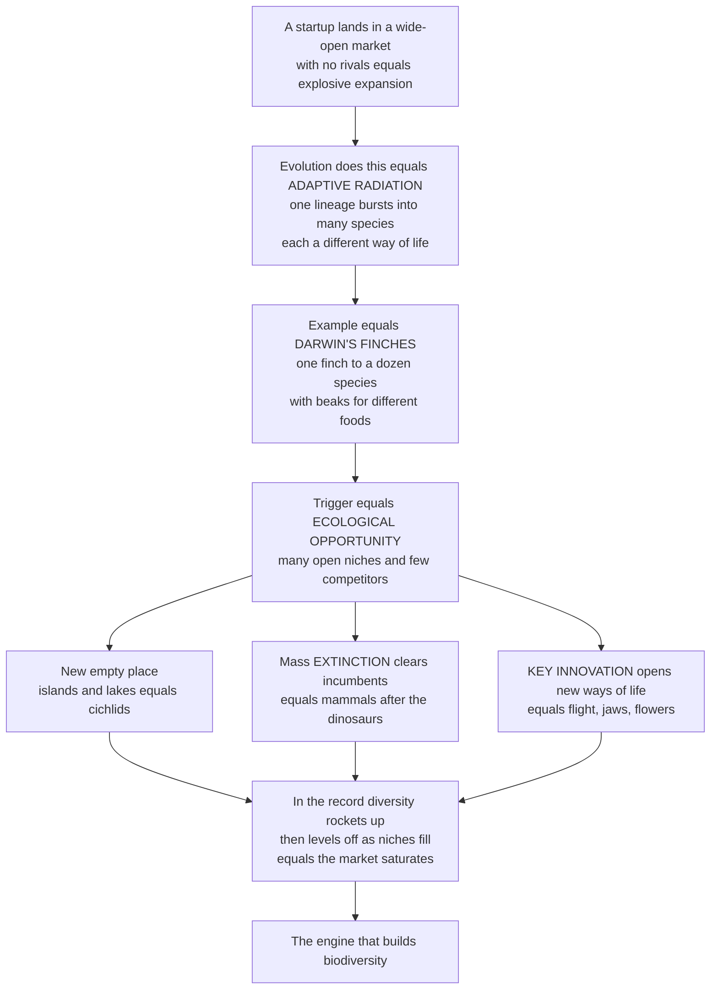

# 🐦 Adaptive Radiations and Diversification

> [!abstract] TL;DR
> An **adaptive radiation** is the **rapid diversification of a single ancestral lineage into many descendant species**, each adapted to a **different ecological niche** — the process that generates most of life's diversity. The trigger is **ecological opportunity**: abundant unused resources and few competitors or predators, which arises in three classic ways — **colonizing a new empty place** (islands and lakes, like Darwin's Galápagos finches or the hundreds of cichlid fish in African lakes), a **mass extinction clearing out the incumbents** (mammals exploding after the dinosaurs fell), or a **key innovation** — a game-changing new trait (flight, jaws, flowers, teeth) that opens whole new ways of living. In the fossil record a radiation looks like a lineage's diversity **rocketing upward and then leveling off** as niches fill and the "market" saturates — the **diversity-dependent slowdown**. Radiations are evolution's creative bursts, refilling and reinventing the living world after every catastrophe and every innovation, and understanding them is understanding the engine that builds biodiversity.

---

## Intuition

**Analogy:** Imagine a single **startup** that suddenly lands in a **wide-open market** with no competitors and unlimited demand. It would **explode** — spinning off product line after product line to grab every niche before rivals appear: a budget version, a premium version, a version for a market nobody else has touched. The empty market rewards *specializing fast*, and the one company fragments into a whole ecosystem of specialized offerings. Then, as the market fills and the last gaps get taken, growth **slows and levels off** — the market saturates, and adding yet another product line no longer pays.

Evolution does exactly this. Drop a single lineage into a world of **unused ecological opportunity** and it undergoes an **adaptive radiation**: it rapidly buds into many species, each earning a living a different way. The textbook case is **Darwin's finches** — one finch species reached the Galápagos, found empty islands full of unused food, and radiated into a dozen species with beaks specialized for crushing seeds, probing flowers, catching insects, even wielding twig tools. The empty market rewarded specialists; the single founder fragmented into an ecosystem of them.

---

## How It Works

### Core Mechanics

An adaptive radiation is **speciation coupled to ecological and phenotypic differentiation** — lineages don't just split, they split *and* diverge to exploit distinct niches. Four hallmark features, following Schluter, diagnose a true adaptive radiation:

1. **Common ancestry.** The species form a single **monophyletic** clade descended from one recent ancestor — the diversity is a *burst from one root*, not a convergence of unrelated lineages.
2. **Phenotype–environment correlation.** Traits track environment: finch beak depth matches available seed hardness; Anolis limb length matches perch diameter. Form maps predictably onto ecological role.
3. **Trait utility.** The divergent traits actually **improve performance** in the niche they match — a deep beak really does crush hard seeds better. Adaptation, not drift, is doing the sorting.
4. **Rapid speciation.** The diversification is **fast** relative to background rates — an early burst, not a slow gradual accumulation.

The **engine** behind all four is **ecological opportunity**: a supply of accessible resources with few competitors and few predators. Opportunity is unlocked three ways:

- **(1) Colonizing new, empty environments.** A lineage disperses into open **ecospace** — an oceanic island, a young lake, a new continent — where niches sit unoccupied. *Galápagos finches, Hawaiian silverswords and honeycreepers, African Great Lakes cichlids* (hundreds of species from a few founders, often driven by novel **pharyngeal jaws**).
- **(2) Extinction of incumbents.** A **mass extinction** removes the dominant groups and **frees niches** ("ecological release"). The survivors radiate into the vacated adaptive zones during the **recovery**. *Placental mammals exploded into large-bodied roles only after the non-avian dinosaurs died at the end-Cretaceous* — the ultimate market disruption.
- **(3) Key innovations.** A lineage evolves a **novel trait** that opens a previously inaccessible way of life — a new **adaptive zone** in Simpson's sense. *Wings (insects, birds, bats), jaws (gnathostomes), flowers (angiosperms), teeth, C4 photosynthesis, cichlid pharyngeal jaws.* The innovation raises **evolvability** and unlocks niche space that was there all along but unreachable.

The **dynamics** in the fossil record follow the **early-burst** model: rapid initial diversification and morphological **disparity**, then a **slowdown**. This slowdown is usually **diversity-dependent** (density-dependent): as ecospace fills, per-lineage **speciation rate falls** and **extinction rate rises**, so net diversification decays and standing diversity approaches an **equilibrium** — a "carrying capacity" of ecospace. This is the logic of **Sepkoski's logistic model** of Phanerozoic marine diversity, and it sits at the heart of the long debate over whether global diversity is **equilibrial** (bounded, saturating) or **expanding** (unbounded).

### Flow / Architecture



---

## Key Concepts

### Secondary (the big idea)
- **One becomes many, fast.** An adaptive radiation is when a single species rapidly gives rise to a *burst* of new species, each suited to a different way of life.
- **Empty opportunity is the spark.** Radiations happen when there is lots of "room" — unused food and habitats and few rivals — so specializing pays off.
- **Darwin's finches.** One finch reached the empty Galápagos islands and became a dozen species with different beaks for different foods — the classic example.
- **It slows down.** As the different "jobs" get filled, the burst of new species slows and the number of species levels off.

### Undergraduate (the mechanisms)
- **Ecological opportunity** = accessible resources + few competitors + few predators. It is the master driver, unlocked by (1) reaching **new/empty environments**, (2) **extinction** of incumbents freeing niches, or (3) **key innovations**.
- **The four diagnostic criteria** (Schluter): common ancestry, phenotype–environment correlation, trait utility, and rapid speciation. All four separate a true adaptive radiation from mere species-richness.
- **Key innovation and adaptive zones.** A novel trait (jaws, flight, flowers, pharyngeal jaws) opens a new **adaptive zone** (Simpson) — a broad new region of ecospace — raising diversification.
- **Niche partitioning and character displacement.** Coexisting radiating species **diverge** in resource use (e.g. beak size), reducing competition — sympatric species differ *more* than allopatric ones (character displacement).
- **Early burst and slowdown.** Diversity and **disparity** rise fast early, then decelerate. On a **lineage-through-time (LTT)** plot this shows as an early steep rise that bends over, versus the straight semilog line of constant-rate diversification.
- **Adaptive vs non-adaptive radiation.** Radiations that diversify *ecologically* are adaptive; radiations that generate many species *without* ecological divergence (e.g. some through geographic isolation alone) are **non-adaptive**.

### Graduate (the debates and subtleties)
- **Diversity-dependence vs unbounded expansion.** Does diversification **decay** as ecospace fills toward an equilibrium (Sepkoski's **logistic** / "kinetic" model, coupled-logistic three-faunas model), or does diversity **expand** without a ceiling? The signal of a slowdown in molecular phylogenies (the "**pull of the recent**", incomplete taxon sampling, and protracted speciation) is genuinely ambiguous, and the equilibrial-vs-expanding debate remains unresolved.
- **Detecting the early burst.** Comparative methods fit models to phenotypic and lineage data — **early-burst (EB)** vs Brownian motion vs Ornstein–Uhlenbeck — but the EB signal is notoriously **weak and hard to recover** from extant data alone; the fossil record often shows early disparity peaks that molecular trees miss.
- **Key innovation: cause or correlation?** A trait shared by a species-rich clade may be a driver *or* a coincidence. Rigorous tests require **sister-clade comparisons** (does the innovation-bearing clade repeatedly out-diversify its sister?) and state-dependent diversification models (**BiSSE/HiSSE**), which have their own well-known **false-positive** problems.
- **Ecological opportunity is multi-dimensional.** Opportunity can be **extrinsic** (empty islands, post-extinction vacancies) or **intrinsic** (an innovation), and the two interact: cichlid pharyngeal jaws (intrinsic) *plus* young lakes (extrinsic) together produce the most explosive radiations.
- **Radiations and tree shape.** Radiations imprint on **phylogenetic tree balance** and **branch-length** distributions; declining diversification and clade "old age" (senescence) shape the standing biodiversity we inherit. The interplay of **opportunity, innovation, and extinction** is what ultimately structures the tree of life.
- **Replicated radiations.** *Anolis* lizards independently evolved the same set of **ecomorphs** (trunk-ground, twig, crown-giant) on different Greater Antillean islands — evidence that radiation into niche space is **deterministic and predictable**, not purely contingent.

---

## Python Demo

```python
# Adaptive radiation & diversification, illustrated with numpy + matplotlib:
#   (A) DIVERSITY-DEPENDENT RADIATION -- species number rises fast then
#       DECELERATES toward a diversity equilibrium (a "carrying capacity"
#       of ecospace), vs. unconstrained exponential diversification.
#   (B) LINEAGE-THROUGH-TIME (LTT) -- the same two models on a log axis:
#       diversity-dependence bends over (EARLY BURST + slowdown), while
#       constant-rate diversification is a straight semilog line.
#   (C) NICHE FILLING -- a radiation partitions a resource axis: one
#       ancestor spreads into several species with distinct, minimally
#       overlapping niches (character displacement / niche packing).
#   (D) KEY-INNOVATION / EXTINCTION RELEASE -- a trigger jumps the net
#       diversification RATE, accelerating diversity (rate before vs after).
import numpy as np
import matplotlib.pyplot as plt

rng = np.random.default_rng(42)

# --- (A) diversity-dependent vs exponential diversification ----------------
t = np.linspace(0, 20, 400)          # time since the radiation began (Myr)
N0, r, K = 2.0, 0.55, 120.0          # start, intrinsic rate, ecospace ceiling
# Logistic = diversity-dependent: speciation slows & extinction rises as
# ecospace fills, so N approaches the equilibrium K.
N_dd = K / (1.0 + (K / N0 - 1.0) * np.exp(-r * t))
# Exponential = unconstrained: no ceiling, runaway diversity.
N_exp = N0 * np.exp(0.28 * t)

# --- (C) niche filling along a resource axis -------------------------------
axis = np.linspace(0, 10, 500)       # a resource axis, e.g. seed size / beak
def util(mu, sd):                    # a species' resource-utilization curve
    return np.exp(-0.5 * ((axis - mu) / sd) ** 2)
ancestor = util(5.0, 1.6)            # single generalist ancestor (dashed)
niches = [1.4, 3.3, 5.0, 6.7, 8.6]   # descendant niche optima after radiation
sd = 0.75                            # narrower -> specialists (displacement)

# --- (D) key-innovation / extinction "release" rate jump -------------------
tt = np.linspace(0, 30, 400)
trigger = 12.0                       # a key innovation OR mass-extinction release
r_before, r_after = 0.06, 0.25       # net diversification rate jumps up
D = np.where(tt <= trigger,
             np.exp(r_before * tt),
             np.exp(r_before * trigger) * np.exp(r_after * (tt - trigger)))

# ---------------------------------------------------------------------------
fig, ax = plt.subplots(2, 2, figsize=(13, 9))

# A: diversity-dependent radiation vs exponential
axA = ax[0, 0]
axA.plot(t, N_dd, color='crimson', lw=2.4,
         label='Diversity-dependent (radiation slowdown)')
axA.plot(t, N_exp, color='steelblue', lw=2.0, ls='--',
         label='Exponential (unconstrained)')
axA.axhline(K, color='gray', ls=':', lw=1.5, label='diversity equilibrium K')
axA.set_ylim(0, 1.4 * K)
axA.set_title('A. Radiation rockets up, then levels off as niches fill')
axA.set_xlabel('time since radiation began (Myr)')
axA.set_ylabel('number of species')
axA.legend(fontsize=8, loc='upper left')

# B: lineage-through-time (semilog) -- early-burst signature
axB = ax[0, 1]
axB.semilogy(t, N_dd, color='crimson', lw=2.4, label='Diversity-dependent')
axB.semilogy(t, N_exp, color='steelblue', lw=2.0, ls='--', label='Constant-rate')
axB.set_title('B. LTT plot: early burst bends over vs. straight line')
axB.set_xlabel('time (Myr)')
axB.set_ylabel('log lineages (LTT)')
axB.legend(fontsize=8, loc='lower right')

# C: niche filling / character displacement on a resource axis
axC = ax[1, 0]
axC.plot(axis, ancestor, color='black', lw=1.6, ls='--',
         label='single ancestor (generalist)')
colors = plt.cm.viridis(np.linspace(0.15, 0.9, len(niches)))
for mu, c in zip(niches, colors):
    axC.fill_between(axis, util(mu, sd), color=c, alpha=0.55)
    axC.plot(axis, util(mu, sd), color=c, lw=1.6)
axC.set_title('C. Radiation partitions the resource axis into specialists')
axC.set_xlabel('resource axis (e.g. seed size / beak depth)')
axC.set_ylabel('resource use')
axC.legend(fontsize=8, loc='upper right')

# D: key-innovation / extinction-release rate jump
axD = ax[1, 1]
axD.plot(tt, D, color='darkgreen', lw=2.4)
axD.axvline(trigger, color='orange', ls='--', lw=1.8)
axD.set_yscale('log')
axD.annotate('slow background\ndiversification',
             xy=(6, D[np.argmin(np.abs(tt - 6))]), xytext=(1, 6),
             fontsize=8, arrowprops=dict(arrowstyle='->', color='gray'))
axD.annotate('KEY INNOVATION or\nEXTINCTION RELEASE\n-> rate jumps',
             xy=(trigger, np.exp(r_before * trigger)), xytext=(13.5, 1.5),
             fontsize=8, arrowprops=dict(arrowstyle='->', color='orange'))
axD.set_title('D. A trigger jumps the diversification rate')
axD.set_xlabel('time (Myr)')
axD.set_ylabel('log diversity')

plt.tight_layout()
plt.savefig('adaptive_radiation.png', dpi=120)

# Quantitative takeaways
half_K_time = t[np.argmin(np.abs(N_dd - K / 2))]
rate_ratio = r_after / r_before
print(f"Diversity-dependent radiation reaches half of K at ~{half_K_time:.1f} Myr")
print(f"By 20 Myr: diversity-dependent = {N_dd[-1]:.0f} species (near K={K:.0f}),"
      f" exponential = {N_exp[-1]:.0f} and still climbing")
print(f"Post-trigger diversification rate is {rate_ratio:.1f}x the background rate")
```

Running it makes the pattern quantitative. In Panel A the **diversity-dependent** radiation shoots up and then **saturates near the equilibrium K**, while the unconstrained exponential model never stops climbing — the difference between a market that fills and one that does not. Panel B shows the same on a log axis: the diversity-dependent curve **bends over** (the early-burst-plus-slowdown signature paleobiologists look for in **lineage-through-time** plots), whereas constant-rate diversification is a straight semilog line. Panel C shows a single generalist ancestor **fragmenting into specialists** that tile a resource axis with minimal overlap (**character displacement / niche packing**). Panel D shows a **key innovation or mass-extinction release** jumping the net diversification rate several-fold, accelerating diversity at a stroke.

---

## Real-World Applications

- **Reconstructing island and lake radiations.** The workhorse system of evolutionary biology: **Darwin's Galápagos finches** (beak depth tracking seed hardness, measured in real time by the Grants), **Hawaiian honeycreepers and silverswords**, and **African Great Lakes cichlids** (Victoria, Malawi, Tanganyika) — model systems for how empty ecospace drives explosive speciation.
- **Reading deep-time radiations in the fossil record.** The **Cambrian explosion**, the **Great Ordovician Biodiversification Event**, and the **post-Cretaceous mammal radiation** are quantified with diversity-through-time curves, disparity analyses, and diversity-dependence models — the paleobiological core of macroevolution.
- **Conservation and biodiversity hotspots.** Recent radiations (cichlids, Andean and Hawaiian plants) are **evolutionarily young, ecologically fragile biodiversity hotspots**; understanding niche-filling and diversity-dependence informs where richness concentrates and how vulnerable it is to habitat loss and invasion.
- **Comparative-methods software.** Diversity-dependent and early-burst models are fit routinely in phylogenetics packages (e.g. state-dependent diversification and trait-evolution models) to test **key-innovation** and **ecological-opportunity** hypotheses across the tree of life.
- **Predicting evolutionary repeatability.** Replicated **Anolis ecomorphs** across Caribbean islands show radiations can be **deterministic**, informing how we anticipate evolutionary responses to new opportunity — including rapid adaptation to human-made environments.

---

## Common Pitfalls

- **Equating "many species" with "adaptive radiation."** Species-richness alone is not enough. A true adaptive radiation needs **ecological divergence** (phenotype–environment correlation, trait utility) — otherwise it is a **non-adaptive** radiation. Test all four Schluter criteria.
- **Assuming a rich clade's shared trait *caused* the radiation.** A **key innovation** must be demonstrated, not assumed — ideally by **sister-clade comparison** showing the trait-bearing clade repeatedly out-diversifies its sister. Correlation is not causation, and state-dependent diversification tests have real false-positive rates.
- **Reading a phylogenetic slowdown as proof of diversity-dependence.** Apparent slowdowns can be artifacts of **incomplete sampling**, the **pull of the recent**, or **protracted speciation**. The equilibrial-vs-expanding-diversity debate is not settled by a bent LTT plot alone.
- **Ignoring extinction.** Radiations are shaped as much by **who dies** as by who speciates. Diversity-dependence works partly through **rising extinction** as ecospace fills, and mass extinctions are what open the opportunity in the first place — a diversity curve without extinction is only half the story.
- **Forgetting the fossil record's biases.** Early **disparity** peaks and true diversity dynamics are often visible only in fossils, not molecular trees. Sampling, preservation, and time-averaging distort raw counts — interpret radiations alongside the record's known biases.
- **Treating triggers as mutually exclusive.** Empty environments, extinction release, and key innovations often act **together** (e.g. cichlid pharyngeal jaws *and* young lakes). The most explosive radiations combine intrinsic and extrinsic opportunity.

---

## Related Concepts

- [[Speciation_and_Macroevolution]] — adaptive radiation is speciation *plus* ecological divergence writ large; it is the canonical macroevolutionary pattern that builds higher taxa and standing diversity.
- [[Natural_Selection_and_Adaptation]] — the phenotype–environment matching and trait utility that define a radiation are natural selection sorting lineages into niches.
- [[Competition_and_Niche_Theory]] — ecological opportunity, niche partitioning, and character displacement are the community-ecology mechanics that drive and then throttle a radiation.
- [[Biodiversity_and_Species_Richness]] — radiations are the *generative* source of the species richness (and the diversity-dependent ceilings) that biodiversity metrics quantify.
- [[Habitat_Loss_Fragmentation_and_Island_Biogeography]] — island biogeography supplies the empty-ecospace, colonization, and equilibrium logic behind island and lake radiations.
- [[Natural_Selection_and_Adaptation]] and the fossil-record view connect to the broad sweep in [[The_History_of_Life_on_Earth]] — deep-time radiations (Cambrian, Ordovician, post-K-Pg mammals) are chapters in that history.
- [[Phylogenetics_and_the_Tree_of_Life]] — radiations imprint on tree shape, branch lengths, and LTT plots, which are how diversification models are tested.

Within this vault (siblings): this note is the diversification half of the macroevolution story developed alongside **Macroevolution_and_Deep_Time_Patterns**; it exemplifies the disparity-first radiation of **The_Cambrian_Explosion**; and it is the creative counterpart to **Extinction_as_an_Evolutionary_Force** and **Recovery_and_Radiation_After_Extinction** (mass extinctions open the ecological opportunity that recovery radiations exploit), while feeding into the long-run signal captured by **Evolutionary_Trends_and_Convergence**.

---

## Review Questions

1. **(Secondary)** In your own words, what is an adaptive radiation, and why did Darwin's finches diversify into so many species on the Galápagos rather than staying one species?
2. **(Secondary/Undergraduate)** Name the three situations that create "ecological opportunity," giving one real example of each (an empty place, a mass extinction, and a key innovation).
3. **(Undergraduate)** List Schluter's four diagnostic criteria for an adaptive radiation. Why isn't "a clade with lots of species" by itself enough to call something an adaptive radiation?
4. **(Undergraduate)** Explain **diversity-dependent diversification**. On a lineage-through-time plot, how does a diversity-dependent radiation look different from constant-rate diversification, and why?
5. **(Graduate)** A clade with a distinctive trait (say, a novel jaw) is unusually species-rich. Describe how you would test whether that trait is a genuine **key innovation** rather than a coincidence, and name one statistical pitfall of such tests.
6. **(Graduate)** Summarize the **equilibrial-vs-expanding diversity** debate. What is Sepkoski's logistic model claiming, and why is an apparent slowdown in a molecular phylogeny *not* decisive evidence for a diversity ceiling?

---

## Sources

- Schluter, D. (2000). *The Ecology of Adaptive Radiation*. Oxford University Press. [Publisher](https://global.oup.com/academic/product/the-ecology-of-adaptive-radiation-9780198505235)
- Simpson, G. G. (1944). *Tempo and Mode in Evolution*. Columbia University Press. [Publisher](https://cup.columbia.edu/book/tempo-and-mode-in-evolution/9780231058476)
- Grant, P. R. & Grant, B. R. (2008). *How and Why Species Multiply: The Radiation of Darwin's Finches*. Princeton University Press. [Publisher](https://press.princeton.edu/books/paperback/9780691149998/how-and-why-species-multiply)
- Sepkoski, J. J. (1978). "A kinetic model of Phanerozoic taxonomic diversity I. Analysis of marine orders." *Paleobiology*, 4(3), 223–251. [DOI](https://doi.org/10.1017/S0094837300005972)
- Losos, J. B. (2010). "Adaptive Radiation, Ecological Opportunity, and Evolutionary Determinism." *The American Naturalist*, 175(6), 623–639. [DOI](https://doi.org/10.1086/652433)

---

#paleontology #adaptive-radiation #diversification #ecological-opportunity #key-innovation
