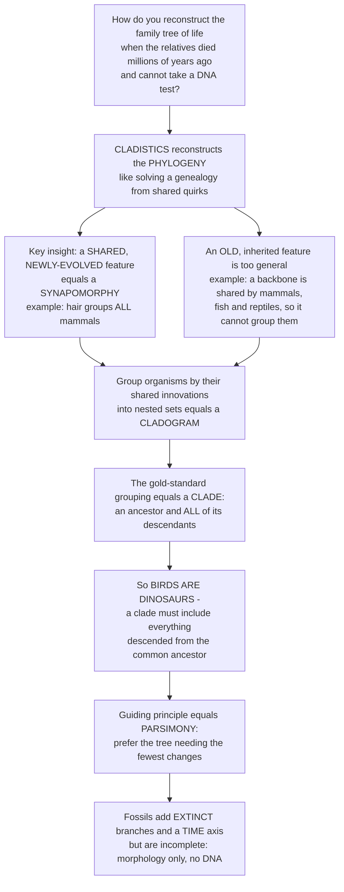

# 🦴 Cladistics and Fossil Phylogeny

> [!abstract] TL;DR
> **Cladistics** (phylogenetic systematics, founded by Willi Hennig) is the rigorous method paleontologists use to reconstruct the branching **phylogeny** — the tree of common descent — from organisms that died millions of years ago and left no DNA. Its core logic is that only a **shared, newly-evolved feature (a synapomorphy** — like the hair that unites all mammals**)** reveals genuine relationship, while an old, general feature inherited from deep ancestry **(a symplesiomorphy** — like a backbone**)** is uninformative for grouping. Sorting characters this way groups organisms into nested sets — a **cladogram** — and the only "natural" groups are **clades (monophyletic groups: an ancestor plus *all* its descendants)**, which is exactly why **birds are dinosaurs**. Trees are chosen by **parsimony** (Occam's razor: fewest evolutionary changes) or by model-based **likelihood/Bayesian** methods. Fossils contribute what living taxa never can: **extinct branches**, character combinations no survivor preserves, and a **time axis** that calibrates when lineages split — at the cost of being incomplete, morphology-only evidence.

---

## Intuition

**Analogy — solving a family tree from shared quirks, when every relative is long dead.** Imagine you must reconstruct a large family's genealogy, but everyone is deceased and no DNA test is possible — all you have are old portraits (fossils: just bones, no genes). How do you tell who is related to whom? You look for shared *traits* — but here is the crucial insight that makes cladistics work: **not all shared traits are equally useful.** A trait that *everyone* has — "has a nose," or in biology "has a backbone" — is far too general; it was inherited from way back and groups no one, because mammals and fish and reptiles all share it. What actually reveals a genuine relationship is a **shared, newly-evolved quirk**: a distinctive dimpled chin, an unusual streak of white hair, that appeared *once* in a recent ancestor and was passed down to *all and only* their descendants.

Biology's version of that white-hair streak is literal **hair itself**. Hair is an evolutionary novelty that arose once, in the common ancestor of mammals; so *all and only* mammals have hair, which is precisely why hair groups mammals together. Cladistics is the disciplined practice of sorting features into these two bins — useless-because-ancient versus informative-because-newly-shared — and then assembling organisms into **nested sets** by their shared innovations. The nested sets form a branching diagram, a **cladogram**. The gold-standard grouping is a **clade**: an ancestor and *all* of its descendants — a complete, unbroken branch of the tree, such as "all mammals" or "birds together with all dinosaurs." This is why paleontologists insist that **birds are dinosaurs** and that **humans are apes** (and, further back, bony fish): a clade, by definition, must contain *everything* descended from the common ancestor — you are not allowed to snip a twig off and call the rest a natural group. When traits conflict (two lineages independently evolve a lookalike feature — **convergence**), the tie-breaker is **parsimony**, Occam's razor: prefer the tree that requires the fewest evolutionary changes. Fossils bring the one thing living organisms cannot — a **time axis** and a view of the **extinct branches** — even though they force us to work from anatomy alone.

---

## How It Works

### Core Mechanics

1. **Read the tree first.** A phylogeny has **tips** (terminal taxa — species or fossils), **internal nodes** (hypothetical most-recent common ancestors), **branches** (lineages through time), and a **root** (the deepest ancestor, whose position is set by an **outgroup**). Two lineages sharing an immediate node are **sister groups**. A tree is a *hypothesis* of genealogy, not a fact to be memorized.
2. **Polarize the characters with an outgroup.** For each character you must know which state is **ancestral (plesiomorphic)** and which is **derived (apomorphic)**. Comparing to an **outgroup** — a relative known to lie outside the group of interest — tells you the direction of change.
3. **Sort the characters by their evidential value.** A **synapomorphy** (shared derived state) is *evidence of common ancestry* and defines a clade. A **symplesiomorphy** (shared *ancestral* state) is real but uninformative *for that group*. An **autapomorphy** (a novelty unique to one tip) says nothing about grouping. **Homoplasy** (convergence, parallelism, or reversal) is a derived similarity *not* inherited from a shared ancestor — misleading noise.
4. **Build the character matrix.** Rows are taxa (including the outgroup), columns are characters, cells are coded states (often binary 0/1). This matrix is the raw data of the analysis.
5. **Score every candidate tree by length.** For a given topology, count the **minimum number of state changes** each character requires (via Fitch's algorithm), and sum across characters — the tree's **length**. Homoplastic characters are forced to change more than once and inflate the length.
6. **Choose by parsimony.** The **most parsimonious tree** (shortest length, fewest total changes) is preferred — Occam's razor made quantitative. Model-based **maximum likelihood** and **Bayesian** methods pick trees by probability under an explicit model of change instead, and dominate for molecular data.
7. **Add fossils and time.** Fossils supply **minimum divergence ages** (a lineage must be at least as old as its earliest fossil), reveal **extinct branches** and impossible-to-infer character mosaics, and break up long branches. **Tip-dating / total-evidence** analyses fold morphology, molecules, and fossil ages into a single **time-calibrated** tree.

### Flow / Architecture



---

## Key Concepts

### Secondary (intuition and vocabulary)

- **Phylogeny / tree of life** — the branching pattern of evolutionary relationships produced by **common descent**; every split is a speciation event, every tip a lineage we can name.
- **Synapomorphy = the key to grouping** — a *shared, newly-evolved* trait (hair for mammals, feathers for birds, the amniotic egg for reptiles+birds+mammals). Only these reveal relationship.
- **Symplesiomorphy = the trap** — a *shared but ancient* trait (a backbone, four limbs) inherited from far back; true, but useless for telling members of a group apart.
- **Clade** — an ancestor **plus all its descendants**, one complete branch. "All mammals," "birds + all dinosaurs," "all apes including humans." Clades are the only *natural* groups.
- **Why birds are dinosaurs** — birds descend from theropod dinosaurs, so any *natural* group "Dinosauria" must include them; excluding birds would break the clade rule.

### Undergraduate (the method)

- **Character logic, in full** — **synapomorphy** (shared derived: evidence) vs **symplesiomorphy** (shared ancestral: uninformative) vs **autapomorphy** (unique derived: no grouping power) vs **homoplasy** (convergence/parallelism/reversal: false signal). The same trait can be a synapomorphy at one level and a symplesiomorphy at a deeper one — "having a backbone" groups vertebrates but not mammals-within-vertebrates.
- **Polarity and the outgroup** — an outgroup roots the tree and tells you which state is derived; without it, a cladogram is unrooted and directionless.
- **Kinds of groups** — **Monophyletic** (a clade: ancestor + *all* descendants — natural); **Paraphyletic** (ancestor + *some* descendants — "Reptilia" excluding birds, "fish," "invertebrates" — convenient but not natural); **Polyphyletic** (assembled from convergence, e.g., "warm-blooded animals" = birds + mammals — outright wrong).
- **Parsimony and tree length** — the shortest tree (fewest changes) wins; the **consistency index** measures how much homoplasy a dataset carries (1.0 = perfectly congruent, lower = more convergence).
- **Support and consensus** — **bootstrapping** resamples characters to gauge how robust each clade is; **consensus trees** summarize many equally-good trees; conflicting signal produces poorly-supported nodes.

### Graduate (inference, integration, pathologies)

- **Model-based inference** — **maximum likelihood** and **Bayesian** methods evaluate trees under explicit substitution models (rates, among-site variation), dominant for molecular data and increasingly for morphology (Mk models). Parsimony can be *statistically inconsistent* under some conditions.
- **Long-branch attraction** — rapidly-evolving or poorly-sampled lineages accumulate independent changes that *look* like shared derived states; parsimony can be actively misled, artificially grouping long branches. Fossils help by **breaking long branches** into shorter, sampled segments.
- **Stem vs crown groups** — the **crown group** is the smallest clade containing all *living* members and their last common ancestor; the **stem group** is the paraphyletic array of extinct relatives *outside* the crown but closer to it than to any other crown group. Fossils populate the stem and document the *sequence* of character acquisition (the tetrapod, bird, whale, and mammal transitions as character-by-character assembly, not single leaps).
- **Molecular clocks and date conflict** — divergence times estimated from genetic distance (**molecular clocks**) frequently *predate* the oldest fossils; reconciling "rocks and clocks" is a central problem, since fossils give hard **minimum** ages while clocks estimate the *actual* split.
- **Total-evidence / tip-dating** — a Bayesian framework that jointly analyzes molecular sequences (of living taxa), morphology (of living *and* fossil taxa), and fossil ages, placing fossils as dated tips and yielding fully **time-scaled** trees; the modern gold standard for integrating paleontology with molecular phylogenetics.
- **Ghost lineages** — when the tree implies a lineage existed before its oldest known fossil, the gap between the two is a **ghost lineage**: a testable prediction that older fossils await discovery, and a diagnostic of the fossil record's incompleteness.

---

## Python Demo

```python
# Cladistics and fossil phylogeny, hand-rolled with numpy + matplotlib.
#   Panel (a) PARSIMONY: score candidate trees from a morphological character
#             matrix by tree LENGTH (Fitch's algorithm); the shortest tree
#             recovers the true clades and exposes a homoplasy (convergence).
#   Panel (b) TIME-CALIBRATION: hang the winning topology on a geological time
#             axis using fossil first-appearance dates; the tree implies
#             GHOST LINEAGES (intervals a lineage must have existed but has no
#             fossils) -- the paleontologist's unique contribution.
import numpy as np
import matplotlib.pyplot as plt

# ---- Taxa (index order) and a binary character matrix (0 = ancestral, 1 = derived) ----
taxa = ["Outgroup", "Shark", "Salamander", "Lizard", "Bird", "Mammal"]
#                                   OG  Sh  Sa  Li  Bi  Ma
char_matrix = np.array([
    [0, 1, 1, 1, 1, 1],   # jaws            (jawed vertebrates)
    [0, 0, 1, 1, 1, 1],   # tetrapod_limbs  (four-limbed land vertebrates)
    [0, 0, 0, 1, 1, 1],   # amniotic_egg    (Amniota)
    [0, 0, 0, 1, 1, 0],   # diapsid_skull   (true synapomorphy: Lizard + Bird)
    [0, 0, 0, 1, 1, 0],   # scaly_skin      (true synapomorphy: Lizard + Bird)
    [0, 0, 0, 0, 0, 1],   # hair            (mammal novelty)
    [0, 0, 0, 0, 1, 0],   # feathers        (bird novelty)
    [0, 0, 0, 0, 1, 1],   # endothermy      (HOMOPLASY: convergent Bird + Mammal)
], dtype=int)
char_names = ["jaws", "tetrapod_limbs", "amniotic_egg", "diapsid_skull",
              "scaly_skin", "hair", "feathers", "endothermy"]

# ---- Trees as nested tuples of leaf indices; leaves are ints ----
T_correct = (0, (1, (2, (5, (3, 4)))))   # OG,(Shark,(Salamander,(Mammal,(Lizard,Bird))))
T_endo    = (0, (1, (2, (3, (5, 4)))))   # groups Mammal+Bird by endothermy (wrong)
T_shuffle = (0, (2, (1, (5, (3, 4)))))   # Shark and Salamander swapped (wrong)

def fitch(tree, states):
    """Fitch small-parsimony: return (state_set, min changes) for one character."""
    if isinstance(tree, int):
        return {states[tree]}, 0
    left, right = tree
    ls, lc = fitch(left, states)
    rs, rc = fitch(right, states)
    inter = ls & rs
    if inter:
        return inter, lc + rc          # states agree, no extra change
    return ls | rs, lc + rc + 1        # disagreement forces one change

def char_changes(tree, states):
    """Minimum changes a single character needs on this tree."""
    return fitch(tree, states)[1]

def tree_length(tree, matrix):
    """Total changes summed over all characters = the tree's parsimony length."""
    return sum(char_changes(tree, matrix[c]) for c in range(matrix.shape[0]))

print("Parsimony scores (tree length = total evolutionary changes):")
for name, T in [("correct  (Lizard,Bird) clade", T_correct),
                ("endo-grouped (Mammal,Bird)  ", T_endo),
                ("shuffled outgroup order     ", T_shuffle)]:
    print(f"  {name}: length = {tree_length(T, char_matrix)}")

best = min([T_correct, T_endo, T_shuffle], key=lambda T: tree_length(T, char_matrix))
print("Most parsimonious tree recovers the (Lizard, Bird) clade:", best == T_correct)
print("On the best tree:  diapsid_skull changes =",
      char_changes(best, char_matrix[3]), "(clean SYNAPOMORPHY, 1 origin)")
print("                   endothermy    changes =",
      char_changes(best, char_matrix[7]), "(HOMOPLASY, evolved twice)")

# ---- Layout helpers (shared leaf order) ----
def leaves_of(tree):
    if isinstance(tree, int):
        return frozenset([tree])
    return leaves_of(tree[0]) | leaves_of(tree[1])

def leaf_order(tree, out):
    if isinstance(tree, int):
        out.append(tree)
    else:
        leaf_order(tree[0], out); leaf_order(tree[1], out)
    return out

order = leaf_order(best, [])
leaf_y = {leaf: i for i, leaf in enumerate(order)}

def node_y(tree):
    if isinstance(tree, int):
        return leaf_y[tree]
    return 0.5 * (node_y(tree[0]) + node_y(tree[1]))

def depth_map(tree, d, dm):
    dm[leaves_of(tree)] = d
    if not isinstance(tree, int):
        depth_map(tree[0], d + 1, dm); depth_map(tree[1], d + 1, dm)
    return dm

dm = depth_map(best, 0, {})
max_depth = max(dm[frozenset([l])] for l in order)

fig, (ax1, ax2) = plt.subplots(1, 2, figsize=(14, 5.5))

# ---- Panel (a): parsimony cladogram (left = root, right = tips) ----
def draw_clado(ax, tree, depth):
    y = node_y(tree)
    if isinstance(tree, int):
        ax.text(max_depth + 0.1, y, taxa[tree], va="center", fontsize=10, fontweight="bold")
        return max_depth, y
    l, r = tree
    xl, yl = draw_clado(ax, l, depth + 1)
    xr, yr = draw_clado(ax, r, depth + 1)
    x = depth
    ax.plot([x, x], [yl, yr], color="#333", lw=1.6)              # vertical connector
    ax.plot([x, max_depth if isinstance(l, int) else depth + 1], [yl, yl], color="#333", lw=1.6)
    ax.plot([x, max_depth if isinstance(r, int) else depth + 1], [yr, yr], color="#333", lw=1.6)
    return x, y

draw_clado(ax1, best, 0)
# Annotate the SYNAPOMORPHY that unites Lizard + Bird and the HOMOPLASY that misleads.
ax1.scatter([max_depth - 0.5], [node_y((3, 4))], s=140, marker="s", color="#2a9d8f", zorder=5)
ax1.annotate("diapsid_skull + scaly_skin\nSYNAPOMORPHY (1 origin)\nunites Lizard + Bird",
             xy=(max_depth - 0.5, node_y((3, 4))), xytext=(0.4, 3.15),
             fontsize=8, color="#2a9d8f",
             arrowprops=dict(arrowstyle="->", color="#2a9d8f"))
ax1.scatter([max_depth - 0.3, max_depth - 0.3], [leaf_y[4], leaf_y[5]],
            s=90, marker="o", color="#e76f51", zorder=5)
ax1.annotate("endothermy = HOMOPLASY\n(evolved TWICE, in Bird and Mammal)",
             xy=(max_depth - 0.3, leaf_y[4]), xytext=(0.4, 4.55),
             fontsize=8, color="#e76f51",
             arrowprops=dict(arrowstyle="->", color="#e76f51"))
ax1.set_title("(a) Most-parsimonious cladogram\n(fewest changes = Occam's razor)")
ax1.set_xlim(-0.3, max_depth + 1.6); ax1.set_ylim(-0.6, len(order) - 0.2)
ax1.axis("off")

# ---- Panel (b): time-calibrated tree with fossil first-appearances + ghost lineages ----
node_time = {                       # divergence times (Ma before present)
    leaves_of((3, 4)): 260,         # Lizard/Bird split (sauropsid)
    leaves_of((5, (3, 4))): 320,    # Amniota (Mammal vs reptiles)
    leaves_of((2, (5, (3, 4)))): 360,
    leaves_of((1, (2, (5, (3, 4))))): 460,
    leaves_of(best): 540,           # root
}
first_appearance = {0: 520, 1: 430, 2: 310, 3: 240, 4: 150, 5: 225}  # oldest fossil (Ma)

def draw_time(ax, tree):
    if isinstance(tree, int):
        return leaf_y[tree]
    l, r = tree
    yl = draw_time(ax, l); yr = draw_time(ax, r)
    tN = node_time[leaves_of(tree)]
    ax.plot([tN, tN], [yl, yr], color="#264653", lw=1.6)   # vertical connector at split time
    for child, yc in ((l, yl), (r, yr)):
        if isinstance(child, int):
            fa = first_appearance[child]
            ax.plot([tN, fa], [yc, yc], color="#e76f51", lw=1.4, ls="--")  # ghost lineage
            ax.plot([fa, 0], [yc, yc], color="#2a9d8f", lw=5, solid_capstyle="butt")  # observed
            ax.scatter([fa], [yc], s=45, color="#264653", zorder=5)  # first fossil
            ax.text(-8, yc, taxa[child], va="center", ha="left", fontsize=10, fontweight="bold")
        else:
            ax.plot([tN, node_time[leaves_of(child)]], [yc, yc], color="#264653", lw=1.4)
    return node_y(tree)

draw_time(ax2, best)
# Highlight the biggest ghost lineage (the bird lineage: implied since 260 Ma, first fossil 150 Ma).
ax2.annotate("GHOST LINEAGE (110 Myr)\ntree implies birds since 260 Ma,\noldest bird fossil is 150 Ma",
             xy=(205, leaf_y[4]), xytext=(360, leaf_y[4] + 0.9), fontsize=8, color="#e76f51",
             arrowprops=dict(arrowstyle="->", color="#e76f51"))
ax2.set_title("(b) Time-calibrated tree\n(solid = observed fossil range, dashed = ghost lineage)")
ax2.set_xlabel("Time (Ma before present)")
ax2.set_xlim(560, -70); ax2.set_ylim(-0.6, len(order) - 0.2)  # invert: older on the left
ax2.set_yticks([])
for spine in ["top", "left", "right"]:
    ax2.spines[spine].set_visible(False)

plt.tight_layout()
plt.savefig("cladistics_fossil_phylogeny.png", dpi=120)
print("Saved cladistics_fossil_phylogeny.png")
```

**What it shows.** Panel (a) proves the method mechanically: three candidate trees are scored by their **length** (total character changes via Fitch parsimony), and the shortest one recovers the real clade — *(Lizard, Bird)* united by the **diapsid-skull/scaly-skin synapomorphies** — while exposing **endothermy** as a **homoplasy** that had to evolve twice (once in birds, once in mammals) and would have grouped them falsely. Panel (b) adds what only fossils can: a **geological time axis**. Hanging the same topology on fossil first-appearance dates reveals **ghost lineages** — the dashed intervals where the tree *demands* a lineage existed but no fossil is yet known (the bird lineage's 110-Myr gap between its implied 260-Ma origin and the 150-Ma *Archaeopteryx*), a concrete, testable prediction of where to dig next.

---

## Real-World Applications

- **Bird origins (the flagship result).** Decades of cladistic analysis of theropod dinosaurs recovered birds *nested inside* Dinosauria, with feathers, the wishbone (furcula), hollow bones, and the semilunate wrist appearing sequentially down the theropod stem — the textbook case of a major transition assembled character-by-character. It is why every rigorous classification states, flatly, that **birds are dinosaurs**.
- **The dinosaur family tree itself.** Modern **total-evidence** and large morphological matrices are used to test the century-old Saurischia/Ornithischia split (e.g., the Baron, Norman & Barrett 2017 *Ornithoscelida* hypothesis), showing that even the deepest dinosaur relationships are living, data-driven hypotheses re-scored as new fossils appear.
- **Whale evolution from land mammals.** Cladistic placement of *Pakicetus*, *Ambulocetus*, *Rodhocetus*, and *Basilosaurus* documents the stepwise loss of hindlimbs and the migration of the nostril — a stem-group sequence impossible to infer from living whales alone.
- **Rocks-and-clocks calibration.** Divergence-dating pipelines across all of biology use fossil first-appearances as **minimum-age calibrations** on nodes (the Donoghue & Benton program), reconciling molecular-clock estimates with the hard evidence of the fossil record.
- **Conservation and classification.** Because only **monophyletic** groups are natural, cladistics reforms taxonomy — abandoning paraphyletic waste-baskets like "Reptilia (excluding birds)," "fish," and "invertebrates" — and underpins phylogenetic measures of biodiversity used to prioritize which lineages to protect.

---

## Common Pitfalls

- **Confusing overall similarity with relationship.** Two organisms can look alike through **convergence** (homoplasy) rather than shared ancestry — sharks and dolphins are streamlined lookalikes but sit in utterly different clades. Cladistics groups by *shared derived* traits, not by resemblance; forgetting this rebuilds the pre-Hennig "fish" mistake.
- **Treating a symplesiomorphy as evidence.** "They both have backbones, so they're closely related" is the classic error: a backbone is *ancestral* for the whole group and therefore uninformative *within* it. A character is only a synapomorphy *at the level where it first arose*.
- **Defending paraphyletic groups out of habit.** "Reptiles" (minus birds), "apes" (minus humans), and "fish" feel intuitive but are **paraphyletic** — an ancestor plus *some* descendants — and are not natural clades. The discomfort of "you are a fish" is a *feature* of the logic, not a bug.
- **Trusting a tree without checking support.** A single most-parsimonious topology can hide weakly-supported nodes; without **bootstrap** values or a **consensus** across equally-good trees, a confident-looking cladogram may be an artifact.
- **Ignoring long-branch attraction.** Fast-evolving or under-sampled taxa can be yanked together by parsimony purely from independent change. Denser taxon sampling — often via **fossils that break long branches** — is the cure.
- **Reading fossil ages as exact split times.** A fossil gives a **minimum** age for a lineage, never the true divergence; the tree's implied **ghost lineages** mean the real split is older. Conflating "oldest fossil" with "origin of the clade" corrupts every downstream date.

---

## Related Concepts

- [[Phylogenetics_and_the_Tree_of_Life]] — the Biology companion note covering the general and *molecular* angle (three domains, sequence-based trees); this paleontology note is the fossil-and-morphology counterpart to it.
- [[Evidence_for_Evolution]] — nested hierarchy and shared derived characters are among the strongest lines of evidence that cladistics formalizes.
- [[Speciation_and_Macroevolution]] — the nodes of a cladogram *are* speciation events; cladistics supplies the tree that macroevolutionary studies then analyze.
- [[Molecular_Evolution_and_Phylogenetics]] — molecular clocks, substitution models, and maximum-likelihood/Bayesian inference that paleontology integrates with fossils in total-evidence dating.
- [[Bioinformatics_Algorithms_and_Sequence_Analysis]] — sequence alignment and tree-search algorithms that build the molecular half of a modern phylogeny.
- [[Abductive_Reasoning_and_Inference_to_Best_Explanation]] — parsimony is Occam's razor operationalized: the shortest tree is the inference to the best (simplest) explanation of the character data.

Within this section, cladistics is the framework beneath *Macroevolution and Deep-Time Patterns* and *Punctuated Equilibrium and Modes of Evolution* (trees are the substrate for reading tempo and mode); it draws its raw data from *Reading Fossils: Morphology and Reconstruction*, calibrates its time axis using *Dating the Past: Radiometric and Relative*, must correct for the gaps documented in *The Fossil Record and Its Biases*, and diagnoses the convergence discussed in *Evolutionary Trends and Convergence*.

---

## Review Questions

**Secondary.** Both a mammal and a fish have a backbone, yet only the mammal has hair. Which of these two traits helps you decide that all mammals form a single natural group, and why is the other one useless for that job?

**Undergraduate.** Explain, using the terms *monophyletic*, *paraphyletic*, and *synapomorphy*, why a biologist insists that "birds are dinosaurs" and that "Reptilia excluding birds" is not a valid natural group. What would you have to include to make "Reptilia" monophyletic?

**Graduate.** A molecular clock dates the split between two lineages at 90 Ma, but the oldest fossil of either lineage is 60 Ma. (a) What is the 30-Myr gap called and what does the tree predict about it? (b) Give two distinct reasons the clock and the rocks might legitimately disagree. (c) How would a **tip-dating / total-evidence** analysis use both the fossil and the molecular data instead of forcing you to choose between them?

---

## Sources

- Hennig, W. (1966). *Phylogenetic Systematics.* University of Illinois Press — the founding text of cladistics.
- Kitching, I. J., Forey, P. L., Humphries, C. J., & Williams, D. M. (1998). *Cladistics: The Theory and Practice of Parsimony Analysis* (2nd ed.). Oxford University Press.
- Baron, M. G., Norman, D. B., & Barrett, P. M. (2017). "A new hypothesis of dinosaur relationships and early dinosaur evolution." *Nature*, 543, 501–506 — a modern morphological total-evidence dinosaur phylogeny.
- Donoghue, P. C. J., & Benton, M. J. (2007). "Rocks and clocks: calibrating the Tree of Life using fossils and molecules." *Trends in Ecology & Evolution*, 22(8), 424–431.
- Ronquist, F., et al. (2012). "A total-evidence approach to dating with fossils, applied to the early radiation of the Hymenoptera." *Systematic Biology*, 61(6), 973–999 — foundational tip-dating method.

---

#paleontology #cladistics #phylogeny #synapomorphy #tree-of-life
