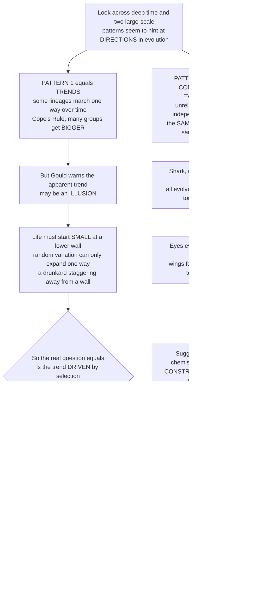

# 🔁 Evolutionary Trends and Convergence

> [!abstract] TL;DR
> Look across the whole history of life and two large-scale patterns seem to hint that evolution has **directions**. The first is **trends** — lineages that appear to march one way over deep time, most famously toward **larger body size** (**Cope's rule**: horses ballooning from dog-sized browsers to today's stallions). But Stephen Jay Gould exposed a subtle trap: an apparent "trend toward bigness" can be an **illusion**. If life must start **small** — there is a minimum viable size, a *left wall* — then even *unbiased* random variation can only expand upward, so the **maximum** and the **average** creep up while the *most common* size barely moves, like a drunkard who starts against a wall and can only stagger away from it. The real question is therefore whether a trend is **driven** (actively pushed by selection) or **passive** (mere diffusion away from a boundary). The second pattern is even more provocative: **convergent evolution** — utterly unrelated lineages independently discovering the *same* solution. Sharks (fish), ichthyosaurs (reptiles), and dolphins (mammals) all evolved the identical streamlined **torpedo body**; camera eyes arose dozens of times; wings evolved in insects, pterosaurs, birds, and bats; saber-teeth in cats and marsupials. Convergence implies evolution is **not** infinitely open — that physics, chemistry, and ecology **constrain** the space of workable designs so strongly that life keeps rediscovering the same answers (Simon Conway Morris argues this makes evolution surprisingly **predictable**, even "channeled"). Together, trends and convergence probe one of the deepest questions in all of biology: does evolution have directions, limits, and predictable outcomes — or is it, as Gould insisted, a **contingent tape** that would come out utterly differently if replayed?

---

## Intuition

**Analogy — the drunkard by the wall, and the engineers who never met.** Picture two puzzles about whether life is "going somewhere."

First, a drunkard staggers out of a bar and starts leaning against the **wall** of the building. Each step is random — no preference for any direction — but he *cannot* walk *through* the wall. Watch him for an hour and he will, on average, end up **farther from the wall** than he started, and the drunkard who has wandered *farthest* will be far indeed. A naive observer concludes "drunkards are driven away from walls!" But nothing is pushing him; the wall alone, plus random staggering, manufactures the whole apparent "trend." This is Gould's lesson about **Cope's rule**: because life *must* begin small (there is a lower limit to viable size), random variation can only spread *upward*, so the biggest creatures get bigger and the *average* creeps up — even when there is no selective push toward largeness at all. The honest question becomes: is a trend a genuine **drive** (selection actively favoring bigger), or just **passive diffusion** off a wall?

Second, imagine two engineering firms on opposite sides of the planet that have *never communicated*, each asked to design a machine that swims fast through water. Independently, both arrive at the *same* answer — a smooth, tapered, torpedo hull — because the **physics of drag** leaves few good options. That is **convergent evolution**. Sharks, ichthyosaurs, and dolphins are three lineages separated by hundreds of millions of years of ancestry, yet all "engineered" the identical fast-swimmer body. Eyes were reinvented dozens of times; flight four times; saber-fangs twice. When unrelated lineages keep landing on the same solution, it whispers that the space of workable designs is **narrow** — that evolution is *channeled*, not chaotic. Put the two puzzles together and you are standing at the heart of the great macroevolutionary debate: replay the tape of life, and would you get a world anything like this one?

---

## How It Works

### Core Mechanics

1. **A trend is directional change in a trait across a clade over geologic time.** Track a feature — body size, brain size, limb proportions, tooth height — averaged across many species of a group through millions of years. If it drifts consistently one way, you have a candidate **large-scale evolutionary trend** (e.g. **Cope's rule** of increasing body size, or increasing **encephalization**).

2. **But "the record-holder got bigger" is not enough.** The crucial distinction (McShea, Gould) is **driven vs passive**. A **driven** trend means active directional selection pushes the *whole distribution* — the mode, mean, and both tails all march together. A **passive** trend means the distribution merely *spreads* away from a **boundary** (the minimum-viable-size *left wall*): the maximum and mean rise while the **mode stays pinned at the wall**. Same rising average, radically different cause.

3. **You test them by watching the whole distribution, not the champion.** Diagnostics: does the **mode** move or stay at the wall? Is the distribution **right-skewed** (a long upward tail off a boundary — passive) or roughly **symmetric** and *translating* (driven)? Do **subclades** each drift up (driven) or do half of them get smaller while only the envelope expands (passive)? Gould's *Full House* argument: the *mode* of complexity/size may never leave the wall — only the tail extends.

4. **The same logic dissolves "evolutionary progress."** Is there a trend toward **complexity**? Life began at a minimal-complexity wall and can only diffuse upward, so a rising *maximum* complexity need not mean anything is *driven* toward complexity — Earth is still, by biomass and cell count, a **bacterial** planet (Gould). Ladder-of-progress thinking is the classic error here.

5. **Convergence is the mirror-image clue.** **Convergent evolution** (a form of **homoplasy**) is the *independent* origin of similar features in *unrelated* lineages — as opposed to **homology**, similarity inherited from a common ancestor. Distinguishing the two is exactly what **phylogenetics/cladistics** is for: map the trait onto the tree; if it lights up on distant branches with plain ancestors in between, it evolved *more than once*.

6. **Convergence implies constraint — a narrow menu of good solutions.** Physical, biomechanical, and developmental limits **channel** outcomes toward a small number of **adaptive optima** (peaks that behave like **attractors** in morphospace). Fast swimming → the torpedo body; capturing an image → the camera eye; slicing large prey → saber-teeth. The recurrence of these forms is evidence that the *reachable* design space is far smaller than the *conceivable* one.

7. **This frames the biggest debate: contingency vs convergence.** Gould's *replaying the tape of life* stresses **contingency** — frozen accidents and mass-extinction lotteries mean a rerun would look wildly different. Conway Morris's *Life's Solution* stresses **convergence** — the same optima would be found again, so the broad outcomes (vision, intelligence, even something humanlike) are near-**inevitable**. The fossil record and phylogeny are the only arbiters, and the answer shapes how **predictable** evolution — and even **alien life** — might be.

### Flow / Architecture



---

## Key Concepts

### 🟢 Secondary

- **A "trend" means a group drifts one way over a very long time.** The classic example is **Cope's rule** — over millions of years many animal groups tend to get **bigger** (horses started smaller than a fox and grew to today's size).
- **A trend can be a trick of the eye.** If life *has* to start small (there is a smallest a body can be and still work), then plain random change can only make the *biggest* creatures bigger — even if nothing is really pushing toward "big." Gould called this the **drunkard's walk** away from a wall.
- **Convergent evolution: nature reinventing the same thing.** Totally unrelated animals sometimes evolve the *same* feature because it is the best solution to the same problem. **Sharks, ichthyosaurs, and dolphins** all have the same torpedo shape for fast swimming, even though a shark is a fish, an ichthyosaur was a reptile, and a dolphin is a mammal.
- **Eyes, wings, and fangs, over and over.** Eyes evolved independently *dozens* of times; wings at least four times (insects, pterosaurs, birds, bats); saber-teeth twice (in cats and in a marsupial). Life keeps finding the same answers.
- **The big question.** Does evolution have a *direction* and *predictable* results, or is it a lucky accident that would turn out completely differently if it happened again?

### 🟡 Undergraduate

- **Large-scale evolutionary trend, defined.** Persistent directional change in a trait across a **clade** over geologic time. Beyond **Cope's rule** (body size), candidates include trends in **brain size / encephalization**, **complexity**, skeletal and limb changes, and **hypsodonty** (ever-taller teeth) in Cenozoic grazers as grasslands and grit spread.
- **Driven versus passive — the central distinction.** A **driven** trend = active directional selection shifting the *entire* distribution. A **passive** trend = increasing variance/diffusion away from a **boundary** (the minimum-size *left wall*) with the mode unmoved — the "**drunkard's walk**" / left-wall model. Gould's *Full House*: the mode may never move; only the upper *tail* extends.
- **How to test a trend.** Track the **minimum**, **mean**, **mode**, and **skewness** through time, and check whether **subclades** individually trend. Mode pinned at the wall + strong right skew ⇒ passive. Mode translating + roughly symmetric ⇒ driven. Never diagnose from the record-holder alone.
- **Homology vs homoplasy.** **Homology** = similarity from *common descent* (your arm and a bat's wing). **Homoplasy** = similarity from *independent* origin — this includes **convergent** evolution (different starting points → same trait), **parallel** evolution (similar starting points → same change), and **reversal**. Cladistics uses homology to build trees and flags homoplasy as the "noise" that convergence creates.
- **Iconic convergences.** Streamlined bodies (sharks / ichthyosaurs / dolphins); **camera eyes** in vertebrates and cephalopods; **flight** in insects, pterosaurs, birds, bats; **saber-teeth** in felids and the marsupial *Thylacosmilus*; placental–marsupial **ecomorph pairs** (wolf vs *Thylacinus*, mole vs marsupial mole); **C4 photosynthesis** evolved 60+ times in plants.
- **What convergence implies.** A *limited number of good solutions*. Biomechanical and developmental **constraints** funnel lineages toward shared **adaptive optima / peaks**, which act like **attractors** in trait space — forms cluster by *function*, not ancestry.

### 🔴 Graduate

- **The mechanisms of trends (McShea 1994).** McShea formalized how to diagnose a large-scale trend by its *internal structure*: **driven** (each subclade's minimum, mean, and mode all shift), **passive** (only the variance and extreme rise off a reflecting boundary), or neither. Tests include the behavior of the **skewness**, the **minimum**, subclade **ancestor-descendant** comparisons, and whether the distribution *translates* or *spreads*. The point is methodological rigor: "the maximum went up" is compatible with *no directional force at all*.
- **Cope's rule, re-examined.** Empirically, Cope's rule holds in some clades (Cenozoic mammals, many dinosaurs, marine animals across the Phanerozoic — Heim et al. 2015) but fails or reverses in others; where it holds, it is often *partly* passive diffusion and *partly* driven (energetic, thermal, and competitive advantages of size), with an upper wall set by physiology and extinction risk. Large size is also a mass-extinction *liability* — a built-in reset on the trend.
- **The complexity / "progress" question.** Is there a driven trend toward complexity? The left-wall model (Gould's *Full House*) argues the *rise in maximum* complexity is passive diffusion from a minimal-complexity boundary; the **mode of life remains prokaryotic**. Distinguishing driven from passive complexity increase (McShea's work on "internal variance" and part-counts) remains open — and the rejection of teleological **"progress"** / ladder thinking is a core lesson.
- **Convergence as evidence about the structure of morphospace.** Recurrent convergence implies **rugged-but-sparse** adaptive landscapes: few high peaks, strong developmental **bias/constraint** channeling variation, and **evolvability** differences that make some outcomes far more *reachable* than others. Convergence is thus data on the *deterministic* component of evolution — the part that is *not* free to vary.
- **Contingency vs convergence, sharply stated.** Gould: outcomes are dominated by **contingency** (path-dependence, mass-extinction luck); replay the tape and *Homo* — perhaps vertebrates on land — never appears. Conway Morris (*Life's Solution*) and McGhee (*Convergent Evolution*): pervasive convergence means the *destinations* are constrained even if the *paths* differ, so complex vision, active predation, and even intelligence are recurrent, near-**inevitable** attractors. Losos (*Improbable Destinies*) argues the truth is scale-dependent: convergence dominates at the level of *adaptive solutions to shared physics*, contingency at the level of *specific lineages and events*.
- **Predictability, evolvability, and astrobiology.** If evolution is strongly channeled, it becomes partly **predictable** — experimental evolution (e.g. *E. coli* LTEE replicates converging on similar solutions) and repeated ecomorph radiations (*Anolis* lizards on Caribbean islands) test this directly. It also bears on **astrobiology**: would extraterrestrial life, under similar physics and chemistry, converge on familiar forms — streamlining, photosynthesis-like energy capture, image-forming eyes — or is the sample of one too small to say?
- **Deep-time reading.** Separating *true* trends and convergences from **artifacts** requires integrating the **fossil record** (with its sampling and preservation biases) and **phylogeny**: convergence is only demonstrable once a well-supported tree shows the trait arose on separate branches, and a trend is only real after standardizing for uneven sampling through time.

---

## Python Demo

```python
# Evolutionary trends & convergence, made visible with numpy + matplotlib.
#
#   (A) DRIVEN vs PASSIVE TREND -- Gould's "drunkard's walk".
#       A clade of many lineages does a random walk in (log) body size
#       against a reflecting LOWER WALL (minimum viable size). With NO
#       directional bias, the MAX and MEAN still creep up while the MODE
#       stays pinned at the wall (a PASSIVE trend, right-skewed). Add a
#       drift and the WHOLE distribution -- mode included -- marches
#       (a DRIVEN trend). We track mode/mean/max/skew to tell them apart.
#
#   (B) CONVERGENCE toward an adaptive OPTIMUM in MORPHOSPACE.
#       Several independent lineages start from DIFFERENT ancestral points
#       and are each pulled (an Ornstein-Uhlenbeck attractor) toward the
#       SAME peak -- e.g. the streamlined "torpedo" optimum. Final forms
#       cluster by FUNCTION, not ancestry: similarity = homoplasy, not
#       homology.
#
# Fully runnable: pure numpy + matplotlib.

import numpy as np
import matplotlib.pyplot as plt

rng = np.random.default_rng(42)

# ======================================================================
# (A) DRIVEN vs PASSIVE TREND -- the drunkard's walk off a left wall
# ======================================================================
n_lin, n_steps = 5000, 500
wall, sd = 0.0, 1.0          # minimum viable (log) size, and step spread

def run_walk(drift):
    """Many lineages random-walk against a REFLECTING lower wall.
    drift = 0 -> PASSIVE (unbiased);  drift > 0 -> DRIVEN (selection push)."""
    x = np.full(n_lin, wall + 0.5)          # founders start small, near the wall
    mode_t = np.zeros(n_steps); mean_t = np.zeros(n_steps)
    max_t  = np.zeros(n_steps); skew_t = np.zeros(n_steps)
    for t in range(n_steps):
        x = x + rng.normal(drift, sd, n_lin)
        x = np.where(x < wall, 2 * wall - x, x)     # reflect at the size wall
        mean_t[t], max_t[t] = x.mean(), x.max()
        h, e = np.histogram(x, bins=60)
        mode_t[t] = 0.5 * (e[h.argmax()] + e[h.argmax() + 1])
        skew_t[t] = np.mean((x - x.mean())**3) / (x.std()**3 + 1e-12)
    return x, mode_t, mean_t, max_t, skew_t

xP, modeP, meanP, maxP, skewP = run_walk(drift=0.00)   # PASSIVE
xD, modeD, meanD, maxD, skewD = run_walk(drift=0.05)   # DRIVEN
tt = np.arange(n_steps)

# ======================================================================
# (B) CONVERGENCE toward a shared adaptive optimum (OU attractor)
# ======================================================================
optimum = np.array([0.0, 0.0])      # the shared peak (e.g. streamlined form)
alpha, sigma, T = 0.05, 0.20, 140   # pull strength, wobble, duration
starts = np.array([[-6, 5], [6, 5], [6, -5], [-6, -5], [0, 7]])  # distant roots
cols   = ["#dc2626", "#2563eb", "#16a34a", "#9333ea", "#d97706"]
paths, dists = [], []
for s in starts:
    p = np.zeros((T, 2)); p[0] = s
    for t in range(1, T):
        p[t] = p[t-1] + alpha * (optimum - p[t-1]) + rng.normal(0, sigma, 2)
    paths.append(p)
    dists.append(np.linalg.norm(p - optimum, axis=1))   # distance to the peak

# ======================================================================
# PLOTS
# ======================================================================
fig, ax = plt.subplots(2, 2, figsize=(13, 9.5))

# (A1) PASSIVE trend -----------------------------------------------------
a = ax[0, 0]
a.axhline(wall, color="#111827", lw=1.4, ls="-",  label="minimum-size wall")
a.plot(tt, modeP, color="#0ea5e9", lw=2.4, label="mode (most common size)")
a.plot(tt, meanP, color="#f59e0b", lw=2.4, label="mean")
a.plot(tt, maxP,  color="#dc2626", lw=2.4, label="maximum")
a.set_title("(A1) PASSIVE trend: max & mean rise, but MODE stays at the wall",
            weight="bold", fontsize=10)
a.set_xlabel("deep time (steps)"); a.set_ylabel("body size (log units)")
a.legend(frameon=False, fontsize=8, loc="upper left"); a.grid(alpha=0.25)

# (A2) DRIVEN trend ------------------------------------------------------
a = ax[0, 1]
a.axhline(wall, color="#111827", lw=1.4, ls="-", label="minimum-size wall")
a.plot(tt, modeD, color="#0ea5e9", lw=2.4, label="mode (most common size)")
a.plot(tt, meanD, color="#f59e0b", lw=2.4, label="mean")
a.plot(tt, maxD,  color="#dc2626", lw=2.4, label="maximum")
a.set_title("(A2) DRIVEN trend: the WHOLE distribution marches (mode too)",
            weight="bold", fontsize=10)
a.set_xlabel("deep time (steps)"); a.set_ylabel("body size (log units)")
a.legend(frameon=False, fontsize=8, loc="upper left"); a.grid(alpha=0.25)

# (B1) morphospace convergence ------------------------------------------
a = ax[1, 0]
for p, c in zip(paths, cols):
    a.plot(p[:, 0], p[:, 1], color=c, lw=1.3, alpha=0.8)
    a.scatter(*p[0],  color=c, s=70, marker="o", edgecolor="k", zorder=3)   # root
    a.scatter(*p[-1], color=c, s=70, marker="*", edgecolor="k", zorder=3)   # today
a.scatter(*optimum, color="gold", s=380, marker="*", edgecolor="k", zorder=4)
a.text(0.3, 0.5, "shared\noptimum", fontsize=8)
a.set_title("(B1) Convergence: distant roots (o) -> one optimum today (*)",
            weight="bold", fontsize=10)
a.set_xlabel("morphospace axis 1"); a.set_ylabel("morphospace axis 2")
a.grid(alpha=0.25)

# (B2) distance-to-optimum: homoplasy from independent descent -----------
a = ax[1, 1]
for d, c in zip(dists, cols):
    a.plot(d, color=c, lw=2.0)
a.set_title("(B2) All lineages collapse onto the peak = HOMOPLASY,\n"
            "similarity by convergence, not common descent",
            weight="bold", fontsize=10)
a.set_xlabel("time since divergence"); a.set_ylabel("distance to the optimum")
a.grid(alpha=0.25)

plt.tight_layout()
plt.savefig("evolutionary_trends_and_convergence.png", dpi=120)

# ---- quantitative takeaways -------------------------------------------
print("PASSIVE trend (no selective push):")
print(f"  mode moved {modeP[-1]-modeP[0]:+.2f}, "
      f"mean moved {meanP[-1]-meanP[0]:+.2f}, "
      f"max moved {maxP[-1]-maxP[0]:+.2f}, final skew {skewP[-1]:+.2f} (right-skewed)")
print("DRIVEN trend (directional selection):")
print(f"  mode moved {modeD[-1]-modeD[0]:+.2f}, "
      f"mean moved {meanD[-1]-meanD[0]:+.2f}, "
      f"max moved {maxD[-1]-maxD[0]:+.2f}, final skew {skewD[-1]:+.2f} (~symmetric)")
print("Diagnosis: a moving MODE + low skew = DRIVEN; a pinned MODE + strong "
      "right skew = PASSIVE, even though BOTH show a rising mean & maximum.")
print(f"Convergence: 5 lineages from distant roots end a mean "
      f"{np.mean([d[-1] for d in dists]):.2f} units from the shared optimum "
      f"(started ~{np.mean([d[0] for d in dists]):.1f}).")
```

The two trend panels are the whole point of the driven-vs-passive distinction. In **(A1)** there is *no* directional force at all, yet the **maximum** and **mean** climb steadily — an "apparent trend toward bigness" — while the **mode stays pinned at the wall** and the distribution grows strongly **right-skewed**: a *passive* diffusion off a boundary (Gould's drunkard's walk). In **(A2)** a genuine selective drift makes the *entire* distribution translate — **mode included** — with near-symmetric shape: a *driven* trend. Crucially, **both** show a rising mean and maximum, so only watching the *mode* and *skew* (not the record-holder) tells them apart. Panels **(B1)–(B2)** show **convergence**: five lineages starting from widely separated ancestral points are each pulled toward the *same* optimum, so their present-day forms cluster tightly around one peak — their resemblance is **homoplasy** (similarity by independent convergence) rather than **homology** (similarity by common descent).

---

## Real-World Applications

- **Diagnosing Cope's rule quantitatively.** Heim et al. (2015, *Science*) tracked body size across **17,000+ genera** of marine animals through the Phanerozoic and found a *real, driven* size increase concentrated in certain classes — a textbook case of applying the driven-vs-passive machinery to a genuine fossil dataset rather than eyeballing the biggest fossil in each epoch.
- **Convergence as a phylogenetic stress-test.** Because homoplasy *mimics* homology, molecular and morphological phylogenetics must actively detect convergence — e.g. echolocation genes (*Prestin*) that **converged** at the sequence level in bats and toothed whales, which naive similarity would wrongly group together. Recognizing convergence is essential to building correct trees.
- **Repeatable evolution you can watch.** The **Anolis** lizard radiations independently produced the *same* set of "ecomorphs" (trunk-crown, twig, grass-bush) on Cuba, Hispaniola, Jamaica, and Puerto Rico; Lenski's **Long-Term Evolution Experiment** in *E. coli* shows parallel lineages repeatedly converging on similar fitness solutions. These make convergence an *experimental*, not merely historical, science.
- **Bio-inspired engineering.** Convergent optima are pre-vetted by physics, so engineers borrow them: shark-skin denticle patterns for **low-drag swimsuits and ship hulls**, the streamlined kingfisher beak that reshaped the **Shinkansen bullet-train nose**, and cephalopod/vertebrate camera-eye optics for lens design.
- **Astrobiology and the predictability of life.** If key adaptations are strongly convergent attractors, then life elsewhere — under similar physics and chemistry — might independently arrive at streamlining, image-forming eyes, or photosynthesis-like energy capture. Trends and convergence turn "would aliens look familiar?" into a testable question about how *channeled* evolution really is (see the sibling *Conservation Paleobiology and Astrobiology*).

---

## Common Pitfalls

- **Diagnosing a trend from the record-holder.** "The biggest horse got bigger" says nothing about *cause*. A rising **maximum** and **mean** are equally produced by a *passive* diffusion off the minimum-size wall; you must watch the **mode**, **skew**, and **subclade** behavior (McShea) before calling a trend *driven*.
- **Reading trends as goal-directed progress.** A trend is a *pattern*, not a *purpose*. Interpreting Cope's rule or rising complexity as evolution "striving" toward big/complex/human is **teleology**. Life's *mode* is still bacterial (Gould); the ladder-of-progress is the single most persistent error in this topic.
- **Confusing convergence (homoplasy) with homology.** Two lineages sharing a torpedo body or a camera eye are *not* thereby closely related. Similarity can be **inherited** (homology) *or* **independently invented** (homoplasy); only a phylogeny built from *other* characters can tell which, and mistaking the two corrupts the whole tree.
- **Assuming convergence proves determinism (or contingency proves randomness).** Convergence shows *some* outcomes are constrained; it does **not** prove the *whole* history is predictable. The Gould–Conway Morris debate is about *how much* of evolution is channeled — a matter of scale and degree, not an all-or-nothing verdict.
- **Ignoring the fossil record's biases.** Both trends and convergences can be **artifacts** of uneven sampling, the "pull of the recent," or preservation. A trend must survive sampling-standardization, and a convergence must survive a well-supported tree, before it is real.
- **Treating a passive trend as "nothing happening."** Passive diffusion off a boundary is a *genuine, explicable* macroevolutionary pattern with real consequences (rising maxima reshape ecosystems). "Passive" refers to the *absence of a directional push*, not the absence of change.

---

## Related Concepts

This note is a sibling within **Section 03 (Macroevolution and Patterns)** and elaborates the trends-and-convergence theme opened by *Macroevolution and Deep-Time Patterns* (the driven-vs-passive distinction and Cope's rule are introduced there and developed fully here). It is the natural counterpart to *Adaptive Radiations and Diversification* (radiations *generate* the disparity within which convergence then *re-collides* on shared optima), depends on *Cladistics and Fossil Phylogeny* (the only way to separate homoplasy from homology and to demonstrate that a trait arose more than once), draws its raw material from *Reading Fossils: Morphology and Reconstruction* (measuring the traits whose trends and convergences we track), and feeds directly into *Conservation Paleobiology and Astrobiology* (whether evolution's channeling makes outcomes — even extraterrestrial ones — predictable). These siblings are referenced in prose so they wire cleanly as the section fills in.

Verified cross-vault links to existing notes:

- [[Speciation_and_Macroevolution]] — the biology-vault companion on evolution above the species level; trends and convergence are two of its headline macroevolutionary patterns.
- [[Natural_Selection_and_Adaptation]] — the organism-level mechanism that *drives* real trends and pulls lineages toward the shared adaptive optima behind convergence.
- [[Phylogenetics_and_the_Tree_of_Life]] — the framework that distinguishes **homoplasy** (convergence) from **homology** (common descent) by mapping traits onto the tree.
- [[Evidence_for_Evolution]] — convergent structures and vestigial homologies are classic evidence; convergence and homology are opposite sides of that evidentiary coin.
- [[The_History_of_Life_on_Earth]] — the concrete deep-time narrative in which these trends (size, complexity) and convergences (streamlining, flight, eyes) actually play out.
- [[Astrobiology_and_Habitability]] — the convergence-vs-contingency debate directly informs whether alien life would converge on familiar forms.
- [[Probability_Theory]] — the passive trend *is* a biased/reflected **random walk**; the drunkard's walk and diffusion off a boundary are pure stochastic-process reasoning.
- [[Competition_and_Niche_Theory]] — convergence is driven by lineages independently adapting to *the same niche/adaptive zone*, so similar ecological pressures yield similar ecomorphs.

---

## Review Questions

1. **(Secondary)** Using the drunkard-by-the-wall image, explain why "the biggest animals in a group got bigger over time" does **not** by itself prove that evolution was *pushing* the group toward large size. Then give one real example of convergent evolution and say why it is surprising.
2. **(Undergraduate)** Distinguish **homology** from **homoplasy**, and explain why the torpedo bodies of sharks, ichthyosaurs, and dolphins are homoplasy rather than homology. How would a phylogenetic tree let you tell the two apart?
3. **(Undergraduate)** A clade shows a rising *mean* body size over 15 million years. List the specific measurements (mode, minimum, skewness, subclade behavior) you would track to decide whether the trend is **driven** or **passive**, and state what each measurement would look like under each hypothesis.
4. **(Graduate)** Gould argued there is *no driven* trend toward complexity, only passive diffusion from a minimal-complexity wall, and that Earth remains a "bacterial planet." Reconstruct his *Full House* argument, then describe one kind of evidence that could, in principle, demonstrate a genuinely **driven** complexity trend.
5. **(Graduate)** State the **contingency vs convergence** debate (Gould vs Conway Morris), and explain why Losos argues the answer is *scale-dependent*. If you could "replay the tape of life," what specific observation would count as strong evidence for the *convergence* side, and what for the *contingency* side?

---

## Sources

- Gould, S. J. (1996). *Full House: The Spread of Excellence from Plato to Darwin*. Harmony Books. [Publisher](https://www.penguinrandomhouse.com/books/166188/full-house-by-stephen-jay-gould/)
- McShea, D. W. (1994). "Mechanisms of large-scale evolutionary trends." *Evolution*, 48(6), 1747–1763. [DOI](https://doi.org/10.1111/j.1558-5646.1994.tb02211.x)
- Conway Morris, S. (2003). *Life's Solution: Inevitable Humans in a Lonely Universe*. Cambridge University Press. [Publisher](https://www.cambridge.org/9780521827041)
- McGhee, G. R. (2011). *Convergent Evolution: Limited Forms Most Beautiful*. MIT Press. [Publisher](https://mitpress.mit.edu/9780262016421/convergent-evolution/)
- Heim, N. A., Knope, M. L., Schaal, E. K., Wang, S. C., & Payne, J. L. (2015). "Cope's rule in the evolution of marine animals." *Science*, 347(6224), 867–870. [DOI](https://doi.org/10.1126/science.1260065)
- Losos, J. B. (2017). *Improbable Destinies: Fate, Chance, and the Future of Evolution*. Riverhead Books. [Publisher](https://www.penguinrandomhouse.com/books/314699/improbable-destinies-by-jonathan-b-losos/)

---

#paleontology #evolutionary-trends #convergent-evolution #copes-rule #contingency
