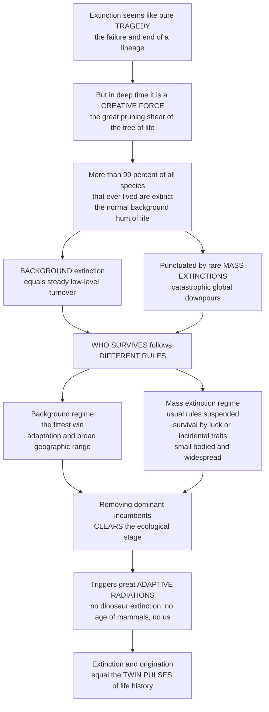

# 🌒 Extinction as an Evolutionary Force

> [!abstract] TL;DR
> We tend to think of **extinction** as pure tragedy — the failure and end of a lineage — but in deep time it is one of evolution's most powerful **creative** forces, the great pruning shear that shapes the tree of life. More than **99 percent** of all species that ever lived are extinct: extinction is not a rare accident but the normal, constant **background hum** of life's history, a steady drizzle of species winking out. Punctuating that drizzle are rare, catastrophic **mass extinctions** — and here is the profound part: **who survives the two kinds follows different rules**. In normal background times the "fittest" tend to win — species with useful adaptations, broad geographic ranges, and good competitive traits. But mass extinctions can suspend the usual rules, a "wanton" reset where traits that were advantageous for eons suddenly stop mattering and survival hinges on luck or some incidental feature. By removing dominant, well-entrenched groups, extinction repeatedly **clears the ecological stage** and hands opportunity to the survivors, triggering the great **adaptive radiations** that follow. No dinosaur extinction, no age of mammals, no us. Extinction and **origination** are the twin pulses of life's history — the death that makes room for new life.

---

## Intuition

**Analogy — the pruning shear and the two kinds of weather.** Picture the tree of life not as a tidy diagram but as a real, sprawling tree that has been growing for four billion years. Left alone, it would become an impenetrable, self-shading thicket. What keeps it vigorous and ever-reshaping is a **pruning shear**: extinction. Snip a branch and the light that branch was hogging falls on its neighbors, which surge into the gap. The gardener's cut looks like destruction, but it is what lets new growth flourish. That is extinction in deep time — not just an ending, but a *making of room*.

Now imagine two kinds of weather over this garden. Most of the time there is a **steady drizzle** — a slow, constant loss of leaves and twigs, the ordinary turnover of life. This is **background extinction**, and it is relentless: species wink out all the time, and more than 99 percent of everything that ever lived is already gone. But every so often the sky opens into a **catastrophic downpour** — a **mass extinction** — that strips whole limbs from the tree at once. And here is the twist that makes extinction so interesting: *the drizzle and the downpour choose their victims by different rules.* In the drizzle, the plants with the deepest roots and broadest reach survive — the "fittest" win. In the downpour, roots and reach may not save you; survival can come down to sheer luck or some incidental trait, like happening to be small or happening to grow everywhere. Stephen Jay Gould called such mass extinctions potentially **"non-constructive"** — resets that scramble the deck regardless of who had been winning. Understand extinction as a *selective filter* and a *creative reset*, the twin of origination, and you understand one of the deepest engines of macroevolution and the strange, generative role of death in producing the diversity of life.

---

## How It Works

### Core Mechanics

1. **Extinction is the rule, not the exception.** Of the billions of species that have existed, **more than 99 percent are extinct**. Extinction is the ultimate fate of nearly every lineage and a permanent feature of life's history — the baseline against which survival is the anomaly.
2. **We measure it as a rate.** Paleontologists quantify extinction as an **extinction rate** (taxa lost per unit time) or a **per-taxon extinction rate** (probability a lineage dies in an interval), and read it from **survivorship curves**. Leigh Van Valen's **"law of constant extinction"** noted that within many groups the probability of extinction is roughly constant over a lineage's lifetime — extinction does not spare the old and experienced.
3. **Two regimes.** **Background extinction** is the continuous, low-level loss of species from ordinary causes — competition, incremental environmental change, shifting biotic interactions. **Mass extinction** is a rare, rapid, global, taxonomically broad pulse of loss far above background (the "Big Five" of the Phanerozoic).
4. **A continuum, not two separate worlds.** David Raup's **"kill curve"** relates extinction magnitude to how often it recurs: small kills happen often, large kills rarely. Mass extinctions sit in the **tail of a continuum**, not in a wholly separate category — though whether they are also *qualitatively* distinct is debated.
5. **Extinction is non-random — it sorts by traits.** Survival is not a coin flip. In background times, broad **geographic range size** is a powerful survival predictor (widespread species ride out local catastrophes), along with high abundance, generalist ecology, and certain body sizes and larval types. This trait-biased survival is a form of **species selection / sorting**, macroevolution acting above the level of the individual organism.
6. **The "different rules" hypothesis.** David Jablonski and Gould argued that during **mass extinctions the usual rules can change**: traits that protected species for eons lose their value, and what matters shifts to the *clade* level (a group's total geographic spread) rather than local adaptation. Mass extinctions can therefore be **"non-constructive"** — eliminating well-adapted incumbents by chance and **contingency**, reshaping the biosphere in ways that "replaying the tape" would not reproduce.
7. **Extinction is creative — it clears the stage.** By removing entrenched incumbents, extinction frees **ecospace**. Survivors, released from competition, rapidly diversify into the vacated niches — the great **recovery radiations**. Extinction and **origination** are thus coupled: pulses of death are followed by pulses of birth (Vrba's **turnover-pulse** idea; the **Red Queen** view of constant biotic struggle).
8. **The canonical case.** The **end-Cretaceous (K-Pg)** extinction removed the non-avian dinosaurs and handed the terrestrial stage to small, shadow-dwelling **mammals**, which radiated into the vacated large-bodied niches. Without that extinction there is no Age of Mammals — and no us.

### Flow / Architecture



---

## Key Concepts

### 🟢 Secondary

- **Extinction is normal, not rare.** More than **99 percent** of all species that ever lived have gone extinct. Extinction is the constant background hum of life's history, not a freak event.
- **Two kinds of extinction.** A steady **drizzle** (background extinction — species winking out all the time) is punctuated by rare, catastrophic **downpours** (mass extinctions — huge losses at once, like the one that ended the dinosaurs).
- **Different rules for survivors.** In ordinary times the "fittest" survive — the well-adapted, the widespread. In a mass extinction the rules can change: survival may come down to luck or to some incidental trait like being small or living everywhere.
- **Extinction is creative.** By clearing out dominant groups, extinction opens the stage for survivors to flourish. The death of the dinosaurs is exactly what let mammals — and eventually humans — take over.
- **Death and birth are linked.** Extinction and the origin of new species are the **twin pulses** of life's history. Every great emptying is followed by a burst of new life filling the gap.

### 🟡 Undergraduate

- **Measuring extinction.** Extinction is quantified as an **extinction rate** (taxa lost per million years), a **per-taxon rate** (per-lineage probability of dying per interval), and via **survivorship curves** (the fraction of a cohort of lineages still surviving over time). **Van Valen's law of constant extinction** observes that these curves are often roughly log-linear — extinction probability is nearly time-independent within a group.
- **The extinction continuum and Raup's kill curve.** Rather than a clean split, extinction magnitudes form a continuum: small events are common, large ones rare. Raup's **kill curve** anchors this — very roughly, a ~5 percent species kill recurs on the order of a million years, a ~30 percent kill on the order of ten million, and a mass-extinction-scale kill on the order of a hundred million. Mass extinctions are the **tail** of this distribution.
- **Selectivity in background times.** Background extinction **sorts by traits**. The single most robust predictor of survival is broad **geographic range size** (a species spread across many regions is buffered against local disasters), along with high **abundance**, ecological **generalism**, and certain body sizes and larval strategies. Because these traits belong to species rather than individuals, this is **species selection / sorting** — selection acting at the macroevolutionary level.
- **Selectivity changes in mass extinctions.** In the Big Five, many normally protective traits lose their power. Broad *species-level* range may stop helping while broad *clade-level* range (the total spread of a whole lineage) becomes the thing that saves you — a shift from organism-level fitness to higher-level survival.
- **Extinction and origination are coupled.** Extinction frees **ecospace**; survivors diversify to fill it. The result is a **recovery radiation** — the adaptive radiations that repopulate the world after a crisis are impossible without the preceding extinction. This coupling drives the sawtooth pattern of diversity through the Phanerozoic.

### 🔴 Graduate

- **The "different rules" hypothesis (Jablonski, Gould).** During background intervals, trait-based selectivity (range, abundance) predicts differential survival, generating **directional macroevolutionary trends**. Jablonski's work on Cretaceous molluscs showed that at the **K-Pg boundary** these predictors broke down: species-level range size lost its protective effect, while broad *clade*-level geographic range became the operative survival variable. Mass extinctions can thus **decouple** long-term fitness from survival — Gould's argument that they are potentially **"non-constructive"** or **"wanton,"** capable of eliminating groups regardless of how well they were doing, and reshaping the biosphere by **contingency** ("replaying the tape of life" would yield different survivors).
- **Van Valen's Red Queen.** The **law of constant extinction** motivated the **Red Queen hypothesis**: because every species' biotic environment (competitors, predators, parasites) is itself constantly evolving, each lineage must keep adapting merely to hold its ground — "it takes all the running you can do to keep in the same place." Extinction is the failure to keep pace in this ceaseless coevolutionary struggle; effective environment continually decays beneath each lineage.
- **Turnover-pulse and coupled dynamics.** Vrba's **turnover-pulse hypothesis** proposes that physical (often climatic) forcing drives synchronized bursts of *both* extinction and speciation across many clades at once, tightening the extinction-origination coupling into discrete pulses rather than a smooth churn.
- **Reading extinction from an imperfect record.** Apparent extinction patterns are distorted by preservation. The **Signor-Lipps effect** (the last-known fossil predates the true extinction because the record thins toward a boundary) can smear an abrupt mass extinction into a false gradual decline. **Lazarus taxa** vanish from the record then reappear, and pull-of-the-recent and sampling biases warp diversity curves — so distinguishing genuine extinction dynamics from taphonomic artifact is a central methodological problem (Sepkoski's compendia and Raup and Sepkoski's 1982 statistical detection of the Big Five are foundational here).
- **Consequences for macroevolutionary pattern.** Differential survival across regimes shapes **diversity curves**, clade dynamics, and long-term trends; it explains the persistence of **living fossils** (slowly evolving, extinction-resistant lineages) versus the volatility of others, and it makes clear that the large-scale shape of the tree of life is authored jointly by extinction and radiation — the two engines running together.
- **The deep-time lens on the present.** Placing today's **sixth extinction** against the background-versus-mass framework is what lets us judge its severity: elevated modern extinction rates are meaningful precisely because they are measured against the quantified deep-time background, and the "clear-and-radiate" logic warns that recovery radiations, when they come, unfold over millions of years — far beyond human timescales.

---

## Python Demo

```python
# Extinction as an evolutionary FORCE, four views:
#   (A) BACKGROUND vs MASS: extinction intensity through the Phanerozoic
#       -- a low background drizzle punctuated by the rare "Big Five" spikes.
#   (B) Raup's KILL CURVE -- extinction magnitude vs recurrence time,
#       showing mass extinctions as the TAIL of a continuum (not a separate world).
#   (C) DIFFERENT RULES -- how selectivity by geographic range collapses:
#       in background times range predicts survival; in a mass extinction it does not.
#   (D) CLEAR-AND-RADIATE -- an incumbent clade removed at an extinction,
#       freeing ecospace that a suppressed survivor radiates into (dinosaurs -> mammals).
# Pure numpy + matplotlib, fully runnable.

import numpy as np
import matplotlib.pyplot as plt

rng = np.random.default_rng(7)
fig, axes = plt.subplots(2, 2, figsize=(15, 10))
axA, axB, axC, axD = axes.ravel()

# ----------------------------------------------------------------------
# (A) BACKGROUND DRIZZLE vs MASS-EXTINCTION SPIKES through the Phanerozoic
# ----------------------------------------------------------------------
t = np.linspace(540, 0, 200)                      # Ma, old -> young (stage midpoints)
background = 6 + 4 * rng.random(t.size)           # low background genus-extinction %
# The Big Five: (age Ma, peak genus-extinction %, label)
big_five = [(445, 57, "End-Ordovician"),
            (372, 50, "Late Devonian"),
            (252, 82, "End-Permian"),
            (201, 47, "End-Triassic"),
            ( 66, 40, "End-Cretaceous")]
intensity = background.copy()
for age, peak, _ in big_five:
    i = np.argmin(np.abs(t - age))                # nearest interval to the event
    intensity[i] = peak

axA.bar(t, intensity, width=2.5, color="#8d99ae")
mask = intensity > 30
axA.bar(t[mask], intensity[mask], width=3.5, color="#d62828")
axA.axhline(background.mean(), color="#2a9d8f", ls="--", lw=1.5,
            label=f"mean background ~{background.mean():.0f}%")
for age, peak, name in big_five:
    axA.text(age, peak + 1.5, name, ha="center", va="bottom",
             fontsize=7.5, rotation=90, color="#9d0208")
axA.set_xlim(545, -5)                              # older on the left
axA.set_ylim(0, 95)
axA.set_xlabel("Millions of years ago (Ma)")
axA.set_ylabel("Extinction intensity (% genera)")
axA.set_title("(A) Background drizzle punctuated by mass-extinction downpours",
              fontsize=11, weight="bold")
axA.legend(loc="upper left", fontsize=8)

# ----------------------------------------------------------------------
# (B) RAUP'S KILL CURVE -- magnitude vs recurrence time (a continuum)
# ----------------------------------------------------------------------
# Anchor points (approx Raup 1991): ~5% kill / ~1 Myr, ~30% / ~10 Myr, ~65% / ~100 Myr.
wait = np.logspace(-1, 2.7, 200)                   # recurrence interval, Myr
kill = np.clip(5 + 30 * np.log10(wait), 0, 100)    # species-kill % rises with log(wait)

axB.plot(wait, kill, color="#264653", lw=2.5)
axB.fill_between(wait, 0, kill, color="#e9c46a", alpha=0.25)
# The Big Five live in the tail (long recurrence, high kill).
for w, k, name in [(30, 55, "Ordovician"), (25, 50, "Devonian"),
                   (150, 80, "Permian"), (20, 47, "Triassic"), (50, 45, "K-Pg")]:
    axB.plot(w, k, "o", color="#d62828", ms=7, zorder=3)
axB.text(120, 78, "mass extinctions\n= the TAIL", color="#9d0208",
         fontsize=9, weight="bold", ha="center")
axB.text(0.4, 12, "background\ndrizzle", color="#2a6f4f", fontsize=9, ha="left")
axB.set_xscale("log")
axB.set_xlabel("Mean recurrence interval (Myr, log scale)")
axB.set_ylabel("Species kill (%)")
axB.set_title("(B) Raup's kill curve: mass extinctions are one continuum's tail",
              fontsize=11, weight="bold")
axB.set_ylim(0, 100)

# ----------------------------------------------------------------------
# (C) DIFFERENT RULES -- selectivity by geographic range collapses
# ----------------------------------------------------------------------
range_size = np.linspace(0, 10, 200)               # species geographic range (arb. units)
# Background: broad range strongly predicts survival (steep logistic).
p_background = 1 / (1 + np.exp(-(range_size - 5) * 1.1))
# Mass extinction: the rule is suspended -- survival ~ flat / near-random.
p_mass = 0.35 + 0.03 * range_size                  # almost no dependence on range

axC.plot(range_size, p_background, color="#2a9d8f", lw=3,
         label="Background: range PREDICTS survival")
axC.plot(range_size, p_mass, color="#d62828", lw=3, ls="--",
         label="Mass extinction: rule SUSPENDED")
# Illustrative sampled outcomes to show the correlation vs the scatter.
xs = rng.uniform(0, 10, 40)
axC.scatter(xs, (rng.random(40) < 1 / (1 + np.exp(-(xs - 5) * 1.1))).astype(float),
            color="#2a9d8f", alpha=0.35, s=18)
axC.scatter(xs, (rng.random(40) < 0.35 + 0.03 * xs).astype(float),
            color="#d62828", alpha=0.35, s=18, marker="x")
axC.set_xlabel("Geographic range size (broad -->)")
axC.set_ylabel("Probability of survival")
axC.set_title("(C) 'Different rules': a survival trait that stops mattering",
              fontsize=11, weight="bold")
axC.set_ylim(-0.05, 1.05)
axC.legend(loc="center right", fontsize=8)

# ----------------------------------------------------------------------
# (D) CLEAR-AND-RADIATE -- extinction frees ecospace; survivors radiate
# ----------------------------------------------------------------------
tt = np.linspace(-40, 40, 400)                     # Myr relative to the extinction event
t_ext = 0.0
# Incumbent (e.g. dinosaurs): high diversity, crashes at the boundary.
incumbent = 100 / (1 + np.exp((tt - t_ext) * 1.5))
# Survivor (e.g. mammals): suppressed while incumbent dominates, then radiates.
suppressed = 8 + 0 * tt
radiated = 8 + 90 / (1 + np.exp(-(tt - (t_ext + 6)) * 0.4))
survivor = np.where(tt < t_ext, suppressed, radiated)

axD.plot(tt, incumbent, color="#6a4c93", lw=2.5, label="Incumbent (dinosaurs)")
axD.plot(tt, survivor, color="#e76f51", lw=2.5, label="Survivor radiates (mammals)")
axD.fill_between(tt, 0, survivor, where=(tt > t_ext), color="#e76f51", alpha=0.18)
axD.axvline(t_ext, color="#222", ls="--", lw=1.5)
axD.text(t_ext + 1, 95, "extinction\nclears the stage", fontsize=8, color="#222")
axD.set_xlabel("Time relative to extinction event (Myr)")
axD.set_ylabel("Clade diversity (genera, arb.)")
axD.set_title("(D) Clear-and-radiate: origination pulse follows extinction",
              fontsize=11, weight="bold")
axD.legend(loc="center left", fontsize=8)

plt.tight_layout()
plt.savefig("extinction_as_a_force.png", dpi=120)

# Perspective print-out.
species_ever = 4e9            # order-of-magnitude estimate of all species ever
extant = 8.7e6               # order-of-magnitude estimate of living species today
pct_extinct = 100 * (1 - extant / species_ever)
print(f"Estimated species that ever lived: ~{species_ever:.0e}")
print(f"Estimated living species today:    ~{extant:.0e}")
print(f"Fraction of all species now extinct: ~{pct_extinct:.4f}%  (more than 99%)")
```

Panel A separates the two regimes visually: a low, noisy **background drizzle** of extinction (green mean line) with five red **mass-extinction spikes** towering above it — the end-Permian "Great Dying" the tallest. Panel B reproduces the logic of **Raup's kill curve**: extinction magnitude rises smoothly with recurrence interval, so the Big Five (red dots) are not a separate phenomenon but the rare **tail** of one continuous distribution. Panel C is the crux of the "different rules" idea — under the background regime, broad geographic range steeply predicts survival (the green curve), but in a mass extinction that same trait's advantage **collapses** toward randomness (the flat red line), so a species' hard-won fitness stops protecting it. Panel D shows the creative payoff: an incumbent clade crashes at the boundary, and a previously **suppressed survivor**, released into the freed ecospace, radiates explosively — the origination pulse that follows every great extinction, of which dinosaurs giving way to mammals is the canonical case. The print-out puts the headline number in perspective: to order of magnitude, more than 99 percent of all species that ever lived are gone.

---

## Real-World Applications

- **Reading the tempo of life's history.** The background-versus-mass framework is the organizing lens of the whole Phanerozoic diversity record. Sepkoski's genus- and family-level compendia and Raup and Sepkoski's statistical detection of the Big Five turned "extinction" from a vague catastrophe into a **measurable rate** with a quantified baseline.
- **Benchmarking the modern biodiversity crisis.** Judging whether we are entering a **sixth mass extinction** is only possible because paleontology has established the deep-time **background rate**. Modern extinction rates are alarming precisely because they run orders of magnitude above that measured background — a comparison that anchors conservation science.
- **Conservation triage and the range-size rule.** The paleontological finding that broad **geographic range** is the strongest single predictor of survival directly informs which taxa are most extinction-prone today (narrow-range endemics), shaping red-list criteria and reserve design.
- **Anticipating recovery timescales.** The "clear-and-radiate" pattern warns that ecological recovery and the re-diversification of survivors unfold over **millions of years**. This deep-time reality reframes the permanence of present-day extinctions on any human-relevant horizon.
- **Explaining our own existence.** The mammalian radiation — and therefore primates and humans — is a downstream consequence of the K-Pg extinction removing the dinosaurs. Extinction-as-a-force is not an abstraction: it is why the Age of Mammals, and we, exist at all.
- **Macroevolutionary theory.** Extinction selectivity is the empirical engine of **species selection / sorting**, one of the strongest lines of evidence that evolution operates at levels above the individual organism, a foundational claim of hierarchical evolutionary theory.

---

## Common Pitfalls

- **"Extinction is a failure or an accident."** In deep time extinction is the **norm**, the constant fate of nearly all lineages, and a *creative* force that repeatedly resets ecosystems — not an aberration to be explained away.
- **Treating mass extinctions as a wholly separate phenomenon.** Raup's kill curve shows they are the **tail of a continuum** with background extinction. Overstating a clean dividing line obscures the shared machinery; understating the qualitative "different rules" shift obscures what makes the Big Five special. Hold both.
- **Assuming the "fittest" always survive.** Under the **different-rules** hypothesis, mass extinctions can suspend ordinary selection, so long-established, well-adapted incumbents can be wiped out by **luck and contingency**. Survival is not a certificate of superior fitness.
- **Confusing organism-level fitness with species-level survival.** Extinction selectivity often acts on species-level and clade-level traits (geographic range, diversity) that are **decoupled** from what makes an individual organism competitive. This is species sorting, a different level of the hierarchy.
- **Reading the fossil record literally.** The **Signor-Lipps effect** makes abrupt extinctions look gradual, and **Lazarus taxa** vanish and reappear. Apparent extinction dynamics can be **taphonomic artifacts**; correcting for sampling is essential before interpreting a pattern.
- **Forgetting the origination half.** Extinction is only one of the **twin pulses**. Focusing on the losses while ignoring the recovery **radiations** they trigger misses the whole point — the death is what makes room for the new.

---

## Related Concepts

This note is the **macroevolutionary-process** view of extinction — extinction as a *force* and a *filter* — and it opens the vault's Macroevolution and Patterns section. It is deliberately distinct from, and complementary to, the **event-focused** sibling notes still to be written in this and the next section: *Macroevolution and Deep Time Patterns* (the section's conceptual frame), *Adaptive Radiations and Diversification* (the origination pulse that fills freed ecospace), *Mass Extinctions and the Big Five* (the individual catastrophes and their causes), *Recovery and Radiation After Extinction* (how survivors rebuild the biosphere), and *The Sixth Extinction in Deep Time Perspective* (today's crisis against the deep-time baseline). Those siblings are named here in prose so they can be wired once written.

Glob-verified links to existing notes:

- [[Speciation_and_Macroevolution]] — the branching and higher-level processes that origination feeds; extinction is its counterweight and the pruning half of macroevolution.
- [[Natural_Selection_and_Adaptation]] — organism-level selection, the "fittest win" logic of background times that mass extinctions can suspend.
- [[Extinction_and_the_Sixth_Mass_Extinction]] — the ecology-vault companion on the present-day crisis; this note supplies the deep-time background rate against which it is judged.
- [[Mass_Extinctions_and_Paleoclimate]] — the Earth-science treatment of the Big Five and their environmental triggers, the event-level detail beneath this process view.
- [[Mesozoic_Life_the_Age_of_Dinosaurs]] — the incumbent dynasty whose K-Pg removal is the canonical "clear-the-stage" case, handing the world to mammals.
- [[The_Cambrian_Explosion]] — the archetypal adaptive radiation filling empty ecospace, the origination pulse this note pairs with extinction.
- [[The_Fossil_Record_and_Its_Biases]] — why apparent extinction patterns (Signor-Lipps, Lazarus taxa) must be corrected for preservation before interpretation.
- [[Host_Pathogen_and_Coevolution]] — the coevolutionary arms race underlying Van Valen's Red Queen, in which failing to keep pace is extinction.

---

## Review Questions

1. **(Secondary)** More than 99 percent of all species that ever lived are extinct. Explain why a paleontologist would call extinction a *creative* force rather than only a tragedy, using the death of the dinosaurs as an example.
2. **(Undergraduate)** Distinguish **background** from **mass** extinction, then explain what Raup's **kill curve** shows about the relationship between them. Why does the finding that broad geographic range predicts survival in background times count as evidence for *species selection*?
3. **(Graduate)** State the **"different rules"** hypothesis (Jablonski, Gould) and describe one line of fossil evidence for it. How does the possibility that mass extinctions are "non-constructive" bear on Gould's claim that "replaying the tape of life" would yield a different biosphere — and how might the **Signor-Lipps effect** complicate any attempt to test selectivity across an extinction boundary?

---

## Sources

- Raup, D. M. *Extinction: Bad Genes or Bad Luck?* W. W. Norton, 1991 (and Raup & Sepkoski, "Mass Extinctions in the Marine Fossil Record," *Science* 215, 1982).
- Jablonski, D. "Extinctions in the fossil record." *Philosophical Transactions of the Royal Society B* 344 (1994); and "Lessons from the past: Evolutionary impacts of mass extinctions." *PNAS* 98 (2001).
- Van Valen, L. "A new evolutionary law." *Evolutionary Theory* 1 (1973) — the law of constant extinction and the Red Queen hypothesis.
- Gould, S. J. *Wonderful Life: The Burgess Shale and the Nature of History.* W. W. Norton, 1989 — contingency and "replaying the tape."
- Vrba, E. S. "Environment and evolution: alternative causes of the temporal distribution of evolutionary events." *South African Journal of Science* 81 (1985) — the turnover-pulse hypothesis.

---

#paleontology #extinction #background-extinction #species-selection #red-queen
