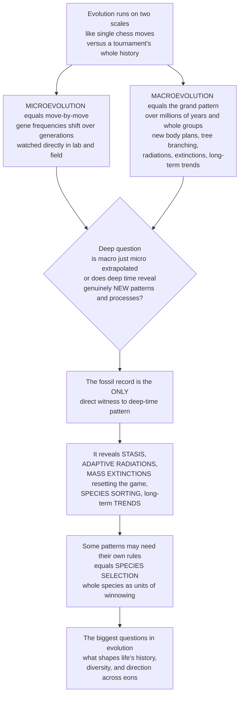

# 🌳 Macroevolution and Deep-Time Patterns

> [!abstract] TL;DR
> **Macroevolution** is evolution *at and above the species level* — speciation, extinction, the origin of major new body plans, the branching bushiness of the tree of life, great **adaptive radiations**, catastrophic **mass extinctions**, and long-term **trends** — all playing out across *millions of years*. Its sister, **microevolution**, is the move-by-move shift of gene frequencies within populations that biologists watch directly (a moth darkening, bacteria evolving resistance). The defining question of this section, and one only paleontology can answer, is whether macroevolution is *merely microevolution extrapolated over deep time* (the Modern Synthesis "extrapolationist" view) or whether the fossil record reveals **emergent processes** — like **stasis**, **species selection**, and clade-level trends — that are invisible over a human lifetime and not reducible to population genetics (the "paleobiology revolution" of Gould, Eldredge, Stanley, and Vrba). The fossil record is the *only direct witness* to these deep-time patterns, and it frames everything in this section.

---

## Intuition

**Analogy — chess moves versus the tournament's whole history.** Evolution operates on two very different scales, like the difference between watching individual chess *moves* and studying the sweep of an entire *tournament's history*. **Microevolution** is the move-by-move game biologists watch directly — small changes in a population's gene frequencies over generations. You can see a single knight advance; you can measure a peppered moth getting darker across a few decades, or a colony of bacteria evolving antibiotic resistance in a week. **Macroevolution** is the grand pattern that emerges over *millions of years* and across *whole groups of species* — the origin of major new body plans, the branching of the tree of life, explosive radiations, catastrophic extinctions, and long-term directional trends. It is the story the whole tournament tells, which no single move can show you.

Here is the deep question paleontology is uniquely equipped to answer: is macroevolution *just* microevolution accumulated over vast time — a smooth extrapolation of the moves you already understand — or does deep time reveal **patterns and processes that you simply cannot see in a lab over a few years**, genuinely new phenomena that emerge only at the scale of eons? The fossil record is the only direct witness, and it shows striking patterns: species that appear suddenly, persist essentially unchanged for millions of years, then vanish (**stasis**); explosive bursts of diversity when ecological opportunity opens (**adaptive radiations**); catastrophic **mass extinctions** that reset the whole board; **sorting among species** rather than just among individuals; and long-term **trends** in size or complexity. Some argue these need their *own rules* — like **species selection**, where entire species, not just individuals, are the units being winnowed. To study macroevolution is to ask the biggest questions in all of evolution: what shapes the overall history, diversity, and direction of life across the immensity of deep time, and does that history obey laws invisible at the scale of a single human lifetime?

---

## How It Works

### Core Mechanics

1. **Two scales, one continuum — or two.** *Microevolution* changes allele frequencies *within* a lineage (mutation, selection, drift, gene flow). *Macroevolution* concerns what happens *to and among* lineages: how fast they split, how long they persist, how often they die, and what large-scale shape their collective history takes.
2. **The fossil record supplies data no lab can.** Direct observation gives us moves over years; only rock gives us the *tournament* over hundreds of millions of years — the tempo of change, the timing of radiations, the geometry of extinctions, and the persistence of stasis.
3. **Pattern is separated from process.** Paleobiologists first *describe* patterns (diversity-through-time curves, origination and extinction rates, trends) and then ask *which process* produced them — ordinary microevolution extrapolated, or a higher-level process such as species selection.
4. **A hierarchy of selection may operate.** Selection can act on genes, individuals, and — the controversial claim — on *species themselves*, which have birth (speciation), death (extinction), and heritable emergent properties (like geographic range). If so, natural selection has a *macro* analogue.
5. **Reading requires correction.** The record is a biased sample; genuine deep-time signal is extracted only after standardizing for sampling and rock availability, then read *together with* phylogenies.

### Flow / Architecture



---

## Key Concepts

### 🟢 Secondary

- **Micro versus macro.** *Microevolution* is small change within a population you can watch in a human lifetime (a moth darkening, germs resisting a drug). *Macroevolution* is the big picture over millions of years — how new kinds of animals and plants arise, how the tree of life branches, and how whole groups rise and fall.
- **The tree of life is a bush, not a ladder.** Life diversifies by *branching* (one lineage splitting into many), not by marching toward "higher" forms. Some branches explode into hundreds of species; others dwindle to nothing.
- **Three headline patterns in the rocks.** *Stasis* — species often stay nearly the same for millions of years. *Radiations* — sometimes one ancestor bursts into many species very fast. *Extinctions* — sometimes huge fractions of life die out at once, then survivors radiate to fill the empty space.
- **Why fossils are essential.** You cannot watch a million years happen. The fossil record is the only *direct* record of these grand patterns — a time machine for evolution's big story.

### 🟡 Undergraduate

- **Macroevolution defined.** Evolution *at and above the species level*: speciation and extinction, diversification, the origin of *higher taxa* (genera, families, phyla) and major innovations, and large-scale patterns over geologic time. Paleontology is the science with unique access to macroevolutionary **pattern and tempo**.
- **Tempo and mode.** *Phyletic gradualism* — species transform slowly and steadily. *Punctuated equilibrium* (Eldredge & Gould, 1972) — long **stasis** interrupted by geologically brief bursts of change concentrated at speciation events. Stasis itself is a *pattern demanding explanation*, not just "nothing happening." (Developed in the companion sibling *Punctuated Equilibrium and Modes of Evolution*.)
- **Adaptive radiations and clade dynamics.** A single ancestor rapidly diversifies to fill open **ecospace** — Darwin's finches, cichlids, mammals after the K-Pg. Clades have "life cycles": a rise driven by **origination rate**, a peak, and a decline driven by **extinction rate**. Whether total diversity expands without limit or saturates toward a **logistic equilibrium** is a central debate. (Developed in *Adaptive Radiations and Diversification*.)
- **Extinction as a creative force.** *Background* extinction is the steady trickle; *mass* extinctions are rare catastrophes that reset the game and hand survivors the open stage. Extinction is *selective* — it favors different traits than everyday selection does. (Developed in *Extinction as an Evolutionary Force*.)
- **Large-scale trends and convergence.** *Cope's rule* — the tendency of lineages to evolve larger body size. Independent lineages repeatedly converge on similar solutions (streamlined bodies in sharks, ichthyosaurs, dolphins). But is a trend *driven* toward a goal, or a *passive* diffusion away from a boundary — a "drunkard's walk" of increasing variance (Gould's *Full House*)? (Developed in *Evolutionary Trends and Convergence*.)

### 🔴 Graduate

- **The central debate — extrapolation versus emergence.** The **Modern Synthesis** held that macroevolution is *nothing but* microevolution extended over time — the "extrapolationist" position. The **paleobiology revolution** (Gould, Eldredge, Stanley, Vrba, Raup) argued for **emergent** macroevolutionary processes not reducible to population genetics, operating in a **hierarchy of selection** with species as genuine units.
- **Species selection and species sorting.** *Species sorting* is any differential speciation and extinction that changes trait frequencies across a clade. *Species selection* (strict sense) requires the causal trait to be an **emergent, species-level property** (e.g. geographic range size, dispersal ability) rather than a mere aggregate of organismal traits (Vrba's **effect hypothesis** distinguishes the two). Either way, a *clade-level trend can arise with no directional change inside any lineage* — the key deep-time signature.
- **Evolvability, constraint, and key innovations.** Long-term patterns are shaped by *developmental constraints* (what body plans are even reachable), *evolvability* (a lineage's capacity to generate useful variation), and **key innovations** (flowers, flight, jaws) that unlock new adaptive zones and trigger radiations.
- **Contingency versus convergence.** Gould's *"replaying the tape of life"* thought experiment asks whether life's history is dominated by **contingency** (frozen accidents, mass-extinction lottery) or by **convergence** toward predictable optima (Conway Morris). The fossil record is the only arbiter.
- **Reading it quantitatively.** Macroevolution is inferred by *integrating phylogenies with the fossil record*: **Sepkoski's** genus- and family-level **diversity curves**, origination/extinction rate estimation, and standardized sampling via the **Paleobiology Database (PBDB)**. Birth-death models turn tree shape and stratigraphic ranges into rate estimates. (Phylogenetic side developed in *Cladistics and Fossil Phylogeny*.)

---

## Python Demo

```python
# Macroevolution & deep-time patterns, made visible:
#   (A) DIVERSIFICATION -- a birth-death process builds the tree of life.
#       Different speciation/extinction rates give bushy radiations,
#       flat equilibria, or long declines (diversity-through-time curves).
#   (B) MICRO vs MACRO -- a clade-level TREND (rise of a trait) emerges purely
#       from SPECIES SORTING: clades bearing the trait diversify faster,
#       with NO directional change inside any single lineage (no anagenesis).
# Pure numpy + matplotlib, fully runnable.

import numpy as np
import matplotlib.pyplot as plt

rng = np.random.default_rng(42)

# ----------------------------------------------------------------------
# (A) BIRTH-DEATH DIVERSIFICATION -- the shape of the tree of life
# ----------------------------------------------------------------------
def birth_death(lam, mu, t_max=100.0, dt=0.1, n0=5, n_reps=60):
    """Discrete-time birth-death: each lineage may speciate (rate lam) or
    go extinct (rate mu) per unit time. Returns the time grid and the mean
    lineage count (clade diversity) averaged over stochastic replicates."""
    steps = int(t_max / dt)
    t = np.linspace(0.0, t_max, steps + 1)
    traj = np.zeros((n_reps, steps + 1))
    for r in range(n_reps):
        n = n0
        traj[r, 0] = n
        for i in range(1, steps + 1):
            if n > 0:
                births = rng.binomial(n, min(lam * dt, 1.0))
                deaths = rng.binomial(n, min(mu * dt, 1.0))
                n = max(n + births - deaths, 0)   # 0 = clade extinct (absorbing)
            traj[r, i] = n
    return t, traj.mean(axis=0)

regimes = [
    ("Radiation   lam > mu", 0.060, 0.020, "#0f766e"),
    ("Equilibrium lam ~ mu", 0.040, 0.038, "#d97706"),
    ("Decline     lam < mu", 0.020, 0.050, "#dc2626"),
]

fig, (axA, axB) = plt.subplots(1, 2, figsize=(13, 5.4))

for label, lam, mu, color in regimes:
    t, mean_n = birth_death(lam, mu)
    axA.plot(t, mean_n, color=color, lw=2.4, label=label)

axA.set_title("(A) Diversification: birth-death shapes the tree of life",
              weight="bold", fontsize=11)
axA.set_xlabel("Deep time (arbitrary units)")
axA.set_ylabel("Number of lineages (clade diversity)")
axA.legend(frameon=False, fontsize=9)
axA.grid(alpha=0.25)

# ----------------------------------------------------------------------
# (B) SPECIES SORTING -- a clade-level trend with NO within-lineage change
# ----------------------------------------------------------------------
# Two species "types": trait ABSENT (A) and trait PRESENT (B).
# Type B has a higher net diversification rate (e.g. a key innovation
# raising speciation). Daughter species INHERIT the parent's type; no
# lineage ever changes its trait. Yet B's frequency rises across the
# whole clade -- a macroevolutionary trend from species selection alone.
t_max, dt = 150.0, 0.5
steps = int(t_max / dt)
t2 = np.linspace(0.0, t_max, steps + 1)

lamA, muA = 0.030, 0.020      # type A: net rate +0.010
lamB, muB = 0.045, 0.020      # type B: net rate +0.025  (faster diversifier)

NA = np.zeros(steps + 1); NB = np.zeros(steps + 1)
NA[0], NB[0] = 50.0, 50.0     # start at equal frequency
for i in range(1, steps + 1):
    NA[i] = NA[i-1] + (lamA - muA) * NA[i-1] * dt
    NB[i] = NB[i-1] + (lamB - muB) * NB[i-1] * dt

freqB = NB / (NA + NB)

axB.plot(t2, freqB, color="#7c3aed", lw=2.8,
         label="Clade-wide frequency of the trait")
axB.axhline(0.5, color="#94a3b8", ls=":", lw=1)
axB.hlines([0.0, 1.0], 0, t_max, color="#cbd5e1", lw=1)  # trait fixed per lineage
axB.text(4, 0.05, "trait is fixed within every lineage -- no anagenesis",
         fontsize=8, color="#64748b")
axB.set_ylim(-0.05, 1.05)
axB.set_title("(B) Species sorting: a trend with no within-lineage change",
              weight="bold", fontsize=11)
axB.set_xlabel("Deep time (arbitrary units)")
axB.set_ylabel("Fraction of species bearing the trait")
axB.legend(frameon=False, fontsize=9, loc="center right")
axB.grid(alpha=0.25)

plt.tight_layout()
plt.savefig("macroevolution_patterns.png", dpi=120)

print("(A) Radiation clade grows near-exponentially; the decline clade "
      "dwindles toward extinction -- same equations, different rates.")
print(f"(B) Trait frequency rises {freqB[0]:.2f} -> {freqB[-1]:.2f} purely by "
      "differential diversification: SPECIES SELECTION, not anagenesis.")
```

Panel A shows the engine of the tree of life: a single **birth-death process** produces an explosive bushy **radiation**, a roughly flat **equilibrium**, or a long **decline** depending only on the balance of speciation and extinction rates — the same dynamics that generate real diversity-through-time curves. Panel B is the conceptual crux of macroevolution: a genuine clade-level **trend** (the trait sweeping from 50 percent toward fixation) emerges even though *no individual lineage ever changes* — the trend is driven entirely by trait-bearing species *speciating faster*, the signature of **species selection / sorting** that is invisible over a human lifetime.

---

## Real-World Applications

- **Estimating diversification rates from real clades.** Birth-death models fit to molecular phylogenies and fossil ranges reveal *when* and *how fast* groups radiated — e.g. the post-K-Pg explosion of placental mammals, or the Cambrian burst of animal body plans.
- **Testing species selection empirically.** David Jablonski's studies of Cretaceous marine molluscs show that **geographic range size** — an emergent, species-level property — is heritable at the species level and predicts survival, a textbook candidate for genuine species selection.
- **Reading mass-extinction selectivity.** The Big Five did not kill at random: broad geographic range buffered against *background* extinction but not against *mass* extinctions, which changed the rules and reshuffled which traits win. This selectivity is legible only in the deep-time record.
- **Conservation baselines.** Macroevolutionary origination and extinction rates set the *natural* backdrop against which today's biodiversity crisis (the possible "sixth mass extinction") is measured and judged anomalous.
- **The Paleobiology Database.** A global, open, community-curated fossil-occurrence archive that powers standardized, sampling-corrected estimates of diversity and rates through the entire Phanerozoic — turning macroevolution into a quantitative, reproducible science.

---

## Common Pitfalls

- **"Macroevolution is a fundamentally different *mechanism*."** At minimum it is the same microevolutionary processes plus branching plus deep time; the *live* scientific question is whether *additional* higher-level processes (species selection) operate *on top of* that — not whether microevolution is somehow suspended.
- **Confusing species sorting with species selection.** *Any* differential speciation/extinction is *sorting*; strict *species selection* requires the causal trait to be a genuinely **emergent, species-level property**. Vrba's *effect hypothesis* exists precisely to keep organism-level causes from being mislabeled as species-level ones.
- **Mistaking a passive trend for a driven one.** A lineage diffusing away from a lower size boundary produces a rising *maximum* and *mean* with no selective push toward largeness — Gould's "drunkard's walk." Cope's rule may be partly this artifact; you must model the whole distribution (his *Full House* argument), not just the record-holder.
- **Reading the tree as a ladder of progress.** Increasing *maximum* complexity over time does not mean life is *driven* toward complexity; bacteria remain the mode. Progress-ladder thinking is the single most persistent error in interpreting macroevolutionary trends.
- **Trusting raw diversity curves.** Origination and extinction "events" can be manufactured by rock availability and the "pull of the recent." Standardized subsampling (rarefaction, shareholder-quorum subsampling) must precede any claim about deep-time pattern.
- **Treating stasis as absence of data.** Long morphological stasis is a *real, active* pattern demanding explanation (stabilizing selection, constraint, habitat tracking) — not merely a gap or a failure to sample change.

---

## Related Concepts

This note is the **opener of Section 03 (Macroevolution and Patterns)** and frames the siblings that follow, referenced here in prose so they wire once written: the vault hub *Paleontology and Deep Time Overview*; *Punctuated Equilibrium and Modes of Evolution* (tempo, mode, and stasis); *Adaptive Radiations and Diversification* (filling ecospace, clade dynamics, diversity-through-time); *Extinction as an Evolutionary Force* (background versus mass, extinction as a creative and selective process); *Evolutionary Trends and Convergence* (Cope's rule, driven versus passive trends, iterative convergence); and *Cladistics and Fossil Phylogeny* (reading pattern from trees plus the record).

Verified cross-vault links to existing notes:

- [[Speciation_and_Macroevolution]] — the biology-vault companion on how lineages split; this note zooms out from the *origin* of species to patterns *among and above* species.
- [[Natural_Selection_and_Adaptation]] — the organism-level mechanism whose *macro* analogue (species selection) is the central question here.
- [[Evidence_for_Evolution]] — the fossil, anatomical, and molecular evidence base; macroevolutionary pattern is a major line of that evidence.
- [[Phylogenetics_and_the_Tree_of_Life]] — the branching framework whose *shape* encodes diversification and extinction rates.
- [[The_History_of_Life_on_Earth]] — the concrete deep-time narrative (radiations, extinctions) that these abstract patterns describe.
- [[Group_and_Multilevel_Selection]] — the evolutionary-game-theory treatment of selection acting at higher levels, the theoretical cousin of species selection.
- [[Biodiversity_and_Species_Richness]] — the ecology-vault view of standing diversity, whose deep-time trajectory macroevolution explains.
- [[Extinction_and_the_Sixth_Mass_Extinction]] — the present-day biodiversity crisis read against the macroevolutionary extinction baseline.

---

## Review Questions

1. **(Secondary)** Using the chess analogy, explain the difference between microevolution and macroevolution. Give one example of a change biologists can watch directly and one pattern that only the fossil record can reveal.
2. **(Undergraduate)** Adaptive radiations and mass extinctions are often described as two sides of the same coin. Explain how an extinction can *cause* a radiation, and name a real example of survivors radiating into ecospace emptied by a mass extinction.
3. **(Graduate)** A clade shows a clear rise in average body size over 20 million years. Describe how you would distinguish (a) a *driven* trend by anagenetic selection within lineages, (b) a *passive* diffusion away from a size boundary, and (c) a *species-selection* trend from differential diversification — and explain what data (fossil, phylogenetic, distributional) each hypothesis predicts.

---

## Sources

- Gould, S. J. (2002). *The Structure of Evolutionary Theory*. Harvard University Press.
- Stanley, S. M. (1979). *Macroevolution: Pattern and Process*. W. H. Freeman.
- Jablonski, D. (2017). "Approaches to Macroevolution: 1. General Concepts and Origin of Variation." *Evolutionary Biology*, 44(4), 427–450.
- Sepkoski, J. J. (1981). "A factor analytic description of the Phanerozoic marine fossil record." *Paleobiology*, 7(1), 36–53.
- Eldredge, N. & Gould, S. J. (1972). "Punctuated equilibria: an alternative to phyletic gradualism." In T. J. M. Schopf (ed.), *Models in Paleobiology*, 82–115.

---

#paleontology #macroevolution #deep-time #species-selection #diversification
