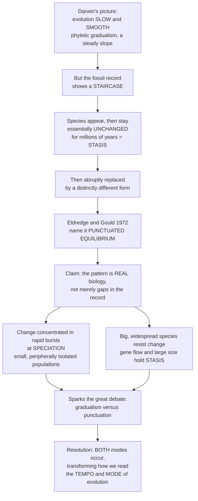

# 🪜 Punctuated Equilibrium and Modes of Evolution

> [!abstract] TL;DR
> **Punctuated equilibrium** (Eldredge & Gould, 1972) is the claim that the fossil record's dominant pattern is not a smooth ramp of gradual change but a **staircase**: species stay morphologically **stable for millions of years (stasis)**, then change **rapidly at speciation events**, when small, isolated populations split off. It reframed the *tempo and mode* of evolution — arguing that **stasis is a real phenomenon demanding explanation**, that most change is concentrated at **branching (cladogenesis)** rather than within lineages (anagenesis), and it launched the great **gradualism-vs-punctuation** debate whose answer turned out to be "both happen." Today, paleontologists read tempo and mode statistically, testing fossil time-series against **stasis, random walk, and directional** models (Hunt, 2007).

---

## Intuition

**Analogy first — the ramp versus the staircase.**

When Darwin imagined evolution, he pictured it as **slow and smooth** — species gradually, imperceptibly transforming generation by generation, like a hill slope rising steadily. This is **phyletic gradualism**: the whole lineage inches upward, and if you climbed the rock layers you would see a continuous, gentle **ramp** of change.

But when paleontologists actually followed a single lineage up through the strata, they kept seeing something that did not match. A species appears, then stays **essentially unchanged** for millions of years — **stasis**, literally "no change" — and then, relatively suddenly, is replaced by a distinctly different form. Not a ramp, but long flat **plateaus** with abrupt **jumps**: a **staircase**.

In 1972 Niles Eldredge and Stephen Jay Gould gave this pattern a name — **punctuated equilibrium** — and made a radical claim: the jerkiness is **not just gaps in an imperfect record**, it is **real biology**. Most morphological change is concentrated in rare, rapid bursts that happen during **speciation** (when a small, isolated population splits off and changes fast), while established, large, widespread species mostly **stay put** because they are well-adapted and their sheer size and gene flow **resist change**. The "sudden" jumps look instant in geological time but might take thousands of years — fast for a fossil, slow for a life. That single reframing turned stability itself into something we must *explain*, and located the action of evolution at the moment lineages branch.

---

## How It Works

### Core mechanics

1. **The question of tempo and mode.** George Gaylord Simpson asked: how *fast* does evolution go (**tempo**) and in what *pattern* (**mode**)? The fossil record is the only direct archive of rates and patterns over deep time — you read them straight off a stacked sequence of a lineage's morphology.
2. **Phyletic gradualism (the traditional expectation).** Slow, steady, continuous transformation of an entire lineage — **anagenesis**. Speciation is just gradual divergence; the fossil series should be a smooth morphological ramp.
3. **Punctuated equilibrium (the alternative).** The record is dominated by **stasis** — species morphologically stable for most of their existence — **punctuated** by rapid change concentrated *at and by* **speciation**. New form arises via **cladogenesis** in small, peripherally isolated populations (allopatric speciation), which is geologically "instantaneous." Change is **coupled to branching**, not to slow within-lineage drift.
4. **Stasis is data, not absence of data.** If species really sit still for millions of years, that stability needs a cause: **stabilizing selection**, **gene flow / genetic homeostasis** across a large range, **developmental and genetic constraints**, and **habitat tracking** (populations follow their niche in space rather than adapting in place).
5. **The decoupling claim.** Macroevolution may not be simple microevolution extrapolated. If trends arise from differential origination and extinction of *species* (a higher-level sorting), then species behave as **real, bounded entities** — the basis for **species selection**.
6. **The great debate.** Is the staircase **real biology** or an **artifact** of an incomplete record (gaps, sampling, the Signor–Lipps effect)? And is it saltation? The resolution: **both modes occur**, their frequencies vary by group, and PE is ordinary Darwinian change — just rapid and localized, **not** macromutation.
7. **The modern reading.** Gene Hunt's statistical framework fits fossil time-series to three end-member models — **stasis, unbiased random walk, and directional** — turning "ramp vs staircase" into a testable, quantitative question.

### Flow



---

## Key Concepts

### Secondary (intuition level)
- **Gradualism = a ramp:** slow, smooth, continuous change of a whole lineage.
- **Punctuated equilibrium = a staircase:** long flat stretches (**stasis**) broken by sudden jumps.
- **Stasis** means "staying the same" — often for millions of years.
- Proposed by **Niles Eldredge and Stephen Jay Gould in 1972**; their bold claim was that the staircase is *real*, not just missing fossils.

### Undergraduate (mechanism level)
- **Tempo and mode** (Simpson): the *rate* and the *pattern* of evolution, read directly from fossil lineages.
- **Anagenesis** (change within a single lineage over time) vs **cladogenesis** (change accompanying a branching/splitting event). Gradualism emphasizes anagenesis; PE ties change to cladogenesis.
- **Allopatric speciation in peripheral isolates:** a small population, cut off at the edge of a range, diverges fast — the source of PE's "instantaneous" jumps.
- **Mechanisms of stasis:** stabilizing selection, gene flow / homeostasis across a large range, genetic and developmental constraint, and **habitat tracking**.
- **PE is not saltation:** it is *not* "hopeful monsters" or macromutation. Change is Darwinian and gradual on a *human* timescale — merely rapid and localized on a *geological* one.
- **Artifact worry:** gaps and sampling (the **Signor–Lipps effect**) can mimic abrupt appearances, so punctuation must be *tested*, not assumed.

### Graduate (frontier level)
- **Decoupling of macro- from micro-evolution:** if morphological trends come from differential speciation/extinction rather than within-population adaptation, they reflect **species sorting / species selection** — a higher-level process, not extrapolated microevolution.
- **Hunt's model-selection framework (2007):** fit each fossil sequence to **stasis** (fluctuation about a mean, Ornstein–Uhlenbeck-like), **unbiased random walk (URW)**, and **general/directional random walk (GRW)**; use AICc to pick the best. Across hundreds of sequences, **stasis and random walk dominate**; sustained directional change is comparatively rare.
- **Rate metrics and scale-dependence:** rates in **darwins** (Haldane's proportional change per million years) or **haldanes** (standard deviations per generation); Gingerich showed measured **rates shrink as the measurement interval lengthens** — long-interval "gradual" rates and short-interval "punctuational" rates are not directly comparable.
- **The continuum view:** pure gradualism and pure punctuation are **end-members**; real lineages fall along a spectrum (including **punctuated anagenesis** and **punctuated cladogenesis**).
- **Documented both ways:** long stasis in many marine invertebrates (e.g., bryozoans); genuine gradualism in some lineages (Sheldon's Ordovician trilobites; certain planktonic foraminifera).

---

## Python Demo

```python
# Modes of evolution read from a stratigraphic column.
# (a) Phyletic GRADUALISM (a smooth ramp) vs PUNCTUATED EQUILIBRIUM (a staircase).
# (b) Distinguishing the three canonical modes of a fossil time-series
#     (Hunt 2007): STASIS vs unbiased RANDOM WALK vs DIRECTIONAL.
import numpy as np
import matplotlib.pyplot as plt

rng = np.random.default_rng(42)

# ---------------------------------------------------------------
# (a) GRADUALISM vs PUNCTUATED EQUILIBRIUM
#     Trait value sampled up a stratigraphic column (old -> young).
# ---------------------------------------------------------------
n = 500
time = np.linspace(0, 10, n)                 # ~10 million years

# Phyletic gradualism: steady directional drift + tiny noise = a RAMP.
gradualism = 0.55 * time + np.cumsum(rng.normal(0, 0.04, n))

# Punctuated equilibrium: long stasis, rare rapid jumps at speciation = a STAIRCASE.
punctuated = np.zeros(n)
level = 0.0
jump_at = {120: 2.0, 300: 1.6, 430: 2.4}     # rare cladogenesis events
for i in range(n):
    if i in jump_at:
        level += jump_at[i]                  # geologically "instantaneous" shift
    punctuated[i] = level + rng.normal(0, 0.08)   # stasis = fluctuate about a mean

# ---------------------------------------------------------------
# (b) STASIS vs RANDOM WALK vs DIRECTIONAL  (Hunt 2007 modes)
# ---------------------------------------------------------------
m = 200
stasis      = rng.normal(0.0, 1.0, m)                 # fluctuate about a fixed mean
random_walk = np.cumsum(rng.normal(0.0, 1.0, m))      # unbiased steps accumulate
directional = np.cumsum(rng.normal(0.4, 1.0, m))      # biased steps -> a trend

def net_over_gross(series):
    """Net change relative to total distance travelled.
    ~0 for stasis, small for a random walk, near 1 for a strong trend."""
    steps = np.diff(series)
    net   = abs(series[-1] - series[0])
    gross = np.sum(np.abs(steps)) + 1e-9
    return net / gross

for name, s in [("stasis", stasis), ("random walk", random_walk),
                ("directional", directional)]:
    print(f"{name:12s}  net/gross = {net_over_gross(s):.3f}")

# ---------------------------------------------------------------
# Plot both comparisons
# ---------------------------------------------------------------
fig, (ax1, ax2) = plt.subplots(1, 2, figsize=(13, 5))

ax1.plot(time, gradualism, lw=2, label="phyletic gradualism (ramp)")
ax1.plot(time, punctuated, lw=2, label="punctuated equilibrium (staircase)")
ax1.set_xlabel("Geological time (Myr, old -> young)")
ax1.set_ylabel("Trait value (e.g. shell size)")
ax1.set_title("(a) Gradualism vs Punctuated Equilibrium")
ax1.legend(loc="upper left")

ax2.plot(stasis,      lw=1.6, label="stasis (about a mean)")
ax2.plot(random_walk, lw=1.6, label="unbiased random walk")
ax2.plot(directional, lw=1.6, label="directional (GRW)")
ax2.axhline(0, color="grey", lw=0.8, ls="--")
ax2.set_xlabel("Stratigraphic sample (time step)")
ax2.set_ylabel("Trait value")
ax2.set_title("(b) Three modes of a fossil time-series")
ax2.legend(loc="upper left")

plt.tight_layout()
plt.show()

# Expected console output (net/gross): stasis ~0.0-0.1, random walk small,
# directional close to 1 -- a quick heuristic behind Hunt's formal AICc test.
```

The left panel makes the core contrast visible — a smooth **ramp** versus a **staircase of plateaus and jumps**. The right panel shows why paleontologists cannot just eyeball a trend: a **random walk** can wander far without any bias, so distinguishing it from true **directional** change (and from **stasis**) requires a statistic like net-change-over-gross-change — the intuition behind Hunt's formal model selection.

---

## Real-World Applications

- **Reading evolutionary rates from lineages.** Gingerich's compilations of measured rates across hundreds of cases revealed the crucial **scale-dependence of rates** — a direct, practical consequence of taking tempo seriously.
- **Model-fitting fossil time-series.** Hunt's `paleoTS` framework is now standard: fit **stasis / random walk / directional** models to a measured sequence and let **AICc** decide. Applied broadly, it shows **stasis is astonishingly common** — vindicating the empirical core of PE.
- **Calibrating phylogenetic methods.** Whether change is **gradual (clock-like)** or **punctuated (concentrated at nodes)** shapes branch-length and rate priors in Bayesian tip-dating and "speciational" models of trait evolution.
- **Explaining living fossils.** Long-term morphological stability in horseshoe crabs, coelacanths, and many bivalves is exactly the **stasis** phenomenon PE insisted we must explain rather than ignore.
- **Framing eco-evolutionary change.** The PE picture — stability punctuated by fast change during range shifts and isolation — informs how biologists think about rapid evolution under modern habitat fragmentation and climate change.

---

## Common Pitfalls

- **Confusing PE with saltation or "hopeful monsters."** PE is *ordinary Darwinian* change concentrated at speciation — not macromutation in a single generation. Gould spent years correcting this misreading.
- **Thinking "sudden" means instant.** A punctuational jump is *geologically* rapid — often thousands of years and thousands of generations — plenty of time for gradual selection. "Fast for a fossil, slow for a life."
- **Assuming gaps prove punctuation.** Incomplete sampling and the **Signor–Lipps effect** can manufacture apparent jumps. Punctuation must be *tested* against a well-sampled sequence, not inferred from the record's rawness.
- **Treating gradualism and PE as mutually exclusive.** They are **end-members of a continuum**; both are documented, with frequencies varying by clade. The mature answer is "both happen."
- **Ignoring stasis as needing explanation.** The surprising, information-rich part of the record is the *stability*. "Stasis is data" — dismissing it as boring throws away the central puzzle.
- **Mistaking a species-level trend for anagenesis.** A directional trend across a clade can arise from **differential speciation/extinction (species sorting)**, not from any lineage transforming in place — a higher-level process the naive eye misreads.

---

## Related Concepts

- [[Speciation_and_Macroevolution]] — PE couples morphological change to **speciation** (cladogenesis in small, allopatric, peripherally isolated populations); this note is the mechanistic foundation for PE's central claim.
- [[Natural_Selection_and_Adaptation]] — **stabilizing selection** is a leading explanation for why well-adapted species remain in stasis for millions of years.
- [[Phylogenetics_and_the_Tree_of_Life]] — whether change is gradual or punctuated shapes **branch-length and rate models** on the tree; PE emphasizes change at the nodes.
- [[Random_Variables]] — the **unbiased random walk** null model is a stochastic process defined by its step **expectation and variance**; distinguishing it from a trend is central to reading modes.
- [[Statistical_Inference]] — Hunt's **model-selection (AICc)** approach for choosing among stasis, random walk, and directional change is applied statistical inference on fossil time-series.

*Within this vault (siblings, forthcoming):* punctuated equilibrium sits inside the broader story of **Macroevolution and Deep-Time Patterns**, depends critically on understanding **The Fossil Record and Its Biases** (the "real vs artifact" debate), interacts with **Cladistics and Fossil Phylogeny** (change at branching), and complements **Evolutionary Trends and Convergence** and **Adaptive Radiations and Diversification** as ways deep time expresses itself in morphology.

---

## Review Questions

**Secondary.** In one sentence each, describe the "ramp" and the "staircase" pictures of evolution, and name the two scientists who proposed the staircase model in 1972.

**Undergraduate.** Punctuated equilibrium insists that stasis is *real biology*, not an artifact of missing fossils. (a) Name two mechanisms that could keep a large, widespread species morphologically stable for millions of years. (b) How would you distinguish genuine stasis from a merely incomplete record?

**Graduate.** You are handed a fossil time-series of a single measured trait. Explain how you would use Hunt's (2007) model-selection framework to decide among **stasis, unbiased random walk, and directional change** — and explain why a simple statistic like "net change vs gross change" is a useful heuristic but insufficient on its own for a rigorous conclusion.

---

## Sources

- Eldredge, N. & Gould, S. J. (1972). "Punctuated equilibria: an alternative to phyletic gradualism." In T. J. M. Schopf (ed.), *Models in Paleobiology*, 82–115. Freeman, Cooper.
- Gould, S. J. & Eldredge, N. (1993). ["Punctuated equilibrium comes of age."](https://www.nature.com/articles/366223a0) *Nature* 366: 223–227.
- Hunt, G. (2007). ["The relative importance of directional change, random walks, and stasis in the evolution of fossil lineages."](https://www.pnas.org/doi/10.1073/pnas.0704088104) *PNAS* 104: 18404–18408.
- Sheldon, P. R. (1987). ["Parallel gradualistic evolution of Ordovician trilobites."](https://www.nature.com/articles/330561a0) *Nature* 330: 561–563.
- Gingerich, P. D. (1983). ["Rates of evolution: effects of time and temporal scaling."](https://www.science.org/doi/10.1126/science.222.4620.159) *Science* 222: 159–161.

---

#paleontology #punctuated-equilibrium #gradualism #stasis #tempo-and-mode
