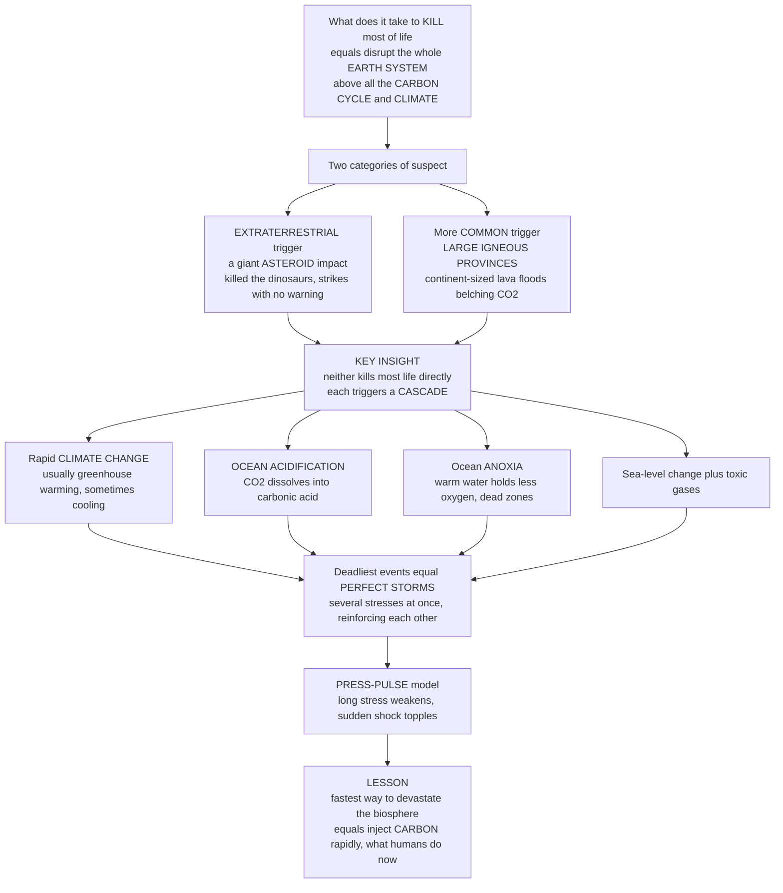

# 💥 Causes of Mass Extinctions

> [!abstract] TL;DR
> What does it actually take to kill off most of life on Earth? Compare all the great extinctions and a striking pattern emerges: killing on a planetary scale means disrupting the whole Earth **system** — above all, hijacking the **carbon cycle** and the **climate**. The suspects fall into two categories. The dramatic one is **extraterrestrial**: a giant **asteroid** or comet impact, the proven killer of the dinosaurs, which strikes without warning. But the more **common** culprit, implicated in most of the Big Five, is homegrown and slower — colossal volcanism from **Large Igneous Provinces**, continent-sized floods of lava that erupt over millennia and belch enormous volumes of CO2 and toxic gas. Here is the key insight: neither the impact nor the lava kills most life *directly*. Each triggers a **cascade** of kill mechanisms — rapid **climate change** (usually greenhouse warming, sometimes cooling), **ocean acidification** as CO2 dissolves into seawater, and ocean **anoxia** as warm water starves of oxygen — plus sea-level change and poisons. The deadliest extinctions were **perfect storms** where several of these stresses hit at once and reinforced one another. This is the **press-pulse** model: a long-term stress that weakens ecosystems, then a sudden shock that topples them. The sobering lesson: the fastest known way to devastate the biosphere is to inject carbon into the atmosphere rapidly — exactly what humanity is doing now.

---

## Intuition

**Analogy — the finely tuned machine and the two ways to break it.** Picture the biosphere as an intricate machine, tuned over millions of years to run smoothly in a particular, stable environment — a certain temperature, a certain ocean chemistry, a certain sea level. Like any finely tuned machine, it tolerates gentle nudges: shift a dial slowly and the machine adjusts, re-tunes, keeps running. A **mass extinction** is what happens when something violently knocks that machine out of balance *faster than it can re-tune*. The gears grind, feedbacks run wild, and whole subsystems seize. The question "what causes mass extinctions" is really the question "what is powerful and fast enough to wreck the machine?"

There are two ways to deliver that blow, and they map onto the two categories of suspect. The first is a **hammer from the sky** — a giant asteroid, the murder weapon at the end of the Cretaceous, striking without warning and darkening the world in an afternoon. The second, far more common, is a **fire from within** — Large Igneous Provinces, continent-sized floods of lava that erupt for tens of thousands of years and vomit carbon dioxide and toxic gas into the air. Here is the twist that makes this topic so rich: *neither weapon does most of its killing directly*. The asteroid does not swat most species; the lava does not roast them. Instead, each **poisons the machine's control system** — the carbon cycle and the climate — and *that* is what kills. Inject enough carbon fast enough and you get a chain reaction: the planet warms, the oceans turn acidic, and the seas suffocate into dead zones, all at once. The worst extinctions were **perfect storms** where these stresses stacked and amplified each other. Paleontologists capture this with the **press-pulse** idea — a slow chronic stress (the *press*) grinds the machine down, and a sudden shock (the *pulse*) shoves it over the edge. Understand the causes of extinction and you learn a chilling truth: to devastate life on Earth, you do not need to touch the organisms at all — you only need to hijack the carbon cycle fast.

---

## How It Works

### Core Mechanics

1. **Separate the trigger from the kill mechanism.** The single most important distinction in this whole topic. The **ultimate trigger** is the initiating catastrophe — an impact, a Large Igneous Province, a glaciation. The **proximate kill mechanisms** are what actually do the dying — warming, acidification, anoxia, poisoning, habitat loss. One trigger unleashes several kill mechanisms; the same kill mechanism can be reached from different triggers.
2. **Trigger one — bolide impact.** A large asteroid or comet strike. The proven case is the **end-Cretaceous (K-Pg)**, fingerprinted by a global **iridium** anomaly and the ~180 km **Chicxulub** crater. The impact drives an **impact winter**: dust and sulfate aerosols block sunlight, photosynthesis collapses, and food webs starve from the base up, followed by wildfires and acid rain. Searches for comparable impact signatures at the *other* Big Five boundaries have mostly come up empty — impacts are dramatic but rare.
3. **Trigger two — Large Igneous Provinces (the leading suspect).** Continent-scale **flood-basalt** volcanism erupting over 10^4–10^6 years. LIPs coincide with *most* of the Big Five: the **Siberian Traps** (end-Permian), the **Central Atlantic Magmatic Province / CAMP** (end-Triassic), the **Deccan Traps** (a contributor at the end-Cretaceous), and Devonian volcanism. LIPs release colossal **CO2**, plus **SO2**, halogens, and **thermogenic** gases cooked out of the sediments the magma intrudes.
4. **Trigger three — tectonic and biotic.** Continental configuration, **sea-level change**, and **glaciation** (the end-Ordovician, driven by cooling and falling seas), plus rarer biotic causes. These reshape habitats and climate more slowly.
5. **The kill-mechanism cascade.** Triggers converge on a common lethal chain: rapid **climate change** (usually greenhouse **warming** from CO2; occasionally **cooling** as in the Ordovician), **ocean acidification** (CO2 to carbonic acid, dissolving carbonate shells), and ocean **anoxia / euxinia** (deoxygenation and toxic H2S). Almost every event carries a giant **carbon-isotope excursion**, the chemical fingerprint of a carbon-cycle upheaval.
6. **Rate is everything.** Life copes with slow change and dies from fast change. Slow carbon release lets weathering, ocean buffering, and adaptation keep pace; a rapid pulse outruns every buffer, so the *same total* carbon becomes far more lethal when injected quickly.
7. **Synergy and the press-pulse model.** The severest extinctions came from **multiple interacting stressors** — perfect storms. Arens and West's **press-pulse hypothesis** formalizes this: a long-term **press** disturbance erodes ecosystem resilience so that a short **pulse** trigger pushes the system across an **extinction threshold**. Single-cause explanations usually fail because it took a combination.
8. **Reading causes from a broken record.** Attribution is hard. Causes are inferred from **proxies** (isotopes, trace metals, temperature) through an incomplete, biased fossil record, and dating cause precisely against effect is genuinely difficult — hence the long **impact-versus-volcanism** debates. (The old claim of a regular 26-million-year "Nemesis" periodicity has been debunked.)

### Flow / Architecture



---

## Key Concepts

### 🟢 Secondary

- **Two kinds of trigger.** Mass extinctions start either with a **space rock** (a giant asteroid or comet, the proven killer of the dinosaurs) or, far more often, with **gigantic volcanoes** — continent-sized floods of lava called Large Igneous Provinces that erupt for thousands of years.
- **The trigger is not the killer.** The asteroid did not personally swat every dinosaur, and the lava did not roast most species. Instead each poisons the air and oceans, and *that* does the killing. The weapon works indirectly.
- **The killing chain.** Pump too much CO2 into the air too fast and three things go wrong together: the planet **heats up**, the oceans turn **acidic** (dissolving shells), and the seas run out of **oxygen** (creating dead zones). This chain is the real cause of death.
- **Speed matters more than size.** Life can handle slow change — it adapts. It is *fast* change that kills, because nothing can keep up. The deadliest extinctions were the fastest ones.
- **Perfect storms.** The worst extinctions happened when several disasters piled on at once, each making the others worse — a "press" that weakens life over a long time, then a sudden "pulse" that finishes the job.
- **A warning for today.** The fastest way to wreck the living world is to dump carbon into the air quickly. That is exactly what burning fossil fuels does now, which is why deep-time extinctions are a warning about our own future.

### 🟡 Undergraduate

- **Triggers versus kill mechanisms.** Always distinguish the **ultimate trigger** (impact, LIP, glaciation) from the **proximate kill mechanisms** (warming, acidification, anoxia, poisoning, sea-level and habitat change). One trigger drives several kill mechanisms; disentangling them is the core analytical task.
- **Bolide impacts.** The **K-Pg** event is the gold standard: a worldwide **iridium** layer (iridium is rare in Earth's crust but abundant in meteorites) and the **Chicxulub** crater identify an asteroid ~10 km across. The lethal mechanism was an **impact winter** — dust and sulfate aerosols blocking sunlight, collapsing photosynthesis. Crucially, impact signatures are *largely absent* from the other four Big Five boundaries.
- **Large Igneous Provinces — the common thread.** Flood basalts coincide with the end-Permian (**Siberian Traps**), end-Triassic (**CAMP**), Late Devonian, and end-Cretaceous (**Deccan Traps**, alongside Chicxulub). Beyond CO2, LIPs emit **SO2** (short-lived cooling and acid rain), **halogens** (ozone damage), and **thermogenic** greenhouse gases baked out of intruded coal, salt, and carbonate — often the biggest carbon source of all.
- **The kill-mechanism cascade in detail.** (1) **Warming** from CO2 raises temperatures past organismal tolerances and shifts climate belts. (2) **Ocean acidification**: rising CO2 forms carbonic acid, lowering pH and carbonate saturation so shell- and reef-builders cannot calcify. (3) **Anoxia/euxinia**: warm water holds less O2 and stratifies, ventilation fails, and sulfate-reducing bacteria produce toxic **H2S** — spreading dead zones. Sea-level change, wildfires, UV damage, and tsunamis add to the toll.
- **The carbon cycle is the master variable.** Nearly every mass extinction is marked by a large **carbon-isotope excursion**, evidence that the global carbon cycle was violently perturbed. Because warming, acidification, and anoxia all flow from a carbon pulse, the carbon cycle is the hub linking trigger to kill.
- **Press-pulse and synergy.** Arens and West argued that a single cause rarely suffices. A chronic **press** (e.g. sustained LIP warming) lowers resilience; a discrete **pulse** (e.g. a final eruptive burst or an impact) then crosses the **extinction threshold**. The combination is worse than either alone — a synergy, not a sum.

### 🔴 Graduate

- **Attribution as an inverse problem.** Reconstructing causes means inverting **proxies** — carbon and other stable isotopes, redox-sensitive trace metals (Mo, U, Ce anomalies for anoxia), clumped-isotope and Mg/Ca paleothermometry, mercury as a LIP tracer — read through a **taphonomically biased, temporally incomplete** record. The **Signor-Lipps effect** smears abrupt kills into apparent gradual declines, and high-precision U-Pb geochronology is often the only way to test whether a candidate trigger truly *predates* the biotic crisis (the crux of the impact-versus-volcanism debate).
- **LIP lethality is about volatiles, not lava.** Basalt volume correlates only loosely with extinction severity; what matters is the **volatile flux** and its **sediment interaction**. Magma intruding organic-rich shales, evaporites, or carbonates liberates **thermogenic CO2, CH4, and halocarbons** that can dwarf the mantle-derived flux, plus SO2 aerosols. The pacing of emplacement (pulsed sills versus steady effusion) controls whether the carbon pulse outruns Earth-system buffers.
- **Rate, buffering, and thresholds of catastrophe.** Rothman's analysis of carbon-isotope excursions argues that a mass extinction follows when carbon is added **faster** than the ocean-carbonate buffer and biological pump can absorb it, or in a total mass above a critical amount — a **rate/mass threshold** in the coupled carbon system. This reframes "how big was the trigger" as "how fast relative to the buffering timescale," and directly indicts the anthropogenic release rate.
- **Formalizing press-pulse.** In dynamical terms, the **press** lowers the basin of attraction of the healthy ecosystem state (reduces resilience), so a **pulse** perturbation that would normally be absorbed instead drives the system across a **bifurcation** into collapse — connecting extinction theory to **tipping points**, hysteresis, and critical transitions. Recovery is slow because the alternate (impoverished) state is itself stabilized.
- **Selectivity as a causal fingerprint.** *Who* dies constrains *how*. Preferential loss of heavily calcified, low-metabolic, tropical, or reef taxa points to **acidification plus warming**; loss of deep-water and physiologically buffered taxa points to **anoxia**; a size- or thermal-tolerance signal points to temperature. Extinction selectivity is thus a diagnostic tool, not just an outcome.
- **Why monocausal stories keep failing.** The end-Permian and end-Triassic show LIP-driven warming-acidification-anoxia triads; the end-Ordovician shows the *opposite* polarity (glacial cooling and sea-level fall, then a second pulse on deglaciation); the end-Cretaceous had *both* Deccan volcanism and an impact. The unifying principle is not a single culprit but a **carbon-cycle and climate perturbation delivered faster than the biosphere can adapt**, usually compounded by multiple synergistic stressors.
- **The deep-time template for the present.** The recurring signature — rapid carbon release, then warming plus acidification plus deoxygenation — is precisely the syndrome now unfolding anthropogenically, at a carbon-release rate that rivals or exceeds even the end-Permian. Deep time supplies both the mechanism and the calibrated warning.

---

## Python Demo

```python
# CAUSES OF MASS EXTINCTIONS -- four quantitative views of the kill machinery:
#   (A) ONE TRIGGER: a carbon (CO2) pulse from a Large Igneous Province or impact,
#       injected into the atmosphere and then drawn down by slow weathering.
#   (B) THE CASCADE: that single carbon pulse propagates into THREE correlated
#       kill mechanisms -- warming, ocean acidification (pH drop), and anoxia
#       (deoxygenation) -- all rising together from one cause.
#   (C) WHY RATE MATTERS: for the SAME total carbon, faster release means a higher
#       peak stress (it outruns Earth-system buffering) and higher extinction severity.
#   (D) PRESS-PULSE SYNERGY: a chronic "press" lowers resilience so a short "pulse"
#       crosses an extinction threshold -- neither alone is fatal, together they are.
# Pure numpy + matplotlib, fully runnable.

import numpy as np
import matplotlib.pyplot as plt

fig, axes = plt.subplots(2, 2, figsize=(15, 10))
axA, axB, axC, axD = axes.ravel()

# ----------------------------------------------------------------------
# (A) ONE TRIGGER: a carbon pulse injected then removed by slow weathering
# ----------------------------------------------------------------------
t = np.linspace(0, 300, 600)                 # thousands of years (kyr)
CO2_0 = 800.0                                # background CO2 (ppm), a warm greenhouse world
emit_start, emit_dur = 20.0, 40.0            # LIP/impact emission window (kyr)
tau_weather = 90.0                           # e-folding drawdown time (kyr)

# Emission rate: a pulse of carbon released over the emission window.
emit = np.where((t >= emit_start) & (t < emit_start + emit_dur), 1.0, 0.0)
# Integrate emission minus first-order weathering removal (simple box model).
excess = np.zeros_like(t)
dt = t[1] - t[0]
add_rate = 3000.0 / emit_dur                 # total ~3000 ppm carbon spread over the window
for i in range(1, t.size):
    dexc = add_rate * emit[i] - excess[i-1] / tau_weather
    excess[i] = excess[i-1] + dexc * dt
CO2 = CO2_0 + excess

axA.plot(t, CO2, color="#b5179e", lw=2.5)
axA.fill_between(t, CO2_0, CO2, color="#f72585", alpha=0.18)
axA.axhline(CO2_0, color="#555", ls=":", lw=1.2, label="background CO2")
axA.axvspan(emit_start, emit_start + emit_dur, color="#7209b7", alpha=0.12,
            label="carbon injection window")
axA.set_xlabel("Time (kyr)")
axA.set_ylabel("Atmospheric CO2 (ppm)")
axA.set_title("(A) One trigger: a carbon pulse (LIP or impact) into the atmosphere",
              fontsize=11, weight="bold")
axA.legend(loc="upper right", fontsize=8)

# ----------------------------------------------------------------------
# (B) THE CASCADE: one carbon pulse -> three correlated kill mechanisms
# ----------------------------------------------------------------------
ECS = 3.0                                    # climate sensitivity (deg C per CO2 doubling)
dT = ECS * np.log2(CO2 / CO2_0)              # greenhouse WARMING
dpH = -0.30 * np.log2(CO2 / CO2_0)           # ACIDIFICATION: ~0.3 pH drop per doubling
# ANOXIA: warmer + more stratified ocean loses dissolved O2 (normalized 1 -> 0).
O2_index = np.clip(1.0 - 0.06 * dT, 0.0, 1.0)

# Plot all three as a shared 0..1 "stress index" so the correlation is visible.
def norm(x):
    return (x - x.min()) / (x.max() - x.min() + 1e-9)
axB.plot(t, norm(dT),        color="#e63946", lw=2.5, label="Warming  (temperature up)")
axB.plot(t, norm(-dpH),      color="#457b9d", lw=2.5, label="Acidification  (pH down)")
axB.plot(t, norm(1 - O2_index), color="#2a9d8f", lw=2.5, ls="--",
         label="Anoxia  (dissolved O2 down)")
axB.axvspan(emit_start, emit_start + emit_dur, color="#7209b7", alpha=0.10)
axB.set_xlabel("Time (kyr)")
axB.set_ylabel("Kill-mechanism stress (normalized)")
axB.set_title("(B) The cascade: ONE carbon pulse, THREE correlated stresses",
              fontsize=11, weight="bold")
axB.legend(loc="center right", fontsize=8)
axB.text(150, 0.15,
         f"peak warming ~ {dT.max():.1f} C\npeak pH drop ~ {(-dpH).max():.2f}",
         fontsize=8, color="#333")

# ----------------------------------------------------------------------
# (C) WHY RATE MATTERS: same total carbon, faster = more lethal
# ----------------------------------------------------------------------
# Box-model steady logic: for total mass M released at rate r with buffer time T,
# peak excess = (r*T) * (1 - exp(-M/(r*T))).  High rate -> peak approaches M.
T_buf = 40.0                                 # buffering e-folding time (kyr)
rates = np.logspace(0, 3, 300)              # carbon release rate (ppm per kyr, log)
for M, col, lab in [(1500, "#90be6d", "small carbon budget"),
                    (3000, "#f9844a", "medium carbon budget"),
                    (6000, "#d00000", "large carbon budget")]:
    peak = rates * T_buf * (1.0 - np.exp(-M / (rates * T_buf)))
    dT_peak = ECS * np.log2((CO2_0 + peak) / CO2_0)
    severity = 1.0 / (1.0 + np.exp(-(dT_peak - 6.0) * 0.8))   # logistic extinction severity
    axC.plot(rates, 100 * severity, color=col, lw=2.5, label=lab)
axC.axvspan(1, 10, color="#2a9d8f", alpha=0.10)
axC.text(3, 8, "slow\n(survivable)", color="#2a6f4f", fontsize=8, ha="center")
axC.text(500, 85, "fast\n(lethal)", color="#9d0208", fontsize=8, ha="center")
axC.set_xscale("log")
axC.set_xlabel("Rate of carbon release (ppm per kyr, log scale)")
axC.set_ylabel("Extinction severity (% of taxa)")
axC.set_title("(C) Why rate matters: same carbon, faster release is deadlier",
              fontsize=11, weight="bold")
axC.legend(loc="center left", fontsize=8)
axC.set_ylim(0, 100)

# ----------------------------------------------------------------------
# (D) PRESS-PULSE SYNERGY: press + pulse cross an extinction threshold
# ----------------------------------------------------------------------
press = np.linspace(0, 1, 200)               # chronic stress (erodes resilience)
pulse = np.linspace(0, 1, 200)               # acute shock
P, S = np.meshgrid(press, pulse)
synergy = 1.6                                # interaction term makes combined > sum
combined = P + S + synergy * P * S           # total stress with synergy
threshold = 1.4
survival = 1.0 / (1.0 + np.exp((combined - threshold) * 6.0))  # 1 = survive, 0 = extinct

im = axD.imshow(survival, origin="lower", extent=[0, 1, 0, 1],
                aspect="auto", cmap="RdYlGn", vmin=0, vmax=1)
cs = axD.contour(press, pulse, combined, levels=[threshold],
                 colors="k", linewidths=2.2)
axD.clabel(cs, fmt={threshold: "extinction threshold"}, fontsize=8)
# Mark that neither stress alone crosses, but together they do.
axD.plot(0.9, 0.05, "o", color="#1b4332", ms=9)   # big press, tiny pulse -> survive
axD.plot(0.05, 0.9, "o", color="#1b4332", ms=9)   # big pulse, tiny press -> survive
axD.plot(0.75, 0.75, "*", color="#3a0ca3", ms=18) # both -> PERFECT STORM, extinct
axD.text(0.55, 0.86, "perfect storm", color="#3a0ca3", fontsize=8, weight="bold")
axD.set_xlabel("PRESS: chronic stress (LIP warming, weakens resilience)")
axD.set_ylabel("PULSE: acute shock (impact, final eruptive burst)")
axD.set_title("(D) Press-pulse synergy: alone survivable, together lethal",
              fontsize=11, weight="bold")
fig.colorbar(im, ax=axD, fraction=0.046, pad=0.04, label="survival probability")

plt.tight_layout()
plt.savefig("causes_of_mass_extinctions.png", dpi=120)

# Headline numbers: the same carbon, fast vs slow.
T_buf = 40.0
M = 3000.0
for r, tag in [(2.0, "SLOW (2 ppm/kyr)"), (300.0, "FAST (300 ppm/kyr)")]:
    peak = r * T_buf * (1.0 - np.exp(-M / (r * T_buf)))
    dT_peak = ECS * np.log2((CO2_0 + peak) / CO2_0)
    print(f"{tag}: peak CO2 excess ~ {peak:6.0f} ppm  ->  peak warming ~ {dT_peak:4.1f} C")
```

Panel A models the single trigger: a Large Igneous Province (or an impact devolatilizing target rock) injects carbon over an eruptive window, spiking atmospheric CO2, which then decays only slowly as silicate weathering claws it back over ~100 kyr. Panel B is the heart of the topic — that *one* carbon pulse propagates into **three correlated kill mechanisms** at once: greenhouse warming (from CO2 forcing), ocean acidification (a pH drop of roughly 0.3 per doubling), and anoxia (warmer, more stratified water holding less oxygen). One cause, a cascade of stresses, all peaking together. Panel C makes the rate argument quantitative: for the *same total* carbon budget, a fast release outruns the ocean-carbonate buffer and drives a much higher peak warming and severity, while a slow release of identical mass stays survivable — this is why the *rate* of carbon injection, not just the amount, decides lethality. Panel D visualizes the **press-pulse** hypothesis as a stress landscape: a large press with a tiny pulse survives, a large pulse with a tiny press survives, but where both are moderate the synergy term pushes the system across the extinction threshold — the "perfect storm" that turns two survivable stresses into a mass extinction. The print-out delivers the warning in one line: the identical carbon budget yields modest warming when released slowly and catastrophic warming when released fast.

---

## Real-World Applications

- **Diagnosing individual extinctions.** The trigger-versus-kill-mechanism framework structures the forensic study of every Big Five event — matching iridium and Chicxulub to the K-Pg impact winter, and Siberian Traps carbon to the end-Permian warming-acidification-anoxia triad.
- **Settling and reframing the impact-versus-volcanism debate.** High-precision U-Pb and Ar-Ar geochronology, tied to carbon-isotope and mercury records, tests whether a candidate trigger truly predates the biotic crash — turning "which killed the dinosaurs" into a quantitative timing problem where both Deccan volcanism and Chicxulub contributed.
- **Calibrating the anthropogenic carbon experiment.** Deep-time events are the only real-world tests of what a large, rapid carbon injection does to the whole Earth system. The end-Permian and the PETM constrain how much warming, acidification, and deoxygenation a given carbon pulse produces — direct input to climate risk assessment.
- **Predicting extinction selectivity.** Because acidification, warming, and anoxia each hit different traits, the deep-time selectivity fingerprint helps forecast which modern taxa (calcifiers, reef-builders, tropical and low-oxygen-tolerance species) are most at risk under current change.
- **Tipping-point and resilience science.** The press-pulse and rate-threshold ideas feed directly into modern work on ecological critical transitions, informing which chronic stressors most dangerously erode resilience before a shock arrives.
- **Astrobiology and planetary habitability.** Understanding how a biosphere is destabilized by carbon-cycle and climate perturbation informs models of long-term planetary habitability and the fragility of life-bearing worlds.

---

## Common Pitfalls

- **Confusing the trigger with the killer.** The most common error. The asteroid and the lava are *triggers*; almost all the actual dying is done by the downstream **kill-mechanism cascade** (warming, acidification, anoxia). Naming the trigger is only half the explanation.
- **Assuming impacts caused most extinctions.** The K-Pg impact is spectacular and well-proven, so it dominates the popular imagination — but impact signatures are **largely absent** from the other Big Five. The workhorse cause across deep time is **Large Igneous Province volcanism**, not bolides.
- **Equating lava volume with lethality.** LIP deadliness tracks the **volatile flux and sediment interaction** (CO2, SO2, halogens, thermogenic gas), not simply the cubic kilometers of basalt. A smaller LIP intruding coal or carbonate can outkill a larger, "cleaner" one.
- **Ignoring rate.** Focusing only on *how much* carbon or *how big* the trigger, while ignoring *how fast*, misses the central lesson. The same perturbation delivered slowly is survivable and delivered quickly is catastrophic, because rate is what defeats the buffers.
- **Forcing a single cause.** Most severe extinctions were **multi-stressor perfect storms** following a **press-pulse** pattern. Monocausal stories ("it was just the impact" or "it was just the volcanism") repeatedly fail; the events that killed the most did so because several stresses combined.
- **Reading the record literally.** The **Signor-Lipps effect** and preservation gaps can make an abrupt kill look gradual and can misalign cause and effect in time. Apparent tempo and correlation must be corrected for sampling before any causal claim is trusted.
- **Treating warming as the only climate kill.** Greenhouse warming dominates, but the **end-Ordovician** ran the opposite way — glacial **cooling** and sea-level fall. The unifying theme is rapid climate/carbon disruption of *either* polarity, not warming specifically.

---

## Related Concepts

This note is the **mechanistic** entry point to the vault's fourth section, *Mass Extinctions and Recovery* — the "how the killing works" companion to the event-focused and pattern-focused notes. It is deliberately distinct from, and feeds directly into, the sibling notes of this section still to be written: *Mass Extinctions and the Big Five* (the catalogue of the five events this note supplies the causes for), *The End-Permian Extinction: the Great Dying* (the archetypal Siberian-Traps carbon catastrophe), *The End-Cretaceous Extinction and the Asteroid* (the one impact-driven case and the Deccan debate), *Recovery and Radiation After Extinction* (how survivors rebuild once the kill mechanisms subside), and *The Sixth Extinction in Deep Time Perspective* (today's carbon pulse read against these deep-time causes). Those siblings live inside this vault and are named here in prose so they can be wired once written.

Glob-verified links to existing notes:

- [[Extinction_as_an_Evolutionary_Force]] — the macroevolutionary-process companion; this note supplies the *causes* behind the mass-extinction pulses that reset the biosphere.
- [[The_Fossil_Record_and_Its_Biases]] — why attributing causes is an inverse problem: the Signor-Lipps effect and preservation gaps distort tempo and correlation before any cause can be read.
- [[Mass_Extinctions_and_Paleoclimate]] — the Earth-science treatment of the Big Five and their climate drivers, event-level detail beneath this mechanistic view.
- [[Volcanism_and_Volcanic_Hazards]] — the volcanic machinery behind Large Igneous Provinces, the leading extinction trigger and its volatile output.
- [[Mantle_Convection_and_Hotspots]] — the deep-mantle plume dynamics that generate flood-basalt provinces in the first place.
- [[Ocean_Acidification]] — the oceanography of the CO2-to-carbonic-acid kill mechanism, the modern analogue of the deep-time carbonate crisis.
- [[Harmful_Algal_Blooms_and_Dead_Zones]] — the modern face of the anoxia kill mechanism, deoxygenated dead zones that echo ancient ocean anoxic events.
- [[The_Oceanic_Carbon_Cycle]] — the buffering system a carbon pulse must overwhelm; rate relative to this buffer decides lethality.
- [[Ecological_Stability_Resilience_and_Tipping_Points]] — the resilience-and-threshold framework that formalizes press-pulse dynamics and ecosystem collapse.
- [[Anthropogenic_Climate_Change]] — the present-day rapid carbon release, the very perturbation deep-time extinctions warn against.
- [[Climate_Sensitivity_and_Feedbacks]] — how a carbon pulse translates into warming, the first link in the kill cascade.
- [[Extinction_and_the_Sixth_Mass_Extinction]] — the ecology-vault companion on today's biodiversity crisis, judged against these deep-time causal templates.

---

## Review Questions

1. **(Secondary)** An asteroid and a giant volcanic eruption are both "triggers" of mass extinctions, yet neither kills most species directly. Explain, in your own words, how a trigger actually causes most of the dying — and why scientists say the *speed* of carbon release matters as much as the amount.
2. **(Undergraduate)** Contrast the two leading triggers — **bolide impact** and **Large Igneous Province volcanism** — in terms of evidence (what signatures each leaves) and frequency across the Big Five. Then describe the shared **kill-mechanism cascade** they both funnel into, and explain why nearly every mass extinction carries a large carbon-isotope excursion.
3. **(Graduate)** State the **press-pulse hypothesis** and explain, using the language of resilience and thresholds, why it predicts that multi-stressor events are deadlier than the sum of their parts. Then discuss how the **rate/mass threshold** view of carbon release (Rothman) and the difficulty of dating cause against effect (the Signor-Lipps effect, geochronology) together explain why monocausal, single-trigger stories for the Big Five so often fail.

---

## Sources

- Bond, D. P. G. & Grasby, S. E. "On the causes of mass extinctions." *Palaeogeography, Palaeoclimatology, Palaeoecology* 478 (2017): 3–29.
- Arens, N. C. & West, I. D. "Press-pulse: a general theory of mass extinction?" *Paleobiology* 34, no. 4 (2008): 456–471.
- Wignall, P. B. "Large igneous provinces and mass extinctions." *Earth-Science Reviews* 53 (2001): 1–33; and *The Worst of Times* (Princeton University Press, 2015).
- Rothman, D. H. "Thresholds of catastrophe in the Earth system." *Science Advances* 3, no. 9 (2017): e1700906.
- Schulte, P. et al. "The Chicxulub asteroid impact and mass extinction at the Cretaceous-Paleogene boundary." *Science* 327 (2010): 1214–1218.

---

#paleontology #mass-extinction-causes #large-igneous-provinces #press-pulse #carbon-cycle
