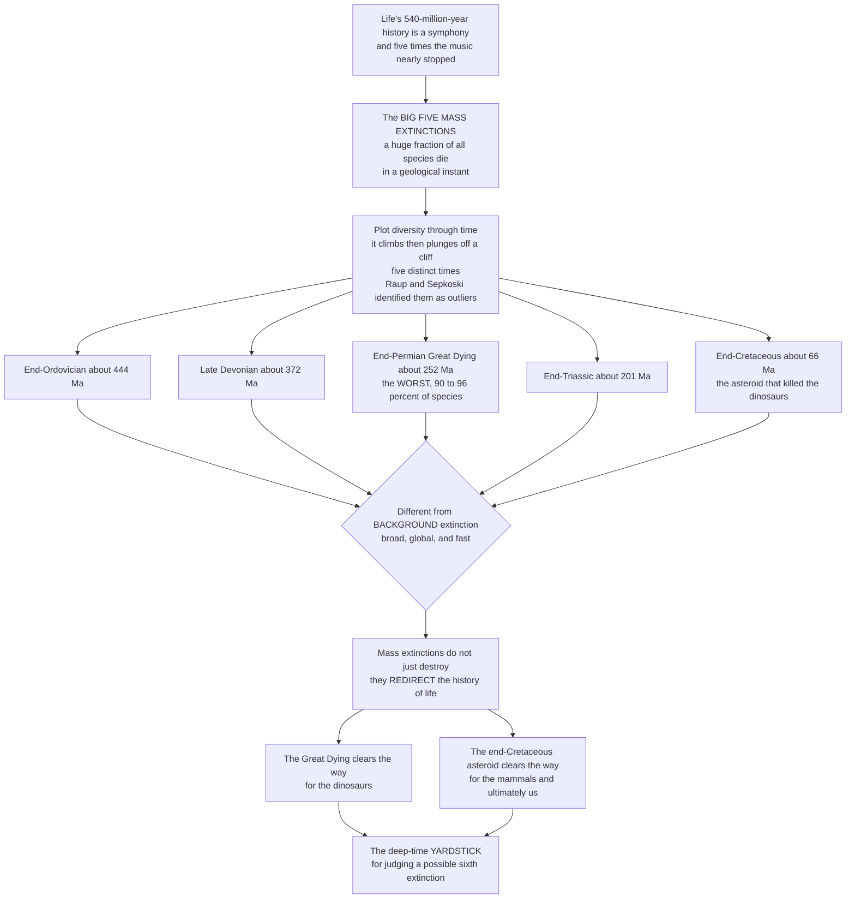

# ☄️ Mass Extinctions and the Big Five

> [!abstract] TL;DR
> A **mass extinction** is a *statistically rare, geologically rapid* collapse of biodiversity in which a **large fraction of all species dies out across many unrelated groups, worldwide, in a geological instant** — not the steady trickle of everyday *background* extinction, but a sudden cliff in the record of life. Plot the diversity of marine animals across the last ~540 million years and the pattern jumps out: life climbs, then plunges catastrophically, **five distinct times**. In 1982 **David Raup and Jack Sepkoski** showed statistically that these five events — the **end-Ordovician** (~444 Ma), **Late Devonian** (~372 Ma), **end-Permian "Great Dying"** (~252 Ma, the *worst*, up to ~90–96 percent of species), **end-Triassic** (~201 Ma), and **end-Cretaceous** (~66 Ma, the *dinosaur-killing asteroid*) — stand out as genuine **outliers** above the background continuum. They matter far beyond their body count: mass extinctions do not merely destroy, they **redirect** evolution, toppling incumbents and handing the world to survivors (the Great Dying cleared the way for the dinosaurs; the end-Cretaceous impact cleared the way for the mammals — and ultimately us). The Big Five are the great **punctuation marks in the history of life**, and the essential **deep-time yardstick** for judging whether humans are now driving a *sixth*.

---

## Intuition

**Analogy — a great symphony where, five times, the music nearly stopped.** Imagine life's 540-million-year Phanerozoic history as a vast symphony, swelling in complexity and richness across the movements. Five times, the music nearly cut off entirely — the orchestra collapsing to a handful of players before, slowly, a new arrangement rebuilt the sound around whoever survived. These are the **Big Five mass extinctions**: rare, catastrophic passages when a *huge fraction of all living species* was erased in what, on the geological clock, is a single instant. You do not need statistics to see them — plot the diversity of life through time and the eye finds them immediately: the line climbs and climbs, then suddenly falls off a cliff, five separate times.

What makes a mass extinction different from the constant, quiet dying that goes on in *every* age (the "background") is not just its **scale** but its **shape**: it is **broad** (hammering many unrelated groups at once — corals *and* fish *and* plants *and* plankton), **global** (no refuge anywhere on Earth), and **fast** (thousands to a few hundred thousand years, an eye-blink in deep time). The paleontologists **David Raup and Jack Sepkoski** made this rigorous in the 1980s, showing that five events sit as clear statistical **outliers** far above the ordinary extinction background. And here is why they are the pivot of the whole story of life: mass extinctions do not merely *subtract* — they **redirect**. Each one toppled the reigning dynasties and handed the empty stage to the survivors. The end-Permian **Great Dying** — which killed up to *96 percent* of all species, so total a catastrophe that complex life nearly ended — cleared the way for the **dinosaurs**. The end-Cretaceous asteroid ended the dinosaurs' 150-million-year reign and cleared the way for the **mammals**, and eventually for us. Erase these catastrophic resets and the living world would be unrecognizable. Understanding the Big Five — *how* we identify them, *what* they killed, and *why* they reshaped evolution — is understanding the great punctuation marks in the story of life, and it hands us the one thing we most need right now: a **deep-time yardstick** for judging whether human activity is opening a *sixth*.

---

## How It Works

### Core Mechanics

1. **Define "mass extinction" precisely.** It is a **statistically significant, geologically rapid** loss of a **large fraction** of Earth's biodiversity that is **broad** (spanning many unrelated higher taxa), **global** in scope, and distinct from **background** extinction in *rate, breadth, and magnitude* all at once. Any single criterion is not enough — a big regional kill or a slow taxon-specific decline is not a mass extinction.
2. **Compile diversity through deep time.** Sepkoski spent years cataloguing the **stratigraphic ranges** (first and last appearances) of marine **families**, then **genera**, building the canonical **Phanerozoic diversity curve**. From ranges you compute, for each geological interval, an **origination rate** (new taxa appearing) and an **extinction rate** (taxa making their last appearance).
3. **Find the outliers statistically.** **Raup & Sepkoski (1982)** plotted per-stage extinction *intensity* across the Phanerozoic and showed the background rate declines gently through time — but **five points spike far above** that continuum. Those five are the **Big Five**: not just "big," but *statistically anomalous* relative to the ordinary variation.
4. **Convert taxon loss into species loss.** The record counts genera and families, but we care about *species*. **Rarefaction** and reverse-rarefaction models translate genus- or family-level loss into an estimated **percent of species** lost — which is why the end-Permian "82 percent of genera" becomes the headline "~90–96 percent of species."
5. **Correct for the biased record.** The fossil record is an imperfect, uneven sample. The **Signor–Lipps effect** — because fossilization is patchy, a species' *last* fossil predates its true extinction — smears an abrupt, catastrophic kill into an apparently gradual decline, making sudden events look slow. Standardized subsampling and awareness of rock availability are required before trusting any "event."
6. **Read the selectivity, then the consequences.** Mass extinctions are **non-random**: they change the *rules* of survival, so traits that protect you in normal times may not help in a catastrophe. What survives seeds the aftermath — extinction is a **creative reset** that triggers recovery **radiations** and reshuffles which groups dominate the next act.

### Flow / Architecture



---

## Key Concepts

### 🟢 Secondary

- **What a mass extinction is.** A rare disaster when a *huge share of all living things* dies out worldwide, very fast in geological terms. It is different from the normal, slow dying that always happens — it is **big, broad, global, and quick** all at once.
- **The Big Five.** Five times in the last 540 million years life nearly collapsed: **end-Ordovician**, **Late Devonian**, **end-Permian** (the *worst* — up to 96 percent of species, the "Great Dying"), **end-Triassic**, and **end-Cretaceous** (the *asteroid* that ended the dinosaurs).
- **How we spot them.** Draw a graph of how many kinds of animals lived through time. The line goes up over millions of years — then drops off a cliff five times. Those cliffs *are* the Big Five.
- **Why they matter.** They do not just kill — they **change who rules the planet**. The Great Dying opened the door for dinosaurs; the asteroid opened the door for mammals, and eventually people. Without these resets, the world would look totally different.
- **The reason we care today.** The Big Five are our **measuring stick**: they tell us how bad the *worst* extinctions were, so we can ask whether humans are now causing a *sixth*.

### 🟡 Undergraduate

- **Mass vs background extinction.** *Background* extinction is the steady, ever-present trickle of species loss. A **mass extinction** exceeds it in **magnitude** (fraction lost), **breadth** (many unrelated clades), **rate** (geologically abrupt), and **global reach** simultaneously — the four-part definition matters because no single feature suffices.
- **The Sepkoski compilations.** Jack Sepkoski's family- and genus-level databases of marine **stratigraphic ranges** produced the **Phanerozoic diversity curve** — the empirical backbone of the whole field, from which extinction and origination rates per interval are computed.
- **Raup & Sepkoski (1982) and the outlier test.** Plotting per-stage extinction intensity showed a declining **background continuum** with **five statistical spikes** rising above it — the objective, quantitative basis for calling these five the "Big Five" rather than picking events by intuition.
- **Measuring magnitude.** The record counts genera/families; **rarefaction** estimates the corresponding **species** loss. Hence end-Permian ≈ *82 percent of genera* ≈ *~90–96 percent of species*; end-Ordovician ≈ *~85 percent of species*; end-Cretaceous ≈ *~76 percent of species*.
- **The Big Five at a glance.**
  1. **End-Ordovician** (~444 Ma, ~85 percent species): the *second-worst*; a pulse of **glaciation** and dramatic **sea-level fall**, then rapid warming — a two-punch climate event.
  2. **Late Devonian** (~372 Ma, protracted, the **Kellwasser** and **Hangenberg** crises): ocean **anoxia**; possibly linked to the spread of **land plants** altering weathering and nutrient runoff.
  3. **End-Permian "Great Dying"** (~252 Ma, ~90–96 percent species): the *worst in Earth history*, driven by the **Siberian Traps** flood basalts — runaway warming, ocean anoxia and acidification.
  4. **End-Triassic** (~201 Ma, ~80 percent species): **CAMP** volcanism during the rifting of **Pangaea**; cleared the way for **dinosaur** dominance in the Jurassic.
  5. **End-Cretaceous / K-Pg** (~66 Ma, ~76 percent species): the **Chicxulub asteroid** impact (plus **Deccan Traps** volcanism) that ended the **non-avian dinosaurs**.
- **Extinction as a creative reset.** Mass extinctions are **selective** (they favor different traits than everyday selection) and **generative**: by toppling incumbents they open **ecospace** that survivors fill in explosive recovery **radiations** — extinction and radiation are two sides of one coin.

### 🔴 Graduate

- **The kill curve and the outlier problem.** Raup's **kill curve** relates extinction magnitude to waiting time (recurrence interval), framing the Big Five as the tail of a continuous magnitude–frequency distribution rather than a categorically separate class — a live debate: are mass extinctions *qualitatively* distinct, or merely the extreme tail of one continuum? Bambach (2006) and Alroy (2008) argue the "Big Five" is partly a *heuristic*, with several other intervals (e.g. Capitanian, end-Guadalupian) rivaling them once sampling is standardized.
- **Sampling standardization.** Raw diversity curves are contaminated by variable rock volume, the **pull of the recent**, monographic effort, and Lagerstätten. **Shareholder-quorum subsampling** (Alroy) and the **Paleobiology Database** yield sampling-corrected rates that reshape the magnitudes and even the ranking of events — the modern quantitative rigor beyond Sepkoski's raw compilations.
- **The Signor–Lipps effect and tempo.** Because last-appearance datums under-sample true ranges, an instantaneous catastrophe is *smeared backward* into an apparent gradual decline. Distinguishing a genuinely **abrupt** kill (e.g. K-Pg impact) from a **protracted** one (Late Devonian) requires dense sampling, confidence intervals on stratigraphic ranges, and back-smearing corrections.
- **Selectivity and changed rules.** Jablonski showed that traits buffering against *background* extinction (e.g. broad **species-level geographic range**, high larval dispersal) **do not** protect against *mass* extinctions, which are **clade-selective at higher levels** (broad *genus* range still helps). Mass extinctions thus impose a **macroevolutionary regime shift** — a nonrandom filter operating by different rules, with lasting consequences for which clades inherit the world.
- **Common causal architecture.** The recurring "kill mechanisms": **large igneous provinces / flood-basalt volcanism** (Siberian Traps, CAMP, Deccan), **bolide impact** (Chicxulub), rapid **climate change** (warming *or* cooling), ocean **anoxia/euxinia and acidification**, **sea-level** and **carbon-cycle** perturbations — usually **multiple, synergistic** stressors rather than a single cause (the *press–pulse* model).
- **Macroevolutionary consequences.** Mass extinctions produce **incumbency replacement** and **contingency**: they do not simply prune the tree but *rewire its future*, enabling radiations that were suppressed while incumbents held ecospace. Gould's "replaying the tape" thought experiment is anchored here — no Great Dying, no Mesozoic archosaur dominance; no K-Pg, no Cenozoic placental radiation. The **deep-time yardstick** they provide (magnitude and rate of the worst natural events) is the calibrated baseline against which the modern biodiversity crisis is assessed as a candidate **sixth mass extinction**.

---

## Python Demo

```python
# THE BIG FIVE MASS EXTINCTIONS, made visible two ways:
#   (A) DIVERSITY CURVE WITH FIVE DROPS -- a Sepkoski-style Phanerozoic
#       marine diversity curve simulated as logistic growth toward a rising
#       carrying capacity, PUNCTUATED by five catastrophic crashes. Life
#       climbs, then plunges off a cliff five distinct times.
#   (B) EXTINCTION-INTENSITY SPIKES -- per-stage extinction intensity across
#       the Phanerozoic. The background rate is a gently declining continuum
#       with noise; the Big Five stand out as spikes far above it
#       (the Raup-Sepkoski 1982 outlier signature). We also print the events
#       RANKED by percent of species lost (end-Permian tallest).
# Pure numpy + matplotlib, fully runnable.

import numpy as np
import matplotlib.pyplot as plt

rng = np.random.default_rng(7)

# The Big Five: (name, age in Ma, genus-loss fraction, species-loss percent)
events = [
    ("End-Ordovician", 444, 0.57, 85),
    ("Late Devonian",  372, 0.50, 75),
    ("End-Permian",    252, 0.82, 96),   # the Great Dying -- the worst
    ("End-Triassic",   201, 0.47, 80),
    ("End-Cretaceous",  66, 0.46, 76),   # Chicxulub asteroid, K-Pg
]

# ----------------------------------------------------------------------
# (A) DIVERSITY CURVE WITH FIVE DROPS  (logistic growth + crashes)
# ----------------------------------------------------------------------
T, dt = 540.0, 0.5                       # forward time from age 540 Ma
steps = int(T / dt)
fwd = np.linspace(0.0, T, steps + 1)     # 0 (=540 Ma) ... 540 (=present)
age = 540.0 - fwd                        # 540 Ma ... 0 Ma (before present)

# rising carrying capacity: overall Phanerozoic diversity increase
Kt = np.interp(fwd,
               [0, 90, 170, 250, 300, 400, 474, 540],
               [400, 720, 820, 980, 820, 1150, 1750, 2500])

# map each crash to the nearest simulation step
crash_at = {int(round((540.0 - a) / dt)): gloss for (_, a, gloss, _) in events}

r = 0.09                                 # diversification / recovery rate
D = np.zeros(steps + 1); D[0] = 300.0
for i in range(1, steps + 1):
    D[i] = D[i-1] + r * D[i-1] * (1 - D[i-1] / Kt[i-1]) * dt   # logistic
    if i in crash_at:
        D[i] *= (1.0 - crash_at[i])                            # mass extinction

# ----------------------------------------------------------------------
# (B) PER-STAGE EXTINCTION INTENSITY  (background continuum + Big Five spikes)
# ----------------------------------------------------------------------
stage_age = np.arange(540, 0, -5)                 # ~stage midpoints, Ma
background = 5.0 + (stage_age / 540.0) * 9.0       # declines toward present
intensity = background + rng.normal(0, 1.3, size=stage_age.size)
intensity = np.clip(intensity, 2.0, None)

big5_idx = []
for (_, a, gloss, _) in events:
    j = int(np.argmin(np.abs(stage_age - a)))      # nearest stage
    intensity[j] = gloss * 100.0                    # spike = percent genera lost
    big5_idx.append(j)
is_big5 = np.zeros(stage_age.size, dtype=bool); is_big5[big5_idx] = True

# ----------------------------------------------------------------------
# PLOT
# ----------------------------------------------------------------------
fig, (axA, axB) = plt.subplots(1, 2, figsize=(14, 5.6))

axA.plot(age, D, color="#0f766e", lw=2.4)
axA.fill_between(age, D, color="#0f766e", alpha=0.10)
for (name, a, _, sp) in events:
    axA.axvline(a, color="#dc2626", ls=":", lw=1.2, alpha=0.8)
    ytxt = np.interp(540.0 - a, fwd, D)
    axA.annotate(f"{name}\n~{sp}% species",
                 xy=(a, ytxt), xytext=(a, ytxt + 520),
                 ha="center", fontsize=7.5, color="#b91c1c",
                 arrowprops=dict(arrowstyle="->", color="#dc2626", lw=1))
axA.set_title("(A) Phanerozoic diversity curve: five cliffs",
              weight="bold", fontsize=11)
axA.set_xlabel("Age (millions of years before present)")
axA.set_ylabel("Marine genus diversity (simulated, Sepkoski-style)")
axA.set_xlim(545, -5)                              # older on the LEFT
axA.grid(alpha=0.25)

colors = np.where(is_big5, "#dc2626", "#94a3b8")
axB.bar(stage_age, intensity, width=4.2, color=colors)
for (name, a, gloss, _) in events:
    axB.annotate(name, xy=(a, gloss * 100.0),
                 xytext=(a, gloss * 100.0 + 4),
                 ha="center", fontsize=7.5, color="#b91c1c", rotation=0)
axB.axhline(np.median(background), color="#334155", ls="--", lw=1,
            label="background continuum")
axB.set_title("(B) Extinction intensity: Big Five as outlier spikes",
              weight="bold", fontsize=11)
axB.set_xlabel("Age (millions of years before present)")
axB.set_ylabel("Extinction intensity (% of genera lost per interval)")
axB.set_xlim(545, -5)
axB.legend(frameon=False, fontsize=9)
axB.grid(alpha=0.25, axis="y")

plt.tight_layout()
plt.savefig("big_five_mass_extinctions.png", dpi=120)

# ----------------------------------------------------------------------
# Ranked magnitude table (console)
# ----------------------------------------------------------------------
print("Big Five ranked by species loss:")
for (name, a, gloss, sp) in sorted(events, key=lambda e: -e[3]):
    bar = "#" * (sp // 4)
    print(f"  {name:<16} {a:>4} Ma  ~{sp:>2}% species  {bar}")
print("\nEnd-Permian 'Great Dying' is the worst: up to ~90-96% of all species.")
```

Panel A is the canonical picture of the Big Five: marine diversity, generated as **logistic growth toward a rising carrying capacity**, climbs across the Phanerozoic and then **plunges off a cliff five times**, each crash annotated with its approximate species loss — the end-Permian notch is by far the deepest. Panel B recreates the **Raup–Sepkoski outlier signature**: per-stage extinction intensity is mostly a *gently declining background continuum* with noise (grey bars), out of which the **Big Five rise as red spikes far above the baseline** — the objective, statistical reason these five events, and not others, earn the name. The console output ranks them by species loss, with the **end-Permian "Great Dying" tallest**.

---

## Real-World Applications

- **Calibrating the modern biodiversity crisis.** The Big Five supply the *only* empirical baseline for what a genuine mass extinction looks like in magnitude and rate. Comparing today's elevated extinction rates against that deep-time yardstick is exactly how researchers assess whether we have entered — or are approaching — a **sixth mass extinction**.
- **Reconstructing kill mechanisms from proxies.** Identifying causes of the Big Five drives entire research programs: **iridium anomalies** and shocked quartz fingerprinting the Chicxulub impact; carbon-isotope excursions, uranium isotopes, and mercury spikes tracing **volcanic** carbon release, ocean **anoxia**, and **acidification** at the end-Permian and end-Triassic. These same proxies are now used to read past climate–carbon crises as analogues for anthropogenic change.
- **Testing extinction selectivity for conservation.** Jablonski's finding that *mass* extinctions change the survival rules — nullifying traits that protect species during background times — warns that today's vulnerable groups may not map onto historical survivors, sharpening how conservation biologists prioritize under rapid global change.
- **The Paleobiology Database.** The Big Five are the headline test cases for **sampling-standardized** diversity estimation (shareholder-quorum subsampling), turning "how big was each event, really?" into a reproducible, quantitative question — and occasionally re-ranking the events once bias is removed.
- **Astrobiology and planetary resilience.** The Great Dying — complex life nearly ending, then fully recovering over millions of years — is a natural experiment in **biosphere resilience and recovery time**, informing how scientists reason about the fragility and rebound capacity of life on Earth and, by extension, on other worlds.

---

## Common Pitfalls

- **Equating "mass extinction" with scale alone.** Magnitude is necessary but not sufficient. A mass extinction must *also* be **broad** (many unrelated clades), **global**, and **geologically rapid**. A large but taxonomically narrow or regionally confined loss does not qualify — the four criteria must hold together.
- **Trusting raw diversity curves.** Rock availability, monographic effort, Lagerstätten, and the **pull of the recent** manufacture spurious peaks and troughs. Any claim about an event's magnitude or timing must survive **sampling standardization** first — Sepkoski's raw curves were a starting point, not the final word.
- **Reading gradual declines literally (Signor–Lipps).** Because a species' *last* fossil predates its true extinction, a sudden catastrophe is smeared into an apparent slow decline. Concluding "the Big Five were all gradual" from uncorrected last-appearance data is a classic error; abrupt versus protracted tempo must be tested with dense sampling and range confidence intervals.
- **Assuming one cause per event.** The Big Five were typically **multi-stressor, synergistic** catastrophes (the *press–pulse* model) — volcanism *and* warming *and* anoxia *and* acidification. Hunting for a single "smoking gun" oversimplifies and fuels false either/or debates (e.g. impact *versus* Deccan volcanism at the K-Pg, when both plausibly contributed).
- **Believing survival is random.** Mass extinctions are strongly **selective** — but by *different rules* than background extinction. Assuming the fittest-in-normal-times survive is wrong; broad species-level geographic range, a strong background buffer, offers little protection in the catastrophe itself.
- **Treating "the Big Five" as sacrosanct.** It is partly a **heuristic**. Once sampling is standardized, several other intervals (Capitanian, end-Guadalupian) rival some of the five, and the events may be the extreme *tail* of a continuum rather than a categorically separate class — a genuine open question, not settled dogma.

---

## Related Concepts

This note is the **opener of Section 04 (Mass Extinctions and Recovery)** and frames the siblings that deep-dive its threads, referenced here in prose so they wire once written: the vault hub *Paleontology and Deep Time Overview*; *The End-Permian Extinction: the Great Dying* (the Siberian Traps and the worst catastrophe in Earth history); *The End-Cretaceous Extinction and the Asteroid* (Chicxulub, the Deccan Traps, and the end of the non-avian dinosaurs); *Causes of Mass Extinctions* (large igneous provinces, impacts, anoxia, acidification, and synergistic kill mechanisms); *Recovery and Radiation After Extinction* (survivors, empty ecospace, and the explosive rebounds that follow); *The Sixth Extinction in Deep-Time Perspective* (the modern crisis against the Big Five yardstick); and *Extinction as an Evolutionary Force* (background versus mass, selectivity, and extinction as a creative reset).

Verified cross-vault and cross-section links to existing notes:

- [[Mass_Extinctions_and_Paleoclimate]] — the Earth-Science companion reading the Big Five through the lens of paleoclimate, ice ages, and greenhouse–icehouse transitions; this note is the *paleontological* view of the same events.
- [[Extinction_and_the_Sixth_Mass_Extinction]] — the Ecology-vault treatment of the *present-day* biodiversity crisis; this note supplies the deep-time baseline it is measured against.
- [[The_History_of_Life_on_Earth]] — the concrete narrative of life's rise and turnover; the Big Five are its five great punctuation marks.
- [[The_Fossil_Record_and_Its_Biases]] — the vault's account of the incomplete, uneven record (Signor–Lipps, sampling bias) that makes *measuring* mass extinctions so hard.
- [[Macroevolution_and_Deep_Time_Patterns]] — the Section-03 opener; mass extinctions are the catastrophic resets that drive macroevolutionary regime shifts and species-level selectivity.
- [[Adaptive_Radiations_and_Diversification]] — the flip side of extinction; survivors radiate into ecospace emptied by the Big Five (mammals after the K-Pg).
- [[Mesozoic_Life_the_Age_of_Dinosaurs]] — the world the Great Dying and end-Triassic events *created*, and that the end-Cretaceous impact *ended*.
- [[Cenozoic_Life_and_the_Age_of_Mammals]] — the recovery world the end-Cretaceous extinction handed to the mammals, and ultimately to us.
- [[Speciation_and_Macroevolution]] — the origination side of the diversity balance whose long-term interplay with extinction shapes the Phanerozoic curve.

---

## Review Questions

1. **(Secondary)** Using the symphony analogy, explain what a mass extinction is and how it differs from the ordinary, everyday dying-out of species. Which of the Big Five was the worst, and roughly what fraction of species did it kill?
2. **(Undergraduate)** Raup and Sepkoski identified the "Big Five" as *statistical outliers*. Describe how you would go from a compilation of fossil stratigraphic ranges to a plot that reveals these five events, and explain why an event must be broad, global, *and* rapid — not merely large — to count as a mass extinction.
3. **(Graduate)** A colleague claims a newly studied interval is "a sixth member of the Big Five." Explain (a) how the **Signor–Lipps effect** and uneven sampling could make its tempo and magnitude misleading, (b) what **sampling standardization** you would apply before trusting the magnitude, and (c) why the very concept of a discrete "Big Five" may be a heuristic rather than a natural category. What would convince you the event is genuinely comparable to the end-Permian or K-Pg?

---

## Sources

- Raup, D. M. & Sepkoski, J. J. (1982). "Mass Extinctions in the Marine Fossil Record." *Science*, 215(4539), 1501–1503.
- Sepkoski, J. J. (1993). "Ten Years in the Library: New Data Confirm Paleontological Patterns." *Paleobiology*, 19(1), 43–51.
- Bambach, R. K. (2006). "Phanerozoic Biodiversity Mass Extinctions." *Annual Review of Earth and Planetary Sciences*, 34, 127–155.
- Alroy, J. (2008). "Dynamics of Origination and Extinction in the Marine Fossil Record." *Proceedings of the National Academy of Sciences*, 105(Suppl. 1), 11536–11542.
- Barnosky, A. D. et al. (2011). "Has the Earth's Sixth Mass Extinction Already Arrived?" *Nature*, 471, 51–57.

---

#paleontology #mass-extinction #big-five #great-dying #diversity
