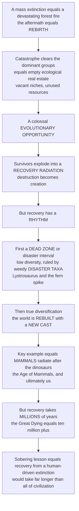

# 🌱 Recovery and Radiation After Extinction

> [!abstract] TL;DR
> A mass extinction is only half the story — the other half is what happens **after**. By wiping out the dominant, well-established groups, a catastrophe leaves behind a world of empty ecological "real estate": vacant niches and unused resources with no one to exploit them. That is a colossal **evolutionary opportunity**, and the survivors seize it, exploding into a burst of new diversity — a **recovery radiation** in which destruction becomes the precondition for creation. But recovery has a distinct rhythm. First comes a grim "**dead zone**" or disaster interval — a low-diversity world dominated by hardy, weedy **disaster taxa** (the pig-like *Lystrosaurus* after the Great Dying, the "**fern spike**" after the dinosaur-killing asteroid). Then true diversification kicks in and the biosphere is **rebuilt with a new cast**, often utterly unlike what came before — most consequentially the little mammals that radiated to fill the world the dinosaurs left empty, giving us the **Age of Mammals** and ultimately ourselves. Crucially, recovery takes **millions of years** — after the worst extinctions, ten million or more — a deep-time fact that carries a sobering lesson: even if life eventually rebounds from a human-driven extinction, it will do so on a timescale vastly longer than human civilization.

---

## Intuition

**Analogy:** A mass extinction is like a **devastating forest fire** — but what happens *after* the fire is just as important as the fire itself, and it is a story of **rebirth**. The blaze clears away the towering old-growth trees that had monopolized the sunlight, water, and soil for centuries. What it leaves behind is not just ash but **opportunity**: bare ground, open sky, and nutrients with no established giants to hoard them. Into that opening rush the **opportunists** — weedy fireweed and fast ferns that boom in the disturbed, sunlit clearing, thriving precisely because everything else is gone. For a while the burned landscape is a grim, low-diversity place ruled by these few hardy weeds. But gradually the real rebuilding begins: seedlings establish, new species move in, and eventually a rich, complex forest returns — often with a **different cast of dominant trees** than the one that burned.

Life does exactly this after a mass extinction. The removal of the incumbents opens vacant **ecospace**, the weedy **disaster taxa** bloom in the empty world, and then the survivors **radiate** to refill and reinvent the biosphere. Destruction, repeatedly, becomes creation.

---

## How It Works

### Core Mechanics

Recovery is the flip side of extinction: the same event that **removes the incumbents** also **opens the ecospace** they occupied, and evolution rushes to fill it. The process unfolds in a characteristic sequence:

1. **The crash.** At the extinction boundary, diversity collapses — the dominant, specialized, well-established groups are hit hardest. What is left is a depauperate set of **survivors**: often small-bodied, broadly tolerant, geographically widespread generalists.
2. **The survival / "dead zone" / disaster interval.** Immediately after the boundary the world is a **low-diversity, ecologically simplified** place. It is dominated by **disaster taxa** — opportunistic, cosmopolitan, stress-tolerant "**weed**" species that bloom in the empty, disturbed world: the pig-like therapsid *Lystrosaurus* and the bivalve *Claraia* after the end-Permian, and the "**fern spike**" (a pollen/spore record dominated by ferns) after the end-Cretaceous. This interval is a plateau of suppressed diversity — a lag before true rebuilding.
3. **The recovery radiation.** Then diversification accelerates. Surviving lineages undergo **ecological release** and radiate into the vacated **adaptive zones**, rebuilding food webs, tiering, and reef and forest structure. Diversity rebounds along a **delayed sigmoid** trajectory, sometimes recovering to prior levels and sometimes **overshooting** them.
4. **The new cast.** Recovery rarely restores the *old* world. Formerly marginal groups, released from suppression by the fallen incumbents, become the **new dominants** — the biosphere is restructured, not merely refilled.

Two subtleties matter. First, recovery is **uneven** across groups and environments — some clades and habitats rebound fast, others lag for millions of years (the post-Permian "**coal gap**" and "**reef gap**"). Second, recovery is **slow**: typically several million years, and after the most severe events — the end-Permian **Great Dying** — a **delayed recovery** of roughly 5 to 10 million years or more. The controls on recovery rate are extinction **severity**, the **persistence** of environmental stress, the **supply of survivors and ecospace**, and the appearance of evolutionary **innovation**.

Some apparent survivors are illusions of the record: **Lazarus taxa** vanish across the interval and reappear later (they were there but too rare to preserve), while **Elvis taxa** are impostors — later look-alikes that convergently mimic an extinct form.

### Flow / Architecture



---

## Key Concepts

### Secondary (the big idea)
- **Extinction clears the stage.** When a catastrophe kills off the dominant groups, it leaves an empty world full of vacant niches — unused food and habitats with no one to use them.
- **Empty world equals opportunity.** That emptiness is a huge chance for the survivors, who spread out and multiply into a burst of new species — a **recovery radiation**. Destruction becomes creation.
- **First the weeds.** Right after the disaster, the world is a grim, low-diversity place ruled by a few tough "**disaster taxa**" — weedy survivors like *Lystrosaurus* after the Great Dying, or the ferns that boomed after the dinosaur-killing asteroid (the "**fern spike**").
- **Then a new world.** Slowly, diversity rebuilds — often with a completely different cast. The best example: little **mammals** radiated to fill the world the **dinosaurs** left empty, giving us the **Age of Mammals** and, eventually, us.
- **It takes forever.** Recovery is not quick. It takes **millions of years** — after the worst extinction, ten million or more.

### Undergraduate (the mechanisms)
- **Ecospace and ecological release.** Extinction empties **ecospace** (the set of ecological roles a fauna occupies); survivors freed from competition and predation undergo **ecological release** and radiate into the vacated **adaptive zones**.
- **The three phases.** (1) The **crash** at the boundary; (2) the **survival / disaster interval** — a low-diversity "dead zone" dominated by opportunistic, cosmopolitan, stress-tolerant **disaster taxa**; (3) the **recovery / radiation** phase — rediversification, incumbent replacement, and the rise of **new dominant groups**.
- **Disaster, Lazarus, and Elvis taxa.** **Disaster taxa** are weedy opportunists that bloom in the empty world (*Lystrosaurus*, *Claraia*, post-K-Pg ferns). **Lazarus taxa** disappear then reappear (a preservation gap, not true extinction). **Elvis taxa** are convergent impostors that merely resemble a lost form.
- **Recovery time and its controls.** Recovery takes **several million years** and, after the most severe events, far longer — the end-Permian shows a **delayed recovery** of about 5 to 10+ Myr, with "**coal gaps**" and "**reef gaps**." Rate depends on extinction **severity**, **stress persistence**, **survivor/ecospace availability**, and evolutionary **innovation**.
- **Uneven recovery.** Recovery is not uniform: it differs across clades (some rebound fast, others lag) and environments (offshore vs onshore, reef vs level-bottom).
- **Recover, or overshoot?** Diversity may return to prior levels, **overshoot** them (net diversification gains), or, for some groups, never fully recover — the extinction permanently reshapes who dominates.

### Graduate (the debates and subtleties)
- **Ecological vs taxonomic recovery.** Counting **species/genera** rebounding is not the same as rebuilding ecosystem **structure and function** — tiering, food-web complexity, reef framework, guild occupancy. Ecological recovery (functional reassembly) often lags taxonomic recovery, and the two can decouple (Sahney and Benton show the end-Permian *tetrapod ecosystem* recovering more slowly and unevenly than raw diversity counts imply).
- **Contingency and the "different rules."** Mass extinctions are macroevolutionary **turning points** that reset the game: traits favored during **background** times may be irrelevant to surviving a mass extinction ("**different rules**," Jablonski), so extinctions **redirect** evolution — toppling long-dominant clades and promoting formerly marginal ones with strong **contingency**.
- **Incumbency and suppression.** Recovery radiations often reveal **incumbency effects**: dominant groups can suppress the diversification of others for tens of millions of years, and only their removal releases the latent radiation (mammals in the "shadow" of the dinosaurs across the whole Mesozoic before the K-Pg release).
- **The macroevolutionary shifting balance.** Post-extinction recoveries repeatedly **restructure the shifting balance of diversity** among major groups (Alroy) — the relative dominance of clades is rewritten at each event, not just perturbed and restored.
- **Reading recovery through the record's filters.** Disaster-taxon "**blooms**," Lazarus gaps, monotypic assemblages, and time-averaging all bias the signal; disentangling genuine ecological simplification from sampling and preservation artifacts is a central methodological problem (link to the fossil record's biases).
- **What limits recovery rate?** Competing hypotheses: prolonged **environmental stress** (e.g. lingering end-Permian ocean anoxia and warmth) keeping the world in a disaster state; **depleted survivor pools** and low ecospace; or the **time required to evolve innovations** that unlock new adaptive zones. These are not mutually exclusive and likely interact.

---

## Python Demo

```python
# Recovery & radiation after a mass extinction, with numpy + matplotlib:
#   (A) RECOVERY TRAJECTORY -- diversity crashes at the boundary, lingers in a
#       low-diversity DISASTER INTERVAL (a lag/plateau), then rebounds along a
#       DELAYED LOGISTIC recovery radiation toward (or beyond) pre-crash levels.
#   (B) RECOVERY TIME vs SEVERITY -- worse extinctions have longer lags and
#       slower rebounds (end-Permian ~5-10 Myr "delayed recovery" vs milder events).
#   (C) DISASTER-TAXON BLOOM then DECLINE -- weedy opportunists spike early in
#       the empty world, then give way to a slowly diversifying "new fauna."
#   (D) SURVIVOR RADIATION / ECOSPACE FILLING -- a few small survivors radiate
#       into vacated niches; the body-size envelope explodes (mammals after K-Pg).
import numpy as np
import matplotlib.pyplot as plt

rng = np.random.default_rng(2026)
baseline   = 100.0    # pre-extinction standing diversity (genera, arbitrary)
survivors  = 12.0     # diversity that survives the crash

def recovery(t, lag, r, K, t_b=0.0):
    """Piecewise diversity through a mass extinction and its recovery.
    Pre-boundary baseline -> instant crash to `survivors` -> flat DISASTER
    INTERVAL of length `lag` -> delayed LOGISTIC rebound to ceiling K."""
    d = np.empty_like(t)
    pre = t < t_b
    d[pre] = baseline
    tp = np.maximum(t - t_b, 0.0)          # time since the boundary
    tt = np.maximum(tp - lag, 0.0)         # time since rebound begins
    logistic = K / (1.0 + (K / survivors - 1.0) * np.exp(-r * tt))
    d[~pre] = logistic[~pre]
    return d

def recovery_time(t, d, target_frac=0.9, t_b=0.0):
    """Myr after the boundary to reach target_frac of baseline diversity."""
    post = t >= t_b
    hit = np.where(d[post] >= target_frac * baseline)[0]
    return (t[post][hit[0]] - t_b) if hit.size else np.nan

# ---------------------------------------------------------------------------
t = np.linspace(-10, 40, 700)             # Myr; boundary at t = 0

# (A) one representative trajectory (a severe event)
dA = recovery(t, lag=5.0, r=0.28, K=105.0)
dA_noisy = dA + rng.normal(0, 1.5, t.size) * (t < 0)   # sampling scatter pre-crash

# (B) three severities: mild / moderate / severe(Great Dying-like)
sev = {
    "mild (lag 1 Myr)":              dict(lag=1.0, r=0.45, K=112.0, c="seagreen"),
    "moderate (lag 3 Myr)":          dict(lag=3.0, r=0.30, K=100.0, c="goldenrod"),
    "severe / Great Dying (lag 8)":  dict(lag=8.0, r=0.16, K=95.0,  c="firebrick"),
}

# (C) disaster-taxon bloom vs diversifying new fauna
tp = np.linspace(0, 40, 500)
disaster = 55.0 * (tp / 2.5) * np.exp(-tp / 2.5)          # spike then decline
newfauna = 95.0 / (1.0 + (95.0 / 4.0 - 1.0) * np.exp(-0.16 * tp))  # slow logistic

# (D) survivor radiation: body-size envelope (log10 kg) filling ecospace
tt = np.linspace(-10, 40, 500)
release = 1.0 / (1.0 + np.exp(-0.22 * (tt - 8.0)))       # ecological release after lag
max_size = np.where(tt < 0, 0.0, 3.6 * release)          # top predators/megaherbivores
min_size = np.full_like(tt, -1.6)                         # small survivors persist

# ---------------------------------------------------------------------------
fig, ax = plt.subplots(2, 2, figsize=(13.5, 9.5))

# A: the classic recovery trajectory
axA = ax[0, 0]
axA.plot(t, dA_noisy, color="steelblue", lw=1.2, alpha=0.5)
axA.plot(t, dA, color="crimson", lw=2.6, label="diversity")
axA.axvline(0, color="k", ls="--", lw=1.4)
axA.axhline(baseline, color="gray", ls=":", lw=1.4, label="pre-crash baseline")
axA.axvspan(0, 5, color="dimgray", alpha=0.18, label="disaster interval (dead zone)")
axA.annotate("crash", xy=(0, survivors), xytext=(-8, 35),
             fontsize=8, arrowprops=dict(arrowstyle="->", color="k"))
axA.annotate("recovery RADIATION", xy=(18, dA[np.argmin(np.abs(t - 18))]),
             xytext=(20, 45), fontsize=8,
             arrowprops=dict(arrowstyle="->", color="crimson"))
axA.set_title("A. Crash -> disaster interval -> delayed recovery radiation")
axA.set_xlabel("time relative to extinction boundary (Myr)")
axA.set_ylabel("standing diversity (genera)")
axA.legend(fontsize=8, loc="lower right")

# B: recovery time scales with severity
axB = ax[0, 1]
for label, p in sev.items():
    d = recovery(t, lag=p["lag"], r=p["r"], K=p["K"])
    rt = recovery_time(t, d)
    axB.plot(t, d, color=p["c"], lw=2.3, label=f"{label}:  ~{rt:.0f} Myr to 90%")
    if np.isfinite(rt):
        axB.scatter([rt], [0.9 * baseline], color=p["c"], zorder=5, s=30)
axB.axvline(0, color="k", ls="--", lw=1.2)
axB.axhline(0.9 * baseline, color="gray", ls=":", lw=1.0)
axB.set_title("B. Worse extinctions recover far more slowly")
axB.set_xlabel("time relative to boundary (Myr)")
axB.set_ylabel("standing diversity (genera)")
axB.legend(fontsize=8, loc="lower right")

# C: disaster-taxon bloom then decline vs the new diversified fauna
axC = ax[1, 0]
axC.fill_between(tp, disaster, color="darkorange", alpha=0.35)
axC.plot(tp, disaster, color="darkorange", lw=2.3, label="disaster taxa (weedy opportunists)")
axC.plot(tp, newfauna, color="darkgreen", lw=2.3, label="diversified new fauna")
axC.set_title("C. Disaster taxa bloom early, then give way to a new fauna")
axC.set_xlabel("time after boundary (Myr)")
axC.set_ylabel("relative abundance / diversity")
axC.legend(fontsize=8, loc="center right")

# D: survivor radiation fills ecospace -- body-size envelope explodes
axD = ax[1, 1]
axD.fill_between(tt, min_size, max_size, where=(tt >= 0),
                 color="mediumpurple", alpha=0.35, label="occupied ecospace")
axD.plot(tt, max_size, color="indigo", lw=2.3, label="largest body size")
axD.plot(tt, min_size, color="slateblue", lw=1.6, ls="--", label="smallest survivors")
axD.axvline(0, color="k", ls="--", lw=1.2)
axD.annotate("ecological release:\nmammals radiate into\nvacated large-body niches",
             xy=(22, 3.0), xytext=(4, 2.0), fontsize=8,
             arrowprops=dict(arrowstyle="->", color="indigo"))
axD.set_title("D. Survivors radiate to fill vacated ecospace (K-Pg mammals)")
axD.set_xlabel("time relative to boundary (Myr)")
axD.set_ylabel("body size  (log10 kg)")
axD.legend(fontsize=8, loc="upper left")

plt.tight_layout()
plt.savefig("recovery_and_radiation.png", dpi=120)

# Quantitative takeaways
for label, p in sev.items():
    d = recovery(t, lag=p["lag"], r=p["r"], K=p["K"])
    print(f"{label:32s} -> ~{recovery_time(t, d):.0f} Myr to regain 90% of baseline")
peak = tp[np.argmax(disaster)]
print(f"Disaster-taxon bloom peaks ~{peak:.1f} Myr after the boundary, then declines")
print(f"Body-size ceiling rises from ~1 kg pre-crash to "
      f"~{10**max_size[-1]:.0f} kg after the radiation")
```

Running it makes the rhythm quantitative. **Panel A** shows the signature shape: a sharp **crash** at the boundary, a flat **disaster interval** ("dead zone") where diversity lingers near the survivor level, and then a **delayed logistic** rebound — the recovery radiation — climbing back toward the pre-crash baseline. **Panel B** shows the key deep-time lesson: the more severe the extinction, the **longer the lag and the slower the rebound**, so a Great-Dying-scale event needs many millions of years to regain 90% of its diversity while a mild event bounces back quickly. **Panel C** contrasts the early **disaster-taxon bloom** (a spike that peaks soon after the boundary and then declines) with the slow rise of a **diversified new fauna** that eventually replaces it. **Panel D** shows **survivor radiation as ecospace filling**: small survivors persist, but once **ecological release** kicks in the **body-size envelope explodes** as lineages radiate into vacated large-bodied niches — the mammals-after-the-dinosaurs pattern in one curve.

---

## Real-World Applications

- **The Cenozoic mammal radiation.** The canonical case: after the end-Cretaceous asteroid removed the non-avian dinosaurs, the surviving small mammals underwent explosive **ecological release**, radiating in body size and niche within a few million years to produce the **Age of Mammals** — grazers, carnivores, whales, bats, primates, and ultimately humans. Recovery here is literally *why we are here*.
- **The end-Permian delayed recovery.** The **Great Dying** recovery is the textbook example of a **prolonged, uneven rebound**: disaster taxa (*Lystrosaurus*, *Claraia*) dominate a simplified world, "**coal gaps**" and "**reef gaps**" persist for millions of years, and full ecological recovery of marine and tetrapod ecosystems takes roughly 5 to 10+ Myr — reshaping the Mesozoic and setting the stage for the archosaur and dinosaur rise.
- **Reef and forest reassembly.** Recovery research tracks the rebuilding of **complex ecosystem structure** — reef framework builders, forest canopy tiering, food-web complexity — showing that functional reassembly lags simple diversity counts and that ecosystems are rebuilt, not simply repopulated.
- **Calibrating the modern biodiversity crisis.** The multi-million-year recovery timescale is the **deep-time yardstick** applied to the ongoing sixth extinction: even under optimistic assumptions, evolutionary recovery of lost diversity would take far longer than the entire span of human civilization — quantifying just how irreversible present losses are on any human timescale.
- **Testing macroevolutionary theory.** Post-extinction recoveries are natural experiments for **diversity-dependence**, **incumbency/ecological release**, and the "**different rules**" of mass extinction — data used to fit diversification models and to reconstruct how the **shifting balance of diversity** among major groups was repeatedly rewritten.

---

## Common Pitfalls

- **Treating extinction as the whole story.** Extinction and recovery are two halves of one process; ignoring recovery misses the **creative** consequence — that clearing the incumbents opens the opportunity that produces the next dominant fauna. Destruction is the *precondition* for the radiation.
- **Confusing a disaster-taxon bloom with a healthy recovery.** A spike in the abundance of one or two weedy opportunists (*Lystrosaurus*, the fern spike) is a symptom of an **impoverished, disturbed** world, not of recovery. Genuine recovery is rediversification and ecological rebuilding, which come **later**.
- **Equating taxonomic recovery with ecological recovery.** Diversity counts can rebound while **ecosystem structure and function** (tiering, food webs, reefs) remain simplified. The reassembly of complex ecosystems lags raw genus counts — measure function, not just richness.
- **Assuming recovery restores the old world.** Recoveries usually install a **new cast** of dominants (mammals, not dinosaurs; modern-type marine faunas, not Paleozoic ones). Extinction **redirects** evolution under "different rules"; it does not rewind it.
- **Underestimating the timescale — and its modern meaning.** Recovery takes **millions of years**, up to ten million or more after the worst events. Mistaking that for something fast fuels the dangerous complacency that "life will bounce back" from human-caused extinction — it will, but on a timescale unimaginably longer than civilization.
- **Mistaking Lazarus and Elvis taxa for real signals.** A taxon reappearing after a gap (**Lazarus**) may never have truly left, and a look-alike (**Elvis**) may be an unrelated convergent impostor. Both distort recovery curves if read naively from raw first/last appearances.

---

## Related Concepts

- [[The_History_of_Life_on_Earth]] — recovery radiations are the hinge points of that history; each mass extinction is followed by a rebuild that redirects the whole subsequent narrative (the post-K-Pg mammal chapter above all).
- [[Speciation_and_Macroevolution]] — a recovery radiation is speciation plus ecological divergence writ large across an emptied world; recovery is where macroevolutionary rates spike and new higher taxa are founded.
- [[Ecological_Succession_and_Disturbance]] — the deep-time analogue of ecological succession after disturbance: disaster taxa are the "pioneer weeds," and the recovery radiation is the long secondary succession back to a complex community.
- [[Ecological_Stability_Resilience_and_Tipping_Points]] — recovery is resilience on a geological timescale; the disaster interval and delayed rebound illustrate how far and how long a biosphere can be pushed past a tipping point before it reorganizes.
- [[Extinction_and_the_Sixth_Mass_Extinction]] — the modern lesson: recovery's multi-million-year clock is the sobering context for the current human-driven extinction, showing why present losses are effectively permanent on human timescales.
- [[Mass_Extinctions_and_Paleoclimate]] — persistent environmental stress (anoxia, warming) is a key control on recovery *rate*; the same climatic drivers that cause extinctions also lengthen the delayed recovery that follows.
- [[Restoration_Ecology]] — the applied, human-timescale counterpart to deep-time recovery: what we try to accelerate by hand over decades, nature accomplishes over millions of years by radiation.

Within this vault (siblings): this note is the aftermath half of the story told across **Mass_Extinctions_and_the_Big_Five**; it completes the two great case studies in **The_End_Permian_Extinction_the_Great_Dying** (the ~5 to 10+ Myr delayed recovery) and **The_End_Cretaceous_Extinction_and_the_Asteroid** (the mammal radiation). It is the post-catastrophe application of **Adaptive_Radiations_and_Diversification** and the creative flip side of **Extinction_as_an_Evolutionary_Force**, and it feeds directly into **Cenozoic_Life_and_the_Age_of_Mammals** — the recovery radiation that produced our own world.

---

## Review Questions

1. **(Secondary)** After a mass extinction, why does the world first fill up with a few weedy "disaster taxa" (like ferns after the asteroid) before a rich, diverse ecosystem returns?
2. **(Secondary/Undergraduate)** Explain why the extinction of the dinosaurs was, for mammals, an evolutionary *opportunity*. What does "the world was rebuilt with a new cast" mean here?
3. **(Undergraduate)** Describe the three phases of biotic recovery (crash, disaster interval, recovery radiation) and name one real disaster taxon and one real recovery radiation.
4. **(Undergraduate)** The end-Permian recovery took roughly 5 to 10 million years — much longer than milder events. List the factors that control how long a recovery takes, and explain how at least two of them lengthened the post-Permian recovery.
5. **(Graduate)** Distinguish **taxonomic** recovery from **ecological** recovery. Why can genus counts rebound while ecosystem structure remains simplified, and how would you measure the difference in the fossil record?
6. **(Graduate)** Recovery's multi-million-year timescale is invoked as a warning about the current biodiversity crisis. Lay out that argument rigorously: what exactly does deep-time recovery tell us — and *not* tell us — about the reversibility of a human-driven sixth extinction?

---

## Sources

- Erwin, D. H. (2001). "Lessons from the past: Biotic recoveries from mass extinctions." *PNAS*, 98(10), 5399–5403. [DOI](https://doi.org/10.1073/pnas.091092698)
- Hull, P. (2015). "Life in the Aftermath of Mass Extinctions." *Current Biology*, 25(19), R941–R952. [DOI](https://doi.org/10.1016/j.cub.2015.08.053)
- Sahney, S. & Benton, M. J. (2008). "Recovery from the most profound mass extinction of all time." *Proceedings of the Royal Society B*, 275(1636), 759–765. [DOI](https://doi.org/10.1098/rspb.2007.1370)
- Alroy, J. (2010). "The Shifting Balance of Diversity Among Major Marine Animal Groups." *Science*, 329(5996), 1191–1194. [DOI](https://doi.org/10.1126/science.1189910)
- Jablonski, D. (2001). "Lessons from the past: Evolutionary impacts of mass extinctions." *PNAS*, 98(10), 5393–5398. [DOI](https://doi.org/10.1073/pnas.101092598)

---

#paleontology #recovery-radiation #disaster-taxa #ecospace #mammal-radiation
