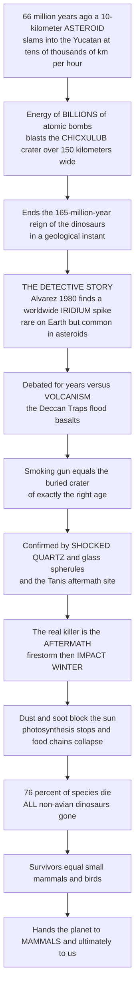

# ☄️ The End-Cretaceous Extinction and the Asteroid

> [!abstract] TL;DR
> Roughly **66 million years ago**, a mountain-sized **asteroid** about **10 kilometers** across slammed into what is now Mexico's Yucatán Peninsula, releasing the energy of **billions of atomic bombs** and blasting out the **Chicxulub crater** — over 150 km wide. This is the **Cretaceous-Paleogene (K-Pg)** mass extinction, which ended the **165-million-year reign of the dinosaurs** and wiped out about **76% of all species**. Its story is one of science's greatest detective triumphs: in 1980 physicist **Luis Alvarez** and geologist son **Walter Alvarez** found that the thin worldwide clay layer marking the boundary was weirdly rich in **iridium** — a metal rare on Earth's surface but common in asteroids — and proposed a **bolide impact**. Vindicated by the buried crater of exactly the right age, plus **shocked quartz** and glass **spherules**, the hypothesis revealed that the killing was done not mainly by the blast but by the global **impact winter** that followed: dust and soot blotted out the sun, **shut down photosynthesis**, and collapsed food chains on land and sea. The survivors — small **mammals** and the **birds** (living dinosaurs) — inherited the planet, making this cosmic catastrophe, in a very real sense, the reason **we** are here.

---

## Intuition

**Analogy — the most famous bad day in the history of the planet, and a 66-million-year-old murder mystery.** Imagine you are a detective who walks into a crime scene that is *everywhere on Earth* at once: a thin layer of dark clay, no thicker than your finger, that shows up in rocks in Italy, Denmark, New Zealand, and the bottom of the deep ocean — always at the exact moment the dinosaurs vanish from the fossil record. That single, worldwide "bloodstain" is your clue. When you run it through the lab, it screams one thing: it is loaded with **iridium**, a metal so rare in Earth's crust that finding this much of it is like finding a swimming pool's worth of gold dust sprinkled evenly over a whole continent. Iridium *is* common in one place, though — **asteroids**. That is the tell. Something from space delivered it.

That is precisely the leap the **Alvarez** team made in 1980, and the rest of the case reads like a thriller: a suspect (a **10-kilometer asteroid**), a debate with a rival theory (giant **volcanic eruptions**), and finally a *smoking gun* — a buried, 150-km-wide **crater (Chicxulub)** off Mexico dated to exactly the right instant, ringed by **shocked quartz** and glass droplets that only a colossal impact can make, and even a fossil site (**Tanis**) that seems to preserve the victims of the impact's first hours. But the deepest twist is the *cause of death*. The asteroid did not kill three-quarters of life by squashing it. It killed by **turning off the sun**: the impact lofted so much dust and soot that the world plunged into a months-to-years **"impact winter,"** photosynthesis stalled, and food chains starved from the bottom up. The ones who slipped through were the small, the burrowing, the generalists eating seeds and dead things — including our own tiny mammal ancestors. Understanding the K-Pg extinction is understanding both a cosmic catastrophe *and* a masterclass in how science solves an ancient crime.

---

## How It Works

### Core Mechanics

1. **The event.** At the **Cretaceous-Paleogene boundary (~66.0 Ma)**, roughly **76% of species** went extinct in a geological instant — most famously **all non-avian dinosaurs**, but also the flying **pterosaurs**, the marine reptiles (**mosasaurs, plesiosaurs**), the coiled **ammonites**, and vast swaths of marine **plankton** (foraminifera, coccolithophores). It closed the **Mesozoic Era**.
2. **The clue: the iridium anomaly.** The boundary is marked worldwide by a thin **clay layer** enriched in **iridium**, a platinum-group element depleted in Earth's crust (it sank into the core) but abundant in undifferentiated meteoritic material. The Alvarezes measured a spike far above background and reasoned it was delivered by an **extraterrestrial impactor**.
3. **The suspect: a ~10 km bolide.** The iridium mass implied an asteroid roughly **10 kilometers** in diameter, striking at tens of thousands of km/h and releasing on the order of **10^23 joules** — energy equivalent to **billions of Hiroshima-scale bombs**.
4. **The smoking gun: Chicxulub.** In 1991 **Hildebrand** and colleagues identified a buried, ~**180 km** impact structure — the **Chicxulub crater** — beneath the Yucatán, dated to precisely **66 Ma**. Later ocean-and-land **drilling** and the **Tanis** site (North Dakota) added confirming detail, including a possible record of the impact's first hours.
5. **Corroborating forensics.** Alongside iridium, the boundary carries **shocked quartz** (planar deformation from impact-scale pressures), microtektites and glass **spherules** (quenched melt droplets), **soot** from global wildfires, and **tsunami** deposits around the proto-Gulf of Mexico.
6. **The kill mechanism, part 1 — the immediate pulse.** Re-entering **ejecta** heated the upper atmosphere into a global **thermal pulse**, igniting **wildfires**; enormous **earthquakes** and **tsunamis** radiated from the impact.
7. **The kill mechanism, part 2 — the impact winter (the real killer).** Fine **dust, sulfate aerosols**, and **soot** lofted into the stratosphere blocked sunlight for months to years. Surface temperatures dropped, and — decisively — **photosynthesis** collapsed on land and in the surface ocean. With primary production shut off, **food webs starved from the base up**. **Acid rain** and a later transient **greenhouse** rebound compounded the stress.
8. **Selectivity: who lived.** Survival favored the **small-bodied**, **generalist**, **burrowing**, **freshwater/detritus-based**, and **seed- or carrion-feeding**. Large animals dependent on living plant or animal biomass fared worst. **Mammals**, **birds**, crocodilians, turtles, and many **plants** persisted.
9. **The debate and the Deccan Traps.** For years, **impact** competed with **volcanism**: the **Deccan Traps** flood basalts in India erupted around the same time and could have stressed climate. The modern synthesis treats the **impact as the decisive coup de grâce**, possibly delivered to a world already primed by Deccan volcanism — a **"press-pulse"** picture that high-precision **radiometric dating** continues to sharpen.
10. **The consequence.** Removing the Mesozoic incumbents cleared the ecological stage, triggering the explosive **Cenozoic radiation of mammals** (and birds) — the extinction that made the Age of Mammals, and ultimately humans, possible.

### Flow / Architecture



---

## Key Concepts

### 🟢 Secondary

- **The event.** About **66 million years ago** a **10-km asteroid** hit Mexico, and roughly **three out of four species** died — including **every non-avian dinosaur**. It ended the age of dinosaurs and the Mesozoic Era.
- **The clue.** A thin clay layer found **all over the world** is rich in **iridium**, a metal rare on Earth but common in asteroids. Father-and-son team **Luis and Walter Alvarez** used it in 1980 to argue an asteroid did it.
- **The smoking gun.** The buried **Chicxulub crater** (over 150 km wide) off Yucatán is exactly the right **age** and size — the impact site itself, plus **shocked quartz** and glass droplets that only a giant impact makes.
- **How it killed.** Not mainly the blast: dust and soot blocked the **sun** for months to years — an **"impact winter"** — so plants and plankton could not photosynthesize, and food chains **starved from the bottom up**.
- **Who survived, and why it matters.** Small **mammals** and **birds** made it through. With the dinosaurs gone, mammals took over — which is ultimately why **we** are here.

### 🟡 Undergraduate

- **The iridium anomaly as a proxy.** Iridium is a **siderophile (iron-loving)** platinum-group element that partitioned into Earth's core, leaving the crust depleted; chondritic meteorites are enriched in it. A sharp iridium **spike** in boundary clay is therefore a fingerprint of **extraterrestrial input**, and its magnitude scales with impactor mass — the reasoning that gave the ~**10 km** diameter estimate.
- **The evidence stack.** Beyond iridium: **shocked quartz** with planar deformation features (requiring impact-scale shock pressures unattainable by volcanism), **microtektites/spherules** (quenched impact melt), soot layers, boundary **tsunami/seismite** beds, and the **Chicxulub** structure identified via gravity/magnetic anomalies and drill cores.
- **Impact winter and food-web collapse.** The dominant kill mechanism is **light and productivity shutdown**: stratospheric **dust and sulfate aerosols** raise planetary albedo, insolation falls, **net primary productivity** crashes, and heterotrophs collapse up the trophic ladder. Marine **detritus- and suspension-feeders** and terrestrial **detritivore** food chains fared better than photosynthesis-dependent ones.
- **Selectivity rules.** Survivorship correlated with **small body size**, **ecological generalism**, **burrowing/aquatic refugia**, and diets buffered from primary production (**seeds, detritus, carrion**). This explains why birds, mammals, crocodilians, turtles, and many plants persisted while large-bodied specialists did not.
- **Impact vs. volcanism.** The **Deccan Traps** (a large igneous province) outgassed CO₂ and SO₂ over ~1 Myr straddling the boundary and likely stressed the biosphere. The evidence favors the **Chicxulub impact** as the proximate, synchronous trigger, with Deccan volcanism as a possible **priming stressor** — a debate resolved less by "either/or" than by high-precision **geochronology**.

### 🔴 Graduate

- **Quantifying the impactor.** From the boundary iridium **fluence** (mass per unit area, integrated globally) and a chondritic Ir abundance, Alvarez et al. back-calculated an impactor mass implying a ~**10 km** bolide; independent estimates from crater scaling (Chicxulub transient-cavity diameter) and ejecta volumes converge on the same order, with total energy ~**10^23–10^24 J** (~10^7–10^8 Mt TNT).
- **Synchroneity and the coup-de-grâce model.** The core scientific problem is **causation vs. coincidence** given the near-simultaneity of Chicxulub and Deccan. High-precision **⁴⁰Ar/³⁹Ar** and **U-Pb** dating place the extinction horizon within tens of thousands of years of the impact, supporting an **impact-driven pulse** superimposed on longer Deccan-driven environmental change — the **"press-pulse"** framework (Arens & West), where a chronic press stressor plus an acute pulse together exceed extinction thresholds.
- **The impact-winter climate model.** Injected **sub-micron dust** and **sulfate aerosols** (from vaporized anhydrite in the Yucatán target rock) dominate the radiative effect: models (e.g., Brugger et al.; Bardeen et al.) yield surface cooling of order **>10 °C** and photosynthetically active radiation suppressed below thresholds for **months to a few years**, sufficient to collapse marine and terrestrial primary production, followed by CO₂-driven transient warming over millennia.
- **Selectivity as a natural experiment.** The K-Pg is a canonical test of **non-constructive** selectivity (Jablonski, Raup): traits protective in background times (broad species range) partly gave way to **higher-level** and **incidental** survival correlates (small size, aquatic/detrital refugia). Reading it requires correcting for the **Signor-Lipps effect**, whereby incomplete sampling smears an abrupt extinction into an apparent gradual decline — a live issue in dinosaur "decline before the boundary" debates.
- **Recovery dynamics.** Post-boundary, the "**disaster-taxon**" bloom (e.g., fern-spore spikes marking devegetation, low-diversity opportunist assemblages) precedes a multi-million-year rebuilding of trophic complexity — the **recovery radiation** that seeds the Cenozoic mammal and bird diversification. Full re-establishment of ecosystem structure lagged the extinction by millions of years.
- **The Tanis frontier.** The **Tanis** deposit (Hell Creek) preserves impact **spherules** in gill tissue and a seiche/surge bed argued to record deposition within an hour of impact; its interpretation (including a claimed spring-season timing from bone histology) is an active, debated case study in resolving a 66-Myr-old event to sub-annual precision.

---

## Python Demo

```python
# The End-Cretaceous (K-Pg) extinction, four quantitative views:
#   (A) THE IRIDIUM ANOMALY -- iridium concentration vs stratigraphic depth,
#       the sharp worldwide spike in the boundary clay that revealed the impact.
#   (B) EXTINCTION SELECTIVITY -- survival probability vs body size, plus who
#       lived and died by ecological guild (small/generalist/detritus survive).
#   (C) THE IMPACT WINTER -- sunlight and primary productivity crash after the
#       impact, then recover over months-to-years (the real kill mechanism).
#   (D) ENERGY SCALE -- Chicxulub vs familiar energetic events (log scale),
#       making concrete the "billions of atomic bombs" figure.
# Pure numpy + matplotlib, fully runnable.

import numpy as np
import matplotlib.pyplot as plt

rng = np.random.default_rng(66)
fig, axes = plt.subplots(2, 2, figsize=(15, 10))
axA, axB, axC, axD = axes.ravel()

# ----------------------------------------------------------------------
# (A) THE IRIDIUM ANOMALY across the K-Pg boundary clay
# ----------------------------------------------------------------------
# Depth relative to the boundary (cm); negative = below (Cretaceous),
# positive = above (Paleogene). Boundary clay sits at ~0.
depth = np.linspace(-30, 30, 600)                 # cm
background_ir = 0.30                               # ppb, typical crustal background
# A sharp Gaussian spike centred on the boundary clay (~9 ppb at Gubbio, Italy).
peak_ir = 9.0
spike = peak_ir * np.exp(-(depth - 0.0) ** 2 / (2 * 1.2 ** 2))
iridium = background_ir + spike
iridium += 0.03 * rng.standard_normal(depth.size)  # measurement noise
iridium = np.clip(iridium, 0.01, None)

axA.plot(iridium, depth, color="#6a4c93", lw=2.0)
axA.axhspan(-1.5, 1.5, color="#d62828", alpha=0.18, label="Boundary clay (K-Pg)")
axA.axhline(0.0, color="#9d0208", ls="--", lw=1.4)
axA.axvline(background_ir, color="#2a9d8f", ls=":", lw=1.4,
            label=f"Background ~{background_ir:.1f} ppb")
axA.annotate("IRIDIUM spike\n~9 ppb\n(asteroid fingerprint)",
             xy=(peak_ir, 0.0), xytext=(4.5, 16),
             arrowprops=dict(arrowstyle="->", color="#9d0208"),
             fontsize=9, color="#9d0208", weight="bold")
axA.text(0.4, -22, "CRETACEOUS\n(dinosaurs)", fontsize=8, color="#264653")
axA.text(0.4, 20, "PALEOGENE\n(mammals rise)", fontsize=8, color="#264653")
axA.set_xlabel("Iridium concentration (ppb)")
axA.set_ylabel("Stratigraphic depth relative to boundary (cm)")
axA.set_title("(A) The worldwide iridium anomaly: the Alvarez smoking gun",
              fontsize=11, weight="bold")
axA.legend(loc="lower right", fontsize=8)

# ----------------------------------------------------------------------
# (B) EXTINCTION SELECTIVITY -- survival falls with body size
# ----------------------------------------------------------------------
log_mass = np.linspace(-2, 5, 300)                # log10 body mass (kg): 10 g -> 100 t
# Logistic: small-bodied survive, large-bodied (dinosaurs) do not.
p_survive = 1 / (1 + np.exp((log_mass - 1.0) * 1.3))

axB.plot(log_mass, p_survive, color="#e76f51", lw=3)
axB.axvline(1.0, color="#222", ls="--", lw=1.2)
# Plot representative taxa at their approximate sizes.
taxa = [("Small mammal", -1.3, 0.92, "#2a9d8f"),
        ("Bird", -0.7, 0.85, "#2a9d8f"),
        ("Crocodile", 2.0, 0.30, "#e9c46a"),
        ("Ammonite", 0.0, 0.20, "#d62828"),
        ("Mosasaur", 3.4, 0.05, "#d62828"),
        ("Large dinosaur", 3.9, 0.03, "#d62828")]
for name, x, y, c in taxa:
    axB.scatter(x, y, s=70, color=c, edgecolor="k", zorder=3)
    axB.annotate(name, (x, y), textcoords="offset points",
                 xytext=(6, 6), fontsize=8)
axB.text(-1.9, 0.55, "SURVIVE\n(small, generalist,\ndetritus/seed feeders)",
         fontsize=8, color="#2a6f4f")
axB.text(2.6, 0.55, "PERISH\n(large, specialist)", fontsize=8, color="#9d0208")
axB.set_xlabel("Body size  ->  log10 mass (kg)")
axB.set_ylabel("Probability of survival across K-Pg")
axB.set_title("(B) Selectivity: small survivors inherit the Earth",
              fontsize=11, weight="bold")
axB.set_ylim(-0.03, 1.03)

# ----------------------------------------------------------------------
# (C) THE IMPACT WINTER -- sunlight and productivity crash, then recover
# ----------------------------------------------------------------------
months = np.linspace(0, 60, 600)                  # months after impact
# Sunlight: collapses within days, suppressed for months, recovers over ~2-3 yr.
sunlight = 0.03 + 0.97 * (1 - np.exp(-(months - 0.2).clip(0) / 14.0))
sunlight[months < 0.2] = 1.0
# Primary productivity lags sunlight (recovery of plankton/plants) and starts lower.
prod = 0.02 + 0.98 * (1 - np.exp(-(months - 3.0).clip(0) / 18.0))
prod[months < 0.3] = 1.0
prod = np.minimum(prod, sunlight * 1.02)          # can't exceed available light

axC.plot(months, sunlight * 100, color="#f4a261", lw=2.5,
         label="Surface sunlight")
axC.plot(months, prod * 100, color="#2a9d8f", lw=2.5,
         label="Primary productivity (food-web base)")
axC.fill_between(months, 0, prod * 100, color="#2a9d8f", alpha=0.15)
axC.axvspan(0, 24, color="#8d99ae", alpha=0.15)
axC.text(11, 82, "IMPACT WINTER\ndust and soot block the sun",
         fontsize=9, color="#3d405b", ha="center", weight="bold")
axC.text(45, 20, "gradual\nrecovery", fontsize=9, color="#2a6f4f")
axC.set_xlabel("Months after impact")
axC.set_ylabel("Percent of pre-impact level")
axC.set_title("(C) Impact winter: photosynthesis shutdown and recovery",
              fontsize=11, weight="bold")
axC.set_ylim(0, 108)
axC.legend(loc="center right", fontsize=8)

# ----------------------------------------------------------------------
# (D) ENERGY SCALE -- Chicxulub vs familiar events (log scale)
# ----------------------------------------------------------------------
events = ["Hiroshima\nbomb", "Tsar\nBomba", "Mt St Helens\n1980", "Largest\nquake M9.5",
          "Chicxulub\nimpact"]
energy_J = np.array([6.3e13, 2.1e17, 1.0e18, 1.1e18, 4.2e23])   # joules
colors = ["#8d99ae", "#8d99ae", "#8d99ae", "#8d99ae", "#d62828"]

axD.bar(events, energy_J, color=colors, edgecolor="k")
axD.set_yscale("log")
axD.set_ylabel("Energy released (joules, log scale)")
axD.set_title("(D) 'Billions of atomic bombs': the Chicxulub energy scale",
              fontsize=11, weight="bold")
for i, e in enumerate(energy_J):
    axD.text(i, e * 1.6, f"{e:.0e}", ha="center", fontsize=8)

plt.tight_layout()
plt.savefig("kpg_extinction.png", dpi=120)

# Perspective print-out.
chicxulub = 4.2e23
hiroshima = 6.3e13
print(f"Chicxulub impact energy:        ~{chicxulub:.1e} J")
print(f"In Hiroshima-bomb equivalents:  ~{chicxulub / hiroshima:.2e}  (billions of bombs)")
print(f"Iridium anomaly: boundary clay ~9 ppb vs background ~0.3 ppb  (~30x spike)")
print(f"Species lost across the K-Pg boundary: ~76%  (incl. ALL non-avian dinosaurs)")
```

Panel A is the crux of the **Alvarez evidence**: a flat, low **background** iridium level in the Cretaceous and Paleogene rock, interrupted by a razor-sharp **spike** right in the boundary clay — the extraterrestrial fingerprint that launched the whole hypothesis. Panel B shows **selectivity**: survival probability falls steeply with body size, so small mammals and birds (green) cluster in the survivor zone while ammonites, mosasaurs, and large dinosaurs (red) fall into the kill zone — the biology behind "who inherited the Earth." Panel C models the **impact winter**, the actual kill mechanism: sunlight collapses within days and stays suppressed for months, and **primary productivity** — the base of every food web — crashes with it and recovers only over years, starving ecosystems from the bottom up. Panel D puts the cause in perspective on a log scale: **Chicxulub** released energy some ten billion times a Hiroshima bomb, dwarfing the largest volcanic eruptions and earthquakes. The print-out states the headline numbers: **billions** of bomb-equivalents, a ~30× iridium spike, and ~**76%** of species lost.

---

## Real-World Applications

- **A template for planetary defense.** The K-Pg extinction is the empirical basis for taking **asteroid impact** seriously as a global hazard. It motivates **near-Earth object** surveys and deflection tests (e.g., NASA's DART mission) — reading the deep-time record to protect the present.
- **Chemostratigraphy and boundary correlation.** The **iridium anomaly** and impact **spherule/shocked-quartz** layers are a globally synchronous **time marker**, letting geologists correlate marine and terrestrial sections worldwide to a single instant — a powerful stratigraphic tool.
- **Testing abrupt vs. gradual extinction.** The K-Pg is the reference case for distinguishing a true catastrophic pulse from an artifact of incomplete sampling (**Signor-Lipps**), sharpening methods used across the whole fossil record.
- **Climate-model validation.** **Impact-winter** simulations — aerosol loading, insolation collapse, productivity shutdown — exercise the same radiative machinery used for **volcanic winters** and even **nuclear winter** scenarios, a cross-check on how the climate system responds to sudden sunlight loss.
- **Understanding our own origins.** By removing the dinosaurs, the K-Pg cleared the stage for the **mammalian radiation** that produced primates and, eventually, humans. It reframes human existence as a **contingent** downstream consequence of a cosmic accident.
- **Deep-time benchmarking of the modern crisis.** As the best-dated, best-understood mass extinction, the K-Pg anchors comparisons for today's biodiversity loss — how fast, how selective, and how long recovery takes.

---

## Common Pitfalls

- **"The blast killed everything."** The **direct** impact effects (fireball, tsunami, earthquakes) were regionally devastating but the **global** die-off was driven by the **impact winter** — sunlight and photosynthesis shutdown — acting over months to years. The kill was mostly **indirect and climatic**.
- **"All the dinosaurs died."** The **non-avian** dinosaurs died; **birds are living dinosaurs** and survived. Saying "dinosaurs went extinct" without the qualifier is simply wrong.
- **"Impact vs. volcanism is either/or."** The mature view is **both-and**: the **Chicxulub** impact was the synchronous pulse, plausibly on a world already stressed by **Deccan Traps** volcanism (the "press-pulse" idea). Framing it as a winner-take-all debate misreads the evidence.
- **Reading a gradual decline literally.** The **Signor-Lipps effect** makes an abrupt extinction look like a slow fade because fossils thin toward any boundary. Claims that dinosaurs were "already declining" must correct for this sampling artifact.
- **Confusing iridium origin.** Iridium is rare **in Earth's crust** (it sank into the core), not rare in the universe; its crustal scarcity is exactly what makes an **extraterrestrial** delivery detectable. Misstating this inverts the whole logic of the evidence.
- **Treating recovery as instant.** Clearing the incumbents did **not** immediately produce modern ecosystems. The **recovery radiation** of mammals and the rebuilding of trophic complexity unfolded over **millions of years** — deep time, not a quick reset.

---

## Related Concepts

This note is the **event-focused** case study of the end-Cretaceous catastrophe, opening the vault's **Mass Extinctions and Recovery** section. It is deliberately distinct from, and complementary to, the section's other notes still to be written, which are named here in prose so they can be wired once they exist: *Mass Extinctions and the Big Five* (the five great Phanerozoic crises as a set, of which the K-Pg is the youngest), *The End-Permian Extinction, the Great Dying* (the largest crisis, a volcanism-driven counterpoint to this impact-driven one), *Causes of Mass Extinctions* (the general taxonomy of triggers — impacts, flood basalts, anoxia, climate — that classifies the impact-versus-Deccan debate), and *Recovery and Radiation After Extinction* (the disaster-taxon blooms and multi-million-year rebuilding that follow, including the Cenozoic mammal radiation this event unleashed).

Glob-verified links to existing notes:

- [[Mesozoic_Life_the_Age_of_Dinosaurs]] — the 165-million-year dinosaur-dominated world that this extinction abruptly ended.
- [[Cenozoic_Life_and_the_Age_of_Mammals]] — the direct consequence: the mammal (and bird) radiation that filled the vacated ecospace, the reason we exist.
- [[Extinction_as_an_Evolutionary_Force]] — the macroevolutionary process view; the K-Pg is its canonical "clear-and-radiate," different-rules case study.
- [[Mass_Extinctions_and_Paleoclimate]] — the Earth-science treatment of the Big Five and their environmental triggers, the broader context for this event.
- [[Volcanism_and_Volcanic_Hazards]] — flood-basalt volcanism, the mechanism behind the **Deccan Traps** rival/contributing stressor.
- [[Small_Bodies_Asteroids_Comets_and_KBOs]] — the asteroids and comets themselves, the population from which the Chicxulub impactor came.
- [[Extinction_and_the_Sixth_Mass_Extinction]] — the ecology-vault companion on today's crisis, judged against deep-time events like this one.
- [[Food_Webs_and_Trophic_Dynamics]] — the trophic machinery whose collapse (photosynthesis shutdown) was the actual kill mechanism of the impact winter.

---

## Review Questions

1. **(Secondary)** A thin clay layer found all over the world, right where the dinosaurs disappear, is unusually rich in **iridium**. Explain why that iridium pointed the Alvarez team toward an **asteroid**, and describe how the asteroid actually caused most of the deaths (hint: it was not the explosion).
2. **(Undergraduate)** List three independent lines of physical evidence — beyond iridium — that support the **Chicxulub impact** hypothesis, and explain the **selectivity** pattern of the extinction: which kinds of organisms survived, and why does the **impact-winter** mechanism predict exactly that pattern?
3. **(Graduate)** The **Chicxulub impact** and the **Deccan Traps** eruptions overlap in time near the boundary. Describe the **"press-pulse"** framework for reconciling them, explain what role high-precision **geochronology** plays in testing causation versus coincidence, and discuss how the **Signor-Lipps effect** complicates claims that dinosaurs were "already in decline" before the impact.

---

## Sources

- Alvarez, L. W., Alvarez, W., Asaro, F., & Michel, H. V. "Extraterrestrial Cause for the Cretaceous-Tertiary Extinction." *Science* 208 (1980): 1095–1108.
- Schulte, P. et al. "The Chicxulub Asteroid Impact and Mass Extinction at the Cretaceous-Paleogene Boundary." *Science* 327 (2010): 1214–1218.
- Hildebrand, A. R. et al. "Chicxulub Crater: A possible Cretaceous/Tertiary boundary impact crater on the Yucatán Peninsula, Mexico." *Geology* 19 (1991): 867–871.
- Alvarez, W. *T. rex and the Crater of Doom.* Princeton University Press, 1997.
- Renne, P. R. et al. "Time Scales of Critical Events Around the Cretaceous-Paleogene Boundary." *Science* 339 (2013): 684–687.

---

#paleontology #k-pg-extinction #chicxulub #iridium-anomaly #impact-winter
