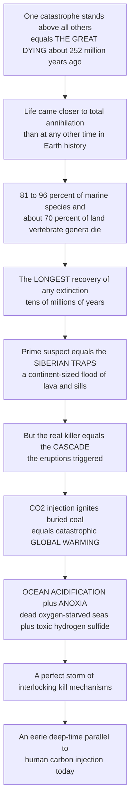

# 💀 The End-Permian Extinction: The Great Dying

> [!abstract] TL;DR
> The **end-Permian mass extinction** (~252 million years ago, at the Permian–Triassic boundary) is the **worst catastrophe in the history of life** — so devastating it is simply called **"the Great Dying."** An estimated **81–96% of all marine species** and about **70% of land vertebrate genera** were erased, along with the only known mass extinction of **insects** and a wholesale turnover of land plants. Complex life came **closer to being switched off entirely** than at any other time, and recovery took the **longest of any extinction** — roughly **5 to 10+ million years**. The prime suspect is one of the largest volcanic events in Earth history, the **Siberian Traps** — a continent-sized flood of lava and magma that intruded coal and evaporite deposits. But the lava itself was not the killer: it was the **cascade** it triggered. A colossal injection of **CO₂, methane, and sulfur** ignited coal, drove **catastrophic global warming**, **ocean acidification**, and widespread **ocean anoxia/euxinia** (oxygen-starved, hydrogen-sulfide-poisoned seas) — a "perfect storm" of interlocking kill mechanisms. Its trigger — a rapid injection of carbon that warms, acidifies, and deoxygenates the oceans — is an **eerie deep-time parallel to what humans are doing to the carbon cycle today**. Understanding the Great Dying is understanding both how fragile the biosphere can be and a stark warning written in the rocks.

---

## Intuition

**Analogy:** Imagine a stable ecosystem as a **complex machine with a single, quiet cooling system**. Now imagine someone jams the accelerator to the floor **and** breaks the cooling **and** poisons the fuel line **and** cuts off the air supply — all at once. Any one failure the machine might survive; **all of them together**, arriving faster than any part can adapt, and the whole thing seizes and dies. The Great Dying was exactly this kind of **compound, runaway failure** of the planet's life-support system — not one blow, but a chain of them, each amplifying the next.

Here is the deep-time version. Of all the catastrophes in the history of life, **one stands above the rest**. About **252 million years ago**, at the end of the Permian, a monstrous volcanic province in what is now Siberia began erupting — not a single volcano but a **continent-sized flood of lava** that also cooked its way through vast buried **coal beds**. That pumped a staggering pulse of **carbon** into the atmosphere. The carbon did not kill directly; it set off a **cascade**: the planet **overheated**, the equatorial oceans became too hot to live in, the seas turned **acidic** as CO₂ dissolved into them, and their oxygen drained away until much of the deep ocean became a **dead, sulfide-poisoned zone**. Life was reduced to a tiny, low-diversity remnant of "disaster taxa," and it took **tens of millions of years** to rebuild. The Great Dying is chilling and instructive precisely because that trigger — a **massive, rapid injection of carbon** causing warming, acidification, and anoxia — is the same syndrome humans are now driving, only faster.

---

## How It Works

### Core Mechanics

1. **The event.** At the Permian–Triassic boundary (**~251.9 Ma**, closing the Paleozoic), diversity collapsed in a geologically **rapid pulse** — high-precision U–Pb zircon dating places the main marine extinction within a window of perhaps **less than 60,000 years**. This is the **largest of the "Big Five"** mass extinctions.
2. **What was lost.** In the oceans, the great **Paleozoic evolutionary fauna** was gutted: the last **trilobites** vanished, along with **rugose and tabulate corals**, **blastoids**, **eurypterids**, and most **brachiopods, bryozoans, and crinoids**. On land, the extinction is the **only known mass extinction of insects** and drove a major reorganization of terrestrial vertebrates (many **therapsids/synapsids** lost), plus a wholesale plant turnover.
3. **The trigger — the Siberian Traps.** One of the largest continental **flood-basalt Large Igneous Provinces (LIPs)** in Earth history erupted **millions of cubic kilometers** of lava, but crucially its magma also **intruded as sills into the Tunguska Basin's coal, organic shale, and evaporite deposits**, "cooking" them and releasing enormous volumes of **carbon and halogen gases** on top of the volcanic CO₂ and SO₂.
4. **The kill cascade.** The gas release drove interlocking, mutually reinforcing stresses:
   - **Runaway global warming** — a huge greenhouse forcing pushed tropical sea-surface temperatures so high that the **equatorial oceans became a lethal "too hot" dead zone**.
   - **Ocean acidification** — as CO₂ dissolved into seawater, surface pH dropped, dissolving carbonate and hammering shell-and-reef builders (a strong extinction pulse for heavily calcified taxa).
   - **Ocean anoxia and euxinia** — warming lowers oxygen solubility and strengthens stratification, spreading **oxygen-starved bottom waters**; sulfate-reducing bacteria then generated toxic **hydrogen sulfide (H₂S)**, the basis of Kump's **"toxic ocean"** hypothesis, possibly venting to poison the air and damage the ozone layer.
5. **The fingerprint.** A sharp **negative carbon-isotope excursion (δ¹³C)** at the boundary records the massive injection of isotopically light carbon; the **U–Pb timing** ties the Siberian Traps' onset and peak flux precisely to the extinction interval.
6. **The aftermath.** Recovery was **delayed and prolonged** — the longest of any extinction (~**5–10+ Myr**). A low-diversity "**dead zone**" world was dominated by cosmopolitan **disaster taxa** (the tetrapod *Lystrosaurus*, the bivalve *Claraia*), with a **"coal gap"** and a **"reef gap"** marking collapsed ecosystems. The eventual recovery reset the stage for the **Mesozoic "modern" fauna** — archosaurs, and ultimately the dinosaurs.

### Flow / Architecture



---

## Key Concepts

### Secondary (the big idea)
- **The worst extinction ever.** About 252 million years ago, life almost ended — up to ~90%+ of ocean species and most land animals died. It is called **the Great Dying**.
- **A volcano the size of a continent.** The **Siberian Traps** erupted for a very long time and released huge amounts of gas, especially **carbon dioxide**, partly by burning underground coal.
- **A chain of disasters.** The gases caused **global warming**, made the oceans **acidic**, and drained the oceans of **oxygen** — three killers at once.
- **A very slow recovery.** Life took **millions of years** to bounce back — longer than after any other extinction.
- **A warning for today.** The way it happened — dumping carbon fast into the air — is a lot like what humans are doing now.

### Undergraduate (the mechanisms)
- **Magnitude and rapidity.** ~81% of marine **genera** (up to ~90–96% of species) and ~70% of terrestrial vertebrate genera lost; the **only** mass extinction of insects; a plausible main-phase duration of **<60 kyr** from U–Pb dating — extraordinarily fast for a global reorganization.
- **The Siberian Traps as a LIP.** Not just surface lava but **sill intrusion into coal, organics, and evaporites** (Tunguska Basin), which massively amplified carbon and halogen release beyond the eruptions alone — the "thermogenic" contribution.
- **The interlocking stresses.** **Warming + acidification + anoxia/euxinia** act **synergistically**: warming lowers O₂ solubility and drives stratification (anoxia), CO₂ drives both warming and acidification, and euxinic H₂S adds direct toxicity. Selectivity favored physiologically robust, low-metabolism taxa.
- **Proxy evidence.** The **δ¹³C excursion** (light-carbon injection), temperature proxies (conodont apatite δ¹⁸O) showing extreme tropical heat, redox proxies (framboidal pyrite, trace metals, biomarkers of green-sulfur bacteria) recording euxinia, and boron-isotope evidence for **pH decline**.
- **The recovery.** A prolonged **survival–recovery interval** with disaster taxa, a **coal gap** and **reef gap**, low ecological complexity, and a stepwise rebuild across the Early Triassic — the delay itself is a key datum about how deeply ecosystems were damaged.

### Graduate (the debates and subtleties)
- **Timing and causation.** The high-precision **U–Pb geochronology** (Burgess, Bowring & Shen 2014) tightened the boundary age and extinction duration and aligned them with Siberian Traps magmatism, strengthening the causal case; debate continues over the **relative roles** of eruptive CO₂ vs. **thermogenic** carbon from intruded sediments, and over whether the marine and terrestrial crises were exactly **synchronous**.
- **Multiple pulses and kill-mechanism partitioning.** Some records suggest **more than one extinction pulse**; disentangling which stressor (heat, low pH, hypoxia, H₂S) dominated for which clade, and where, is an active problem — acidification is strongest for calcifiers, hypoxia for high-metabolism actively respiring taxa (Penn & Deutsch's **metabolic index / hypoxia–warming** framework).
- **The "toxic ocean."** Kump et al.'s **euxinia/H₂S** hypothesis proposes chemocline upward excursions venting hydrogen sulfide, potentially causing **ozone damage** and terrestrial as well as marine kill — supported by biomarkers of photic-zone euxinia but debated in extent and timing.
- **Rate and carbon-cycle modeling.** The **rate** of carbon injection (not just the total) governs how far pH and O₂ crash before buffering catches up; comparisons of the end-Permian injection rate with the **modern anthropogenic** rate frame the deep-time-vs-today debate — the geological pulse released more carbon overall but the modern release is far **faster** in absolute terms per year.
- **Why the recovery was so long.** Hypotheses include **persistent lethal conditions** (recurring anoxia/heat in the Early Triassic), **ecosystem-collapse dynamics** (loss of foundation species and trophic structure), and the sheer **depth of the diversity bottleneck** — the recovery's length is itself evidence of how close life came to the edge.
- **The macroevolutionary reset.** The Great Dying decisively ended the **Paleozoic evolutionary fauna** (Sepkoski) and cleared ecospace for the **Modern evolutionary fauna** and the archosaur–dinosaur radiation — a textbook case of extinction as a **redirecting**, not merely destructive, force.

---

## Python Demo

```python
# The End-Permian "Great Dying" (~252 Ma), in four views (numpy + matplotlib):
#   (A) EXTINCTION MAGNITUDE by group -- how catastrophic the kill was.
#   (B) DIVERSITY crash-and-slow-recovery across the P-T boundary --
#       the longest recovery of any extinction ("dead zone" + disaster taxa).
#   (C) CARBON-INJECTION box model -- a pulse of CO2 (the Siberian Traps)
#       driving WARMING; one perturbation tracked through the carbon cycle.
#   (D) MULTIPLE LETHAL STRESSES from that SAME pulse -- ocean pH
#       (ACIDIFICATION) and O2 saturation (ANOXIA) collapse together,
#       showing how ONE carbon perturbation produces several killers.
import numpy as np
import matplotlib.pyplot as plt

# --- (A) extinction magnitude by major group (illustrative percentages) ----
groups = ["Marine\ninvertebrate\nspecies", "Land\nvertebrate\ngenera",
          "Insect\nfamilies", "Plant\nspecies\n(turnover)"]
loss   = [92, 70, 58, 50]                # approximate % lost at the P-T boundary

# --- (B) diversity crash & slow recovery across the boundary ---------------
t = np.linspace(-8, 20, 600)             # Myr relative to the P-T boundary
pre         = 100.0                      # stable Permian genus richness (rel.)
crash_floor = 8.0                        # survivor "dead zone" low
lag         = 5.0                        # Myr of suppressed low-diversity world
cap, k_rec  = 68.0, 0.45                 # recovery ceiling & rate
D = np.where(
    t < 0, pre,                          # stable Permian diversity
    np.where(
        t < lag, crash_floor,            # "dead zone": disaster taxa only
        crash_floor + (cap - crash_floor) /
        (1 + np.exp(-k_rec * (t - (lag + 6))))   # delayed logistic recovery
    ),
)

# --- (C) carbon-injection box model: CO2 pulse -> warming ------------------
yr  = np.linspace(0, 200_000, 800)       # years across the main pulse
C0  = 850.0                              # background pCO2 (ppm, Late Permian)
inj_dur  = 60_000.0                      # main-phase injection (~<60 kyr)
inj_rate = 0.055                         # ppm/yr while erupting (schematic)
tau      = 90_000.0                      # ocean/silicate drawdown timescale (yr)
C  = np.empty_like(yr); C[0] = C0
dt = yr[1] - yr[0]
for i in range(1, len(yr)):
    src   = inj_rate if yr[i] <= inj_dur else 0.0     # Siberian Traps ON/OFF
    C[i]  = C[i-1] + (src - (C[i-1] - C0) / tau) * dt  # source minus drawdown
ECS = 3.5                                # climate sensitivity, deg C per doubling
dT  = ECS * np.log2(C / C0)              # warming ~ logarithmic in CO2

# --- (D) the SAME pulse -> acidification + deoxygenation --------------------
pH     = 8.1 - 0.9 * np.log10(C / C0)    # surface-ocean pH falls (buffer, schematic)
O2_sat = np.clip(100.0 * (1 - 0.023 * dT), 0, 100)  # O2 solubility falls as it warms

# ---------------------------------------------------------------------------
fig, ax = plt.subplots(2, 2, figsize=(13, 9))

# A: extinction magnitude
axA = ax[0, 0]
bars = axA.bar(range(len(groups)), loss,
               color=["#8B0000", "#B22222", "#CD5C5C", "#E9967A"])
axA.set_xticks(range(len(groups))); axA.set_xticklabels(groups, fontsize=8)
axA.set_ylim(0, 100); axA.set_ylabel("percent lost at the P-T boundary")
axA.set_title("A. The Great Dying: catastrophic loss across all groups")
for b, v in zip(bars, loss):
    axA.text(b.get_x() + b.get_width()/2, v + 1.5, f"{v}%",
             ha="center", fontsize=9, fontweight="bold")

# B: diversity crash & slow recovery
axB = ax[0, 1]
axB.plot(t, D, color="crimson", lw=2.4)
axB.axvline(0, color="black", ls="--", lw=1.5)
axB.fill_between(t, D, crash_floor, where=(t >= 0) & (t < lag),
                 color="gray", alpha=0.3)
axB.annotate("P-T boundary\n~90%+ gone", xy=(0, 30), xytext=(-7.5, 55),
             fontsize=8, arrowprops=dict(arrowstyle="->"))
axB.annotate('"dead zone"\ndisaster taxa', xy=(2.5, crash_floor),
             xytext=(3.2, 30), fontsize=8,
             arrowprops=dict(arrowstyle="->", color="gray"))
axB.set_xlabel("time relative to boundary (Myr)")
axB.set_ylabel("genus richness (relative)")
axB.set_title("B. Longest recovery of any extinction (~5-10+ Myr)")

# C: CO2 injection -> warming (twin axis)
axC = ax[1, 0]
axC.plot(yr/1000, C, color="darkorange", lw=2.2)
axC.axvspan(0, inj_dur/1000, color="orange", alpha=0.12)
axC.set_xlabel("time since eruption onset (kyr)")
axC.set_ylabel("pCO2 (ppm)", color="darkorange")
axC.tick_params(axis="y", labelcolor="darkorange")
axC.set_title("C. Siberian Traps CO2 pulse drives warming")
axC2 = axC.twinx()
axC2.plot(yr/1000, dT, color="firebrick", lw=2.2, ls="--")
axC2.set_ylabel("warming (deg C)", color="firebrick")
axC2.tick_params(axis="y", labelcolor="firebrick")

# D: one pulse -> acidification + anoxia (twin axis)
axD = ax[1, 1]
axD.plot(yr/1000, pH, color="teal", lw=2.2)
axD.set_xlabel("time since eruption onset (kyr)")
axD.set_ylabel("surface-ocean pH (acidification)", color="teal")
axD.tick_params(axis="y", labelcolor="teal")
axD.set_title("D. One carbon pulse, three lethal stresses")
axD2 = axD.twinx()
axD2.plot(yr/1000, O2_sat, color="navy", lw=2.2, ls="--")
axD2.set_ylabel("dissolved-O2 saturation % (anoxia)", color="navy")
axD2.tick_params(axis="y", labelcolor="navy")

plt.tight_layout()
plt.savefig("end_permian_great_dying.png", dpi=120)

# quantitative takeaways
print(f"Peak pCO2 ~{C.max():.0f} ppm from a {C0:.0f} ppm background "
      f"({C.max()/C0:.1f}x)")
print(f"Peak warming ~{dT.max():.1f} deg C; ocean pH falls to ~{pH.min():.2f} "
      f"(a {8.1 - pH.min():.2f}-unit drop)")
print(f"O2 saturation drops to ~{O2_sat.min():.0f}% of its starting value")
print(f"Marine species loss ~{loss[0]}% -- the worst in the fossil record")
```

Running it makes the catastrophe quantitative. **Panel A** shows the sheer magnitude — the ~90%+ marine loss that defines the Great Dying, with heavy losses across every major group. **Panel B** shows the signature that sets the end-Permian apart from every other extinction: a near-total crash at the boundary, a prolonged low-diversity **"dead zone"** dominated by disaster taxa, and only then a slow logistic **recovery** stretching over millions of years. **Panels C and D** are the heart of the mechanism: a **single pulse of CO₂** (the Siberian Traps, shaded injection window) simultaneously **warms** the planet (C), **acidifies** the surface ocean, and — because warm water holds less oxygen — **deoxygenates** it (D). One carbon perturbation, three interlocking killers. That is the deep-time syndrome, and it is the same triad — warming, acidification, deoxygenation — driven by rapid carbon release that plays out in the modern ocean, only on a far faster clock.

---

## Real-World Applications

- **The premier deep-time climate analog.** The end-Permian is the closest natural experiment we have for **rapid carbon injection** into the ocean–atmosphere system. Because its cause (fast CO₂ release) and its symptoms (warming + acidification + deoxygenation) mirror **anthropogenic climate change**, it anchors research on how far ecosystems can be pushed and how selective the losses become.
- **Calibrating LIP–extinction links.** The end-Permian is the flagship case tying **Large Igneous Provinces** to mass extinctions, informing how geologists read other flood-basalt events (Deccan Traps at the end-Cretaceous, CAMP at the end-Triassic) as potential kill mechanisms via carbon and sulfur release.
- **High-precision geochronology as a tool.** The U–Pb zircon dating that pinned the boundary and its brief duration is a template for **testing cause-and-effect in deep time** — showing how tight dating can separate coincidence from causation across a global crisis.
- **Ocean deoxygenation and acidification forecasting.** The Permian's coupled anoxia–acidification response is used to stress-test **carbon-cycle and ocean-biogeochemistry models**, informing projections of expanding modern oxygen-minimum zones and coastal dead zones.
- **Conservation and tipping-point thinking.** The Great Dying is the ultimate illustration of **compounding stressors** and slow, incomplete recovery — a cautionary reference for biodiversity policy and for how resilience can fail when multiple pressures arrive together faster than adaptation.

---

## Common Pitfalls

- **Blaming the lava directly.** The Siberian Traps did not kill mainly by burying life in basalt; the lethal agent was the **gas cascade** (CO₂, thermogenic carbon from intruded coal, SO₂, halogens) and the **climate–ocean chemistry** it unleashed. The mechanism is chemical and climatic, not physical burial.
- **Picking a single kill mechanism.** Warming, acidification, and anoxia/euxinia were **synergistic**, not competing — different clades succumbed to different stresses, and the catastrophe emerges from their **combination**. "Which one caused it?" is the wrong framing.
- **Confusing total carbon with rate.** The end-Permian released more carbon overall than humans have so far, but the **modern release is far faster per year**. Rate — not just total — controls how deeply pH and O₂ crash. Sloppy comparisons in either direction misrepresent the analogy.
- **Assuming instantaneous, single-pulse extinction.** The main marine pulse was geologically fast (perhaps <60 kyr), but the crisis had **structure** — possible multiple pulses and a **prolonged Early Triassic aftermath** with recurring lethal conditions. Treating it as one clean instant erases the long recovery that is its most distinctive feature.
- **Underrating the recovery's length.** The **5–10+ Myr** delay is not a footnote; it is primary evidence of how deeply the biosphere was damaged. Ignoring the "dead zone," coal gap, and reef gap misses half the story.
- **Reading the fossil record naively.** Preservation and sampling biases, the **Signor–Lipps effect** (extinctions look gradual because last occurrences are undersampled), and time-averaging all distort raw diversity curves — the crisis must be interpreted against the record's known biases.

---

## Related Concepts

- [[Extinction_as_an_Evolutionary_Force]] — the Great Dying is the extreme demonstration that extinction does not merely destroy but **resets and redirects** evolution, clearing ecospace for wholly new faunas.
- [[Macroevolution_and_Deep_Time_Patterns]] — the end-Permian is the sharpest discontinuity in the Phanerozoic diversity curve and the boundary between Sepkoski's Paleozoic and Modern evolutionary faunas.
- [[Adaptive_Radiations_and_Diversification]] — the delayed post-extinction **recovery radiation** exploited the ecological opportunity the Great Dying created, an ultimate case of extinction-driven radiation.
- [[Mesozoic_Life_the_Age_of_Dinosaurs]] — the cleared ecospace set up the Triassic recovery and the rise of archosaurs and, eventually, the dinosaurs.
- [[Paleozoic_Life_and_the_Colonization_of_Land]] — the extinction ended the great Paleozoic fauna (trilobites, rugose/tabulate corals, most brachiopods) whose long reign this note closes.
- [[The_Cambrian_Explosion]] — the diversity-building counterpart at the opposite end of the Paleozoic; the Great Dying nearly undid what the Cambrian began.
- [[Dating_the_Past_Radiometric_and_Relative]] — the high-precision **U–Pb zircon** dating that pinned the boundary age and its brief duration and tied it to the Siberian Traps.
- [[Geologic_Time_and_Stratigraphy]] — the Permian–Triassic boundary is the great divide between the Paleozoic and Mesozoic eras on the geologic time scale.
- [[Mass_Extinctions_and_Paleoclimate]] (Earth Science) — the geological framing of mass extinctions and their climate drivers, of which the end-Permian is the archetype.
- [[Volcanism_and_Volcanic_Hazards]] (Earth Science) — the volcanic machinery behind flood-basalt Large Igneous Provinces like the Siberian Traps.
- [[Mantle_Convection_and_Hotspots]] (Earth Science) — the mantle-plume dynamics that generate continental flood-basalt provinces.
- [[Ocean_Acidification]] (Oceanography) — the carbonate-chemistry mechanism, seen in the modern ocean, that also hammered end-Permian calcifiers.
- [[Dissolved_Oxygen_and_Redox_Chemistry]] (Oceanography) — the redox and oxygen-solubility processes behind the widespread Permian anoxia and euxinia.
- [[Harmful_Algal_Blooms_and_Dead_Zones]] (Oceanography) — modern oxygen-starved dead zones are small-scale analogs of the Permian's global anoxic seas.
- [[Anthropogenic_Climate_Change]] (Meteorology) — the modern carbon injection whose warming–acidification–deoxygenation syndrome echoes the Great Dying's trigger.
- [[Climate_Sensitivity_and_Feedbacks]] (Meteorology) — the climate-sensitivity logic that turns a carbon pulse into a temperature response, central to both the Permian and today.
- [[Extinction_and_the_Sixth_Mass_Extinction]] (Ecology) — the ongoing biodiversity crisis for which the end-Permian is the deep-time worst case and warning.
- [[Ecological_Stability_Resilience_and_Tipping_Points]] (Ecology) — the resilience-and-collapse framework that explains why compounding stressors produced such deep, slow-to-reverse damage.

Within this section (siblings, prose-only as they are still being written): this note is the deepest single case study behind **Mass_Extinctions_and_the_Big_Five**; it exemplifies volcanic-carbon kill mechanisms detailed in **Causes_of_Mass_Extinctions**; its aftermath is the archetype for **Recovery_and_Radiation_After_Extinction**; it contrasts with the impact-driven **The_End_Cretaceous_Extinction_and_the_Asteroid**; and it is the sobering deep-time benchmark for **The_Sixth_Extinction_in_Deep_Time_Perspective**.

---

## Review Questions

1. **(Secondary)** Why is the end-Permian extinction called "the Great Dying," and roughly what fraction of ocean species did it wipe out? Name the volcanic event blamed for it.
2. **(Secondary/Undergraduate)** Explain in your own words why one pulse of carbon dioxide can cause **three** different killers in the ocean — warming, acidification, and loss of oxygen.
3. **(Undergraduate)** What made the Siberian Traps so deadly beyond ordinary volcanism? Explain the role of the coal and evaporite deposits its magma intruded.
4. **(Undergraduate)** The end-Permian recovery was the **longest** of any extinction (~5–10+ Myr). What features of the Early Triassic world (disaster taxa, coal gap, reef gap) record this, and why does the *length* of recovery matter as evidence?
5. **(Graduate)** How did high-precision U–Pb geochronology strengthen the causal link between the Siberian Traps and the extinction? What key uncertainties (e.g., eruptive vs. thermogenic carbon, single vs. multiple pulses, marine–terrestrial synchrony) remain?
6. **(Graduate)** Compare the end-Permian carbon injection with the modern anthropogenic release in terms of **total carbon vs. rate**, and explain why "which is worse?" depends on which quantity you emphasize and what you are trying to predict.

---

## Sources

- Erwin, D. H. (2006). *Extinction: How Life on Earth Nearly Ended 250 Million Years Ago*. Princeton University Press. [Publisher](https://press.princeton.edu/books/paperback/9780691165240/extinction)
- Burgess, S. D., Bowring, S. A. & Shen, S.-Z. (2014). "High-precision timeline for Earth's most severe extinction." *PNAS*, 111(9), 3316–3321. [DOI](https://doi.org/10.1073/pnas.1317692111)
- Payne, J. L. & Clapham, M. E. (2012). "End-Permian Mass Extinction in the Oceans: An Ancient Analog for the Twenty-First Century?" *Annual Review of Earth and Planetary Sciences*, 40, 89–111. [DOI](https://doi.org/10.1146/annurev-earth-042711-105329)
- Kump, L. R., Pavlov, A. & Arthur, M. A. (2005). "Massive release of hydrogen sulfide to the surface ocean and atmosphere during intervals of oceanic anoxia." *Geology*, 33(5), 397–400. [DOI](https://doi.org/10.1130/G21295.1)
- Penn, J. L., Deutsch, C., Payne, J. L. & Sperling, E. A. (2018). "Temperature-dependent hypoxia explains biogeography and severity of end-Permian marine mass extinction." *Science*, 362(6419), eaat1327. [DOI](https://doi.org/10.1126/science.aat1327)

---

#paleontology #end-permian #great-dying #siberian-traps #ocean-anoxia
