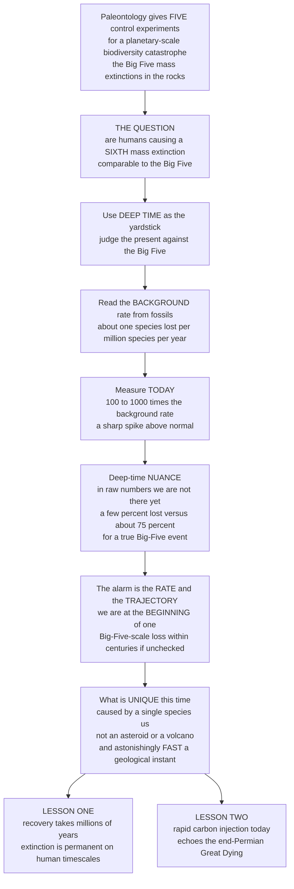

# ⏳ The Sixth Extinction in Deep-Time Perspective

> [!abstract] TL;DR
> Paleontology gives us something **no other science can**: a set of **five previous "control experiments"** for what a planetary-scale biodiversity catastrophe actually looks like — the **Big Five mass extinctions** preserved in the rocks. So when people ask *"are humans causing a sixth mass extinction?"*, paleontology hands us a **deep-time yardstick** to answer rigorously. Reading the fossil record gives the natural **background extinction rate** — roughly **one species per million species per year** (about **0.1–1 E/MSY**). Today, species are vanishing at an estimated **~100–1,000× that background** — a genuine spike. But the crucial deep-time nuance is this: in raw **numbers**, we are **not there yet** — documented losses so far (a few percent of some well-studied groups over ~500 years) fall far short of the **~75%+** species loss that defines a true Big-Five event. The alarm is about the **rate** and the **trajectory**: we sit at the **beginning** of a potential mass extinction whose current drivers (habitat loss, climate change) point toward Big-Five-scale losses **within centuries** if unchecked. Paleontology also reveals what is genuinely **unique** this time — the five ancient catastrophes were caused by **asteroids and volcanoes**; the sixth is caused by a **single biological species, us**, and it is happening **astonishingly fast** (a geological instant). And the record delivers two sobering lessons: **recovery takes millions of years**, and the **rapid carbon injection** driving today's change eerily **echoes the mechanism of the worst extinction of all, the end-Permian Great Dying**. The sixth extinction in deep-time perspective is the fossil record used as humanity's guide to the *gravity* — and the *trajectory* — of what we are doing to life on Earth.

---

## Intuition

**Analogy — grading today's disaster against the only five "final exams" that history ever wrote.** Suppose someone claims your city is heading for the worst flood in its history. The only honest way to judge that claim is to compare against *previous* record floods — the high-water marks scratched into old bridge pillars, the dates and depths of the five great floods your ancestors survived. Without those marks you are just guessing; *with* them, you can say precisely how today's rising water compares. **Paleontology gives biology exactly those high-water marks.** Life's 540-million-year record contains **five** catastrophic biodiversity floods — the **Big Five mass extinctions** — scratched into the rocks. They are the only **control experiments** we will ever have for what a planetary-scale die-off looks like: how deep, how broad, how fast, and how long the water takes to recede.

So when we ask *"are humans causing a sixth mass extinction?"*, we are really asking: **how does today's high-water mark compare to those five?** And the comparison is a **nuanced alarm**. Read the natural, everyday dying-out rate from the fossil record and it comes to roughly **one species lost per million species each year** — the quiet **background** trickle. Measure today, and species are vanishing **100 to 1,000 times faster** — a genuine spike above anything normal. *But* here is the deep-time nuance that separates careful science from slogan: in **raw numbers**, we are **not at a Big-Five event yet**. A true Big Five erased **three-quarters or more** of all species; humanity has *documented* the loss of only a **few percent** of some well-studied groups over the last five centuries. The catastrophe is real, but we are standing at its **beginning**, not its end.

What makes the alarm serious is not the magnitude so far — it is the **rate** and the **trajectory**. At current tempo, and if the species already sliding toward the edge follow, we could reach Big-Five magnitude **within a few centuries**. And paleontology tells us three things that no headline captures. First, this catastrophe is **unprecedented in its cause**: the ancient Big Five were triggered by **asteroids and continent-scale volcanoes**; the sixth is triggered by **one biological species**, and it is unfolding in a **geological instant**. Second, the record is brutally clear that **recovery takes millions of years** — extinction is effectively **permanent** on any human timescale. Third — and most chilling — the **rapid carbon injection** heating and acidifying today's oceans **echoes the exact kill mechanism** of the **end-Permian Great Dying**, the worst catastrophe in Earth's history. Understanding the sixth extinction in deep-time perspective is using the *entire fossil record* as our yardstick for the gravity, and the direction, of what we are doing to life.

---

## How It Works

### Core Mechanics

1. **Establish the yardstick: the Big Five.** Paleontology's gift is five calibrated **control experiments** — the end-Ordovician, Late Devonian, end-Permian, end-Triassic, and end-Cretaceous events — each a *statistically extraordinary* loss of a large fraction of species, worldwide, in a geological instant. They define what a **genuine mass extinction** looks like in **magnitude, breadth, and rate**.
2. **Read the background rate from the rocks.** Averaging first- and last-appearance data across deep time yields the **background extinction rate** — the normal, non-catastrophic pace of species loss — conventionally expressed in **extinctions per million species-years (E/MSY)**. The canonical figure is **~0.1–1 E/MSY**: about *one* species lost per million species per year.
3. **Measure the modern rate.** Counting documented extinctions of well-studied groups (mammals, birds, amphibians) over recent centuries gives a **current rate of ~100–1,000× (some estimates higher) the background** — the empirical spike that motivates the "sixth extinction" claim (**Pimm 2014**, **Ceballos 2015**, **Barnosky 2011**).
4. **Separate the two axes: rate versus magnitude.** This is the pivotal distinction. **Rate** = how *fast* species are vanishing (already at mass-extinction levels). **Magnitude** = the *cumulative fraction* lost (still only a few percent, far below the ~75% Big-Five threshold). We are **high on rate, low on magnitude** — early on the trajectory, not at the destination.
5. **Correct for comparing unlike with unlike.** The fossil record is **time-averaged and incomplete**: a "million-year-averaged" background rate is being compared to a **500-year human snapshot**, and rare fast pulses in the past may be *invisible* to coarse geological sampling. Honest comparison demands accounting for these biases — is a 500-year window even long enough to register in the rocks? (This is why the record's biases matter enormously here.)
6. **Project the trajectory.** If currently **threatened** species are lost and drivers (habitat loss, climate, invasives, overharvest, pollution) continue, **Barnosky et al. (2011)** estimate Big-Five magnitude could be reached in **~240–540 years** — placing us unmistakably at the *beginning* of a potential sixth mass extinction with a **preventable** endpoint.
7. **Read the deep-time lessons.** The record teaches that (a) **recovery spans millions of years**; (b) the **rapid-carbon kill mechanism** driving today's warming, acidification, and anoxia **echoes the end-Permian Great Dying**; (c) ecosystems can cross **tipping points** and collapse nonlinearly; and (d) extinction is **selective** — large, specialized, small-range species go first.

### Flow / Architecture



---

## Key Concepts

### 🟢 Secondary

- **The five "high-water marks."** Life has suffered **five** giant biodiversity disasters in the last 540 million years — the **Big Five**. Because they are preserved in the rocks, they are the only real *measuring sticks* for how bad a mass extinction can get.
- **The normal rate vs today.** Normally, species die out **very slowly** — about **one in a million each year**. Today, species are vanishing **hundreds to a thousand times faster**. That spike is what worries scientists.
- **We are at the beginning, not the end.** A *true* Big-Five event kills about **three-quarters or more** of all species. So far humans have caused only a **few percent** — so we are **early** on the road to a mass extinction, not already at one.
- **What is different this time.** The old disasters were caused by **asteroids and volcanoes**. This one is caused by **a single species — us** — and it is happening **incredibly fast**.
- **The scary lesson.** After a mass extinction, life takes **millions of years** to recover. On any human timescale, the loss is **forever**.

### 🟡 Undergraduate

- **The yardstick logic.** Paleontology reframes an environmental worry as a **testable comparison**: measure the modern extinction rate and magnitude, then compare against the **fossil-calibrated Big Five**. Only the deep-time record makes this rigorous rather than rhetorical.
- **E/MSY and the background rate.** Extinction rates are measured in **extinctions per million species-years**. The fossil **background** is **~0.1–1 E/MSY**; modern rates for well-studied groups run **~100 E/MSY and up** — the **~100–1,000×** figure (**Pimm et al. 2014**, **Ceballos et al. 2015**).
- **Rate vs magnitude — the crucial split.** These are *different metrics*. Current **rate** already matches or exceeds the Big Five; current **magnitude** (fraction of species actually lost) is **not yet** at the ~75% threshold. Confusing the two produces both overstatement ("it's already happened") and complacency ("nothing's happening").
- **Are we comparing like with like?** The fossil record is **time-averaged** (each geological sample smears thousands to millions of years together) and **incomplete**. Comparing a **500-year snapshot** to a **million-year average** is fraught — brief modern pulses might be undetectable in deep time, which cuts *both* ways in the debate.
- **Where we are (Barnosky et al. 2011).** The honest verdict: cumulative documented losses are **below** Big-Five magnitude, **but** the rate is elevated to mass-extinction levels, and if threatened species vanish and trends continue, Big-Five magnitude arrives in **~240–540 years**. We are **on the trajectory**, with the outcome **still avoidable**.
- **The leading edge: defaunation and extinction debt.** Population **declines** and **defaunation** ("biological annihilation") *precede* extinction and signal the crisis early; **extinction debt** — species committed but not yet gone — means today's counts **understate** the eventual toll.
- **What is unique.** A mass extinction driven by **one biological species**, at **extraordinary speed**, through **multiple simultaneous drivers** (habitat, climate, invasives, overharvest, pollution) — the defining signature of the **Anthropocene**.

### 🔴 Graduate

- **The rate-vs-magnitude framework, formalized.** **Barnosky et al. (2011)** place the modern pulse on two independent axes calibrated to the fossil Big Five: modern **per-taxon extinction rates** already fall within or above the range inferred *during* past mass extinctions, whereas cumulative **magnitude** (fraction of species extinct) remains at the low single-digit percent for most groups. The "sixth mass extinction" is therefore best described as **incipient**: rate-qualified, magnitude-pending.
- **Comparing incommensurate records.** The fossil background is an **average over long intervals** that necessarily *misses* short, intense pulses (a modern-length spike would be **temporally unresolvable** in most stratigraphic sections). Conversely, **time-averaging** and the **pull of the recent** inflate apparent modern diversity. Rate comparisons must therefore be made at *matched temporal resolution* or with explicit models of what the rock record can and cannot register — see [[The_Fossil_Record_and_Its_Biases]].
- **Extinction-debt dynamics and committed loss.** From the **species–area relationship** ($S \propto A^{z}$) and metapopulation theory, reducing habitat commits a system to a lower equilibrium richness reached only after a **relaxation time** scaling with generation length. Long-lived, slow species thus carry the **largest, slowest-paid debts**; current realized extinctions are a *lower bound* on the committed magnitude, and the trajectory to Big-Five levels is partly **already locked in**.
- **Dark extinction and asymmetric error.** Undocumented losses of unnamed or poorly sampled taxa ("**dark extinction**") mean documented counts likely **underestimate** true modern magnitude — while, symmetrically, extrapolating from charismatic well-studied groups risks **overestimating** global rates. The deep-time perspective **sharpens** rather than dismisses concern: both correction directions still leave rates far above background.
- **The kill-mechanism analogy — carbon tempo.** The gravest lesson is mechanistic: the **rate** of anthropogenic CO₂ release (order ~10 Pg C yr⁻¹) is **faster than** the average carbon-injection rates inferred for the **end-Permian Siberian Traps** — the driver of the worst mass extinction. Rapid CO₂ forcing produces the same lethal triad — **warming + ocean acidification + anoxia/euxinia** — making the Great Dying a **process analogue**, not merely a magnitude comparison. See [[Mass_Extinctions_and_Paleoclimate]] and [[Anthropogenic_Climate_Change]].
- **Selectivity, tipping points, and phylogenetic pruning.** Modern loss is **non-random** (large body size, specialization, small range, high trophic level) and **phylogenetically clustered**, so it erodes **phylogenetic and functional diversity** faster than a random cull; ecosystems can cross **nonlinear tipping points** into alternative states — connecting the deep-time record to [[Sustainability_and_Planetary_Boundaries]] and to the leading edge documented in [[Extinction_and_the_Sixth_Mass_Extinction]].
- **Conservation paleobiology.** The whole enterprise is the fossil record **informing the present**: using pre-human baselines, past recovery timescales, and ancient carbon-crisis analogues to calibrate what is natural, what is anomalous, and what recovery would (and would not) look like on policy-relevant timescales.

---

## Python Demo

```python
# THE SIXTH EXTINCTION IN DEEP-TIME PERSPECTIVE, made visible three ways:
#   (A) RATE COMPARISON (log scale): background extinction rate read from the
#       fossil record vs the AVERAGE rate DURING the Big Five vs MODERN rates.
#       Modern rates sit ~100-1000x background -- and match or exceed the
#       Big-Five-era rates (the Barnosky/Pimm/Ceballos signature).
#   (B) TRAJECTORY TOWARD THE 75% THRESHOLD: cumulative fraction of species
#       lost over the coming centuries under a "current" vs an "accelerated"
#       (threatened-species-lost) scenario, against the ~75% Big-Five magnitude
#       line -- showing we are NOT there yet but are on a steep path that
#       reaches Big-Five magnitude within centuries if unchecked.
#   (C) MAGNITUDE-vs-RATE PLANE: the Big Five and the modern pulse plotted
#       together. We sit LOW on magnitude but FAR RIGHT on rate -- early on the
#       trajectory, on a steep slope. Console note compares carbon-release tempo
#       now vs the end-Permian Great Dying.
# Pure numpy + matplotlib, fully runnable.

import numpy as np
import matplotlib.pyplot as plt

rng = np.random.default_rng(42)

# ----------------------------------------------------------------------
# (A) RATE COMPARISON  (extinctions per million species-years, E/MSY)
# ----------------------------------------------------------------------
labels = ["Background\n(fossil record)", "Avg DURING\nthe Big Five",
          "Modern\n(documented)", "Modern\n(incl. committed)"]
rates  = np.array([0.5, 3.0, 100.0, 1000.0])          # E/MSY (representative)
colors = ["#94a3b8", "#f59e0b", "#ef4444", "#7f1d1d"]

# ----------------------------------------------------------------------
# (B) TRAJECTORY TOWARD THE ~75% MAGNITUDE THRESHOLD
#     cumulative fraction lost = 1 - exp(-k * t),  t in years from now
# ----------------------------------------------------------------------
t = np.linspace(0, 1200, 1201)                        # years from present
threshold = 0.75                                       # Big-Five magnitude

# calibrate k so each scenario crosses 0.75 at a target year
def k_for(target_year, frac=threshold):
    return -np.log(1 - frac) / target_year

k_accel   = k_for(350)     # accelerated: threatened species lost -> ~350 yr
k_current = k_for(950)     # current trends continue        -> ~950 yr
k_bg      = 0.5e-6         # background pace: effectively flat here

lost_accel   = 1 - np.exp(-k_accel   * t)
lost_current = 1 - np.exp(-k_current * t)
lost_bg      = 1 - np.exp(-k_bg      * t)

def cross_year(curve):
    hit = np.where(curve >= threshold)[0]
    return t[hit[0]] if hit.size else None

yr_accel   = cross_year(lost_accel)
yr_current = cross_year(lost_current)

# where are we NOW: a few percent of well-studied groups over ~500 yr
now_magnitude = 0.02

# ----------------------------------------------------------------------
# (C) MAGNITUDE-vs-RATE PLANE  (rate on log x, magnitude on y)
# ----------------------------------------------------------------------
# (name, rate_E/MSY_during_event, magnitude_fraction_species_lost)
big5 = [("End-Ordovician", 4, 0.85), ("Late Devonian", 3, 0.75),
        ("End-Permian",    6, 0.90), ("End-Triassic",  4, 0.80),
        ("End-Cretaceous", 5, 0.76)]
bg_point   = (0.5, 0.001)                              # background
now_point  = (300.0, now_magnitude)                   # sixth so far
committed  = (300.0, 0.30)                             # committed / trajectory

# ----------------------------------------------------------------------
# PLOT
# ----------------------------------------------------------------------
fig, (axA, axB, axC) = plt.subplots(1, 3, figsize=(18, 5.6))

# (A) rate comparison, log scale
bars = axA.bar(labels, rates, color=colors, edgecolor="black")
axA.set_yscale("log")
axA.set_ylabel("Extinction rate  (E/MSY, log scale)")
axA.set_title("(A) Modern rate vs the fossil yardstick\n~100-1000x background",
              weight="bold", fontsize=11)
axA.axhline(0.5, color="#334155", ls="--", lw=1)
axA.text(3.4, 0.6, "background", ha="right", fontsize=8, color="#334155")
for b, r in zip(bars, rates):
    axA.text(b.get_x() + b.get_width()/2, r*1.15, f"{r:g}",
             ha="center", va="bottom", fontsize=8.5, weight="bold")
axA.grid(alpha=0.25, axis="y")

# (B) trajectory toward the 75% threshold
axB.plot(t, lost_accel*100,   color="#b91c1c", lw=2.4,
         label="Accelerated (threatened species lost)")
axB.plot(t, lost_current*100, color="#ea580c", lw=2.4,
         label="Current trends continue")
axB.plot(t, lost_bg*100,      color="#64748b", lw=2.0, ls=":",
         label="Background pace")
axB.axhline(threshold*100, color="#111827", ls="--", lw=1.4)
axB.text(20, threshold*100 + 2, "Big-Five magnitude threshold (~75%)",
         fontsize=8.5, color="#111827")
axB.scatter([0], [now_magnitude*100], color="black", zorder=5, s=45)
axB.annotate("We are HERE\n(~a few percent, ~500 yr)",
             xy=(0, now_magnitude*100), xytext=(150, 16),
             fontsize=8, color="black",
             arrowprops=dict(arrowstyle="->", color="black"))
if yr_accel:
    axB.annotate(f"~{yr_accel:.0f} yr", xy=(yr_accel, threshold*100),
                 xytext=(yr_accel-40, 55), fontsize=8, color="#b91c1c",
                 arrowprops=dict(arrowstyle="->", color="#b91c1c"))
axB.set_xlabel("Years from present")
axB.set_ylabel("Cumulative species lost (%)")
axB.set_title("(B) Trajectory toward Big-Five magnitude\nnot there yet, but on a steep path",
              weight="bold", fontsize=11)
axB.set_ylim(0, 100)
axB.legend(fontsize=8, loc="center right"); axB.grid(alpha=0.25)

# (C) magnitude-vs-rate plane
for name, r, m in big5:
    axC.scatter(r, m*100, s=140, color="#f59e0b", edgecolor="black", zorder=3)
    axC.annotate(name, xy=(r, m*100), xytext=(r*1.1, m*100+2),
                 fontsize=7.5, color="#92400e")
axC.scatter(*[bg_point[0], bg_point[1]*100], s=90, color="#94a3b8",
            edgecolor="black", zorder=3)
axC.annotate("background", xy=(bg_point[0], bg_point[1]*100),
             xytext=(bg_point[0]*1.4, 3), fontsize=7.5, color="#475569")
axC.scatter(now_point[0], now_point[1]*100, s=160, color="#ef4444",
            edgecolor="black", marker="D", zorder=4)
axC.annotate("SIXTH so far\n(high rate, low magnitude)",
             xy=(now_point[0], now_point[1]*100), xytext=(30, 12),
             fontsize=8, color="#b91c1c",
             arrowprops=dict(arrowstyle="->", color="#b91c1c"))
axC.annotate("", xy=(committed[0], committed[1]*100),
             xytext=(now_point[0], now_point[1]*100),
             arrowprops=dict(arrowstyle="->", color="#b91c1c", lw=2, ls="--"))
axC.text(committed[0]*1.05, committed[1]*100, "trajectory\nif unchecked",
         fontsize=7.5, color="#b91c1c")
axC.axhline(75, color="#111827", ls="--", lw=1)
axC.set_xscale("log")
axC.set_xlabel("Extinction rate  (E/MSY, log scale)")
axC.set_ylabel("Magnitude (% of species lost)")
axC.set_title("(C) Magnitude vs rate: early on the path,\non a steep slope",
              weight="bold", fontsize=11)
axC.set_ylim(-3, 100); axC.grid(alpha=0.25)

plt.tight_layout()
plt.savefig("sixth_extinction_deep_time.png", dpi=120)

# ----------------------------------------------------------------------
# Console summary: rate multiple, trajectory, and the carbon-tempo echo
# ----------------------------------------------------------------------
print(f"Background rate      ~ {rates[0]:>6.1f} E/MSY")
print(f"Modern (documented)  ~ {rates[2]:>6.1f} E/MSY  "
      f"= {rates[2]/rates[0]:.0f}x background")
print(f"Modern (committed)   ~ {rates[3]:>6.1f} E/MSY  "
      f"= {rates[3]/rates[0]:.0f}x background")
print(f"\nMagnitude now        ~ {now_magnitude*100:.0f}%  "
      f"(vs ~75% for a true Big-Five event -> NOT there yet)")
print(f"Reaches ~75% in      ~ {yr_accel:.0f} yr (accelerated) / "
      f"~{yr_current:.0f} yr (current trends)")
print("\nKill-mechanism echo: modern CO2 release (~10 Pg C/yr) is FASTER than")
print("the average carbon injection inferred for the end-Permian Great Dying")
print("-> same lethal triad: warming + ocean acidification + anoxia.")
```

**Panel A** is the core comparison: on a **log scale**, the fossil **background rate** (~0.5 E/MSY) is dwarfed by **modern rates** (~100–1,000 E/MSY), which not only run **100–1,000× background** but also **match or exceed** the average rates *during* the Big Five themselves — the empirical heart of the "sixth extinction" case. **Panel B** shows the **trajectory**: today we sit at only **a few percent** cumulative loss (the black dot, far below the dashed **~75% Big-Five threshold**), yet the **accelerated** curve — if currently threatened species vanish and trends continue — reaches that threshold in only a **few centuries**, while the background pace stays essentially flat. **Panel C** places both eras on the **magnitude-vs-rate plane**: the Big Five cluster **high on magnitude**; the modern pulse sits **low on magnitude but far right on rate** (the red diamond), with a dashed arrow showing the committed **trajectory climbing toward Big-Five territory**. The console output quantifies the rate multiples, the centuries-to-threshold, and the sobering **carbon-tempo echo** of the Great Dying.

---

## Real-World Applications

> **The Barnosky et al. (2011) test — turning a slogan into a measurement.** The landmark *Nature* paper "*Has the Earth's sixth mass extinction already arrived?*" is the template for this entire note: it takes the modern extinction record, calibrates it against the **fossil Big Five on two axes (rate and magnitude)**, and returns a **nuanced, quantitative verdict** — current *rates* are already at mass-extinction levels, but cumulative *magnitude* is not yet, so we are **on the trajectory** with a **preventable** outcome. This is paleontology directly arbitrating a live policy question, and it is why deep-time framing appears in IPCC and IPBES assessments.

- **Setting pre-human baselines for conservation.** Fossil and subfossil records establish what biodiversity looked like *before* human impact, letting conservation biologists distinguish natural background turnover from anomalous modern loss — the foundation of **conservation paleobiology** and of "shifting-baseline" corrections.
- **Reading ancient carbon crises as forecasts.** Because the **end-Permian** and the **PETM** (Paleocene-Eocene Thermal Maximum) are rapid-carbon-injection experiments the Earth already ran, their proxy records (carbon-isotope excursions, ocean acidification signatures) are used as **process analogues** to bound the ecological consequences of anthropogenic CO₂ release.
- **Estimating recovery timescales.** The multimillion-year recoveries after the Big Five inform realistic expectations that lost diversity and ecosystem function will **not** rebound on human-policy timescales — a hard constraint for restoration and "de-extinction" debates.
- **Bounding the debate quantitatively.** Deep-time calibration disciplines both alarmism and denial: it rules out "nothing unusual is happening" (rates are demonstrably 100–1,000× background) *and* over-claiming ("75% are already gone"), sharpening the credibility of biodiversity science.
- **Astrobiology and planetary resilience.** The record of near-total collapse (the Great Dying) followed by full recovery is a natural experiment in **biosphere resilience**, feeding models of how life responds to planetary-scale forcing on Earth and elsewhere.

---

## Common Pitfalls

- **"We are already in the sixth mass extinction, full stop."** Precisely (**Barnosky 2011**): the *rate* is at mass-extinction levels, but the *magnitude* is **not yet** at the ~75% threshold. We are **on the trajectory**, not at the destination — a distinction that matters because it means the outcome is **still preventable**. Collapsing rate and magnitude into one claim is the single most common error.
- **"The rate spike proves the magnitude."** **Rate and magnitude are independent axes.** A very high rate acting for a short time still produces a small cumulative loss. Judging severity requires *both* numbers, read separately.
- **Comparing a 500-year snapshot to a million-year average.** The fossil background is **time-averaged**; brief modern pulses may be **unresolvable** in deep time. Naively comparing incommensurate windows can *either* exaggerate or understate the anomaly — the comparison must be made at matched resolution or with explicit models of what the rock record can register (see [[The_Fossil_Record_and_Its_Biases]]).
- **Ignoring extinction debt and dark extinction.** Documented counts are a **lower bound**: species already committed to extinction ("living dead") and undocumented losses ("dark extinction") mean the *true* current magnitude — and the locked-in trajectory — exceed the tally. Treating "still exists" as "safe" is a false comfort.
- **Assuming the past guarantees recovery.** Yes, life recovered after every Big Five — but over **millions of years**. On any human timescale the losses are **permanent**; "life will bounce back" is true geologically and useless practically.
- **Missing what is genuinely unprecedented.** Fixating only on magnitude ("we're not at 75% yet, so relax") ignores the **unique** features: a mass extinction driven by **one species**, at **geological-instant speed**, through **multiple simultaneous drivers** — a combination with **no analogue** in the Big Five.
- **Treating the carbon parallel as loose metaphor.** The **end-Permian** echo is **mechanistic, not rhetorical**: rapid CO₂ forcing reproduces the same **warming + acidification + anoxia** triad, and modern carbon-release *rates* may be *faster* than the Siberian Traps. Dismissing it as alarmist rhetoric misses a real process analogue.

---

## Related Concepts

This note is the **deep-time / paleontological verdict** of Section 04 (Mass Extinctions and Recovery), and it deliberately leans on its siblings, referenced here in prose so they wire once written: it uses *Mass_Extinctions_and_the_Big_Five* as the calibrated yardstick; draws its gravest process analogue from *The_End_Permian_Extinction_the_Great_Dying*; borrows the recurring kill mechanisms catalogued in *Causes_of_Mass_Extinctions*; invokes the multimillion-year timescales detailed in *Recovery_and_Radiation_After_Extinction*; frames the fossil record's role in the present through *Conservation_Paleobiology_and_Astrobiology*; and rests on the background-vs-mass distinction and selectivity developed in *Extinction_as_an_Evolutionary_Force*.

Verified cross-vault and cross-section links to existing notes:

- [[Extinction_and_the_Sixth_Mass_Extinction]] — the **Ecology / conservation** treatment of the *present-day* crisis (HIPPO drivers, defaunation, extinction debt, selectivity). **This note supplies the deep-time yardstick that note is measured against**; that one supplies the mechanisms and ecology of the leading edge.
- [[Mass_Extinctions_and_Paleoclimate]] — the **Earth-Science** companion on the paleoclimatic kill mechanisms of the Big Five; the source of the carbon-warming-anoxia-acidification triad this note extrapolates to the present.
- [[Anthropogenic_Climate_Change]] — the modern forcing whose **rapid carbon injection** is the process analogue to the end-Permian, and a principal driver of the sixth extinction's trajectory.
- [[The_Fossil_Record_and_Its_Biases]] — why comparing a 500-year snapshot to a million-year-averaged, incomplete record is fraught; the essential caveat behind every rate comparison here.
- [[Sustainability_and_Planetary_Boundaries]] — the **Systems-Thinking** framing of biosphere-integrity as a planetary boundary and the tipping-point logic behind nonlinear ecosystem collapse.

---

## Review Questions

1. **(Secondary)** Scientists say species are going extinct 100 to 1,000 times faster than normal, yet they also say we are "not in a full mass extinction *yet*." Using the flood-high-water-mark analogy, explain how *both* statements can be true at the same time, and name one thing that makes today's extinction different from the ones that killed the dinosaurs.
2. **(Undergraduate)** Distinguish extinction **rate** from **magnitude**. Where does the modern pulse sit on each axis relative to the Big Five, and why does the **time-averaged, incomplete** nature of the fossil record complicate a direct comparison between a 500-year human snapshot and a million-year fossil background? What would strengthen the comparison?
3. **(Graduate)** A colleague argues that because documented losses are only a few percent, "the sixth mass extinction is overblown." Rebut *and* qualify this using (a) **extinction debt** and **dark extinction** as reasons documented counts are a lower bound; (b) the **Barnosky et al. (2011)** rate-vs-magnitude verdict and its ~240–540-year trajectory estimate; and (c) the **carbon-tempo** analogy to the end-Permian — is modern CO₂ release faster or slower than the Siberian Traps, and why does that matter mechanistically? Conclude by stating precisely *what* would make you call the event a completed sixth mass extinction.

---

## Sources

- Barnosky, A. D., Matzke, N., Tomiya, S., et al. (2011). "Has the Earth's sixth mass extinction already arrived?" *Nature*, 471, 51–57. — the rigorous rate-vs-magnitude test comparing the modern pulse to the fossil-calibrated Big Five.
- Ceballos, G., Ehrlich, P. R., Barnosky, A. D., et al. (2015). "Accelerated modern human-induced species losses: Entering the sixth mass extinction." *Science Advances*, 1(5), e1400253. — the conservative estimate that modern vertebrate rates are ~100× background.
- Pimm, S. L., Jenkins, C. N., Abell, R., et al. (2014). "The biodiversity of species and their rates of extinction, distribution, and protection." *Science*, 344(6187), 1246752. — the modern synthesis pinning the background rate near ~0.1 E/MSY and modern rates ~1,000× higher.
- Kolbert, E. (2014). *The Sixth Extinction: An Unnatural History.* Henry Holt. — the Pulitzer-winning narrative synthesis of the modern extinction crisis in deep-time context.

---

#paleontology #sixth-extinction #background-rate #anthropocene #deep-time-perspective
