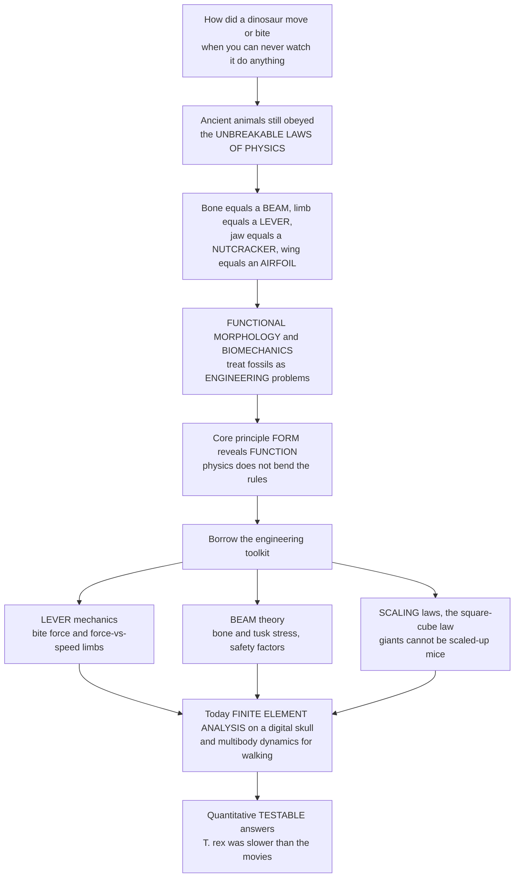

# 🦖 Functional Morphology and Biomechanics of Fossils

> [!abstract] TL;DR
> How do you figure out how a dinosaur moved, how hard *Tyrannosaurus* could bite, or whether a giant pterosaur could really fly — when you can never watch the animal do anything? The trick is that ancient organisms, however strange, still had to obey the **unbreakable laws of physics**. A bone is a structural **beam** that must resist bending and breaking; a limb is a **lever**; a jaw is a **nutcracker**; a wing is an **airfoil**. **Functional morphology** infers *function and lifestyle* from the *form* of a structure, and **biomechanics** treats the fossil as an **engineering problem** — analysing its anatomy the way an engineer analyses a bridge or a machine. The master principle is that **form reveals function**: shape is constrained by the job it did, because physics does not bend its rules for extinct creatures. Paleobiologists borrow the full engineering toolkit — **lever mechanics** (bite forces, limb force-vs-speed trade-offs), **beam theory and strength of materials** (how much stress a bone or tusk could take), the **scaling laws** that dictate why a giant cannot be a scaled-up mouse (the **square-cube law** — strength grows slower than weight), and today **finite element analysis** (the same software used to design cars and aircraft, applied to a digital dinosaur skull) plus **multibody dynamics** to animate ancient walking. The payoff is **quantitative, testable** answers that overturn myths — *T. rex* was no sprinter, *Argentinosaurus* pushed the mechanical ceiling of standing, and a bare bone becomes a living, moving machine.

## Intuition

**Analogy first — the fossil as a machine on an engineer's bench.** You are handed the skull of an animal that died 70 million years ago and asked an impossible-sounding question: *how hard could it bite?* You will never see it eat. But you do not need to. Hand that same skull to a mechanical engineer and it becomes a familiar object — a **nutcracker**. A nutcracker has a hinge, a place where your hand pushes, and a place where the nut sits; the physics of levers tells you exactly how the squeezing force at the nut relates to the effort at the handle, purely from the *geometry*. A jaw is identical: the jaw joint is the hinge, the jaw muscle is the effort, and the tooth is where the "nut" gets crushed. Measure where the muscle attaches and how long the jaw is, and the laws of the lever hand you the bite force — no time machine required.

Every part of an extinct animal yields to the same move. A limb bone is a **beam**: an engineer knows a beam must be thick where the bending stress is highest, so the shape of the bone is a frozen record of the loads it bore. A running leg is a **lever** tuned for speed the way a cheetah's is, or for brute force the way a badger's digging arm is — the proportions give it away. A wing is an **airfoil**, obeying the same lift equations as an aircraft. And the deepest rule of all is why an elephant's legs look like pillars while a mouse's look like matchsticks: the **square-cube law**. Double every dimension of an animal and its weight (a volume) grows eightfold, but the strength of its bones (a cross-sectional area) grows only fourfold. Weight outruns strength, so a giant simply *cannot* have the slender proportions of a small animal — it must rebuild itself with disproportionately thick limbs, or it collapses. This is why you can never scale a mouse up to elephant size. Recognise that fossils are engineering problems where **form reveals function**, reach for levers, beams, scaling laws, and finite-element simulation, and dead bones turn into machines you can measure. That is how we know — quantitatively, testably — that *T. rex* ran nowhere near as fast as the movies pretend.

---

## How It Works

**Biomechanics converts anatomy into physics you can compute.** You never observe the behaviour; you observe a rigid, load-bearing structure and ask what the laws of mechanics *permit* it to have done. The reasoning runs through a small set of engineering idealisations.

1. **Establish the functional hypothesis (form-function paradigm).** Following Rudwick's **paradigm method**, you compare the fossil structure to an *idealised mechanical design* for a candidate function — the "paradigm" of a fast runner, a bone-crusher, an efficient swimmer — and ask how closely the real structure approaches that optimum. Living **analogues** and the **Extant Phylogenetic Bracket** (bracketing the fossil between its two nearest living relatives) discipline the guess: muscle positions, cartilage, and air sacs are reconstructed from what living relatives share.
2. **Levers and mechanical advantage.** A jaw or a limb is a lever pivoting on a joint. Static torque balance, `F_in × r_in = F_out × L_out`, gives **mechanical advantage** `MA = r_in / L_out`. High MA (muscle attaching far from the joint, short out-lever) means a powerful, slow **crushing** jaw or a **fossorial/graviportal** limb; low MA means a fast, weak **slicing** jaw or a **cursorial** running limb. Force and speed trade off — you cannot maximise both.
3. **Beams and strength of materials.** A bone, tusk, or shell is a loaded beam. **Beam theory** predicts bending stress `σ = M·c / I` (bending moment, distance from the neutral axis, second moment of area), so cross-sectional shape reveals the direction of habitual load, and comparing peak stress to bone's failure strength gives a **safety factor**. Bone is treated as an engineering material with a measurable yield strength.
4. **Scaling and allometry.** The **square-cube law**: mass scales as volume `∝ L³` while bone and muscle strength scale as cross-sectional area `∝ L²`. Under geometric (isometric) similarity, stress `∝ L³/L² = L` *rises* with size, so there is a maximum body size before bone fails — unless proportions change. Giants therefore obey **elastic similarity** (McMahon): limbs thicken faster than isometry (`d ∝ M^(1/2)` rather than `M^(1/3)`), producing pillar-like graviportal legs.
5. **Fluid dynamics.** For swimmers and fliers the relevant physics is drag and lift: streamlined bodies minimise drag, and **airfoil** cross-sections generate lift, letting you test whether a pterosaur or early bird could get airborne.
6. **Computational biomechanics.** Modern work digitises the fossil with **CT**, then runs **finite element analysis (FEA)** to map stress and strain across a virtual skull under a simulated bite, and **multibody / musculoskeletal dynamics** to reconstruct posture, gait, and maximum running speed. The output is a number with an uncertainty range — a **testable** claim.



---

## Key Concepts

### 🟢 Secondary

- **Form reveals function.** The *shape* of a body part is a clue to the *job* it did, because that job had to obey physics. Long thin legs mean a runner; short thick legs with big muscle attachments mean a digger or a heavyweight.
- **Fossils are engineering problems.** A bone is a **beam** that must not snap, a limb is a **lever**, a jaw is a **nutcracker**, and a wing is an **airfoil**. You can analyse an extinct animal the way you analyse a bridge or a machine.
- **The bite-force lever.** A jaw closes like a nutcracker: the closer the food is to the hinge (the back teeth), the harder the bite; teeth at the very tip bite far more weakly. That is why crushers use their back teeth and slicers snap with the front.
- **Why giants need thick legs — the square-cube law.** Make an animal twice as long, wide, and tall and it becomes *eight* times heavier but its bones only *four* times stronger. Weight beats strength, so a truly big animal must have disproportionately thick, pillar-like legs. You cannot just scale a mouse up to elephant size — it would collapse under its own weight.
- **The T. rex myth.** Movies show *Tyrannosaurus* sprinting after jeeps. The biomechanics says no: a 6–9 tonne body could not have run that fast without impossibly huge leg muscles. It was a fast walker, not a sprinter.

### 🟡 Undergraduate

- **The paradigm method (Rudwick).** Function is inferred by comparing a fossil structure to an **idealised mechanical design** ("paradigm") for a hypothesised function and measuring how closely it approaches that optimum — turning "what was it for?" into a comparative, structured argument rather than a guess.
- **Levers and mechanical advantage.** For a jaw, `MA = r_in / L_out` (muscle in-lever over bite out-lever). Crushing **durophages** have short deep jaws and forward muscle attachment (high MA, high force); slicing/snapping predators have long jaws (low MA, high tip speed and reach). The same in-lever/out-lever logic separates **cursorial** (running, long distal limb segments, low MA, high speed), **graviportal** (weight-bearing, columnar), and **fossorial** (digging, short robust, high MA) limbs.
- **Beam theory and safety factors.** Bones, tusks, and shells are loaded beams analysed with bending stress `σ = M·c/I` and torsion. Comparing peak physiological stress to bone's failure strength gives a **safety factor** (typically 2–4 in living animals), a check on whether a reconstructed posture or behaviour is mechanically survivable.
- **Allometry and the square-cube law.** Area `∝ L²`, volume/mass `∝ L³`. Isometry keeps shape constant; **allometry** (shape changing with size) is forced by physics. Running the relationship backwards, a limb-bone dimension estimates **body mass** — the input to almost every downstream biomechanical calculation.
- **Extant Phylogenetic Bracket and analogues.** Soft tissues that set lever geometry — muscle attachment area (PCSA), cartilage caps, air sacs — are reconstructed by bracketing the fossil between living relatives (for dinosaurs: **crocodiles and birds**). Convergent living analogues (a modern cursor, a modern crusher) supply the mechanical template.
- **Fluid mechanics of swimming and flight.** Streamlining minimises drag for fast swimmers (ichthyosaurs, ammonite shells); **airfoil** cross-sections generate lift, and wing-loading plus muscle power decide whether a pterosaur or early bird could take off and stay up.

### 🔴 Graduate

- **Finite element analysis (FEA).** A CT-derived 3-D mesh of a skull or limb is loaded with reconstructed muscle forces and constrained at joints; the solver maps **stress and strain** across the structure, revealing where it would crack and how it was optimised. Rayfield's FEA of the *Tyrannosaurus* skull and McHenry's analysis of *Smilodon* are landmark cases; results are only as good as the assumed **material properties, muscle forces, and boundary conditions** (garbage-in, garbage-out).
- **Multibody and musculoskeletal dynamics.** Rigid-body models with reconstructed muscle moment arms simulate gait, posture, and the **maximum running speed** a skeleton could support. Hutchinson & Garcia (2002) estimated that fast running would have required *T. rex* to devote an implausible ~40–86% of body mass to leg extensor muscle — quantitative grounds that it was *not* a fast runner.
- **Elastic vs geometric similarity (McMahon).** Real animals do not scale isometrically. Under **elastic similarity**, limb proportions change to keep elastic deformation (buckling risk) constant, predicting `diameter ∝ length^(3/2)` and bone dimensions scaling with mass more steeply than isometry — the quantitative basis of **graviportal** design and of **upper size limits** for terrestrial tetrapods and sauropods.
- **Bone as a material and stress homeostasis.** Bone remodels toward roughly **constant peak operating stress** across body sizes (Biewener), maintained not by geometry alone but by changes in **posture** (more upright limbs in bigger animals reduce moment arms) — a key reason naive geometric scaling overpredicts stress.
- **CFD for locomotion in fluids.** Computational fluid dynamics tests hydrodynamic hypotheses (trilobite and ammonite drag/stability, plesiosaur underwater flight) and aerodynamic ones (azhdarchid pterosaur launch and soaring), integrating imaging with simulation.
- **The limits and assumptions.** Soft-tissue uncertainty (muscle PCSA, cartilage thickness that changes joint spacing and lever arms), untestable behaviour, safety-factor unknowns, and extrapolation of living-animal scaling laws beyond their training range all inject uncertainty — which rigorous studies report as **sensitivity analyses and confidence ranges**, not single numbers.

---

## Python Demo

```python
# Functional morphology & biomechanics of fossils, three engineering views:
#   (A) LEVER MECHANICS  - bite force from jaw geometry: a crushing durophage vs a
#       slicing carnivore, showing the force-vs-speed / force-vs-reach trade-off.
#   (B) SQUARE-CUBE STRESS - why a scaled-up animal's bones eventually fail:
#       relative limb-bone stress rises with size, hitting a strength ceiling
#       => a MAXIMUM body size under geometric similarity.
#   (C) ALLOMETRY OF SUPPORT - to keep stress constant, bone diameter must scale
#       as M^(1/2), far steeper than isometric M^(1/3): giants need pillar limbs.
# Pure numpy + matplotlib, fully runnable.
import numpy as np
import matplotlib.pyplot as plt

# ======================================================================
# (A) JAW-LEVER BITE FORCE  (nutcracker mechanics)
# ======================================================================
# Static torque balance about the jaw joint:
#   F_muscle * r_in = F_bite * L_out   ->   F_bite = F_muscle * r_in / L_out
# MA = r_in / L_out is HIGH at the back teeth (short out-lever) and LOW at the tip.
def bite_force(F_muscle, r_in, L_out):
    return F_muscle * r_in / L_out               # newtons

# Two skull "morphs": (muscle force N, in-lever mm, jaw length mm)
crusher = dict(name="Durophage crusher", F=4000.0, r_in=40.0, jaw=120.0, c="#b45309")
slicer  = dict(name="Slicing carnivore", F=3000.0, r_in=25.0, jaw=220.0, c="#b91c1c")

print("LEVER MECHANICS / BITE FORCE")
for m in (crusher, slicer):
    back  = bite_force(m["F"], m["r_in"], 0.5 * m["jaw"])   # mid/back tooth
    tip   = bite_force(m["F"], m["r_in"], m["jaw"])         # front tooth tip
    print(f"  {m['name']:<20s}: back-tooth bite {back:6.0f} N | tip bite {tip:6.0f} N"
          f" | reach {m['jaw']:.0f} mm")

# ======================================================================
# (B) SQUARE-CUBE LAW  ->  relative bone stress vs body mass  ->  size limit
# ======================================================================
# Geometric (isometric) similarity: all lengths ~ L, mass ~ L^3, bone area ~ L^2.
# Stress = Weight / Area  ~  L^3 / L^2  =  L  ~  M^(1/3).
M = np.logspace(-3, 5, 400)                       # body mass, kg (1 g -> 100 tonnes)
M_ref = 1e-3                                       # reference: a 1 g shrew
rel_stress = (M / M_ref) ** (1.0 / 3.0)           # relative peak limb-bone stress
ceiling = 100.0                                    # bone strength / safe working stress
M_max = M_ref * ceiling ** 3                       # size where stress hits the ceiling
print("\nSQUARE-CUBE LAW / SIZE LIMIT")
print(f"  Under pure geometric scaling, bone stress grows as M^(1/3).")
print(f"  Strength ceiling reached at ~{M_max:,.0f} kg -> a scaled-up shrew cannot")
print(f"  exceed ~1 tonne; real 10-tonne+ giants must abandon geometric similarity.")

# ======================================================================
# (C) ALLOMETRY OF SUPPORT  ->  bone diameter must scale steeper than isometry
# ======================================================================
# Isometric:            d ~ M^(1/3)
# Stress-preserving:    Area ~ Weight  ->  d ~ M^(1/2)  (pillar-like limbs)
d_iso  = (M / M_ref) ** (1.0 / 3.0)
d_supp = (M / M_ref) ** (1.0 / 2.0)
landmarks = [("mouse", 0.03), ("dog", 25.0), ("human", 70.0),
             ("elephant", 6000.0), ("sauropod", 40000.0)]

# ======================================================================
# Plot
# ======================================================================
fig, (axA, axB, axC) = plt.subplots(1, 3, figsize=(17, 5.2))

# (A) bite force along the tooth row
for m in (crusher, slicer):
    L = np.linspace(0.35 * m["jaw"], m["jaw"], 200)   # bite point from joint (mm)
    F = bite_force(m["F"], m["r_in"], L)
    axA.plot(L, F, lw=2.5, color=m["c"], label=m["name"])
axA.set_xlabel("Bite point distance from jaw joint, mm  (tip -> right)")
axA.set_ylabel("Bite force, N")
axA.set_title("(A) Jaw as a nutcracker: lever mechanics\n"
              "crushers bite hard at the back; slicers reach far but bite weakly")
axA.legend(fontsize=8); axA.grid(True, alpha=0.3)
axA.annotate("high mechanical advantage\n(back teeth)", xy=(0.42*crusher["jaw"], 3400),
             xytext=(120, 3100), fontsize=7.5,
             arrowprops=dict(arrowstyle="->", color="#555"))

# (B) relative stress vs mass with strength ceiling
axB.loglog(M, rel_stress, color="#1d4ed8", lw=2.5, label="stress ~ M^(1/3) (geometric)")
axB.axhline(ceiling, color="#dc2626", ls="--", lw=1.5, label="bone strength ceiling")
axB.axvline(M_max, color="#16a34a", ls=":", lw=1.5)
axB.plot(M_max, ceiling, "o", color="#16a34a", ms=8)
axB.annotate(f"geometric size limit\n~{M_max:,.0f} kg", xy=(M_max, ceiling),
             xytext=(M_max*3e-3, ceiling*0.9), fontsize=8, color="#166534",
             arrowprops=dict(arrowstyle="->", color="#16a34a"))
axB.set_xlabel("Body mass, kg (log)")
axB.set_ylabel("Relative peak bone stress (log)")
axB.set_title("(B) The square-cube law sets a size ceiling\n"
              "weight (L^3) outruns bone strength (L^2)")
axB.legend(fontsize=8); axB.grid(True, which="both", alpha=0.3)

# (C) isometric vs stress-preserving bone diameter scaling
axC.loglog(M, d_iso,  color="#64748b", lw=2.0, ls="--",
           label="isometric  d ~ M^(1/3)")
axC.loglog(M, d_supp, color="#7c3aed", lw=2.5,
           label="stress-preserving  d ~ M^(1/2)")
axC.fill_between(M, d_iso, d_supp, color="#ddd6fe", alpha=0.5,
                 label="extra bone giants must add")
for name, mass in landmarks:
    dd = (mass / M_ref) ** 0.5
    axC.plot(mass, dd, "o", color="#4c1d95", ms=6)
    axC.annotate(name, xy=(mass, dd), xytext=(mass, dd*1.5),
                 ha="center", fontsize=7.5, color="#4c1d95")
axC.set_xlabel("Body mass, kg (log)")
axC.set_ylabel("Relative limb-bone diameter (log)")
axC.set_title("(C) Allometry of support\n"
              "giants need disproportionately thick, pillar-like limbs")
axC.legend(fontsize=8); axC.grid(True, which="both", alpha=0.3)

plt.tight_layout()
plt.savefig("functional_morphology_biomechanics.png", dpi=120)
plt.show()

# Takeaways:
# (A) Bite force is pure lever geometry: where the muscle pulls and where the tooth
#     sits fix the force, so a jaw's SHAPE predicts crushing vs slicing FUNCTION.
# (B) Because weight scales as L^3 but bone strength as L^2, stress rises with size
#     and hits a ceiling: you cannot just scale a small animal up without limit.
# (C) To survive at giant size, limbs must thicken faster than isometry -> the
#     pillar-legged graviportal build of elephants and sauropods.
```

Panel A treats the jaw as a nutcracker: identical lever mechanics show why a durophage with a short deep jaw and forward muscle attachment bites far harder (especially at the back teeth) than a long-jawed slicer, and why the slicer trades that force for reach and tip speed — morphology *predicting* function. Panel B makes the square-cube law bite: under geometric similarity, limb-bone stress climbs as `M^(1/3)` until it meets bone's strength ceiling, imposing a maximum body size, which is exactly why real multi-tonne giants cannot be scaled-up small animals. Panel C shows their escape route: keeping stress constant forces bone diameter to scale as `M^(1/2)`, far steeper than isometric `M^(1/3)`, producing the disproportionately thick, pillar-like limbs of elephants and sauropods.

---

## Real-World Applications

- **T. rex bite force (FEA).** Finite element and lever models put *Tyrannosaurus* among the hardest-biting land animals ever — posterior-tooth bite forces estimated in the tens of thousands of newtons — explaining the bone-crushing puncture-and-pull feeding recorded by tooth marks and coprolites full of crushed bone.
- **T. rex was not a fast runner (multibody dynamics).** Hutchinson & Garcia's musculoskeletal model showed that sprinting would have demanded an anatomically impossible fraction of the body as leg-extensor muscle, reframing the giant as a fast walker/limited runner — a textbook case of biomechanics overturning a popular myth.
- **Sauropod gigantism and standing giants.** Multibody and scaling models (e.g. of *Argentinosaurus*) test whether the largest sauropods could even support and move their bodies, linking air-sac-lightened skeletons, columnar limbs, and the square-cube ceiling to the upper size limit of terrestrial life.
- **Sabertooth killing mechanics.** FEA of *Smilodon* skulls revealed a surprisingly *weak* bite for its size; the cat killed with powerful neck-driven shear bites to soft throat tissue rather than crushing bone — function that pure tooth shape alone would misread.
- **Pterosaur and early-bird flight.** Wing-loading, airfoil, and launch-biomechanics models test whether giant azhdarchids like *Quetzalcoatlus* could get airborne (favouring a quadrupedal vaulting launch), and how *Archaeopteryx* and early birds generated lift.
- **Engineering crossover and bio-inspiration.** The very same CT-plus-FEA and multibody software used to design cars, aircraft, and prosthetics is applied to digital fossils, while fossil structural solutions (lightweight pneumatic bone, efficient beams) feed back into bio-inspired engineering.

---

## Common Pitfalls

- **Scaling naively (ignoring the square-cube law).** Treating a giant as a photo-enlarged small animal ignores that strength scales with area and load with volume; a scaled-up mouse would shatter its own legs. Proportions *must* change with size.
- **Garbage-in FEA.** A beautiful stress map is only as good as its inputs — assumed material properties, reconstructed muscle forces, and joint boundary conditions. Without **sensitivity analysis**, an FEA result is decoration, not evidence.
- **Confusing capacity with behaviour.** A jaw *able* to bite with 30,000 N did not necessarily do so routinely; performance limits are not diets. Report what the structure *permits*, not what it *did*.
- **Ignoring soft tissue.** Cartilage caps change joint spacing and lever arms; muscle physiological cross-sectional area (PCSA) is uncertain; omitting them silently biases force and speed estimates. Use the Extant Phylogenetic Bracket to constrain them.
- **Extrapolating scaling laws past the data.** A mass or stress regression fitted on cat-to-elephant-sized animals grows wildly uncertain when pushed to a multi-tonne dinosaur; report prediction intervals, not point values.
- **Assuming animals operate at their limits.** Living bone runs at safety factors of ~2–4, not at failure; assuming maximum performance overstates capability and misreads how much margin a structure carried.
- **Reading a single element in isolation.** One bone constrains but does not dictate whole-body mechanics; posture (which changes with size) can matter as much as geometry, as bone-stress-homeostasis studies show.

---

## Related Concepts

- [[Bending_and_Beam_Theory]] — the bending-moment and second-moment-of-area mechanics used to read how much stress a bone, tusk, or shell could bear
- [[Stress_Strain_and_Deformation]] — bone treated as an engineering material with a yield strength; the basis of safety factors and failure prediction
- [[Statics_and_Equilibrium]] — free-body diagrams and torque balance behind lever bite-force calculations and whether a giant could stand
- [[The_Musculoskeletal_System]] — the living bone-muscle-tendon lever system whose mechanics are extrapolated onto fossils via the Extant Phylogenetic Bracket
- [[Airfoils_and_Wing_Theory]] — the lift and wing-loading aerodynamics used to test whether pterosaurs and early birds could fly

*Within this vault, this note is the biomechanical engine of the **Paleobiology and Reconstructing Life** section. It deepens the form-function reasoning introduced in the sibling **Reading_Fossils_Morphology_and_Reconstruction** (which builds the skeleton this note then loads), supplies the physics behind the lifestyles inferred in **Paleobiology_and_Ancient_Life**, quantifies the movement recorded in **Trace_Fossils_and_Ancient_Behavior**, relies on the CT and 3-D imaging of **Modern_Paleontological_Methods_and_Technology**, and provides the gigantism and locomotion analyses that illuminate **Mesozoic_Life_the_Age_of_Dinosaurs**. Those siblings are named here in prose so they can be wired once written.*

---

## Review Questions

1. **(Secondary)** Why can a mouse have matchstick-thin legs while an elephant needs pillar-like ones? Explain, using the idea that weight and bone strength grow at different rates as an animal gets bigger, why you cannot simply scale a mouse up to elephant size.
2. **(Undergraduate)** A crushing durophage and a slicing carnivore have jaws of very different shape. Using the lever equation `F_bite = F_muscle × r_in / L_out`, explain how jaw proportions produce a force-versus-speed/reach trade-off, and predict where along the tooth row each animal generates its hardest bite.
3. **(Graduate)** *Tyrannosaurus* is popularly depicted as a fast sprinter. Describe how a multibody musculoskeletal model and the square-cube law together argue against this, what quantity Hutchinson & Garcia found to be implausibly large, and identify the three biggest sources of uncertainty (soft tissue, muscle forces, boundary conditions) that any such biomechanical model must report.

---

## Sources

- Alexander, R. McN. (1989) — *Dynamics of Dinosaurs and Other Extinct Giants* (Columbia University Press); and *Principles of Animal Locomotion* (Princeton University Press, 2003) — the foundational treatment of scaling, levers, and locomotor biomechanics
- Rudwick, M.J.S. (1964) — "The inference of function from structure in fossils," *British Journal for the Philosophy of Science* 15(57): 27–40 — the paradigm method for functional inference
- Rayfield, E.J. (2007) — "Finite element analysis and understanding the biomechanics and evolution of living and fossil organisms," *Annual Review of Earth and Planetary Sciences* 35: 541–576
- Hutchinson, J.R. & Garcia, M. (2002) — "Tyrannosaurus was not a fast runner," *Nature* 415: 1018–1021
- Biewener, A.A. (2005) — "Biomechanical consequences of scaling," *Journal of Experimental Biology* 208: 1665–1676 — stress homeostasis, posture change, and elastic similarity across body size

#paleontology #biomechanics #functional-morphology #finite-element-analysis #scaling
