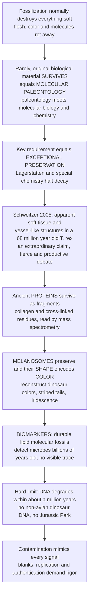

# 🧬 Molecular Paleontology and Exceptional Preservation

> [!abstract] TL;DR
> Fossilization normally destroys everything soft — flesh, color, and the molecules of life all rot away, leaving only mineralized bone and shell. **Molecular paleontology** is the frontier science of finding and reading the rare **original biological material** that survives across deep time: the physical frontier where paleontology fuses with molecular biology, geochemistry, and analytical chemistry. It has recovered apparent **soft tissue and protein fragments** (Schweitzer's fiercely debated 68-million-year-old *T. rex*), reconstructed the **actual colors** of extinct animals from preserved **melanosomes** (striped dinosaur tails, iridescent ancient feathers), and used durable **biomarkers** — lipid "molecular fossils" — to detect microbial life billions of years old that left no visible trace. All of it depends on the rare gift of **exceptional preservation** (Lagerstätten and special chemistry) and is bounded by a hard limit — true DNA is gone within roughly a million years, so there is no reviving dinosaurs — and by pervasive **contamination** that demands rigorous controls.

## Intuition

**Analogy first.** Imagine a library that burns down every night. Almost every book — every page of text, every colored illustration — is reduced to ash by morning, and all that survives is the occasional stone bust of an author bolted to the wall. That is ordinary fossilization: the soft, information-rich parts of an organism (its flesh, its color, its very molecules) rot away, and only the hard "stone busts" — bone, shell, tooth — normally endure. For centuries paleontology worked almost entirely from those busts. But every so often, in a freak corner of the burned library, a **charred fragment of an actual page** survives — a smear of ink, a scrap of a sentence, a flake of pigment. Molecular paleontology is the science of hunting down those scorched fragments and learning to *read* them.

Reading them is astonishing, because the fragments carry information no bone can: the sequence of a **protein**, the **color** of a feather, the **chemical signature** of a microbe that had no skeleton at all. The catch is that these survivors are vanishingly rare and endlessly imitated — a modern smudge of lab dust or a mat of bacteria can mimic a fragment of the original page — so the whole field lives on a knife-edge between one of paleontology's most jaw-dropping capabilities and one of its most humbling traps. Get the controls right and you can read the molecules and colors of a creature dead for tens of millions of years. Get them wrong and you have merely photographed the fire.

---

## How It Works

**Molecular paleontology asks a chemical question that classical paleontology never could: not just what *shape* did the organism have, but what *molecules* was it made of, and do any survive?** The answer depends on a race between **decay** and **stabilization**, run separately for each class of biomolecule. Because different molecules decay at wildly different rates, deep time acts as a **molecular sieve**: DNA is destroyed almost immediately on geological scales, some proteins and their cross-linked fragments can linger far longer, and certain lipids are so inert they persist for billions of years. What survives, and how it is authenticated, defines the whole enterprise.

1. **Start from the default: total molecular erasure.** Hydrolysis (water attacking chemical bonds), oxidation, and microbial enzymes cleave biomolecules into ever-smaller pieces. Left alone, this runs to completion in geological moments.
2. **Exceptional preservation halts the clock.** Rapid burial, anoxia, microbial sealing, rapid **authigenic mineralization** (phosphate or carbonate templating soft tissue at cellular scale), and entombment in amber or permafrost can arrest decay before the molecules are destroyed. These conditions define **Konservat-Lagerstätten** — the molecular windows into deep time.
3. **Soft tissue and proteins.** In 2005 Mary Schweitzer reported soft, pliable tissue and blood-vessel- and osteocyte-like structures inside a 68-million-year-old *Tyrannosaurus rex* bone, plus evidence for **collagen** and other protein fragments. The claim was extraordinary — proteins were not thought to survive that long — and ignited fierce debate (biofilm and contamination versus endogenous origin). Mass-spectrometry **proteomics** has since strengthened the case that some cross-linked proteinaceous residue can persist.
4. **Ancient pigments and color.** **Melanosomes** — micron-scale, melanin-bearing organelles — preserve in exceptional fossils, and their *shape* encodes pigment type: elongate, sausage-shaped **eumelanosomes** map to black, grey, and iridescent tones; spherical **phaeomelanosomes** map to reddish-brown. For the first time, the actual **coloration** of extinct animals can be reconstructed.
5. **Biomarkers.** Diagenetically stable **lipids and hydrocarbons** (steranes, hopanes, porphyrins, isoprenoids) are "molecular fossils" — chemical signatures of specific organisms that persist for hundreds of millions to billions of years, detecting otherwise-invisible microbial life and correlating petroleum to its source rock.
6. **The hard limit and the demand for rigor.** True DNA degrades within roughly a million years, ruling out non-avian dinosaur DNA. And because contamination mimics every signal, every claim requires blanks, replication across labs, and authentication of **syngenicity** (that the molecule is as old as the rock).



---

## Key Concepts

### Secondary Level

**What molecular paleontology is.** The study of the actual **molecules and molecular signatures** of ancient organisms, not just the shape of their fossils. Three great prizes:

- **Proteins** — the building blocks of tissue (like **collagen** in bone) can occasionally leave fragments behind.
- **Pigments** — the color-carrying structures (**melanosomes**) can survive, so we can work out what color an extinct animal was.
- **Biomarkers** — tough fatty molecules (lipids) that act as chemical "fingerprints" of the organisms that made them.

**The color revolution.** Until about 2008, every painting of a dinosaur was a guess about color. Then paleontologists realized that fossil feathers contain preserved **melanosomes**, and that their shape reveals the pigment:

| Melanosome shape | Pigment | Color it makes |
|------------------|---------|----------------|
| Long, sausage-like (**eumelanosome**) | eumelanin | black, grey, iridescent |
| Round, meatball-like (**phaeomelanosome**) | phaeomelanin | reddish-brown, ginger |

This is how we learned that the small dinosaur *Sinosauropteryx* had a **striped, reddish-brown tail** and that *Microraptor*'s feathers were glossy **iridescent** black like a crow's.

**The hard limit.** DNA is fragile. Even in the best conditions it falls apart within roughly a **million years** — far too short to reach the age of dinosaurs (tens of millions of years old). So *Jurassic Park* is impossible: there is no dinosaur DNA to clone. Proteins and pigments last longer than DNA, which is why we can sometimes get those instead.

**Why it needs luck.** None of this works on an ordinary fossil. It requires **exceptional preservation** — a rare fossil formed under special conditions (rapid burial, no oxygen, quick mineral sealing) that stopped decay before the soft material was destroyed. These rare sites are called **Lagerstätten**.

### Undergraduate Level

**Exceptional preservation and Lagerstätten — the prerequisite.** Molecular survival is impossible without arresting decay. The favorable conditions are **rapid burial**, **anoxia** (oxygen-poor pore water starving aerobic microbes), **microbial sealing** by biofilms and mats, rapid **authigenic mineralization** (early-forming minerals templating soft tissue), and low-diffusion environments such as amber and permafrost. **Konservat-Lagerstätten** (exceptional *quality* of preservation) are the molecular windows; classic examples include amber inclusions, phosphatized microfossils, and carbonaceous feather compressions. The taphonomy of molecules is a race between decay and stabilization — the same framework as fossilization generally, pushed down to the molecular scale.

**Soft tissue and proteins — the Schweitzer discoveries.** From 2005 onward, Schweitzer and colleagues reported, in demineralized Cretaceous dinosaur bone (*T. rex*, later *Brachylophosaurus*), transparent, flexible vessel-like tubes, cell-like osteocyte structures, and immunological and mass-spectrometric evidence for **collagen** peptides. The **controversy** was immediate and productive: critics argued the structures could be modern **bacterial biofilm** or laboratory contamination. Rigorous responses added antibody assays, iron-mediated cross-linking as a preservation mechanism (Fe from blood stabilizing tissue), and independent mass-spectrometry sequencing. The emerging consensus is cautious: some **original proteinaceous material and its cross-linked fragments** can persist, even if fully intact proteins do not.

**Proteomics of fossils and molecular phylogenetics.** Because **proteins** carry sequence information, recovered peptides can be used to place fossils on the **tree of life** — "molecular phylogenetics" done with proteins rather than DNA. Ancient collagen has been used to confirm that mastodons group with living elephants and to test the placement of *Tyrannosaurus* and *Brachylophosaurus* relative to birds. Eggshell and bone proteins (including very stable ones bound within mineral) are especially promising because the mineral shields the peptides from hydrolysis.

**Ancient pigments and color — a genuine triumph.** The 2008 recognition (Vinther and colleagues) that fossil "bacteria" in feathers were in fact endogenous **melanosomes** transformed paleontology. Melanosome **morphology** correlates with pigment chemistry: elongate eumelanosomes (high aspect ratio) indicate eumelanin (black, grey, and — when densely packed in ordered layers — structural **iridescence**); spherical phaeomelanosomes indicate phaeomelanin (reddish-brown). Reconstructed animals now include *Anchiornis* (grey body, black-and-white wings, reddish crest), *Sinosauropteryx* (a chestnut, striped "bandit-masked" tail), and *Microraptor* (iridescent black). Caveats remain: melanosome shape does not capture non-melanin pigments (carotenoids, porphyrins), and the **melanosome-versus-microbe** debate — whether the micron-scale bodies are pigment organelles or fossilized bacteria — requires chemical confirmation (e.g., detecting melanin degradation products directly).

**Biomarkers — molecular fossils.** Certain **lipids and hydrocarbons** are so diagenetically stable that they survive as recognizable skeletons for hundreds of millions to billions of years: **steranes** (from sterols, diagnostic of eukaryotes), **hopanes** (from bacterial hopanoids), **porphyrins** (from chlorophyll and heme), and **isoprenoids** (pristane, phytane). These "molecular fossils" detect life that left **no body fossil** — cyanobacteria, early eukaryotes — and underpin **petroleum geochemistry**, correlating an oil to its source rock and depositional environment. Because lipids far outlast proteins and DNA, biomarkers are the deepest-reaching molecular record.

### Graduate Level

**Differential molecular stability — the sieve of deep time.** The governing hierarchy is **lipids ≫ proteins ≫ DNA**. DNA depurination and strand cleavage give it a per-bond half-life on the order of centuries (~521 years for a nucleotide bond in the Allentoft moa study), so amplifiable fragments are effectively gone by roughly **1–1.5 million years** even in cold, dry settings — the **deep-time DNA barrier** that rules out non-avian dinosaur genetics. Proteins hydrolyze more slowly, and cross-linking (Maillard reactions, mineral binding, oxidative cross-links) can further armor fragments; certain intracrystalline peptides survive into the millions and, controversially, tens of millions of years. Lipids, lacking hydrolyzable backbones once aromatized/saturated, persist across the entire Phanerozoic and into the Archean. This ordering, formalized as competing exponential decay constants, is the quantitative core of the field (see the Python demo).

**Authigenic mineralization windows.** Cellular- and molecular-scale preservation hinges on minerals precipitating *before* the tissue is destroyed, seeded by the decay itself. Microbial metabolism locally shifts pore-water pH and redox, opening short-lived windows: **phosphatization** (apatite) captures muscle and embryos at sub-cellular resolution within days (Orsten- and Doushantuo-type preservation); **pyritization** preserves labile tissue in anoxic, iron- and sulfate-rich muds; **carbonate concretions** entomb three-dimensional carcasses before collapse; **silicification** and **carbonaceous kerogenization** retain recalcitrant biopolymers and melanin. Molecular preservation is therefore a *coupled* biogeochemical problem — microbial biofilms are simultaneously agents of destruction and of templating.

**Authentication and the primacy of contamination.** Contamination is the central peril, and it is asymmetric: a false positive (modern signal misread as ancient) is far easier to produce than a false negative. Rigor requires extraction blanks, non-fossil substrate controls, demonstration of expected **diagenetic alteration** (racemization, deamidation, thermal maturation) consistent with age, and **syngenicity** tests showing the molecule is bound within the fossil rather than adsorbed later. The **early-life biomarker controversy** is the cautionary tale: 2.7-billion-year-old steranes and hopanes once taken as evidence of early oxygenic photosynthesis and eukaryotes were later shown, on re-drilling with ultra-clean protocols, to be **younger drilling and handling contaminants** — collapsing a headline claim about the timing of oxygenation. The lesson generalizes: extraordinary molecular claims demand extraordinary, replicated controls.

**Relationship to ancient DNA.** Molecular paleontology's deep-time domain (proteins, pigments, biomarkers across tens of millions to billions of years) is distinct from the **recent ancient-DNA / paleogenomics** enterprise, which operates inside the DNA survival window — the last few hundred thousand to (at most) roughly a million-plus years, reconstructing Neanderthal, mammoth, and early-human genomes. The two are complementary halves of "reading ancient molecules": one reaches deep but reads only the most durable molecules, the other reads the full genome but only recently. Where the deep-time record must rely on **paleoproteomics** and biomarkers, the recent record can use sequencing. (The recent story is developed separately in the sibling note *Ancient_DNA_and_Paleogenomics*.)

---

## Python Demo

```python
# Molecular paleontology: WHY we get dinosaur proteins and pigments but not DNA,
# and HOW melanosome shape reconstructs ancient color.
# (a) Differential molecular decay across deep time (log survival vs time).
# (b) Melanosome-shape classifier mapping morphology -> pigment color.
import numpy as np
import matplotlib.pyplot as plt

# ------------------------------------------------------------------
# (a) DIFFERENTIAL DECAY: the molecular sieve of deep time
#     Surviving fraction = 0.5 ** (t / half_life), per molecule class.
# ------------------------------------------------------------------
t = np.logspace(2, 9.6, 600)  # 100 yr up to ~4 billion yr (Archean)

half_lives = {
    "DNA (nucleotide bond)":        5.21e2,   # ~521 yr -> gone by ~1-1.5 Myr
    "Proteins / collagen fragments": 2.0e7,   # cross-linked, mineral-bound residues
    "Lipid biomarkers":             1.0e9,    # steranes/hopanes: near-inert
}
colors = {"DNA (nucleotide bond)": "#dc2626",
          "Proteins / collagen fragments": "#7c3aed",
          "Lipid biomarkers": "#2563eb"}

fig, (ax1, ax2) = plt.subplots(1, 2, figsize=(13, 5))

for name, hl in half_lives.items():
    surviving = 0.5 ** (t / hl)
    ax1.loglog(t, surviving, lw=2.2, color=colors[name], label=name)

# Landmark ages
ax1.axvline(1.5e6, color="#dc2626", ls=":", lw=1.4)
ax1.text(1.5e6, 3e-3, " DNA barrier\n ~1.5 Myr", color="#dc2626", fontsize=8)
ax1.axvline(6.8e7, color="#555", ls="--", lw=1.2)
ax1.text(6.8e7, 2e-7, " T. rex\n ~68 Myr", color="#333", fontsize=8)
ax1.axvline(3.5e9, color="#2563eb", ls="--", lw=1.2)
ax1.text(1.1e9, 2e-7, "earliest life\n~3.5 Byr", color="#2563eb", fontsize=8)

ax1.set_ylim(1e-9, 2.0)
ax1.set_xlabel("Time since death, years, log scale")
ax1.set_ylabel("Surviving molecule fraction, log scale")
ax1.set_title("The molecular sieve of deep time\nlipids >> proteins >> DNA")
ax1.legend(loc="lower left", fontsize=8)
ax1.grid(True, which="both", alpha=0.25)

# ------------------------------------------------------------------
# (b) MELANOSOME -> COLOR: shape (aspect ratio) predicts pigment.
#     Elongate eumelanosomes  -> black/grey/iridescent (eumelanin).
#     Spherical phaeomelanosomes -> reddish-brown (phaeomelanin).
# ------------------------------------------------------------------
rng = np.random.default_rng(42)

# Eumelanosomes: long and thin (high length, low width -> high aspect ratio)
eu_len = rng.normal(1.5, 0.30, 120)     # micrometers
eu_wid = rng.normal(0.22, 0.04, 120)
# Phaeomelanosomes: short and round (aspect ratio near 1)
ph_len = rng.normal(0.55, 0.10, 120)
ph_wid = rng.normal(0.45, 0.08, 120)

length = np.concatenate([eu_len, ph_len])
width  = np.concatenate([eu_wid, ph_wid])
aspect = length / width                  # the diagnostic shape metric

# Simple threshold classifier on aspect ratio (as used for feathered dinosaurs)
THRESH = 2.5
pred_eu = aspect > THRESH                 # True -> black/grey/iridescent

ax2.scatter(width[pred_eu], length[pred_eu], s=28, color="#111827",
            edgecolor="white", linewidth=0.4,
            label="predicted eumelanin: black / grey / iridescent")
ax2.scatter(width[~pred_eu], length[~pred_eu], s=28, color="#b45309",
            edgecolor="white", linewidth=0.4,
            label="predicted phaeomelanin: reddish-brown")

# Decision boundary length = THRESH * width
w_line = np.linspace(width.min(), width.max(), 50)
ax2.plot(w_line, THRESH * w_line, "k--", lw=1.3,
         label=f"boundary: aspect ratio = {THRESH}")

ax2.set_xlabel("Melanosome width, micrometers")
ax2.set_ylabel("Melanosome length, micrometers")
ax2.set_title("Reconstructing color from melanosome shape\nmorphology encodes pigment")
ax2.legend(loc="upper right", fontsize=7.5)
ax2.grid(True, alpha=0.25)

plt.tight_layout()
plt.savefig("molecular_paleontology.png", dpi=120)
plt.show()

# Punchline
print(f"DNA surviving fraction at 68 Myr: {0.5 ** (6.8e7 / 5.21e2):.1e}  (effectively zero)")
print(f"Lipid biomarker fraction at 3.5 Byr: {0.5 ** (3.5e9 / 1.0e9):.2f}  (still readable)")
print(f"Melanosomes classified as eumelanin: {pred_eu.sum()} of {aspect.size}")
# Expect: DNA is astronomically gone by dinosaur age while lipids persist to the
# Archean -> we can read dinosaur pigments/proteins but never their DNA.
```

---

## Real-World Applications

- **Reconstructing dinosaur color (*Sinosauropteryx*, *Anchiornis*, *Microraptor*)** — mapping preserved melanosome shape to pigment revealed a chestnut, striped-tailed *Sinosauropteryx*, a grey-and-reddish *Anchiornis*, and an iridescent-black *Microraptor*, turning a century of speculative paleoart into evidence-based reconstruction.
- **Paleoproteomics and molecular phylogenetics** — collagen peptides sequenced by mass spectrometry from Cretaceous dinosaur bone (*T. rex*, *Brachylophosaurus canadensis*) and from a mastodon have been used to test evolutionary placement, extending phylogeny beyond the DNA time window.
- **Petroleum geochemistry** — biomarker "fingerprints" (steranes, hopanes, pristane/phytane ratios) correlate a crude oil to its source rock, estimate thermal maturity, and reconstruct the depositional environment, directly guiding exploration and reservoir assessment.
- **Detecting Earth's earliest life** — durable lipid biomarkers, together with isotopic and microstructural evidence, are used to argue for cyanobacteria and eukaryotes deep in the Precambrian — even as the 2.7-billion-year sterane retraction shows how contamination can overturn such claims.
- **Amber and permafrost inclusions** — three-dimensional insects, feathers, and even micro-scale tissue survive in amber, and Ice Age mammals in permafrost retain skin, hair, and gut contents, providing exceptional molecular and morphological detail (though amber preserves no usable DNA on those timescales).
- **Astrobiology and biosignatures** — the same discipline of distinguishing endogenous biomolecules from contamination and abiotic mimics informs the search for **biosignatures** in Martian samples and returned material.

---

## Common Pitfalls

- **Assuming DNA could survive deep time.** DNA's centuries-scale per-bond half-life means it is effectively gone within ~1–1.5 million years; claims of dinosaur or amber-insect DNA are contamination. Proteins, pigments, and lipids are the deep-time molecules — not nucleic acids.
- **Reading "soft tissue" as unaltered original flesh.** What survives is typically **degraded, cross-linked residue** (iron-stabilized, Maillard-browned), not pristine tissue. The flexible vessel-like structures are chemically transformed, and calling them "original soft tissue" overstates the intactness.
- **The melanosome-versus-microbe trap.** Micron-scale bodies in a fossil can be pigment organelles *or* fossilized bacteria of similar size and shape; morphology alone is ambiguous. Robust color claims need direct chemical detection of melanin degradation products, not shape alone.
- **Ignoring syngenicity.** A molecule *in* a fossil may have adsorbed or been introduced long after burial (or in the lab). Without demonstrating it is as old as the rock — via expected diagenetic alteration and clean-protocol replication — an "ancient" biomarker may be modern.
- **The contamination asymmetry.** False positives are far easier to generate than false negatives; keratin dust, fingerprints, drilling fluids, and lab reagents all mimic ancient signals. The 2.7-Byr biomarker retraction is the canonical warning: single-lab, un-replicated molecular claims should be treated as provisional.
- **Over-reading missing pigments.** Melanosome-based reconstruction captures melanin only; carotenoid reds/yellows and structural blues from non-melanosome mechanisms leave little or no trace, so a "melanin-only" reconstruction can be systematically incomplete.
- **Extrapolating modern decay rates linearly.** Decay is temperature-, water-, and mineral-dependent and non-linear; assuming a constant rate misestimates both preservation limits and the age at which a given molecule should be undetectable.

---

## Related Concepts

- [[Proteins_and_Amino_Acids]] — collagen and the peptide chemistry whose fragments (and their hydrolysis/cross-linking) are the target of fossil proteomics
- [[Nucleic_Acids]] — DNA's structure and labile bonds explain why it degrades fastest and sets the deep-time barrier that rules out dinosaur DNA
- [[Carbohydrates_and_Lipids]] — lipids are the most durable biomolecules; their inertness is why biomarkers persist for billions of years
- [[Biomolecules_Overview]] — the comparative chemistry and stability ranking (lipids ≫ proteins ≫ DNA) that underlies the molecular sieve of deep time
- [[Mass_Spectrometry]] — the analytical workhorse that sequences fossil peptides and identifies biomarker molecules, enabling paleoproteomics
- [[DNA_Sequencing_Technologies]] — the sequencing methods that read recent ancient DNA, defining the recent-molecule domain that complements deep-time proteins and lipids
- [[Phylogenetics_and_the_Tree_of_Life]] — molecular phylogenetics extended to ancient proteins, placing fossils on the tree beyond the DNA window

---

## Review Questions

1. **Secondary:** Paleontologists can often work out the color of a feathered dinosaur but can never recover its DNA. Explain, in terms of how long different molecules survive, why color is recoverable but a genome is not.
2. **Undergraduate:** Describe how melanosome shape is used to reconstruct pigment color, and outline two independent reasons a micron-scale structure in a fossil feather might *not* be an endogenous melanosome. What evidence would strengthen a color claim beyond shape alone?
3. **Graduate:** The Schweitzer *T. rex* soft-tissue reports and the 2.7-billion-year-old biomarker claims were both extraordinary and both fiercely contested. Compare the specific authentication challenges each faced (contamination source, syngenicity, expected diagenetic alteration) and explain what standard of evidence a deep-time molecular claim must meet to be accepted.

---

## Sources

- Schweitzer, M.H., Wittmeyer, J.L., Horner, J.R., & Toporski, J.K. (2005) — "Soft-Tissue Vessels and Cellular Preservation in *Tyrannosaurus rex*," *Science* 307, 1952–1955
- Vinther, J., Briggs, D.E.G., Prum, R.O., & Saranathan, V. (2008) — "The colour of fossil feathers," *Biology Letters* 4, 522–525
- Briggs, D.E.G. & Summons, R.E. (2014) — "Ancient biomolecules: Their origins, fossilization, and role in revealing the history of life," *BioEssays* 36, 482–490
- Schweitzer, M.H. (2011) — "Soft Tissue Preservation in Terrestrial Mesozoic Vertebrates," *Annual Review of Earth and Planetary Sciences* 39, 187–216
- Allentoft, M.E. et al. (2012) — "The half-life of DNA in bone: measuring decay kinetics in 158 dated fossils," *Proceedings of the Royal Society B* 279, 4724–4733

#paleontology #molecular-paleontology #soft-tissue #melanosomes #biomarkers
