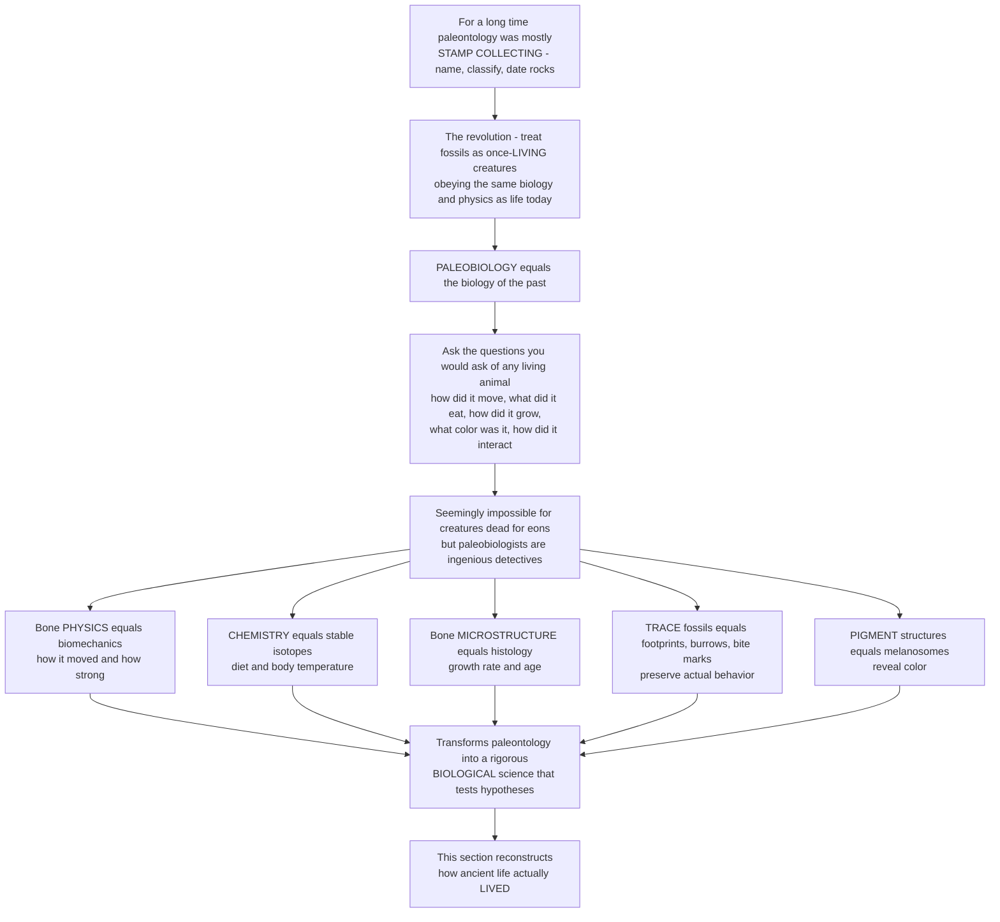

# 🦕 Paleobiology and Ancient Life

> [!abstract] TL;DR
> **Paleobiology** is the revolution that turned paleontology from *"stamp collecting"* — naming, classifying, and dating fossils — into a genuine, rigorous **biological science** by treating extinct organisms not as dead specimens in a cabinet but as once-**living** creatures that grew, moved, ate, competed, reproduced, and interacted, obeying the *same laws of biology and physics as life today*. Instead of only asking "what is this and how old is it?", paleobiology asks the questions you would ask about any living animal: **How did it move, and how fast? What did it eat? How did it grow, and how long did it live? Was it warm-blooded? What color was it? How did it fit into its ecosystem?** These seem unanswerable for creatures dead for millions of years, but paleobiologists are ingenious detectives, drawing evidence from every clue a fossil offers — the **physics of its bones** (biomechanics), the **chemistry locked in its tissues** (stable isotopes for diet and temperature), the **microscopic structure of its bone** (growth rings for growth rate and age), **trace fossils** recording actual behavior (footprints, burrows, bite marks), and even preserved **pigment structures** revealing color. This section is that science: the art *and* rigor of reconstructing not merely what ancient organisms looked like, but how they actually **lived**.

---

## Intuition

**Analogy first — from a cabinet of curiosities to a living zoo.** For most of its history, paleontology behaved like a Victorian collector's cabinet: rows of labelled drawers, each fossil a specimen to be *named*, slotted into a classification, and used to *date the rock it came from*. The physicist Ernest Rutherford's jab that "all science is either physics or stamp collecting" stung precisely because so much of paleontology really did look like stamp collecting — beautiful, careful cataloguing that never asked what the stamps were *for*. Then came a change of imagination as radical as walking out of that dusty museum and into a living zoo. The question flipped from *"what is this dead thing and how old?"* to *"what was this creature like when it was alive?"* — because an extinct animal was never a fossil. It was an animal: it grew from an egg or a birth, it got hungry and hunted or grazed, it ran or swam or burrowed, it fought and mated and raised young, it sweated or shivered against its climate, and then it died. And crucially, while it lived it obeyed exactly the same biology and physics that govern a living lizard, elephant, or bird — the same bone mechanics, the same chemistry of eating and breathing, the same rules of growth and heat.

That single shift of imagination is **paleobiology: the biology of the past**. It seems impossible — how could you ever know how fast a *Tyrannosaurus* ran, what a mammoth ate, whether a dinosaur was warm-blooded, or what color a feathered dinosaur was, when the animal has been dead for tens of millions of years? The answer is that paleobiologists work like forensic detectives at a crime scene millions of years cold, and a fossil is a far richer witness than it looks. The **shape of a bone** is a frozen free-body diagram of the forces it bore — read it and you read locomotion. The **chemistry sealed inside teeth and bone** records what the animal ate and how warm its body was. The **microscopic layering of bone** lays down annual rings, like a tree, that reveal how fast it grew and how old it was when it died. **Footprints and bite marks** are behavior fossilized in the act. Even **microscopic pigment sacs** in exceptionally preserved feathers still carry the animal's color. Assemble these independent clues and a dead specimen becomes a living animal again. That detective work — turning "just-so stories" into *testable hypotheses* — is what makes paleobiology a real science, one rigorous enough to feed back into evolutionary theory itself.

---

## How It Works

Paleobiology does not have a single method; it has a **detective's toolkit**, and its power comes from making *independent* lines of evidence converge on one biological answer. The logic runs the same way every time: pick a question you would ask of a living animal, find every physical trace a fossil preserves that constrains the answer, and cross-check the clues against each other and against living relatives.

1. **Start from a biological question, not a specimen.** How did it move? What did it eat? How fast did it grow? Was it endothermic? What color, what behavior, what ecological role? Each is a hypothesis about a *once-living* organism.
2. **Functional morphology and biomechanics.** Form follows function, and a bone's geometry is a record of the loads it carried — lever arms encode force-versus-speed trade-offs, cross-sections resist bending in the direction of habitual stress, joints record range of motion. Engineering analysis (beam theory, finite-element models, moment arms) turns shape into estimates of bite force, running speed, and posture.
3. **Bone histology (paleohistology).** Thin-section a fossil bone and it reveals microscopic **growth rings** — *Lines of Arrested Growth* (LAGs), laid down annually like tree rings — plus the tissue *type* (fast-growing, richly vascularized fibrolamellar bone versus slow lamellar-zonal bone). This yields **growth rate, age at death, age at maturity**, and clues to **metabolism**.
4. **Stable isotopes and geochemistry.** Carbon isotopes (δ¹³C) fingerprint **diet** and plant type; oxygen isotopes (δ¹⁸O) record **body temperature and drinking water**; nitrogen isotopes track **trophic level**. The chemistry of the tissue is a chemical diary of the animal's life.
5. **The Extant Phylogenetic Bracket (EPB).** Constrain inferences about unpreservable features by the animal's *nearest living relatives*: a trait present in both bracketing groups (for dinosaurs, crocodiles and birds) is confidently inferred in the fossil between them.
6. **Trace fossils, taphonomy, and exceptional preservation.** Footprints, burrows, and bite marks record **behavior** directly; sites of exceptional preservation (Lagerstätten) preserve **soft tissue, molecules, and melanosomes** — the pigment organelles whose shape encodes **color**.
7. **Imaging, modeling, and statistics.** CT and synchrotron scanning reveal internal structure (brain endocasts, air sacs, inner ears) non-destructively; biomechanical simulation tests whether a reconstructed behavior is *mechanically possible*; and quantitative, statistical analysis converts scattered clues into hypothesis tests with honest uncertainty.



---

## Key Concepts

### 🟢 Secondary

- **A fossil was once a living animal.** The single most important idea: the creature in the rock ran, ate, grew, and interacted just like animals today — and it followed the same rules of biology and physics. Paleobiology asks what it was *like when alive*, not just what to call it.
- **Bones can be read like tree rings.** Cut a fossil bone very thin and look under a microscope: many animals laid down a ring each year. Count the rings and you learn **how old** the animal was; measure the spacing and you learn **how fast it grew** — including whether it grew fast (like a bird or mammal) or slowly (like a lizard).
- **Chemistry remembers the meal.** Atoms from food and water get built into teeth and bone and stay there. By measuring different "flavors" (isotopes) of carbon and oxygen, scientists can tell **what an animal ate** and roughly **how warm its body was**.
- **Footprints are frozen behavior.** A trackway does not just show a foot — it shows an animal *walking or running*, how fast, alone or in a herd. Trace fossils record what an animal actually *did*.
- **We can even recover color.** In beautifully preserved feathers, microscopic pigment sacs still survive; their shape tells us whether a feather was black, grey, or reddish — so we now know the real colors of some dinosaurs.

### 🟡 Undergraduate

- **The paleobiology revolution.** From the mid-20th century (G. G. Simpson) and especially the 1970s, a generation of thinkers — **Gould, Sepkoski, Raup, Valentine, Stanley** — pushed paleontology from a *descriptive* branch of geology and systematics toward **paleobiology**: the study of the *biology* of ancient organisms and the application of biological and quantitative theory to the fossil record. Fossils became evidence of living, functioning, evolving organisms and ecosystems.
- **The questions paleobiology asks.** How extinct organisms *functioned and lived*: **locomotion and biomechanics**, **diet and feeding**, **growth, development, and life history** (ontogeny), **physiology and metabolism** (ectothermy versus endothermy), **reproduction**, **sensory and neural biology** (from brain endocasts), **behavior**, **coloration**, and **ecological roles**.
- **The detective's toolkit.** *Functional morphology* (form-function, engineering analysis of bones and teeth), *bone histology* (LAGs and tissue type for growth and age), *stable isotopes* (δ¹³C diet, δ¹⁸O temperature, δ¹⁵N trophic level), the *Extant Phylogenetic Bracket* (constraint by living relatives), *trace fossils and taphonomy*, *exceptional preservation* (soft tissue, molecules, melanosomes), and *CT/synchrotron imaging plus biomechanical modeling*.
- **Multiple proxies must converge.** No single clue is decisive; a robust reconstruction is built where *independent* lines of evidence agree. Was a dinosaur warm-blooded? Bone histology (fast fibrolamellar bone), growth rates, oxygen-isotope thermometry, and activity levels all point toward the answer — and where they *bracket* an intermediate value, the honest conclusion is an intermediate ("mesothermic") metabolism.
- **Subdisciplines.** Paleoecology, paleophysiology, paleoneurology, **ichnology** (trace fossils), **taphonomy**, micropaleontology, paleobotany, and vertebrate/invertebrate paleobiology — all feeding into and drawing from evolutionary biology and ecology.

### 🔴 Graduate

- **Nomothetic ambition.** Gould's 1980 manifesto framed paleobiology as a **nomothetic, evolutionary discipline** — one that seeks general *laws* and tests hypotheses, not merely narrates particulars. This is the epistemic core of the revolution: converting untestable "just-so stories" about the past into falsifiable, quantitative claims, and thereby letting the fossil record *contribute to* evolutionary theory (tempo and mode, macroevolution, diversity dynamics) rather than merely illustrate it.
- **Paleohistology, rigorously.** Skeletochronology counts LAGs and cyclical growth marks to reconstruct **growth curves** (typically sigmoidal — logistic or von Bertalanffy), from which one extracts asymptotic size, age at inflection (maximum growth rate), age at sexual/skeletal maturity, and maximum lifespan. Erickson et al. (2004) fit logistic growth curves across a *Tyrannosaurus* ontogenetic series, showing an adolescent growth spurt of roughly two kilograms per day — evidence bearing directly on avian-like, elevated metabolism. Bone-tissue *type* (fibrolamellar versus lamellar-zonal) independently indexes growth rate and metabolism.
- **The endothermy problem as a multi-proxy inference.** Dinosaur metabolism is the archetypal paleobiological question because *no single proxy settles it*. Histology, growth rate, oxygen-isotope-derived body temperature, predator-prey biomass ratios, nasal respiratory turbinates, posture/activity, and (recently) lipoxidation signatures in bone each constrain the ecto–endo axis with its own error, and their *precision-weighted convergence* is the actual answer — often an intermediate metabolism, not a binary.
- **Extant Phylogenetic Bracket formalism.** Witmer's EPB ranks soft-tissue and behavioral inferences by phylogenetic support (Level I: present in both bracketing taxa; Level II: one; III: neither), turning "compare to living relatives" into a graded, testable argument and disciplining which reconstructions are defensible.
- **Integration with macroevolution and ecology.** Paleobiological data on growth, metabolism, body size, and ecology feed **quantitative macroevolution** — Sepkoski's diversity curves, origination/extinction rate estimation, and the sampling-standardized analyses (e.g. the Paleobiology Database) that make the fossil record a reproducible, long-term *biological experiment* on the dynamics of life.
- **Case studies as hypothesis tests.** Feathered-dinosaur color from melanosome geometry (*Anchiornis*, *Sinosauropteryx*); *T. rex* bite force and locomotor limits from biomechanical models; the physiological transition in whale origins (*Pakicetus* → *Ambulocetus* → *Basilosaurus*) read from bone and isotopes — each a paleobiological reconstruction framed and evaluated as science.

---

## Python Demo

```python
# PALEOBIOLOGY -- reconstructing how ancient life LIVED, two ways:
#   (A) GROWTH & LIFE HISTORY FROM BONE. Fossil bone lays down annual rings
#       (Lines of Arrested Growth, LAGs), like a tree. Back-calculated body
#       mass at each ring gives a growth series; fitting a LOGISTIC (sigmoidal)
#       growth curve -- as Erickson et al. (2004) did for Tyrannosaurus --
#       recovers asymptotic mass, the adolescent growth SPURT (max growth rate),
#       age at maturity, and maximum lifespan.
#   (B) MULTI-PROXY METABOLIC INFERENCE. No single clue proves a dinosaur was
#       warm-blooded. Several INDEPENDENT proxies (histology, isotopes, growth,
#       energetics, activity) each estimate a point on the ectotherm(0)->
#       endotherm(1) axis with its own error; their precision-weighted product
#       CONVERGES on a bracketed answer -- here an intermediate "mesotherm".
# Pure numpy + matplotlib, fully runnable.

import numpy as np
import matplotlib.pyplot as plt

rng = np.random.default_rng(42)

# ======================================================================
# (A) GROWTH CURVE FROM BONE-RING (LAG) DATA
# ======================================================================
# Logistic growth:  M(t) = a / (1 + exp(-k*(t - t_i)))
#   a   = asymptotic (adult) body mass
#   t_i = age of the inflection point = age of MAXIMUM growth rate
#   k   = growth-rate constant; max growth rate = a*k/4 (at t_i)
def logistic(t, a, k, t_i):
    return a / (1.0 + np.exp(-k * (t - t_i)))

# "True" underlying biology of our fossil taxon (Tyrannosaurus-scale)
true_a, true_k, true_ti = 5650.0, 0.55, 16.5      # kg, 1/yr, yr

# A growth SERIES: many individuals of different ages, each contributing a
# mass-at-age point from counting & back-calculating its bone rings (LAGs).
ages = rng.integers(2, 29, size=42).astype(float)         # LAG counts (years)
mass_true = logistic(ages, true_a, true_k, true_ti)
mass_obs = mass_true * (1.0 + rng.normal(0.0, 0.12, ages.size))  # biological noise
mass_obs = np.clip(mass_obs, 1.0, None)

# Fit the logistic by a transparent grid search (pure numpy, no scipy).
a_grid  = np.linspace(4500, 7000, 26)
k_grid  = np.linspace(0.35, 0.85, 26)
ti_grid = np.linspace(12.0, 20.0, 26)
best_sse, best = np.inf, None
for a in a_grid:
    for k in k_grid:
        for ti in ti_grid:
            sse = np.sum((logistic(ages, a, k, ti) - mass_obs) ** 2)
            if sse < best_sse:
                best_sse, best = sse, (a, k, ti)
a_fit, k_fit, ti_fit = best

# Derived LIFE-HISTORY parameters -- the biology recovered from bone:
max_growth_kg_yr = a_fit * k_fit / 4.0
max_growth_kg_day = max_growth_kg_yr / 365.0
age_maturity = ti_fit + np.log(1/0.9 - 1) / (-k_fit)   # age at 90% of adult mass
max_age = ages.max()

print("(A) GROWTH & LIFE HISTORY FROM BONE RINGS")
print(f"    asymptotic adult mass   ~ {a_fit:,.0f} kg")
print(f"    max growth rate (age {ti_fit:.1f} yr) ~ {max_growth_kg_yr:,.0f} kg/yr"
      f"  = {max_growth_kg_day:.1f} kg/day  (the adolescent spurt)")
print(f"    age at maturity (~90% mass) ~ {age_maturity:.1f} yr")
print(f"    oldest individual sampled   = {max_age:.0f} yr\n")

# ======================================================================
# (B) MULTI-PROXY METABOLIC INFERENCE (ectotherm 0  ->  endotherm 1)
# ======================================================================
# Each independent proxy = (label, estimate, uncertainty) on the 0..1 axis.
proxies = [
    ("Bone histology (fibrolamellar)", 0.75, 0.12),
    ("Oxygen-isotope thermometry",     0.60, 0.15),
    ("Growth rate (from panel A)",     0.70, 0.13),
    ("Predator-prey energetics",       0.55, 0.18),
    ("Cursorial limbs & activity",     0.66, 0.15),
]
mu  = np.array([p[1] for p in proxies])
sd  = np.array([p[2] for p in proxies])
prec = 1.0 / sd**2
mu_c = np.sum(mu * prec) / np.sum(prec)      # precision-weighted combined mean
sd_c = np.sqrt(1.0 / np.sum(prec))           # combined uncertainty (tighter)

print("(B) MULTI-PROXY METABOLIC INFERENCE")
print(f"    combined estimate on ecto(0)->endo(1) axis = {mu_c:.2f} +/- {sd_c:.2f}")
verdict = ("ENDOTHERM-leaning MESOTHERM" if 0.4 < mu_c < 0.8
           else "ENDOTHERM" if mu_c >= 0.8 else "ECTOTHERM")
print(f"    proxies converge on: {verdict} (intermediate, not binary)")

# ======================================================================
# Plot
# ======================================================================
fig, (axA, axB) = plt.subplots(1, 2, figsize=(13.5, 5.6))

# --- (A) growth curve from LAGs ---
tt = np.linspace(0, 30, 300)
axA.scatter(ages, mass_obs, s=32, color="#1e3a8a", alpha=0.75,
            edgecolor="k", linewidth=0.3, label="mass-at-age from bone rings (LAGs)")
axA.plot(tt, logistic(tt, a_fit, k_fit, ti_fit), color="#dc2626", lw=2.6,
         label="fitted logistic growth curve")
axA.axhline(a_fit, color="#94a3b8", ls=":", lw=1.2)
axA.text(0.5, a_fit * 1.01, f"asymptotic mass ~ {a_fit:,.0f} kg",
         fontsize=8, color="#475569")
axA.plot(ti_fit, logistic(ti_fit, a_fit, k_fit, ti_fit), "*",
         color="#f59e0b", markersize=20, zorder=5,
         label=f"max growth spurt (~{max_growth_kg_day:.1f} kg/day)")
axA.axvline(age_maturity, color="#16a34a", ls="--", lw=1.2)
axA.text(age_maturity + 0.3, 400, f"maturity\n~{age_maturity:.0f} yr",
         fontsize=8, color="#16a34a")
axA.set_title("(A) Growth & life history read from bone rings",
              weight="bold", fontsize=11)
axA.set_xlabel("Age (years, counted from bone LAGs)")
axA.set_ylabel("Body mass (kg)")
axA.legend(fontsize=8, loc="upper left")
axA.grid(alpha=0.25)

# --- (B) multi-proxy convergence ---
ys = np.arange(len(proxies))[::-1] + 2.0
axB.axvline(0.0, color="#2563eb", ls="--", lw=1.4)
axB.axvline(1.0, color="#dc2626", ls="--", lw=1.4)
axB.text(0.0, len(proxies) + 2.4, "ECTOTHERM", ha="center", fontsize=9,
         color="#2563eb", weight="bold")
axB.text(1.0, len(proxies) + 2.4, "ENDOTHERM", ha="center", fontsize=9,
         color="#dc2626", weight="bold")
for (name, m, s), y in zip(proxies, ys):
    axB.errorbar(m, y, xerr=s, fmt="o", color="#0f766e", ecolor="#0f766e",
                 elinewidth=2, capsize=4, markersize=7)
axB.set_yticks(ys)
axB.set_yticklabels([p[0] for p in proxies], fontsize=8)

# combined posterior as a shaded curve along the bottom
xg = np.linspace(0, 1, 400)
post = np.exp(-0.5 * ((xg - mu_c) / sd_c) ** 2)
post = post / post.max()
axB.fill_between(xg, 0.2, 0.2 + 1.2 * post, color="#7c3aed", alpha=0.30)
axB.plot(xg, 0.2 + 1.2 * post, color="#7c3aed", lw=2.0)
axB.axvline(mu_c, color="#7c3aed", lw=1.6, ls="-")
axB.text(mu_c, 1.55, f"combined\n{mu_c:.2f} +/- {sd_c:.2f}",
         ha="center", fontsize=8, color="#7c3aed", weight="bold")
axB.set_xlim(-0.08, 1.08)
axB.set_ylim(0, len(proxies) + 3.0)
axB.set_title("(B) Metabolism: independent proxies converge",
              weight="bold", fontsize=11)
axB.set_xlabel("Metabolic strategy: ectotherm 0  ->  endotherm 1")
axB.grid(axis="x", alpha=0.25)

plt.tight_layout()
plt.savefig("paleobiology_ancient_life.png", dpi=120)
plt.show()

# Takeaways:
# (A) A dead bone, thin-sectioned and its annual rings counted, reconstructs a
#     LIVING life history: how fast it grew, when it matured, how long it lived.
# (B) No proxy alone proves warm-bloodedness; their precision-weighted
#     CONVERGENCE does -- and it can land honestly on an INTERMEDIATE answer.
```

Panel A is paleobiology in miniature: a set of dead bones, thin-sectioned so their **annual growth rings** can be counted, reconstructs a *living* life history — the fitted logistic curve recovers adult mass, the age of the **adolescent growth spurt** (Erickson's roughly two-kilograms-per-day *T. rex* result), the age at maturity, and maximum lifespan — biology that no one ever observed, extracted from stone. Panel B captures the discipline's epistemic signature: the warm-blooded question is *not* answered by any single clue, but by the **precision-weighted convergence** of independent proxies, which here brackets an *intermediate* ("mesothermic") metabolism rather than forcing a false binary.

---

## Real-World Applications

- **Dinosaur growth and the endothermy debate.** Logistic growth curves from bone histology (Erickson et al.) revealed bird-like, rapid dinosaur growth; combined with oxygen isotopes, bone-tissue type, and energetics, they reframed dinosaurs as **elevated-metabolism, often mesothermic** animals — one of paleobiology's signature results.
- **Feathered-dinosaur color.** Fossil **melanosome** shape (eumelanin rods = black/grey, phaeomelanin spheres = reddish) reconstructed the plumage of *Anchiornis* (black-and-white with a rufous crest) and the countershaded, banded tail of *Sinosauropteryx* — moving life restoration from art toward measurement.
- **Bite force and locomotion of predators.** Finite-element models and multibody dynamics estimate *Tyrannosaurus* bite forces in the tens of thousands of newtons and cap its running speed well below cartoon portrayals — mechanical limits derived directly from reconstructed anatomy.
- **The origin of whales.** Bone morphology and stable isotopes trace the land-to-sea physiological transition across *Pakicetus*, *Ambulocetus*, and *Basilosaurus* — diet, habitat salinity, and locomotion read from teeth, ear bones, and limb reduction.
- **Ancient diet and paleotemperature.** δ¹³C and δ¹⁵N from bone collagen reconstruct the diets of extinct mammals (mammoth grazing, Neanderthal trophic level), while δ¹⁸O from carbonates and phosphates yields body and environmental **temperatures** through deep time.
- **A long-term biological experiment.** Aggregated paleobiological data on body size, growth, metabolism, and ecology — standardized through resources like the Paleobiology Database — turn the fossil record into a reproducible test-bed for hypotheses about diversification, extinction selectivity, and macroevolutionary rates.

---

## Common Pitfalls

- **Reverting to stamp collecting.** Cataloguing and dating are necessary but not the goal; the paleobiological point is to reconstruct *function and life*, and to state each reconstruction as a **testable hypothesis**, not a decorative story.
- **Trusting a single proxy.** Any lone line of evidence (one isotope value, one histological slide) can mislead; robust paleobiology demands that *independent* proxies **converge**, and reports honest uncertainty — sometimes the answer is genuinely intermediate.
- **Miscounting or over-reading bone rings.** LAGs can be resorbed as bone remodels, double-banded, or absent in some tissues; naive ring counts underestimate age unless **retrocalculation** and cross-sections at the right skeletal site are used.
- **Ignoring the speculation gradient.** Bone geometry is near-certain, growth and gait well-constrained, physiology reasonably inferred, color occasionally evidenced, and detailed behavior largely narrative — mistaking the deepest, most inferential layers for fact is the classic over-reach.
- **Extrapolating living-animal laws past their range.** Metabolic-scaling and mass-estimation regressions fitted on modern animals grow wildly uncertain when pushed to multi-tonne dinosaurs; always carry **prediction intervals** and phylogenetic correction.
- **Anachronism and the uniformitarian trap.** Assuming an extinct animal behaved exactly like a modern analogue (or that ancient climates and atmospheres matched today's) smuggles unproven premises into the reconstruction — use the Extant Phylogenetic Bracket to make the assumption explicit and rankable.

---

## Related Concepts

This note is the **opener of Section 05 (Paleobiology and Reconstructing Life)** and frames the siblings that follow, referenced here in prose so they wire once written: the vault hub *Paleontology and Deep Time Overview*; *Reading Fossils: Morphology and Reconstruction* (the reconstruction craft this section deepens into biology); *Paleoecology and Ancient Environments* (reconstructing whole ecosystems and species interactions); *Functional Morphology and Biomechanics of Fossils* (the form-function engineering behind locomotion and feeding); *Trace Fossils and Ancient Behavior* (footprints, burrows, and bite marks as fossilized behavior); and *Molecular Paleontology and Exceptional Preservation* (soft tissue, melanosomes for color, and ancient biomolecules).

Verified cross-vault and cross-section links to existing notes:

- [[The_History_of_Life_on_Earth]] — the deep-time narrative whose cast of extinct organisms paleobiology brings back to life as functioning animals and plants
- [[Evidence_for_Evolution]] — fossils as evidence; paleobiology extends that evidence from *anatomy* to *function, growth, and physiology*
- [[Macroevolution_and_Deep_Time_Patterns]] — the within-vault companion; paleobiological data on growth, size, and metabolism feed quantitative macroevolution (tempo, mode, diversity dynamics)
- [[Speciation_and_Macroevolution]] — the biology-vault treatment of evolution above the species level that paleobiology's fossil data test and inform
- [[Life_History_Strategies_and_Demography]] — growth rate, age at maturity, and lifespan (the *r/K* and demographic traits) are exactly what bone histology reconstructs for extinct species
- [[Population_Ecology]] — survivorship curves and age structure, here recovered for fossil populations from age-at-death distributions in bone
- [[The_Musculoskeletal_System]] — the living bone-muscle system whose growth marks, scars, and mechanics a fossil preserves and paleobiology decodes
- [[Bioenergetics_and_ATP]] — the cellular energetics underlying the ectotherm-versus-endotherm metabolism that paleophysiology infers from proxies
- [[Community_Ecology]] — the modern theory of species interactions that paleoecology reconstructs for vanished communities

---

## Review Questions

1. **(Secondary)** Explain, in the "stamp collecting versus living zoo" sense, how paleobiology differs from just naming and dating fossils. Then describe two clues a single fossil bone can give about how the animal *lived*.
2. **(Undergraduate)** A fossil bone is thin-sectioned and shows richly vascularized fibrolamellar tissue with widely spaced growth rings that crowd together near the outer surface. What does each feature tell you about the animal's **growth rate, age, maturity, and likely metabolism** — and why is *one* slide not enough to conclude "warm-blooded"?
3. **(Undergraduate)** You want to know what an extinct herbivore ate and how warm its body was. Which stable isotopes would you measure, in which tissues, and what confounds could distort each signal?
4. **(Graduate)** Dinosaur endothermy is called a "multi-proxy" problem. Choose four independent proxies, describe what each measures and its main source of error, and explain how you would formally *combine* them (and interpret a convergent intermediate result) rather than treat any one as decisive.
5. **(Graduate)** Gould called for paleobiology to be a *nomothetic* discipline. Explain what that means, why it distinguishes paleobiology from "just-so stories," and give one example where the fossil record contributed a general principle back to evolutionary theory.

---

## Sources

- Benton, M. J. & Harper, D. A. T. (2020). *Introduction to Paleobiology and the Fossil Record*, 2nd ed. Wiley-Blackwell.
- Gould, S. J. (1980). "The promise of paleobiology as a nomothetic, evolutionary discipline." *Paleobiology*, 6(1), 96–118.
- Padian, K. & Lamm, E.-T. (eds.) (2013). *Bone Histology of Fossil Tetrapods: Advancing Methods, Analysis, and Interpretation*. University of California Press.
- Erickson, G. M., Makovicky, P. J., Currie, P. J., Norell, M. A., Yerby, S. A., & Brochu, C. A. (2004). "Gigantism and comparative life-history parameters of tyrannosaurid dinosaurs." *Nature*, 430, 772–775.
- Witmer, L. M. (1995). "The Extant Phylogenetic Bracket and the importance of reconstructing soft tissues in fossils." In *Functional Morphology in Vertebrate Paleontology* (Cambridge University Press), 19–33.

---

#paleontology #paleobiology #bone-histology #ancient-life #reconstruction
