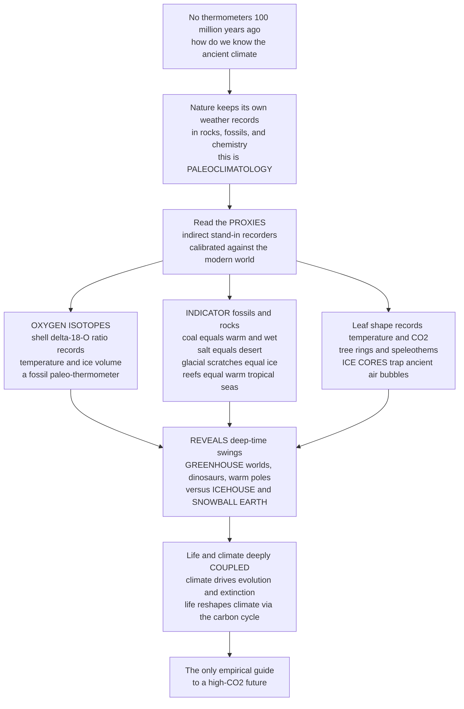

# 🌡️ Paleoclimatology and Deep-Time Climate

> [!abstract] TL;DR
> There were no thermometers 100 million years ago — so how do we *know* that dinosaurs basked in an ice-free **hothouse** with warm poles, or that Earth once froze nearly to the equator? Because **nature keeps its own weather records**, written into rocks, fossils, and chemistry, and **paleoclimatology** is the science of reading them. The archives are called **proxies** — indirect stand-ins for the instruments we never had. The most powerful is a chemical trick: seawater carries two "flavors" of oxygen (a light ¹⁶O and a heavy ¹⁸O), and the ratio (**δ¹⁸O**) locked into a fossil shell depends on the **temperature and ice volume** when the animal lived — so a fossil shell is a **paleo-thermometer**. Other proxies abound: **indicator fossils** (coal means warm and wet, salt means desert, glacial scratches mean ice, reefs mean warm tropical seas), the **shape and size of fossil leaves** (temperature and CO₂), tree rings, cave formations, and — for the recent past — **ice cores** that trap actual ancient air. Piecing them together reveals that Earth's climate has swung between scorching **greenhouse** worlds and frigid **icehouse** and even **Snowball Earth** states over deep time. The lesson at the heart of paleontology: climate and life are profoundly **coupled** — climate shifts drove evolution, migration, and extinction, while life itself (through the carbon cycle) repeatedly reshaped climate. And this record is priceless today, because past high-CO₂ greenhouses and rapid warming events like the **PETM** are the *only* empirical guides to how the Earth system behaves under the kind of carbon forcing we are now imposing.

---

## Intuition

**Analogy — reading Earth's ancient weather diary.** Suppose a detective must reconstruct the weather at a crime scene from a century ago, long before any weather station existed. There are no readings to look up — but the world recorded the weather anyway, in things a careful eye can still read: tree rings that grew fat in wet years and thin in droughts, a layer of frost damage in old timbers, salt crusts left by an evaporated pond, sand dunes frozen mid-march by a buried soil. The detective never *measured* the temperature; the environment *wrote it down* in materials, and the detective learned to translate.

Paleoclimatology is exactly this detective work, scaled to hundreds of millions of years. Earth never stopped keeping records — it just wrote them in rock and bone and molecule instead of ink. A coal seam is a note that says "here it was warm and swampy." A bed of rock salt says "here it was a baking desert." Scratches gouged into bedrock say "a glacier ground over this." And the single most eloquent entry is chemical: the ocean is full of two kinds of oxygen atom, a light one and a heavy one, and evaporation and freezing sort them by weight. Every tiny sea creature that builds a calcium-carbonate shell captures that ratio, so its fossil is a **thermometer that was filled out at the moment of death**. Learn to read these entries — proxies, we call them — and the diary opens: entire chapters of hothouse worlds where crocodile relatives basked near the poles, and terrifying chapters where the ice may have reached the tropics. Best of all, the diary is not just history. Because it contains past worlds with as much CO₂ in the air as we are now releasing, it is also the closest thing we have to a **field manual for the future** — the only place the experiment we are running today has ever actually been run before.

---

## How It Works

### Core Mechanics

1. **The problem — climate before instruments.** Direct measurements (thermometers, rain gauges, satellites) cover barely 150 years. To know climate across the ~540-million-year **Phanerozoic**, let alone the deeper Precambrian, we must reconstruct it *indirectly* from what the Earth preserved. Paleoclimatology is the discipline of turning geological and biological archives into quantitative climate.
2. **Proxies — indirect recorders.** A **proxy** is any measurable feature whose value depended on a past climate variable, so that reading the feature recovers the variable. Good proxies are (a) **sensitive** to one climate variable, (b) **calibrated** against modern observations (a *transfer function* linking the proxy to, say, temperature), and (c) **preservable** and datable. No proxy is perfect; each carries its own biases and uncertainties, so robust reconstructions **combine many** independent proxies.
3. **The paleo-thermometer — stable oxygen isotopes (δ¹⁸O).** Seawater contains light ¹⁶O and heavy ¹⁸O. Two effects sort them: **temperature-dependent fractionation** (carbonate precipitated in colder water incorporates relatively more ¹⁸O) and **ice volume** (evaporation preferentially removes light ¹⁶O, and when that water is locked into ice sheets the ocean becomes ¹⁸O-enriched). The δ¹⁸O of a fossil shell (foraminifera, mollusks) or tooth thus records a **mix of temperature and global ice volume** — the foundational proxy of deep-time climate. **Clumped isotopes** (¹³C–¹⁸O bonds, Δ₄₇) go further, giving temperature *independent* of seawater composition.
4. **Lithological indicators — climate written in rock type.** Certain sediments only form under specific climates: **coals and bauxites** = warm and wet; **evaporites** (rock salt, gypsum) = hot and arid; **tillites, dropstones, and striated pavements** = glaciers and ice; **thick carbonates and reefs** = warm tropical seas; **red beds** = oxidizing, often seasonally dry continents. Mapping these onto **paleogeography** reconstructs ancient climate belts.
5. **Paleontological and botanical proxies.** Climate-sensitive taxa (corals, mangroves, certain plankton) mark climate zones. Plant **physiognomy** is especially powerful: **leaf-margin analysis** (the fraction of species with smooth versus toothed leaf edges tracks mean annual temperature) and **stomatal index** (leaf-pore density falls as atmospheric CO₂ rises) turn fossil leaves into thermometers and CO₂ meters. **Palynology** (pollen and spores) reconstructs vegetation and hence climate.
6. **High-resolution recent archives.** For the last thousands to millions of years, **tree rings** (dendroclimatology), **speleothems** (cave stalagmites), and above all **ice cores** — which trap *actual samples of ancient atmosphere* in bubbles — give near-direct records of temperature and greenhouse-gas concentration. Ocean and lake **sediment cores** extend continuous records far deeper.
7. **The deep-time picture — greenhouse versus icehouse.** Assembled, the proxies show Earth oscillating between two states: **greenhouse** worlds (warm, ice-free poles, high CO₂ — much of the Mesozoic and early Cenozoic) and **icehouse** worlds (polar ice caps, glacial–interglacial cycles — the late Paleozoic ice age and the present Cenozoic icehouse). At the extremes lie **Snowball Earth** (Neoproterozoic global glaciations) and brief **hyperthermals** like the **Paleocene–Eocene Thermal Maximum (PETM)**.
8. **Drivers and the two-way coupling.** Over deep time, climate is set by **plate tectonics and paleogeography**, the **long-term carbon cycle** (volcanic CO₂ input balanced against silicate-weathering drawdown), **solar evolution**, and — for the Quaternary ice ages — **Milankovitch orbital cycles**. Crucially the biosphere is not a passive passenger: **life shapes climate** (the Great Oxidation, land-plant CO₂ drawdown that helped trigger the Carboniferous icehouse, the ocean's biological carbon pump), while **climate shapes life** (driving evolution, migration, and extinction). Climate and the biosphere **co-evolve**.

### Flow / Architecture



---

## Key Concepts

### 🟢 Secondary

- **We read climate, we do not measure it.** Nobody recorded the weather of the dinosaur age, so scientists reconstruct it from clues the Earth left behind — called **proxies**. Learning to translate those clues is what paleoclimatology *is*.
- **Fossil shells are thermometers.** Ocean water contains a light and a heavy kind of oxygen. Cold water and big ice sheets change the balance, and tiny sea creatures lock that balance into their shells. Measuring it in a fossil (**δ¹⁸O**) tells us how warm the sea was.
- **Rocks and fossils flag the climate.** **Coal** means a warm, wet swamp; **rock salt** means a hot desert; **scratched bedrock and glacial debris** mean ice; **coral reefs** mean warm tropical seas. Even the *shape of fossil leaves* records temperature and carbon dioxide.
- **Ice cores hold ancient air.** In Antarctic and Greenland ice, bubbles trap real samples of the atmosphere from up to ~800,000 years ago — so we can literally measure the CO₂ and temperature of the past (see the Meteorology note on ice cores).
- **Earth swings between hothouse and icehouse.** Sometimes Earth had *no* polar ice and warm poles (a **greenhouse** world, like the dinosaurs'); sometimes it had big ice caps (an **icehouse** world, like today); and at least twice it may have frozen almost to the equator — **Snowball Earth**.
- **Climate and life go together.** When the climate changed, living things had to move, adapt, or die out — so climate shaped the whole history of life.

### 🟡 Undergraduate

- **The oxygen-isotope paleothermometer, quantitatively.** δ¹⁸O (in per-mil, ‰, relative to a standard) of biogenic carbonate reflects both water temperature and the δ¹⁸O of the seawater it grew in. A classic **paleotemperature equation** (Epstein/Shackleton form) is `T ≈ 16.5 − 4.3·(δc − δw) + 0.14·(δc − δw)²`, where δc is the carbonate value and δw the seawater value. Because δw itself rises when continental ice grows, a benthic δ¹⁸O record is a *combined* temperature-and-ice-volume signal — the central ambiguity of the proxy.
- **The proxy toolbox and calibration.** Each proxy is a **transfer function** calibrated on modern data: **Mg/Ca** ratios in foraminifera (temperature, helps separate ice-volume from δ¹⁸O), **clumped isotopes (Δ₄₇)** for temperature independent of δw, **leaf-margin analysis** and **CLAMP** for terrestrial temperature, **stomatal index** and **boron isotopes / alkenones** for CO₂, **TEX₈₆** (archaeal lipids) for sea-surface temperature. **δ¹³C** tracks the carbon cycle and marks perturbations (excursions).
- **Lithological climate belts + paleogeography.** Because continents drift, indicator lithologies must be plotted on **reconstructed paleogeography**. Coals and evaporites, plotted at their ancient latitudes, reproduce the modern pattern (wet equator and mid-latitudes, arid subtropics) — validating both the proxies and the plate reconstructions.
- **Greenhouse–icehouse alternation of the Phanerozoic.** The last ~540 Myr shows long **greenhouse** intervals (early Paleozoic, most of the Mesozoic, early Cenozoic) punctuated by two great **icehouses**: the **late Paleozoic Ice Age** (Carboniferous–Permian, Gondwanan glaciation) and the ongoing **Cenozoic icehouse** (Antarctic ice from ~34 Ma, Northern Hemisphere ice from ~3 Ma). CO₂ broadly tracks these states.
- **Hyperthermals and the PETM.** ~56 Ma, a massive, geologically rapid carbon release drove ~5–8 °C of global warming in a few thousand years — the **Paleocene–Eocene Thermal Maximum**, marked by a sharp negative **δ¹³C excursion**, deep-sea **carbonate dissolution** (ocean acidification), and major biotic turnover. It is the closest natural analog to a rapid anthropogenic carbon injection.
- **Milankovitch pacing of the ice ages.** Quaternary glacial–interglacial cycles are paced by orbital **eccentricity (~100 kyr), obliquity (~41 kyr), and precession (~23 kyr)**, which redistribute insolation and are amplified by ice-albedo and CO₂ feedbacks — recorded in benthic δ¹⁸O and ice-core records.

### 🔴 Graduate

- **Deconvolving temperature from ice volume.** A single δ¹⁸O record cannot separate cooling from ice growth. Modern deep-time work pairs δ¹⁸O with an independent thermometer (**Mg/Ca** or **Δ₄₇**) to solve for both, and uses **seawater δ¹⁸O reconstructions** to correct for changing ice volume and for the secular, tectonically driven evolution of ocean chemistry — a live debate for pre-Cenozoic records.
- **The long-term carbon cycle as the master dial.** On multi-million-year scales, climate is governed by the balance between **volcanic/metamorphic CO₂ outgassing** and CO₂ **drawdown by silicate weathering** (the **Urey/BLAG–GEOCARB** framework), modulated by **paleogeography** (continent position, mountain uplift, weatherability), **organic-carbon burial**, and the **evolution of the biosphere** (land plants, plankton). Silicate weathering acts as a **thermostat** (a negative feedback) because weathering rates rise with temperature and CO₂.
- **Snowball Earth and the runaway ice-albedo feedback.** The Neoproterozoic (Cryogenian) **Sturtian and Marinoan** glaciations may have produced near-global ice, a consequence of the strongly nonlinear **ice-albedo feedback** crossing a bifurcation. Escape requires slow build-up of volcanic CO₂ under an ice lid until a super-greenhouse melts it — testable via cap-carbonate δ¹³C signatures and the coincidence with early animal evolution.
- **Climate as an evolutionary driver — turnover-pulse and beyond.** Vrba's **turnover-pulse hypothesis** posits that climate shifts synchronize speciation and extinction pulses across clades; the framework extends to **range shifts, provinciality, body-size trends** (Bergmann's rule in deep time), and hominin evolution tracking East African aridification. Distinguishing genuine climate forcing from sampling and preservation biases in the fossil record is a central methodological challenge.
- **Life as a climate driver — feedbacks and coevolution.** The biosphere repeatedly reset climate: the **Great Oxidation** collapsed a methane greenhouse; the **Devonian–Carboniferous** spread of deep-rooted vascular plants enhanced silicate weathering and organic-carbon burial, drawing down CO₂ into the late Paleozoic icehouse; the marine **biological pump** governs how much carbon the ocean sequesters. Deep-time climate is a **coupled biogeochemical system**, not a physical backdrop.
- **Deep time as the empirical constraint on Earth-system sensitivity.** Because instrumental and model records cannot span the full range of CO₂ and feedback states, **paleoclimate is the primary observational constraint on Earth-system sensitivity** (including slow feedbacks — ice sheets, vegetation, carbon cycle). Warm analogs (Pliocene, Eocene, PETM) test model behavior at high CO₂ and inform tipping-point and committed-warming estimates for the anthropogenic future.

---

## Python Demo

```python
# Paleoclimatology, made visible with two complementary reconstructions:
#
#   (A) OXYGEN-ISOTOPE PALEOTHERMOMETER + CENOZOIC DEEP-TIME CLIMATE CURVE.
#       Build a synthetic benthic foraminifera delta-18-O record for the last
#       65 Myr (Zachos-style: light/warm early, heavy/cold late, with a sharp
#       PETM negative spike at ~56 Ma). Convert delta-18-O to paleotemperature
#       with the classic paleotemperature equation, and shade the greenhouse
#       (ice-free) vs icehouse (ice-bearing) states with key events annotated.
#
#   (B) DEEP-TIME CO2 - CLIMATE COUPLING over the Phanerozoic (~540 Myr):
#       schematic atmospheric CO2 and a temperature anomaly track together,
#       with the two great icehouses (late Paleozoic + Cenozoic) falling at
#       CO2 minima -- the empirical fingerprint that CO2 paces deep-time climate.
#
# Pure numpy + matplotlib, fully runnable.

import numpy as np
import matplotlib.pyplot as plt

# =====================================================================
# (A) delta-18-O  ->  PALEOTEMPERATURE, and the Cenozoic climate curve
# =====================================================================
Ma = np.linspace(65.0, 0.0, 1300)          # Ma before present, old -> young

# --- Synthetic benthic delta-18-O (per mil): rises (heavier) toward present
#     as the world cools and continental ice grows.
d18O = (1.6                                  # baseline
        + 1.9 * (65.0 - Ma) / 65.0           # long-term heavier/cooling trend
        + 0.6 * np.tanh((34.0 - Ma) / 5.0)   # Eocene-Oligocene ice onset step
        + 0.5 * np.tanh((3.0  - Ma) / 1.5))  # Northern Hemisphere glaciation
# PETM: sharp NEGATIVE excursion (warming spike) at ~56 Ma
d18O += -1.1 * np.exp(-0.5 * ((Ma - 56.0) / 0.7) ** 2)

# --- Paleotemperature equation (Epstein / Shackleton form).
#     T = 16.5 - 4.3*(dc - dw) + 0.14*(dc - dw)^2 ,  dw = seawater value.
#     Valid for the ICE-FREE greenhouse world; once big ice sheets exist,
#     delta-18-O also records ice volume, so the derived T is an
#     "ice-free-equivalent" temperature (flagged below).
dw = -1.0                                    # ice-free seawater delta-18-O
dc = d18O
T = 16.5 - 4.3 * (dc - dw) + 0.14 * (dc - dw) ** 2

# Greenhouse (ice-free) vs icehouse boundary ~34 Ma (Antarctic ice onset)
ice_onset = 34.0

fig, (axA, axB) = plt.subplots(2, 1, figsize=(12, 9.5))

axA.plot(Ma, T, color="#b91c1c", lw=2.4, zorder=3)
axA.fill_between(Ma, T.min() - 1, T, color="#fca5a5", alpha=0.25, zorder=1)

# Shade climate states
axA.axvspan(65, ice_onset, color="#fb923c", alpha=0.10, zorder=0)   # greenhouse
axA.axvspan(ice_onset, 0,  color="#93c5fd", alpha=0.16, zorder=0)   # icehouse
axA.text(50, T.max() - 1.0, "GREENHOUSE\nice-free poles",
         ha="center", fontsize=9, color="#9a3412", weight="bold")
axA.text(16, T.min() + 1.2, "ICEHOUSE\npolar ice caps",
         ha="center", fontsize=9, color="#1e3a8a", weight="bold")

# Event annotations
events = [
    ("PETM hyperthermal\n(rapid warming)", 56.0),
    ("Antarctic ice onset\n(Eocene-Oligocene)", 34.0),
    ("N. Hemisphere\nglaciation", 3.0),
]
for label, age in events:
    yv = np.interp(age, Ma[::-1], T[::-1])
    axA.axvline(age, color="#64748b", ls=":", lw=1, zorder=2)
    axA.annotate(label, xy=(age, yv), xytext=(age, yv + 3.0),
                 ha="center", fontsize=8, color="#0f172a",
                 arrowprops=dict(arrowstyle="-", color="#94a3b8", lw=0.8))

axA.invert_xaxis()                           # old -> young, present on the right
axA.set_xlim(65, 0)
axA.set_xlabel("Millions of years before present")
axA.set_ylabel("Paleotemperature (deg C, ice-free equiv.)")
axA.set_title("Cenozoic deep-time climate curve from oxygen isotopes\n"
              "delta-18-O of benthic forams converted with the paleotemperature "
              "equation: hothouse -> icehouse",
              fontsize=11, weight="bold")

# Secondary axis: the raw delta-18-O proxy (note it runs INVERTED vs T)
axA2 = axA.twinx()
axA2.plot(Ma, d18O, color="#334155", lw=1.0, ls="--", alpha=0.6)
axA2.set_ylabel("delta-18-O (per mil)  [dashed]", color="#334155")
axA2.invert_yaxis()                          # heavier = colder plotted downward

# =====================================================================
# (B) DEEP-TIME CO2 - CLIMATE COUPLING across the Phanerozoic
# =====================================================================
t = np.linspace(540.0, 0.0, 1600)            # Ma before present

# Schematic Phanerozoic CO2 (ppm, log-ish scale): high early Paleozoic,
# drawdown into the late Paleozoic icehouse, Mesozoic rise, Cenozoic decline.
CO2 = (300
       + 2600 * np.exp(-0.5 * ((t - 500) / 45) ** 2)     # early Paleozoic high
       + 1900 * np.exp(-0.5 * ((t - 200) / 70) ** 2)     # Mesozoic greenhouse
       + 1400 * np.exp(-0.5 * ((t - 400) / 40) ** 2))    # Devonian high
# Late Paleozoic Ice Age drawdown (land plants + Gondwana glaciation ~300 Ma)
CO2 -= 900 * np.exp(-0.5 * ((t - 300) / 25) ** 2)
CO2 = np.clip(CO2, 250, None)

# Temperature anomaly tracks log(CO2) (radiative forcing ~ ln CO2) + noise
Tanom = 8.0 * (np.log(CO2) - np.log(280.0)) / np.log(2.0) * 0.0 \
        + 4.5 * (np.log2(CO2 / 280.0))                    # deg C vs preindustrial
Tanom = Tanom - Tanom.mean() + 6.0

axB.plot(t, CO2, color="#7c3aed", lw=2.2, label="atmospheric CO2 (ppm)")
axB.set_xlabel("Millions of years before present")
axB.set_ylabel("CO2 (ppm)", color="#7c3aed")
axB.invert_xaxis()
axB.set_xlim(540, 0)

axB3 = axB.twinx()
axB3.plot(t, Tanom, color="#dc2626", lw=1.8, ls="-",
          label="temperature anomaly (deg C)")
axB3.set_ylabel("Temperature anomaly (deg C)", color="#dc2626")

# Mark the two great icehouses (they fall at CO2 minima)
for label, age in [("Late Paleozoic\nIce Age", 300.0), ("Cenozoic\nicehouse", 15.0)]:
    axB.axvspan(age - 12, age + 12, color="#93c5fd", alpha=0.25)
    axB.text(age, 3300, label, ha="center", fontsize=8, color="#1e3a8a")

axB.set_title("Deep-time CO2 - climate coupling across the Phanerozoic\n"
              "the two great icehouses sit at CO2 minima -- CO2 paces climate",
              fontsize=11, weight="bold")

plt.tight_layout()
plt.savefig("paleoclimatology_deep_time.png", dpi=120)

# Quick numerical readouts
print("Warmest Cenozoic paleotemperature (near PETM):",
      round(float(T.max()), 1), "deg C")
print("Coolest Cenozoic paleotemperature (near present):",
      round(float(T.min()), 1), "deg C")
print("delta-18-O and temperature are INVERSELY related:",
      "heavier shells = colder seas / more ice.")
print("Phanerozoic CO2 range modeled:",
      int(CO2.min()), "-", int(CO2.max()), "ppm")
```

Panel A turns a synthetic **δ¹⁸O** record into a **Cenozoic climate curve** with the paleotemperature equation: a warm early greenhouse, the sharp **PETM** spike, the stepwise cooling into the **icehouse** at Antarctic ice onset, and the plunge into Northern Hemisphere glaciation — with the dashed δ¹⁸O axis deliberately *inverted* to show that heavier shells mean colder seas. Panel B shows the **CO₂–climate coupling** across the whole Phanerozoic: schematic atmospheric CO₂ and temperature track one another, and the two great **icehouses** (late Paleozoic and Cenozoic) fall squarely at CO₂ minima — the empirical fingerprint that carbon dioxide is a primary pacemaker of deep-time climate.

---

## Real-World Applications

- **Constraining climate sensitivity for policy.** Deep-time warm intervals (Pliocene, Eocene, PETM) are used by the IPCC and modeling groups as **out-of-sample tests** of climate models and to bound **Earth-system sensitivity** including slow feedbacks — the single most policy-relevant number for projecting anthropogenic warming.
- **The PETM as a natural experiment in carbon release.** Because the PETM injected a large slug of carbon and warmed the planet rapidly, it is studied intensively as the closest analog to fossil-fuel emissions, informing expectations for **ocean acidification**, deep-sea extinction, hydrological intensification, and recovery timescales (drawdown over ~100–200 kyr).
- **Reconstructing paleogeography and validating plate models.** Plotting climate-indicator lithologies (coals, evaporites, tillites) at their ancient latitudes both reconstructs ancient climate belts *and* cross-checks tectonic plate reconstructions — a workhorse method in petroleum and mineral exploration for predicting reservoir and source-rock distributions.
- **Dating and correlating strata by isotope stratigraphy.** Global **δ¹³C and δ¹⁸O excursions** (e.g. the PETM carbon-isotope excursion, Snowball cap carbonates) are precise, worldwide time markers used to correlate rock sequences between continents — foundational to the geologic time scale and to resource geology.
- **Understanding modern biodiversity and biogeography.** Deep-time climate history explains present-day patterns — why the tropics are diverse, where refugia sat during ice ages, how ranges shifted — directly informing conservation and the interpretation of the current biodiversity crisis (see Ecology's climate-change note).
- **Astrobiology and planetary habitability.** The silicate-weathering thermostat, the ice-albedo bifurcation of Snowball Earth, and the coupling of life to climate frame how scientists assess the **long-term habitability** of Earth-like exoplanets across a star's evolution.

---

## Common Pitfalls

- **Treating δ¹⁸O as a pure thermometer.** The single most common error: a benthic δ¹⁸O record mixes **temperature and ice volume**. Once large ice sheets exist, part of any "cooling" signal is really ice growth. Serious reconstructions pair δ¹⁸O with an independent thermometer (Mg/Ca, clumped isotopes) to separate the two.
- **Ignoring that seawater chemistry itself changes.** The δ¹⁸O of *seawater* (δw) is not constant across deep time — it shifts with ice volume and, controversially, with long-term water–rock exchange. Applying a modern δw to Cambrian carbonates without correction can badly bias paleotemperatures.
- **Forgetting the continents have moved.** Interpreting an evaporite or tillite at its *present* latitude is meaningless — a Carboniferous tillite in India records ice because India then sat over the South Pole. Climate indicators must be read on **reconstructed paleogeography**.
- **Diagenesis and preservation bias.** Isotope and elemental signals can be **reset** after burial (recrystallization, pore-fluid exchange); poorly preserved shells give spurious temperatures. Screening for preservation (well-preserved "glassy" foraminifera, cathodoluminescence) is essential, and the fossil record's own **sampling biases** distort apparent diversity–climate correlations.
- **Confusing "correlation with CO₂" for a simple single cause.** CO₂ is a primary driver, but deep-time climate is **multi-causal** — paleogeography, ocean gateways, solar evolution, and orbital forcing all matter. Over-attributing every wiggle to CO₂ (or dismissing CO₂ because one interval looks off) both misread a coupled system.
- **Over-literal reading of the analogs.** Past greenhouses are invaluable guides but are **not identical** to the anthropogenic future: the *rate* of modern carbon release is faster than most deep-time events, continents and biota differ, and slow feedbacks that helped equilibrate ancient climates act too slowly to help us. The lesson is calibration, not exact prophecy.

---

## Related Concepts

This note sits in the **Paleobiology and Reconstructing Life** section of the **Paleontology and Deep Time** vault, and it deliberately takes the *deep-time, fossil-proxy, and life-coupling* angle. Its siblings are referenced here in prose so they can be wired once written or confirmed: it supplies the environmental stage for **Paleobiology and Ancient Life** and **Paleoecology and Ancient Environments** (the climate that ancient communities lived in and responded to); it dovetails with **Precambrian Life and the Great Oxidation** (Snowball Earth and the methane-greenhouse collapse tied to oxygenation, the archetype of life reshaping climate); and it underpins **Causes of Mass Extinctions** and **The Sixth Extinction in Deep-Time Perspective** (climate change and hyperthermals as recurring kill mechanisms, and past greenhouses as the empirical frame for the current crisis).

Verified cross-vault links to existing notes:

- [[Paleoclimatology_and_Ice_Cores]] — the Meteorology companion focused on the **recent** archive (ice cores, Quaternary glacial cycles); this note is the deep-time, fossil-proxy counterpart that links *to* it.
- [[Mass_Extinctions_and_Paleoclimate]] — the Earth-Science note pairing extinction with climate; here we supply the proxy toolkit and the greenhouse–icehouse framework behind those extinctions.
- [[Climate_Change_Ecology]] — the Ecology note on how modern climate change reshapes biomes; deep-time climate–life coupling is its long-baseline context.
- [[Global_Biogeochemical_Cycles]] — the carbon, oxygen, and nutrient cycles through which life reshapes climate (weathering, organic-carbon burial, the biological pump).
- [[Paleoceanography_and_Ocean_Sediment_Records]] — the ocean-sediment archive (foraminiferal δ¹⁸O, deep-sea cores) that supplies much of the deep-time climate record used here.
- [[Ocean_Acidification]] — the carbonate-chemistry response to rapid CO₂ release, exactly the process recorded at the PETM and central to the modern analog.
- [[Climate_Sensitivity_and_Feedbacks]] — the sensitivity and feedback framework that deep-time climates uniquely constrain.
- [[Anthropogenic_Climate_Change]] — the modern forcing for which past high-CO₂ greenhouses and hyperthermals are the empirical guide.
- [[Greenhouse_Effect_and_Radiative_Forcing]] — the radiative physics linking CO₂ to temperature that underlies the deep-time CO₂–climate coupling.
- [[Extinction_and_the_Sixth_Mass_Extinction]] — the ongoing biodiversity crisis that the deep-time record contextualizes.
- [[The_Biological_Pump_and_Carbon_Export]] — the marine carbon pump, a key way the biosphere modulates atmospheric CO₂ and hence climate.
- [[Earths_History_Hadean_to_Phanerozoic]] — the planet-scale deep-time narrative on which these climate swings unfold.
- [[Geologic_Time_Scale]] — the eon/era/period framework used to place greenhouse, icehouse, and hyperthermal events.

---

## Review Questions

1. **(Secondary)** There were no thermometers in the age of dinosaurs, yet scientists say the poles were ice-free and warm. Explain in your own words what a "climate proxy" is, and give three different proxies (one chemical, one from rock type, one from fossils) that help us reconstruct ancient climate.
2. **(Undergraduate)** A benthic foraminifera δ¹⁸O record from the last 50 million years shows values getting steadily *heavier* toward the present. Explain the two distinct effects that both push δ¹⁸O heavier, why this makes a single δ¹⁸O record ambiguous, and describe one independent proxy you could pair with it to separate temperature from ice volume.
3. **(Graduate)** Deep-time climate is often described as a *coupled* Earth–life system rather than life responding to a physical backdrop. Using at least two concrete examples (e.g. the Great Oxidation and the methane greenhouse, or Devonian–Carboniferous land plants and the late Paleozoic icehouse), construct an argument for how the biosphere has acted as a climate *driver*, and explain why this two-way coupling makes the deep-time record both harder to interpret and more valuable as a guide to the anthropogenic future.

---

## Sources

- Zachos, J., Pagani, M., Sloan, L., Thomas, E., & Billups, K. "Trends, Rhythms, and Aberrations in Global Climate 65 Ma to Present." *Science* 292, 686–693 (2001).
- Cronin, T. M. *Paleoclimates: Understanding Climate Change Past and Present*. Columbia University Press, 2010.
- Royer, D. L., Berner, R. A., Montañez, I. P., Tabor, N. J., & Beerling, D. J. "CO₂ as a primary driver of Phanerozoic climate." *GSA Today* 14(3), 4–10 (2004).
- Hoffman, P. F. & Schrag, D. P. "The snowball Earth hypothesis: testing the limits of global change." *Terra Nova* 14, 129–155 (2002).
- Zachos, J. C., Dickens, G. R., & Zeebe, R. E. "An early Cenozoic perspective on greenhouse warming and carbon-cycle dynamics." *Nature* 451, 279–283 (2008).

---

#paleontology #paleoclimatology #oxygen-isotopes #greenhouse-icehouse #deep-time-climate
