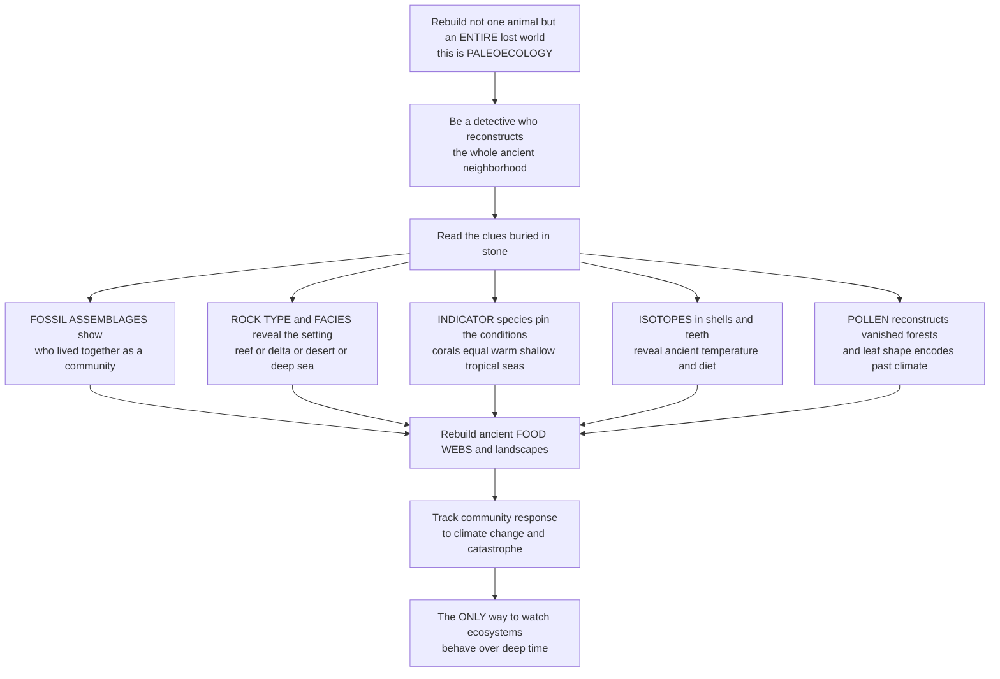

# 🌍 Paleoecology and Ancient Environments

> [!abstract] TL;DR
> **Paleoecology** is the study of how ancient organisms related to one another and to their **environments** through geological time — and it attempts the grandest reconstruction in all of paleontology: not one extinct animal, but an **entire lost world**. It asks what a whole ecosystem looked like millions of years ago — who ate whom, what the climate and landscape were, which plants grew and which seas washed the shore. The answers come from ingeniously reading clues buried in stone: **fossil assemblages** reveal which species lived together as a community; the **rock type and facies** reveal the setting — reef, river delta, desert, or deep sea; **indicator taxa** pin down conditions — corals mean warm shallow tropical seas; **stable isotopes** in shells and teeth encode ancient temperatures and diets; fossil **pollen** rebuilds vanished forests; and even the **shape of fossil leaves** records past temperature and rainfall. From these, paleoecologists reconstruct ancient **food webs**, rebuild lost landscapes, and track how communities assembled, persisted, and responded to climate change and catastrophe across millions of years. This deep-time view is uniquely powerful because it is the **only** way to watch how ecosystems actually behave over timescales far longer than any human study — giving modern ecology and conservation a priceless long-term baseline for the natural variability and resilience of the living world.

---

## Intuition

**Analogy — a detective who must reconstruct not one victim but the entire neighborhood.** Reconstructing a single extinct animal from its bones is already an impressive feat of forensic science. Paleoecology attempts something even grander. Imagine a detective who arrives not at a single crime scene but at a whole vanished town, buried and turned to stone, and is asked to rebuild the *entire community*: who lived next to whom, who fed whom, what the weather was like, what grew in the gardens and swam in the river. Every ordinary object is a clue. A pile of shells lying together tells you which creatures shared a habitat. The kind of stone they are entombed in tells you the *setting* — a coral reef, a muddy delta, a windblown dune, an abyssal seafloor. A single telltale resident narrows things instantly: corals in the rock are like finding palm trees in a photo — they can only mean warm, shallow, sunlit tropical water. The **chemistry** locked in a shell is a thermometer and a diet log. Grains of fossil **pollen**, invisible to the naked eye, rebuild whole forests that no longer exist. Even the *shape* of a fossil leaf — smooth-edged or toothed — quietly encodes how warm and wet the climate was.

From these fragmentary traces, paleoecologists rebuild ancient **food webs**, redraw lost landscapes, and follow how whole communities responded as climates drifted and catastrophes struck, over spans of millions of years. That is the deep magic of the discipline: it works at every scale — from a single ancient organism and its immediate surroundings, up to global patterns of life across the whole history of the planet. And it is uniquely powerful, because it is the **only** way we can actually watch ecosystems behave over timescales far longer than any field study a human could ever run — how they assemble, how long they persist, how they buckle under climate change, and how they recover from disaster. To understand paleoecology is to understand the ecology of the entire past — and that long-term view is a gift to the present, giving modern conservation a baseline for how the living world really works when left to run for millions of years.

---

## How It Works

Paleoecology is fundamentally a **marriage of three sciences**: ecology (the relationships among organisms and their surroundings), **sedimentology** (the rocks that record the physical setting), and **geochemistry** (the isotopes and molecules that record temperature, chemistry, and diet). It operates at three nested scales:

1. **Autecology** — the relationship of a *single* taxon to its environment (what conditions did this one species tolerate?).
2. **Synecology / paleocommunities** — the structure of *whole assemblages*: composition, diversity, trophic webs, and ecological guilds.
3. **Global paleoecology** — planet-wide patterns such as the deep-time latitudinal diversity gradient and biosphere-scale responses to mass extinctions.

**Reconstructing the physical stage** starts with the enclosing rock. **Facies** — the diagnostic package of rock type, texture, and sedimentary structures — records the depositional environment: a reef limestone, a shelf mudstone, a deltaic sandstone, a fluvial channel, an eolian dune, or a deep-marine turbidite. Before any assemblage can be interpreted, **taphonomy** must establish whether the fossils are *autochthonous* (preserved where they lived, an in-place community) or *allochthonous* (transported and mixed, a hydraulic jumble) — a distinction that decides whether you are reading a true community or a graveyard assembled by currents.

**Reading the conditions** then uses a toolkit of **proxies**. **Indicator taxa** exploit the *uniformitarian* principle — the "nearest living relative" method — where a fossil's living cousins constrain its habitat (corals → warm shallow water; reef-builders → clear tropical seas). **Stable isotopes** turn shells and teeth into instruments: oxygen-18 records paleotemperature, carbon-13 records diet and productivity, and clumped isotopes give absolute temperatures. **Palynology** — fossil pollen and spores — reconstructs vanished vegetation and its climate. **Leaf physiognomy** (leaf-margin analysis and the multivariate CLAMP method) converts the *shape* of fossil leaves into mean annual temperature and rainfall. **Microfossils** — foraminifera, diatoms, ostracods — are exquisitely sensitive environmental sensors, and **biomarkers** (molecular fossils) fingerprint the organisms that once lived there.

**Analyzing the community** applies quantitative ecology to the assemblage: **diversity indices**, **evenness**, **ordination** (arranging samples by their species composition to expose environmental gradients), and reconstruction of **trophic webs** and ecological **guilds**. Ecological **gradients** — onshore-to-offshore, or latitudinal — emerge, and paleocommunities can be compared across time and space to ask the deepest question of all: over deep time, do communities behave as tightly-bound, coordinated units (the Clementsian view, "coordinated stasis") or as loose, individually-shuffling assemblages (the Gleasonian view)? That debate, and the tracking of how ecosystems responded to climate change, sea-level swings, and **mass extinctions**, is what makes deep-time paleoecology a unique long-term laboratory.

### Flow / Architecture



---

## Key Concepts

### 🟢 Secondary

- **What paleoecology is.** It is the study of how ancient living things related to each other and to their **environment**, using fossils to rebuild whole vanished ecosystems — not just single animals.
- **Fossils that live together lived together.** A group of fossils found in the same rock — a **fossil assemblage** — tells you which species shared a habitat, like a snapshot of an ancient community.
- **The rock tells you the place.** The **type of rock** reveals the setting: reef limestones mean a coral reef, sandy river deposits mean a delta, windblown sand means a desert, fine deep mud means the deep sea.
- **Indicator species are giveaways.** Some organisms only live in certain conditions. **Corals** mean warm, shallow, sunny tropical seas; certain **plants** mean specific climates. Finding them pins down the ancient environment.
- **Hidden clues: chemistry and pollen.** The **chemistry** locked inside fossil shells and teeth records ancient temperature and diet, and fossil **pollen** rebuilds forests that vanished long ago. Even the shape of a fossil **leaf** records how warm and wet the climate was.
- **Why it matters.** Paleoecology is the **only** way to see how whole ecosystems behave over millions of years — how they change with the climate and recover from disasters — which helps us understand and protect nature today.

### 🟡 Undergraduate

- **Three scales.** Paleoecology spans **autecology** (one taxon versus its environment), **synecology** (the structure of whole paleocommunities), and **global** patterns (e.g., the deep-time latitudinal diversity gradient). It is the marriage of ecology, **sedimentology**, and **geochemistry**.
- **Facies and depositional environment.** The enclosing **facies** — rock type plus sedimentary structures — records whether deposition occurred in a reef, shelf, deltaic, fluvial, eolian, or deep-marine setting. The physical stage is read before the actors.
- **Autochthonous vs. allochthonous.** **Taphonomy** must first establish whether an assemblage is preserved *in place* (a true community) or *transported and time-averaged* (a current-sorted jumble). This decides whether ecological inference is even valid.
- **The proxy toolkit.** Environmental reconstruction uses **indicator taxa / nearest-living-relative** analogues, **stable isotopes** (δ¹⁸O for temperature, δ¹³C for diet/productivity), **palynology** (pollen/spores for vegetation), **leaf-margin analysis** (percent smooth-margined species → mean annual temperature), and **microfossils** (forams, diatoms, ostracods) as sensitive sensors.
- **Quantitative paleocommunity analysis.** Assemblages are compared using **diversity** and **evenness** indices, **ordination** (arranging samples along composition axes to expose environmental gradients), and reconstruction of **trophic structure** and ecological **guilds**. Onshore-offshore and latitudinal gradients recur through the record.
- **Community dynamics over deep time.** A central question is whether communities behave as **coordinated, persistent units** ("coordinated stasis," a Clementsian view) or as **loosely-coupled, individually-tracking** species (a Gleasonian view). The record shows both stability and continual reshuffling depending on scale.

### 🔴 Graduate

- **Megabias and the scale problem.** The fossil record offers a **unique long time-window** unavailable to neontology, but at coarse and uneven resolution — **time-averaging**, taphonomic megabias, and facies control mean paleocommunities are spatiotemporal composites, not census snapshots. Rigorous paleoecology explicitly models these filters rather than reading assemblages naively.
- **Transfer functions and calibration.** Quantitative paleoenvironmental reconstruction rests on **transfer functions** — regressions calibrated on modern analogues then applied to fossils. Leaf-margin analysis (Wolfe-type MAT ≈ 1.14 + 0.306·E, with E the percent entire-margined species) and multivariate **CLAMP** are canonical for terrestrial paleoclimate; foraminiferal and diatom transfer functions dominate marine and lacustrine work. Each carries a **modern-analog** assumption that can fail for **no-analog** past communities.
- **Isotope paleothermometry.** The **δ¹⁸O** paleotemperature equation, **δ¹³C** of biogenic carbonate and organic matter, and **clumped-isotope (Δ47)** thermometry supply quantitative temperature and diet reconstructions independent of morphology, but require correction for diagenesis, vital effects, and ice-volume/salinity influences on seawater composition.
- **Coordinated stasis vs. individualistic response.** The **Clementsian-versus-Gleasonian** debate plays out in deep time as coordinated stasis and ecological locking/incumbency versus continual, individualistic species reshuffling. Testing it requires distinguishing genuine community-level persistence from taphonomic and stratigraphic artifact.
- **Ecosystem response to perturbation.** The deep-time record captures **range shifts**, **no-analog communities**, and wholesale ecological reorganization in response to climate change, sea-level, and **mass extinctions** — including the disaster-taxon blooms and multi-million-year recoveries that follow. This is the empirical archive of **climate-biota coupling**.
- **Conservation paleobiology.** The near-time fossil and **subfossil** record supplies quantitative **baselines** for conservation: it exposes **shifting baselines**, quantifies natural variability and pre-human community structure, identifies restoration targets, and tests the resilience of ecosystems to past analogs of present stressors — turning deep time into an applied science for the Anthropocene.

---

## Python Demo

```python
# Paleoecology in two classic quantitative moves:
#
#   PART 1 -- PALEOCOMMUNITY / ASSEMBLAGE ANALYSIS
#     Reconstruct ancient environments from fossil ASSEMBLAGES. We take the
#     relative abundances of six marine taxa across twelve fossil samples and
#     (A) ORDINATE the samples with a hand-rolled PCA (via np.linalg.eigh) so
#     that samples cluster by paleoenvironment, and (B) compute Shannon
#     DIVERSITY per sample to show how the mix of taxa fingerprints the habitat.
#
#   PART 2 -- ENVIRONMENTAL PROXY / TRANSFER FUNCTION
#     Reconstruct PALEOTEMPERATURE from fossil plants via LEAF-MARGIN ANALYSIS:
#     the fraction of smooth (entire) leaf margins in a flora predicts mean
#     annual temperature. We (C) calibrate the regression on modern floras
#     (hand-rolled least squares) and (D) apply it to fossil floras to draw a
#     paleotemperature curve through the Cenozoic.
#
# Pure numpy + matplotlib. No sklearn -- PCA and regression are hand-rolled.

import numpy as np
import matplotlib.pyplot as plt

rng = np.random.default_rng(42)
fig, axes = plt.subplots(2, 2, figsize=(15, 11))
axA, axB, axC, axD = axes.ravel()

# ======================================================================
# PART 1 -- PALEOCOMMUNITY ANALYSIS
# ======================================================================
taxa = ["Corals", "Brachiopods", "Crinoids", "Bivalves", "Gastropods", "Forams"]
# Three true paleoenvironments, each with a characteristic abundance profile.
#   Reef      : corals + brachiopods + crinoids dominant, high diversity
#   Nearshore : bivalves + gastropods dominant (deltaic / shallow clastic)
#   Deep sea  : forams dominant, low diversity
env_profiles = {
    "Reef":      np.array([8.0, 6.0, 5.0, 1.0, 1.0, 0.5]),
    "Nearshore": np.array([0.5, 1.0, 0.5, 7.0, 6.0, 1.0]),
    "Deep sea":  np.array([0.2, 0.3, 0.2, 0.5, 0.5, 9.0]),
}
env_color = {"Reef": "#e76f51", "Nearshore": "#e9c46a", "Deep sea": "#264653"}

# Build 12 fossil samples (4 per environment) as noisy relative abundances.
sample_env, X = [], []
for env, profile in env_profiles.items():
    for _ in range(4):
        counts = np.clip(profile + rng.normal(0, 0.8, size=profile.size), 0.05, None)
        X.append(counts / counts.sum())        # relative abundance, sums to 1
        sample_env.append(env)
X = np.array(X)                                 # shape (12 samples, 6 taxa)

# --- Hand-rolled PCA (ordination) ---
Xc = X - X.mean(axis=0)                          # center each taxon column
cov = (Xc.T @ Xc) / (Xc.shape[0] - 1)            # covariance matrix
eigval, eigvec = np.linalg.eigh(cov)             # symmetric -> eigh
order = np.argsort(eigval)[::-1]                 # sort variance descending
eigval, eigvec = eigval[order], eigvec[:, order]
scores = Xc @ eigvec[:, :2]                       # project onto PC1, PC2
pc_var = 100 * eigval[:2] / eigval.sum()

# (A) ordination scatter -- samples cluster by paleoenvironment
for env in env_profiles:
    m = np.array(sample_env) == env
    axA.scatter(scores[m, 0], scores[m, 1], s=140, color=env_color[env],
                edgecolor="k", label=env, zorder=3)
axA.axhline(0, color="grey", lw=0.6); axA.axvline(0, color="grey", lw=0.6)
axA.set_xlabel(f"PC1  ({pc_var[0]:.0f} percent of variance)")
axA.set_ylabel(f"PC2  ({pc_var[1]:.0f} percent of variance)")
axA.set_title("(A) Assemblage ordination: the mix of taxa\nreveals the ancient habitat",
              fontsize=11, weight="bold")
axA.legend(title="Reconstructed environment", fontsize=8)

# (B) Shannon diversity per sample -- habitat leaves a diversity signature
def shannon(p):
    p = p[p > 0]
    return -np.sum(p * np.log(p))
H = np.array([shannon(row) for row in X])
bar_colors = [env_color[e] for e in sample_env]
axB.bar(np.arange(len(H)), H, color=bar_colors, edgecolor="k")
axB.set_xlabel("Fossil sample")
axB.set_ylabel("Shannon diversity  H")
axB.set_title("(B) Ecological metrics: reef assemblages are diverse,\n"
              "deep-sea assemblages are not", fontsize=11, weight="bold")
axB.set_xticks(np.arange(len(H)))
axB.set_xticklabels([e[0] for e in sample_env])   # R / N / D
for env in env_profiles:                          # legend proxy
    axB.bar(np.nan, np.nan, color=env_color[env], label=env)
axB.legend(fontsize=8)

# ======================================================================
# PART 2 -- LEAF-MARGIN TRANSFER FUNCTION (paleothermometer)
# ======================================================================
# Modern calibration: proportion of ENTIRE (smooth) leaf margins vs mean
# annual temperature. Wolfe-type relationship  MAT = 1.14 + 30.6 * P.
P_modern = rng.uniform(0.05, 0.95, size=45)
MAT_modern = 1.14 + 30.6 * P_modern + rng.normal(0, 2.2, size=P_modern.size)

# Hand-rolled least-squares fit  MAT = a + b * P
A = np.column_stack([np.ones_like(P_modern), P_modern])
b_hat, *_ = np.linalg.lstsq(A, MAT_modern, rcond=None)
a_fit, b_fit = b_hat
Pline = np.linspace(0, 1, 100)
MATline = a_fit + b_fit * Pline

# (C) calibration plot
axC.scatter(P_modern * 100, MAT_modern, s=35, color="#2a9d8f",
            edgecolor="k", alpha=0.8, label="Modern floras")
axC.plot(Pline * 100, MATline, color="#9d0208", lw=2.4,
         label=f"Fit: MAT = {a_fit:.1f} + {b_fit:.1f}*P")
axC.set_xlabel("Percent entire (smooth) leaf margins")
axC.set_ylabel("Mean annual temperature  (deg C)")
axC.set_title("(C) Transfer function: calibrate leaf shape\n"
              "against modern temperature", fontsize=11, weight="bold")
axC.legend(fontsize=8)

# (D) apply the transfer function to fossil floras through time
age_Ma   = np.array([58, 55, 50, 45, 40, 34])          # Paleocene -> Oligocene
P_fossil = np.array([0.55, 0.74, 0.68, 0.58, 0.47, 0.33])  # measured entire fraction
MAT_pred = a_fit + b_fit * P_fossil                     # reconstructed paleo-temp

axD.plot(age_Ma, MAT_pred, "-o", color="#e76f51", lw=2.4, ms=9,
         markeredgecolor="k")
axD.annotate("Early Eocene\nwarm peak", xy=(55, MAT_pred[1]),
             xytext=(50, MAT_pred[1] + 3.5), fontsize=8,
             arrowprops=dict(arrowstyle="->", color="#9d0208"), color="#9d0208")
axD.annotate("Eocene-Oligocene\ncooling", xy=(34, MAT_pred[-1]),
             xytext=(41, MAT_pred[-1] - 5), fontsize=8,
             arrowprops=dict(arrowstyle="->", color="#264653"), color="#264653")
axD.invert_xaxis()                                       # older on the left
axD.set_xlabel("Age  (million years ago)")
axD.set_ylabel("Reconstructed MAT  (deg C)")
axD.set_title("(D) Apply to fossil floras: a paleotemperature\n"
              "curve read from fossil leaves", fontsize=11, weight="bold")

plt.tight_layout()
plt.savefig("paleoecology.png", dpi=120)

# ---- Console summary ----
print("PART 1 -- assemblage ordination")
print(f"  PC1 captures {pc_var[0]:.0f}% of variance, PC2 {pc_var[1]:.0f}%")
print(f"  mean Shannon H  Reef={H[:4].mean():.2f}  "
      f"Nearshore={H[4:8].mean():.2f}  Deep-sea={H[8:].mean():.2f}")
print("PART 2 -- leaf-margin transfer function")
print(f"  calibrated MAT = {a_fit:.2f} + {b_fit:.2f} * P")
for a, p, t in zip(age_Ma, P_fossil, MAT_pred):
    print(f"  {a:>4} Ma:  entire fraction {p:.2f}  ->  MAT {t:5.1f} deg C")
```

**Part 1** shows how the *composition* of a fossil assemblage betrays its ancient environment. Panel A's hand-rolled **PCA ordination** takes twelve samples described only by their relative abundances of six taxa and, with no labels given to the algorithm, cleanly separates them into three clusters — reef, nearshore, and deep sea — because each habitat has a characteristic taxonomic fingerprint. Panel B confirms it with **Shannon diversity**: reef assemblages are richest and most even, deep-sea foram-dominated assemblages are impoverished, exactly the ecological signature a paleoecologist would use to name the setting. **Part 2** demonstrates a **transfer function**, the workhorse of quantitative paleoenvironmental reconstruction. Panel C calibrates a simple leaf-margin thermometer on modern floras — the more smooth-edged (entire) leaves a flora has, the warmer its climate — using hand-rolled least squares. Panel D then *applies* that calibration to fossil floras to draw a paleotemperature curve, recovering the classic early-Eocene warm peak and the subsequent Eocene-Oligocene cooling purely from the shapes of ancient leaves. Together the two parts embody the whole discipline: read the assemblage to find the habitat, read a proxy to quantify the conditions.

---

## Real-World Applications

- **Conservation paleobiology.** The near-time fossil and **subfossil** record supplies pre-human **baselines** for conservation and restoration — exposing **shifting baselines**, quantifying natural variability, and defining realistic restoration targets. Living shorelines, oyster-reef restoration, and rewilding programs increasingly set goals against what the fossil record shows was once present.
- **Paleoclimate reconstruction.** Leaf-margin/CLAMP analysis, pollen assemblages, foraminiferal and diatom transfer functions, and **stable isotopes** provide quantitative deep-time temperature, rainfall, and CO₂ estimates that calibrate and validate climate models beyond the reach of instrumental or ice-core records.
- **Petroleum and resource geology.** Reconstructing depositional environments and paleoecology from microfossil assemblages (**biostratigraphy** plus **paleoenvironmental** analysis) underpins the mapping of source rocks, reservoirs, and seals in the subsurface.
- **Reef and marine ecosystem baselines.** Fossil and death-assemblage data reveal what coral reefs, shellfish beds, and seagrass communities looked like before human impact, quantifying how far modern systems have degraded and how resilient they are.
- **Anticipating ecosystem response to warming.** Deep-time intervals of rapid warming (e.g., the Paleocene-Eocene Thermal Maximum) serve as natural experiments for how communities shift ranges, reorganize, or form **no-analog** assemblages under climate change — informing projections for the current warming.
- **Extinction and recovery science.** By reconstructing pre-extinction communities and tracking their collapse and rebuilding across the **Big Five** events, paleoecology quantifies how ecosystems fail and how long recovery actually takes — a benchmark for the modern biodiversity crisis.

---

## Common Pitfalls

- **Ignoring taphonomy — mistaking a graveyard for a community.** Assuming every fossil assemblage records organisms that lived together fails when the assemblage is **allochthonous** (transported) or heavily **time-averaged**. Always establish whether it is autochthonous before drawing ecological conclusions.
- **Naive nearest-living-relative reasoning.** Modern analogues constrain ancient habitats only when the group's ecology has been stable. Extinct clades with **no living relatives**, or taxa whose tolerances shifted over time, can badly mislead the "corals mean warm shallow water" style of inference.
- **The modern-analog assumption in transfer functions.** Regressions calibrated on modern floras or faunas break down for **no-analog** past communities and past climate states with no modern counterpart. Applying a calibration outside its training envelope produces confident but wrong numbers.
- **Confusing sampling artifact with ecological signal.** Diversity trends, gradual "declines," and community turnover can be manufactured by uneven **sampling**, facies changes, and the coarse resolution of the record (**megabias**). Signals must be tested against these biases before being read as biology.
- **Reading facies changes as ecological change.** Because assemblage composition is strongly controlled by **environment**, a shift in the fossils up-section may simply record a change in depositional setting (facies) rather than a genuine ecological or evolutionary event.
- **Diagenetic alteration of geochemical proxies.** Isotopic paleothermometry assumes the original shell chemistry is preserved. **Diagenesis**, vital effects, and changes in seawater composition can overprint the signal, so screening for preservation is essential before trusting a temperature.

---

## Related Concepts

This note opens the vault's **Paleobiology and Reconstructing Life** section as its ecosystem-scale synthesis — moving from single fossils to whole ancient worlds. Its sibling notes in this section are named here in prose so they can be wired once written: *Paleobiology and Ancient Life* (reconstructing the biology, function, and physiology of individual extinct organisms — the organism-scale counterpart to this community-scale note), *Paleoclimatology and Deep-Time Climate* (the deep-time climate record that paleoecology both reads through proxies and responds to), *Trace Fossils and Ancient Behavior* (ichnology — tracks, burrows, and feeding traces that record behavior and are prime *in-place* paleoenvironmental indicators), and *Conservation Paleobiology and Astrobiology* (applying the fossil record as a baseline for modern conservation, and extending environmental reconstruction to other worlds).

Glob-verified links to existing notes:

- [[Fossils_and_the_Fossilization_Process]] — taphonomy decides whether an assemblage is an in-place community or a transported jumble, the precondition for all paleoecological inference.
- [[The_Fossil_Record_and_Its_Biases]] — megabias, time-averaging, and the coarse resolution that paleoecology must correct for before reading ecology from rock.
- [[Geologic_Time_and_Stratigraphy]] — the deep-time and biostratigraphic framework that orders paleocommunities in time and space.
- [[Mass_Extinctions_and_the_Big_Five]] — the great perturbations whose ecosystem collapse and recovery paleoecology reconstructs.
- [[The_End_Cretaceous_Extinction_and_the_Asteroid]] — a case study of an ecosystem's response to catastrophe, the kind of deep-time event paleoecology tracks.
- [[Sedimentary_Rocks_and_Environments]] — the facies and depositional environments that supply the physical stage on which ancient communities are reconstructed.
- [[Mass_Extinctions_and_Paleoclimate]] — the Earth-science treatment of deep-time climate-biota coupling that paleoecology quantifies.
- [[Paleoclimatology_and_Ice_Cores]] — the proxy-based reconstruction of past climate, methodologically parallel to paleoecological transfer functions.
- [[Community_Ecology]] — the modern-ecology theory of communities, guilds, and interactions that paleoecology projects into deep time.
- [[Ecosystems_and_Energy_Flow]] — the trophic and energy-flow framework behind reconstructing ancient food webs.
- [[Food_Webs_and_Trophic_Dynamics]] — the food-web machinery whose ancient analogs paleoecology rebuilds from fossil assemblages.
- [[Community_Ecology_and_Species_Interactions]] — species-interaction theory that anchors the Clementsian-versus-Gleasonian debate in deep time.
- [[Biomes_and_Global_Ecology]] — the global-scale ecological patterns whose deep-time histories paleoecology reconstructs.

---

## Review Questions

1. **(Secondary)** A paleontologist finds a slab of rock packed with fossil corals, brachiopods, and crinoids, all preserved together. Explain how the *kinds* of fossils and the *type of rock* together let them conclude this was once a warm, shallow, tropical reef — and name one clue hidden in the chemistry of the shells that could confirm the water was warm.
2. **(Undergraduate)** Describe two independent proxies a paleoecologist could use to reconstruct the *temperature* of an ancient terrestrial environment, and explain why establishing whether a fossil assemblage is **autochthonous** or **allochthonous** must come *before* any ecological interpretation of that assemblage.
3. **(Graduate)** A leaf-margin **transfer function** calibrated on modern floras is applied to a Cretaceous flora and yields a mean annual temperature far outside any modern value. Discuss the **modern-analog** and **no-analog** problems, the role of **time-averaging** and **facies control**, and how you would test whether the result reflects genuine paleoclimate or an artifact of the method and the record.

---

## Sources

- Dodd, J. R., & Stanton, R. J. *Paleoecology: Concepts and Applications.* 2nd ed. Wiley-Interscience, 1990.
- Behrensmeyer, A. K., Damuth, J. D., DiMichele, W. A., Potts, R., Sues, H.-D., & Wing, S. L. (eds.). *Terrestrial Ecosystems Through Time: Evolutionary Paleoecology of Terrestrial Plants and Animals.* University of Chicago Press, 1992.
- Brenchley, P. J., & Harper, D. A. T. *Palaeoecology: Ecosystems, Environments and Evolution.* Chapman & Hall, 1998.
- Dietl, G. P., & Flessa, K. W. "Conservation Paleobiology: Putting the Dead to Work." *Trends in Ecology & Evolution* 26 (2011): 30–37; and Dietl & Flessa, "Conservation Paleobiology," *Annual Review of Earth and Planetary Sciences* 39 (2011).
- Wolfe, J. A. "A method of obtaining climatic parameters from leaf assemblages." *U.S. Geological Survey Bulletin* 2040 (1993).

---

#paleontology #paleoecology #paleoenvironment #fossil-assemblages #paleoclimate-proxies
