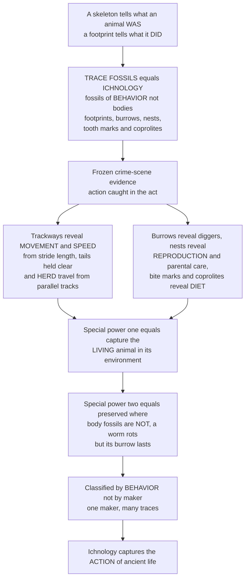

# 🐾 Trace Fossils and Ancient Behavior

> [!abstract] TL;DR
> A skeleton tells you what an animal **was**; a **footprint** tells you what it **did**. That is the magic of **trace fossils** — and the science that studies them is **ichnology**. Trace fossils (ichnofossils) are fossils not of *bodies* but of *behavior*: **footprints and trackways, burrows and borings, nests and eggs, tooth and bite marks, coprolites** (fossil dung), gastroliths, and feeding and grazing trails. They are the frozen **crime-scene evidence** of prehistory, capturing moments of **action** — a living animal caught in the act — and they answer questions bones simply cannot. A **trackway** records how an animal actually moved: walking or running (from **stride length** you can even estimate its **speed** via Alexander's formula), whether dinosaurs dragged their tails (they did not — trackways show tails held clear), whether they travelled in **herds** (parallel trackways say yes), whether predators stalked prey. Burrows reveal diggers; **nests** reveal reproduction and even parental care; **bite marks and coprolites** reveal diet and who ate whom. Traces have two special powers: they capture the **living** animal in its environment (a body fossil is a corpse, a trace is a life event), and they are often preserved where body fossils are **not** — a soft-bodied worm rots away completely, yet its burrow can survive half a billion years. Because one animal makes many traces and different animals make similar ones, traces are classified by the **behavior** they record, not the maker. Ichnology is how paleontology captures not just the actors, but the **action**.

---

## Intuition

**Analogy:** Imagine a detective who arrives long after everyone has left a house. There is no body — but there are **muddy footprints** across the floor (someone walked here, in this direction, at this pace), a **tunnel dug** into the cellar wall (someone lived down here), a **nest of bedding** in the corner (someone raised young here), **tooth marks** on a leftover bone in the kitchen (someone ate this), and a pile of **droppings** by the door (and here is exactly what they had for dinner). From this scattered evidence the detective reconstructs *what happened* and *who did what to whom* — without ever seeing a single person.

That is exactly what a trace fossil does across deep time. The "house" is a slab of ancient mud turned to stone, and the clues are **footprints, burrows, nests, bite marks, and coprolites**. A body fossil is a *corpse* — it tells you the animal's *anatomy*. A trace fossil is a *life event* — it tells you the animal's *behavior*: how it moved, how fast, whether it lived alone or in a herd, whether it dug, hunted, or cared for its young. And because a burrow can outlast the soft body that made it by half a billion years, traces are sometimes the **only** record that a creature ever existed at all.

---

## How It Works

### Core Mechanics

Ichnology reads **structures in sediment made by living organisms** and turns their geometry into behavior. The logic runs in a chain:

1. **An animal acts on a soft substrate.** It walks across a mudflat, burrows into a seafloor, digs a nest, gnaws a carcass, or defecates. The action deforms or fills sediment.
2. **The trace is captured and buried.** If a later sediment layer buries the impression gently, it is preserved as a mold, cast, or filled tube. Fine-grained, rapidly-buried settings (mudflats, storm layers, microbial mats) are ideal — the same conditions that make trace fossils common are often *different* from those that preserve bones.
3. **Lithification freezes the moment.** The sediment hardens to rock, and the behavioral snapshot becomes permanent. Crucially, this can happen even where the animal's body left **no fossil at all** — a soft worm decays, but its burrow endures.
4. **The trace is classified by behavior, not maker (the ichnotaxonomy twist).** A single trace-maker leaves *many* different traces (a trilobite walking, resting, feeding, and burrowing produces four distinct trace types), and *different* animals leave *similar* traces. So traces get their own names — **ichnogenera and ichnospecies** — organized ethologically by the behavior they record: **dwelling** (domichnia), **feeding** (fodinichnia), **grazing** (pascichnia), **resting** (cubichnia), **locomotion** (repichnia), and **escape** (fugichnia).
5. **Geometry is decoded into behavior.** Stride length plus footprint size gives **speed**; trackway width and pace angulation give **posture** (erect vs sprawling); parallel same-direction trackways give **herding**; burrow shape gives **life mode**; bite-mark spacing gives the predator; coprolite contents give the **diet**.
6. **Assemblages are decoded into environments.** Recurring trace communities — **ichnofacies** (Skolithos, Cruziana, Zoophycos, Nereites) — track water depth, energy, and oxygen, while the *intensity* of churning — **bioturbation** — records ecosystem engineering that reshaped Earth's sediments (the Ediacaran–Cambrian "substrate revolution").

### Flow / Architecture



---

## Key Concepts

### Secondary (the big idea)
- **Trace fossils are fossils of behavior, not bodies.** Footprints, burrows, nests, bite marks, and fossil dung are all traces — records of *what an animal did*, not what it looked like.
- **Trackways record how animals moved.** A line of footprints shows direction, gait, and — from the spacing between steps — how fast the animal was going. Dinosaur trackways prove they held their **tails off the ground** and sometimes travelled in **herds**.
- **Fossil dung is real data.** **Coprolites** (fossilized feces) can contain bones, scales, plant bits, or insect parts — a direct record of an animal's last meals.
- **Traces last where bodies vanish.** A soft-bodied worm rots away completely, but the **burrow** it dug can survive for hundreds of millions of years — so traces preserve the existence of creatures that left no other fossils.

### Undergraduate (the mechanisms)
- **Body vs trace fossils.** A **body fossil** preserves the organism (bone, shell, leaf); a **trace fossil** preserves its *activity*. Traces are *in situ* by nature — they cannot be transported without being destroyed — so they always record behavior **where it happened**, an advantage bones (which drift and rework) rarely offer.
- **The type catalogue.** Tracks and **trackways**, trails and crawling traces, **burrows and borings**, feeding traces, grazing trails, resting traces, escape structures, **nests and eggs**, **coprolites**, gastroliths (stomach stones), **bite and gnaw marks**, and regurgitalites (fossil vomit) — each mapped to a behavior.
- **Ethological (behavioral) classification.** Because one maker leaves many traces and different makers leave similar ones, traces are named with their own **ichnotaxonomy** (ichnogenera / ichnospecies) grouped by behavior: *domichnia, fodinichnia, pascichnia, cubichnia, repichnia, fugichnia*.
- **Speed from a trackway (Alexander 1976).** Estimate hip height *h* from footprint length (roughly *h ≈ 4 × footprint length* for dinosaurs), compute **relative stride length** λ = stride / *h*, then use the dimensionless-speed relation *v* / √(*gh*) = 0.25 λ^2.4 to recover velocity. λ < 2 indicates a **walk**, λ > 2.9 a **run**.
- **Ichnofacies.** Recurring trace assemblages that indicate depositional **environment** — *Skolithos* (high-energy shoreface, vertical dwelling burrows), *Cruziana* (well-oxygenated shelf, diverse traces), *Zoophycos* and *Nereites* (quiet, deeper water) — a key tool in **sedimentology** and reservoir geology.

### Graduate (the debates and subtleties)
- **The trace–maker problem.** Assigning a trace to a producer is inference, not observation; convergent behavior and multi-behavior makers mean a single body taxon may correspond to many ichnotaxa and vice versa. This is a feature, not a bug: ichnotaxonomy is deliberately behavior-based and maker-agnostic.
- **Undertracks and preservational grade.** A footprint transmits downward through sediment laminae, so what is exposed may be an **undertrack** — a muted, deeper impression that distorts apparent foot morphology and can inflate or deflate size and shape estimates. Alexander speed estimates carry large error bars from hip-height and undertrack uncertainty.
- **Bioturbation and the substrate revolution.** The onset of vertical burrowing across the Ediacaran–Cambrian transition (the **"agronomic revolution"**) destroyed the firm microbial matgrounds of the Precambrian seafloor, oxygenated sediments, and opened infaunal niches — a case where *trace* evidence documents a global ecological transition better than body fossils do. The **ichnofabric** (degree of sediment mixing) is now a routine paleoenvironmental proxy.
- **Traces as the earliest animal record.** Ediacaran horizontal trails and shallow burrows are among the first direct evidence of **motile, muscular bilaterians**, predating unambiguous body fossils of their makers — ichnology anchors the timing of early animal *behavior* independent of skeletal preservation.
- **Behavioral evolution in deep time.** Complex, programmed foraging patterns (meandering and spiral grazing traces optimizing sediment coverage) show **behavior itself evolving** and even converging — a register of cognition-like optimization preserved in rock.

---

## Python Demo

```python
# Trace fossils turn GEOMETRY into BEHAVIOR. Four analyses (numpy + matplotlib):
#   (A) SPEED FROM A TRACKWAY (Alexander 1976) -- estimate how fast an extinct
#       animal moved from footprint length + stride length alone.
#   (B) GAIT from relative stride length -- walk vs trot vs run thresholds.
#   (C) TRACKWAY GEOMETRY (plan view) -- narrow-gauge (erect) posture, and TWO
#       PARALLEL trackways as evidence of HERD travel.
#   (D) ICHNOFACIES / BIOTURBATION gradient -- trace type & burrowing intensity
#       change with water depth => reconstruct the ancient environment.
import numpy as np
import matplotlib.pyplot as plt

g = 9.81                       # gravitational acceleration, m/s^2
rng = np.random.default_rng(3)

# --- Alexander's dinosaur-speed method -------------------------------------
# 1) hip height h from footprint length FL:  h ~= 4 * FL   (dinosaur rule of thumb)
# 2) relative stride length      lam = stride / h
# 3) dimensionless speed         u   = v / sqrt(g*h) = 0.25 * lam**2.4
#    => v = 0.25 * lam**2.4 * sqrt(g*h)
def hip_height(footprint_len):
    return 4.0 * footprint_len

def speed_from_stride(stride, h):
    lam = stride / h
    v = 0.25 * lam**2.4 * np.sqrt(g * h)
    return v, lam

# --- (A) speed vs stride length for three body sizes -----------------------
stride = np.linspace(0.4, 8.0, 300)
sizes = {"small theropod (FL=0.12 m)": 0.12,
         "human-scale   (FL=0.26 m)": 0.26,
         "large theropod (FL=0.60 m)": 0.60}

# A worked example: a large theropod trackway
FL_ex, stride_ex = 0.60, 5.3
h_ex = hip_height(FL_ex)
v_ex, lam_ex = speed_from_stride(stride_ex, h_ex)

# --- (B) gait regimes vs relative stride length ----------------------------
lam = np.linspace(0.5, 4.5, 300)
u_dimensionless = 0.25 * lam**2.4                # Froude speed u = v / sqrt(gh)

# --- (C) plan-view trackways: narrow gauge + a parallel companion ----------
N = 7
pace = 1.35                                       # along-travel step spacing (m)
half_width = 0.10                                 # narrow gauge => erect posture
k = np.arange(N)
x1 = k * pace
y1 = np.where(k % 2 == 0, half_width, -half_width)   # left / right alternation
x2 = x1 + rng.normal(0, 0.08, N)                  # a companion travelling alongside
y2 = y1 + 3.2                                      # parallel, same direction => herd

# --- (D) bioturbation index vs water depth with named ichnofacies ----------
depth = np.linspace(0, 4000, 500)
# schematic bioturbation index BI (0-6): suppressed in the high-energy shoreface,
# peaks on the well-oxygenated shelf, tapers into the food-poor deep sea
BI = (5.6 * np.exp(-((depth - 150)  / 120)**2) +
      4.5 * np.exp(-((depth - 600)  / 450)**2) +
      2.2 * np.exp(-((depth - 2500) / 1400)**2))
BI = np.clip(BI, 0, 6)

# ---------------------------------------------------------------------------
fig, ax = plt.subplots(2, 2, figsize=(13, 9))

# A: speed vs stride
axA = ax[0, 0]
for label, fl in sizes.items():
    v, _ = speed_from_stride(stride, hip_height(fl))
    axA.plot(stride, v * 3.6, lw=2.0, label=label)      # m/s -> km/h
axA.scatter([stride_ex], [v_ex * 3.6], color='k', zorder=5)
axA.annotate(f"worked example\nv ~= {v_ex*3.6:.0f} km/h",
             xy=(stride_ex, v_ex*3.6), xytext=(2.4, v_ex*3.6 + 22),
             fontsize=8, arrowprops=dict(arrowstyle='->'))
axA.set_title("A. Speed read from a fossil trackway (Alexander 1976)")
axA.set_xlabel("stride length (m)"); axA.set_ylabel("estimated speed (km/h)")
axA.legend(fontsize=8)

# B: gait regimes
axB = ax[0, 1]
axB.plot(lam, u_dimensionless, color='navy', lw=2.2)
axB.axvspan(0.5, 2.0, color='lightgreen', alpha=0.30, label='walk  (lam < 2.0)')
axB.axvspan(2.0, 2.9, color='khaki',     alpha=0.40, label='trot / amble')
axB.axvspan(2.9, 4.5, color='salmon',    alpha=0.30, label='run  (lam > 2.9)')
axB.axvline(lam_ex, color='k', ls='--', lw=1.5)
axB.text(lam_ex + 0.05, 0.4, 'example', fontsize=8)
axB.set_title("B. Gait from relative stride length  lam = stride / hip height")
axB.set_xlabel("relative stride length lam")
axB.set_ylabel("dimensionless speed  u = v / sqrt(g h)")
axB.legend(fontsize=8)

# C: plan-view trackways
axC = ax[1, 0]
axC.plot(x1, y1, '-', color='gray', lw=1, zorder=1)
axC.scatter(x1[k % 2 == 0], y1[k % 2 == 0], marker='<', s=90,
            color='saddlebrown', label='individual 1: left prints')
axC.scatter(x1[k % 2 == 1], y1[k % 2 == 1], marker='>', s=90,
            color='peru', label='individual 1: right prints')
axC.plot(x2, y2, '-', color='gray', lw=1, zorder=1)
axC.scatter(x2, y2, marker='s', s=70, color='darkgreen',
            label='individual 2 (parallel => HERD)')
axC.annotate('', xy=(x1[2], 0), xytext=(x1[0], 0),
             arrowprops=dict(arrowstyle='<->', color='blue'))
axC.text((x1[0] + x1[2]) / 2, 0.32, 'stride', color='blue', fontsize=8, ha='center')
axC.set_title("C. Trackway geometry: narrow gauge (erect) + parallel = HERDING")
axC.set_xlabel("distance along travel (m)"); axC.set_ylabel("lateral position (m)")
axC.set_ylim(-1.0, 4.3); axC.legend(fontsize=7, loc='center right')

# D: bioturbation vs depth with ichnofacies bands
axD = ax[1, 1]
axD.plot(BI, depth, color='sienna', lw=2.2)
axD.fill_betweenx(depth, 0, BI, color='sandybrown', alpha=0.30)
bands = [(0, 60, 'Skolithos'), (60, 1000, 'Cruziana'),
         (1000, 2000, 'Zoophycos'), (2000, 4000, 'Nereites')]
for i, (top, bot, name) in enumerate(bands):
    axD.axhspan(top, bot, alpha=0.05 + 0.03 * (i % 2))
    axD.text(0.2, (top + bot) / 2, name, fontsize=8, va='center')
axD.invert_yaxis()                                 # depth increases downward
axD.set_title("D. Ichnofacies & bioturbation change with water depth")
axD.set_xlabel("bioturbation index BI (0-6)"); axD.set_ylabel("water depth (m)")

plt.tight_layout()
plt.savefig('trace_fossils_behavior.png', dpi=120)

# Quantitative takeaways
gait = "walk" if lam_ex < 2.0 else ("run" if lam_ex > 2.9 else "trot / transition")
print(f"Worked example: footprint {FL_ex} m -> estimated hip height {h_ex:.1f} m")
print(f"  stride {stride_ex} m  ->  relative stride lam = {lam_ex:.2f}")
print(f"  estimated speed = {v_ex:.1f} m/s  ({v_ex*3.6:.0f} km/h)  ->  gait: {gait}")
print(f"Peak bioturbation at ~{depth[np.argmax(BI)]:.0f} m depth (well-oxygenated shelf)")
```

Running it makes ichnology quantitative. Panel A shows how the **same stride length** implies a very different speed depending on body size, so you must scale by hip height — and the worked large-theropod trackway resolves to roughly 29 km/h. Panel B places that example in the **gait** framework: with relative stride λ ≈ 2.2 the animal was moving fast — past a walk, into a trot toward running. Panel C reconstructs the **plan view**: narrow trackway gauge betrays an **erect** (legs-under-body) posture, and a second individual pacing parallel in the same direction is textbook evidence of **herd** travel. Panel D reads the environment straight off the traces: **bioturbation** peaks on the oxygenated shelf and the ichnofacies march from shallow *Skolithos* down to deep *Nereites* — a depth gauge written entirely in behavior.

---

## Real-World Applications

- **Dinosaur trackways and locomotion.** Sites like Dinosaur State Park (Connecticut), the Paluxy River tracks (Texas), and Lark Quarry (Queensland) let paleontologists estimate **running speeds**, prove tails were carried clear of the ground, reconstruct posture, and infer **herding and possible stampedes** — behavior no skeleton records.
- **Reconstructing paleoenvironments.** **Ichnofacies** and the **bioturbation index** are standard tools for interpreting ancient water depth, energy, and oxygenation from sedimentary cores, complementing physical sedimentology.
- **Petroleum reservoir characterization.** Burrows rework sediment porosity and permeability; ichnofabric analysis is used industrially to predict fluid flow, sealing, and heterogeneity in hydrocarbon reservoirs.
- **Diet and predator–prey reconstruction.** **Coprolite** contents (bones, scales, plant tissue, insect cuticle) and **bite / gnaw marks** on bones give *direct* evidence of who ate whom — feeding interactions that body fossils only hint at.
- **The earliest-animal and behavioral record.** Ediacaran–Cambrian trails and burrows document the arrival of motile, muscular bilaterians and the seafloor "substrate revolution," dating the *behavioral* dawn of animal life independent of skeletal fossils.
- **Reproduction and parental care.** Nesting colonies with eggs and juveniles (famously *Maiasaura*, "good mother lizard") preserve **brooding and colonial nesting** — social and parental behavior read from trace sites.

---

## Common Pitfalls

- **Confusing the trace with the maker.** A single animal makes many traces and different animals make similar ones, so a trace fossil names a *behavior*, not a species. Assigning a producer is inference, and often the maker is simply unknown.
- **Ignoring undertracks.** Footprints transmit downward through sediment layers; an exposed impression may be a muted **undertrack** with distorted shape and size, corrupting morphology reads and Alexander speed estimates. Always assess preservational grade.
- **Over-trusting speed estimates.** The Alexander method depends on hip height *estimated* from footprint length; real hip heights, gait, and substrate compliance vary. Report speeds as ranges, not precise values.
- **Reading traces as transported.** Unlike bones, traces are almost always **in situ** — but reworked or composite surfaces (multiple trampling events, tidal reactivation) can superimpose behaviors from different times. Distinguish a single trackway from a churned trampled ground.
- **Treating bioturbation as noise.** High bioturbation destroys primary sedimentary layering, but that "destruction" *is* the signal — it records oxygenation and ecosystem engineering. The ichnofabric is data, not damage.
- **Assuming absence of traces means absence of life.** Firm substrates, anoxia, or rapid lithification can suppress trace formation; a barren interval may reflect *conditions*, not a lifeless sea.

---

## Related Concepts

- [[Predator_Prey_and_Population_Interactions]] — bite marks, coprolite contents, and stalking trackways give *direct* fossil evidence of the predator–prey interactions that population ecology models in the living world.
- [[Food_Webs_and_Trophic_Dynamics]] — coprolites and gnaw marks reconstruct *who ate whom* in deep time, letting paleontologists rebuild ancient trophic links from behavioral traces.
- [[Sedimentary_Rocks_and_Environments]] — trace fossils form and are preserved in sediments, and **ichnofacies** are a core sedimentological tool for reconstructing depositional environments (depth, energy, oxygen).
- [[Evidence_for_Evolution]] — trace fossils are an independent line of evidence for the history of life, recording the deep-time evolution of *behavior* (locomotion, burrowing, feeding strategies) alongside anatomy.
- [[Newtons_Laws_and_Kinematics]] — estimating dinosaur speed from stride length is applied kinematics: the Alexander relation uses the Froude number (a gravity-scaled dimensionless speed) to compare gaits across body sizes.

Within this vault, trace fossils sit inside the broader project of **Paleobiology_and_Ancient_Life** (inferring biology from fossils) and depend on the physics of preservation covered in **Fossils_and_the_Fossilization_Process** (why a burrow can outlast a body). They complement **Functional_Morphology_and_Biomechanics_of_Fossils** (bones tell you what an animal *could* do; trackways tell you what it *did* do), feed directly into **Paleoecology_and_Ancient_Environments** through ichnofacies and bioturbation, and provide the earliest behavioral record discussed in **The_Cambrian_Explosion** (the Ediacaran–Cambrian substrate revolution).

---

## Review Questions

1. **(Secondary)** What is the difference between a **body fossil** and a **trace fossil**, and give three examples of trace fossils. Why can a trace fossil tell you something a skeleton never could?
2. **(Secondary/Undergraduate)** A worm has no bones and rots away completely, yet we know worms lived in ancient seas. How can trace fossils record the existence of soft-bodied animals that left no other fossils?
3. **(Undergraduate)** Explain why traces are classified by **behavior** (ichnotaxonomy) rather than by the animal that made them. Give one reason from each direction — one maker producing many traces, and many makers producing one trace type.
4. **(Undergraduate)** Using Alexander's method, outline the three steps that convert a fossil **footprint length** and **stride length** into an estimated **speed**, and state the relative-stride thresholds that distinguish a walk from a run.
5. **(Undergraduate/Graduate)** You find two parallel dinosaur trackways of the same species heading in the same direction with matched pacing, and both show a narrow trackway gauge. What can you infer about (a) posture and (b) social behavior, and what alternative explanations must you rule out?
6. **(Graduate)** Explain how **bioturbation** and the Ediacaran–Cambrian "substrate revolution" make trace fossils a *better* record of an ecological transition than body fossils. What does the ichnofabric reveal about oxygenation and infaunal niches?

---

## Sources

- Seilacher, A. (2007). *Trace Fossil Analysis*. Springer. [Publisher](https://link.springer.com/book/10.1007/978-3-540-47226-1)
- Alexander, R. McN. (1976). "Estimates of speeds of dinosaurs." *Nature*, 261, 129–130. [DOI](https://doi.org/10.1038/261129a0)
- Thulborn, R. A. (1990). *Dinosaur Tracks*. Chapman & Hall. [Publisher](https://link.springer.com/book/9780412323904)
- Bromley, R. G. (1996). *Trace Fossils: Biology, Taphonomy and Applications* (2nd ed.). Chapman & Hall. [Publisher](https://www.routledge.com/Trace-Fossils-Biology-Taphonomy-and-Applications/Bromley/p/book/9780412614804)
- Buatois, L. A. & Mángano, M. G. (2011). *Ichnology: Organism–Substrate Interactions in Space and Time*. Cambridge University Press. [Publisher](https://www.cambridge.org/core/books/ichnology/2E9E0B7D2E3E5B2C1A9E8F7D6C5B4A3E)

---

#paleontology #trace-fossils #ichnology #trackways #ancient-behavior
