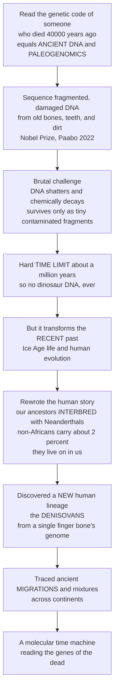

# 🧬 Ancient DNA and Paleogenomics

> [!abstract] TL;DR
> What if you could read the actual **genetic code** of a person who died 40,000 years ago — recovering their DNA from a fossil bone and sequencing their genome as if they were alive today? That once-impossible dream is now real, and it earned a **Nobel Prize** (Svante Pääbo, 2022). **Ancient DNA (aDNA)** and **paleogenomics** extract and sequence the fragmented, chemically damaged genetic material preserved in old bones, teeth, hair, and even dirt. The technical challenge is brutal: DNA is a fragile molecule that **shatters and decays** after death, so ancient DNA survives only as tiny, broken, and often contaminated fragments — and there is a hard **TIME LIMIT**, because DNA is essentially unrecoverable beyond about **a million years** (so no dinosaur DNA, ever). But *within* that window — the world of Ice Age mammals and recent human evolution — it is transformative. Ancient DNA **rewrote the human story**: our ancestors **interbred with Neanderthals**, so most living non-Africans carry ~2% Neanderthal DNA (they never fully went extinct — they live on in us). It discovered an **entirely new human lineage, the Denisovans**, from nothing but the DNA in a single finger bone — a species known essentially from its genome before its anatomy. It has traced ancient human **migrations and mixtures** across continents (rewriting European and global prehistory), resolved the relationships of extinct creatures like mammoths and cave bears, and even fuelled dreams of **de-extinction**. This note takes the **recent-timescale (<~1 Myr)** molecular angle and complements the deep-time sibling *Molecular Paleontology and Exceptional Preservation*: ancient DNA gave paleontology a **molecular time machine**, reading the genes of the dead with a precision bones alone never could.

---

## Intuition

**Analogy — a molecular time machine that reads the diary of the dead.** Imagine finding a water-damaged diary in a flooded basement. The pages are torn into confetti, the ink has bled and faded, mould has grown over half of it, and — worst of all — the person who found it before you scribbled their *own* notes in the margins with the same pen. Reconstructing the original text means gathering thousands of tiny scraps, recognising which ones are genuinely old (the faded, decayed ones) versus the fresh contamination, aligning the fragments against a reference copy of a similar diary, and statistically piecing the story back together. You will never recover every word — but recover enough overlapping scraps and the narrative emerges.

Ancient DNA is exactly this, at the scale of a **genome**. Death switches off the cellular machinery that constantly repairs DNA, so the molecule begins to fall apart: enzymes and water **chop the long strands into short pieces**, and chemistry slowly **rewrites individual letters** (a heavy hallmark: the letter C decays into something read as T, especially at the frayed ends of each fragment). Given enough time — under warm conditions, mere thousands of years; under cold permafrost, up to ~a million — the scraps become too short and too few to reassemble, and the diary is gone forever. That is why there will **never** be dinosaur DNA: 66 million years is hundreds of times past the limit. But 40,000 years is well inside it. So from a Neanderthal toe bone, a Denisovan pinky, or a mammoth tusk frozen in Siberian permafrost, scientists gather the confetti, filter out the modern contamination by spotting the tell-tale decay signature, align it to a reference genome, and read the genes of an individual dead for hundreds of centuries. The payoff is a kind of resurrection: the discovery that Neanderthals never truly vanished — a trace of them survives in the DNA of billions of people alive today.

---

## How It Works

### Core Mechanics

1. **What aDNA is.** Ancient DNA is genetic material recovered from **non-living, degraded remains** — sub-fossil bones and teeth, hair, mummified tissue, herbarium and museum specimens, coprolites, and even **sediments** (sedimentary aDNA, or *sedaDNA*, which captures the DNA an ecosystem shed into cave dirt and lake mud without any body at all). Paleogenomics is the discipline of extracting, sequencing, and analysing that material to reconstruct genomes and population histories.
2. **The field's two eras.** The birth phase (mid-1980s) used **cloning and then PCR** to recover tiny snippets — famously a fragment from the extinct **quagga** and short stretches of Neanderthal mitochondrial DNA. Progress was throttled because PCR amplifies whatever template is present, and modern **contamination** usually dominates. The revolution came with **next-generation (high-throughput) sequencing (NGS)**, which reads *all* the short fragments in an extract at once — ideal for the naturally short, mixed pool of aDNA. Svante Pääbo's group used it to publish the **draft Neanderthal genome (2010)** and the **Denisovan genome (2012)**, work recognised by the **2022 Nobel Prize in Physiology or Medicine**.
3. **Why it is hard — degradation.** The moment repair stops, DNA suffers **fragmentation** (strand breaks, driven largely by *depurination* — loss of A/G bases that weakens the backbone), collapsing the molecule into pieces typically **30–70 base pairs** long. This is why aDNA reads are so short.
4. **Why it is hard — damage.** Surviving bases are chemically altered. The signature lesion is **cytosine deamination**: C converts to uracil, read by the sequencer as **T**. Because single-stranded overhangs at fragment **ends** are most exposed, damage concentrates there, producing a diagnostic rise in **C→T substitutions at the 5′ ends** (and complementary **G→A at the 3′ ends**). This "smiley" damage pattern is the primary tool used to **authenticate** genuine aDNA against modern contamination, which shows no such pattern.
5. **Why it is hard — the ~1-Myr limit.** DNA decays with a temperature-dependent half-life (empirically ~**521 years** for a short mtDNA fragment at ~13 °C in one classic study). Extrapolated, even under ideal **cold, dry, stable** conditions (permafrost, deep caves), fragments long enough to read vanish beyond roughly **one million years**. This is a hard physical ceiling: it forever rules out **dinosaur DNA** (66 Myr) and links to the deep-time preservation limit discussed in the molecular-paleontology sibling.
6. **Why it is hard — contamination and low yield.** Extracts are dominated by **microbial and modern human DNA**; the *endogenous* (target organism) fraction is often <1%. Countermeasures: dedicated **clean rooms**, strict handling protocols, negative controls, targeted **enrichment** (hybridisation capture), and — crucially — using the **best-preserving tissues**, above all the dense **petrous bone** of the inner ear and cementum-rich **teeth**, which can yield endogenous fractions orders of magnitude higher.
7. **Computation.** Reads are **mapped** to a reference genome (tolerating damage and short length), authenticated via damage patterns and contamination estimates, and — because coverage is often low — **imputed** and fed into **population-genetic inference** (admixture estimation, *f*- and *D*-statistics, PCA, ADMIXTURE-style models) to reconstruct relationships, gene flow, and demographic history.
8. **The payoff.** Within its window, aDNA turns paleontology from a science of **shapes** into a science of **sequences** — recovering genotypes, ancestry proportions, selected genes, and migration routes with a resolution that morphology alone cannot reach.

### Flow / Architecture



---

## Key Concepts

### 🟢 Secondary

- **Reading the genes of the dead.** Ancient DNA is real genetic code recovered from old bones, teeth, and even cave dirt. Scientists can sequence the genome of an individual who died tens of thousands of years ago — a "molecular time machine."
- **DNA falls apart after death.** Living cells constantly repair their DNA. Once an organism dies, that stops, and the DNA **breaks into tiny pieces** and its letters slowly get **chemically damaged**. So ancient DNA is always short, broken, and partly rewritten.
- **There is a time limit.** No matter how good the preservation, DNA becomes unreadable after about **a million years**. Dinosaurs died out 66 million years ago — so there will **never** be dinosaur DNA. Ancient DNA only works for the *recent* past: Ice Age animals and recent human evolution.
- **Contamination is the enemy.** Modern DNA from the people who handle a bone easily swamps the tiny amount of ancient DNA. Scientists work in **clean rooms** and check for the special damage pattern that proves DNA is genuinely ancient.
- **We interbred with Neanderthals.** Ancient DNA proved that early modern humans and Neanderthals had children together. Most people outside Africa carry **about 2% Neanderthal DNA** today — Neanderthals live on in us.
- **A new human species found from a finger bone.** From the DNA in a single tiny finger bone, scientists discovered the **Denisovans**, a previously unknown kind of ancient human — a species known first from its **genes**, not its skeleton.

### 🟡 Undergraduate

- **Post-mortem degradation, quantitatively.** Two processes define aDNA: **fragmentation** (depurination-driven strand breaks yielding ~30–70 bp reads) and **base damage** (cytosine deamination → uracil, sequenced as T). The **rate** of decay is strongly temperature-dependent (roughly Arrhenius), which is why permafrost and cold caves preserve DNA far longer than temperate or tropical sites.
- **Authentication.** Genuine aDNA is identified by (i) **short fragment lengths**, (ii) the characteristic **C→T at 5′ ends / G→A at 3′ ends** damage profile (the "smiley plot"), and (iii) low **contamination estimates** (e.g. mitochondrial or X-chromosome-based tests). Treatments like **USER/uracil-DNA-glycosylase** can remove deaminated bases to reduce error, at the cost of losing the damage signal used for authentication.
- **Best sources and enrichment.** Endogenous yield varies enormously by tissue; the **petrous bone** and **tooth cementum** are the gold standards. **Hybridisation capture** (e.g. targeting ~1.2 million informative SNPs) enriches endogenous DNA from otherwise poor samples, enabling population-scale ancient studies.
- **Neanderthal introgression.** Comparing modern genomes to the Neanderthal reference shows non-Africans share **more derived alleles** with Neanderthals than Africans do — the signature of **admixture** (~1–4%, commonly cited ~2%). Introgressed archaic segments include both **adaptive** variants (immune *HLA*, skin, high-altitude physiology) and **deleterious** ones purged over time.
- **Denisovans.** From a finger bone and teeth in **Denisova Cave** (Siberia), a high-coverage genome revealed a **sister lineage to Neanderthals**. Denisovan ancestry is elevated in **Melanesians and some Asian populations** (up to ~4–6% in Papuans), and Denisovan-derived **EPAS1** underlies high-altitude adaptation in Tibetans.
- **Rewriting recent prehistory.** Ancient DNA from many individuals reconstructs **migrations and population turnovers** — e.g. Europe as a mixture of **hunter-gatherer, early-farmer (Anatolian Neolithic), and Bronze-Age steppe (Yamnaya)** ancestry components — the "ancient DNA revolution" that has reshaped archaeology.

### 🔴 Graduate

- **Deconvolving admixture with *f*- and *D*-statistics.** The **ABBA-BABA** test (**D-statistic**) detects asymmetric allele sharing between an archaic genome and one of two test populations relative to an outgroup; the **f4-ratio** estimates the *proportion* of archaic ancestry. These allele-frequency-correlation statistics, robust to the low coverage typical of aDNA, are the workhorses of introgression and demographic inference (and underlie the Python demo below).
- **Multiple and structured archaic admixture.** Modern humans absorbed archaic gene flow in **multiple pulses** (distinct Neanderthal contributions to European vs East Asian ancestry; separate Denisovan lineages contributing to Oceanian vs mainland-Asian populations). There is also evidence of **"super-archaic"** gene flow *into* Denisovans and of ancient structure within Africa — a reticulate rather than tree-like human ancestry.
- **The recovery limit and its physics.** DNA decay follows temperature-dependent depurination kinetics; the ~**521-year** half-life for a 242-bp fragment at 13.1 °C (Allentoft et al. 2012) extrapolates to a practical ceiling near **1 Myr** in ideal cold settings — recently *pushed* by ~**1.2-Myr-old mammoth** genomes from Siberian permafrost, which sit near the theoretical edge. This ceiling is the molecular analogue of the deep-time preservation limits treated in molecular paleontology, and is why **paleoproteomics** (ancient proteins, which survive far longer) is the frontier *beyond* the DNA window.
- **Sedimentary aDNA (sedaDNA).** Environmental DNA in cave sediments and lake cores can identify the hominins and fauna that occupied a site **without any skeletal remains**, and reconstruct past ecosystems and vegetation through time — a rapidly expanding paleoecological tool.
- **Beyond humans.** Paleogenomics resolves the **phylogeny and population history of extinct megafauna** (woolly mammoths, cave bears, ground sloths, aurochs, moa), the genetics of **domestication** (dogs, horses, cattle, maize, wheat), and **ancient pathogens** — reconstructing genomes of *Yersinia pestis* (plague), *Mycobacterium tuberculosis*, and others to trace the evolution and spread of past epidemics.
- **Frontiers and ethics.** **De-extinction** proposals (mammoth "revival" via genome editing of the elephant genome) raise both technical and ethical questions; the oldest-aDNA race pushes the physical limit; and the study of **ancient human remains** demands engagement with **Indigenous rights, consent, and repatriation** — the ethics of who owns, and who narrates, the genomes of the ancestral dead.

---

## Python Demo

```python
# Ancient DNA & paleogenomics, made visible with two hallmark analyses:
#
#   (A) THE aDNA SIGNATURE -- why ancient DNA is short, damaged, and time-limited:
#       (A-i) temperature-dependent DECAY of recoverable DNA (Arrhenius kinetics
#             calibrated to the ~521-year half-life at 13.1 C), showing that only
#             cold permafrost reaches the ~1-million-year ceiling -- and that a
#             66-Myr dinosaur is hundreds of times past any hope.
#       (A-ii) the "smiley" DAMAGE plot: elevated C->T substitutions at 5' fragment
#             ends and G->A at 3' ends from cytosine deamination -- the pattern used
#             to AUTHENTICATE real aDNA against flat, undamaged modern contamination.
#
#   (B) NEANDERTHAL ADMIXTURE -- estimate the fraction of each modern population's
#       genome derived from Neanderthals by ALLELE SHARING (an f-statistic-style
#       contrast against Africans), recovering the famous ~2% in non-Africans.
#
# Pure numpy + matplotlib, fully runnable.

import numpy as np
import matplotlib.pyplot as plt

rng = np.random.default_rng(2026)

# =====================================================================
# (A-i) Temperature-dependent DNA decay and the ~1-Myr recovery limit
# =====================================================================
R    = 8.314                       # gas constant, J/(mol K)
Ea   = 127000.0                    # depurination activation energy ~127 kJ/mol
T_c  = 286.25                      # 13.1 C calibration temperature (Kelvin)
k_c  = np.log(2) / 521.0           # decay rate giving a 521-yr half-life at 13.1 C
A    = k_c / np.exp(-Ea / (R * T_c))   # Arrhenius pre-exponential factor

t          = np.logspace(1, 6.4, 500)      # 10 yr  ->  ~2.5 Myr
floor      = 1e-15                          # schematic "unrecoverable" threshold
myr_limit  = 1.0e6                          # ~1-million-year ceiling
temps_C    = [15, 5, -5, -20]
tcolors    = ["#dc2626", "#f59e0b", "#2563eb", "#1e3a8a"]
tlabels    = ["Temperate  +15 C", "Cool cave  +5 C",
              "Cold  -5 C", "Deep permafrost  -20 C"]

# =====================================================================
# (A-ii) Post-mortem damage "smiley": C->T at 5' end, G->A at 3' end
# =====================================================================
pos   = np.arange(1, 26)                    # position from the fragment terminus
lam   = 4.0                                  # decay length of the damage signal
base  = 0.02                                 # background substitution rate
amp   = 0.30                                 # damage amplitude at the very end
ct_5p = base + amp * np.exp(-(pos - 1) / lam)        # C->T rises toward 5' end
ga_3p = base + amp * np.exp(-(pos.max() - pos) / lam) # G->A rises toward 3' end
contam = np.full_like(pos, base, dtype=float)         # flat modern contamination

# =====================================================================
# (B) Neanderthal admixture by allele sharing (f-statistic-style)
# =====================================================================
# At "informative" SNP sites (African ancestral, Neanderthal derived), a modern
# individual carries the derived allele mainly through archaic ADMIXTURE. The
# excess sharing over the African baseline estimates the Neanderthal fraction.
n_sites = 80000
ils     = 0.006                              # baseline sharing (incomplete lineage sorting + noise)
truth   = {"African\n(Yoruba)": 0.000, "European": 0.020,
           "East Asian": 0.024, "Papuan": 0.021}

afr = (rng.random(n_sites) < ils)            # African baseline sharing
afr_rate = afr.mean()

labels, est, err = [], [], []
for name, alpha in truth.items():
    share = (rng.random(n_sites) < (ils + alpha))          # derived-allele sharing
    # block-free bootstrap over sites for the standard error of the CONTRAST
    boot = np.empty(400)
    for b in range(400):
        idx = rng.integers(0, n_sites, n_sites)
        boot[b] = share[idx].mean() - afr[idx].mean()
    labels.append(name)
    est.append(share.mean() - afr_rate)      # excess over African = admixture estimate
    err.append(boot.std())

est = np.array(est) * 100.0                  # -> percent
err = np.array(err) * 100.0

# ---------------------------------------------------------------------
# Plot: 3 panels (top row = the aDNA signature, bottom = admixture)
# ---------------------------------------------------------------------
fig = plt.figure(figsize=(13, 9.5))
ax1 = fig.add_subplot(2, 2, 1)
ax2 = fig.add_subplot(2, 2, 2)
ax3 = fig.add_subplot(2, 1, 2)

# (A-i) decay curves
for Tc, c, lbl in zip(temps_C, tcolors, tlabels):
    k = A * np.exp(-Ea / (R * (Tc + 273.15)))
    ax1.loglog(t, np.exp(-k * t), color=c, lw=2.2, label=lbl)
ax1.axhline(floor, color="#334155", ls=":", lw=1.2)
ax1.axvline(myr_limit, color="#111827", ls="--", lw=1.4)
ax1.text(myr_limit * 0.55, 1e-4, "~1 Myr limit", rotation=90,
         fontsize=8, color="#111827", ha="right")
ax1.text(1.1e6, 3e-14, "no dinosaur DNA\n66 Myr is far off-scale",
         fontsize=7.5, color="#7f1d1d")
ax1.set_ylim(1e-16, 2)
ax1.set_xlabel("Time since death (years)")
ax1.set_ylabel("Fraction of DNA still recoverable")
ax1.set_title("Why aDNA is time-limited:\ntemperature-dependent decay",
              fontsize=10.5, weight="bold")
ax1.legend(fontsize=7.2, loc="lower left")
ax1.grid(True, which="both", alpha=0.15)

# (A-ii) damage smiley
ax2.plot(pos, ct_5p, color="#dc2626", lw=2.3, marker="o", ms=3,
         label="C to T  (5' end)")
ax2.plot(pos, ga_3p, color="#2563eb", lw=2.3, marker="s", ms=3,
         label="G to A  (3' end)")
ax2.plot(pos, contam, color="#6b7280", lw=1.6, ls="--",
         label="modern contamination (flat)")
ax2.set_ylim(0, 0.38)
ax2.set_xlabel("Position along fragment (from terminus)")
ax2.set_ylabel("Substitution frequency")
ax2.set_title("Authenticating aDNA:\nthe cytosine-deamination 'smiley'",
              fontsize=10.5, weight="bold")
ax2.legend(fontsize=7.6, loc="upper center")
ax2.grid(True, alpha=0.15)

# (B) admixture bars
xpos   = np.arange(len(labels))
colors = ["#16a34a" if v < 0.5 else "#7c3aed" for v in est]
ax3.bar(xpos, est, yerr=err, capsize=5, color=colors, alpha=0.85,
        edgecolor="#1f2937")
ax3.axhline(2.0, color="#b45309", ls="--", lw=1.5,
            label="~2% (classic non-African estimate)")
for x, v, e in zip(xpos, est, err):
    ax3.text(x, v + e + 0.12, f"{v:.2f}%", ha="center", fontsize=9, weight="bold")
ax3.set_xticks(xpos)
ax3.set_xticklabels(labels, fontsize=9)
ax3.set_ylabel("Estimated Neanderthal ancestry (%)")
ax3.set_ylim(-0.4, max(est) + 1.2)
ax3.set_title("Neanderthal admixture by allele sharing:\n"
              "non-Africans carry ~2%, Africans ~0% -- they live on in us",
              fontsize=10.5, weight="bold")
ax3.legend(fontsize=8.5, loc="upper left")
ax3.grid(True, axis="y", alpha=0.15)

plt.tight_layout()
plt.savefig("ancient_dna_paleogenomics.png", dpi=120)

# ---- numerical readouts ----
for Tc in temps_C:
    k = A * np.exp(-Ea / (R * (Tc + 273.15)))
    print(f"Half-life at {Tc:>4} C: {np.log(2)/k:12,.0f} yr")
print("\nEstimated Neanderthal ancestry (%):")
for name, v, e in zip(labels, est, err):
    print(f"  {name.splitlines()[0]:<12}: {v:5.2f} +/- {e:4.2f}")
print("\n-> Africans ~0%, non-Africans ~2%: the admixture signature is real.")
```

Panel **A-i** turns Arrhenius decay kinetics into the physics of the recovery limit: temperate DNA is unreadable within ~10⁴ years, while only **cold permafrost** stretches survival toward the **~1-million-year ceiling** — and a 66-Myr dinosaur is hundreds of times off-scale. Panel **A-ii** draws the **cytosine-deamination "smiley"** (C→T rising at 5′ ends, G→A at 3′ ends) against the flat profile of modern contamination — the pattern used to **authenticate** genuine aDNA. Panel **B** estimates **Neanderthal ancestry** by contrasting each population's allele sharing against Africans, recovering the famous result: **~0% in Africans, ~2% in non-Africans** — Neanderthals live on in the DNA of billions today.

---

## Real-World Applications

- **The Neanderthal and Denisovan genomes.** The draft Neanderthal genome (2010) and high-coverage Denisovan genome (2012) proved **archaic-modern interbreeding** and revealed the Denisovans — a hominin lineage defined **from DNA before anatomy**. This is the headline achievement recognised by the **2022 Nobel Prize**.
- **Rewriting human prehistory.** Population-scale ancient DNA reconstructs the **peopling of Europe, Asia, and the Americas**, ancient migrations, and turnovers — resolving, for example, that modern Europeans are a mixture of **hunter-gatherer, Anatolian-farmer, and steppe (Yamnaya)** ancestry. The "ancient DNA revolution" has reshaped archaeology and anthropology.
- **Medical and adaptive genomics.** Introgressed archaic alleles affect **immunity, metabolism, skin, and high-altitude physiology** (Denisovan **EPAS1** in Tibetans) — and some Neanderthal variants influence disease risk today, making aDNA directly relevant to modern human biology.
- **Extinct megafauna and de-extinction.** Paleogenomes of **woolly mammoths, cave bears, ground sloths, aurochs, and moa** resolve their evolution and population collapse, and underpin **de-extinction** efforts (engineering mammoth traits into elephants).
- **Domestication histories.** Ancient DNA traces the origins of **dogs, horses, cattle, maize, and wheat**, pinpointing where and when wild species were domesticated and how they spread with people.
- **Ancient pathogens and past epidemics.** Reconstructed genomes of **plague (*Yersinia pestis*)**, tuberculosis, and other pathogens reveal the evolution and spread of historic epidemics — a molecular window onto past pandemics that connects paleogenomics to epidemiology.
- **Paleoecology from dirt.** **Sedimentary aDNA** reconstructs past ecosystems, vegetation, and the presence of hominins and fauna at a site even when **no bones survive**.

---

## Common Pitfalls

- **Believing "dinosaur DNA" is possible.** The single most common misconception. DNA's decay makes even ideally preserved fragments unrecoverable beyond **~1 Myr**; dinosaurs (66 Myr) are hopelessly out of reach. Claims of far-older DNA almost always trace to **contamination** — this is why *Jurassic Park* is fiction and why the frontier beyond the limit is **ancient proteins**, not DNA.
- **Mistaking contamination for signal.** Modern human and microbial DNA usually **dominate** an extract. Without clean rooms, controls, contamination estimates, and the **damage-pattern authentication** shown in the demo, "ancient" results can be pure contamination — the failure mode that plagued the early PCR era.
- **Removing the very damage that authenticates.** Enzymatic treatments (uracil-DNA-glycosylase) that repair deaminated bases to reduce errors also **erase the C→T damage signal**. Analysts must balance error reduction against retaining a means to prove authenticity.
- **Over-reading low-coverage genomes.** Ancient genomes are often shallow, damaged, and imputed. Drawing strong claims about a single individual's phenotype (skin colour, disease risk) without acknowledging **statistical uncertainty and reference bias** overstates what the data support.
- **Trees where there are networks.** Human (and archaic) ancestry is **reticulate**: multiple admixture pulses, structured archaic populations, and "super-archaic" gene flow. Forcing the data into a simple branching tree misrepresents a genuinely **web-like** history.
- **Ignoring the ethics.** Ancient human remains are **ancestors** to living communities. Studying their genomes without engaging **Indigenous rights, consent, and repatriation** is both an ethical failure and, increasingly, a scientific and legal one.

---

## Related Concepts

This note lives in the **Human Evolution and Modern Paleontology** section of the **Paleontology and Deep Time** vault and takes the **recent-timescale (<~1 Myr) molecular** angle. Its section siblings are referenced here in prose so they can be wired once written: it is the molecular counterpart to **Paleoanthropology and Human Origins** and **The Hominin Fossil Record** (which supply the skeletal and archaeological framework that aDNA now genotypes and cross-checks); it deliberately **complements and links to the deep-time sibling *Molecular Paleontology and Exceptional Preservation***, which handles the *pre-DNA* window of fossilised biomolecules, ancient proteins, and the general preservation limits that aDNA's ~1-Myr ceiling is a special case of; it is one instrument in the toolkit of **Modern Paleontological Methods and Technology**; and it feeds **Conservation Paleobiology and Astrobiology** (ancient genetic baselines for conservation, and the molecular-preservation questions relevant to detecting past life).

Verified cross-vault links to existing notes:

- [[DNA_Sequencing_Technologies]] — the next-generation sequencing revolution that made paleogenomics possible by reading all short fragments at once.
- [[DNA_Repair_and_Mutation]] — the repair machinery that stops at death and the **deamination/depurination** chemistry that produces aDNA's fragmentation and C→T damage.
- [[Population_Genetics_and_Hardy_Weinberg]] — the allele-frequency framework underlying admixture estimation, *f*/*D*-statistics, and demographic inference.
- [[Natural_Selection_Genetic_Drift_and_Bottlenecks]] — the forces (selection on adaptive introgressed alleles, drift, bottlenecks) that shaped both archaic and modern genomes.
- [[Molecular_Evolution_and_Phylogenetics]] — the molecular-clock and tree/network methods used to place Neanderthals, Denisovans, and extinct megafauna.
- [[Phylogenetics_and_the_Tree_of_Life]] — how paleogenomes resolve relationships among extinct and living lineages, including reticulate human ancestry.
- [[Human_Genome_and_Genetic_Variation]] — the modern reference variation against which archaic introgression and ancient migrations are measured.
- [[Human_Origins_and_the_Paleolithic]] — the archaeological narrative of human origins that ancient DNA has rewritten.
- [[Human_Evolution_and_Paleoanthropology]] — the fossil-and-anatomy account of human evolution now integrated with genomic evidence.
- [[Human_Variation_and_Population_Genetics]] — present-day human variation, into which Neanderthal and Denisovan ancestry is woven.
- [[Evidence_for_Evolution]] — aDNA as some of the most direct molecular evidence for evolution and common descent.
- [[Pandemics_and_Emerging_Infections]] — the study of past epidemics via reconstructed ancient pathogen genomes (plague, tuberculosis).

---

## Review Questions

1. **(Secondary)** Scientists have sequenced the genome of a Neanderthal who died ~40,000 years ago, but they say there will *never* be dinosaur DNA. In your own words, explain why ancient DNA works for recent remains but not for dinosaurs, and name one thing that makes ancient DNA so hard to recover even within its time window.
2. **(Undergraduate)** You are handed a bone extract and must decide whether the DNA is genuinely ancient or modern contamination. Describe **two independent lines of evidence** you would check (think about **fragment length** and the **pattern of substitutions along a read**), and explain *why* authentic ancient DNA shows those features while contamination does not.
3. **(Graduate)** Non-Africans share more derived alleles with Neanderthals than Africans do. Explain how an **ABBA-BABA / D-statistic** (or **f4-ratio**) uses this asymmetry to *estimate* the Neanderthal ancestry proportion, why such allele-frequency statistics are well suited to **low-coverage, damaged** ancient genomes, and how the existence of **multiple admixture pulses and structured archaic populations** complicates a simple tree interpretation of human ancestry.

---

## Sources

- Pääbo, S. *Neanderthal Man: In Search of Lost Genomes*. Basic Books, 2014.
- Reich, D. *Who We Are and How We Got Here: Ancient DNA and the New Science of the Human Past*. Pantheon, 2018.
- Green, R. E. *et al.* "A Draft Sequence of the Neandertal Genome." *Science* 328, 710–722 (2010).
- Meyer, M. *et al.* "A High-Coverage Genome Sequence from an Archaic Denisovan Individual." *Science* 338, 222–226 (2012).
- Allentoft, M. E. *et al.* "The half-life of DNA in bone: measuring decay kinetics in 158 dated fossils." *Proc. R. Soc. B* 279, 4724–4733 (2012).

---

#paleontology #ancient-dna #paleogenomics #neanderthals #denisovans
