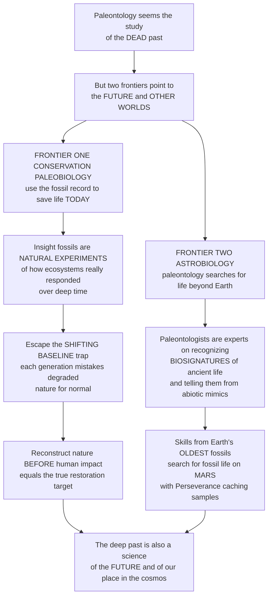

# 🔮 Conservation Paleobiology and Astrobiology

> [!abstract] TL;DR
> Paleontology looks like the ultimate study of the **dead past** — yet two cutting-edge frontiers point it firmly toward the **future** and even toward **other worlds**. The first is **conservation paleobiology**: using the deep-time fossil and **subfossil** record to help save life *today*. Its power is a simple insight — modern ecology can only watch nature for a few years or decades, but the fossil record is a vast archive of **natural experiments** showing how ecosystems *actually* responded to past climate shifts, invasions, and extinctions over thousands to millions of years. This lets conservationists escape the **shifting-baseline** trap (each generation mistakes an already-degraded nature for "normal"); by reading the recent record — comparing a **death assemblage** of accumulated shells against the impoverished **living community** — we reconstruct what an ecosystem was like *before* human impact: the true baseline and restoration target, plus which species are resilient and how communities respond to warming. The second frontier is **astrobiology**: paleontology's search for life beyond Earth. Paleontologists are the world experts on the one thing astrobiology most needs — how to **recognize the traces of ancient life** (**biosignatures**). The skills honed on Earth's oldest, subtlest fossils (**stromatolites**, isotopic signatures, microbial textures) are exactly what is needed to search for fossil life on **Mars** — which is why the **Perseverance** rover is caching rock samples from an ancient Martian lake bed, hunting the very kinds of biosignatures paleontologists know how to read, and to distinguish them from **abiotic** mimics. Together these frontiers reveal that the science of the deep past is profoundly a science of the future and of our place in the cosmos: using ancient life to protect life today, and to seek it among the stars.

---

## Intuition

**Analogy — the old family photo albums that reveal how much the river has really changed, and the trained eye that can tell a fossil from a rock.** Imagine a river town where every generation swears the fishing was "always about this good." Grandparents caught a few big fish; their grandchildren catch a couple of small ones — and each generation quietly accepts *their own childhood* as the natural, healthy normal. Everyone is standing on a floor that keeps sinking, and nobody notices because they only remember their own lifetime. Now imagine someone drags a century of **family photo albums** out of the attic — sepia pictures of anglers barely able to lift their catch, docks piled with oysters, a river so thick with life it looks like a different planet. Suddenly the true baseline snaps into view: not the depleted river anyone alive remembers, but the teeming one that existed *before* human hands reshaped it. **That attic of old photographs is exactly what the fossil and subfossil record is for conservation.** Ecologists can only "watch" nature for a few years or decades — a single blink — but buried shells, bones, pollen, and reef rubble are a vast photo archive stretching back thousands to millions of years, recording how ecosystems *actually* behaved through past warmings, invasions, and extinctions. Read that archive and you escape the sinking-floor illusion: you recover the real, pre-impact baseline that becomes your restoration target, and you learn which species were resilient, which were fragile, and how whole communities reorganized when the climate last shifted.

The same detective skill points somewhere astonishing: **other planets.** The hardest problem in the search for life beyond Earth is not building a rocket — it is *knowing what a trace of ancient, subtle life even looks like*, and telling it apart from a lifeless mineral that merely mimics one. That is precisely the skill paleontologists spend careers honing on Earth's oldest, most contested fossils — faint layered **stromatolites**, microscopic filaments, chemical whispers in ancient rock. So when NASA sends a rover to an old Martian lake bed, it is effectively sending a robotic field paleontologist, caching rocks that might hold **biosignatures** — the fingerprints of life — for a future lab to read. The deep past, it turns out, is the training ground for the deepest question of all: *are we alone?* Understanding these two frontiers reveals the beautiful twist at the heart of the discipline — the science of the dead is, profoundly, a science of the living future: we read ancient life both to protect life here and now, and to seek it among the stars.

---

## How It Works

Conservation paleobiology and astrobiology are two applications of a single deep-time superpower: the fossil record is the **only** dataset long enough to show how life behaves over the timescales that actually matter — for saving ecosystems and for recognizing life elsewhere.

### Core Mechanics — Conservation Paleobiology

1. **The deep-time rationale.** Ecological monitoring rarely predates the 20th century, so it captures only a sliver of already-altered nature. The fossil and **subfossil** (recently dead, not yet fully fossilized) record is a library of **natural experiments** documenting how species, populations, and whole ecosystems *did* respond to past climate change, sea-level swings, invasions, human arrival, and extinctions (**Dietl & Flessa 2011**).
2. **Escaping the shifting baseline.** **Shifting-baseline syndrome** (**Pauly 1995**) is the drift in what each generation regards as "natural." Geohistorical data reset the reference point to the genuine **pre-human / pre-impact baseline**, exposing the *full* magnitude of decline that short-term monitoring cannot see.
3. **Live-dead comparison.** In "near-time" (Quaternary) conservation paleobiology, the **death assemblage** — the accumulation of dead shells or bones in a habitat — records the recent community *before* disturbance, while the **living community** records its degraded present. A mismatch (species abundant among the dead but rare or absent among the living) reveals recent, otherwise-**undocumented decline**.
4. **Setting targets and reading resilience.** The record supplies concrete **restoration** targets ("what was actually here"), informs **rewilding** debates (including **Pleistocene rewilding**), identifies **resilient versus vulnerable** taxa and **climate refugia**, and reconstructs how ranges shifted and extinction risk rose under past analog climates — a forecast for present warming.

### Core Mechanics — Astrobiology

5. **The science of biosignatures.** Recognizing life's traces spans **morphological** signatures (microfossils, **stromatolites**, microbial textures), **chemical / molecular** signatures (biomarkers, isotopic **fractionation** such as light-carbon enrichment), and **mineralogical** ones (biominerals). Each must be defended against an **abiotic** explanation — the central, hard-won lesson of Earth's oldest, fiercely contested fossils.
6. **The biogenic-versus-abiotic problem.** Purely physical or chemical processes can mimic life's shapes and signals, producing **false positives**; poor preservation erases real signals, producing **false negatives**. Distinguishing the two is the discipline's defining challenge — on Earth's Archean rocks and on Mars alike.
7. **The search beyond Earth.** Paleontological expertise now guides the hunt for **fossil life on Mars** (the ancient habitable delta of **Jezero crater**, where **Perseverance** is caching cores for **sample return**; the earlier **ALH84001** meteorite controversy), on **icy moons** (Europa, Enceladus), using Earth's deep-time record as the template, extremophiles as analogs, and the **taphonomy of biosignatures** (what preserves, and where) as the guide to *where to look*.

### Flow / Architecture



---

## Key Concepts

### 🟢 Secondary

- **Two surprising frontiers.** Paleontology is not only about the dead past. **Conservation paleobiology** uses fossils to help protect nature *today*, and **astrobiology** uses paleontologists' skills to search for life on *other planets*.
- **The sinking-floor problem.** Each generation thinks the nature it grew up with is "normal," even though it is already damaged. This is the **shifting baseline**. Fossils and recently-dead shells are like an old photo album that shows what nature was *really* like before humans changed it.
- **Learning from the deep past.** Because the fossil record is so long, it shows how ecosystems *actually* responded to past warmings and disasters — telling us which species are tough, which are fragile, and what a healthy system should look like.
- **Recognizing life's fingerprints.** A **biosignature** is a trace that shows life was there — a tiny fossil, a layered microbial mound called a **stromatolite**, or a chemical clue. Paleontologists are the experts at spotting these, even when they are faint or ancient.
- **Looking for life on Mars.** Because Mars once had lakes, NASA's **Perseverance** rover is collecting rocks from an ancient Martian lake bed, hoping they contain biosignatures — the same kinds of clues paleontologists read in Earth's oldest rocks.

### 🟡 Undergraduate

- **Conservation paleobiology, defined.** The application of **geohistorical data** — fossils, subfossils, and other records of the past — to conservation and environmental management (**Dietl & Flessa 2011**, "putting the dead to work"). Its rationale is the **deep-time perspective**: the record as an archive of natural experiments beyond the reach of ecological monitoring.
- **Shifting-baseline syndrome (Pauly 1995).** Each generation's degraded "normal" becomes the reference for the next, systematically hiding cumulative loss. Geohistorical baselines restore the true pre-human reference and reveal the *full* magnitude and trajectory of human-driven change.
- **Near-time and live-dead analysis.** Quaternary "near-time" conservation paleobiology compares **death assemblages** with **living communities**; a strong **live-dead mismatch** flags recent, undocumented ecological decline, a workhorse method for reef, oyster, and molluscan systems.
- **Restoration, rewilding, and resilience.** The record supplies **restoration targets** ("what was here"), informs **rewilding** and **Pleistocene rewilding**, and identifies **resilient versus vulnerable** taxa and **climate refugia**. Past analog climates (range shifts, extinction selectivity) forecast species' responses to present warming.
- **Biosignatures across three modes.** Astrobiology classifies life's traces as **morphological** (microfossils, stromatolites, microbial mats), **chemical / molecular** (biomarkers; isotopic **fractionation**, e.g. biological preference for light carbon), and **mineralogical** (biominerals). Robust detection requires *converging* independent lines.
- **The biogenic-versus-abiotic challenge.** Abiotic processes can mimic biological shapes and signals (**false positives**); poor preservation destroys genuine ones (**false negatives**). Earth's earliest, contested fossils are the training set for this problem — and the caution it teaches is exported directly to Mars.
- **Mars and beyond.** The search targets ancient habitable environments: **Jezero crater's** delta (**Perseverance** caches cores for **sample return**), the earlier **ALH84001** Martian-meteorite claim, and the **icy moons** Europa and Enceladus, with Earth's deep-time record and **extremophiles** as analogs.

### 🔴 Graduate

- **Geohistorical data as a conservation instrument.** Conservation paleobiology (**Dietl & Flessa 2011**; **Barnosky et al. 2017**) integrates paleontological, archaeological, and sedimentary archives to (i) establish **pre-anthropogenic baselines and natural variability**, (ii) quantify the **magnitude and trajectory** of change, and (iii) diagnose **resilience** and identify **refugia** — reframing paleontology as a *predictive*, management-relevant science rather than a purely retrospective one.
- **Fidelity of the near-time record.** Live-dead agreement studies show that **death assemblages** often retain **high compositional fidelity** to the source community despite **time-averaging**, and that *disagreement* is itself an ecological signal of recent anthropogenic change. **Time-averaging** trades temporal resolution for a smoothed, multi-decadal-to-millennial estimate of the pre-impact state — a feature, not merely a bug, for baseline reconstruction.
- **Past-analog climate response.** Deep-time and Quaternary intervals (glacial-interglacial cycles, the **PETM**) constrain **range shifts**, **no-analog communities**, extinction **selectivity**, and recovery timescales, feeding present projections of biodiversity response to warming — linking conservation paleobiology to paleoclimatology and to the sixth-extinction debate.
- **Biosignature epistemology.** A defensible biosignature must survive the **null hypothesis of abiotic origin**: morphological criteria (biogenicity indicators for microfossils and stromatolites), **isotopic fractionation** (large kinetic offsets in C, S, Fe), molecular **biomarkers** with preserved stereochemistry, and mineral-organic associations — ideally *co-located and mutually reinforcing*. The history of contested Archean fossils (e.g., the Apex chert microfossil debate) codifies the required rigor.
- **Taphonomy of biosignatures and preservation windows.** Where to search is a **taphonomic** question: which lithologies (fine-grained lacustrine clays, silica, sulfates, phosphorites) preserve organic and morphological signals over billions of years, and how radiation, oxidation, and diagenesis degrade them. This directly shaped **Jezero crater** site selection and sample-caching strategy for **Mars Sample Return**.
- **Habitability through deep time and the false-positive problem.** Astrobiology couples the deep-time record of **habitability** (the Great Oxidation, Snowball episodes, the co-evolution of life and environment) with the recognition that atmospheric and morphological biosignatures on exoplanets and Solar System bodies carry serious **abiotic false-positive** risks — making paleontology's hard-won skepticism a core competency, not a footnote.
- **The unifying thesis.** Both frontiers instantiate "**the past is the key to the future**": the deep-time archive is used to anticipate the trajectory of life on Earth (planetary stewardship) and to inform the cosmic question of life's distribution and detectability — a forward-looking, predictive paleobiology.

---

## Python Demo

```python
# CONSERVATION PALEOBIOLOGY & ASTROBIOLOGY -- the two forward-looking frontiers,
# each made concrete with a small model.
#
#   PART 1 -- THE SHIFTING BASELINE & THE DEEP-TIME RECOVERY
#     (A) An ecosystem metric (say oyster-reef / fishery health, % of pristine)
#         declines over five centuries of human impact. Each GENERATION takes the
#         health at the START of its own lifetime as "normal" -- a descending
#         staircase of perceived baselines that hides the cumulative loss. Modern
#         MONITORING only sees the last few decades. The FOSSIL / SUBFOSSIL record
#         recovers the TRUE pre-impact baseline and hence the FULL magnitude lost.
#     (B) LIVE-DEAD comparison: the DEATH ASSEMBLAGE (accumulated shells) records
#         the pre-impact community; the LIVING community records the degraded
#         present. Species abundant among the dead but gone among the living =
#         recent, otherwise-undocumented decline invisible to short-term surveys.
#
#   PART 2 -- BIOSIGNATURE DETECTION (biogenic vs abiotic)
#     (C) Samples are measured on two features (e.g. isotopic fractionation and
#         morphological/organic complexity). Biotic and abiotic populations OVERLAP.
#         A hand-rolled nearest-mean linear classifier draws a decision boundary;
#         we flag FALSE POSITIVES (abiotic called biotic) and FALSE NEGATIVES.
#     (D) Project onto the discriminant axis -> a 1-D "biosignature score". The
#         histograms of biotic vs abiotic scores overlap; a detection THRESHOLD
#         trades false positives against false negatives -- the core challenge of
#         recognizing ancient/alien life.
#
# Pure numpy + matplotlib. Classifier and projection are hand-rolled (no sklearn).

import numpy as np
import matplotlib.pyplot as plt

rng = np.random.default_rng(7)
fig, axes = plt.subplots(2, 2, figsize=(15, 11))
axA, axB, axC, axD = axes.ravel()

# ======================================================================
# PART 1A -- SHIFTING BASELINE + DEEP-TIME RECOVERY
# ======================================================================
years = np.arange(1500, 2021)
t = (years - 1500) / (2020 - 1500)               # 0 -> 1 across five centuries
pristine = 100.0                                  # true pre-impact baseline
# accelerating human-driven decline from 100% to ~15% of pristine
true_health = 15 + (pristine - 15) * np.exp(-3.0 * t**1.6)
true_health += rng.normal(0, 1.2, size=years.size)  # mild interannual noise

axA.plot(years, true_health, color="#264653", lw=2.2, label="True ecosystem health")

# Generational PERCEIVED baselines: each 30-yr generation anchors on the health
# at the start of its own lifetime -> a descending staircase.
gen_edges = np.arange(1500, 2021, 30)
for g0, g1 in zip(gen_edges[:-1], gen_edges[1:]):
    base = true_health[years == g0][0]
    axA.hlines(base, g0, g1, color="#e76f51", lw=2.4)
axA.plot([], [], color="#e76f51", lw=2.4, label="Each generation's 'normal'")

# Modern monitoring window: only the last ~50 years are actually observed.
axA.axvspan(1970, 2020, color="#2a9d8f", alpha=0.15)
axA.text(1972, 92, "modern\nmonitoring\nwindow", color="#2a9d8f", fontsize=8)

# Fossil / subfossil record recovers the TRUE pristine baseline.
axA.axhline(pristine, color="#9d0208", ls="--", lw=1.6)
axA.text(1505, pristine + 1.5, "fossil / subfossil baseline = true pristine",
         color="#9d0208", fontsize=8.5)

# Magnitude of loss: full (deep-time) vs what monitoring alone would see.
full_loss = pristine - true_health[-1]
mon_loss = true_health[years == 1970][0] - true_health[-1]
axA.annotate("", xy=(2015, true_health[-1]), xytext=(2015, pristine),
             arrowprops=dict(arrowstyle="<->", color="#9d0208", lw=2))
axA.text(1930, 55, f"FULL loss seen only\nvia deep time\n~{full_loss:.0f} pts",
         color="#9d0208", fontsize=8)
axA.set_title("(A) Shifting baseline: each generation's 'normal' sinks;\n"
              "the fossil record recovers the TRUE baseline",
              fontsize=11, weight="bold")
axA.set_xlabel("Year"); axA.set_ylabel("Ecosystem health (% of pristine)")
axA.set_ylim(0, 108); axA.legend(fontsize=8, loc="upper right")

# ======================================================================
# PART 1B -- LIVE-DEAD COMPARISON (death assemblage vs living community)
# ======================================================================
species = ["A", "B", "C", "D", "E", "F", "G", "H"]
# Death assemblage records the pre-impact community (rich, fairly even).
dead = np.array([22, 18, 15, 14, 11, 9, 7, 4], dtype=float)
# Living community: sensitive species collapsed / locally extinct; a couple of
# tolerant "weedy" species (e.g. G) proliferate.
living = np.array([3, 2, 0, 5, 0, 4, 16, 3], dtype=float)
x = np.arange(len(species)); w = 0.4
axB.bar(x - w/2, dead, w, color="#8d99ae", edgecolor="k", label="Death assemblage (past)")
axB.bar(x + w/2, living, w, color="#2a9d8f", edgecolor="k", label="Living community (now)")
# Mark live-dead mismatches: present in death assemblage, absent in life.
for i, (d, l) in enumerate(zip(dead, living)):
    if d > 0 and l == 0:
        axB.text(i - w/2, d + 0.6, "lost", ha="center", color="#9d0208",
                 fontsize=8, weight="bold")
axB.set_title("(B) Live-dead mismatch reveals undocumented decline\n"
              "species abundant among the dead, gone among the living",
              fontsize=11, weight="bold")
axB.set_xlabel("Species"); axB.set_ylabel("Relative abundance")
axB.set_xticks(x); axB.set_xticklabels(species); axB.legend(fontsize=8)

# ======================================================================
# PART 2C -- BIOSIGNATURE DETECTION (biogenic vs abiotic), 2-D
# ======================================================================
n = 220
# Feature 1: isotopic fractionation magnitude; Feature 2: morphological/organic
# complexity. Biotic samples skew high on both, but the clouds OVERLAP.
abiotic = rng.multivariate_normal([2.0, 2.0], [[1.1, 0.3], [0.3, 1.1]], n)
biotic  = rng.multivariate_normal([4.2, 4.2], [[1.3, 0.4], [0.4, 1.3]], n)

# Hand-rolled nearest-mean (Fisher-like) linear classifier.
mu_a, mu_b = abiotic.mean(0), biotic.mean(0)
w_dir = mu_b - mu_a                              # discriminant direction
w_dir = w_dir / np.linalg.norm(w_dir)
thresh = (mu_a + mu_b) / 2 @ w_dir              # midpoint threshold on projection

def classify(pts):                               # True => predicted biotic
    return (pts @ w_dir) > thresh

pred_ab = classify(abiotic); pred_bi = classify(biotic)
FP = abiotic[pred_ab]                            # abiotic called biotic
FN = biotic[~pred_bi]                            # biotic called abiotic

axC.scatter(*abiotic.T, s=14, color="#adb5bd", label="Abiotic (true)")
axC.scatter(*biotic.T,  s=14, color="#2a9d8f", label="Biotic (true)")
axC.scatter(*FP.T, s=45, facecolor="none", edgecolor="#9d0208", lw=1.4,
            label="False positive")
axC.scatter(*FN.T, s=45, facecolor="none", edgecolor="#e76f51", lw=1.4,
            label="False negative")
# Decision boundary: line perpendicular to w_dir passing through the threshold.
gx = np.linspace(-1, 8, 50)
# boundary: w_dir[0]*x + w_dir[1]*y = thresh  ->  y = (thresh - w_dir[0]*x)/w_dir[1]
gy = (thresh - w_dir[0] * gx) / w_dir[1]
axC.plot(gx, gy, "k--", lw=1.6, label="Decision boundary")
axC.set_xlim(-1, 8); axC.set_ylim(-1, 8)
axC.set_title("(C) Biosignature detection: biotic vs abiotic clouds OVERLAP\n"
              "-> false positives and false negatives are unavoidable",
              fontsize=11, weight="bold")
axC.set_xlabel("Isotopic fractionation (feature 1)")
axC.set_ylabel("Morphological / organic complexity (feature 2)")
axC.legend(fontsize=7.5, loc="upper left")

# ======================================================================
# PART 2D -- 1-D BIOSIGNATURE SCORE + DETECTION THRESHOLD
# ======================================================================
score_ab = abiotic @ w_dir
score_bi = biotic @ w_dir
bins = np.linspace(min(score_ab.min(), score_bi.min()),
                   max(score_ab.max(), score_bi.max()), 30)
axD.hist(score_ab, bins=bins, color="#adb5bd", alpha=0.8, label="Abiotic")
axD.hist(score_bi, bins=bins, color="#2a9d8f", alpha=0.7, label="Biotic")
axD.axvline(thresh, color="#9d0208", ls="--", lw=1.8, label="Detection threshold")
fp_rate = pred_ab.mean(); fn_rate = (~pred_bi).mean()
axD.text(thresh + 0.15, axD.get_ylim()[1]*0.78,
         f"FP rate = {fp_rate:.2f}\nFN rate = {fn_rate:.2f}",
         fontsize=9, color="#9d0208")
axD.set_title("(D) Biosignature 'score': moving the threshold trades\n"
              "false positives against false negatives", fontsize=11, weight="bold")
axD.set_xlabel("Biosignature score (projection onto discriminant)")
axD.set_ylabel("Number of samples"); axD.legend(fontsize=8)

plt.tight_layout()
plt.savefig("conservation_paleobiology_astrobiology.png", dpi=120)

# ---- Console summary ----
print("PART 1 -- shifting baseline")
print(f"  true pristine baseline        : {pristine:.0f}")
print(f"  health today                  : {true_health[-1]:.0f}")
print(f"  FULL loss (deep-time view)    : {full_loss:.0f} points")
print(f"  loss visible to monitoring    : {mon_loss:.0f} points "
      f"(hides {full_loss - mon_loss:.0f})")
print("PART 1 -- live-dead mismatch")
lost = [s for s, d, l in zip(species, dead, living) if d > 0 and l == 0]
print(f"  species in death assemblage but absent from living community: {lost}")
print("PART 2 -- biosignature detection")
print(f"  false-positive rate (abiotic called biotic): {fp_rate:.2f}")
print(f"  false-negative rate (biotic called abiotic): {fn_rate:.2f}")
```

**Part 1** makes conservation paleobiology's core idea visible. Panel A models five centuries of accelerating decline in an ecosystem metric; the red staircase shows each 30-year generation anchoring on the health it was *born into*, so its "normal" sinks with every cohort — the **shifting baseline**. The green band marks the modern **monitoring window**, which captures only a small recent drop; the dashed red line is the true pre-impact **baseline that only the fossil / subfossil record recovers**, exposing the *full* magnitude of loss that short-term data structurally cannot see. Panel B is the **live-dead comparison**: the grey **death assemblage** preserves a rich, even pre-impact community, while the teal **living community** is collapsed — several species present among the dead are *gone* among the living ("lost"), a mismatch that flags recent, undocumented decline. **Part 2** models the astrobiology problem. Panel C scatters **biotic** against **abiotic** samples on two measured features whose clouds *overlap*; a hand-rolled nearest-mean classifier draws a decision boundary, and the ringed points are the unavoidable **false positives** (abiotic mistaken for life) and **false negatives** (real life missed). Panel D collapses this to a 1-D **biosignature score**: because the distributions overlap, any detection **threshold** trades false positives against false negatives — the exact dilemma of recognizing ancient life in Archean rock or in a cached Martian core.

---

## Real-World Applications

> **Perseverance at Jezero crater — a robotic field paleontologist.** NASA's Perseverance rover landed in **Jezero**, an ancient Martian lake with a preserved river **delta** — precisely the fine-grained, quiet-water setting where, on Earth, subtle **biosignatures** preserve best. The rover images sedimentary textures, measures organic and mineral chemistry, and **caches sealed rock cores** for a future **Mars Sample Return** mission to analyze in terrestrial labs. Every step embodies paleontological reasoning: choose a once-habitable depositional environment, read the taphonomy, hunt for morphological and chemical traces of life, and rigorously test each against an **abiotic** explanation — the same discipline honed on Earth's oldest, most contested fossils.

- **Oyster-reef and shellfish restoration.** Death assemblages of shells reveal the size, density, and species mix of reefs *before* industrial harvesting, giving restoration projects (e.g., Chesapeake Bay oysters) an evidence-based **target** instead of a degraded modern reference.
- **Fisheries and the shifting baseline.** Historical and subfossil records of body size and abundance quantify how far stocks have fallen below their true baseline, countering **shifting-baseline syndrome** (**Pauly 1995**) in fisheries management.
- **Rewilding and restoration targets.** Late-Quaternary faunal records inform **rewilding** and **Pleistocene-rewilding** debates by documenting which large-bodied species were present and functionally important before human-driven extinctions.
- **Forecasting climate response.** Past-analog intervals (glacial-interglacial cycles, the **PETM**) constrain how species shift ranges, form **no-analog** communities, or go extinct under warming — feeding present biodiversity projections.
- **Vetting biosignatures on Earth and Mars.** The rigor developed litigating Archean microfossils and the **ALH84001** Martian-meteorite claim now sets the evidentiary bar for biosignature detection on Mars and, ultimately, exoplanet atmospheres — where **abiotic false positives** are a first-order concern.
- **Extremophiles and habitability mapping.** Studying life in extreme terrestrial settings (hydrothermal, hypersaline, subglacial) and the deep-time record of habitability guides *where* to search on Mars and the icy moons **Europa** and **Enceladus**.

---

## Common Pitfalls

- **Mistaking a degraded present for the natural baseline.** The central error conservation paleobiology exists to correct: without geohistorical data, each generation's already-impaired nature is treated as "pristine," systematically understating loss and setting restoration targets far too low.
- **Ignoring time-averaging when reading death assemblages.** A death assemblage is **time-averaged** over decades to millennia, so it is not a census snapshot. Used naively it can blur or misdate change — but treated correctly, that same averaging is what makes it a robust *pre-impact* baseline. The nuance must be modeled, not ignored.
- **Over-reading a single biosignature.** No single morphological or chemical feature proves life; abiotic processes routinely mimic biological shapes and signals (**false positives**). Robust claims require **converging, co-located, independent** lines of evidence surviving the abiotic null hypothesis.
- **Forgetting the false-negative side.** Poor preservation and diagenesis can erase genuine biosignatures, so *absence of evidence is not evidence of absence*. Search-site and sample selection (the **taphonomy of biosignatures**) matter as much as the detection instrument.
- **Assuming modern analogs always transfer.** Both frontiers lean on analog reasoning — modern communities for past baselines, Earth life for alien life. **No-analog** past communities and the possibility of genuinely non-Earth-like biochemistry mean analogs constrain but never guarantee.
- **Treating the record as merely retrospective.** The whole point is that conservation paleobiology and astrobiology are **forward-looking and predictive** — using deep time to anticipate ecosystem trajectories and to decide where and how to search for life. Reading them as "just history" misses their purpose.

---

## Related Concepts

This note closes the vault's arc by turning paleontology toward the future and toward other worlds, and it deliberately builds on section siblings named here in prose so they wire once written or cross-referenced: it extends the environmental-reconstruction toolkit of *Paleoecology_and_Ancient_Environments* from the deep past into applied, near-time conservation; it supplies the applied counterpart to the deep-time verdict of *The_Sixth_Extinction_in_Deep_Time_Perspective*; it draws its biosignature expertise from *The_Origin_of_Life_and_Earliest_Fossils* (Earth's oldest, contested traces of life); it uses the past-analog climate archive of *Paleoclimatology_and_Deep_Time_Climate* to forecast biological response to warming; and it anticipates the discipline-wide synthesis of *The_Reach_and_Future_of_Paleontology*.

Glob-verified cross-vault links to existing notes:

- [[Conservation_Biology_and_the_Biodiversity_Crisis]] — the **Ecology** discipline whose baselines, targets, and management questions conservation paleobiology directly informs with deep-time data.
- [[Extinction_and_the_Sixth_Mass_Extinction]] — the present-day biodiversity crisis whose true magnitude is exposed once geohistorical baselines replace shifted modern references.
- [[Restoration_Ecology]] — restoration needs a target; conservation paleobiology supplies "what was actually here" from the fossil and subfossil record.
- [[Ecosystem_Based_Management_and_Rewilding]] — rewilding and Pleistocene-rewilding debates rest on late-Quaternary records of which species were present and functionally important.
- [[Climate_Change_Ecology]] — past-analog climates (range shifts, no-analog communities, extinction selectivity) forecast how ecosystems respond to present warming.
- [[Astrobiology_and_Habitability]] — the **Astronomy** treatment of habitability and the search for life, to which paleontological biosignature expertise is the ground-truth complement.
- [[Terrestrial_Planets]] — the geology of Mars and its ancient habitable environments that the search for fossil Martian life targets.
- [[Exoplanets_and_Detection_Methods]] — the frontier where atmospheric biosignatures and their abiotic false-positive problem extend the recognition-of-life challenge beyond the Solar System.
- [[Mass_Extinctions_and_Paleoclimate]] — the Earth-science record of deep-time climate-biota coupling that grounds both past-analog forecasting and the deep-time perspective.

---

## Review Questions

1. **(Secondary)** Using the "old family photo album" idea, explain what a **shifting baseline** is and how the fossil or recently-dead-shell record helps conservationists find the *true* natural baseline for a river, reef, or forest. Then explain why NASA sends what is essentially a robotic paleontologist to an ancient Martian lake bed.
2. **(Undergraduate)** Describe the **live-dead comparison** method: what does a **death assemblage** record, what does the **living community** record, and why does a mismatch between them signal *recent, undocumented* decline that ordinary monitoring would miss? Separately, name the three modes of **biosignature** and explain why any single one is insufficient to claim ancient life.
3. **(Graduate)** A cached Martian core shows filamentous microstructures and a modest light-carbon **isotopic fractionation**. Lay out how you would test the **biogenic-versus-abiotic** hypothesis, addressing (a) the role of **taphonomy of biosignatures** and preservation setting in interpreting a positive *or* negative result; (b) why **converging, co-located** lines of evidence are required; and (c) how the false-positive/false-negative trade-off (the detection-threshold problem) shapes what conclusion is defensible. Relate the epistemics to the historical debates over Earth's oldest fossils and **ALH84001**.

---

## Sources

- Dietl, G. P., & Flessa, K. W. (2011). "Conservation paleobiology: putting the dead to work." *Trends in Ecology & Evolution*, 26(1), 30–37. — the foundational statement of the field and its deep-time rationale.
- Barnosky, A. D., Hadly, E. A., Gonzalez, P., et al. (2017). "Merging paleobiology with conservation biology to guide the future of terrestrial ecosystems." *Science*, 355(6325), eaah4787. — geohistorical data as a predictive tool for conservation and management.
- Pauly, D. (1995). "Anecdotes and the shifting baseline syndrome of fisheries." *Trends in Ecology & Evolution*, 10(10), 430. — the original articulation of shifting-baseline syndrome.
- Des Marais, D. J., Nuth, J. A., Allamandola, L. J., et al. (2008). "The NASA Astrobiology Roadmap." *Astrobiology*, 8(4), 715–730. — the framing of biosignatures and the search for life beyond Earth.
- Farley, K. A., Williford, K. H., Stack, K. M., et al. (2020). "Mars 2020 Mission Overview." *Space Science Reviews*, 216, 142. — Perseverance, Jezero crater, biosignature search, and sample caching for Mars Sample Return.

---

#paleontology #conservation-paleobiology #astrobiology #biosignatures #shifting-baselines
