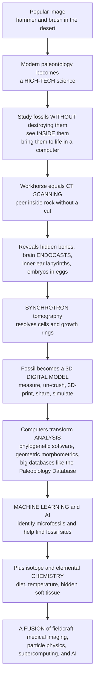

# 🔬 Modern Paleontological Methods and Technology

> [!abstract] TL;DR
> The popular picture of paleontology — a figure with a hammer and a brush, chipping bones out of desert rock — is still real and still vital, but the discipline has quietly become one of the most **high-tech sciences** on Earth. The revolution has three moves: we can now study fossils **without destroying them**, we can **see inside** them, and we can **bring them to life in a computer**. The workhorse is **CT scanning** — the very same medical scanner that images your body — which lets paleontologists peer *inside* a fossil still encased in rock, revealing hidden bones, brain cavities (digital **endocasts** that reconstruct ancient brains), inner-ear labyrinths (recording balance and hearing), and even unhatched **embryos inside eggs**, all non-destructively. For the finest detail, **synchrotron** scanning (a particle accelerator's X-rays) resolves individual cells and growth rings. Once scanned, a fossil becomes a **3-D digital model** that can be measured, virtually **un-crushed**, **3-D printed**, shared with scientists worldwide, and biomechanically **simulated** with the same physics software engineers use for cars and aircraft. Computers also transformed *analysis*: phylogenetic software builds evolutionary trees, **geometric morphometrics** quantifies shape, huge databases (the **Paleobiology Database**) enable big-data studies of diversity across all of deep time, and now **machine learning** automatically identifies microfossils, classifies specimens, and even helps locate fossil sites from satellite imagery. Chemistry contributes too — isotopes and synchrotron elemental maps read diet, temperature, and hidden soft tissue. Reading the fossil record is now a **fusion of fieldcraft, medical imaging, particle physics, supercomputing, and AI** — letting us extract more from every fossil than ever before.

## Intuition

**Analogy first — the fossil hunter has traded the brush for a medical scanner.** Picture the cliché of paleontology: a sunburnt figure kneeling in the badlands, tapping a chisel and sweeping dust off a bone with a paintbrush. That image is not wrong — fieldwork is still where fossils are found. But imagine that same fossil arriving back at the lab. A century ago, to see what was *inside* it, you had only one option: saw it in half and destroy it forever. Today you slide it into a **CT scanner** — the identical machine a hospital uses to look inside *your* skull without an incision — and it takes hundreds of X-ray photographs from every angle. A computer stitches those shadows back into a complete three-dimensional picture of the interior. Suddenly, without a single cut, you can see bones still buried in the rock, the empty cavity where a brain once sat, the coiled tubes of an inner ear, and, most astonishingly, tiny **embryos curled inside fossilized eggs**.

That single trick — reconstructing a solid interior from many flat X-ray shadows — is the same math a hospital uses, and it is only the beginning. Need to see individual *cells* or count the yearly growth rings inside a fossil bone? Take it to a **synchrotron**, a particle accelerator whose X-rays are millions of times brighter than a hospital's. Once the fossil is scanned, it stops being a fragile physical object and becomes a **digital twin**: a file you can rotate on screen, measure to the micron, mirror to repair a broken side, virtually "un-crush" to undo millions of years of geological squashing, print in plastic at any size, email to a colleague in Tokyo, and even *run physics on* — simulating the stress in a dinosaur's skull as it bites, exactly as an engineer simulates a bridge. Meanwhile the *thinking* has been mechanized too: software builds family trees from thousands of anatomical traits, statistics turn shape into numbers, global databases let one study span every fossil ever catalogued, and **machine learning** now sorts microscopic fossils faster than any human and scans satellite imagery to guess where the next fossil bed is hiding. Recognize that a modern paleontologist wields medical imaging, particle physics, supercomputing, and artificial intelligence, and the romantic hammer-and-brush caricature dissolves into what the field really is: one of the most technologically dynamic sciences there is, squeezing more information out of every specimen than the fossil hunters of a century ago could have dreamed.

---

## How It Works

**Modern paleontology runs on a pipeline: capture the fossil digitally, then compute on the digital copy.** The old workflow ended when a specimen was cleaned and drawn. The new workflow begins there, and it splits into a handful of reinforcing technologies that together define **virtual (digital) paleontology**.

1. **Non-destructive imaging — seeing inside.** The foundational move is **computed tomography (CT)**. X-rays are fired through the fossil from hundreds of angles; because dense bone and lighter rock absorb X-rays differently, each angle yields a shadow (a *projection*). A reconstruction algorithm (mathematically, an inverse problem solved by **filtered back-projection** or iterative methods) fuses all the projections into a full 3-D map of internal density — **without cutting the fossil**. This reveals bones hidden in matrix, cranial **endocasts** (digital brain reconstructions, the basis of **paleoneurology**), inner-ear **labyrinths** (which encode balance, agility, posture, and hearing range), embryos still inside eggs, and internal air spaces.
2. **Higher resolution — micro-CT and synchrotron.** Standard CT resolves sub-millimetre features; **micro-CT** reaches microns, and **synchrotron** tomography (using the intense, tunable X-rays of a particle accelerator such as the ESRF) resolves individual **cells**, daily and annual **growth lines**, and traces of preserved **soft tissue** — imaging that would astonish a mid-20th-century fossil hunter.
3. **Surface capture.** For external form, **laser scanning** and **photogrammetry** (reconstructing 3-D geometry from many overlapping photographs) turn a specimen or even a whole quarry wall into a precise 3-D mesh. Specialized methods add more: **SEM/EDS** and **confocal laser scanning microscopy** for micro-structure, and **laser-stimulated fluorescence (LSF)** and UV imaging that make invisible soft tissues — skin outlines, feathers, membranes — glow.
4. **Digital models and their uses.** The captured 3-D specimen can be **measured** with perfect repeatability, **retrodeformed** ("un-crushed" by reversing the geological distortion), **digitally repaired** (mirroring an intact side onto a damaged one), **3-D printed** at any scale, and deposited in **open-access archives** such as MorphoSource — democratizing access to rare specimens locked in distant museum drawers. Crucially, the model can be **simulated**: **finite element analysis (FEA)**, multibody dynamics, and computational fluid dynamics run engineering physics on the digital fossil (the bridge to functional morphology and biomechanics).
5. **Quantitative and computational analysis.** **Geometric morphometrics** places anatomical *landmarks* on shapes and analyses their coordinates statistically, turning "this skull looks different" into rigorous numbers. **Phylogenetic software** infers evolutionary trees from character matrices by parsimony, likelihood, or Bayesian methods (including **tip-dating** that integrates the fossils' ages). And great **databases** — the **Paleobiology Database (PBDB)**, GBIF, Neotoma — aggregate millions of fossil occurrences, enabling global **big-data** studies of diversity through deep time, with statistical **sampling-standardization** to correct the fossil record's uneven sampling.
6. **AI and machine learning — the new frontier.** Deep learning now performs automated **microfossil and specimen identification** (foraminifera, pollen, teeth) from images at superhuman speed and consistency; machine learning applied to **satellite and drone imagery** helps *prospect* for fossil-bearing outcrops; and pattern-mining across the big databases surfaces macroevolutionary signals humans would miss.
7. **Geochemistry.** In parallel, **stable isotopes** read diet, body temperature, and migration; **trace-element and synchrotron elemental mapping** expose chemistry invisible to the eye; high-precision **radiometric dating** pins ages; and **molecular/biomolecular** analysis (ancient DNA, proteins, pigments) reads information from the fossils themselves.



---

## Key Concepts

### 🟢 Secondary

- **The three-part revolution.** Modern paleontology can now do three things the old hammer-and-brush science could not: study fossils **without destroying** them, **see inside** them, and **bring them to life** on a computer.
- **CT scanning is the workhorse.** The same machine that images a patient in a hospital can look *inside* a fossil while it is still stuck in rock, by taking X-ray pictures from many angles and letting a computer rebuild the interior in 3-D. No sawing required.
- **What is hidden inside.** CT reveals bones buried in the surrounding rock, the empty space where a **brain** once sat (a digital "endocast"), the coiled tube of the **inner ear** (which tells us about balance and hearing), and even baby dinosaurs still curled up as **embryos inside their eggs**.
- **Digital fossils.** Once scanned, a fossil becomes a 3-D computer model you can spin around, measure exactly, **3-D print** in plastic, **email** anywhere in the world, and even "un-crush" if it was squashed flat by geology.
- **Computers and AI do the sorting.** Software now builds evolutionary family trees, huge online databases store millions of fossil records, and **artificial intelligence** can automatically recognize tiny microfossils and even help spot likely fossil sites from satellite photos.

### 🟡 Undergraduate

- **Computed tomography and the inverse problem.** CT sends X-rays through a specimen from many angles; each angle gives a 1-D **projection** of the object's density. Reconstructing the 2-D/3-D interior from these projections is a mathematical **inverse problem**, classically solved by **filtered back-projection** (smearing each projection back across the image after a frequency filter) and, increasingly, by iterative algorithms. The result is a stack of virtual slices with no physical cutting.
- **Micro-CT vs synchrotron.** Resolution and contrast scale with X-ray brightness and geometry: lab **micro-CT** reaches micron scale; **synchrotron** tomography, using a particle accelerator's coherent beam, resolves cellular detail, growth increments, and phase-contrast soft-tissue traces, at the cost of scarce beam-time.
- **Virtual paleontology's toolkit.** Beyond CT: **photogrammetry** and **laser scanning** for surfaces, **SEM/EDS** for micro-structure and elements, and **laser-stimulated fluorescence** for soft tissue. Outputs are 3-D meshes suitable for **retrodeformation** (un-crushing), **digital repair**, **3-D printing**, and deposition in open archives like **MorphoSource**.
- **Geometric morphometrics.** Shape is quantified by digitizing homologous **landmarks**, removing position/rotation/scale via **Procrustes superimposition**, and analysing the residual shape variation (often with PCA). This converts qualitative comparisons into statistics and lets shape be correlated with function, phylogeny, or ecology.
- **Computational phylogenetics.** Evolutionary trees are inferred from **character matrices** using **parsimony**, **maximum likelihood**, or **Bayesian** methods; **tip-dating** and the fossilized-birth-death model incorporate the fossils' stratigraphic ages directly, uniting cladistics with the rock record.
- **Big-data paleobiology.** The **Paleobiology Database** and kin hold millions of georeferenced occurrences. Because the raw fossil record is unevenly sampled, diversity through time must be estimated with **sampling standardization** (rarefaction, shareholder-quorum subsampling) — a central methodological concern of quantitative paleobiology.
- **Machine learning for identification.** Convolutional neural networks trained on labelled images now classify **foraminifera**, pollen, and teeth with speed and consistency rivalling experts, accelerating the tedious task of picking and identifying countless microfossils.

### 🔴 Graduate

- **Reconstruction algorithms and artefacts.** Filtered back-projection assumes complete, low-noise angular sampling; real fossil scans suffer **beam-hardening**, **ring** and **metal/pyrite artefacts**, partial-volume effects, and limited contrast between fossil and matrix of similar density. **Iterative reconstruction** and **phase-contrast** (especially at synchrotrons) mitigate these but raise dose, time, and segmentation-bias questions — **segmentation** (deciding which voxels are "bone") remains a major, subjective source of error that propagates into every downstream measurement.
- **Endocasts and paleoneurology.** Digital cranial endocasts approximate brain shape and, via **encephalization quotients** and region volumes, inform cognition, sensory ecology (olfactory bulbs, optic lobes), and behaviour; inner-ear **semicircular-canal** morphology is used to infer agility, head posture, and locomotor mode, though the brain-endocast correspondence is imperfect and taxon-dependent.
- **Simulation as hypothesis test.** FEA, multibody dynamics, and CFD turn digital fossils into **testable** biomechanical experiments, but results are only as good as reconstructed **material properties, muscle forces, and boundary conditions**; rigorous studies report **sensitivity analyses** and validate against extant analogues rather than presenting single numbers.
- **Statistical estimation of diversity.** Naive counts of taxa per time-bin conflate biological signal with sampling and rock-record bias; modern approaches use coverage-based rarefaction, **capture-mark-recapture** and occupancy models, and residual/sampling-standardized richness, plus explicit modelling of the incompleteness quantified in fossil-record-bias studies.
- **Deep learning: promise and pitfalls.** CNNs and, increasingly, vision transformers excel at microfossil classification and detection, but face **domain shift** (training vs new assemblages), **long-tailed** class distributions (rare taxa under-sampled), label noise from expert disagreement, and **explainability** demands in a discipline where a determination must be justifiable. Active learning, data augmentation, and open image libraries (Endless Forams, AutoMorph) address these.
- **Remote prospecting and geospatial ML.** Supervised models on multispectral **satellite/drone imagery**, combined with GIS and lithological priors, predict fossil-bearing outcrops, guiding field campaigns; performance hinges on transferable spectral/geomorphic signatures and careful handling of spatial autocorrelation in validation.
- **Geochemical and molecular integration.** Stable isotopes (δ¹³C, δ¹⁸O, δ¹⁵N, clumped isotopes for body temperature), synchrotron X-ray fluorescence **elemental mapping**, and molecular paleontology (ancient DNA, collagen/ZooMS peptides, preserved pigments and biomarkers) fuse with imaging to read diet, thermoregulation, colour, and phylogeny — extending non-destructive interrogation from *shape* to *chemistry*.
- **Open science and reproducibility.** Digital specimens, shared code, and public databases make analyses **reproducible** and **reusable**, but raise curation, format-longevity, licensing, and specimen-access-equity issues that the community is still standardizing.

---

## Python Demo

```python
# Modern paleontological methods, two core techniques, hand-rolled in numpy:
#
#   (A) CT / COMPUTED TOMOGRAPHY  - the principle behind "seeing INSIDE a fossil
#       without cutting it". Build a 2-D "fossil cross-section" phantom with a
#       HIDDEN internal cavity (a braincase) and two dense inclusions (teeth /
#       ear bones). Fire virtual X-rays from many angles to get a SINOGRAM
#       (a Radon-transform stack of projections), then RECONSTRUCT the interior
#       by (filtered) BACK-PROJECTION - recovering the hidden structure from
#       shadows alone, exactly as a CT scanner does.
#
#   (B) AUTOMATED MICROFOSSIL CLASSIFIER  - the principle behind ML-based
#       microfossil ID. Three "species" described by 2 morphometric measurements
#       are separated by a hand-rolled nearest-centroid classifier; we map its
#       decision regions and score it with a confusion matrix.
#
# Pure numpy + matplotlib. Fully runnable, no sklearn / skimage.
import numpy as np
import matplotlib.pyplot as plt

rng = np.random.default_rng(7)

# ======================================================================
# (A) BUILD A "FOSSIL CROSS-SECTION" PHANTOM
# ======================================================================
N = 129                                   # image size (odd -> clean centre)
ax = np.linspace(-1.0, 1.0, N)
X, Y = np.meshgrid(ax, ax)

phantom = np.zeros((N, N))
phantom[(X**2 / 0.82**2 + Y**2 / 0.62**2) <= 1.0] = 1.0          # dense body (bone in matrix)
phantom[((X - 0.08)**2 / 0.30**2 + (Y + 0.02)**2 / 0.22**2) <= 1.0] = 0.28  # HIDDEN braincase cavity
phantom[((X + 0.36)**2 + (Y + 0.20)**2) <= 0.018] = 1.7          # dense inclusion (tooth)
phantom[((X - 0.42)**2 + (Y - 0.28)**2) <= 0.012] = 1.7          # dense inclusion (ear bone)

# ----- a nearest-neighbour image rotation (so we avoid scipy) ---------
def rotate(img, angle_deg):
    """Rotate an image about its centre by angle_deg (nearest-neighbour)."""
    th = np.deg2rad(angle_deg)
    c, s = np.cos(th), np.sin(th)
    n = img.shape[0]
    cen = (n - 1) / 2.0
    yy, xx = np.indices((n, n))
    xc, yc = xx - cen, yy - cen
    xsrc = np.round(c * xc + s * yc + cen).astype(int)   # inverse map
    ysrc = np.round(-s * xc + c * yc + cen).astype(int)
    ok = (xsrc >= 0) & (xsrc < n) & (ysrc >= 0) & (ysrc < n)
    out = np.zeros_like(img)
    out[yy[ok], xx[ok]] = img[ysrc[ok], xsrc[ok]]
    return out

# ----- FORWARD PROJECTION: build the sinogram (Radon transform) -------
angles = np.arange(0, 180, 2.0)                 # projection angles, degrees
sinogram = np.zeros((len(angles), N))
for i, a in enumerate(angles):
    sinogram[i] = rotate(phantom, a).sum(axis=0)  # X-ray shadow at this angle

# ----- a ramp (high-pass) filter -> filtered back-projection ----------
def ramp_filter(sino):
    n = sino.shape[1]
    freq = np.fft.fftfreq(n)
    ramp = np.abs(freq)                          # |f| ramp = the CT reconstruction filter
    return np.real(np.fft.ifft(np.fft.fft(sino, axis=1) * ramp, axis=1))

# ----- INVERSE: reconstruct the interior by back-projection -----------
def back_project(sino):
    recon = np.zeros((N, N))
    for i, a in enumerate(angles):
        smear = np.tile(sino[i], (N, 1))         # smear projection across the field
        recon += rotate(smear, -a)               # rotate back into place and accumulate
    return recon / len(angles)

recon_raw = back_project(sinogram)               # blurry, unfiltered
recon_fbp = back_project(ramp_filter(sinogram))  # sharp, filtered back-projection

print("(A) CT RECONSTRUCTION")
print(f"    {len(angles)} projections x {N} detector bins  ->  sinogram {sinogram.shape}")
print(f"    hidden braincase + 2 dense inclusions recovered from shadows alone.")

# ======================================================================
# (B) AUTOMATED MICROFOSSIL CLASSIFIER (nearest-centroid morphometrics)
# ======================================================================
# two morphometric features: test length, and chamber/ornament ratio
species = ["Globigerina", "Ammonia", "Elphidium"]
mu = {"Globigerina": (2.0, 3.1), "Ammonia": (3.3, 1.5), "Elphidium": (4.5, 3.5)}
col = {"Globigerina": "#2563eb", "Ammonia": "#16a34a", "Elphidium": "#d97706"}
n_each = 70

Xf, y = [], []
for k, sp in enumerate(species):
    pts = rng.normal(mu[sp], 0.42, size=(n_each, 2))
    Xf.append(pts); y.append(np.full(n_each, k))
Xf = np.vstack(Xf); y = np.concatenate(y)

# train / test split
perm = rng.permutation(len(y)); ntr = int(0.7 * len(y))
tr, te = perm[:ntr], perm[ntr:]
centroids = np.array([Xf[tr][y[tr] == k].mean(axis=0) for k in range(len(species))])

def classify(P):                                  # nearest-centroid rule
    d = np.linalg.norm(P[:, None, :] - centroids[None, :, :], axis=2)
    return d.argmin(axis=1)

acc = (classify(Xf[te]) == y[te]).mean()
conf = np.zeros((len(species), len(species)), int)
for t, p in zip(y[te], classify(Xf[te])):
    conf[t, p] += 1
print("\n(B) MICROFOSSIL CLASSIFIER")
print(f"    test accuracy = {acc:.1%}  (nearest-centroid on 2 morphometric traits)")

# ======================================================================
# PLOT
# ======================================================================
fig, axs = plt.subplots(2, 3, figsize=(16, 10))

axs[0, 0].imshow(phantom, cmap="bone", origin="lower")
axs[0, 0].set_title("(A1) The real fossil cross-section\nhidden braincase + dense inclusions")

axs[0, 1].imshow(sinogram, cmap="magma", aspect="auto",
                 extent=[0, N, angles[-1], angles[0]])
axs[0, 1].set_title("(A2) Sinogram = X-ray shadows\nfrom many angles (the raw scan data)")
axs[0, 1].set_xlabel("detector bin"); axs[0, 1].set_ylabel("projection angle, deg")

axs[0, 2].imshow(recon_fbp, cmap="bone", origin="lower")
axs[0, 2].set_title("(A3) Filtered back-projection\nINTERIOR recovered, no cutting")

axs[1, 0].imshow(recon_raw, cmap="bone", origin="lower")
axs[1, 0].set_title("(B0) Unfiltered back-projection\nblurry -> why the ramp filter matters")

axs[1, 1].set_title("(B1) Automated microfossil ID\nnearest-centroid decision regions")
gx, gy = np.meshgrid(np.linspace(0.5, 6.0, 300), np.linspace(0.0, 5.0, 300))
grid = np.c_[gx.ravel(), gy.ravel()]
regions = classify(grid).reshape(gx.shape)
axs[1, 1].contourf(gx, gy, regions, levels=[-0.5, 0.5, 1.5, 2.5],
                   colors=["#bfdbfe", "#bbf7d0", "#fde68a"], alpha=0.6)
for k, sp in enumerate(species):
    m = y == k
    axs[1, 1].scatter(Xf[m, 0], Xf[m, 1], s=14, color=col[sp], label=sp, edgecolor="w", lw=0.3)
axs[1, 1].scatter(centroids[:, 0], centroids[:, 1], marker="X", s=180,
                  color="k", label="centroids")
axs[1, 1].set_xlabel("test length (scaled)"); axs[1, 1].set_ylabel("chamber / ornament ratio")
axs[1, 1].legend(fontsize=7, loc="upper left")

axs[1, 2].imshow(conf, cmap="Blues")
axs[1, 2].set_title(f"(B2) Confusion matrix\ntest accuracy = {acc:.0%}")
axs[1, 2].set_xticks(range(len(species))); axs[1, 2].set_yticks(range(len(species)))
axs[1, 2].set_xticklabels(species, rotation=30, ha="right", fontsize=8)
axs[1, 2].set_yticklabels(species, fontsize=8)
axs[1, 2].set_xlabel("predicted"); axs[1, 2].set_ylabel("true")
for i in range(len(species)):
    for j in range(len(species)):
        axs[1, 2].text(j, i, conf[i, j], ha="center", va="center",
                       color="k" if conf[i, j] < conf.max() * 0.6 else "w", fontsize=10)

plt.tight_layout()
plt.savefig("modern_paleontological_methods.png", dpi=120)
plt.show()

# Takeaways:
# (A) A CT scanner never "sees" the interior directly; it measures only X-ray
#     SHADOWS (the sinogram). The internal braincase and dense inclusions are
#     recovered purely by BACK-PROJECTING those shadows -> non-destructive
#     imaging of the inside of a fossil, the workhorse of virtual paleontology.
# (B) A handful of shape measurements + a simple classifier already separate
#     microfossil "species" automatically; real systems swap the toy rule for a
#     deep CNN trained on tens of thousands of images (see Endless Forams).
```

Panels A1-A3 walk through the essence of **CT scanning**: the true fossil cross-section (A1) is never observed directly by the scanner — only its **X-ray shadows from many angles**, the sinogram (A2), are measured. Yet by **back-projecting** those shadows and applying the ramp filter, the hidden braincase cavity and the two dense inclusions reappear (A3), demonstrating how paleontologists see *inside* a fossil without cutting it; panel B0 shows the blurry unfiltered reconstruction, making concrete why the frequency filter matters. Panels B1-B2 mimic **machine-learning microfossil identification**: three foram-like "species" described by just two morphometric traits are separated by a nearest-centroid rule whose decision regions and confusion matrix quantify its accuracy — a toy stand-in for the convolutional networks that now classify tens of thousands of microfossil images automatically.

---

## Real-World Applications

- **Dinosaur embryos and eggs (CT).** Micro-CT of intact fossil eggs — including *Massospondylus* and the exquisite *Baby Yingliang* oviraptorosaur — revealed articulated embryos and even bird-like pre-hatching postures, all without breaking a single shell: information physically impossible to obtain destructively.
- **Endocasts and paleoneurology.** Digital braincase endocasts, from early birds and *Archaeopteryx* to hominins, reconstruct brain shape, encephalization, and sensory regions; inner-ear canal geometry has been used to infer agility, posture, and hearing across dinosaurs, pterosaurs, and early mammals.
- **Synchrotron reveals cells, growth, and soft tissue.** ESRF and other synchrotrons have imaged individual cell-scale structures, bone growth lines recording age and maturation, and phase-contrast soft-tissue traces inside opaque fossils and amber — plus the famous synchrotron study reconstructing melanosome-based **colour** in fossil feathers.
- **Machine learning for foraminifera and pollen.** Systems trained on the **Endless Forams** image library (tens of thousands of specimens) classify planktonic foraminifera at expert level, and CNNs now automate pollen and microfossil counts, transforming micropaleontology and paleoceanographic core analysis.
- **Big-data diversity through deep time.** The **Paleobiology Database** underpins landmark macroevolutionary studies — sampling-standardized Phanerozoic diversity curves, quantification of the Big Five mass extinctions, and origination/extinction-rate analyses — that are only possible by pooling millions of occurrences.
- **Digital repatriation, teaching, and un-crushing.** 3-D models on MorphoSource let researchers and students worldwide handle rare specimens; retrodeformation has digitally un-crushed flattened skulls (from early tetrapods to hominins), and 3-D prints put accurate replicas in classrooms and museums.
- **Remote-sensing fossil prospecting.** Machine-learning models on satellite and drone imagery have been used to predict productive fossil-bearing outcrops (for example in the fossil-rich badlands studied for early mammals and hominins), focusing scarce field time on the most promising ground.

---

## Common Pitfalls

- **"Digital equals objective."** A CT model still requires **segmentation** — a human (or algorithm) deciding which voxels are bone. That choice is subjective and propagates into every measurement; different segmenters can produce different endocast volumes from the same scan.
- **Scanning artefacts mistaken for anatomy.** Beam-hardening, ring artefacts, pyrite/metal streaks, and partial-volume blur can masquerade as structures. Similar densities of fossil and matrix can make bone *invisible* to CT entirely — the method is not magic and fails on some specimens.
- **Garbage-in simulation.** An FEA stress map or a gait reconstruction is only as good as its assumed material properties, muscle forces, and boundary conditions; a beautiful render without sensitivity analysis is decoration, not evidence.
- **Over-trusting the model, forgetting the fossil.** The digital twin can drift from reality through retrodeformation choices, mesh smoothing, or mirroring assumptions. The physical specimen remains the ground truth; the model is a hypothesis about it.
- **Machine-learning domain shift and rare taxa.** A classifier trained on one assemblage often degrades on new sites (domain shift), and rare, scientifically important taxa sit in the under-sampled long tail where accuracy is worst — exactly where errors matter most.
- **Confusing sampling with signal in big data.** Raw counts from the Paleobiology Database track *sampling effort* as much as true diversity; failing to apply sampling standardization produces artefactual diversity curves.
- **Access, cost, and preservation-format decay.** Synchrotron beam-time and high-end scanners are scarce and expensive, entrenching inequity; and today's proprietary 3-D file formats may become unreadable, threatening the long-term reproducibility that open science promises.

---

## Related Concepts

- [[Medical_Testing_and_Diagnostics]] — the clinical CT, MRI, and X-ray imaging whose very machines and reconstruction math paleontologists borrow to see inside fossils non-destructively
- [[Fourier_Analysis]] — the frequency-domain mathematics (the Fourier slice theorem and the ramp filter) underlying filtered back-projection CT reconstruction
- [[CNN_Fundamentals]] — the convolutional neural networks that power automated microfossil and specimen image classification
- [[Object_Detection_RCNN]] — detection models of the kind applied to satellite and drone imagery to locate fossil-bearing outcrops and to spot specimens in scans
- [[Image_Representations]] — how digital images and voxels are encoded, the substrate of every CT slice, photogrammetric mesh, and morphometric analysis
- [[Logistic_Regression]] — a baseline classifier, kin to the nearest-centroid rule in the demo, illustrating how a few morphometric measurements can automate fossil identification

*Within this vault, this note is the **methods engine** of the whole Paleontology and Deep Time collection. The non-destructive imaging it describes is what enables the form-and-function reasoning of the sibling **Reading_Fossils_Morphology_and_Reconstruction**; the CT-plus-FEA pipeline is the toolkit assumed by **Functional_Morphology_and_Biomechanics_of_Fossils**; the phylogenetic software and character matrices power **Cladistics_and_Fossil_Phylogeny**; the biomolecular and geochemical methods connect to **Ancient_DNA_and_Paleogenomics**; and the whole technological transformation is the throughline of **The_Reach_and_Future_of_Paleontology**. Those siblings are named here in prose so they can be wired once written.*

---

## Review Questions

1. **(Secondary)** Explain, without any math, how a CT scanner can show what is *inside* a fossil that is still buried in solid rock — and why this is such a big improvement over the old method of just sawing the fossil in half. Give two examples of hidden things CT has revealed.
2. **(Undergraduate)** A colleague builds a Phanerozoic diversity curve by simply counting the number of genera recorded in the Paleobiology Database in each time-bin, and concludes that biodiversity has risen steadily. Why is this conclusion unsafe, and what technique must be applied first? Separately, describe in words how filtered back-projection turns a sinogram back into an image.
3. **(Graduate)** You use micro-CT to produce a digital cranial endocast and report a precise brain volume and encephalization quotient. Identify the main sources of error that could undermine this number — from **segmentation** choices through scanning **artefacts** to the brain-endocast correspondence — and explain how you would report the result responsibly rather than as a single figure.

---

## Sources

- Sutton, M., Rahman, I. & Garwood, R. (2014) — *Techniques for Virtual Palaeontology* (Wiley-Blackwell) — the standard textbook of digital/virtual paleontology methods
- Cunningham, J.A., Rahman, I.A., Lautenschlager, S., Rayfield, E.J. & Donoghue, P.C.J. (2014) — "A virtual world of paleontology," *Trends in Ecology & Evolution* 29(6): 347–357
- Rayfield, E.J. (2007) — "Finite element analysis and understanding the biomechanics and evolution of living and fossil organisms," *Annual Review of Earth and Planetary Sciences* 35: 541–576
- Hsiang, A.Y. et al. (2019) — "Endless Forams: >34,000 modern planktonic foraminiferal images for taxonomic training and automated species recognition using convolutional neural networks," *Paleoceanography and Paleoclimatology* 34(7): 1157–1177
- Racicot, R. (2017) — "Fossil secrets revealed: X-ray CT scanning and applications in paleontology," *The Paleontological Society Papers* 22: 21–38

#paleontology #virtual-paleontology #CT-scanning #machine-learning #digital-fossils
