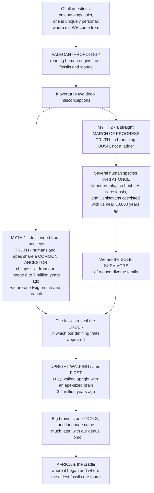

# 🦴 Paleoanthropology and Human Origins

> [!abstract] TL;DR
> Of all the questions paleontology asks, one is uniquely personal — *where did WE come from?* **Paleoanthropology** is the branch of paleontology that answers it, reading our own family's deep history from **fossils and stones** and confirming Darwin's most explosive claim: that humans, like all life, **evolved**. Its findings overturn two deep misconceptions. First, we did **not** evolve "from monkeys" — humans and the other apes share a **common ancestor**, and we are one twig on the ape branch of the tree of life (chimpanzees, our closest living cousins, split from our lineage ~6–7 million years ago). Second, human evolution was **not** a straight *march of progress* from hunched ape to upright man — that iconic image is deeply misleading. It was a branching **bush**: at many moments *several* human species lived at once (as recently as ~50,000 years ago our species shared the planet with **Neanderthals**, the "hobbit" *Homo floresiensis*, and **Denisovans**), and we are the sole survivors of a once-diverse family. The fossils even reveal the surprising *order* in which our defining traits arrived — **upright walking came FIRST**, millions of years before big brains, stone tools, language, and culture — and they point unambiguously to **Africa** as the cradle. Understanding paleoanthropology is understanding our own origin story, written not in myth but in bones and stones: the deepest, most humbling chapter of the human story, and paleontology turned upon ourselves.

---

## Intuition

**Analogy first — from a family album to a heavily pruned bush.** Every family has an origin story. Ours is not written in a photo album but in fossils buried across Africa and Eurasia and in stone tools chipped by ancestral hands, and paleoanthropology is the detective discipline that reconstructs it. Picture all seven-plus billion living humans as the single surviving **twig** at the end of a branch that was pruned, hard, over seven million years. The original growth was a dense **bush**: at many points at least half a dozen hominin species coexisted, occupying different niches across the Old World. Almost every branch died without descendants. One kept growing — ours.

That single image dismantles the two myths people carry about human origins. We are told, mockingly, that Darwin claimed we "come from monkeys." We do not: monkeys are our distant *cousins*, not our *ancestors*. Go back ~6–7 million years and you reach a **last common ancestor** we share with chimpanzees — an ape, neither human nor chimp, from whom both lineages branched. We are apes, one small twig on the ape branch of the tree of life. And we are told, in that famous cartoon of a stooping ape straightening into a striding businessman, that evolution is a **march of progress** — a ladder climbed rung by rung toward *us*. It is not. It is a bush with many branches, most of them dead ends. As recently as fifty thousand years ago — an eye-blink in deep time — our species shared the Earth with the thick-boned **Neanderthals** of Europe, the metre-tall **"hobbit"** *Homo floresiensis* on an Indonesian island, and the ghostly **Denisovans** of Asia, known first from DNA before any diagnostic skull was ever found. Several kinds of human, all at once. We are simply the last ones standing.

Most surprising of all, the fossils tell us the **order** in which we became human — and it is the opposite of what the cartoon implies. The defining trait did not arrive as one package. **Upright walking came first**, by millions of years. The famous "**Lucy**" — an *Australopithecus* who lived ~3.2 million years ago — already walked upright on two legs, yet carried a brain no bigger than a chimpanzee's. Big brains, stone tools, and eventually language and culture came *much* later, with our own genus *Homo*. Traits evolved piecemeal, at different times — biologists call this **mosaic evolution**. And every one of the oldest chapters is written in African rock, which is why Darwin, with no fossils in hand, predicted Africa would prove to be the cradle. He was right.

---

## How It Works

Paleoanthropology is paleontology aimed at ourselves, and like all paleontology it is a science of *converging clues*. But because the object of study is *us*, it fuses more disciplines than any other corner of the field: the **fossils** and comparative anatomy of physical anthropology; the **stone tools, hearths, and art** of archaeology; the **radiometric dates** that pin fossils to deep time; and, since the 2010s, the **ancient DNA and paleogenomics** that let us read the genomes of the dead. The logic runs the same way every time: assemble every independent line of evidence a fragmentary record offers, and let them cross-check one another into a testable story of descent.

1. **Define the clade.** A **hominin** is any species on the human side of the split from *Pan* (chimpanzees and bonobos) — everything closer to us than to chimps. The diagnostic first sign of membership is not a big brain but a body rebuilt for **habitual upright walking**.
2. **Read bipedalism from bone.** Upright walking leaves unmistakable anatomical signatures: the **foramen magnum** (the hole for the spinal cord) shifts from the back of the skull to its *base*, balancing the head atop a vertical spine; the **pelvis** shortens and flares into bowl-shaped blades; the **femur** angles inward to a *valgus* (knock-kneed) knee that stacks the body over one foot; the foot becomes **arched** with an adducted big toe. Where bone is absent, behavior sometimes survives directly — the **Laetoli footprints** (Tanzania, ~3.66 Ma) are a bipedal trackway pressed into volcanic ash by *Australopithecus* feet.
3. **Order the traits — mosaic evolution.** Plot when each trait first appears and a pattern emerges: **bipedalism (~7–4 Ma) → stone tools (~3.3–2.6 Ma) → rapid brain expansion (genus *Homo*, ~2 Ma onward) → symbolic/behavioural modernity (~0.05 Ma)**. Traits did *not* evolve as a bundle; each has its own debut.
4. **Map the bush, not the ladder.** Multiple hominin genera and species — *Sahelanthropus*, *Ardipithecus*, several *Australopithecus*, the robust *Paranthropus*, and many *Homo* — branched, overlapped, and mostly went extinct. Reconstructing their relationships is a **cladistics** problem, and the honest picture is a many-branched tree with much coexistence, not a single line.
5. **Anchor it in time and place.** Volcanic ash beds bracketing East African fossils are dated by **Ar/Ar radiometry**, giving hard ages; the richest records come from **Africa** — the Afar depression and Hadar (Lucy), Olduvai Gorge, and the South African caves of the Sterkfontein "Cradle of Humankind."
6. **Add the molecules.** Where preservation allows, **ancient DNA** reconstructs relationships the bones cannot, identifies groups known from *no* diagnostic skull (Denisovans), and detects interbreeding between coexisting species.
7. **Stay honest about the gaps.** The record is fragmentary — sometimes a single tooth or a crushed cranium carries a big claim — so debates rage between **"splitters"** (many species) and **"lumpers"** (few, variable ones), and the media's hunt for a single "missing link" badly misframes a branching bush.



---

## Key Concepts

### 🟢 Secondary

- **We share an ancestor with apes — we did not "come from monkeys."** Chimpanzees are our closest living relatives, but they are *cousins*, not *ancestors*. Rewind ~6–7 million years and human and chimp lineages meet in a **common ancestor** that was neither. Humans *are* apes — a single twig on the ape branch of the tree of life.
- **Upright walking came first.** The very first thing that made our ancestors "human" was not a big brain but walking on two legs. **"Lucy"** (*Australopithecus afarensis*, ~3.2 million years old) walked upright yet had a brain the size of a chimp's. Big brains came *millions* of years later.
- **A bush, not a ladder.** Human evolution was not a straight line from stooped ape to modern human. It was a **branching bush** in which *several* human species lived at the same time. As recently as ~50,000 years ago we shared the planet with Neanderthals, the tiny "hobbit," and the Denisovans. We are the only ones left.
- **Africa is the cradle.** The oldest hominin fossils, and the earliest stone tools, are found in **Africa** — especially the East African Rift Valley and the South African cave sites. This is where our story begins.
- **The evidence is bones and stones.** Paleoanthropology reads our deep history from **fossil bones** (what bodies looked like) and **stone tools** (what minds could do) — real physical evidence, not myth.

### 🟡 Undergraduate

- **What defines a hominin.** Membership in our lineage is marked first by **habitual bipedalism**, whose skeletal signatures are a basal **foramen magnum**, a short bowl-shaped **pelvis**, a **valgus knee**, and an **arched foot**. Encephalization and systematic tool use appear *later*, in genus *Homo*.
- **The Laetoli footprints.** A ~3.66-million-year-old trackway in volcanic ash at Laetoli, Tanzania, records *Australopithecus* walking fully upright — behavior fossilized directly, independent of any skeleton, and clinching early bipedalism.
- **Why walk upright? Competing hypotheses.** No single cause fits all evidence. The strongest candidates: **energy efficiency** (bipedal walking costs far less per kilometre than knuckle-walking, an edge for wide-ranging foragers); **thermoregulation** (an upright body intercepts less midday sun and sits in cooler, moving air above the ground); **freeing the hands** (to carry food, infants, and tools — probably an *exaptation*, not the primary driver, since the earliest bipeds lived in woodland, not open savanna).
- **Mosaic evolution and the order of traits.** Human features assembled *piecemeal*, not as a package: **bipedalism (~7–4 Ma) → stone tools (~3.3–2.6 Ma) → rapid encephalization (~2 Ma onward) → symbolic "behavioural modernity" (~0.05 Ma).** Reading this order is one of the field's central achievements.
- **The hominin bush.** A genuine diversity of forms: early hominins (*Sahelanthropus*, *Orrorin*, *Ardipithecus*), several gracile **australopiths**, the heavy-jawed robust **Paranthropus** (a specialized side-branch, *not* our ancestor), and multiple **Homo** species (*habilis*, *erectus*, *heidelbergensis*, *neanderthalensis*, *floresiensis*, Denisovans, *sapiens*). *Homo sapiens* is the sole survivor of this once-speciose group.
- **The African record and its sites.** The oldest, richest evidence clusters in Africa: the **Afar/Hadar** region and the **Great Rift Valley** of Ethiopia and Kenya, **Olduvai Gorge** in Tanzania, and the **Sterkfontein** caves of South Africa's "Cradle of Humankind."
- **Dating the fossils.** Hominin bones themselves are rarely datable; instead, **radiometric ⁴⁰Ar/³⁹Ar** dating of the volcanic ash (tuff) layers that *bracket* a fossil brackets its age, while methods such as uranium-series, ESR, OSL, and ¹⁴C cover younger cave contexts.

### 🔴 Graduate

- **The human place in evolution.** Humans are apes, apes are catarrhine primates, and the primate radiation is a Cenozoic story — situating human origins within the broader mammalian recovery. The **Pan–Homo last common ancestor** is dated to ~6–7 Ma by *convergent* molecular-clock and fossil evidence, though calibration and generation-time assumptions spread the estimate across ~4–8 Ma; publishing a single point date without error bounds is indefensible.
- **The "March of Progress" as a cladistic error.** The linear-ladder icon (Zallinger's *The Road to Homo Sapiens*, 1965) is not merely aesthetically dated — it is **phylogenetically wrong**. Ancestors and descendants are separated by many branch points; contemporaneous species are cousins, not steps. A cladistic framing (stem vs crown hominins, sister-taxon relationships, coexistence) replaces the ladder with a bush and dissolves the very idea of a single **"missing link."**
- **The tool record predates and overlaps genus *Homo*.** The **Lomekwi 3** artefacts (West Turkana, Kenya, ~3.3 Ma) push deliberate stone knapping back *before* the earliest *Homo* and into australopith time; the **Oldowan** (~2.6 Ma) and later **Acheulean** handaxes then track expanding cognition. Tool use is therefore *not* a clean "genus *Homo*" innovation — another blow to the package view.
- **Encephalization, its costs, and life history.** Brain expansion in *Homo* is quantified by the **encephalization quotient** (observed brain mass ÷ mass expected for body size; human EQ ≈ 7, chimp ≈ 2.5). Large brains are metabolically expensive; hypotheses (the *expensive-tissue* trade-off, dietary shifts to meat and cooked food, the *social brain*) tie encephalization to gut reduction, altered life history (extended childhood, later maturity), and behaviour. Crucially, encephalization *follows* bipedalism by millions of years — the fossil-order result the Python demo visualizes.
- **Splitters versus lumpers, and small-sample inference.** With many taxa named from *single* specimens or fragments, the field oscillates between over-splitting (every variant a new species) and over-lumping (broad, variable species). Distinguishing genuine biological species from sexual dimorphism, ontogenetic variation, and geographic clines from crushed, incomplete fossils is a persistent methodological hazard.
- **Integration with paleogenomics.** Ancient DNA has transformed the field: it defined the **Denisovans** from a finger bone with *no* diagnostic skull, and it revealed **introgression** (interbreeding) among coexisting species — evidence that hominin phylogeny is a **reticulate network**, not a clean bifurcating tree. This molecular layer is developed in the dedicated sibling note.
- **Taphonomy and the shape of the record.** The hominin fossil record is severely biased toward specific depositional settings (lake margins, volcanic ash falls, dolomitic caves), dense skeletal elements, and preservable teeth; apparent "gaps" and sudden "appearances" are often taphonomic and sampling artefacts rather than biological events — the reason big claims from few bones demand caution.

---

## Python Demo

```python
# PALEOANTHROPOLOGY & HUMAN ORIGINS -- two views that dismantle the two great myths:
#   (A) THE BRANCHING BUSH. Plot the temporal ranges (first -> last appearance) of
#       major hominin species over the last ~7 Myr. The picture is NOT a single
#       lineage (a "ladder") but a BUSH in which MANY species COEXISTED -- as
#       recently as ~50 kyr ago Homo sapiens shared Earth with Neanderthals,
#       Denisovans, and the "hobbit" Homo floresiensis. We are the SOLE survivor.
#   (B) MOSAIC EVOLUTION. Plot cranial capacity (brain size) versus time across
#       species, with the timing of key trait FIRSTS marked. Bipedalism appears
#       FIRST (~7-4 Ma), millions of years before the big-brain surge -- traits
#       arrive PIECEMEAL, not as a package, and bipedalism precedes encephalization.
# Pure numpy + matplotlib, fully runnable.

import numpy as np
import matplotlib.pyplot as plt

# ---- Hominin taxa: (name, first_Ma, last_Ma, cranial_cc_or_None, group) ----
# group: 0 = early hominins / australopiths / Paranthropus, 1 = genus Homo
species = [
    ("Sahelanthropus tchadensis",   7.00, 6.00, 360,  0),
    ("Orrorin tugenensis",          6.10, 5.70, None, 0),
    ("Ardipithecus ramidus",        4.50, 4.30, 325,  0),
    ("Au. anamensis",               4.20, 3.80, 370,  0),
    ("Au. afarensis  (LUCY)",       3.90, 2.90, 430,  0),
    ("Au. africanus",               3.30, 2.10, 460,  0),
    ("Paranthropus boisei",         2.30, 1.20, 500,  0),
    ("Paranthropus robustus",       2.00, 1.20, 530,  0),
    ("Homo habilis",                2.40, 1.40, 610,  1),
    ("Homo erectus",                1.90, 0.11, 950,  1),
    ("Homo heidelbergensis",        0.70, 0.20, 1250, 1),
    ("Denisovans (DNA only)",       0.40, 0.05, None, 1),
    ("Homo floresiensis (hobbit)",  0.19, 0.05, 420,  1),
    ("Homo neanderthalensis",       0.43, 0.04, 1450, 1),
    ("Homo sapiens",                0.31, 0.00, 1350, 1),
]

C_EARLY, C_HOMO = "#b45309", "#1d4ed8"   # brown = early hominins, blue = Homo

# --- coexistence check: how many species were alive ~50,000 years ago? ---
t_recent = 0.05  # Ma
alive_50k = [s[0] for s in species if s[1] >= t_recent >= s[2]]

# --- fossil-order result: bipedalism (Ardi, unambiguous) vs big brains (>900 cc) ---
first_biped = 4.4                                             # Ardipithecus, Ma
first_bigbrain = max(f for _, f, _, cc, _ in species if cc and cc > 900)  # Homo erectus
gap_myr = first_biped - first_bigbrain

print("PALEOANTHROPOLOGY -- reading our origins from bones and stones\n")
print(f"(A) Species ALIVE ~50,000 yr ago (a BUSH, not a ladder): {len(alive_50k)}")
for n in alive_50k:
    print(f"      - {n}")
print(f"    ...and today only ONE remains -> Homo sapiens is the sole survivor.\n")
print("(B) FOSSIL ORDER OF TRAITS (mosaic evolution):")
print(f"      upright walking clear by ~{first_biped:.1f} Ma (Ardipithecus)")
print(f"      brains > 900 cc only by ~{first_bigbrain:.2f} Ma (Homo erectus)")
print(f"      => bipedalism PRECEDES big brains by ~{gap_myr:.1f} million years")
print("      (Lucy, 3.2 Ma, already walked upright with a ~430 cc ape-sized brain)\n")

# ======================================================================
# Plot
# ======================================================================
fig, (axA, axB) = plt.subplots(1, 2, figsize=(15, 6.4))

# --- (A) THE BRANCHING BUSH: temporal ranges of hominin species ---
y = np.arange(len(species))[::-1]  # oldest species at top
for (name, f, l, cc, g), yi in zip(species, y):
    col = C_EARLY if g == 0 else C_HOMO
    axA.barh(yi, f - l, left=l, height=0.62, color=col, alpha=0.85,
             edgecolor="black", linewidth=0.4)
axA.set_yticks(y)
axA.set_yticklabels([s[0] for s in species], fontsize=7.5)
axA.set_xlim(7.5, -0.35)                 # PAST on the left, PRESENT (0) on the right
axA.set_xlabel("Millions of years ago (Ma)")
axA.set_title("(A) The hominin BUSH: many species COEXISTED\n"
              "(not a single ladder to us)", weight="bold", fontsize=11)

# Pan-Homo split, and the ~50 ka window of recent coexistence
axA.axvline(6.5, color="#7c3aed", ls="--", lw=1.4)
axA.text(6.5, len(species) - 0.2, "Pan-Homo split\n~6-7 Ma",
         color="#7c3aed", fontsize=7.5, ha="center", va="bottom")
axA.axvspan(0.06, 0.0, color="#16a34a", alpha=0.12)
axA.text(0.05, -0.9, "~50 ka:\n4 human species\ncoexist", color="#166534",
         fontsize=7.5, ha="center", va="top")
axA.annotate("SOLE SURVIVOR", xy=(0.0, y[-1]), xytext=(1.6, y[-1] - 1.4),
             arrowprops=dict(arrowstyle="->", color="#dc2626"),
             color="#dc2626", fontsize=8.5, weight="bold")
axA.grid(axis="x", alpha=0.25)

# proxy legend
from matplotlib.patches import Patch
axA.legend(handles=[Patch(color=C_EARLY, label="early hominins / australopiths"),
                    Patch(color=C_HOMO,  label="genus Homo")],
           fontsize=8, loc="lower left")

# --- (B) MOSAIC EVOLUTION: brain size vs time + trait-timing markers ---
mid  = np.array([(f + l) / 2 for _, f, l, cc, _ in species if cc])
ccs  = np.array([cc          for _, f, l, cc, _ in species if cc])
grp  = np.array([g           for _, f, l, cc, g in species if cc])
nm   = [n                    for n, f, l, cc, _ in species if cc]

axB.scatter(mid[grp == 0], ccs[grp == 0], s=90, color=C_EARLY,
            edgecolor="black", linewidth=0.5, zorder=5,
            label="early hominins / australopiths")
axB.scatter(mid[grp == 1], ccs[grp == 1], s=90, color=C_HOMO,
            edgecolor="black", linewidth=0.5, zorder=5, label="genus Homo")

# label a few landmark taxa
for label_t, label_cc, txt, dx, dy in [
    (3.40, 430, "LUCY ~430 cc\n(upright, tiny brain)", 0.15, -140),
    (0.24, 1450, "Neanderthal ~1450 cc", 0.9, 30),
    (0.15, 1350, "H. sapiens", -0.15, -170),
]:
    axB.annotate(txt, xy=(label_t, label_cc), xytext=(label_t + dx, label_cc + dy),
                 fontsize=7.5, color="#334155",
                 arrowprops=dict(arrowstyle="->", color="#94a3b8", lw=0.8))

# trait-timing markers (mosaic evolution): the ORDER traits first appear
axB.axvspan(7.0, 4.0, color="#f59e0b", alpha=0.10)
axB.text(5.5, 1520, "BIPEDALISM\nestablished FIRST", color="#b45309",
         fontsize=8, ha="center", weight="bold")
axB.axvline(3.3, color="#0f766e", ls=":", lw=1.6)
axB.text(3.3, 250, "stone tools\n~3.3 Ma\n(Lomekwi)", color="#0f766e",
         fontsize=7, ha="center")
axB.axvline(2.6, color="#0f766e", ls=":", lw=1.2)
axB.axvspan(2.0, 0.0, color="#1d4ed8", alpha=0.06)
axB.text(1.0, 1560, "ENCEPHALIZATION\nsurge (genus Homo)", color="#1d4ed8",
         fontsize=8, ha="center", weight="bold")

axB.set_xlim(7.5, -0.35)                 # PAST on the left, PRESENT on the right
axB.set_ylim(150, 1650)
axB.set_xlabel("Millions of years ago (Ma)")
axB.set_ylabel("Cranial capacity (cc)")
axB.set_title("(B) MOSAIC evolution: bipedalism came FIRST,\n"
              "big brains millions of years later", weight="bold", fontsize=11)
axB.legend(fontsize=8, loc="center left")
axB.grid(alpha=0.25)

plt.tight_layout()
plt.savefig("paleoanthropology_human_origins.png", dpi=120)
plt.show()

# Takeaways:
# (A) At ~50 ka the Earth held SEVERAL human species at once -- a bush, not a
#     ladder -- and Homo sapiens is simply the last twig still growing.
# (B) Brain size stays ape-sized (~400-500 cc) for MILLIONS of years of upright
#     walking, then surges only inside genus Homo: traits are MOSAIC, and
#     bipedalism unambiguously PRECEDES encephalization.
```

Panel A is the anti-ladder: horizontal bars show that at many moments — and dramatically at ~50,000 years ago — **several** hominin species were alive *simultaneously*, and only one bar (ours) reaches the present. Panel B is the mosaic-evolution result made visible: cranial capacity hovers at ape-sized values (~400–500 cc) through *millions* of years of confirmed upright walking, and only *inside genus Homo* does it surge — so **bipedalism came first, encephalization much later**, exactly as Lucy (upright, ~430 cc, 3.2 Ma) foretold. The two panels together kill both myths at once: no ladder, and no single "big-brained ape" package.

---

## Real-World Applications

- **"Lucy" and the Afar (Hadar, Ethiopia).** The 1974 discovery of *Australopithecus afarensis* specimen AL 288-1 — ~40% of a single skeleton, ~3.2 Ma — proved bipedalism preceded brain expansion and became the field's most famous fossil. Named for the Beatles' *Lucy in the Sky with Diamonds* playing at the camp, she anchored the East African Rift as a fossil goldmine.
- **The Laetoli footprints (Tanzania).** A ~3.66-Ma trackway of upright walkers pressed into volcanic ash — *behavior* fossilized directly — independently confirms early bipedal gait without needing any skeleton, and is a textbook example of trace-fossil evidence in human origins.
- **The Cradle of Humankind (Sterkfontein, South Africa).** Raymond Dart's 1925 **Taung Child** (*Australopithecus africanus*) was the first evidence that human origins lay in Africa — initially rejected by a Eurocentric establishment expecting a big brain first. The Sterkfontein caves have since yielded hundreds of hominin fossils.
- **Olduvai Gorge and the Oldowan.** The Leakeys' work at Olduvai (Tanzania) tied early *Homo* to the oldest widely recognized stone-tool industry (**Oldowan**, ~2.6 Ma), grounding the study of technological and cognitive evolution — and giving the Paleolithic its opening chapter.
- **Lomekwi 3 and the pre-*Homo* tools.** The 2015 report of ~3.3-Ma knapped stones from West Turkana (Kenya) pushed deliberate tool-making back *before* the genus *Homo*, forcing a rethink of the once-tidy "*Homo* the toolmaker" story and reinforcing the mosaic picture.
- **Denisovans from a fingertip.** A single finger bone and a few teeth from Denisova Cave (Siberia) yielded a genome that defined an *entirely new* human group with no diagnostic skull — the first hominin taxon named from DNA alone — demonstrating how paleogenomics now reshapes the family tree paleoanthropology once read from bones only.

---

## Common Pitfalls

- **The "March of Progress" fallacy** — depicting evolution as a straight climb from stooped ape to striding modern human. Reality is a **branching bush** with much coexistence; contemporaneous species are cousins, not rungs, and evolution has no predetermined goal. *H. sapiens* did not descend *from* Neanderthals — the two coexisted.
- **"We came from monkeys."** We did not descend from any living primate. Humans and other apes (and, further back, monkeys) share **common ancestors**; monkeys are distant cousins on their own branches, not our forebears.
- **The "missing link" framing** — heralding each new fossil as *the* single gap-filler. In a bushy phylogeny with many branch points and coexisting lineages, the notion of one missing link is biologically incoherent; there is no lone gap to plug.
- **Assuming a trait "package."** Treating bipedalism, big brains, tools, and language as arriving together. They did not — human features evolved **mosaically**, at very different times, with upright walking first by millions of years.
- **Over-splitting or over-lumping from fragments.** Big taxonomic claims resting on single teeth or crushed crania invite both inflation (every variant a new species) and deflation (all variation lumped away). Sexual dimorphism, growth stages, and geographic variation are easily mistaken for species differences.
- **Over-precision on the *Pan–Homo* split.** Different clock calibrations and generation-time assumptions spread the divergence across ~4–8 Ma; quoting a single year without error bounds is misleading. The defensible statement is "~6–7 million years, with real uncertainty."
- **Reading "Africa only" as "simple."** An African origin does not mean a single, linear, tidy story. The African record is itself deep, diverse, and reticulate, and later dispersals interbred with archaic populations they met — the story is a network, not a line.

---

## Related Concepts

This note is the **opener of Section 06 (Human Evolution and Modern Paleontology)** and frames the siblings that follow, referenced here in prose so they wire once written: the vault hub *Paleontology and Deep Time Overview* (where this chapter sits in the whole story of life); *The Hominin Fossil Record* (the detailed cast of species, sites, and specimens sketched here only in overview); *Ancient DNA and Paleogenomics* (the molecular layer that defined the Denisovans and revealed interbreeding among coexisting hominins); *Cenozoic Life and the Age of Mammals* (the primate radiation from which apes, and we, emerged); and *Cladistics and Fossil Phylogeny* (the tree-thinking that replaces the "March of Progress" ladder with a branching bush).

Verified cross-vault links to existing notes:

- [[Human_Evolution_and_Paleoanthropology]] — the **Anthropology-vault** companion; this paleontology opener frames human origins *within deep time and the fossil record*, while that note develops the genetics, ancient-DNA, and biological-anthropology detail (a distinct, deliberately complementary treatment)
- [[Human_Origins_and_the_Paleolithic]] — the **archaeological** side of the same story: the stone-tool cultures (Oldowan, Acheulean, Mousterian, Upper Paleolithic) whose *cognitive* evolution parallels the *anatomical* record read here
- [[Natural_Selection_and_Adaptation]] — the evolutionary *mechanism* underlying every hominin trait; bipedalism, encephalization, and tool use are adaptations (and exaptations) shaped by selection
- [[Evidence_for_Evolution]] — the hominin fossils and transitional forms are among the most direct evidence for evolution, and confirm Darwin's most contested claim: that humans, too, evolved
- [[The_History_of_Life_on_Earth]] — the whole deep-time narrative into which human origins fit as a very recent, contingent final chapter
- [[Phylogenetics_and_the_Tree_of_Life]] — the tree-thinking that places humans as *one twig on the ape branch* and reframes the "ladder" as a bush

---

## Review Questions

### Secondary

1. Two common ideas about human origins are wrong: that we "come from monkeys," and that evolution is a straight march from ape to man. Explain what is actually true in each case, using the ideas of a *common ancestor* and a *branching bush*.
2. Which came first in human evolution — upright walking or big brains? Name the fossil that best demonstrates your answer and explain what makes it decisive.
3. Why do scientists say Africa is the "cradle of humankind"? Give two kinds of evidence found there.

### Undergraduate

1. Describe four skeletal features that reveal habitual bipedalism in a fossil hominin, and explain why the **Laetoli footprints** provide evidence that is independent of any of them.
2. State the sequence in which bipedalism, stone tools, encephalization, and behavioural modernity first appear in the record, with approximate dates. Explain what "**mosaic evolution**" means and why it argues against a single "big-brained toolmaker" package.
3. A colleague dates a hominin cranium by radiocarbon and reports an age of 1.9 Ma. Why is this result almost certainly wrong, and what dating method *should* have been used for an East African fossil of that age? Explain the principle of the correct method.

### Graduate

1. The "March of Progress" icon is not just outdated art but a *cladistic* error. Explain, using the concepts of stem vs crown groups, sister taxa, and coexistence, why the linear ladder misrepresents hominin phylogeny — and why the popular "missing link" idea is incoherent in a bushy tree.
2. The discovery of ~3.3-Ma stone tools at **Lomekwi 3** and the definition of the **Denisovans** from DNA alone each complicated a previously tidy story. For *each*, state the earlier consensus it disrupted and what it implies about how paleoanthropology now integrates archaeology and paleogenomics with the fossil record.
3. You recover a single, robust hominin molar from a 2.0-Ma East African deposit and must decide whether it represents a new species. Discuss the "splitters vs lumpers" problem: which sources of within-species variation (sexual dimorphism, ontogeny, geographic clines) could mimic a species difference, how bracketing volcanic tuffs constrain the age, and what would make you cautious about a big taxonomic claim from one tooth.

---

## Sources

- Stringer, C. & Andrews, P. (2011). *The Complete World of Human Evolution*, 2nd ed. Thames & Hudson.
- Johanson, D. & Edey, M. (1981). *Lucy: The Beginnings of Humankind*. Simon & Schuster.
- Wood, B. (2019). *Human Evolution: A Very Short Introduction*, 2nd ed. Oxford University Press.
- Antón, S. C., Potts, R. & Aiello, L. C. (2014). "Evolution of early *Homo*: An integrated biological perspective." *Science*, 345(6192), 1236828.
- Harmand, S. et al. (2015). "3.3-million-year-old stone tools from Lomekwi 3, West Turkana, Kenya." *Nature*, 521, 310–315.

---

#paleontology #paleoanthropology #human-origins #bipedalism #hominins
