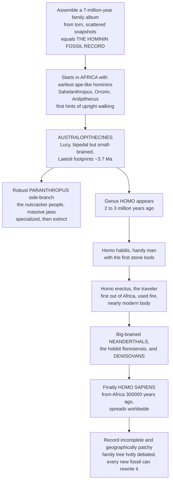

# 🦴 The Hominin Fossil Record

> [!abstract] TL;DR
> The **hominin fossil record** is the physical evidence for our own evolution: a growing but still-fragmentary collection of **skulls, teeth, and bones** that traces the human lineage over roughly **seven million years**, from ape-like African beginnings to a globe-spanning modern species. It begins in **Africa** with the earliest, most ape-like hominins (*Sahelanthropus*, *Orrorin*, *Ardipithecus* — first hints of **upright walking**), continues through the small-brained but fully **bipedal australopithecines** (*Australopithecus afarensis* — **"Lucy"** — and the 3.7-million-year-old **Laetoli footprints**), with the heavy-chewing robust **Paranthropus** as a specialized "nutcracker" side-branch that went extinct. Around **2–3 million years ago** our own genus **Homo** appears — *Homo habilis* ("handy man," first stone tools), then **Homo erectus**, the great traveler who was the **first hominin out of Africa**, spread across Asia, had nearly modern body proportions, and likely used **fire**. Later come the big-brained **Neanderthals** (cold-adapted, sophisticated — *not* dumb brutes), the tiny **"hobbit"** *Homo floresiensis*, the DNA-defined **Denisovans**, and finally our own species, **Homo sapiens**, arising in Africa **~300,000 years ago** and spreading worldwide. The record is famously **incomplete and hotly debated** — every new fossil can rewrite the family tree — which makes it both the crowning subject and the humbling test-case of paleontology applied to ourselves.

## Intuition

**Analogy first — assembling a family photo album spanning seven million years, from torn scattered snapshots.** Imagine you inherit an old family album that is supposed to document your ancestry back seven million years — except almost every page is missing, and the few photos that survive are torn, faded, and out of order. From this handful of ruined snapshots you must reconstruct the whole story: **who is who**, **who is related to whom**, and crucially, **who your actual ancestors were versus who was merely a distant cousin** who left no living descendants. You cannot simply line the pictures up and read off a straight line of grandparents; you have to argue, from a jawbone here and a partial skull there, about which face belongs on which branch.

That album is the **hominin fossil record** — the physical bones of human evolution. Walking through it roughly in order: it opens in **Africa** with the earliest, most ape-like hominins (~7–4 million years ago — *Sahelanthropus*, *Ardipithecus*, showing the first hints of standing upright). Then come the **australopithecines** (~4–2 Ma) — small-brained but fully **bipedal**, made famous by **"Lucy"** and the **Laetoli footprints** — alongside a robust side-branch, **Paranthropus**, that evolved massive jaws for heavy chewing (the "nutcracker people") before dying out. Around **2–3 million years ago** our own genus, **Homo**, appears: *Homo habilis* ("handy man," linked to the first stone tools), then **Homo erectus**, the great traveler who first left Africa, spread across Asia, had nearly modern proportions, and likely tamed **fire**. Later come the big-brained species — the **Neanderthals** (cold-adapted, skilled Europeans, emphatically *not* dumb brutes), the tiny **hobbit** *Homo floresiensis*, the **Denisovans** — and finally our own species, **Homo sapiens**, arising in Africa ~300,000 years ago and eventually spreading over the whole planet. Because the album is so incomplete, experts argue fiercely over which snapshot is ancestral to which, and every new find can reshuffle the pages. Understanding the hominin fossil record *is* walking through the actual physical evidence for how we came to be human.

---

## How It Works

### Core Mechanics

1. **What "hominin" means.** A **hominin** is any species on the human side of the split from chimpanzees — modern humans plus all our extinct ancestors and close relatives after that divergence (roughly **7 million years ago**). The record is the set of fossils, footprints, and associated tools documenting this lineage. It is **geographically and temporally patchy**: rich in a few fossil-rich basins (East and South Africa's rift valleys and cave systems), blank across whole continents and epochs.
2. **The earliest hominins (~7–4 Ma).** *Sahelanthropus tchadensis* (Chad, ~7 Ma), *Orrorin tugenensis* (Kenya, ~6 Ma), and *Ardipithecus* (*kadabba* ~5.8 Ma, *ramidus* "**Ardi**" ~4.4 Ma) show a **mosaic** of ape and hominin traits and early, possibly **facultative bipedalism** (a forward-placed foramen magnum, a divergent grasping big toe in Ardi). They sit near the **human–chimpanzee divergence**.
3. **The australopithecines (~4.2–2 Ma).** The gracile genus **Australopithecus** (*anamensis*, *afarensis* — **Lucy** — *africanus* — the **Taung Child** — and *sediba*) combined **full bipedality** with **small ape-sized brains (~350–500 cc)**. The **Laetoli trackways** (~3.7 Ma) are direct footprint evidence of upright walking. The robust **Paranthropus** (*boisei*, *robustus*) evolved **massive molars, flaring cheekbones, and sagittal crests** for heavy plant chewing — a specialized dead-end that went extinct ~1.2 Ma. The **earliest stone tools** appear here: **Lomekwian** (~3.3 Ma) and **Oldowan** (~2.6 Ma).
4. **The genus *Homo* (~2.8 Ma onward).** **Early *Homo*** (*habilis*, *rudolfensis*) shows **larger brains** and association with Oldowan tools — "**handy man**." Then the pivotal **Homo erectus / ergaster** (~1.9 Ma): nearly modern body proportions, a larger brain, **Acheulean handaxes**, likely control of **fire**, and — decisively — the **first hominin to leave Africa** (Dmanisi in Georgia ~1.8 Ma, **Java Man**, **Peking Man**). It was long-lived and widespread, persisting past **100,000 years ago**.
5. **Recent diversity and our origins.** The last few hundred thousand years held **several human species at once**: the cold-adapted, large-brained **Neanderthals** (sophisticated tools, burial, culture); the **Denisovans** (defined largely by **ancient DNA**); the island-dwarfed **"hobbit"** *Homo floresiensis*; plus *Homo naledi* and *Homo luzonensis*. **Homo sapiens** — anatomically modern humans — arose in **Africa ~300,000 years ago** (**Jebel Irhoud**, **Omo Kibish**, **Herto**), developed **behavioral modernity**, and dispersed **out of Africa**, replacing and partly **interbreeding with** other *Homo*.
6. **Reading the record.** Paleoanthropologists track **anatomical trends** — **encephalization** (rising brain size), **dentition and diet** (tooth size and enamel), **postcranial/locomotor** change (from tree-climbing to obligate bipedalism), and **face and skull** form — while **dating** sites radiometrically, correcting for **taphonomy**, and arguing over a **sparse, contested phylogeny** (splitters vs lumpers; a "bushy," not ladder-like, tree).

### Flow / Architecture



---

## Key Concepts

### Secondary Level

**Hominins are humans and our extinct relatives.** After our lineage split from chimpanzees around **7 million years ago**, many different upright-walking, increasingly big-brained species lived and died in Africa and beyond. **We are the only one left.** The fossils of the others — their skulls, teeth, and bones — are the hominin fossil record.

**Two big changes came in a surprising order.** First our ancestors started **walking upright** (bipedalism) while still having **small, ape-sized brains** — Lucy, at 3.2 million years old, walked on two legs but had a brain about the size of a chimp's. **Only much later did big brains evolve.** Upright walking came first; big brains came second.

**The cast, in rough order:**
- **Earliest hominins** (~7–4 Ma) — very ape-like, first signs of standing up (*Ardi*).
- **Australopithecines** (~4–2 Ma) — small-brained but fully upright (**Lucy**; the **Laetoli footprints**). A tough-chewing cousin, **Paranthropus** ("nutcracker man"), went extinct.
- **Early *Homo*** (~2.5 Ma) — bigger brains, **first stone tools** ("handy man").
- **Homo erectus** (~1.9 Ma) — the **great traveler**, first to leave Africa, first to likely use **fire**.
- **Neanderthals, the "hobbit," and Denisovans** — other smart human species that shared the planet with us.
- **Homo sapiens** (~300,000 years ago) — us, first appearing in **Africa**, then spreading everywhere.

**The album has missing pages.** The record is famously **incomplete**, so scientists **argue** about who is really our ancestor and who is just a cousin. Every important new fossil can change the family tree.

### Undergraduate Level

**A bush, not a ladder.** The old "March of Progress" image — a single line from ape to man — is wrong. Hominin evolution is a **branching bush** with many **coexisting species**; for most of the last few million years, **more than one hominin species was alive at the same time**. Only very recently did we become the sole survivors. The debate between **"splitters"** (who recognize many species) and **"lumpers"** (who merge variable fossils into fewer species) reflects how hard it is to draw species boundaries from fragmentary bones.

**The earliest hominins and the divergence context.** *Sahelanthropus*, *Orrorin*, and *Ardipithecus* show a **mosaic** of ape-like (long arms, grasping foot in *Ardi*) and derived traits (a foramen magnum shifted forward, implying head balanced over an upright spine). They bracket the **human–chimp last common ancestor**, which molecular clocks place ~6–8 Ma.

**The australopithecine grade.** *Australopithecus afarensis* (**Lucy**, "First Family," and the **Laetoli** trackmakers) is the best-known: obligate biped, ~**1 m tall**, brain ~**400–500 cc**, retaining some climbing adaptations (curved fingers). Gracile forms (*afarensis*, *africanus*, *sediba*, *anamensis*) contrast with the **robust Paranthropus** (*boisei*, *robustus*), whose **hyper-thick enamel, huge molars, and sagittal crests** signal a diet of hard/tough plants — a specialized branch that flourished then vanished. Stone-tool manufacture (**Oldowan** ~2.6 Ma, and the earlier **Lomekwian** ~3.3 Ma) begins in this window, straddling the *Australopithecus*/*Homo* boundary.

**The genus *Homo* and the first dispersal.** Early *Homo* (*habilis*/*rudolfensis*) shows brain expansion and tool use. **Homo erectus** is the hinge of the story: **modern-like limb proportions and stature** (the Nariokotome "Turkana Boy"), **Acheulean bifaces**, evidence for **fire and cooperative foraging**, and the **first expansion out of Africa** — **Dmanisi (~1.8 Ma)**, Java, and China. Later archaic humans (*Homo heidelbergensis*, *antecessor*) bridge toward the big-brained species.

**Recent humans and our own origin.** **Neanderthals** were **cold-adapted Eurasians** with brains as large as ours, complex Mousterian tools, hafting, fire, hunting of big game, and evidence of **burial and symbolic behavior** — the "brutish caveman" stereotype is obsolete. **Denisovans** are known mainly from **DNA and a few bones/teeth**. *Homo floresiensis* (the **"hobbit,"** Flores) is a striking case of **island dwarfism**. **Homo sapiens** appears in **Africa ~300 ka** (**Jebel Irhoud** in Morocco pushed the date back), and the **Out-of-Africa** dispersal (main pulse ~60–70 ka) spread modern humans worldwide, absorbing traces of Neanderthals and Denisovans along the way.

### Graduate Level

**Encephalization, not brute brain size.** The meaningful trend is in the **encephalization quotient (EQ)** — brain size relative to body size — which climbs from australopith values (~2.5) to ~**3** in early *Homo* and ~**5–6** in *sapiens*/Neanderthals. Absolute cranial capacity rises from **~350–500 cc** (australopiths) through **~600–900 cc** (*habilis*/early *erectus*) to **~1200–1500 cc** (later *Homo*), with the **steepest acceleration inside the genus *Homo*** over the last ~2 Myr. Interpreting the tempo requires disentangling within-species variation, sexual dimorphism, and body-size scaling from genuine grade shifts.

**Postcranial and dietary transitions decoupled in time.** Locomotor evidence (pelvis shape, femoral neck, foramen magnum position, the **Laetoli** and Ileret footprints) shows **committed bipedalism by ~4 Ma**, long before brain expansion — a decoupling that overturns older "brain-led" narratives. Dental evidence (**microwear**, stable-isotope **δ¹³C** signaling C3 vs C4 resources, enamel thickness) tracks dietary breadth: robust *Paranthropus* specializing on tough/abrasive C4 foods, *Homo* broadening toward **higher-quality, possibly meat- and tuber-rich** diets, plausibly coupled to tool use and later cooking.

**Phylogenetic instability and the species problem.** Hominin systematics is unusually **contested** because samples are small, temporally strung out, and morphologically variable. Character conflict, **homoplasy**, and ambiguity over whether variation is **intraspecific** or **interspecific** drive the splitter/lumper divide (see Wood & Collard's critique of what even belongs in *Homo*). Fossil-record **biases** — collection failure, preservation windows, restricted geography — mean **absence is weak evidence**, and each major find (Dmanisi's variable crania, *Homo naledi*, *Homo luzonensis*, Denisovan molars) can force reticulate rather than strictly branching topologies.

**Genomics rewrites the tree.** **Ancient DNA and paleogenomics** transformed the field: Neanderthal and **Denisovan** genomes reveal **interbreeding** (non-African humans carry ~2% Neanderthal DNA; some populations carry Denisovan ancestry), turning the late-*Homo* "tree" into a **braided network**. Denisovans were defined almost entirely by genetics before diagnostic fossils — a paradigm shift in how a hominin taxon can be established. Genomics also constrains divergence dates and effective population sizes, integrating with the fossil and archaeological records.

**Dating and taphonomy as the backbone.** Chronology rests on **radiometric methods** — **⁴⁰Ar/³⁹Ar** on volcanic tuffs interbedded with East African fossils, **paleomagnetic** correlation, **U-series**, **ESR**, and, for the last ~50 kyr, **radiocarbon**. Reliable phylogeny and trend analysis are impossible without secure ages, and **taphonomy** (why some skeletons preserve — cave traps like Sterkfontein and Rising Star, lakeshore burial in the Turkana Basin) shapes what the record can and cannot show.

---

## Python Demo

```python
# The Hominin Fossil Record
# (a) HOMININ TIMELINE / SPECIES RANGES: plot the temporal ranges of the major
#     hominin species across the last ~7 Myr, color-coded by group, showing the
#     OVERLAPS (many human species alive at once) and the arc from early African
#     forms to the global spread of Homo. Out-of-Africa dispersals are annotated.
# (b) ENCEPHALIZATION: cranial capacity (brain size) vs time across hominins --
#     the rise from ~350-450 cc in australopiths to ~1350-1450 cc in
#     sapiens/Neanderthals, with the ACCELERATION inside the genus Homo.
import numpy as np
import matplotlib.pyplot as plt

# ---- (a) SPECIES TEMPORAL RANGES (Ma before present; start = older, end = younger) ----
# (name, start_Ma, end_Ma, group)
species = [
    ("Sahelanthropus",      7.0, 6.8, "early"),
    ("Orrorin",             6.1, 5.7, "early"),
    ("Ardipithecus",        5.8, 4.3, "early"),
    ("Au. anamensis",       4.2, 3.8, "australopith"),
    ("Au. afarensis (Lucy)",3.9, 2.9, "australopith"),
    ("Au. africanus",       3.3, 2.1, "australopith"),
    ("Au. sediba",          2.0, 1.9, "australopith"),
    ("Paranthropus",        2.7, 1.2, "robust"),
    ("Homo habilis",        2.4, 1.5, "homo"),
    ("Homo erectus",        1.9, 0.11,"homo"),
    ("H. heidelbergensis",  0.70,0.20,"homo"),
    ("H. floresiensis",     0.19,0.05,"homo"),
    ("H. naledi",           0.34,0.24,"homo"),
    ("Neanderthals",        0.43,0.04,"homo"),
    ("Denisovans",          0.40,0.05,"homo"),
    ("Homo sapiens",        0.30,0.0, "sapiens"),
]

group_color = {
    "early":        "#8d6e63",   # earliest ape-like hominins
    "australopith": "#f4a261",   # gracile australopithecines (Lucy)
    "robust":       "#c0392b",   # robust Paranthropus side-branch
    "homo":         "#2a7f9e",   # genus Homo
    "sapiens":      "#2a9d8f",   # us
}
group_label = {
    "early": "Earliest hominins", "australopith": "Australopithecus (gracile)",
    "robust": "Paranthropus (robust)", "homo": "Genus Homo", "sapiens": "Homo sapiens",
}

fig, (ax1, ax2) = plt.subplots(1, 2, figsize=(15, 6.5))

for i, (name, start, end, grp) in enumerate(species):
    y = len(species) - i
    ax1.barh(y, width=(start - end), left=end, height=0.7,
             color=group_color[grp], edgecolor="black", linewidth=0.5, zorder=3)
    ax1.text(start + 0.08, y, name, va="center", ha="left", fontsize=8.5)

# Out-of-Africa dispersal markers
ax1.axvline(1.8, color="#6a1b9a", ls="--", lw=1.4, alpha=0.8, zorder=2)
ax1.text(1.8, len(species) + 0.9, "Homo erectus\nOUT OF AFRICA\n~1.8 Ma (Dmanisi)",
         color="#6a1b9a", fontsize=7.5, ha="center", va="bottom")
ax1.axvline(0.065, color="#00695c", ls="--", lw=1.4, alpha=0.8, zorder=2)
ax1.text(0.065, len(species) + 0.9, "H. sapiens\nOUT OF AFRICA\n~65 ka",
         color="#00695c", fontsize=7.5, ha="center", va="bottom")

ax1.set_xlim(7.6, -0.6)            # older on LEFT, present on RIGHT
ax1.set_ylim(0.2, len(species) + 2.4)
ax1.set_xlabel("Millions of years ago (Ma)")
ax1.set_yticks([])
ax1.set_title("(a) Hominin species ranges over ~7 Myr\nmany species overlap; the tree is a bush, not a ladder")
handles = [plt.Rectangle((0, 0), 1, 1, color=group_color[g]) for g in group_label]
ax1.legend(handles, list(group_label.values()), loc="lower left", fontsize=8, framealpha=0.9)
ax1.grid(True, axis="x", alpha=0.3)

# ---- (b) CRANIAL CAPACITY (encephalization) vs TIME ----
# representative age (Ma) and mean cranial capacity (cc)
brain = [
    ("Sahelanthropus", 7.0,  360, "early"),
    ("Ardipithecus",   4.4,  325, "early"),
    ("Au. afarensis",  3.2,  450, "australopith"),
    ("Au. africanus",  2.8,  460, "australopith"),
    ("Paranthropus",   1.8,  520, "robust"),
    ("Homo habilis",   1.9,  640, "homo"),
    ("Homo erectus",   1.0,  980, "homo"),
    ("H. heidelberg.", 0.5, 1250, "homo"),
    ("Neanderthals",   0.10,1450, "homo"),
    ("Homo sapiens",   0.05,1350, "sapiens"),
]
ages  = np.array([b[1] for b in brain])
ccs   = np.array([b[2] for b in brain])

for name, age, cc, grp in brain:
    ax2.scatter(age, cc, s=110, color=group_color[grp], edgecolor="black",
                linewidth=0.6, zorder=4)
    ax2.text(age, cc + 35, name, fontsize=8, ha="center")

# smooth trend line through the points (older -> younger)
srt = np.argsort(-ages)
ax2.plot(ages[srt], ccs[srt], color="#555", lw=1.4, ls="-", alpha=0.7, zorder=2)

# shade the genus-Homo acceleration window
ax2.axvspan(0.0, 2.5, color="#2a7f9e", alpha=0.08, zorder=1)
ax2.text(1.25, 380, "acceleration\ninside genus Homo", color="#2a7f9e",
         fontsize=8.5, ha="center")

ax2.set_xlim(7.6, -0.4)            # older on LEFT, present on RIGHT
ax2.set_ylim(250, 1650)
ax2.set_xlabel("Millions of years ago (Ma)")
ax2.set_ylabel("Cranial capacity (cc)")
ax2.set_title("(b) Encephalization through time\nbipedalism came first, big brains came late")
ax2.grid(True, alpha=0.3)

plt.tight_layout()
plt.savefig("hominin_fossil_record.png", dpi=120)
plt.show()

# Quantify the trends.
print(f"Cranial capacity, Au. afarensis (Lucy): {ccs[2]:.0f} cc")
print(f"Cranial capacity, Homo sapiens:         {ccs[-1]:.0f} cc")
print(f"Brain-size increase australopith -> sapiens: {ccs[-1]/ccs[2]:.1f}x")
overlap_species = sum(1 for n, s, e, g in species if s >= 0.05 and e <= 0.30)
print(f"Species whose ranges overlap the last ~300 kyr: {overlap_species}")
print("Punchline: upright walking is ~4 Myr old; big brains are a late, fast add-on,")
print("and for most of prehistory several human species shared the planet at once.")
```

**What it shows.** Panel (a) lays the fossil "family album" on a single time axis: the **overlapping bars** make the field's central correction visible — human evolution is a **branching bush** in which **many hominin species coexisted**, not a straight march. The dashed lines flag the two great dispersals: **Homo erectus** leaving Africa ~1.8 Ma and **Homo sapiens** doing so ~65 ka. Panel (b) plots **cranial capacity against time**: brain size sits near the ape range (~350–500 cc) for millions of years — through **Lucy** and even robust *Paranthropus* — and only **accelerates inside the genus *Homo***, reaching ~1350–1450 cc in *sapiens* and Neanderthals. Together they encode the deepest lesson of the record: **bipedalism came first, big brains came late.**

---

## Real-World Applications

- **Testing evolutionary theory on ourselves.** The hominin record is the primary physical evidence that *Homo sapiens* is a product of **descent with modification** — a nested sequence of transitional forms (australopith → early *Homo* → *erectus* → modern) that makes human evolution one of the best-documented major transitions, and a centerpiece of science education and the evolution-vs-creationism debate.
- **Mosaic and decoupled evolution.** The finding that **bipedalism preceded brain expansion by millions of years** is a canonical example of **mosaic evolution** — traits evolving at different rates rather than as a package — informing how biologists model the assembly of complex adaptations generally.
- **Anchoring the molecular clock.** Fossil **first-appearance dates** (e.g., the human–chimp split window, the age of early *Homo*) calibrate **molecular-clock** estimates of primate and human divergence, a two-way check between rocks and genomes.
- **Forensic and comparative anatomy.** The same skeletal-analysis toolkit — sexing, ageing, estimating stature and locomotion from bones — underpins **forensic anthropology** and biomedical understanding of the human skeleton, gait, birth (the "obstetric dilemma"), and diet.
- **Deep-time context for human biology and behavior.** Reconstructed diets, life-history, tool use, fire, and dispersal routes frame research in **paleoanthropology, archaeology, and human genetics**, including the peopling of the continents and the origins of language and symbolic behavior.
- **Public engagement and museums.** Iconic specimens — **Lucy**, the **Taung Child**, **Turkana Boy**, the Neanderthals, the Flores "hobbit" — are among the most powerful science-communication objects in existence, making abstract deep time concrete.

---

## Common Pitfalls

- **The "March of Progress" fallacy.** The famous ape-to-upright-man parade implies a **single ancestral line** with each species turning into the next. The real record is a **bush** with **multiple contemporaneous species** and many dead-end branches; most fossil hominins are **cousins, not grandparents**. Reading it as a ladder is the single most common error.
- **Assuming brains led the way.** It is intuitive that "getting smart" made us human first. The fossils say the opposite: **upright walking is ~4 million years old**, while big brains are a **late, rapid** development inside *Homo*. Do not project modern brain size back onto Lucy.
- **Caveman Neanderthal stereotype.** Neanderthals had **brains as large as ours**, made sophisticated tools, used fire, hunted big game, and show evidence of **burial and symbolism**. Calling them primitive brutes is both wrong and outdated — and it obscures that we **interbred** with them.
- **Treating every new fossil as a new species (or the reverse).** The **splitter/lumper** tension is real: naming a species from a single variable jaw over-splits the record, while forcing everything into a few taxa erases genuine diversity. Species boundaries drawn from fragmentary bones are **provisional hypotheses**, not settled facts.
- **Mistaking a rich site for a full record.** Africa's rift valleys and cave systems preserve fossils spectacularly, but that is **taphonomic luck**, not completeness. **Absence of fossils is weak evidence of absence** — whole regions and time-slices are simply unsampled, so **ghost lineages** and surprise finds (Denisovans, *naledi*, *luzonensis*) are expected.
- **Conflating "Out of Africa" events.** There were at least **two major dispersals** — *Homo erectus* ~1.8 Ma and *Homo sapiens* ~60–70 ka. Collapsing them into one story confuses which species colonized where and when, and ignores that erectus-derived and archaic humans were **already present** when moderns spread.
- **Reading tools as a clean species marker.** Stone-tool industries (Lomekwian, Oldowan, Acheulean) **overlap and span species boundaries**; a toolkit does not map one-to-one onto a single hominin, and the **earliest tools predate the genus *Homo***.

---

## Related Concepts

- [[Human_Evolution_and_Paleoanthropology]] — the Anthropology (biological-anthropology) companion; this paleontology note is the fossil-and-bones counterpart to its broader treatment of human origins.
- [[Human_Origins_and_the_Paleolithic]] — the archaeological side: the stone-tool industries (Oldowan, Acheulean, Mousterian) and behavioral record that accompany the hominin bones.
- [[Primatology_and_Primate_Societies]] — the living-ape comparative baseline against which fossil hominin anatomy and (inferred) behavior are read.
- [[The_History_of_Life_on_Earth]] — places the last 7 Myr of human evolution within the full 4-billion-year arc of life.
- [[Evidence_for_Evolution]] — the hominin transitional series is one of the strongest concrete lines of fossil evidence for common descent.
- [[Natural_Selection_and_Adaptation]] — the selective mechanism behind bipedalism, encephalization, and dietary/dental change in the hominin lineage.
- [[Phylogenetics_and_the_Tree_of_Life]] — the tree-building framework used to argue which hominin is ancestral to which (the contested, bushy hominin phylogeny).
- [[Molecular_Evolution_and_Phylogenetics]] — molecular clocks that date the human–chimp divergence and calibrate against fossil first-appearances.
- [[Human_Genome_and_Genetic_Variation]] — the genomic evidence (including Neanderthal/Denisovan introgression) that now braids the late-Homo fossil tree.

Within the Paleontology and Deep Time vault this note is the fossil-evidence core of the human-evolution section: it is the deep-time bookend of *Cenozoic_Life_and_the_Age_of_Mammals* (the primate radiation from which hominins emerged), it is read with the tree-building logic of *Cladistics_and_Fossil_Phylogeny*, its chronology depends on *Dating_the_Past_Radiometric_and_Relative*, and it is the direct companion of the sibling notes *Paleoanthropology_and_Human_Origins* and *Ancient_DNA_and_Paleogenomics*, which extend the story into archaeology and genomics.

---

## Review Questions

1. **Secondary:** In the story of human evolution, which came first — **walking upright** or **big brains** — and which fossil is the classic evidence? Explain in your own words why scientists say the hominin family tree is "a bush, not a ladder."
2. **Undergraduate:** Contrast the **gracile australopithecines** (e.g., *Australopithecus afarensis*) with the **robust Paranthropus**. What do their skulls and teeth tell you about diet, and why is *Homo erectus* considered the pivotal species in the record (name at least three of its "firsts")?
3. **Graduate:** The genus *Homo* shows the steepest rise in **encephalization quotient**, yet locomotor evidence places committed **bipedalism** millions of years earlier. (a) Explain what this decoupling means for "brain-led" models of human origins. (b) Discuss how **fossil-record biases** and the **splitter/lumper** problem make hominin phylogeny unusually unstable. (c) How has **ancient DNA** (Neanderthal and Denisovan genomes) forced a shift from a branching "tree" to a braided network for late *Homo*?

---

## Sources

- Wood, B. (2019). *Human Evolution: A Very Short Introduction* (2nd ed.). Oxford University Press.
- Tattersall, I. (2015). *The Strange Case of the Rickety Cossack, and Other Cautionary Tales from Human Evolution.* Palgrave Macmillan.
- Tattersall, I. (2012). *Masters of the Planet: The Search for Our Human Origins.* Palgrave Macmillan.
- Klein, R. G. (2009). *The Human Career: Human Biological and Cultural Origins* (3rd ed.). University of Chicago Press.
- Wood, B., & Collard, M. (1999). "The human genus." *Science*, 284(5411), 65–71.

---

#paleontology #hominins #human-evolution #australopithecus #homo-erectus
