# 🦴 The Reach and Future of Paleontology

> [!abstract] TL;DR
> Paleontology began as a **curiosity cabinet** — a gentleman's collection of strange stone bones and petrified shells, gathered because they were odd and beautiful — but it has grown into one of the grandest sciences of all: the **keeper of the four-billion-year story of life**, and, increasingly, a science that speaks *urgently to our future*. This capstone steps back and reads the whole sweep of the vault as a single arc. We first learned to **read the fossil record** — its clues, its biases, and deep time itself (S01). We walked through the entire **history of life**, from the first cells through the Cambrian explosion to the dinosaurs and to us (S02). We uncovered the **patterns of macroevolution** written across eons — radiations, trends, convergence, and the tempo of change (S03). We reckoned with the great **mass extinctions** that repeatedly reset the world (S04). We learned to **reconstruct how ancient organisms actually lived** — their ecology, mechanics, climate, and behavior (S05). And finally we traced our **own origins** and the field's high-tech future (S06). What unifies it all is **deep time** and a single, continuous, connected history of life: *every living thing, including us, is a leaf on one four-billion-year-old tree*, shaped by the same processes of evolution, extinction, and environmental change. And here is paleontology's profound modern turn — this is not merely academic. The fossil record is humanity's **only empirical guide** to the biggest questions of the Anthropocene: *How does the biosphere respond to rapid carbon injection and warming?* (the deep past has already run those experiments — the PETM, the end-Permian). *How fast can extinctions unfold, and how long does recovery take?* (millions of years). *Are we causing a sixth mass extinction?* (paleontology supplies the yardstick). *What is our place in the story?* (recent, contingent, and connected to all life). New technology — **CT scanning, ancient DNA, molecular paleontology, AI, and big data** — is transforming the field from a descriptive, historical science into an increasingly **predictive** one. Understanding the reach and future of paleontology is understanding that the study of ancient life is really the **study of life itself across time** — a source of perspective, humility, and vital guidance for a species that has itself become a geological force.

---

## Intuition

**Analogy — from the cabinet of curiosities to the flight recorder of a living planet.** Picture a seventeenth-century *Wunderkammer*: a dim room lined with velvet drawers, where a collector kept his most prized oddities — a spiral "snakestone," a "tongue stone" (really a shark's tooth), a giant thigh bone thought to belong to a fallen angel or a war elephant. The fossils were wonders precisely because nobody knew what they *were*; they were curiosities, gathered for their strangeness. That was paleontology's cradle. Now picture something utterly different: an aircraft's **flight recorder** — a battered black box that, when finally read, contains the *entire history* of the flight, every altitude and every shudder, the only record of what actually happened. In a few centuries paleontology walked from the cabinet to the black box — because the strange stones turned out to be nothing less than the recorded flight data of life on Earth, four billion years of it, and we have only just learned to read the tape.

The reason the curiosities became a coherent science is the single deepest idea of the whole vault: **deep time and one connected tree of life.** Those snakestones and tongue stones were never isolated wonders; they were *frames* from one continuous film — a film in which the first bacterial cells, the Cambrian's weird pioneers, the great dinosaurs, and the naked ape reading this sentence are all part of the *same unbroken lineage*, every branch grown from the last, every organism a leaf on one ancient tree. Once you truly grasp that continuity, the drawers of the cabinet reorganize themselves into a *narrative* — the grandest there is — and the science that reads it stops being about collecting odd objects and becomes about reconstructing the entire biography of a planet's life.

And here is the turn that makes paleontology not just sublime but *urgent*. For most of its history the field looked only backward, a purely historical science of what was lost. That is changing. We suddenly find ourselves the authors of a new chapter — humanity has become a **geological force**, injecting carbon into the atmosphere faster than almost any event in the rock record, tearing at the web of life fast enough to rival the great extinctions. And it turns out the fossil record is the *only place in the universe* where the experiments we are now running have **already been run**. Want to know how the ocean responds to a sudden slug of CO2? The Paleocene–Eocene Thermal Maximum did it fifty-six million years ago. Want to know how long life takes to rebuild after a catastrophe? The end-Permian answered: millions of years. Want to know whether today's extinction pulse deserves the name "sixth mass extinction"? Paleontology holds the yardstick — the Big Five — against which to measure it. The black box, in other words, does not just tell us where the flight has *been*; read carefully, and armed with CT scanners, ancient DNA, and machine learning, it begins to tell us where this one is *going*. The study of ancient life has quietly become the study of life itself across all of time — and, for a species that has become a force of nature, an indispensable guide to the future.

---

## How It Works

### Core mechanics — the grand synthesis in one arc

1. **The vault's spine: from reading the record to reading the future.** Paleontology nests into a single logical progression, and this vault climbed it rung by rung. **(S01) Read the record** — fossils, taphonomy, deep time, radiometric and relative dating, and the biases that make the record a *sample*, not a census. **(S02) The history of life** — the origin of life, microbes and the oxygenation of the air, the Cambrian explosion, the colonization of land, the age of dinosaurs, and the age of mammals. **(S03) The patterns of macroevolution** — adaptive radiations, evolutionary trends, convergence, the tempo and mode of change, and the branching phylogenies that order it all. **(S04) Mass extinctions and recovery** — the Big Five, their causes, and the resets and radiations that followed. **(S05) Paleobiology** — reconstructing how ancient life actually *lived*: its ecology, biomechanics, climate, behavior, and molecules. **(S06) Human origins and the modern science** — paleoanthropology, ancient DNA, the technology revolution, conservation paleobiology, and astrobiology. This note stands at the top of that staircase and looks back down the whole flight.

2. **The unifying threads.** Four ideas recur at every level and make paleontology a *science* rather than a collection of marvels: **(a) deep time** — the almost unimaginable four-billion-year canvas without which nothing else makes sense; **(b) evolution and common descent** — a single connected tree of life on which every organism, extinct or living, is a leaf; **(c) the coupling of life and Earth** — biosphere, geosphere, atmosphere, and climate co-evolve, so oxygen, carbon, tectonics, and biodiversity are one intertwined system, not organisms against a static stage; and **(d) the interplay of contingency and law** — history is shaped both by lawful processes (selection, physics, chemistry) and by frozen accidents (an asteroid on a Tuesday, a lineage that happened to survive).

3. **Paleontology as the integrative science.** To read a fossil you must be, at once, a biologist (the organism), a geologist (the rock and the clock), a chemist (isotopes and biomarkers), a physicist (dating and biomechanics), a geneticist (ancient DNA and molecular clocks), and increasingly a data scientist. Paleontology is where evolutionary theory, the geologic time scale, atmospheric chemistry, and comparative anatomy all have to be true *simultaneously* — it is the discipline that stitches the sciences of the past together.

4. **The reach: why it matters beyond the museum.** Paleontology is the **only direct record of life's actual history** — the sole empirical test of macroevolutionary tempo and mode, of whether change is gradual or punctuated, of how novelty and diversity are built over millions of years. It anchors **evolution education** and the human/cultural resonance of deep time (our recent, contingent, connected place in nature). It has practical value — **biostratigraphy** correlates rock layers for resources, and index microfossils remain a workhorse of the energy industry. And its **applied frontiers** now speak directly to planetary stewardship.

5. **The frontier: from descriptive to predictive.** A technology revolution — **virtual paleontology** (CT and synchrotron imaging that dissect fossils non-destructively), **ancient DNA and paleogenomics**, **molecular paleontology** (proteins, lipids, pigments), **geochemistry** (isotopes as paleothermometers and productivity proxies), and **AI plus big open databases** (the Paleobiology Database, machine learning on morphology) — is enabling entirely new questions. The field is shifting from a *narrative, descriptive* science toward a **quantitative, hypothesis-testing, predictive** one that treats the deep-time record as a laboratory of natural experiments.

6. **The urgent relevance: paleontology and the future of life.** The rock record is humanity's only long-run dataset for the Anthropocene's gravest questions. Deep-time **carbon-climate analogs** (the PETM, the end-Permian "Great Dying") reveal how the biosphere responds to rapid CO2 injection. The **pace and aftermath** of past mass extinctions reveal that recovery takes millions of years — far longer than any human horizon. The Big Five provide the **yardstick** for judging the sixth extinction. **Conservation paleobiology** supplies pre-human baselines for restoration, and **astrobiology** turns the earliest biosignatures into templates for the search for life beyond Earth. Paleontology, in short, informs planetary stewardship.

7. **The enduring lessons.** Deep time teaches *humility*; the Big Five teach that life is both *resilient and fragile*; our late arrival teaches that humanity is *recent, contingent, and now a geological force*; and the single tree teaches the *connectedness of all life across four billion years*. The study of the past has become essential to the future.

### The arc of the vault — and where it points

```mermaid
graph TD
    A["Paleontology began as a CURIOSITY CABINET<br/>collecting strange stone bones and shells"] --> B["Grew into the keeper of the<br/>four-billion-year STORY of life"]
    B --> C["The vault sweep begins:<br/>learning to READ the record<br/>deep time, dating, and its biases"]
    C --> D["The HISTORY of life<br/>first cells to Cambrian to dinosaurs to us"]
    D --> E["The PATTERNS of evolution<br/>radiations, trends, and the tempo of change"]
    E --> F["The great MASS EXTINCTIONS<br/>that repeatedly reset the world"]
    F --> G["Reconstructing how ancient life LIVED<br/>ecology, biomechanics, and behavior"]
    G --> H["OUR own origins<br/>and the high-tech future of the field"]
    H --> I["Unified by DEEP TIME and one connected<br/>tree of life: every organism is a leaf on it"]
    I --> J["The profound modern turn:<br/>this is NOT merely academic"]
    J --> K["The fossil record is our ONLY empirical<br/>guide to the biggest questions"]
    K --> L["How does the biosphere respond to rapid<br/>carbon change? The deep past ran the experiment"]
    L --> M["How long does recovery take?<br/>Millions of years"]
    M --> N["Is this a sixth extinction?<br/>Paleontology is the yardstick"]
    N --> O["Transformed by CT scanning, ancient DNA,<br/>and AI into a PREDICTIVE science"]
    O --> P["The study of ancient life is the<br/>study of LIFE ITSELF across time"]
```



---

## Key Concepts

### 🟢 Secondary — the big picture in plain words

- **Paleontology started as a hobby and became one of the great sciences.** People once collected fossils just because they were strange and pretty — a "cabinet of curiosities." Today paleontology is the science that tells the whole four-billion-year **story of life on Earth**.
- **Everything living is connected.** From the first tiny cells to dinosaurs to you, all living things belong to one giant family tree that has been growing for four billion years. You are a **leaf on that tree** — a very recent one.
- **The journey this vault took.** We learned to **read fossils**, then walked through the **history of life**, saw the **patterns** of how life changes, studied the great **extinctions** that wiped out huge parts of life, learned how to figure out how ancient animals **lived**, and finally reached **our own story** and where the science is going next.
- **Why it matters right now.** The fossil record is like a giant experiment log. It already recorded what happens when the planet warms fast, when carbon floods the air, and when species die out in huge numbers. So it can help us understand the trouble the world is in today — and it is the best way to tell whether we are causing a **sixth mass extinction**.
- **A humbling and hopeful lesson.** Humans have been around for only the last blink of Earth's history, yet we are now changing the whole planet. Paleontology reminds us how small and recent we are — and how connected to all life — and gives us clues about how to be better guardians of the future.

### 🟡 Undergraduate — the synthesis and the frontiers

- **The integrated arc.** The vault is one logic, not six topics: *read the record* (S01) → *the narrative history of life* (S02) → *the patterns and processes of macroevolution* (S03) → *mass extinctions and recovery* (S04) → *paleobiology, reconstructing ancient life* (S05) → *human origins and the modern, future science* (S06). Each section supplies the tools or context the next one needs.
- **The four unifying threads.** **Deep time** (the four-billion-year canvas), **evolution and common descent** (one connected tree of life), the **coupling of life and Earth** (biosphere–geosphere–atmosphere–climate co-evolution — oxygen, carbon, and biodiversity as one system), and the **interplay of contingency and law** (frozen accidents on a stage of lawful process).
- **Paleontology's reach.** It is the **only direct record of life's history** — the sole empirical test of tempo and mode and of large-scale evolutionary patterns; it is inherently **interdisciplinary** (biology, geology, chemistry, physics, genetics, astronomy, anthropology); it carries deep **human and cultural** resonance (our place in nature, the sublime scale of time); and it has **practical value** (biostratigraphy for resources, evolution education, and applied frontiers).
- **The technology revolution.** **Virtual paleontology** (CT and synchrotron scanning) reads fossils without breaking them; **ancient DNA and paleogenomics** recover genomes tens to hundreds of thousands of years old; **molecular paleontology** extracts proteins, lipids, and pigments; **stable-isotope geochemistry** turns shells and teeth into paleothermometers; and **AI plus large open databases** (the Paleobiology Database) enable quantitative, global-scale analysis. Together they let the field ask questions that were unanswerable a generation ago.
- **From description to prediction.** The methodological shift is from a narrative, historical science to a **quantitative, hypothesis-testing** one that treats deep-time events as natural experiments — estimating origination and extinction rates, testing macroevolutionary models, and using the past to constrain the future.
- **Deep-time analogs for the Anthropocene.** The **PETM** (a rapid greenhouse warming and ocean acidification about 56 Ma) and the **end-Permian "Great Dying"** (massive volcanic carbon release, up to about 90 percent of marine species lost) are the closest ancient parallels to anthropogenic carbon change — and both show that recovery is measured in **millions of years**.
- **Conservation paleobiology and astrobiology.** Deep-time baselines calibrate restoration and reveal how ecosystems respond to stress over long timescales; the earliest terrestrial biosignatures (stromatolites, carbon-isotope fractionation) are the templates guiding the search for life on Mars and beyond.

### 🔴 Graduate — the deep integration and the reframing

- **The record as an experimental archive.** Modern paleobiology reframes the fossil record from a historical narrative into a set of **natural experiments** with (imperfect) replication across events. This is the epistemic engine behind quantitative macroevolution: sampling-standardized diversity curves (subsampling, shareholder-quorum methods), capture–mark–recapture estimators of origination and extinction, and Bayesian tip-dated phylogenies that integrate morphology, molecules, and stratigraphy. The goal is not to *describe* the past but to *estimate rates and test process models* against it.
- **Marshall's paleobiological laws and a predictive turn.** Charles Marshall's argument that a small set of "paleobiological laws" (governing, for example, how diversity, body size, and geographic range scale and turn over) could make deep-time biology genuinely *predictive* crystallizes the field's ambition: to move from idiographic history toward nomothetic, quantitative theory that forecasts biotic response to perturbation.
- **Life–Earth coupling as the deep structure.** The most powerful modern framing treats the biosphere as a *coupled Earth-system component*, not a passenger. The **Great Oxidation Event** and **Neoproterozoic oxygenation** rebuilt the atmosphere and enabled complex life; **weathering feedbacks** couple biology to the long-term carbon cycle and the planetary thermostat; **large igneous provinces** link mantle dynamics to mass extinction via carbon injection, acidification, and anoxia. Deep-time Earth-system science reads biodiversity, geochemistry, and climate as one dynamical system.
- **Contingency versus convergence, revisited.** Gould's contingency ("replay the tape and the outcome differs") and Conway Morris's convergence ("the tape is channeled toward recurrent solutions") are now testable propositions with quantitative macroevolution — disparity-through-time analyses, convergence metrics, and rate heterogeneity — rather than rhetorical stances. The synthesis: history is *both* lawfully channeled and accident-prone, and the fossil record is where the balance is measured.
- **Sepkoski and the rise of paleobiology as an evolutionary discipline.** The transformation from stamp-collecting to theory-driven science — chronicled in Sepkoski's *Rereading the Fossil Record* — was the field's methodological coming of age: diversity databases, evolutionary faunas, and the recognition that macroevolutionary pattern is *data about process* rather than mere illustration of microevolution.
- **Conservation paleobiology as applied Earth-system science.** Dietl and Flessa's program uses geohistorical data (death assemblages, sub-fossil records, deep-time analogs) to establish pre-anthropogenic baselines, quantify natural variability and resilience, and forecast biotic responses — extending ecology's short observational window by orders of magnitude. It is the most direct expression of the "past as key to the future."
- **The reframing.** The deepest shift is conceptual and ethical: paleontology is *both* a rigorous quantitative science of deep-time process *and* a wisdom tradition about scale, contingency, resilience, and our place in a four-billion-year lineage. For a species that has become a geological agent — perturbing carbon, climate, and biodiversity at rates the rock record can actually compare against — the study of ancient life has become inseparable from the stewardship of future life.

---

## Python Demo

```python
# The reach & future of paleontology — a SYNTHESIS visualization that ties the vault together.
#   Panel A  THE STORY OF LIFE (deep-time synthesis): one 4.6-billion-year timeline that
#            weaves three vault-spanning threads on aligned axes -- (1) marine biodiversity
#            through the Phanerozoic with the Big Five crashes, (2) the rise of atmospheric
#            oxygen, and (3) the major milestones and icehouse intervals -- showing how life,
#            extinction, and environment intertwine across all of deep time.
#   Panel B  THE PAST AS FUTURE (paleontology's predictive turn): compare the RATE of carbon
#            release in the deep past's great warming events (end-Permian, PETM) against the
#            MODERN anthropogenic rate -- the fossil record used as a forecasting yardstick,
#            revealing that today's carbon injection is geologically fast.
import numpy as np
import matplotlib.pyplot as plt

fig, (axA, axB) = plt.subplots(2, 1, figsize=(13, 11))

# ================================================= Panel A: the deep-time story of life
t = np.linspace(4600.0, 0.0, 4000)          # millions of years before present (age)

# --- Thread 1: atmospheric O2 as % of present atmospheric level (schematic) ------------
def sig(age, center, width):                # sigmoid rising as age decreases toward now
    return 1.0 / (1.0 + np.exp((age - center) / width))

o2 = (0.02                                   # anoxic Archean baseline
      + (3.0 - 0.02) * sig(t, 2400.0, 80.0)  # Great Oxidation Event (~2.4 Ga)
      + (60.0 - 3.0) * sig(t, 600.0, 40.0)   # Neoproterozoic oxygenation (~0.6 Ga)
      + (100.0 - 60.0) * sig(t, 450.0, 30.0) # Phanerozoic rise toward present level
      + 50.0 * np.exp(-((t - 300.0) / 60.0) ** 2))  # Carboniferous-Permian O2 peak

# --- Thread 2: marine biodiversity, Phanerozoic only, with the Big Five crashes --------
div = np.full_like(t, np.nan)
d, carrying, growth = 250.0, 1300.0, 0.02
big_five = {444: 0.42, 372: 0.35, 252: 0.80, 201: 0.45, 66: 0.42}   # age(Ma): fraction lost
names5   = {444: "End-Ordovician", 372: "Late Devonian", 252: "End-Permian",
           201: "End-Triassic", 66: "K-Pg"}
applied = set()
for i in range(len(t)):
    if t[i] <= 541.0:                        # Phanerozoic begins ~541 Ma
        d += growth * d * (1.0 - d / carrying)          # logistic growth / recovery
        for b in sorted(big_five, reverse=True):
            if b not in applied and t[i] <= b:
                d *= (1.0 - big_five[b])                 # sudden extinction crash
                applied.add(b)
        div[i] = d

# --- Thread 3: milestones and icehouse intervals ---------------------------------------
events = [("Earth forms", 4600), ("First cells", 3800), ("Great Oxidation", 2400),
          ("Cambrian", 541), ("Land plants", 470), ("First dinosaurs", 230),
          ("K-Pg impact", 66), ("First Homo", 2.5)]
icehouses = [(720, 635), (340, 260), (34, 0)]            # major glacial epochs (Ma)

# plotting Panel A --------------------------------------------------------------------
for a0, a1 in icehouses:
    axA.axvspan(a0, a1, color="#93c5fd", alpha=0.25, zorder=0)
axA.plot(t, div, color="#0f766e", lw=2.4, zorder=3, label="Marine biodiversity (Phanerozoic)")
axA.fill_between(t, 0, div, color="#5eead4", alpha=0.30, zorder=2)
for b in big_five:
    axA.axvline(b, color="#dc2626", ls="--", lw=1.0, zorder=3)
    axA.text(b, 1360, names5[b], rotation=90, ha="center", va="bottom",
             fontsize=7, color="#b91c1c")

axO2 = axA.twinx()                                       # oxygen on the right axis
axO2.plot(t, o2, color="#7c3aed", lw=2.2, zorder=3, label="Atmospheric oxygen")
axO2.set_ylabel("atmospheric O2 (% of present level)", color="#7c3aed")
axO2.tick_params(axis="y", labelcolor="#7c3aed")
axO2.set_ylim(0, 170)

for name, age in events:
    axA.plot(age, 0, "v", ms=7, color="#334155", zorder=4)
    axA.text(age, -140, name, rotation=45, ha="right", va="top", fontsize=7, color="#334155")

axA.set_xlim(4600, 0)                                    # deep time: old left, now right
axA.set_ylim(-200, 1500)
axA.set_xlabel("millions of years before present (deep time)")
axA.set_ylabel("marine families (schematic)", color="#0f766e")
axA.tick_params(axis="y", labelcolor="#0f766e")
axA.set_title("The story of life across deep time: biodiversity, oxygen, and environment "
              "intertwined\n(blue bands = icehouse intervals; red dashes = the Big Five)",
              fontsize=11, weight="bold")
l1, la1 = axA.get_legend_handles_labels()
l2, la2 = axO2.get_legend_handles_labels()
axA.legend(l1 + l2, la1 + la2, loc="center left", fontsize=8)

# ================================================= Panel B: the past as future (carbon rate)
labels = ["Volcanic\nbackground", "End-Permian\nSiberian Traps",
          "PETM\n(~56 Ma)", "Modern\nanthropogenic"]
rates  = np.array([0.1, 0.9, 1.1, 10.0])                 # Pg carbon per year (illustrative)
colors = ["#64748b", "#b45309", "#0891b2", "#dc2626"]
ypos = np.arange(len(labels))

axB.barh(ypos, rates, color=colors, edgecolor="black", height=0.6)
axB.set_yticks(ypos); axB.set_yticklabels(labels, fontsize=9)
axB.set_xscale("log")
axB.set_xlim(0.05, 30)
axB.set_xlabel("rate of carbon release  (petagrams C per year, log scale)")
for y, r in zip(ypos, rates):
    axB.text(r * 1.15, y, f"{r:g}", va="center", fontsize=9, weight="bold")
axB.invert_yaxis()

ratio = rates[-1] / rates[2]                             # modern vs PETM
axB.set_title(f"The past as future: today's carbon release is about {ratio:.0f}x faster "
              f"than the PETM,\nthe fastest comparable event in the deep-time record",
              fontsize=11, weight="bold")
axB.axvline(rates[-1], color="#dc2626", ls=":", lw=1.2)
axB.grid(axis="x", alpha=0.3)

plt.tight_layout()
plt.savefig("reach_and_future_of_paleontology.png", dpi=120)

# --- the numbers behind the pictures --------------------------------------------------
print("PANEL A -- the story of life:")
print(f"  End-Permian modeled biodiversity loss: {int(big_five[252]*100)}%  (the Great Dying)")
print(f"  Oxygen rises from ~{o2.max()*0:.2f} toward the Great Oxidation and Phanerozoic plateau")
print(f"  Icehouse intervals shaded: {len(icehouses)}   Milestones marked: {len(events)}\n")
print("PANEL B -- the past as future:")
print(f"  Modern carbon-release rate: {rates[-1]:g} Pg C/yr")
print(f"  PETM carbon-release rate:   {rates[2]:g} Pg C/yr")
print(f"  => today is about {ratio:.0f}x faster than the PETM, "
      f"and about {rates[-1]/rates[1]:.0f}x faster than the end-Permian.")
```

**Panel A** compresses the whole vault into one deep-time chart. On the shared time axis (4.6 billion years ago on the left, *now* on the right) three threads run at once: **marine biodiversity** climbs across the Phanerozoic but is repeatedly slashed by the **Big Five** (the end-Permian crash is the deepest); **atmospheric oxygen** rises in the two great oxygenation steps that made complex life possible; and the **milestones and icehouse bands** show that life, air, and climate move *together*, not independently. That co-evolving system — read left to right — *is* the history of life this vault has traced. **Panel B** turns paleontology toward the future. It places the rate of carbon release in the deep past's great warming events — the **end-Permian** volcanism and the **PETM** — beside the **modern anthropogenic** rate on a log axis. The verdict is stark: today's carbon injection is roughly an order of magnitude faster than the PETM, the fastest comparable event the rock record preserves. This is exactly how paleontology becomes predictive — the deep past ran the experiment, and reading its results tells us that we are pushing the system harder, and faster, than almost anything in four billion years.

---

## Real-World Applications

> **Conservation paleobiology in action — the deep past as a management tool.** The clearest sign that paleontology has become forward-looking is the rise of **conservation paleobiology** (Dietl & Flessa): using death assemblages, sub-fossil records, and deep-time analogs to set *pre-human baselines* for restoration. Chesapeake Bay oyster reefs, Colorado River mollusc communities, and Everglades restoration all use geohistorical data to reveal what "healthy" looked like before human impact — extending ecology's few decades of observation into centuries and millennia. The past supplies the reference state the future is restored toward.

- **Deep-time carbon-climate analogs for the Anthropocene.** The **PETM** and **end-Permian** are studied intensively as the closest natural parallels to anthropogenic CO2 release — calibrating how much warming, ocean acidification, deoxygenation, and extinction follow a given carbon pulse, and how slowly the system recovers. These are the only long-run "experiments" Earth has actually run, and they directly inform climate-impact projections.
- **The yardstick for the sixth extinction.** Comparing modern extinction rates against the deep-time *background* rate and the magnitudes of the Big Five is how paleontology adjudicates whether we are in a genuine mass extinction. The fossil record supplies the only defensible baseline for that claim — and the sobering estimate that recovery from a true mass extinction takes millions of years.
- **Virtual paleontology and paleogenomics.** **CT and synchrotron scanning** now reconstruct dinosaur braincases, the inner ears that reveal posture and hearing, and embryos inside eggs — non-destructively. **Ancient DNA** has rewritten human origins (Neanderthal and Denisovan genomes, archaic introgression) and drives de-extinction debates (mammoth, thylacine). These technologies convert fossils from static objects into rich, testable biological data.
- **Astrobiology and the search for life.** Earth's earliest biosignatures — stromatolites, microfossils, and carbon-isotope fractionation — are the templates NASA and ESA missions use to hunt for past life on **Mars** (the Perseverance rover's sample caching) and to interpret potential biosignatures on ocean worlds. Paleontology defines what "evidence of ancient life" even looks like.
- **Biostratigraphy and resources.** Correlating strata by their index microfossils remains a practical workhorse for locating and characterizing oil, gas, coal, and groundwater — paleontology's oldest and most economically direct application, still running on the principle that fossils date rocks.
- **Big-data macroevolution.** The **Paleobiology Database** and machine-learning analyses of morphology and occurrence data enable global, quantitative studies of diversification, extinction selectivity, and biogeography — the infrastructure of a predictive, hypothesis-testing science.

---

## Common Pitfalls

- **Mistaking the cabinet for the science.** Paleontology's curiosity-collecting roots tempt people to see it as "digging up old bones." Its real power is *reconstructing process and testing theory* — and, increasingly, *forecasting* biotic response. Treating it as mere description undersells the one science that reads life's four-billion-year flight recorder.
- **The progress-ladder fallacy.** Reading the whole story as an inevitable climb *toward humans* is the single most persistent error. Life is a branching, contingent bush, not a march to *us*; we are one recent leaf, not the summit. The synthesis of this vault is a tree, not a ladder.
- **Forgetting the record is a biased sample.** Every deep-time pattern — diversity curves, extinction "gradualness," first and last appearances — must be corrected for taphonomic and sampling bias (rock availability, the pull of the recent, the Signor–Lipps effect) before it can be trusted. A synthesis built on raw counts inherits every distortion of the record.
- **Over-reading the analogs, or ignoring them.** Deep-time events like the PETM are powerful guides to the future *but not exact replicas* — boundary conditions (continental configuration, biota, baseline climate) differ, and the modern carbon rate is faster. The twin error is worse: dismissing the deep past as irrelevant, and thereby discarding the only empirical data we have on how the biosphere responds to what we are doing.
- **Confusing "predictive" with "certain."** Paleontology's predictive turn is real but probabilistic. Deep-time forecasting means constraining ranges and rates with honest uncertainty, not delivering precise timetables. Over-claiming precision discredits the enterprise; refusing to forecast at all wastes an irreplaceable dataset.
- **Separating life from Earth.** Reading organisms against a static environmental backdrop misses the deepest lesson: the biosphere, atmosphere, oceans, and solid Earth co-evolve. Oxygen, carbon, tectonics, climate, and biodiversity are one coupled system — a synthesis that treats them separately is not paleontology as the modern field understands it.
- **Despair or complacency instead of stewardship.** Deep time can breed either fatalism ("extinction is natural, so why act?") or dismissal ("the planet always recovers"). Both misread the record: recovery takes millions of years, far beyond any human horizon, and the difference this time is that *we* are the cause and could be the remedy. The record counsels neither doom nor denial but informed **agency**.

---

## Related Concepts

- [[Paleontology_and_Deep_Time_Overview]] — the vault's entry point and hub; this capstone is its bookend, looking back over the entire journey the Overview set out.
- [[Macroevolution_and_Deep_Time_Patterns]] — the patterns-and-processes core (S03) that this synthesis distills: radiations, trends, tempo, and mode.
- [[Mass_Extinctions_and_the_Big_Five]] — the great resets (S04) that provide the yardstick for the sixth extinction and the recovery timescales cited here.
- [[The_End_Permian_Extinction_the_Great_Dying]] — the deep-time carbon-injection analog behind Panel B and the "how the biosphere responds" argument.
- [[Recovery_and_Radiation_After_Extinction]] — the evidence that rebuilding a biosphere takes millions of years, central to this note's urgency.
- [[Paleoclimatology_and_Deep_Time_Climate]] — the PETM and greenhouse-icehouse record that makes paleontology a source of climate analogs.
- [[Paleobiology_and_Ancient_Life]] — the reconstruction toolkit (S05) that turns fossils into living organisms and ecosystems.
- [[Molecular_Paleontology_and_Exceptional_Preservation]] — the molecular and technological frontier (proteins, pigments, exceptional fossils) driving the predictive turn.
- [[The_Sixth_Extinction_in_Deep_Time_Perspective]] — the vault's direct treatment of measuring today's crisis against the Big Five.
- [[Cladistics_and_Fossil_Phylogeny]] — the branching tree-of-life framework that makes "one connected history of life" concrete.
- [[The_Cambrian_Explosion]] — a landmark chapter of the history-of-life arc (S02) recapped in the synthesis.
- [[The_History_of_Life_on_Earth]] — the Biology-vault synthesis of life's grand sequence, complementary to this vault's arc.
- [[Evidence_for_Evolution]] — how fossils document descent with modification; paleontology as the only direct record of life's history.
- [[Geologic_Time_Scale]] — the Earth-Science framework of deep time that every event here is dated against.
- [[Mass_Extinctions_and_Paleoclimate]] — the Earth-Science deep-time context linking the Big Five to climate upheaval.
- [[Extinction_and_the_Sixth_Mass_Extinction]] — the Ecology-vault treatment of the modern crisis this capstone measures against the fossil yardstick.
- [[The_Reach_and_Future_of_Ecology]] — the sibling capstone in the Ecology vault; together they frame the biodiversity crisis from the deep-time and the living-systems sides.
- [[Astrobiology_and_Habitability]] — the Astronomy-vault link where paleontology's earliest biosignatures become templates for the search for life beyond Earth.

As the capstone of this vault, this note synthesizes *every* section rather than one topic. It gathers the record-reading foundations of section 01, the history-of-life narrative of section 02, the macroevolutionary patterns of section 03, the mass extinctions and recovery of section 04, and the paleobiology of section 05 — and it culminates section 06 alongside its siblings *Paleoanthropology and Human Origins* (our own recent, contingent place in the tree), *Ancient DNA and Paleogenomics* (the paleogenomic revolution rewriting deep and human history), and *Conservation Paleobiology and Astrobiology* (the deep past as guide to the future of life on this planet and the search for it elsewhere). Together they complete the arc from a cabinet of curiosities to the keeper of life's four-billion-year story — and to a science that now speaks urgently to our future.

---

## Review Questions

1. **(Secondary)** Paleontology started as a "cabinet of curiosities" — people collecting strange fossils just because they were odd. In your own words, explain how it grew into the science that tells the whole four-billion-year story of life. Use the idea that "every living thing is a leaf on one connected tree" to explain why fossils are more than just interesting objects, and give one reason paleontology matters for our *future*, not just our past.
2. **(Undergraduate)** The note argues that the fossil record is humanity's *only* empirical guide to the biggest questions of the Anthropocene. (a) Name two deep-time events that serve as analogs for rapid carbon release and warming, and state what each teaches us. (b) Explain what it means for paleontology to shift from a "descriptive" to a "predictive" science, and name one technology (CT scanning, ancient DNA, or big-data databases) enabling that shift. (c) Using Panel B's logic, explain why comparing *rates* of carbon release — not just totals — is what reveals the modern situation to be geologically unusual.
3. **(Graduate)** "The study of ancient life has become the study of life itself across time." (a) Explain how treating the fossil record as a set of *natural experiments* (rather than a narrative) underpins quantitative macroevolution, and name two corrections required before any deep-time pattern can be trusted. (b) Defend or challenge Marshall's claim that a small set of "paleobiological laws" could make deep-time biology genuinely predictive, using the tension between contingency (Gould) and convergence (Conway Morris). (c) The note frames the biosphere as a *coupled Earth-system component* rather than a passenger. Explain what this reframing changes about how we read the oxygen, carbon, and extinction records — and why it matters for a species that has itself become a geological force.

---

## Sources

- Benton, M. J. *The History of Life: A Very Short Introduction.* Oxford University Press, 2008. — the compact synthesis of life's grand sequence that this capstone's arc mirrors.
- Sepkoski, D. *Rereading the Fossil Record: The Growth of Paleobiology as an Evolutionary Discipline.* University of Chicago Press, 2012. — the intellectual history of paleontology's transformation from description into theory-driven evolutionary science.
- Dietl, G. P., & Flessa, K. W. (2011). "Conservation paleobiology: putting the dead to work." *Trends in Ecology & Evolution*, 26(1), 30–37. — the program using deep-time data as baselines and forecasts for the biodiversity crisis.
- Marshall, C. R. (2017). "Five palaeobiological laws needed to understand the evolution of the living biota." *Nature Ecology & Evolution*, 1, 0165. — the argument for a predictive, law-seeking deep-time biology.
- Alroy, J., et al. (2008). "Phanerozoic trends in the global diversity of marine invertebrates." *Science*, 321(5885), 97–100. — sampling-standardized diversity curves exemplifying the quantitative, database-driven modern field.

---

#paleontology #synthesis #deep-time #future-of-paleontology #history-of-life
