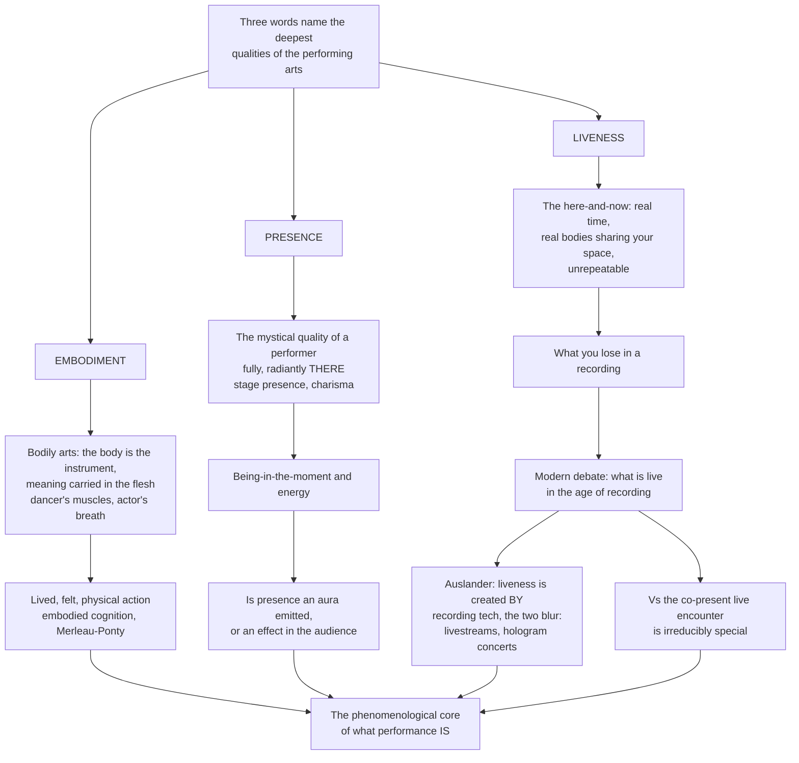

# 🎭 Embodiment, Presence and Liveness

> [!abstract] TL;DR
> Three deceptively simple words name the deepest and most distinctive qualities of the performing arts. **Embodiment**: performance is a *bodily* art — the human body is the instrument and the meaning is carried in the flesh (the dancer's muscles, the actor's breath, the singer's body as resonator), so meaning is lived, felt, physical action, not abstract idea. **Presence**: the almost-mystical quality of a compelling performer who fills the space and commands attention — instantly recognisable, hard to define, and raising the deep question of whether it is an *aura the performer emits* or an *effect co-produced in the audience's perception*. **Liveness**: the here-and-now, real-time, co-present, unrepeatable quality that a recording loses — now contested by Philip Auslander's claim that "liveness" is itself a concept *created by* recording technology and increasingly *blurred* with it. Together they form the **phenomenological core** of what performance *is*.

---

## Intuition

**Analogy:** Think of the difference between reading the recipe for a soufflé and eating a soufflé, still hot, made for you, in front of you, right now — a soufflé that will collapse in ninety seconds and can never be re-served. The recipe is abstract, repeatable, storable. The soufflé is *bodily* (someone's hands and heat made it), *present* (it fills the room with its rising warmth and demands you attend to it *now*), and *live* (it is happening in real time and will vanish). Performance is the soufflé, never the recipe. The score, the script, the choreographic notation are recipes; the event in the room is the irreplaceable thing.

Push the three qualities apart and you can feel each one. **Embodiment**: watch a virtuoso body move and you are moved *viscerally* — you feel it in your own muscles, which is why performers train their flesh for years and why the meaning is not "about" the body but *in* it (this is the philosophy of the *lived body* and the cognitive science of *embodied cognition* — thinking happening in and through the body). **Presence**: some performers walk on and the room tilts toward them; others do not. That radiant, fully-*there* quality is called stage presence, charisma, "it" — and nobody quite agrees whether it is something the performer *has* or something the audience *makes*. **Liveness**: being in the room with a living performer, sharing their space and breath in unrepeatable real time, is precisely what you lose in a recording — yet in an age of streaming, "live" TV, and hologram concerts of dead singers, what "live" even *means* has become a genuine puzzle. Understanding embodiment, presence, and liveness is understanding the felt, bodily, present, unrepeatable experience that gives the performing arts their unique and irreplaceable power.

---

## How It Works

### Core Mechanics

1. **Embodiment — meaning in the flesh.** The performing arts are *corporeal* arts: the body is the primary instrument, medium, and meaning-bearer. Meaning is *enacted* as physical action, not decoded from a text. Two philosophical engines underwrite this. Merleau-Ponty's phenomenology of the **lived body** (*le corps propre*) holds that we are not minds piloting bodies but *body-subjects* whose very perceiving and knowing are bodily and situated ("being-in-the-world"). Cognitive science's **embodied cognition** parallels this: the mind is not a disembodied symbol-processor but is constituted by sensorimotor coupling. The trained, disciplined, expressive body carries *kinesthetic knowledge* that cannot be reduced to propositions.

2. **The audience's embodied response.** The spectator is not a disembodied eye. Watching a body strain, leap, or breathe recruits the observer's own motor and emotional systems — **embodied simulation** / **kinesthetic empathy**. A putative mirror system means we partly *re-enact* the performer's action in our own bodies, which is the neural-motor basis of *being moved*.

3. **Presence — the compelling here-being.** *Stage presence* is the powerful, hard-to-define quality of a performer who seems radiantly, fully **there** — energy, focus, being-in-the-moment, connection, aliveness. The central debate: is presence an **essence/aura** the performer possesses and emits, or a **relational effect** ("the presence effect") co-produced between performer and audience? Actor training treats "being present" as a learnable task; Eugenio Barba locates it in the **extra-daily** body — a heightened, non-habitual bodily energy that draws attention before any meaning is decoded.

4. **Liveness — the here-and-now event.** Liveness is the quality of the *live*: real-time, co-present, embodied, ephemeral, **unrepeatable**. Its defining feature is the *co-presence* of performer and audience in shared time and space — exactly what a recording lacks.

5. **The liveness debate (the crucial contemporary problem).** Walter **Benjamin** argued mechanical reproduction strips the artwork of its **aura** — its unique here-and-now. Philip **Auslander** provocatively inverts the common intuition: "liveness" is a concept *produced by and defined against* recording — we only conceived of "live" once "recorded" existed — and the two are mutually dependent and increasingly *blurred* (livestreams, "live" broadcast, stadium Jumbotrons, hologram and AI performers, motion capture). Against this, Peggy **Phelan** insists on performance's **ontology as disappearance**: "performance's only life is in the present... it becomes itself through disappearance," and so the co-present live is irreducibly special and non-reproducible.

### Flow / Architecture



---

## Key Concepts

### Secondary (the plain idea)
- **Embodiment** — performing arts are done *with the body*. The body is the instrument; the meaning is in how it moves, breathes, and sounds, not in abstract words.
- **Presence** — some performers seem to "fill the room" and grab your attention completely. That is stage presence. It is easy to feel and hard to describe.
- **Liveness** — a live show happens *right now*, in the same room as you, once, and can never be repeated exactly. A recording is not the same thing.
- **What a recording loses** — the shared space, the real-time energy, the sense that anything could happen and that *you were there*.

### Undergraduate (the framework)
- **The lived body vs the object body** — Merleau-Ponty's distinction between the body as *lived subject* (how I perceive and act) and the body as a mere physical object. Performance works on the *lived* body.
- **Embodied / kinesthetic knowledge** — years of training build knowing-in-the-muscles that is not verbal or propositional; virtuosity is stored in the flesh.
- **Kinesthetic empathy / embodied simulation** — spectators partly re-enact the performer's movement in their own motor systems; this is *why* watching a body move can move us.
- **Presence: aura vs effect** — the core debate. Either presence is a special quality the performer *emits* (charisma, "it"), or it is a **relational effect** produced in the audience's attention and the performer-audience relationship.
- **The extra-daily body** (Barba) — presence as a heightened, non-habitual bodily energy that captures attention *before* meaning is interpreted.
- **Co-presence** — liveness is not just simultaneity; it is performer and audience *sharing the same time and space*, mutually aware.

### Graduate (the contested frontier)
- **Benjamin's aura and mechanical reproduction** — reproduction detaches the artwork from its unique ritual here-and-now, dissolving "aura"; a foundational text for the liveness problem.
- **Auslander's *Liveness*** — the anti-essentialist thesis: "liveness" is historically *produced by* recording/mediatization and defined against it; live and mediated are mutually constitutive and increasingly interpenetrate (livestreams, "live" TV, Jumbotrons, holograms, motion capture, AI performers).
- **Phelan's ontology of disappearance** — performance "becomes itself through disappearance"; its non-reproducibility is its politics and value, resisting the economy of the copy.
- **Fischer-Lichte's autopoietic feedback loop** — presence and the event emerge from a self-organising, *co-present* feedback loop between performers and spectators; the "transformative power of performance" lives in this bodily co-presence.
- **The mediated/virtual future** — telepresence, VR and immersive performance, streamed and hybrid (post-pandemic) performance, motion-capture and virtual performers, and the "presence" of the non-human (AI): the open question of whether embodiment, presence, and liveness *survive, transform, or dissolve* — and why the human hunger for the co-present, embodied, live encounter endures.

---

## Python Demo

```python
# Modelling the phenomenological core: what is "lost" across the mediation
# spectrum (embodiment/liveness), and two models of PRESENCE --
# presence-as-sustained-attention and presence-as-embodied-simulation.
import numpy as np
import matplotlib.pyplot as plt

rng = np.random.default_rng(7)

# ----------------------------------------------------------------------
# (A) LIVENESS / PRESENCE across the MEDIATION SPECTRUM
#     Full live experience -> progressively mediated forms.
# ----------------------------------------------------------------------
forms = ["Live\nin room", "Live-\nstreamed", "Recorded\nvideo", "Audio\nonly"]
x = np.arange(len(forms))

# Four phenomenological dimensions scored 0..1 for each form.
dims = ["Sensory\nbandwidth", "Feedback\npossible", "Co-\npresence", "Aura /\nliveness"]
scores = np.array([
    [1.00, 0.65, 0.55, 0.25],   # sensory bandwidth (3D, multisensory)
    [1.00, 0.35, 0.00, 0.00],   # real-time feedback loop
    [1.00, 0.30, 0.05, 0.05],   # co-presence in shared space
    [1.00, 0.45, 0.20, 0.15],   # aura / liveness
])

naive = scores.mean(axis=0)                                   # monotonic collapse
# Auslander counter-point: mediatized forms REINTRODUCE some liveness
# (real-time "it is happening now", chat co-presence).
auslander = np.clip(naive + np.array([0.0, 0.20, 0.08, 0.05]), 0, 1)

# ----------------------------------------------------------------------
# (C) PRESENCE as ATTENTION-CAPTURE over time
#     A compelling performer sustains focused attention; a weaker one
#     "loses the room".
# ----------------------------------------------------------------------
t = np.linspace(0, 10, 500)                                   # minutes on stage
compelling = (0.85 + 0.10*np.sin(2*np.pi*t/3.0)) * (1 - np.exp(-t/0.6))
loses      = (0.90*np.exp(-t/4.0) + 0.15)       * (1 - np.exp(-t/0.4))

# ----------------------------------------------------------------------
# (D) EMBODIED SIMULATION: audience mirror-system engagement rises with
#     the performer's physical expressivity (the basis of being moved).
# ----------------------------------------------------------------------
expressivity = np.linspace(0, 1, 200)
mirror   = 1 - np.exp(-3.2*expressivity)                      # saturating resonance
observed = mirror + rng.normal(0, 0.04, size=expressivity.size)

# ----------------------------------------------------------------------
# PLOT
# ----------------------------------------------------------------------
fig, ax = plt.subplots(2, 2, figsize=(12, 9))

# (A) composite liveness collapse + Auslander bump
ax[0, 0].plot(x, naive, "o-", lw=2, color="#c0392b", label="Naive liveness")
ax[0, 0].plot(x, auslander, "s--", lw=2, color="#2980b9", label="Auslander-adjusted")
ax[0, 0].fill_between(x, naive, auslander, color="#2980b9", alpha=0.12)
ax[0, 0].set_xticks(x); ax[0, 0].set_xticklabels(forms)
ax[0, 0].set_ylabel("Presence / liveness index")
ax[0, 0].set_title("(A) What is lost across the mediation spectrum")
ax[0, 0].set_ylim(0, 1.05); ax[0, 0].legend(); ax[0, 0].grid(alpha=0.3)

# (B) grouped bars: dimensions across three forms
sub, w = [0, 1, 2], 0.25
for i, s in enumerate(sub):
    ax[0, 1].bar(np.arange(len(dims)) + (i - 1)*w, scores[:, s], width=w,
                 label=forms[s].replace("\n", " "))
ax[0, 1].set_xticks(np.arange(len(dims)))
ax[0, 1].set_xticklabels(dims, fontsize=8)
ax[0, 1].set_ylabel("Score")
ax[0, 1].set_title("(B) Phenomenological dimensions by form")
ax[0, 1].set_ylim(0, 1.05); ax[0, 1].legend(fontsize=8); ax[0, 1].grid(alpha=0.3)

# (C) presence as attention over time
ax[1, 0].plot(t, compelling, lw=2, color="#8e44ad", label="Compelling performer")
ax[1, 0].plot(t, loses, lw=2, color="#7f8c8d", label="Loses the room")
ax[1, 0].set_xlabel("Time on stage (min)")
ax[1, 0].set_ylabel("Audience focused attention")
ax[1, 0].set_title("(C) Presence as sustained attention-capture")
ax[1, 0].set_ylim(0, 1.05); ax[1, 0].legend(); ax[1, 0].grid(alpha=0.3)

# (D) embodied simulation resonance
ax[1, 1].scatter(expressivity, observed, s=10, alpha=0.35,
                 color="#16a085", label="Audience response")
ax[1, 1].plot(expressivity, mirror, lw=2.5, color="#c0392b",
              label="Mirror-system resonance")
ax[1, 1].set_xlabel("Performer physical expressivity")
ax[1, 1].set_ylabel("Motor / emotional resonance")
ax[1, 1].set_title("(D) Embodied simulation: the basis of being moved")
ax[1, 1].set_ylim(-0.1, 1.15); ax[1, 1].legend(); ax[1, 1].grid(alpha=0.3)

fig.suptitle("Embodiment, Presence and Liveness: modelling the phenomenological core",
             fontsize=13, weight="bold")
fig.tight_layout(rect=[0, 0, 1, 0.97])
plt.show()
```

Panel **A** shows liveness collapsing as the event is mediated, with Auslander's counter-line showing how streaming *reintroduces* some liveness. Panel **B** breaks the collapse into its phenomenological dimensions. Panels **C** and **D** offer two complementary models of presence: as *sustained attention-capture* (relational effect) and as *embodied simulation* scaling with the performer's expressive body.

---

## Real-World Applications

- **Marina Abramović, *The Artist Is Present* (MoMA, 2010)** — the artist sat silent and still opposite each visitor for hours. The work is *nothing but* presence, co-presence, and liveness: no action, no object, just two bodies sharing time and space. Visitors wept. It is the purest demonstration that the *live encounter itself* carries force.
- **Hologram and AI performers (ABBA Voyage; the 2012 Coachella "Tupac")** — dead or absent performers rendered as convincing stage figures. These are Auslander's thesis made concrete: audiences respond to a "presence" that is wholly mediated, and the live/recorded boundary genuinely blurs.
- **NT Live and the Met's *Live in HD*** — theatre and opera livestreamed to cinemas worldwide, "live" yet co-present with no one on the actual stage. A test case for whether real-time transmission preserves liveness or merely simulates it.
- **Post-pandemic Zoom and hybrid performance** — the 2020–21 collapse of in-room theatre forced a mass experiment in mediated performance, sharpening every question about what embodiment, presence, and liveness require.
- **Motion capture (Andy Serkis as Gollum / Caesar)** — the actor's fully embodied performance is captured and re-skinned onto a digital body: embodiment without the original flesh on screen.
- **Actor and dancer training (Stanislavski, Grotowski, Barba)** — decades of technique devoted to cultivating "being present" and the *extra-daily* body; kinesthetic empathy is why a trained mover's control reads as presence from the back row.

---

## Common Pitfalls

- **Treating presence as a mystical essence** — Assuming presence is a fixed aura some people are simply "born with" ignores the strong evidence that it is a *relational effect* produced in attention and the performer-audience feedback loop, and that it can be trained. Hold both the "emitted" and "co-produced" views in tension rather than collapsing to one.
- **Confusing liveness with mere simultaneity** — Thinking "live" just means "at the same time" loses the crucial dimension of *co-presence in shared space*. A livestream is simultaneous but not spatially co-present; that gap is exactly what the debate is about.
- **Assuming mediation is pure loss** — The naive intuition that recording only *subtracts* misses Auslander's point that mediatized forms can *add* affordances (close-ups, replay, global reach, chat co-presence) and can themselves generate a sense of liveness. Loss is real but not total or one-directional.
- **Reducing embodiment to "the body"** — Talking about "the body" as a mere physical object misses Merleau-Ponty's decisive distinction: performance works on the *lived body* (the perceiving, acting subject), not the anatomical object. The meaning is in embodied *experience*, not in muscle mechanics.
- **Nostalgic essentialism** — Insisting that only in-room performance is "real" and everything mediated is "fake" is an ideological move, not a neutral description. It usually smuggles in Phelan-style value claims while ignoring how thoroughly live and mediated already interpenetrate.

---

## Related Concepts

- [[Embodied_and_Extended_Cognition]] — the cognitive-science engine behind *embodiment*: mind as constituted by sensorimotor coupling, not a disembodied symbol-processor, grounding the claim that performers think and mean *through* the body.
- [[Analytic_and_Continental_Philosophy]] — situates the *phenomenology* of the lived body (Husserl, Heidegger, and the Merleau-Ponty lineage) that underwrites the "being-in-the-world" account of embodied performance.
- [[The_Digital_Revolution_and_New_Media]] — the mediatization context for the liveness debate: how digital reproduction and streaming reconfigure the here-and-now that Benjamin's "aura" and Auslander's *Liveness* both interrogate.
- [[Social_Media_and_Networked_Communication]] — networked, real-time co-presence (livestreams, chat) as the contemporary site where "liveness" is manufactured and blurred, extending Auslander's argument into the platform age.
- [[Motor_System_and_Motor_Control]] — the mirror-system and motor basis of *embodied simulation* and kinesthetic empathy, explaining the neural mechanism by which watching an expressive body physically moves the spectator.

**Within this vault** (siblings, to be linked once written): *Performing_Arts_and_the_Nature_of_Performance* frames why performance is defined by these qualities; *Performance_Theory_and_the_Performative* supplies the theoretical scaffolding; *The_Performer_and_the_Audience* develops presence as a co-produced relational effect; *Space_Time_and_the_Performance_Event* unpacks the co-presence and here-and-now at the heart of liveness; *Dance_and_the_Moving_Body* is embodiment's clearest case; and *Digital_Performance_and_New_Media* carries the liveness debate into telepresence, VR, and virtual performers.

---

## Review Questions

**Secondary.** In your own words, explain the difference between watching a concert live in the room and watching a recording of it later. Name one thing the recording loses and one thing it might add.

**Undergraduate.** "Presence is either something the performer emits or something the audience creates." Argue for the view that presence is a *relational effect* co-produced in the performer-audience feedback loop rather than an essence the performer simply possesses. What evidence (from training, attention, or kinesthetic empathy) supports your case?

**Graduate.** Auslander argues that "liveness" is a concept *produced by* recording technology and that live and mediated performance are mutually constitutive and increasingly blurred, while Phelan insists performance's ontology *is* disappearance and its non-reproducibility is irreducibly valuable. Using a specific case (e.g., a hologram concert, NT Live, or post-pandemic Zoom theatre), stage the disagreement and defend a position. Does embodiment, presence, and liveness survive, transform, or dissolve in the mediated form you chose?

---

## Sources

- Philip Auslander, *Liveness: Performance in a Mediatized Culture* (2nd ed., Routledge, 2008).
- Peggy Phelan, *Unmarked: The Politics of Performance* (Routledge, 1993).
- Maurice Merleau-Ponty, *Phenomenology of Perception* (1945; trans. Landes, Routledge, 2012).
- Erika Fischer-Lichte, *The Transformative Power of Performance: A New Aesthetics* (Routledge, 2008).
- Walter Benjamin, "The Work of Art in the Age of Mechanical Reproduction" (1935), in *Illuminations* (Schocken, 1968).

---

#performing-arts #embodiment #presence #liveness #phenomenology-of-performance
