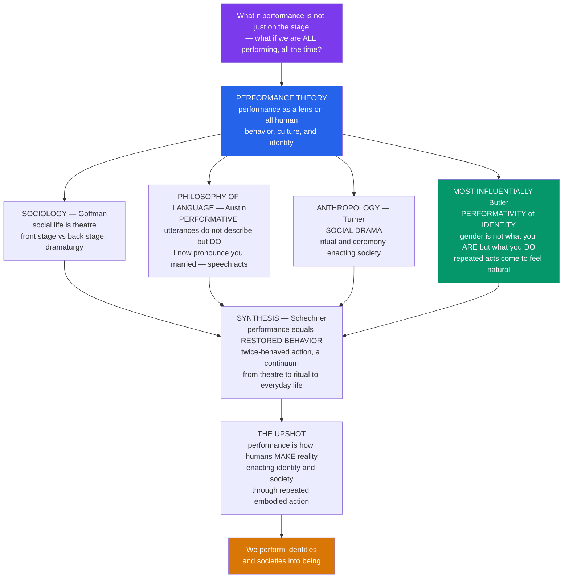

# Performance Theory and the Performative

> [!abstract] TL;DR
> Performance theory took the idea of "performance" out of the theatre and turned it into a lens on all of human behavior: Goffman showed social life is dramaturgy managed across a front stage and back stage; Austin discovered that some utterances (*I now pronounce you married*) do not describe reality but enact it; Turner showed societies process conflict through ritual social drama; and Butler radically argued that gender and identity are not things one *is* but things one repeatedly *does* — so rehearsed they come to feel natural. Schechner synthesized these into performance studies, defining performance as *restored*, twice-behaved behavior spanning a continuum from theatre to ritual to everyday life — and yielding one of the most influential ideas in the modern humanities: we do not merely *have* identities and societies, we **perform** them into being.

---

## Intuition

**Analogy:** Watch yourself for a single ordinary day, as if you were an anthropologist studying a stranger. In the morning meeting you sit up straight, choose careful words, and project competence. At lunch with old friends you slouch, swear, and drop the mask. On your dating profile you curate photographs. At the funeral you compose your face into grief before you feel it. Alone at night you rehearse tomorrow's difficult conversation out loud in the shower. Not once during this day did you step onto a literal stage — and yet you were performing the entire time, managing impressions, playing roles, switching costumes and scripts for different audiences. The radical claim of performance theory is that this is not an occasional pretense laid over a "real" self underneath. This *is* how selves and societies are made.

That insight arrived from four directions at once. From **sociology**, Erving Goffman argued that social life is literally theatre — we all do "front stage" impression management for our audience and retreat "back stage" to prepare. From the **philosophy of language**, J.L. Austin noticed that some sentences do not *describe* the world but *act* on it: saying "I promise," "I bet," or "I now pronounce you married" does not report a fact — the saying *makes it so*. From **anthropology**, Victor Turner showed that whole societies stage and resolve their conflicts through ritual "social drama." And most influentially, from **feminist philosophy**, Judith Butler extended the idea all the way to identity: gender, she argued, is not an inner essence you express but a performative you *repeat* — a compulsory reiteration of stylized acts so constantly rehearsed that it congeals into something that feels natural and given. Richard Schechner gathered these threads into a whole new field, defining performance as **restored behavior** — twice-behaved, rehearsed action running on a continuum from theatre to ritual to sport to daily life. The revolutionary upshot: performance is not just an art form but a fundamental way humans *make* reality — enacting identity, relationship, power, and society through embodied, repeated action.

---

## How It Works

### The core move: from stage to world

Performance theory works by taking a concept that seemed to belong only to actors — *performing a role* — and asking what happens if it describes everyone, everywhere. The engine of the theory is a single reversal repeated in four registers: the thing we thought merely *expressed* a pre-existing reality turns out to be what *produces* that reality. The wedding words do not report a marriage that already exists — they create it. The repeated feminine gestures do not express a womanhood that precedes them — they constitute it. The polished front-stage self is not a distortion of an authentic backstage self — both are performances, staged for different audiences.

1. **Restored behavior (Schechner).** No performance is spontaneous; it is *twice-behaved* — coded, rehearsed action "restored" from elsewhere, whether a script, a ritual score, or a social norm learned in childhood. The performer lives in a *double negative*: "not me / not not me" — Laurence Olivier is not Hamlet, but on stage he is not-not Hamlet either.
2. **Dramaturgy (Goffman).** The self is a *dramatic effect* produced by performance, not its author. We manage impressions on a **front stage** for an audience and prepare in the **back stage** where the mask comes off — though even backstage is a performance for a different team.
3. **The performative (Austin).** Utterances split into **constatives** (which describe and can be true or false) and **performatives** (which *do* an action by being said and can only succeed or fail). Performatives work only when **felicity conditions** hold — right speaker, right context, uptake.
4. **Performativity (Butler).** Extend the performative from single utterances to the whole self: identity is *performatively constituted* by the very acts said to express it. There is "no doer behind the deed."
5. **Social drama (Turner).** Zoom out to whole societies: communities enact and resolve conflict through a four-stage dramatic process — **breach → crisis → redress → reintegration** — and stage themselves through ritual, festival, and ceremony.

### Flow / Architecture



---

## Key Concepts

### Secondary (the big idea)
- **Performance is not only theatre.** We "play roles," "wear masks," and "put on an act" in ordinary life — and performance theory takes that seriously as the way society works.
- **Front stage vs back stage (Goffman).** How you act in public (front stage) differs from how you act in private (back stage). Managing that difference is called **impression management**.
- **Words that do things (Austin).** Some sentences do not just describe — they *act*. Saying "I promise" *makes* a promise; "I now pronounce you married" *makes* a marriage. These are **performative** utterances.
- **You perform who you are.** Butler's headline claim: identity, including gender, is something you *do* through repeated actions, not a fixed thing you were simply born with.

### Undergraduate (the framework)
- **Restored / twice-behaved behavior (Schechner).** All performance is rehearsed, coded, "restored" action; the performer occupies the double negative **not me / not not me**. The field of **performance studies** studies a "broad spectrum" continuum: theatre → ritual → sport → play → everyday life.
- **Dramaturgy in depth (Goffman, *Presentation of Self*, 1959).** Roles, scripts, teams, props, and **face-work**; the self is a *performed effect*, produced by the successful staging of a role, not its cause.
- **Speech-act theory (Austin, *How to Do Things with Words*, 1962).** **Constative vs performative**; the **locutionary / illocutionary / perlocutionary** distinction; **felicity conditions** and *infelicitous* (void) performatives — a promise made as a joke, or a marriage pronounced by someone with no authority, simply fails to act. (See [[Pragmatics_and_Speech_Acts]].)
- **Social drama (Turner).** The four-stage sequence **breach → crisis → redress → reintegration**; ritual and **liminality** as a society performing and repairing itself. (See [[Religion_Magic_and_Ritual]].)
- **Gender performativity (Butler, *Gender Trouble*, 1990).** Gender is constituted through the *compulsory, stylized repetition* of acts, so sedimented it appears natural — "there is no gender identity behind the expressions of gender." **Performance vs performativity**: a performance is a bounded event with a performer; performativity is the *ongoing, iterative* constitution of the very subject who seems to be performing.

### Graduate (contested edges)
- **Iterability and citationality.** Butler (via Derrida) grounds performativity in the *citational* structure of the norm: a performative "works" because it cites a prior authority and convention. Identity is not one act but the *sediment* of countless cited repetitions — which is exactly why it can be re-cited differently (**resignification**).
- **Agency vs determinism.** If there is "no doer behind the deed," where does resistance come from? Butler's answer — subversion arises *within* iteration, in the gap and slippage of each repeated citation (drag, parody, denaturalizing performance) — remains debated as insufficiently or excessively voluntarist.
- **The ontology of performance.** Peggy Phelan: performance's being *is* its disappearance (it cannot be saved or recorded without becoming something else). Philip Auslander's counter: "liveness" is itself historically produced by media. Efficacy vs entertainment (Schechner) as poles of one braided continuum.
- **The "performative turn" and its critics.** The concept's spread across the humanities and social sciences (performing the nation, protest as performance, performing science) raises the worry of **over-extension** — if everything is performance, the term loses analytic bite — and of the **loss of the aesthetic**, i.e., what remains distinctive about *art* performance once all behavior is performance.
- **Performance as epistemology.** Performance treated not only as an object of study but as a *way of knowing and making* — embodied, enacted knowledge irreducible to text.

---

## Python Demo

```python
# Performance Theory and the Performative — two conceptual toy models:
#   (a) BUTLER: identity as the SEDIMENT of repeated performative acts
#       (no essence behind the deed; a subversive burst denaturalizes it)
#   (b) GOFFMAN: FRONT-STAGE self adapting per audience vs a flat BACK-STAGE self
# These illustrate the theory's logic; they are not empirical measurements.

import numpy as np
import matplotlib.pyplot as plt

rng = np.random.default_rng(2)

# ----------------------------------------------------------------------
# (a) PERFORMATIVITY: there is no "doer behind the deed".
#     A stable, "essential"-feeling identity EMERGES from the accumulation
#     of many repeated, norm-aligned acts. We model the felt identity as a
#     leaky integrator over performed acts (long memory = sedimentation).
#     A burst of non-normative / subversive acts (drag, parody) briefly
#     denaturalizes the sediment before normative repetition re-forms it.
# ----------------------------------------------------------------------
n_acts = 400
alpha = 0.02                              # slow leak -> deep sedimentation
acts = np.ones(n_acts)                    # +1 = normatively-aligned act
subversive = np.arange(250, 285)          # a burst of non-normative acts
acts[subversive] = -1.0

identity = np.zeros(n_acts)               # the "felt", sedimented identity
for t in range(1, n_acts):
    noise = rng.normal(0, 0.03)
    identity[t] = (1 - alpha) * identity[t - 1] + alpha * acts[t] + noise

# "naturalization": how fixed/essential the identity FEELS = how little it
# now moves per act. As acts pile up consistently, increments shrink and the
# identity feels stable & given — the illusion of a pre-existing essence.
window = 25
felt_naturalness = np.array([
    1.0 - np.std(identity[max(0, t - window):t + 1])
    for t in range(n_acts)
])
felt_naturalness = np.clip(felt_naturalness, 0, None)
felt_naturalness /= felt_naturalness.max()

# ----------------------------------------------------------------------
# (b) DRAMATURGY: the presented FRONT-STAGE self is tuned to each audience's
#     formality/surveillance, while the BACK-STAGE self stays constant.
#     The gap between them is the labor of impression management.
# ----------------------------------------------------------------------
contexts = ["Alone\n(backstage)", "Close\nfriends", "Family\ndinner",
            "Workplace", "Job\ninterview", "Public\nceremony"]
audience_formality = np.array([0.0, 0.2, 0.4, 0.7, 0.9, 1.0])
back_stage = np.full_like(audience_formality, 0.15)        # constant private self
front_stage = 0.15 + 0.80 * audience_formality             # presented self adapts
impression_labor = front_stage - back_stage                # the managed gap

# ----------------------------------------------------------------------
# Plot
# ----------------------------------------------------------------------
fig, (ax1, ax2) = plt.subplots(1, 2, figsize=(13, 5))

ax1.plot(identity, color="#2563eb", lw=1.8, label="Sedimented identity (felt)")
ax1.plot(felt_naturalness, color="#059669", lw=1.6, ls="--",
         label="Felt naturalness / essence")
ax1.axvspan(subversive[0], subversive[-1], color="#d97706", alpha=0.18,
            label="Subversive acts (denaturalize)")
ax1.axhline(0, color="gray", lw=0.7)
ax1.set_title("(a) Butler: identity as SEDIMENTED REPETITION\n"
              "no doer behind the deed")
ax1.set_xlabel("performed acts over time (repetition)")
ax1.set_ylabel("identity sediment / felt naturalness")
ax1.legend(loc="lower right", fontsize=8)

x = np.arange(len(contexts))
ax2.bar(x, front_stage, color="#7c3aed", alpha=0.85, label="Front-stage (presented self)")
ax2.bar(x, back_stage, color="#94a3b8", label="Back-stage (private self)")
ax2.vlines(x, back_stage, front_stage, color="#d97706", lw=2)
for xi, lab in zip(x, impression_labor):
    ax2.annotate(f"labor={lab:.2f}", (xi, front_stage[xi] + 0.02),
                 ha="center", fontsize=7, color="#d97706")
ax2.set_title("(b) Goffman: FRONT vs BACK stage\n"
              "impression management per audience")
ax2.set_xticks(x)
ax2.set_xticklabels(contexts, fontsize=8)
ax2.set_ylabel("normative self-presentation")
ax2.set_ylim(0, 1.15)
ax2.legend(loc="upper left", fontsize=8)

plt.tight_layout()
plt.savefig("performance_theory_demo.png", dpi=110)
plt.show()

# Reading the output:
#  (a) The blue curve climbs toward a stable value as norm-aligned acts pile
#      up — a "naturalized" identity emerging with NO prior essence. The green
#      curve (felt naturalness) rises as increments shrink: repetition makes
#      the constructed feel given. The orange band shows subversive acts
#      briefly disrupting the sediment before normative repetition re-forms it.
#  (b) The same private (back-stage) self is presented very differently across
#      audiences; the orange gap is the ongoing LABOR of impression management.
```

---

## Real-World Applications

> **Gender and queer studies — drag as denaturalization.** Butler's central example: drag does not mock "real" womanhood but reveals that *all* gender is imitation without an original. Pride, ball culture, and performance art weaponize exaggerated repetition to make the constructedness of naturalized norms visible — the theory's most direct political payoff.

> **Digital identity and social media.** Goffman's dramaturgy has become the default language for understanding online self-presentation: the curated profile is pure front stage, "finstas" and DMs are back stage, and the algorithm is a new kind of audience. "Context collapse" (multiple audiences flattened into one feed) is a dramaturgical crisis — impossible to keep front stages separate.

> **Politics and protest.** Nations are "performed" through ceremony, anthem, and pageantry (Turner's cultural performance at scale); protest and civil disobedience are consciously staged social dramas; political scandals are felicity failures where a leader's performative authority collapses.

> **The wedding, the courtroom, the naming.** Austin's original cases are everywhere institutions bind reality by words: "I do," "I sentence you," "I name this ship," "I hereby resign." Each works only under felicity conditions — the right speaker, procedure, and uptake — which is exactly why contract, oath, and ceremony are so formalized.

> **Service work and emotional labor.** Arlie Hochschild extended Goffman to paid front-stage performance (flight attendants, call-center staff), where managing displayed emotion for an audience becomes a commodified, exhausting job.

---

## Common Pitfalls

- **Confusing performance with performativity.** A *performance* is a bounded event with a performer who pre-exists it; *performativity* is the ongoing, iterative process that *constitutes* the subject in the first place. Butler is making the second, stronger claim — not "gender is a show people put on."
- **Reading Butler as voluntarism.** "Gender is performative" does **not** mean you freely choose a gender each morning like an outfit. It is *compulsory* repetition enforced by norms; the appearance of a chooser is itself an effect of the repetition, not a starting point.
- **Over-extending "performance."** If literally everything is performance, the concept explains nothing. Keep asking what analytic work the frame does *here* — and what is lost by dissolving the difference between a stage play and a stock trade.
- **Treating any utterance as automatically "doing."** Performatives are void without **felicity conditions** and **uptake**. Saying "I now pronounce you married" as an actor on stage marries no one — context and authority are constitutive, not decorative.
- **Collapsing "back stage" into "the authentic self."** Goffman's back stage is not the true you behind all masks; it is another performance for a different team. There is no final, unperformed self waiting underneath.
- **Assuming performativity kills agency.** The determinism worry misreads Butler: resistance lives *inside* iteration — in the slippage, failure, and re-citation of each repeated norm (resignification), not outside the game.

---

## Related Concepts

- [[Identity_Stigma_and_Impression_Management]] — Goffman's dramaturgy in full: front stage/back stage, impression management, teams, face-work, and "spoiled identity"; the sociological home of the theatrical model of the self.
- [[Symbolic_Interactionism_and_Microsociology]] — the tradition (Mead, Blumer, Goffman) in which the self is *produced* in interaction rather than pre-given; the microsociological ground of dramaturgy.
- [[Gender_Sex_and_Patriarchy]] — Butler's gender performativity developed at length: compulsory repetition, "no actor behind the performance," and subversion; the fullest in-vault treatment of the performative applied to identity.
- [[Pragmatics_and_Speech_Acts]] — Austin and Searle on performatives, felicity conditions, and the locutionary/illocutionary/perlocutionary distinction; the linguistic source of "words that do things."
- [[Religion_Magic_and_Ritual]] — Turner (and van Gennep) on rites of passage, liminality, and the social drama; the anthropology of society performing and repairing itself.
- [[Personal_Identity]] — the metaphysics behind "no doer behind the deed": whether a persisting self underlies its acts, connecting Butler's anti-essentialism to classical debates on the constitution of the self.

Within this vault's **Foundations of Performance** section, this note sits beside its prose-only siblings *Performing_Arts_and_the_Nature_of_Performance* (what "performance" even is), *The_Performer_and_the_Audience* (the constitutive relation this theory reframes), *Embodiment_Presence_and_Liveness* (the body and liveness that performativity enacts), *Ritual_Play_and_the_Origins_of_Performance* (the Turner/Schechner ritual continuum), *Performance_Art_and_the_Body* (drag, body art, and subversive denaturalization in practice), and *Non_Western_Performance_Traditions* (ritual and enacted culture beyond the proscenium stage).

---

## Review Questions

**Secondary**
1. Give one example from your own day of "front-stage" behavior and one of "back-stage" behavior. What are you managing in the gap between them?
2. Why is "I now pronounce you married" different from "The sky is blue"? What does the first sentence *do* that the second only describes?

**Undergraduate**
3. Explain Schechner's phrase "restored behavior" and the double negative "not me / not not me." How do they show that even everyday behavior is, in a sense, rehearsed?
4. Distinguish *performance* from *performativity* using Butler. Why does the claim "there is no doer behind the deed" make gender performativity a stronger thesis than "people play gender roles"?

**Graduate**
5. If identity is performatively constituted by compulsory repetition, where does the possibility of *subversion* come from? Evaluate Butler's answer (resignification within iteration) against the charge that performativity leaves no room for agency.
6. Critics warn that the "performative turn" over-extends the concept until everything is performance and the specifically *aesthetic* dissolves. Is there a principled line between an artwork performance and ordinary social performance — and does performance theory need one to remain useful?

---

## Sources

- Richard Schechner, *Performance Studies: An Introduction* (Routledge, multiple editions).
- Erving Goffman, *The Presentation of Self in Everyday Life* (1959).
- J.L. Austin, *How to Do Things with Words* (1962).
- Judith Butler, *Gender Trouble: Feminism and the Subversion of Identity* (1990).
- Victor Turner, *From Ritual to Theatre: The Human Seriousness of Play* (1982).

---

#performing-arts #performance-theory #performativity #restored-behavior #goffman-and-butler
