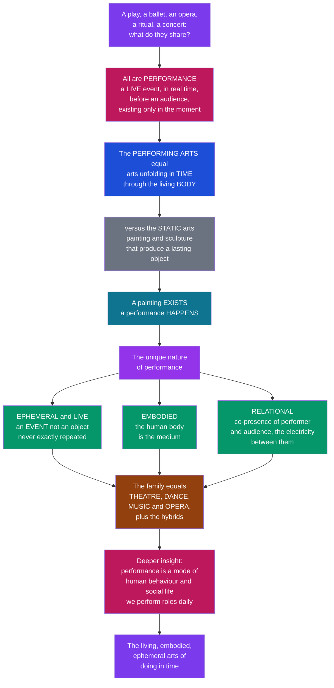

# 🎭 Performing Arts and the Nature of Performance

> [!abstract] TL;DR
> The **performing arts** are the arts that unfold in **time** and through the living **body** — theatre, dance, music performance, opera, and their hybrids — as opposed to the "plastic" or **spatial** arts (painting, sculpture, architecture) that produce a lasting **object**. Their defining nature is captured in a single contrast: *a painting **exists**; a performance **happens**.* A performance is **ephemeral** (a transient event that vanishes and can never be exactly repeated), **embodied** (the moving, speaking, singing human body is the medium), and **relational** (it requires the co-presence of performer and audience, whose live "electricity" is part of the art). A deeper insight from **performance studies** is that performance is not only art but a fundamental mode of human behaviour — we "perform" roles, identities, and rituals every day. This is the hub note for the six-section Performing Arts vault.

---

## Intuition

**Analogy first.** Ask what a Shakespeare play, a classical ballet, a Verdi opera, a stand-up comedy set, a religious ritual, and a stadium rock concert all have in common. On the surface, nothing: different centuries, media, tones, and audiences. But underneath, they are the same *kind* of thing. Each is a **live event** in which human beings **do something**, in **real time**, in the **presence of an audience** — and something passes between them that exists only in that moment and then is gone. That shared thing is **performance**, and the arts built on it are the **performing arts**.

Now feel the contrast that gives these arts their haunting character. Walk into a museum and stand before a Vermeer: the painting simply **exists**. It was finished centuries ago, it will be there tomorrow, and every visitor sees the same fixed object. Walk instead into a theatre: nothing exists yet. The play is not on the wall — it has to be **made to happen**, in front of you, by living people, and the instant the curtain falls it is over. You can revisit the painting; you can never revisit *that* performance, because tonight's is already a slightly different play from last night's. **A painting exists; a performance happens.** The performing arts are the arts of *doing in time*, and their material is not stone or pigment but the fleeting, breathing present.

Three qualities follow directly from this. First, performance is **ephemeral and live**: it is an **event, not an object** — it exists only while it is being done and can never be perfectly repeated. Second, performance is **embodied**: the human **body** — moving, gesturing, voicing, singing — is the medium and the instrument. Third, performance is **relational**: it needs the *co-presence* of **performer and audience**, and the current that flows between them is not decoration on the art but part of the art itself. And there is a final, larger insight from **performance studies**: "performance" is not confined to the stage. We perform roles at work, rituals at weddings, and identities on social media every day — so studying performance is a way of understanding culture, identity, and society itself.

---

## How It Works

### The core distinction: time arts versus object arts

Every art can be sorted by a single question: does it leave behind a **lasting object** you can return to, or does it exist only as a **passing event**? Painting, sculpture, and architecture are **plastic / spatial arts** — they occupy space and endure as things. Theatre, dance, music, and opera are **temporal / time arts** — they occupy *time* and endure only as long as the doing lasts. This is not a value ranking; it is a difference of **mode of existence**. The plastic arts *are*; the performing arts *become*, and then cease.

### The three defining qualities

1. **Ephemerality and the live.** A performance is a **transient event**. It comes into being in the act of doing and disappears the moment it ends; there is no "original" object to preserve. Even the "same" work — *Hamlet*, *Swan Lake*, a Beethoven symphony — is realised differently every single time, because tempo, timing, energy, error, and the room all change. The theorist **Peggy Phelan** put it sharply: "Performance's only life is in the present." You can film it, but the film is a *different object* — a reproduction, not the live event.
2. **Embodiment.** The medium of performance is the **human body**: a dancer's line, an actor's voice and breath, a singer's resonance, a musician's hands. Meaning is carried not by an external artefact but by a living organism moving through time. This makes the performer both the *maker* and the *material* of the art at once.
3. **The relational / social nature.** Performance is not complete until it is **received**. It requires the **co-presence** of performer and audience, and the two mutually constitute the event: a comedian's timing bends to the laughter, a soloist rides the hush of the hall. This live **feedback loop** — the "energy" or "electricity" of the room — is why a recording, however perfect, feels categorically different from being there.

### The tension with reproduction

Because performance is live, it stands in permanent tension with **mediation** — recording, film, broadcast, streaming. Walter **Benjamin** argued that mechanical reproduction strips an artwork of its **"aura,"** its here-and-now uniqueness. Philip **Auslander** later complicated this: in a media-saturated world, "**liveness**" is itself defined *against* the recorded, and the two constantly borrow from each other. The debate is really about what, if anything, is *lost* when a happening is turned into a thing.

### What "performance" means — the broad concept

Beyond art, **Richard Schechner** defined performance as **"restored behaviour"** or **"twice-behaved behaviour"**: strips of action that are rehearsed, coded, and re-enacted rather than done for the first time — from a staged tragedy to a graduation ceremony to shaking hands. He drew a **continuum** from the **aesthetic** (staged art) to the **everyday** (ritual, sport, play, social roles). The performer, meanwhile, has a **double nature** — simultaneously *themselves* and *the role* — what Schechner called **"not me... not not me."** This expansion is the founding move of **performance studies**: performance is a lens on all of human social behaviour.



**How this vault is organised (6 sections).**
1. **Foundations of Performance** (this section) — what the performing arts are, the nature of performance, performance theory and the performative, the performer and audience, embodiment and liveness, ritual and the origins of performance, and space, time, and the event.
2. **Theatre and Drama** — enacted drama, dramatic text and character, genres and traditions, dramaturgy, and the history of the stage.
3. **Dance and Movement** — the moving body, choreography, technique and style, and dance traditions across cultures.
4. **Acting, Directing, and Production** — the crafts: acting method, directing, design (set, light, sound, costume), and the collaborative making of a production.
5. **World Performance Traditions** — non-Western and ritual forms, from Noh and Kathakali to carnival and shamanic performance.
6. **Contemporary and Applied Performance** — performance art, live art, immersive and digital performance, and applied/community theatre.

---

## Key Concepts

### Secondary Level

**What the performing arts are.** The performing arts are arts you **watch or hear happening live**, made by people **doing** things in front of an audience: acting a play, dancing a ballet, singing an opera, playing a concert. They are different from **painting** or **sculpture**, which make an object you can keep and look at again. The performing arts do not make an object — they make an **event**.

**A painting exists; a performance happens.** This one line captures the whole idea. A statue sits in a gallery and is the same next year. A concert only exists *while it is being played*; when it ends, it is gone forever, and the next night's concert will be a little different.

**The three special features.**
- **Live and ephemeral** — it happens once, in real time, and can never be repeated exactly.
- **Embodied** — the artist's own **body and voice** are the material of the art.
- **Relational** — it needs an **audience**; the feeling in the room is part of the show.

**The big family.** The performing arts include **theatre** (acting out stories), **dance** (the moving body), **music and opera** (organised sound), plus mixes like **musical theatre, circus, puppetry, and mime**.

**We all perform.** You "perform" more than you think — telling a story to friends, playing a sport, taking part in a ceremony. Performance is a normal part of being human, not just something on a stage.

### Undergraduate Level

**Time arts vs plastic arts.** The classical distinction is between **spatial/plastic arts** (painting, sculpture, architecture — extended in *space*, existing as durable objects) and **temporal/time arts** (music, dance, theatre — extended in *time*, existing as events). Performance sits firmly on the temporal side: its medium is the ordered passage of time itself, which is why it shares deep structure with music (see [[Music_Theory_Overview]]).

**The event/object contrast, formalised.** An **object-artwork** is *token-identical* on each encounter — the same canvas, reproduced the same way. A **performance** is a fresh **token** of an abstract **type** (the script, score, or choreography): every staging of *Hamlet* is a distinct realisation of the same work. This is close to the philosophical distinction between **autographic** arts (defined by their physical original) and **allographic** arts (defined by a notation that is re-performed).

**Liveness and its qualities.** Performance theory isolates the **live encounter** as the object's core:
- **Presence** — the felt "being-there" of performer and spectator in one space and time.
- **Ephemerality** — Peggy Phelan's claim that performance "becomes itself through disappearance," resisting the economy of the reproducible object.
- **Co-presence and feedback** — the audience is not passive; its attention, laughter, and silence **feed back** and shape the performance as it unfolds (**Erika Fischer-Lichte's** "autopoietic feedback loop").

**Restored behaviour.** Schechner's key concept: performance is **"twice-behaved behaviour"** — action that is *rehearsed and re-enacted* rather than spontaneous. This unifies a Broadway show, a Catholic Mass, and a courtroom procedure under one analytic category, and marks the shift from *theatre studies* to *performance studies*.

**The double negative.** In performing a role, the actor is **"not me — not not me"**: not literally the character (not me), yet not simply themselves either (not not me). The performer inhabits a productive in-between, which is what makes acting neither lying nor being.

**The performing-arts family and its shared elements.** Across theatre (see [[Aristotles_Poetics_and_Drama]]), dance, and music/opera, every performance shares a common kit of elements: a **performer**, an **audience**, a bounded **space**, an unfolding **time**, an **action**, a **score/script/choreography** that guides it, and the singular **event** in which all of these combine. The performing arts are also intensely **collaborative** — a single production fuses acting, music, design, and text — a synthesis Wagner idealised as the **Gesamtkunstwerk**, the "total work of art."

### Graduate Level

**Performance studies as a discipline.** Founded by **Richard Schechner** (with anthropologist **Victor Turner**), performance studies is a deliberately **interdisciplinary** field that studies performance as a *broad continuum* — from aesthetic genres to ritual, sport, play, healing, and everyday social interaction — rather than restricting itself to the literary drama. Its methods borrow from theatre analysis, **ethnography** (see [[Religion_Magic_and_Ritual]]), and **practice-as-research**, and it treats performance as both an *object* of study and a *method* of inquiry ("performance as a lens").

**The ritual–theatre continuum.** Turner's **social drama** (breach → crisis → redress → reintegration) and his reading of Van Gennep's **liminality** gave performance studies its ritual anchor: theatre is understood as a secularised descendant of ritual, and both carve out a **liminal** or "**liminoid**" space set apart from ordinary life. This grounds the vault's claim that performance is among the **oldest and most universal** human practices.

**The performative turn.** From J. L. Austin's **speech-act theory** (the *performative* utterance that *does* what it says — "I now pronounce you...") through Judith Butler's account of **gender as performative** (identity constituted by its repeated enactment), "performance" became a master concept across the humanities. The distinction matters: **performativity** (the world-making force of iterated acts) is not the same as **performance** (a bounded aesthetic event), and conflating them is a frequent error.

**Fischer-Lichte and the transformative event.** In *The Transformative Power of Performance*, **Erika Fischer-Lichte** models performance as an **autopoietic feedback loop** between actors and spectators that produces "emergent" meaning and a "re-enchantment" of the co-present moment. Performance is not the *transmission* of a pre-made meaning (as text-based models assume) but the *generation* of experience in real time — the **event** itself is the artwork, not a vehicle for one.

**Liveness after mediatization.** Benjamin's loss of **aura** under reproduction and Auslander's argument that **"liveness"** is a historically produced category (defined only *after* recording exists, and increasingly shaped by media aesthetics) frame the central contemporary problem: streaming, motion capture, virtual performers, and hologram concerts destabilise the very presence/absence and event/object boundaries this note begins from. The performing arts are thus a live testbed for questions about embodiment, mediation, and what is lost or gained when the ephemeral is made storable.

**Cross-disciplinary reach.** Performance is a bridge concept linking **anthropology** (ritual, cultural performance), **sociology** (Goffman's *dramaturgical* self, life as staged role-performance), **psychology** (the actor's craft, empathy, and the spectator's response), **linguistics** (performatives and speech acts), and the arts (see [[Aesthetics_and_Art_Overview]] and [[Film_and_the_Moving_Image]]). Studying performance is thus a way of studying the embodied, social, and time-bound dimension of the human as such.

---

## Python Demo

```python
# Performing Arts and the Nature of Performance
# Two visualizations of what makes a performance a *performance*, numpy + matplotlib only.
#
#   Panel 1 -- EPHEMERALITY / VARIABILITY OF THE LIVE EVENT.
#     Contrast a STATIC, reproducible artwork (a recording: identical every
#     time you access it, zero variation) with a LIVE performance (every
#     realization of the "same" piece differs -- tempo, timing, energy).
#     We simulate 40 live performances of one 4-minute piece as tempo-over-
#     time curves (each a fresh event) against the single fixed recording,
#     plus a histogram of total durations: a cloud of events vs one point.
#
#   Panel 2 -- PERFORMER-AUDIENCE FEEDBACK ("the electricity").
#     Model the live co-presence loop: audience engagement lifts performer
#     energy, which lifts engagement, in mutual real-time amplification --
#     versus a recording, which has NO feedback (flat, no co-presence).

import numpy as np
import matplotlib
matplotlib.use("Agg")                    # headless-safe backend
import matplotlib.pyplot as plt

rng = np.random.default_rng(7)

fig, (ax1, ax2) = plt.subplots(1, 2, figsize=(16, 6.5))
fig.suptitle("The Nature of Performance: an EVENT, not an OBJECT",
             fontsize=15, fontweight="bold")

# ---------------------------------------------------------------
# Panel 1 -- ephemerality: many live performances vs one fixed recording
# ---------------------------------------------------------------
t = np.linspace(0, 1, 240)               # normalized time through the piece
score_tempo = 100 + 14 * np.sin(2 * np.pi * t)   # the notated "ideal" (rubato)

n_perf = 40
durations = np.empty(n_perf)
for i in range(n_perf):
    # each performance = the score + fresh interpretive variation this night
    phase   = rng.normal(0.0, 0.35)                       # push/pull of phrasing
    overall = rng.normal(0.0, 3.0)                        # a touch faster/slower
    swell   = rng.normal(0.0, 5.0) * np.sin(np.pi * t)    # unique dynamic arc
    jitter  = np.cumsum(rng.normal(0.0, 0.6, t.size))     # drifting micro-timing
    jitter -= jitter.mean()
    perf = 100 + 14 * np.sin(2 * np.pi * t + phase) + overall + swell + jitter
    ax1.plot(t * 4, perf, color="#be185d", alpha=0.18, lw=1.0)
    # total duration = integral of (beats / tempo); slower tempo => longer piece
    durations[i] = np.trapz(60.0 / perf, t * 4) * 100     # arbitrary time units

ax1.plot(t * 4, score_tempo, color="#1d4ed8", lw=3.0,
         label="Recording / score: identical every playback (an OBJECT)")
ax1.plot([], [], color="#be185d", lw=2, alpha=0.6,
         label="40 live performances: each a fresh EVENT")
ax1.set_xlabel("Time through the piece (minutes)")
ax1.set_ylabel("Tempo (beats per minute)")
ax1.set_title("Ephemerality: no two performances are identical")
ax1.legend(loc="upper right", fontsize=8)
ax1.grid(alpha=0.2)

# inset: spread of total durations (a distribution) vs the recording (one point)
axin = ax1.inset_axes([0.10, 0.08, 0.34, 0.30])
axin.hist(durations, bins=12, color="#be185d", alpha=0.75, edgecolor="white")
axin.axvline(durations.mean(), color="#1d4ed8", lw=2.0)   # the single fixed value
axin.set_title("total duration", fontsize=7)
axin.tick_params(labelsize=6)
axin.set_yticks([])

# ---------------------------------------------------------------
# Panel 2 -- performer-audience feedback loop (the live "electricity")
# ---------------------------------------------------------------
steps = 70
tt = np.arange(steps)

P = np.zeros(steps)     # performer energy
A = np.zeros(steps)     # audience engagement
P[0], A[0] = 0.30, 0.20
alpha, beta, damp = 0.12, 0.14, 0.03     # mutual gain and gentle self-damping
for k in range(steps - 1):
    A[k + 1] = np.clip(A[k] + alpha * P[k] - damp * A[k]
                       + rng.normal(0, 0.010), 0, 1)
    P[k + 1] = np.clip(P[k] + beta * A[k] - damp * P[k]
                       + rng.normal(0, 0.010), 0, 1)

# a recording: no co-presence, no feedback -- energy just decays toward baseline
R = 0.55 * np.exp(-tt / 45.0) + 0.05

ax2.plot(tt, P, color="#be185d", lw=2.6, label="Performer energy (live)")
ax2.plot(tt, A, color="#059669", lw=2.6, label="Audience engagement (live)")
ax2.plot(tt, R, color="#6b7280", lw=2.4, ls="--",
         label="Recording: no feedback loop")
ax2.fill_between(tt, P, A, color="#f5d0e0", alpha=0.5)
ax2.set_xlabel("Time during the event")
ax2.set_ylabel("Level (0 to 1)")
ax2.set_title("Relational: co-presence amplifies; a recording cannot")
ax2.set_ylim(0, 1.05)
ax2.legend(loc="center right", fontsize=8)
ax2.grid(alpha=0.2)

plt.tight_layout()
plt.savefig("nature_of_performance.png", dpi=140, bbox_inches="tight")
print("Figure saved: nature_of_performance.png")

# ---------------------------------------------------------------
# Text summary tying the panels back to the note
# ---------------------------------------------------------------
print("\n=== Panel 1: ephemerality of the live event ===")
print(f"  Recording duration (fixed)     : {durations.mean():6.2f} units, "
      f"variation = 0.00  (an OBJECT: identical every time)")
print(f"  Live performances (n={n_perf})       : mean {durations.mean():6.2f} units, "
      f"std {durations.std():4.2f}  (EVENTS: each one different)")
print("  -> The 'same' piece is a DISTRIBUTION of events, not a single point.")

print("\n=== Panel 2: performer-audience feedback ===")
print(f"  Live start energy  P0={P[0]:.2f}, A0={A[0]:.2f}")
print(f"  Live end   energy  P ={P[-1]:.2f}, A ={A[-1]:.2f}  (mutual amplification)")
print(f"  Recording end level        ={R[-1]:.2f}  (decays: no co-presence)")
print("  -> Co-presence is not decoration on the art; it drives the event.")
```

Running this saves a figure and prints a summary. **Panel 1** overlays 40 faint pink tempo curves — 40 live performances of one four-minute piece, every one slightly different — against the single bold blue line of the fixed recording; the inset histogram shows their total durations forming a *spread* while the recording is a single value. The picture makes the note's slogan literal: the live work is a **distribution of events**, the reproduction a **fixed object**. **Panel 2** shows performer energy and audience engagement climbing together through mutual amplification (the "electricity" of co-presence), while the grey dashed recording — having no one to feed back to — only decays.

---

## Real-World Applications

> **Application 1 — Live theatre, dance, and concert programming.** The entire economics and craft of the live sector rests on this note's premise: people pay a premium to be *co-present* at an event that cannot be replayed. A Broadway run, a ballet season, or a touring band sells not a recording but *presence* and *unrepeatability* — which is why "you had to be there" is the industry's core value proposition and why bootleg recordings never substitute for the ticket.

> **Application 2 — Ritual, ceremony, and civic life.** Weddings, graduations, religious liturgies, inaugurations, and funerals are performances in Schechner's sense — restored, embodied, co-present events that *do* social work (they marry, ordain, mourn). Understanding them as performance clarifies why their *live enactment* matters: a wedding livestreamed is felt to be lesser precisely because co-presence is part of what the rite accomplishes.

> **Application 3 — Streaming, hologram tours, and virtual performance.** The Benjamin/Auslander debate is now a business problem. Filmed theatre (NT Live), concert livestreams, ABBA's "Voyage" avatar residency, and VR performance all try to bottle liveness. Producers must decide what they are selling — the event or a new object — and audiences reliably report a different (often lesser) sense of presence, exactly as the theory predicts.

> **Application 4 — Actor training and the psychology of the double.** The craft of acting operationalises the "not me / not not me" double: Stanislavski-derived methods, Brecht's distancing, and modern screen technique all manage the performer's split between self and role. Casting, rehearsal, and even therapeutic drama (psychodrama, drama therapy) apply the embodiment principle that the body is the instrument.

> **Application 5 — Performance as research method.** Beyond the arts, "performance as a lens" is used in anthropology (cultural performance, ethnography of ritual), sociology (Goffman's dramaturgy of everyday roles), organisational studies (workplace "role performance"), and identity theory (Butler's performativity), turning a theory of the stage into a general tool for reading social life.

---

## Common Pitfalls

- **Confusing performance (the event) with performativity (the force of iterated acts).** Austin's and Butler's *performativity* — how repeated utterances and acts constitute reality and identity — is related to but distinct from *performance* as a bounded aesthetic happening. Sliding between the two is the single most common error in this literature; keep the aesthetic event and the world-making concept separate even while noting their kinship.

- **Treating a recording as "the performance."** A film or audio capture is a **new object**, a reproduction — not the ephemeral event it documents. It preserves *content* but not *presence, co-presence, or ephemerality*, which are constitutive. Analysing the recording as if it were the live work quietly discards exactly the qualities that make it a performing art.

- **Restricting "performance" to Western staged drama.** Performance studies exists precisely to resist this. Ritual, dance, sport, storytelling, and everyday social roles are performance too, and many world traditions never separated "art" performance from ritual or communal life. Defining the field by the proscenium theatre imports a narrow, historically local model as if it were universal.

- **Reducing performance to its text or score.** A play is not its script and a symphony is not its notation; the *script/score is a set of instructions*, and the artwork is the **event** that realises them. Fischer-Lichte's point is that meaning is *generated live* in the feedback loop, not merely *transmitted* from a pre-authored text — so "reading the play" is not the same as attending it.

- **Assuming the audience is passive.** Co-presence is a two-way loop: attention, laughter, silence, applause, and restlessness materially shape the performance in real time. Modelling the spectator as a neutral receiver erases the relational nature that distinguishes the performing arts from the plastic arts.

- **Collapsing the performing arts into "music" or "theatre" alone.** The field is a *family* — theatre, dance, music/opera, and their many hybrids (musical theatre, performance art, circus, puppetry, mime). Privileging one member obscures the shared elements (performer, audience, space, time, action, event) that make them one field.

---

## Related Concepts

This note is the hub of the **Foundations of Performance** section. Its sibling notes develop the threads introduced here: **Performance Theory and the Performative** (the Schechner/Austin/Butler apparatus and the performance–performativity distinction), **The Performer and the Audience** (co-presence, the feedback loop, and reception), **Embodiment, Presence, and Liveness** (the body as medium and the aura/mediatization debate), **Ritual, Play, and the Origins of Performance** (Turner, liminality, and performance's deep human antiquity), and **Space, Time, and the Performance Event** (the shared elements and the event itself). Cross-vault anchors, verified to exist:

- [[Aesthetics_and_Art_Overview]] — the parent survey of art and aesthetics; locates the performing arts within the wider system of the arts and the time-arts/object-arts distinction.
- [[What_Is_Art]] — the definitional debate (mimetic, expressive, formalist, institutional) that the "event vs object" and "restored behaviour" ideas extend into the temporal arts.
- [[Film_and_the_Moving_Image]] — the mediatized, reproducible art against which "liveness" is defined; the Benjamin "aura" and Auslander "liveness" debate lives on this boundary.
- [[Music_Theory_Overview]] — the other great time art; music performance shares the ephemerality, embodiment, and score-vs-event structure analysed here.
- [[Aristotles_Poetics_and_Drama]] — the founding theory of drama (mimesis, catharsis, plot); the literary substrate of theatre, one branch of the performing-arts family.
- [[Narrative_Structure_and_Storytelling]] — enacted performance is one mode of storytelling; connects theatre and oral performance to narrative form.
- [[Religion_Magic_and_Ritual]] — the anthropology of ritual, the ancestor and cousin of theatrical performance and the ground of Turner's and Schechner's ritual continuum.
- [[Culture_Symbols_and_Meaning]] — cultural performance as a carrier of shared symbols; supports the "performance as a lens on society" claim.

---

## Review Questions

### Secondary

1. Explain in your own words why "a painting exists, but a performance happens." Give one example of an object-art and one of a performing art, and say what the difference means for whether you can experience the *same* work twice.

2. Name the three special features that make the performing arts different from painting or sculpture, and give a one-sentence real example of each (live/ephemeral, embodied, relational).

### Undergraduate

3. A friend argues, "A high-definition livestream of a concert is basically the same as being there, so liveness is overrated." Using the concepts of **presence**, **ephemerality**, and the **audience feedback loop**, explain what the livestream preserves and what it loses, and why the loss is not merely sentimental.

4. Schechner defines performance as **"restored" or "twice-behaved" behaviour** and places staged art and everyday ritual on a single continuum. Choose a non-theatrical event (a graduation, a religious service, a sports match) and analyse it as a performance: identify the performer(s), the audience, the "score," and what makes the behaviour *restored* rather than spontaneous.

### Graduate

5. Distinguish **performance** (a bounded aesthetic event) from **performativity** (the world-making force of iterated acts, from Austin to Butler). Why does Fischer-Lichte's "autopoietic feedback loop" sit on the *performance* side while Butler's "gender is performative" sits on the *performativity* side — and what analytical mistakes follow from conflating them?

6. Benjamin argues reproduction destroys an artwork's **aura**; Auslander argues **liveness** is itself a historically produced category defined only *after* recording exists and increasingly shaped by media aesthetics. In light of hologram tours, motion-captured virtual performers, and VR theatre, is the live/mediatized boundary a stable ontological distinction or a moving cultural construction? Defend a position and say what it implies for the claim that ephemerality is *constitutive* of the performing arts.

---

## Sources

- [Schechner, R. (2020). *Performance Studies: An Introduction* (4th ed.). Routledge.](https://www.routledge.com/Performance-Studies-An-Introduction/Schechner/p/book/9780367468248) — The founding textbook of the field; restored behaviour, the aesthetic–everyday continuum, and the "not me / not not me" double.
- [Carlson, M. (2017). *Performance: A Critical Introduction* (3rd ed.). Routledge.](https://www.routledge.com/Performance-A-Critical-Introduction/Carlson/p/book/9781138236929) — A critical survey of how "performance" has been theorised across art, ritual, and social behaviour.
- [Phelan, P. (1993). *Unmarked: The Politics of Performance*. Routledge.](https://www.routledge.com/Unmarked-The-Politics-of-Performance/Phelan/p/book/9780415068222) — The influential argument that performance "becomes itself through disappearance"; its only life is in the present.
- [Fischer-Lichte, E. (2008). *The Transformative Power of Performance: A New Aesthetics*. Routledge.](https://www.routledge.com/The-Transformative-Power-of-Performance-A-new-aesthetics/Fischer-Lichte/p/book/9780415458566) — The autopoietic feedback loop between performers and spectators and the event as the site of emergent meaning.
- [Auslander, P. (2008). *Liveness: Performance in a Mediatized Culture* (2nd ed.). Routledge.](https://www.routledge.com/Liveness-Performance-in-a-Mediatized-Culture/Auslander/p/book/9780415773539) — The argument that "liveness" is defined against, and increasingly shaped by, recorded media.

---

#performing-arts #performance #liveness #performance-studies #embodied-arts
