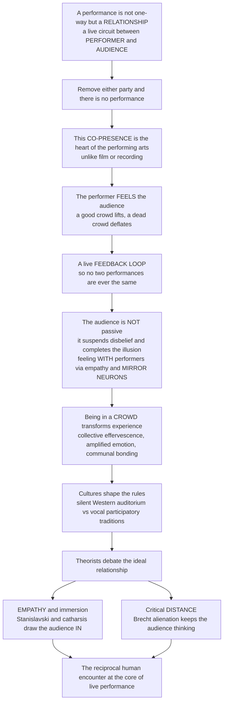

# 🎭 The Performer and the Audience

> [!abstract] TL;DR
> A performance is not a one-way transmission but a **relationship** — a live circuit of energy between two parties, the **performer** and the **audience** — such that removing either one leaves nothing (an empty theatre is silent; an audience with no performer has nothing to watch). This **co-presence and mutual influence** is the beating heart of the performing arts and the thing that makes live performance fundamentally different from film or recording: the performer *feels* the crowd and adjusts in real time (a live **feedback loop**, so no two performances are the same), the audience does active emotional and cognitive **work** (suspending disbelief, feeling *with* the performers via empathy, emotional contagion, and mirror-neuron systems), being in a **crowd** amplifies emotion into a communal — even ritual — bonding experience, cultures set opposite rules for how audiences behave, and theorists have argued for centuries over whether performance should draw the audience *in* through empathy or hold them at a critical *distance* to keep them thinking.

---

## Intuition

**Analogy:** Think of a performance not as a broadcast tower beaming a signal at passive receivers, but as a **conversation** — or better, a shared electrical circuit that only lights up when *both* terminals are connected. A comedian without a crowd is just a person talking to an empty room; a crowd with no one on stage is just people waiting. The performance exists only in the **live loop between them**, and like any circuit, the current flows *both ways*.

Every live performer knows this in their body: a warm, responsive house lifts you and you fly; a cold, silent house deflates you and the same material dies. The audience's laughter, silence, breath, and attention feed *back* and reshape the performance in real time — which is exactly why no two nights are ever identical, and why a recording of a great gig can never quite capture "you had to be there." Meanwhile the audience is doing invisible work of its own — willingly pretending the actor is a king, completing the illusion in imagination, and *feeling with* the people on stage as if their joys and terrors were happening to us. That reciprocal human encounter — not the script, not the set — is what performance fundamentally *is*.

---

## How It Works

### Core Mechanics

1. **Co-presence.** Performer and audience share the *same* time and space. Both know the other is really there, right now, and that anything could happen. This shared vulnerability is the raw material of liveness.
2. **The performer transmits and reads.** The performer projects energy, skill, and *presence*, while simultaneously *reading the room* — timing a pause for a laugh, pushing when the house is hot, pulling back when it is cold.
3. **The audience receives and completes.** The audience is never a passive sink. It *suspends disbelief* (Coleridge), imaginatively co-creates the fiction, interprets meaning, and responds emotionally — feeling *with* the performers through empathy and embodied simulation.
4. **The loop closes.** Laughter, applause, gasps, silence, restlessness, and rapt attention flow *back* to the performer, altering the next moment. Performer and audience mutually constitute a single, self-generating event — Fischer-Lichte's **autopoietic feedback loop**.
5. **The crowd amplifies.** Emotion in a group is contagious: a full house laughs harder and weeps deeper than a scattering of isolated individuals — collective effervescence.
6. **Culture and theory set the rules.** Conventions decide whether the audience sits silent in the dark or calls back and moves, and theorists debate whether the ideal is empathic *immersion* or critical *distance*.

### Flow / Architecture



---

## Key Concepts

### Secondary (accessible)

- **Performance is a relationship, not a broadcast.** It takes *two* — a performer and an audience together. A play in an empty theatre is nothing; the audience is not an optional extra but half of the event.
- **The performer feels the crowd.** A good, warm audience lifts a performer; a "dead" audience deflates them. The energy in the room is real and it changes the show.
- **The audience is active.** Watching is *work*: you agree to pretend the story is real (**suspension of disbelief**), you fill in the gaps with your imagination, and you feel the characters' emotions as if they were partly your own.
- **Crowds amplify feeling.** A joke is funnier, and a sad scene sadder, in a packed house than alone at home — being in a group magnifies emotion. This is why "you had to be there."
- **Live is different from film.** Because a live performance is a two-way loop, no two performances are exactly the same, and a camera can never fully record the electricity of being in the room.

### Undergraduate (some background)

- **The live feedback loop.** The performer and audience form a real-time circuit: the audience's laughter, silence, attention, and energy feed back and shape the performer, who in turn shapes the audience. This is why **every live performance is a unique, co-created event** — the actor "senses the house," the comedian "rides the laughs," the musician plays call-and-response with the room.
- **The performer's presence and craft.** Beyond skill, performers project **presence** and charisma; they carry the **vulnerability and risk** of the live high-wire act (stage fright, failure in real time) and, at their best, enter a state of **flow**. Actors also hold a **double consciousness** — simultaneously *being* the role and *watching themselves* do it (the doer and the observer at once).
- **Empathy and emotional contagion.** Audiences don't just understand a performance; they *feel with* it — identification, empathy, and emotional contagion. This is increasingly linked to **mirror-neuron systems** and **embodied simulation**: watching an action or emotion partly activates the same neural machinery as doing or feeling it ourselves (see [[Motor_System_and_Motor_Control]]).
- **The crowd and collective experience.** Being in a **collective** transforms the experience — Durkheim's **collective effervescence**, the synchronized, amplified emotion of a gathered group, turning performance into a **communal, bonding, even ritual** event.
- **Cultural conventions.** The silent, still, *darkened* Western auditorium is a specific historical convention (crystallized in the 19th century at Wagner's Bayreuth), **not** a universal. Many traditions — Indian, African, popular pantomime — expect **vocal, participatory, mobile** audiences who call out, respond, and move. The **fourth wall** (the imaginary screen between stage and house) can be maintained *or* deliberately broken.
- **Catharsis.** From Aristotle onward, one goal of drawing the audience *in* is **catharsis** — the purging or clarification of pity and fear through emotional immersion in the fiction.

### Graduate (theory-heavy)

- **The autopoietic feedback loop (Fischer-Lichte).** Erika Fischer-Lichte reframes performance as an **event** rather than a text: performers and spectators are physically co-present in a single **autopoietic** (self-generating) feedback loop whose outcome no one fully controls. Meaning and presence *emerge* from the loop rather than being encoded in advance — performance as the production of an unrepeatable event.
- **Production and reception (Bennett).** Susan Bennett analyzes the audience across two frames: the **outer frame** (cultural conventions, ticketing, architecture, the horizon of expectations a spectator brings) and the **inner frame** (the world of the fiction). Reception is socially and materially shaped, connecting theatre studies to **reception theory** and the semiotics of meaning co-produced by the spectator (compare [[Encoding_Decoding_and_Audience_Reception]]).
- **The great debate — empathy vs distance.** The central quarrel of modern performance theory: **empathy / immersion / identification** (Aristotelian catharsis, Stanislavskian emotional truth — dissolve the audience *into* the illusion) **versus critical distance / estrangement** — Brecht's **Verfremdungseffekt** (alienation / distancing effect) of *epic theatre*, which interrupts identification so the spectator stays awake, critical, and aware that a **construction** is being staged, free to judge and to imagine change rather than weep helplessly.
- **The emancipated / active spectator.** Augusto Boal's **spect-actor** and *Theatre of the Oppressed* abolish the passive audience entirely, inviting spectators to intervene and rewrite the action (forum theatre). Jacques Rancière's **emancipated spectator** counters that even the "still" viewer is already active — interpreting, associating, translating — so the passive/active binary is itself suspect.
- **Liveness and mediatization (Auslander).** Philip Auslander argues **liveness is not a natural essence but a historically produced value**, defined *against* recording and increasingly entangled with it (stadium screens, streamed theatre, laugh tracks that simulate a crowd). Immersive, interactive, and digital performance further dissolve the performer-audience boundary, turning spectators into co-creators and, in the streaming age, into tracked and **datafied** audiences — even as the irreplaceable pull of the live encounter endures.

---

## Python Demo

```python
# The performer-audience relationship as a LIVE, COUPLED system.
# (a) The feedback loop: performer energy and audience engagement are mutually
#     coupled, so the SAME performer diverges on a responsive vs a dead night.
# (b) Crowd amplification: emotional contagion makes a group's response larger
#     and more synchronized than isolated individuals -- why comedy is funnier
#     in a full house.

import numpy as np
import matplotlib.pyplot as plt

# ----- (a) Performer <-> Audience feedback loop -----
def simulate_loop(k, steps=600, dt=0.1, a=0.5, b=0.5, g=1.5, P0=1.0):
    """Coupled dynamics with saturating (tanh) responses.
    P = performer energy, A = audience engagement.
    k = how readily the audience responds (responsive vs dead crowd)."""
    P = np.zeros(steps); A = np.zeros(steps)
    P[0], A[0] = P0, 0.0
    for t in range(steps - 1):
        dP = -a * (P[t] - P0) + g * np.tanh(A[t])   # audience lifts the performer
        dA = -b * A[t] + k * np.tanh(P[t])           # performer drives the audience
        P[t + 1] = P[t] + dt * dP
        A[t + 1] = A[t] + dt * dA
    return P, A

steps = 600
time = np.arange(steps) * 0.1
P_hot,  A_hot  = simulate_loop(k=1.2)    # responsive crowd -> positive feedback builds
P_dead, A_dead = simulate_loop(k=0.15)   # dead crowd       -> stays near baseline

# ----- (b) Crowd amplification via emotional contagion (mean-field) -----
# Each person has an intrinsic response r_bar; contagion c and effective
# connectivity (which grows with audience size N) amplify the collective
# response by 1 / (1 - c * N/(N + n0)).
N = np.arange(1, 400)
r_bar = 1.0
n0 = 30.0
def amplification(c):
    coupling = c * N / (N + n0)
    return r_bar / (1.0 - coupling)

# ----- Plot -----
fig, (ax1, ax2) = plt.subplots(1, 2, figsize=(12, 4.6))

ax1.plot(time, P_hot,  color="crimson",   lw=2,          label="Performer energy (responsive crowd)")
ax1.plot(time, A_hot,  color="crimson",   lw=2, ls="--", label="Audience engagement (responsive)")
ax1.plot(time, P_dead, color="steelblue", lw=2,          label="Performer energy (dead crowd)")
ax1.plot(time, A_dead, color="steelblue", lw=2, ls="--", label="Audience engagement (dead)")
ax1.set_title("The live feedback loop: same performer, different night")
ax1.set_xlabel("Time into the performance")
ax1.set_ylabel("Energy / engagement (arb. units)")
ax1.legend(fontsize=8, loc="center right")
ax1.grid(alpha=0.3)

for c in (0.30, 0.60, 0.85):
    ax2.plot(N, amplification(c), lw=2, label=f"contagion c = {c}")
ax2.axhline(r_bar, color="gray", ls=":", label="isolated individual")
ax2.set_title("Crowd amplification: a full house feels more")
ax2.set_xlabel("Audience size N")
ax2.set_ylabel("Collective response per person")
ax2.legend(fontsize=8)
ax2.grid(alpha=0.3)

plt.tight_layout()
plt.savefig("performer_audience.png", dpi=120)
plt.show()

print(f"Responsive crowd -> performer peaks at {P_hot.max():.2f}")
print(f"Dead crowd       -> performer peaks at {P_dead.max():.2f}")
print(f"Amplification at N=300, c=0.85: {amplification(0.85)[299]:.2f}x an isolated viewer")
```

**What it shows.** Panel (a): with the *same* performer, a responsive crowd (high coupling `k`) creates positive feedback — performer energy and audience engagement lift *each other* up toward a peak — while a dead crowd damps the loop and everything flatlines near baseline. That divergence *is* the electricity of the live event. Panel (b): as the crowd grows and emotional contagion `c` rises, the collective response per person climbs far above the isolated individual's — the mathematical shadow of why comedy is funnier, and grief deeper, in a full house.

---

## Real-World Applications

- **Stand-up comedy.** The purest case of the feedback loop: the comedian's timing, callbacks, and even material are steered live by the laughs. The same set "kills" one night and "bombs" the next depending on the room — and specials are deliberately recorded *with a live audience* because the laughter is part of the art.
- **Theatre direction.** Whole staging philosophies split along the empathy-vs-distance axis: a Stanislavskian production seeks emotional immersion and catharsis, while a Brechtian one uses placards, direct address, and visible mechanics to keep spectators critically awake. Immersive work like Punchdrunk's *Sleep No More* dissolves the fourth wall entirely, turning spectators into mobile co-creators.
- **Live music and concerts.** Call-and-response, crowd sing-alongs, and the palpable "energy" of a festival crowd are the feedback loop and collective effervescence in action; artists routinely say the audience "makes the show."
- **Broadcast and streaming.** Sitcom **laugh tracks** are literally engineered emotional contagion — a simulated crowd inserted to make the home viewer laugh more. The "liveness" debate is now central to how streamed theatre, concert films, and stadium jumbotrons are designed and sold.
- **Ritual, sport, and politics.** Religious congregations, sports crowds, and political rallies all exploit the same collective-effervescence machinery of synchronized, amplified, bonding emotion — performance's communal power turned to worship, tribal loyalty, or mobilization.
- **Applied and participatory theatre.** Boal's *Theatre of the Oppressed* and forum theatre weaponize the active spectator: audiences stop the scene, step in, and rehearse solutions to real social problems.

---

## Common Pitfalls

- **Treating the audience as passive receivers.** The old "transmission" picture — performer sends, audience absorbs — misses the audience's active co-creation and the return half of the loop. Meaning and emotion are *produced in the encounter*, not simply delivered.
- **Misreading "suspension of disbelief" as delusion.** The audience does *not* forget it is watching a play; it holds a *willing, partial, double* awareness — enjoying the fiction while knowing it is a fiction. Brecht's whole project depends on this: the spectator can be moved *and* critically aware at once.
- **Assuming more immersion is always better.** Immersion is one aesthetic, not the only good. Brecht argued that critical **distance** can be more powerful — politically and intellectually — than tears, because a spectator lost in illusion is a spectator who cannot judge or imagine change.
- **Mistaking the darkened, silent auditorium for the natural state of theatre.** It is a specific 19th-century Western convention. Treating vocal, participatory, non-Western audiences as "rude" or "primitive" is a category error — those are simply different, equally valid performer-audience contracts.
- **Confusing liveness with mere simultaneity.** Auslander shows liveness is a *cultural value* defined against recording, not a technical fact. A performance streamed in real time is not automatically "live" in the felt, co-present sense that matters.
- **Fetishizing one pole of the relationship.** Over-celebrating audience activity erases the performer's craft and authority; over-mythologizing the star erases the audience's constitutive role. The point is the *relation*, not either terminal alone.

---

## Related Concepts

Within this vault, this note underpins the sibling foundations — *Performing Arts and the Nature of Performance* (why co-presence distinguishes live performance from film), *Performance Theory and the Performative* (performance as an act that *does* something), *Embodiment, Presence and Liveness* (the performer's bodily presence and the felt quality of "live"), *Space, Time and the Performance Event* (the shared here-and-now the loop requires), *Acting and the Craft of Performance* (the performer's double consciousness and playing the room), and *Avant-Garde and Experimental Theatre* (breaking the fourth wall and the Brechtian/Boalian reinvention of spectatorship). Those siblings are referenced here in prose because they are not yet written.

Verified cross-vault links:

- [[Collective_Behavior_and_Crowds]] — how crowds behave, synchronize, and spread emotion; the social science behind an amplifying audience.
- [[Religion_Sacred_and_Secular]] — Durkheim's collective effervescence and ritual, the communal-bonding engine performance shares with worship.
- [[Symbolic_Interactionism_and_Microsociology]] — Goffman's dramaturgy, the idea that everyday social life is itself performed for an audience.
- [[Group_Dynamics]] — how being in a group changes emotion and behavior, the psychology beneath crowd amplification.
- [[Prosocial_Behavior]] — empathy and emotional contagion, the mechanisms by which spectators feel *with* performers.
- [[Motor_System_and_Motor_Control]] — mirror neurons and action observation, the neuroscience of watching a performance and feeling it in your own body.
- [[Media_Audiences_and_Reception]] — the active-vs-passive audience debate in media studies, a close parallel to the live spectator.
- [[Encoding_Decoding_and_Audience_Reception]] — meaning co-produced by the receiver, linking performance to reception theory and semiotics.

---

## Review Questions

**Secondary.**
1. Why can a play not exist with only a performer *or* only an audience? Explain what each side contributes to make a performance happen.
2. What does it mean to "suspend disbelief," and give one example of the audience doing imaginative work during a show.

**Undergraduate.**
3. Describe the performer-audience feedback loop and use it to explain why the same stand-up set can "kill" one night and "bomb" the next.
4. What is collective effervescence, and how does it explain why a joke is funnier in a packed theatre than watched alone at home?
5. Contrast the silent, darkened Western auditorium with a vocal, participatory audience tradition. What different performer-audience *contract* does each assume?

**Graduate.**
6. Fischer-Lichte calls live performance an "autopoietic feedback loop." What does that claim commit us to about authorship, control, and the repeatability of a performance?
7. Stage the empathy-vs-distance debate: what is Brecht's *Verfremdungseffekt* trying to *prevent*, and on what grounds might critical distance be *more* powerful than Aristotelian catharsis?
8. Given Auslander's argument that liveness is a produced cultural value rather than a natural essence, how should we evaluate a real-time streamed theatre production — is it "live," and does the distinction matter for the performer-audience relationship?

---

## Sources

- [Erika Fischer-Lichte, *The Transformative Power of Performance: A New Aesthetics* (Routledge, 2008)](https://www.routledge.com/The-Transformative-Power-of-Performance-A-New-Aesthetics/Fischer-Lichte/p/book/9780415458566) — the autopoietic feedback loop and performance as event.
- [Susan Bennett, *Theatre Audiences: A Theory of Production and Reception* (Routledge)](https://www.routledge.com/Theatre-Audiences-A-Theory-of-Production-and-Reception/Bennett/p/book/9780415157223) — outer/inner frames and the socially shaped spectator.
- [Bertolt Brecht, *Brecht on Theatre* — the distancing / alienation effect (overview)](https://en.wikipedia.org/wiki/Distancing_effect) — epic theatre and critical distance.
- [Augusto Boal, *Theatre of the Oppressed* (overview)](https://en.wikipedia.org/wiki/Theatre_of_the_Oppressed) — the spect-actor and the abolition of the passive audience.
- [Philip Auslander, *Liveness: Performance in a Mediatized Culture* (Routledge)](https://www.routledge.com/Liveness-Performance-in-a-Mediatized-Culture/Auslander/p/book/9780415773539) — liveness as a historically produced value.

---

#performing-arts #performer-and-audience #liveness #suspension-of-disbelief #feedback-loop
