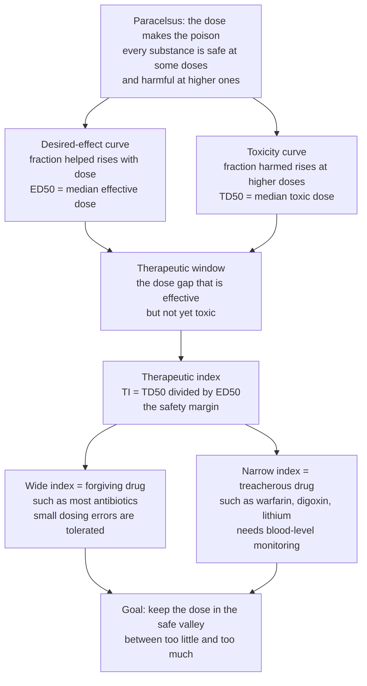

# 💊 Dose-Response and Therapeutic Index

> [!abstract] TL;DR
> Every substance helps at some doses and harms at higher ones; the **dose-response relationship** quantifies both, and the **therapeutic index** (TD50 ÷ ED50) measures the safety gap between the dose that helps and the dose that hurts — deciding whether a drug is forgiving or treacherous, how it must be dosed, and whether it can become a medicine at all.

---

## Intuition

**Analogy — "the dose makes the poison."** This is the oldest and most important idea in pharmacology, coined by the physician Paracelsus around 1538 and still exactly true. There are no safe substances and no poisonous substances — only safe and poisonous *doses*. Water, taken by the gallon fast enough, kills by diluting your blood salts; oxygen at high pressure damages the lungs and brain; botulinum toxin, the deadliest molecule known, smooths wrinkles in microgram specks. A "drug" is simply a substance whose helpful dose and harmful dose we have learned to tell apart.

The magic of a *good* medicine is a **wide gap** between the dose that helps and the dose that harms. Picture two S-shaped curves side by side: one showing the desired effect climbing as dose rises, and a second showing toxicity climbing at higher doses. You want to live in the safe valley *between* them. That gap is the **therapeutic window**, and the ratio of its edges is the **therapeutic index**. A drug with a big index (most antibiotics) is forgiving — take a bit too much and you are fine. A drug with a small index (the blood thinner warfarin, the heart drug digoxin, the mood stabiliser lithium) is treacherous — the effective dose and the toxic dose sit dangerously close, so tiny errors matter and clinicians monitor blood levels obsessively.

---

## How It Works

### Core Mechanics

1. **Graded dose-response (the individual).** In one patient or one tissue, effect *magnitude* rises with dose along a sigmoid (S) curve. Two numbers summarise it: **EC50**, the concentration giving half-maximal effect (a measure of **potency** — how little drug is needed), and **Emax**, the ceiling response (a measure of **efficacy** — how much the drug can do at best). Plotted against *log* dose, the sigmoid straightens into the familiar S.
2. **Quantal dose-response (the population).** Now switch from "how big is the effect" to "*what fraction of people* show an all-or-none response" — cured, or toxic, or dead — as dose rises. Because individuals differ in sensitivity, this cumulative fraction also traces a sigmoid. Its landmarks are **ED50** (median *effective* dose — helps 50% of the population), **TD50** (median *toxic* dose), and historically **LD50** (median *lethal* dose in animal testing).
3. **The safety gap.** The **therapeutic window** is the dose band that is effective in most people but toxic in few. Its single-number summary is the **therapeutic index (TI) = TD50 ÷ ED50** (or LD50 ÷ ED50). Bigger = safer.
4. **Forgiving vs treacherous.** A wide TI (penicillin ~100+) tolerates dosing sloppiness. A narrow TI (warfarin, digoxin, lithium, phenytoin, aminoglycosides — TI near 2–3) means the effective and toxic curves nearly touch, so these drugs demand **therapeutic drug monitoring** of blood levels.
5. **Population, not person.** ED50 and TD50 describe a crowd, not the patient in front of you. Genetics, age, organ function, and disease shift each person along the curve — which is why real dosing individualises around the population average.

### Flow / Architecture



---

## Key Concepts

**Secondary (the big picture).** The dose makes the poison: anything is safe at a low enough dose and dangerous at a high enough one. A useful medicine has a wide space between the dose that helps and the dose that hurts — the **therapeutic window**. The **ED50** is the dose that helps half the people; the **TD50** is the dose that makes half of them sick. A drug where these are far apart (most antibiotics) is forgiving; one where they are close (warfarin, digoxin) is dangerous and needs careful, monitored dosing.

**Undergraduate (the machinery).** Distinguish the **graded** dose-response (individual; effect *magnitude* vs dose; parameters **EC50 = potency** and **Emax = efficacy**) from the **quantal** dose-response (population; *fraction responding* to an all-or-none endpoint vs dose). Both are sigmoidal in linear dose and straighten on a log-dose axis. Read off **ED50**, **TD50**, and **LD50**. Compute the **therapeutic index, TI = TD50 ÷ ED50** — the classic single-number safety metric. Recognise the **narrow-therapeutic-index** drug list (warfarin, digoxin, lithium, phenytoin, aminoglycosides, theophylline) whose small window mandates blood-level monitoring, versus wide-TI drugs dosed by standard schedules. Note the split: **potency ≠ safety** — a very potent drug (tiny ED50) can still have a razor-thin window.

**Graduate (the subtleties and limits).** The TI is a crude ratio of two *medians*; it silently assumes the effect and toxicity curves are **parallel** and ignores their **slope**. Two drugs with identical TI but different steepness carry different real-world risk — a steep toxicity curve means the jump from "safe in most" to "toxic in most" happens over a tiny dose increment. More conservative metrics fix this: the **certain safety factor (CSF) = TD1 ÷ ED99** (the dose harming 1% over the dose helping 99% — a value below 1 is alarming even when TI looks comfortable), and the related **margin of safety**. The quantal curve is the integral of the underlying **tolerance distribution** (individual thresholds are roughly lognormal), so **population variability** — pharmacokinetic (absorption, clearance, drug interactions) and pharmacodynamic (receptor density, genetics, age, disease) — *widens* the curves, *flattens* their slope, and *shrinks* the effective safety margin even when the median TI is unchanged. **Hormesis** — biphasic responses where low doses stimulate and high doses inhibit — reminds us the monotonic sigmoid is an idealisation. These distinctions drive drug-development **go/no-go** decisions, label warnings, and REMS programmes.

---

## Python Demo

```python
# Dose-Response and Therapeutic Index
# Visualises: (a) therapeutic WINDOW + INDEX for a wide-TI vs a narrow-TI drug,
#             (b) the graded (Hill) dose-response, and
#             (c) how population variability flattens curves and shrinks the safe margin.
# Quantal cumulative curves are modelled as a logistic function of log10(dose)
# (a lognormal-style tolerance distribution). numpy + matplotlib only.

import numpy as np
import matplotlib.pyplot as plt

def quantal(dose, d50, slope):
    """Fraction of a population responding (0..1) at a given dose."""
    return 1.0 / (1.0 + np.exp(-slope * (np.log10(dose) - np.log10(d50))))

def graded(dose, ec50, emax, hill=1.0):
    """Graded effect magnitude for an individual (Hill / Emax model)."""
    return emax * dose**hill / (ec50**hill + dose**hill)

dose = np.logspace(0, 3, 500)   # arbitrary dose units, 1 .. 1000, log-spaced

# --- Drug A: WIDE therapeutic index (forgiving, e.g. many antibiotics) ---
edA, tdA = 10.0, 300.0
TI_A = tdA / edA
effA, toxA = quantal(dose, edA, 6), quantal(dose, tdA, 6)

# --- Drug B: NARROW therapeutic index (treacherous, e.g. warfarin/digoxin) ---
edB, tdB = 10.0, 22.0
TI_B = tdB / edB
effB, toxB = quantal(dose, edB, 6), quantal(dose, tdB, 6)

fig, ax = plt.subplots(2, 2, figsize=(13, 9))

# Panel 1: wide-TI drug -- big gap between the curves = wide safe valley
ax[0, 0].plot(dose, effA, color="tab:green", lw=2, label="Therapeutic effect")
ax[0, 0].plot(dose, toxA, color="tab:red",   lw=2, label="Toxicity")
ax[0, 0].fill_betweenx([0, 1], edA, tdA, color="gold", alpha=0.25,
                       label="Therapeutic window")
ax[0, 0].axvline(edA, color="tab:green", ls="--", alpha=0.6)
ax[0, 0].axvline(tdA, color="tab:red",   ls="--", alpha=0.6)
ax[0, 0].set_xscale("log")
ax[0, 0].set_title(f"WIDE therapeutic index (forgiving)\nTI = TD50/ED50 = {TI_A:.0f}")
ax[0, 0].set_xlabel("Dose (log scale)"); ax[0, 0].set_ylabel("Fraction responding")
ax[0, 0].legend(loc="center left", fontsize=8)

# Panel 2: narrow-TI drug -- curves nearly overlap = thin, dangerous window
ax[0, 1].plot(dose, effB, color="tab:green", lw=2, label="Therapeutic effect")
ax[0, 1].plot(dose, toxB, color="tab:red",   lw=2, label="Toxicity")
ax[0, 1].fill_betweenx([0, 1], edB, tdB, color="orangered", alpha=0.25,
                       label="Therapeutic window")
ax[0, 1].axvline(edB, color="tab:green", ls="--", alpha=0.6)
ax[0, 1].axvline(tdB, color="tab:red",   ls="--", alpha=0.6)
ax[0, 1].set_xscale("log")
ax[0, 1].set_title(f"NARROW therapeutic index (treacherous)\nTI = TD50/ED50 = {TI_B:.1f}")
ax[0, 1].set_xlabel("Dose (log scale)"); ax[0, 1].set_ylabel("Fraction responding")
ax[0, 1].legend(loc="center left", fontsize=8)

# Panel 3: GRADED dose-response for an individual -- potency (EC50) vs efficacy (Emax)
ec50, emax = 25.0, 100.0
E = graded(dose, ec50, emax, hill=1.0)
ax[1, 0].plot(dose, E, color="tab:blue", lw=2)
ax[1, 0].axhline(emax, color="grey", ls=":", label=f"Emax = {emax:.0f} (efficacy)")
ax[1, 0].axhline(emax/2, color="purple", ls="--", alpha=0.7)
ax[1, 0].axvline(ec50, color="purple", ls="--", alpha=0.7,
                 label=f"EC50 = {ec50:.0f} (potency)")
ax[1, 0].set_xscale("log")
ax[1, 0].set_title("Graded dose-response (individual)\nEC50 = potency, Emax = efficacy")
ax[1, 0].set_xlabel("Dose (log scale)"); ax[1, 0].set_ylabel("Effect magnitude")
ax[1, 0].legend(loc="center right", fontsize=8)

# Panel 4: VARIABILITY -- a heterogeneous population flattens the effect curve so its
# upper tail overlaps a fixed toxicity curve, shrinking the real safe margin.
eff_tight  = quantal(dose, 10.0, 10.0)   # homogeneous population: steep curve
eff_broad  = quantal(dose, 10.0, 2.2)    # heterogeneous population: shallow curve
tox_fixed  = quantal(dose, 60.0, 5.0)
overlap = np.minimum(eff_broad, tox_fixed)
ax[1, 1].plot(dose, eff_tight, color="tab:green", lw=2, label="Effect: low variability")
ax[1, 1].plot(dose, eff_broad, color="darkgreen", lw=2, ls="--",
              label="Effect: high variability")
ax[1, 1].plot(dose, tox_fixed, color="tab:red", lw=2, label="Toxicity")
ax[1, 1].fill_between(dose, 0, overlap, color="tab:red", alpha=0.25,
                      label="Overlap: patients toxic\nbefore fully treated")
ax[1, 1].set_xscale("log")
ax[1, 1].set_title("Population variability shrinks the safe margin")
ax[1, 1].set_xlabel("Dose (log scale)"); ax[1, 1].set_ylabel("Fraction responding")
ax[1, 1].legend(loc="center left", fontsize=8)

plt.tight_layout()
plt.show()

print(f"Wide-TI drug   : ED50={edA:.0f}  TD50={tdA:.0f}  TI={TI_A:.1f}  -> forgiving")
print(f"Narrow-TI drug : ED50={edB:.0f}  TD50={tdB:.0f}  TI={TI_B:.1f}  -> monitor blood levels")
```

**What to notice:** the wide-TI drug (Panel 1) has a broad gold safe valley; the narrow-TI drug (Panel 2) has curves that almost touch — the same ED50 but a TI near 2, the profile of warfarin or digoxin. Panel 3 separates *potency* (EC50, how far left the curve sits) from *efficacy* (Emax, how high it climbs) — a potent drug is not automatically a safe one. Panel 4 is the graduate-level warning: when a population is heterogeneous the effect curve *flattens*, its upper tail slides under the toxicity curve, and some patients become toxic before others are even treated — a danger the median-based TI completely hides.

---

## Real-World Applications

> **Example — narrow-window drugs and therapeutic drug monitoring.** **Warfarin** (TI ~2) is dosed to a blood target (INR 2–3) with repeated testing because a small over-dose causes bleeding and a small under-dose causes clots. **Digoxin**, **lithium**, **phenytoin**, **theophylline**, and the **aminoglycoside** antibiotics (gentamicin, monitored by peak/trough levels) live in the same treacherous zone — the entire practice of measuring drug blood levels exists *because* these therapeutic windows are narrow. Contrast **penicillin** (TI in the hundreds), given in fixed doses with wide safety.

> **Example — drug approval.** Regulators (FDA, EMA) grant approval only when a candidate shows **efficacy** *and* an acceptable **safety margin**. A promising molecule with a narrow window may fail at the go/no-go gate, or reach market with boxed warnings and mandatory monitoring. **Cancer chemotherapy** is the extreme case: cytotoxic drugs are intentionally dosed near the toxic edge (an inherently narrow TI), which is why oncology dosing is so precise and closely supervised.

> **Example — special populations.** Because ED50/TD50 describe an average crowd, **paediatric**, **geriatric**, **renal-** and **hepatic-impaired** patients — and those with variant drug-metabolising genes — are shifted along the curve, so their doses are adjusted away from the population default to stay inside the window.

---

## Common Pitfalls

- **Confusing potency with safety.** A low ED50 (high potency) says *nothing* about the width of the window. A very potent drug can have a razor-thin therapeutic index; potency and safety are independent axes.
- **Treating the therapeutic index as complete.** TI is a ratio of two medians and assumes parallel curves. Two drugs with identical TI but different *slopes* carry different real risk — always ask about the steepness of the toxicity curve, or use the more conservative certain safety factor (TD1/ED99).
- **Extrapolating animal LD50 to humans.** Interspecies differences in metabolism make animal lethal doses a crude guide; regulators divide by large uncertainty factors precisely because the human curve is not the mouse curve.
- **Mistaking the population for the patient.** ED50 and TD50 are crowd statistics. The person in front of you may sit far from the median because of genetics, age, organ function, or drug interactions — dose to the individual, monitor when the window is narrow.
- **Ignoring what shifts the window.** Active metabolites, drug–drug interactions, and altered clearance move the effective and toxic curves in real time; a window that looked comfortable at approval can narrow at the bedside.
- **Assuming a strictly monotonic curve.** Hormesis (low-dose stimulation, high-dose inhibition) and non-monotonic responses break the simple single-sigmoid picture for some agents, especially hormones and endocrine-active compounds.

---

## Related Concepts

Within this vault, dose-response is the quantitative bridge between the two halves of pharmacology: **Pharmacodynamics (Drug Action)** supplies the graded curve's mechanism — receptor occupancy, agonism, and the EC50/Emax that define potency and efficacy — while **Pharmacokinetics (ADME)** determines what dose actually reaches the target, translating a prescribed dose into the blood concentration that lands somewhere on these curves; **Drug-Receptor Interactions and Binding** underlies the sigmoid shape itself. Staying inside the therapeutic window is the whole aim of **Drug Safety, Pharmacovigilance and Adverse Effects**, and the reason narrow-index drugs need monitoring, while **Pharmacogenomics and Personalized Dosing** explains the genetic variability that shifts individuals along the curve. (These sibling notes live in this Pharmacology vault.)

Verified cross-vault links:

- [[Environmental_Health_and_Toxicology]] — the toxicology home of "the dose makes the poison," LD50, NOAEL, and the safety-factor logic that mirrors the therapeutic index.
- [[Medical_Testing_and_Diagnostics]] — therapeutic drug monitoring (measuring blood levels of warfarin, digoxin, lithium) is exactly the diagnostic testing that keeps narrow-index drugs inside the window.
- [[Evidence_Based_Medicine_and_Clinical_Trials]] — how efficacy and safety margins are established, and how the risk-benefit judgement drives drug approval.
- [[Precision_Medicine_and_Genomics_in_the_Clinic]] — the clinical face of population variability: tailoring dose to the individual's genome and physiology.
- [[Common_Probability_Distributions]] — the quantal curve is the cumulative of a (roughly lognormal) tolerance distribution; the sigmoid is a CDF.

---

## Review Questions

1. **(Secondary)** Explain "the dose makes the poison" using water or oxygen as an example. Why can a substance be both a medicine and a poison?
2. **(Secondary)** What is the therapeutic window, and why must a doctor monitor blood levels for warfarin but not for most antibiotics?
3. **(Undergraduate)** Distinguish a *graded* from a *quantal* dose-response curve. Which one gives you EC50 and Emax, and which gives you ED50 and TD50? Why do both look sigmoidal on a log-dose axis?
4. **(Undergraduate)** Drug X has ED50 = 5 mg and TD50 = 50 mg; Drug Y has ED50 = 0.1 mg and TD50 = 0.4 mg. Which is more *potent*, and which is *safer*? Compute both therapeutic indices and justify why potency and safety are not the same thing.
5. **(Graduate)** Two drugs have identical therapeutic indices, but one has a much steeper toxicity curve. Why might the steep-curve drug be more dangerous in practice, and how do the certain safety factor (TD1/ED99) and margin of safety capture this that TI misses?
6. **(Graduate)** A drug looks safe by median TI in trials but produces unexpected toxicity when marketed to a broad population. Using the ideas of tolerance distributions and pharmacokinetic/pharmacodynamic variability, explain how population heterogeneity can shrink the real safe margin without changing the median TI.

---

## Sources

- Katzung, B. G. *Basic and Clinical Pharmacology* — chapter on Drug Receptors and Pharmacodynamics (graded and quantal dose-response, therapeutic index).
- Brunton, L. et al. *Goodman & Gilman's The Pharmacological Basis of Therapeutics* — Pharmacodynamics; dose-response and the therapeutic index.
- Ritter, J. et al. *Rang & Dale's Pharmacology* — How drugs act; dose-response relationships and safety.
- Klaassen, C. D. *Casarett & Doull's Toxicology: The Basic Science of Poisons* — dose-response, LD50/ED50, therapeutic index and margin of safety.

---

#pharmacology #dose-response #therapeutic-index #therapeutic-window #drug-safety
