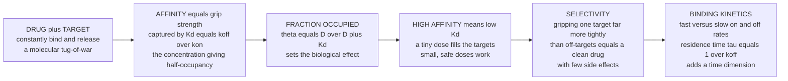

# 🤝 Drug-Receptor Interactions and Binding

> [!abstract] TL;DR
> Whether a drug works comes down to a **molecular handshake** — how tightly and how selectively it grips its target. **Affinity** is the strength of that grip, captured by a single number, the **dissociation constant** $K_d = k_{off}/k_{on}$: the drug concentration at which half the targets are occupied, so a *lower* $K_d$ means a *tighter* grip. The interaction is a dynamic tug-of-war of binding and release; at any instant some **fractional occupancy** $\theta = [D]/([D]+K_d)$ of targets is engaged, and more occupancy generally means more effect. A drug that grips its intended target far more tightly than everything else is **selective** — the difference between a clean medicine and a dirty one full of side effects — and the interaction has a *time* dimension too, its **residence time** $\tau = 1/k_{off}$. Affinity, occupancy, selectivity, and kinetics are where pharmacology becomes quantitative physical chemistry, and where good drugs are made.

## Intuition

**Analogy — a handshake, not a permanent weld.** Imagine every drug molecule and its target greeting each other with a handshake. Some handshakes are limp and slip apart instantly; others are firm and hold. **Affinity is the firmness of the grip.** A high-affinity drug clings so tightly that even a tiny amount finishes the job — a single confident handshake seals the deal. A low-affinity drug keeps slipping off, so you must flood the room with molecules to get enough hands clasped at any moment. Nobody's grip is permanent: molecules constantly grab and let go, a molecular tug-of-war, and at any snapshot only some fraction of the targets are actually being held — that fraction is the **occupancy**, and it sets the size of the effect.

Now add two refinements chemists obsess over. First, **selectivity**: a good drug shakes hands enthusiastically with its one intended partner and coldly ignores everyone else in the room — a drug that grips its target a thousand times more tightly than off-targets can be given in small, safe doses that touch only what they should. Second, **time**: some drugs grab and release in a flash while others latch on for hours. The handshake between a molecule and its target — its **strength, selectivity, and duration** — is the bedrock of drug design.

---

## How It Works

### Core Mechanics

A drug $D$ and its target (receptor) $R$ reversibly form a complex $DR$, governed by the **law of mass action** — exactly the equilibrium physics of any reversible reaction:

$$D + R \;\underset{k_{off}}{\overset{k_{on}}{\rightleftharpoons}}\; DR$$

1. **The binding equilibrium.** Association happens at rate $k_{on}[D][R]$ and dissociation at rate $k_{off}[DR]$. At equilibrium these balance, defining the **dissociation constant**

$$K_d = \frac{k_{off}}{k_{on}} = \frac{[D][R]}{[DR]}$$

$K_d$ has units of concentration. **A lower $K_d$ means higher affinity** — the complex resists falling apart. Typical drugs sit anywhere from millimolar (weak) to picomolar (extremely tight).

2. **Occupancy.** Rearranging mass action gives the **fractional occupancy** — the fraction of all targets that are bound at drug concentration $[D]$:

$$\theta = \frac{[DR]}{[R]_{total}} = \frac{[D]}{[D] + K_d}$$

This hyperbola is the central equation. When $[D] = K_d$, exactly $\theta = 0.5$: **$K_d$ is the concentration that half-occupies the target.** Plotted against the *logarithm* of concentration it becomes the familiar sigmoid.

3. **Occupancy drives effect.** In the simplest **occupancy theory**, response tracks occupancy, so the tighter the binding the smaller the dose needed. (Real effect curves can be left-shifted from binding curves by **efficacy** and **spare receptors** — a full agonist may need only a fraction of receptors occupied to produce a maximal response.)

4. **The forces behind the grip.** Affinity is bought with **noncovalent intermolecular forces** summed over a shape- and chemistry-complementary **binding pocket**: hydrogen bonds, electrostatic salt bridges, the hydrophobic effect, and van der Waals contacts (the "induced fit" refinement of the classic lock-and-key). Better molecular complementarity means more favorable binding free energy, $\Delta G^\circ = -RT\ln K_a = RT\ln K_d$.

5. **Selectivity and time.** Gripping the target far more tightly than off-targets (a large **selectivity window**, $K_{d,\text{off}}/K_{d,\text{target}}$) is what keeps side effects low. And the *kinetics* — how fast the drug binds ($k_{on}$) and unbinds ($k_{off}$) — set the drug-target **residence time** $\tau = 1/k_{off}$, increasingly seen as as important as equilibrium affinity for the effect a drug actually produces inside the body.

### Flow / Architecture



---

## Key Concepts / Details

### Secondary Level

- **Receptor.** A protein (often on a cell surface) that a drug or natural signaling molecule binds to, triggering a response. The drug's binding partner is its **target**.
- **Affinity = grip strength.** How tightly a drug holds its target. High affinity = tight grip = small dose needed; low affinity = loose grip = large dose needed.
- **The tug-of-war is dynamic.** Drug molecules constantly bind and let go. At any instant, some fraction of targets are **occupied**; more occupancy generally means more effect.
- **Lock and key.** A drug fits its binding pocket like a key in a lock — shape and chemistry must match. A well-fitting key (good complementarity) grips tightly.
- **Selectivity.** A "clean" drug binds mostly its intended target and ignores others, so it causes few side effects. A "dirty" drug binds many targets and causes many side effects.

### Undergraduate Level

- **Law of mass action and $K_d$.** For $D + R \rightleftharpoons DR$, the **dissociation constant** $K_d = [D][R]/[DR] = k_{off}/k_{on}$. Lower $K_d$ = higher affinity. The **association constant** is its reciprocal, $K_a = 1/K_d$.
- **Occupancy equation.** $\theta = [D]/([D] + K_d)$. Setting $[D] = K_d$ gives $\theta = 0.5$ — the operational definition of $K_d$. On a log-concentration axis this hyperbola becomes a symmetric **sigmoid** whose midpoint sits at $\log K_d$.
- **Occupancy vs effect.** Occupancy theory equates response with $\theta$, but observed **dose-response** curves often differ from **binding** curves. **Efficacy** (intrinsic activity) and **spare receptors / receptor reserve** mean a partial occupancy can give a maximal response — potency ($EC_{50}$) is not the same as affinity ($K_d$).
- **Agonists vs antagonists.** Both need affinity to bind; an **agonist** additionally has efficacy (it activates the receptor), while a pure **antagonist** binds with affinity but zero efficacy — it just occupies the site and blocks the natural ligand.
- **$K_d$ vs $K_i$ vs $IC_{50}$.** $K_d$ = affinity from direct (saturation) binding. $K_i$ = inhibition constant, a competitor's affinity. $IC_{50}$ = concentration giving 50 percent inhibition in a specific assay (depends on conditions). They are linked by the **Cheng–Prusoff** relation: $K_i = IC_{50}/(1 + [L]/K_d)$.
- **Binding forces.** Affinity is the sum of **noncovalent** interactions in the pocket — hydrogen bonds, electrostatic/salt bridges, hydrophobic contacts, van der Waals — mediated by water. This is the molecular-recognition basis of structure-based drug design.
- **Orthosteric vs allosteric.** **Orthosteric** ligands bind the natural (active) site; **allosteric** ligands bind a distinct pocket and tune the receptor's response to the orthosteric ligand (positive or negative modulators).

### Graduate Level

- **Binding kinetics.** The equilibrium $K_d$ hides two rate constants. The **association rate** $k_{on}$ (units $M^{-1}s^{-1}$, often near the diffusion limit $\sim 10^{6}$–$10^{9}$) and the **dissociation rate** $k_{off}$ (units $s^{-1}$). The observed relaxation to equilibrium is first-order with $k_{obs} = k_{on}[D] + k_{off}$.
- **Residence time.** $\tau = 1/k_{off}$ — how long, on average, a drug stays bound. Two drugs with identical $K_d$ can have wildly different $\tau$. Long residence time can decouple in-vivo effect from plasma concentration (the drug stays on target after it has cleared the blood). This is the modern **binding-kinetics / residence-time** paradigm in drug discovery.
- **Kinetic selectivity.** Selectivity can come not only from a lower $K_d$ at the target but from a *slower* $k_{off}$ at the target than at off-targets — a drug can be selective in time even when thermodynamic affinities are similar.
- **Reversible vs irreversible (covalent) binding.** Most drugs bind reversibly. **Covalent inhibitors** form a bond (often via a warhead reacting with an active-site residue) characterized by $k_{inact}/K_i$; their effect persists until the target protein is resynthesized. A double-edged sword: durable effect but potential off-target toxicity.
- **Thermodynamics of binding.** $\Delta G^\circ = -RT\ln K_a = \Delta H^\circ - T\Delta S^\circ$. **Enthalpy-driven** binding (specific H-bonds/electrostatics) is often prized for selectivity; **entropy-driven** binding leans on the hydrophobic effect. **Isothermal titration calorimetry (ITC)** dissects $\Delta H$ vs $\Delta S$.
- **Binding models.** **Lock-and-key** (rigid), **induced fit** (the pocket molds to the ligand), and **conformational selection** (the ligand captures a pre-existing receptor conformation) — real recognition mixes all three.
- **Measuring binding.** **Radioligand saturation** assays give $K_d$ and $B_{max}$; **competition** assays give $K_i$ via Cheng–Prusoff; **Scatchard analysis** (bound/free vs bound) linearizes saturation data (slope $-1/K_d$). Biophysical, label-free methods — **surface plasmon resonance (SPR)** — read $k_{on}$, $k_{off}$, and $K_d$ directly in real time.
- **Polypharmacology.** Not all good drugs are singularly selective: some are *deliberately* multi-target (e.g., kinase inhibitors, atypical antipsychotics) where a defined polypharmacology profile beats a single-target drug.

---

## Python Demo

```python
# Drug-receptor binding made visual: the law of mass action.
# Fractional occupancy  theta = [D] / ([D] + Kd)
#   Kd = dissociation constant = concentration giving 50% occupancy
#   lower Kd  ->  higher affinity  ->  tighter grip
import numpy as np
import matplotlib.pyplot as plt


def occupancy(conc, Kd):
    """Fraction of receptors occupied at drug concentration `conc`."""
    return conc / (conc + Kd)


# Two drugs with different affinities (units: nM)
Kd_high = 1.0      # high-affinity drug: Kd = 1 nM  (tight grip)
Kd_low  = 100.0    # low-affinity  drug: Kd = 100 nM (loose grip)

conc_lin = np.linspace(0, 400, 500)     # linear concentration axis (nM)
conc_log = np.logspace(-2, 4, 500)      # log concentration axis (nM)

# Selectivity: ONE drug, its target vs an off-target
Kd_target    = 2.0      # binds the intended target tightly
Kd_offtarget = 200.0    # binds an off-target 100x more weakly

# Binding kinetics: first-order approach to equilibrium at fixed [D]
kon  = 1e-2   # per nM per second (association rate constant)
koff = 1e-2   # per second        (dissociation rate constant)
D    = 5.0    # fixed drug concentration (nM)
t    = np.linspace(0, 600, 500)                 # seconds
theta_eq = kon * D / (kon * D + koff)           # equilibrium occupancy
kobs     = kon * D + koff                        # observed relaxation rate
theta_t  = theta_eq * (1 - np.exp(-kobs * t))    # approach to equilibrium
tau      = 1.0 / koff                             # residence time = 1/koff

fig, ax = plt.subplots(2, 2, figsize=(12, 9))

# (a) Hyperbolic binding isotherm on a LINEAR axis: Kd = half-occupancy
ax[0, 0].plot(conc_lin, occupancy(conc_lin, Kd_high), lw=2,
              label=f"high affinity  Kd={Kd_high:.0f} nM")
ax[0, 0].plot(conc_lin, occupancy(conc_lin, Kd_low), lw=2,
              label=f"low affinity  Kd={Kd_low:.0f} nM")
for Kd, c in [(Kd_high, "C0"), (Kd_low, "C1")]:
    ax[0, 0].plot([Kd, Kd], [0, 0.5], ls="--", color=c, alpha=0.6)
    ax[0, 0].plot([0, Kd], [0.5, 0.5], ls="--", color=c, alpha=0.6)
ax[0, 0].set(title="(a) Binding isotherm: Kd is the half-occupancy point",
             xlabel="[Drug]  (nM)", ylabel="fractional occupancy  theta")
ax[0, 0].legend(); ax[0, 0].set_ylim(0, 1.02)

# (b) Same curves on a LOG axis -> the classic sigmoid
ax[0, 1].semilogx(conc_log, occupancy(conc_log, Kd_high), lw=2, label="high affinity")
ax[0, 1].semilogx(conc_log, occupancy(conc_log, Kd_low),  lw=2, label="low affinity")
ax[0, 1].axhline(0.5, color="grey", lw=0.8, alpha=0.5)
ax[0, 1].axvline(Kd_high, color="C0", ls="--", alpha=0.6)
ax[0, 1].axvline(Kd_low,  color="C1", ls="--", alpha=0.6)
ax[0, 1].set(title="(b) Log axis: sigmoid, Kd at the inflection",
             xlabel="[Drug]  (nM, log scale)", ylabel="fractional occupancy  theta")
ax[0, 1].legend(); ax[0, 1].set_ylim(0, 1.02)

# (c) Selectivity window: target vs off-target for the same drug
ax[1, 0].semilogx(conc_log, occupancy(conc_log, Kd_target), lw=2,
                  label=f"target  Kd={Kd_target:.0f} nM")
ax[1, 0].semilogx(conc_log, occupancy(conc_log, Kd_offtarget), lw=2, ls="--",
                  label=f"off-target  Kd={Kd_offtarget:.0f} nM")
ax[1, 0].axvspan(Kd_target, Kd_offtarget, color="green", alpha=0.12)
ax[1, 0].text(np.sqrt(Kd_target * Kd_offtarget), 0.15,
              "selectivity\nwindow (100x)", ha="center", color="green")
ax[1, 0].set(title="(c) Selectivity: 100x gap between target and off-target Kd",
             xlabel="[Drug]  (nM, log scale)", ylabel="fractional occupancy  theta")
ax[1, 0].legend(); ax[1, 0].set_ylim(0, 1.02)

# (d) Binding kinetics: first-order approach to equilibrium
ax[1, 1].plot(t, theta_t, lw=2, color="C3")
ax[1, 1].axhline(theta_eq, color="grey", ls="--", alpha=0.7,
                 label=f"equilibrium theta={theta_eq:.2f}")
ax[1, 1].axvline(tau, color="k", ls=":", alpha=0.6)
ax[1, 1].text(tau * 1.05, 0.12, f"residence time\ntau = 1/koff = {tau:.0f} s", color="k")
ax[1, 1].set(title="(d) Binding kinetics: approach to equilibrium",
             xlabel="time  (s)", ylabel="fractional occupancy  theta")
ax[1, 1].legend(); ax[1, 1].set_ylim(0, 1.02)

fig.suptitle("Drug-Receptor Binding: affinity (Kd), occupancy, selectivity, kinetics",
             fontsize=13)
fig.tight_layout()
plt.show()
```

**What it shows.** Panel (a): both drugs follow the same hyperbola, but the high-affinity drug reaches half-occupancy at just 1 nM versus 100 nM — a hundred-fold smaller effective dose. Panel (b): on a log axis the hyperbola becomes the textbook sigmoid, with $K_d$ sitting exactly at the inflection. Panel (c): a single drug's 100-fold gap between target and off-target $K_d$ opens a **selectivity window** — a dose range that saturates the target while barely touching the off-target. Panel (d): even after adding drug, occupancy climbs to equilibrium over time, and $\tau = 1/k_{off}$ sets how long a drug lingers on its target.

---

## Real-World Applications

- **Statins (target affinity in numbers).** Atorvastatin grips HMG-CoA reductase with sub-nanomolar affinity; the whole point of the medicinal-chemistry campaign was to drive $K_d$ down so a small oral dose fully engages the enzyme.
- **Residence time in the clinic.** Tiotropium (a bronchodilator) is a textbook long-residence-time drug: it dissociates from the M3 muscarinic receptor extremely slowly ($\tau$ of hours), giving once-daily dosing while sparing the M2 receptor kinetically — a real example of **kinetic selectivity**.
- **Selectivity failures and successes.** First-generation antihistamines bound off-target CNS receptors (sedation); second-generation agents were engineered for a wider **selectivity window** and peripheral targeting. Kinase inhibitors are optimized ceaselessly against off-target kinase panels to keep the selectivity ratio high.
- **Covalent drugs.** Aspirin covalently acetylates cyclooxygenase; ibrutinib covalently binds a cysteine in BTK. Their effect outlasts the drug in the blood because recovery requires new protein synthesis — irreversible binding trading durability for care about off-target reactivity.
- **Structure-based drug design.** SPR and ITC feed $k_{on}$, $k_{off}$, $\Delta H$, and $\Delta S$ back to chemists who reshape a molecule atom by atom to add a hydrogen bond or fill a hydrophobic pocket, nudging $K_d$ lower and selectivity higher — the quantitative loop that produces modern drugs.

---

## Common Pitfalls

- **Confusing potency with affinity.** $EC_{50}$ (functional potency) is not $K_d$ (binding affinity). Efficacy and **spare receptors** left-shift the dose-response curve relative to the binding curve, so a low $EC_{50}$ does not prove tight binding.
- **Treating $IC_{50}$ as a constant.** $IC_{50}$ depends on assay conditions — competitor concentration, substrate level, incubation time. Only $K_i$ (via **Cheng–Prusoff**) is the condition-independent affinity. Comparing raw $IC_{50}$ values across assays is a classic error.
- **Ignoring kinetics — the equilibrium trap.** Two compounds with equal $K_d$ can behave completely differently in vivo if their $k_{off}$ differ; optimizing $K_d$ alone can miss a drug whose *residence time* is what actually drives efficacy.
- **Assuming binding equals a response.** Antagonists bind with high affinity yet produce no signal on their own. Occupancy is necessary but not sufficient for effect — efficacy matters.
- **Overrating raw hydrogen-bond counts.** Because **water competes** for hydrogen bonds and screens charges, the *net* contribution of a polar contact in the pocket is far smaller than its gas-phase strength. Adding polar groups can even *lower* affinity if it costs more desolvation than it repays.
- **Chasing affinity at the expense of selectivity.** Driving $K_d$ ever lower can pull in off-targets too; the useful quantity is the **selectivity window** (the ratio of off-target to target affinity), not target affinity alone.

---

## Related Concepts

- [[Chemical_Equilibrium]] — the law of mass action and the equilibrium constant are exactly the machinery behind $K_d$; binding is a reversible reaction reaching dynamic equilibrium.
- [[Chemical_Kinetics]] — the $k_{on}$ and $k_{off}$ rate constants, the first-order approach to equilibrium, and residence time are pure chemical kinetics applied to a drug-target pair.
- [[Intermolecular_Forces_and_the_Aqueous_Environment]] — the noncovalent forces (hydrogen bonds, electrostatics, hydrophobic effect, van der Waals) summed over complementary surfaces are what generate affinity and specificity.
- [[Protein_Structure_and_Function]] — the binding pocket is a feature of the target protein's fold; molecular complementarity between ligand and pocket determines the grip.
- [[Enzyme_Kinetics_and_Catalysis]] — enzymes are a major class of drug target; $K_i$, competitive inhibition, and the Cheng–Prusoff link come straight from enzyme kinetics.
- [[Proteins_and_Amino_Acids]] — the amino-acid side chains lining a pocket (charged, polar, hydrophobic, aromatic) supply the specific interactions a drug must match.

This note quantifies the binding step that underlies the sibling notes *Pharmacodynamics_Drug_Action* (what the drug does once bound), *Pharmacology_and_Drug_Discovery_Overview* (where binding sits in the discovery pipeline), *Dose_Response_and_Therapeutic_Index* (how occupancy translates into the dose-response and safety window), *Structure_Based_Drug_Design_and_Docking* (predicting affinity from structure), and *Enzymes_as_Drug_Targets* (the largest single target class).

---

## Review Questions

1. **(Secondary)** Two drugs act on the same receptor. Drug A has $K_d = 1$ nM and Drug B has $K_d = 100$ nM. Which drug grips its target more tightly, and which would require a larger dose to occupy half the receptors? Explain in terms of the handshake analogy.
2. **(Undergraduate)** Starting from the law of mass action for $D + R \rightleftharpoons DR$, derive the occupancy equation $\theta = [D]/([D]+K_d)$ and show that $\theta = 0.5$ when $[D] = K_d$. Why does the same curve look like a hyperbola on a linear axis but a sigmoid on a log axis?
3. **(Undergraduate)** A candidate binds its target with $IC_{50} = 50$ nM in an assay run at $[L] = 4K_d$ of the competing ligand. Use the Cheng–Prusoff relation to estimate $K_i$. Why is reporting $K_i$ rather than $IC_{50}$ important when comparing compounds across labs?
4. **(Graduate)** Two inhibitors have identical $K_d = 5$ nM, but inhibitor X has $k_{off} = 10^{-1}\,s^{-1}$ and inhibitor Y has $k_{off} = 10^{-4}\,s^{-1}$. Compute their residence times. Given rapid drug clearance from plasma, which would you expect to sustain a longer pharmacological effect in vivo, and why does equilibrium affinity alone fail to predict this?
5. **(Graduate)** A medicinal chemist adds a charged group to improve a hydrogen bond in the pocket but affinity *drops*. Give two thermodynamic reasons rooted in the aqueous environment (desolvation, water competition, dielectric screening) that could explain this counterintuitive result.

---

## Sources

- Kenakin, T. *A Pharmacology Primer: Techniques for More Effective and Strategic Drug Discovery* (5th ed.), Academic Press — affinity, occupancy, and receptor theory.
- Rang, H. P.; Ritter, J. M.; Flower, R. J.; Henderson, G. *Rang & Dale's Pharmacology* — "How Drugs Act: General Principles" (drug binding, $K_d$, occupancy).
- Copeland, R. A. *Evaluation of Enzyme Inhibitors in Drug Discovery* (2nd ed.), Wiley — binding kinetics, residence time, $K_i$ vs $IC_{50}$, Cheng–Prusoff.
- Katzung, B. G.; Vanderah, T. W. *Basic and Clinical Pharmacology* (15th ed.), McGraw-Hill — drug-receptor interactions and dose-response.
- Copeland, R. A.; Pompliano, D. L.; Meek, T. D. "Drug-target residence time and its implications for lead optimization." *Nature Reviews Drug Discovery* (2006).

---

#pharmacology #receptor-binding #affinity #Kd #selectivity
