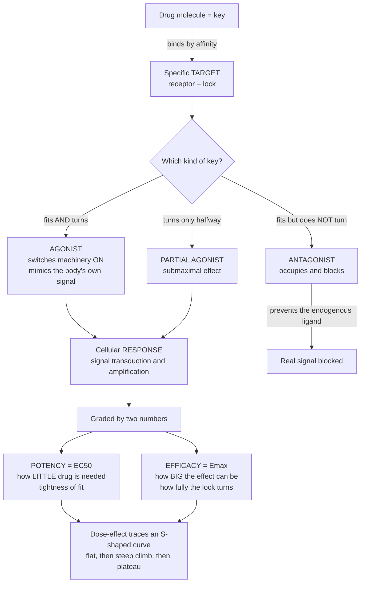

# 💊 Pharmacodynamics: How Drugs Act on the Body

> [!abstract] TL;DR
> **Pharmacodynamics is "what the drug does to the body"** — the molecular mechanism behind a drug's effect. Almost every drug works by binding a specific protein **target**, usually a **receptor**, like a key in a lock. Whether the lock turns depends on the *kind* of key: an **agonist** fits *and* turns it (switching cellular machinery **on**, mimicking the body's own signal); an **antagonist** fits but *does not* turn it (**blocking** the real signal); a **partial agonist** turns it only halfway. Two numbers grade a drug: **potency** (how little you need — the concentration for half-maximal effect, **EC50**) and **efficacy** (the biggest effect it can produce — **Emax**). The link between dose and effect always traces a characteristic **S-shaped (sigmoidal) curve** — nothing at tiny doses, a steep climb, then a plateau once the receptors are saturated. Agonists, antagonists, potency, and efficacy are the *grammar* of drug action, and pharmacodynamics is the "what the drug does" half of pharmacology, paired with pharmacokinetics.

## Intuition — analogy first

Think of a drug molecule as a **key**, and its target protein as a **lock** built into the surface of a cell. Fitting the key into the lock is just the first step — the interesting part is what happens *after* it fits.

Some keys **fit and turn the lock**, throwing the cellular switch to **ON**. These are **agonists** — they copy the body's own signal. Adrenaline hitting its receptor to speed up the heart is the endogenous version; a drug like salbutamol is a manufactured key that turns the same lock to open the airways.

Some keys **fit the lock but refuse to turn it**. They just sit in the keyhole, and while they are there, the *real* key — the body's own signal — can't get in. These are **antagonists**, and an enormous number of medicines work this way: antihistamines sit in histamine's lock, beta-blockers sit in adrenaline's lock. The drug's "effect" is the *absence* of a signal that would otherwise fire.

A **partial agonist** is a worn key that turns the lock **only halfway** — some effect, but never the full response no matter how many you push in.

Finally, two separate qualities describe how good a key is. **Potency** is how *tightly* the key fits — a potent drug needs only a tiny amount because it grips the lock so well. **Efficacy** is how *fully* it can turn the lock — the biggest effect it is capable of producing. These are independent: a key can fit exquisitely (very potent) yet only turn the lock halfway (low efficacy). Push in more and more keys and the response follows an **S-shaped curve** — flat when almost no locks are engaged, steeply rising as they fill, then flat again once every lock is occupied and there is nothing left to turn.

---

## How It Works

**Core mechanics.** (1) A drug **binds** a specific target with some **affinity** (how tightly), forming a drug–receptor complex. (2) What that complex *does* depends on the drug's **intrinsic activity**: an agonist stabilizes the receptor's active conformation and triggers downstream signaling; an antagonist occupies the site without activating it. (3) The activated receptor launches a **signal-transduction cascade** that **amplifies** a faint binding event into a large cellular response. (4) Across a range of doses, the effect traces a **sigmoidal (Hill) curve** characterized by **potency (EC50)** and **efficacy (Emax)**. (5) Repeated activation can trigger **adaptive responses** — desensitization, receptor downregulation, and **tolerance**.



---

## Key Concepts / Details

### Secondary Level

- **Drugs act by binding a target.** The target is usually a **receptor** — a protein on or in a cell — and the drug fits it like a key in a lock.
- **Agonist = activates.** It turns the receptor **on**, copying the body's natural signal (e.g., a hormone or neurotransmitter).
- **Antagonist = blocks.** It occupies the receptor *without* switching it on, stopping the natural signal from acting. Its effect is the *absence* of a response.
- **Potency vs efficacy.** *Potency* = how much drug you need (less = more potent). *Efficacy* = the largest effect the drug can ever produce. A drug can be very potent but have low efficacy, or vice versa.
- **Dose–response is S-shaped.** Too little does nothing; then the effect rises steeply; then it **plateaus** once all receptors are occupied.
- **Same mechanism, two faces.** The wanted (therapeutic) effect and unwanted (adverse) effects often flow from the *same* receptor action or from binding *off-target* receptors.

### Undergraduate Level

- **Drug targets (the four superfamilies + more).** **Receptors** are the main class, but drugs also act on **enzymes** (e.g., statins on HMG-CoA reductase), **ion channels**, **transporters** (e.g., SSRIs on the serotonin transporter), and **nucleic acids**. Receptor detail lives deeper in the section's target notes.
- **Affinity and the drug–receptor complex.** *Affinity* is how tightly a drug binds, captured by the dissociation constant **Kd** (lower Kd = tighter). Binding is an **equilibrium** ($D + R \rightleftharpoons DR$) — the same mass-action logic as [[Chemical_Equilibrium]]. The **DR complex** is what drives (or blocks) the response.
- **Specificity vs selectivity.** No drug is perfectly specific; it is *selective* for a target over a range of concentrations. Binding to unintended targets produces **off-target effects** — a major source of adverse reactions.
- **The agonist spectrum.**
  - **Full agonist** — produces the tissue's maximal response (full intrinsic activity).
  - **Partial agonist** — produces a **submaximal** response even when it occupies *every* receptor; it can also *antagonize* a full agonist by competing for the same sites.
  - **Inverse agonist** — reduces **constitutive (baseline) activity** of a receptor that signals even without a ligand — the opposite of an agonist, not merely a blocker.
  - **Neutral antagonist** — binds with affinity but **zero intrinsic activity**; no effect alone, only blockade.
- **Antagonist types.**
  - **Competitive (surmountable)** — binds the *same* site as the agonist; **shifts the dose–response curve to the right** but **Emax is preserved** because enough agonist can outcompete it (e.g., naloxone at opioid receptors).
  - **Non-competitive / irreversible (insurmountable)** — binds irreversibly or at a separate site in a way that **lowers Emax**; extra agonist cannot fully restore the ceiling.
  - **Allosteric modulators** — bind a *different* (allosteric) site and tune the response of the orthosteric ligand up (**PAM**) or down (**NAM**) without directly activating the receptor.
- **Quantifying action — the Hill equation.** The graded concentration–effect relationship is $E = \dfrac{E_{max}\,[A]^{n}}{EC_{50}^{\,n} + [A]^{n}}$, where **EC50** (concentration for half-max effect) indexes **potency** and **Emax** indexes **efficacy**; the Hill coefficient $n$ sets steepness. This is the pharmacodynamic cousin of Michaelis–Menten saturation in [[Enzyme_Kinetics_and_Catalysis]].
- **Graded vs quantal.** A *graded* curve tracks a continuous response in one system; a *quantal* curve tracks the fraction of a **population** showing an all-or-none response (used to derive ED50, TD50, and the therapeutic index).
- **Signal transduction & amplification.** An agonist-bound receptor (e.g., a GPCR) recruits **second messengers** (cAMP, Ca²⁺, IP₃) and **phosphorylation cascades** — one binding event drives many downstream molecules (see [[Membranes_and_Cell_Signaling]]).
- **Adaptive responses.** Repeated agonist exposure causes **desensitization** and **receptor downregulation**, producing **tolerance** (diminishing effect); rapid loss over minutes to hours is **tachyphylaxis**. Chronic *antagonism* can cause **up-regulation**, so abrupt withdrawal yields rebound **supersensitivity**.

### Graduate Level

- **From occupancy to the operational model.** Classical **occupancy theory** (Clark) assumed response is proportional to receptor occupancy. It fails because **potency ≠ affinity**. Black & Leff's **operational model** separates affinity (Kd) from **efficacy** via a **transduction coefficient** ($\tau$): a high-$\tau$ agonist reaches Emax while occupying only a fraction of receptors.
- **Spare receptors (receptor reserve).** When $\tau$ is high, the system's **EC50 lies far below the Kd** — maximal effect is reached with fractional occupancy, leaving "spare" receptors. This decouples potency from affinity and explains why a tissue can respond maximally to low agonist concentrations.
- **Two-state and ternary-complex models.** Receptors interconvert between inactive (R) and active (R*) states even without ligand (**constitutive activity**). **Agonists** stabilize R*, **inverse agonists** stabilize R, and **neutral antagonists** bind both equally — a mechanistic basis for the full efficacy spectrum.
- **Biased agonism (functional selectivity).** A single receptor couples to multiple effectors (e.g., G-protein vs β-arrestin). A **biased ligand** stabilizes a conformation favoring *one* pathway — a route to drugs that keep therapeutic signaling while dropping adverse signaling.
- **Quantifying antagonism — Schild analysis.** For competitive antagonists, the rightward shift (dose ratio) obeys the **Gaddum/Schild equation**; a **Schild plot** yields **pA2**, a concentration-independent measure of antagonist affinity.
- **Allosteric pharmacology.** Allosteric modulators show **cooperativity**, a **saturable ceiling** (self-limiting effect once the allosteric site is full), and **probe dependence** (effect varies with the orthosteric ligand present) — properties that distinguish them sharply from orthosteric agents.
- **Therapeutic vs adverse effects, mechanistically.** Both arise from receptor engagement: *on-target* adverse effects (same receptor, wrong tissue) and *off-target* effects (different receptor). Selectivity, biased signaling, and dosing on the sigmoid all shape the safety margin.

---

## Python Demo

```python
# Pharmacodynamics: (a) dose-response showing POTENCY (EC50) vs EFFICACY (Emax),
# and (b) how antagonists reshape an agonist's curve
# (competitive shifts RIGHT; non-competitive lowers the CEILING).
import numpy as np
import matplotlib.pyplot as plt

# Sigmoidal (Hill) concentration-effect model:  E = Emax * A^n / (EC50^n + A^n)
def hill(A, Emax, EC50, n=1.0):
    return Emax * A**n / (EC50**n + A**n)

A = np.logspace(-3, 3, 400)   # drug concentration, arbitrary units (log-spaced)

fig, (ax1, ax2) = plt.subplots(1, 2, figsize=(13, 5.2))

# ---- (a) POTENCY vs EFFICACY -------------------------------------------------
# Drug X : reference full agonist
# Drug Y : MORE POTENT full agonist  -> curve shifts LEFT (lower EC50)
# Drug Z : PARTIAL agonist           -> lower Emax ceiling (same potency as X)
drugs = [
    ("Drug X  full agonist",    100, 1.0,  "#4a9eff"),
    ("Drug Y  more potent",     100, 0.1,  "#51cf66"),
    ("Drug Z  partial agonist",  55, 1.0,  "#ff6b6b"),
]
for label, Emax, EC50, c in drugs:
    E = hill(A, Emax, EC50)
    ax1.plot(A, E, color=c, lw=2.2, label=label)
    ax1.plot(EC50, Emax/2, 'o', color=c, ms=7)          # mark EC50 (half of own Emax)
    ax1.vlines(EC50, 0, Emax/2, color=c, ls=':', lw=1)

ax1.set_xscale('log')
ax1.set_xlabel("Drug concentration (log scale)")
ax1.set_ylabel("Effect (% of system maximum)")
ax1.set_title("(a) Dose-response: POTENCY (EC50) vs EFFICACY (Emax)")
ax1.legend(loc="upper left", fontsize=9)
ax1.grid(alpha=0.3)
ax1.annotate("more potent\n(lower EC50, shifted left)", xy=(0.1, 50),
             xytext=(0.004, 82), fontsize=8, arrowprops=dict(arrowstyle="->"))
ax1.annotate("partial agonist\n(lower Emax ceiling)", xy=(300, 55),
             xytext=(2.5, 28), fontsize=8, arrowprops=dict(arrowstyle="->"))

# ---- (b) AGONIST vs ANTAGONIST ----------------------------------------------
Emax, EC50, n = 100, 1.0, 1.0
Kb = 1.0                                   # antagonist dissociation constant
E0 = hill(A, Emax, EC50, n)                # agonist alone

# COMPETITIVE antagonist: apparent EC50 rises by (1 + [B]/Kb) -> shift RIGHT, same ceiling
for B, c in [(5, "#7c3aed"), (20, "#c084fc")]:
    EC50_app = EC50 * (1 + B/Kb)
    ax2.plot(A, hill(A, Emax, EC50_app, n), color=c, lw=2,
             label=f"+ competitive antagonist [B]={B}")

# NON-COMPETITIVE / irreversible antagonist: ceiling (Emax) falls, EC50 ~ unchanged
Emax_nc = 45
ax2.plot(A, hill(A, Emax_nc, EC50, n), color="#fa5252", lw=2, ls="--",
         label="+ non-competitive antagonist")

ax2.plot(A, E0, color="#4a9eff", lw=2.6, label="agonist alone")
ax2.set_xscale('log')
ax2.set_xlabel("Agonist concentration (log scale)")
ax2.set_ylabel("Effect (% of system maximum)")
ax2.set_title("(b) Antagonism: competitive shifts RIGHT, non-competitive lowers CEILING")
ax2.legend(loc="upper left", fontsize=8)
ax2.grid(alpha=0.3)

plt.tight_layout()
plt.savefig("pharmacodynamics_dose_response.png", dpi=120)
plt.show()

# Takeaways:
#  - Potency is a HORIZONTAL property (where on the x-axis the curve sits -> EC50).
#  - Efficacy is a VERTICAL property (how high the plateau reaches -> Emax).
#  - A competitive antagonist is SURMOUNTABLE (add more agonist to overcome it).
#  - A non-competitive antagonist is INSURMOUNTABLE (the ceiling cannot be restored).
```

Running this produces two panels: the left shows that shifting a curve **left** means more **potent** (lower EC50) while lowering the **plateau** means less **efficacy** (a partial agonist); the right shows a competitive antagonist sliding the agonist curve rightward with an intact ceiling versus a non-competitive antagonist crushing the ceiling.

---

## Real-World Applications

> **Example — beta-blockers (propranolol, metoprolol):** classic **competitive antagonists** at β-adrenoceptors. They sit in adrenaline's lock without turning it, so the heart is shielded from sympathetic "speed-up" signals — slowing rate and lowering blood pressure. Because the block is *surmountable*, a large adrenaline surge can partly override it.

- **Antihistamines (loratadine, diphenhydramine)** — H1-receptor **antagonists / inverse agonists**; they block histamine's action (and dampen constitutive H1 activity), relieving allergy symptoms.
- **Salbutamol / albuterol** — a β2-adrenoceptor **agonist** that mimics adrenaline to relax airway smooth muscle in asthma; overuse triggers **desensitization/tolerance** via receptor downregulation.
- **Buprenorphine** — a μ-opioid **partial agonist**; its submaximal ceiling on respiratory depression makes it comparatively safer for opioid-use-disorder treatment, illustrating why *efficacy*, not just potency, matters clinically.
- **Naloxone** — a **competitive antagonist** that reverses opioid overdose by out-competing the agonist at μ-receptors; its short duration versus long-acting opioids is a pharmacokinetic caveat.
- **Benzodiazepines** — **positive allosteric modulators (PAMs)** of the GABA-A receptor; they do not open the channel themselves but amplify GABA's effect, a textbook allosteric mechanism.
- **Drug discovery / screening** — high-throughput assays report **EC50/IC50 (potency)** and **Emax (efficacy)** for candidate molecules; the operational model and biased-agonism metrics guide lead optimization toward safer signaling profiles.

---

## Common Pitfalls

- **Confusing potency with efficacy** — a drug that works at a lower dose (more potent) is *not* automatically "better." A high-potency, low-efficacy drug can be clinically inferior to a less potent one with full efficacy. Potency mainly sets the *dose*, not the *ceiling*.
- **Confusing affinity with efficacy** — binding tightly is not the same as activating. Pure antagonists can have very *high affinity* and *zero efficacy*. Affinity determines *whether* it binds; efficacy determines *what happens next*.
- **Assuming EC50 equals Kd** — with **spare receptors** the functional EC50 can lie far below the binding Kd. Treating a potency value as a binding constant misreads the mechanism.
- **Thinking an antagonist "does nothing"** — alone, with no endogenous tone, it may show little effect; its action *is* the blockade of an existing signal. Its clinical effect depends on how much agonist tone is present.
- **Misreading antagonist curves** — a rightward shift with intact Emax is **competitive (surmountable)**; a depressed Emax is **non-competitive (insurmountable)**. Swapping these leads to wrong dosing intuition.
- **Ignoring constitutive activity** — an **inverse agonist** actively lowers baseline signaling and is *not* equivalent to a neutral antagonist; the distinction matters for receptors with tone.
- **Equating tolerance with addiction** — **tolerance** is a pharmacodynamic (or pharmacokinetic) adaptation such as receptor downregulation; it is a distinct phenomenon from dependence or addiction.

---

## Related Concepts

- [[The_Endocrine_System_and_Hormones]] — hormones are the body's *endogenous agonists*; drug agonists and antagonists are engineered to mimic or block these same hormone–receptor interactions, and both systems rely on negative feedback.
- [[Cell_Signaling_in_Development]] — the signal-transduction cascades that amplify a receptor-binding event into a cellular response are the same machinery agonists hijack and antagonists silence.
- [[Membranes_and_Cell_Signaling]] — GPCRs, receptor tyrosine kinases, and second messengers (cAMP, Ca²⁺, IP₃) are the receptor targets and amplification steps that make a faint binding event into a large pharmacodynamic effect.
- [[Enzyme_Kinetics_and_Catalysis]] — the saturating Michaelis–Menten hyperbola is the mechanistic sibling of the Hill dose–response curve; competitive vs non-competitive *inhibition* maps directly onto competitive vs non-competitive *antagonism*.
- [[Chemical_Equilibrium]] — drug–receptor binding is a mass-action equilibrium ($D + R \rightleftharpoons DR$); affinity (Kd) and occupancy follow the same laws as any reversible reaction.
- [[Endocrine_Pathophysiology]] — many diseases involve receptor dysfunction, hormone excess/deficiency, or altered feedback, and their treatments are precisely the receptor agonists and antagonists whose action pharmacodynamics explains.

**Sibling notes in this section (planned):** this note sits alongside *Pharmacology and Drug Discovery Overview* (the field map), *Pharmacokinetics ADME* (the complementary "what the body does to the drug"), *Drug–Receptor Interactions and Binding* (a deeper dive into affinity and binding thermodynamics), *Dose–Response and Therapeutic Index* (quantal curves, ED50/TD50, and safety margins), and *Receptors and Signal Transduction as Targets* (the target biology). Together they build out the principles that the rest of the vault applies to specific drug classes.

---

## Review Questions

1. **(Secondary)** A drug fits a receptor perfectly but produces no effect on its own — yet giving it stops a patient's normal response to a hormone. Is this drug an agonist or an antagonist, and how can it have an effect while doing "nothing"?
2. **(Undergraduate)** Two drugs act at the same receptor. Drug A has an EC50 of 1 nM and an Emax of 60% of maximal response; Drug B has an EC50 of 100 nM and an Emax of 100%. Which is more *potent*, which has greater *efficacy*, and which is a *partial agonist*? Sketch both curves.
3. **(Undergraduate/Graduate)** You add an antagonist and the agonist's dose–response curve shifts to the right but reaches the same Emax at higher doses. Adding a *different* antagonist instead lowers the Emax and cannot be overcome by more agonist. Classify each antagonist and explain the mechanism behind the different curve shapes.
4. **(Graduate)** In a tissue with large receptor reserve, the measured EC50 is 50-fold lower than the drug's binding Kd. Explain how "spare receptors" and the operational model of agonism reconcile the fact that potency and affinity diverge here, and why intrinsic efficacy ($\tau$) drives this.

---

## Sources

- Katzung BG, Vanderah TW (eds). *Basic & Clinical Pharmacology* — Chapter "Drug Receptors & Pharmacodynamics." McGraw Hill / AccessMedicine. https://accessmedicine.mhmedical.com/book.aspx?bookid=2988
- Ritter JM, Flower R, Henderson G, et al. *Rang & Dale's Pharmacology* — "How Drugs Act: General Principles / Molecular Aspects." Elsevier. https://www.elsevier.com/books/rang-and-dales-pharmacology/ritter/978-0-7020-7448-6
- Brunton LL, Knollmann BC (eds). *Goodman & Gilman's The Pharmacological Basis of Therapeutics* — "Pharmacodynamics: Molecular Mechanisms of Drug Action." McGraw Hill. https://accessmedicine.mhmedical.com/book.aspx?bookid=2189
- Kenakin T. *A Pharmacology Primer: Techniques for More Effective and Strategic Drug Discovery.* Academic Press / Elsevier. https://www.elsevier.com/books/a-pharmacology-primer/kenakin/978-0-323-99289-3
- Black JW, Leff P. "Operational models of pharmacological agonism." *Proc R Soc Lond B* (1983). https://royalsocietypublishing.org/doi/10.1098/rspb.1983.0093

---

#pharmacology #pharmacodynamics #receptors #agonist-antagonist #dose-response
