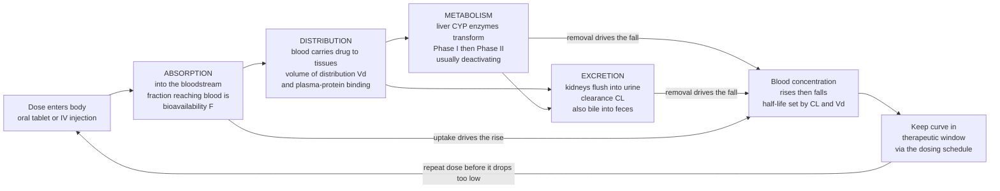

# 💊 Pharmacokinetics (ADME)

> [!abstract] TL;DR
> **Pharmacokinetics (PK)** is *"what the body does to the drug"* — the journey a molecule takes from the moment it enters you until the last of it is gone. That journey has four stages spelling **ADME**: **A**bsorption (getting into the bloodstream), **D**istribution (the blood carrying it into tissues), **M**etabolism (the liver chemically chewing it up), and **E**xcretion (the kidneys flushing the leftovers out). After a dose, the drug's blood concentration first **rises** (absorption winning) and then **falls** (metabolism plus excretion winning), tracing a **concentration-time curve**. The whole art of dosing is keeping that curve inside the **therapeutic window** — high enough to work, low enough to be safe. Three master parameters govern it: **bioavailability** (how much gets in), **clearance** (how fast it leaves), and **half-life** (how long it lingers). Master ADME and you understand *why* a drug works, *for how long*, and *how often* to take it.
>
> *Educational science note — not individual medical or dosing advice.*

---

## Intuition

**Analogy — a drug is a traveller passing through your body, and PK is its itinerary.** Imagine swallowing a pill as sending a traveller on a four-leg trip through a country called *You*.

1. **Absorption — clearing customs.** The traveller lands in your gut and must cross the border into the bloodstream. Not everyone makes it: some is destroyed at the border, and the very first road out of the gut runs straight through the **liver**, which taxes travellers heavily before they reach the rest of the country. The fraction that survives to circulate freely is the **bioavailability**. Swallow the same drug versus inject it into a vein and a very different fraction "clears customs."
2. **Distribution — spreading across the country.** Once in the blood, the traveller is carried everywhere. Some drugs stay near the highways (the blood and watery tissues); others check into remote resorts — fatty tissue — and hide there for **weeks**. How widely a drug spreads is captured by its **volume of distribution**.
3. **Metabolism — getting processed.** The **liver** is the country's great processing plant. Its enzymes (chiefly the **cytochrome P450** family) chemically remodel the traveller — usually *deactivating* it and tagging it so it can be thrown out. This is why **grapefruit juice or another drug that jams those enzymes** can let a normal dose pile up to dangerous levels: the processing plant is clogged, so travellers who should have been removed keep circulating.
4. **Excretion — leaving the country.** Finally the remains are shown the exit, mostly by the **kidneys** into urine (some leave via bile into stool). If the kidneys are damaged, the exits are narrow and the drug backs up.

Here is the crucial twist: the amount of drug in your blood is a **moving target**. Right after a dose it climbs as absorption outpaces removal; then it falls as metabolism and excretion take over. Effective medicine means keeping that rising-and-falling level parked in the **sweet spot** — the therapeutic window — which is *exactly* why we take pills on a schedule (every 8 hours, once daily, etc.) instead of all at once. **Absorb, distribute, metabolize, excrete** — four legs of one trip that determine everything about how a medicine behaves.

---

## How It Works

### Core mechanics

1. **Absorption** moves drug from the administration site into the systemic circulation. For an oral drug it must dissolve, cross the gut wall (driven by **solubility** and **permeability**), and survive **first-pass metabolism** in the gut wall and liver before reaching general circulation. The net fraction that arrives is the **bioavailability (F)**: essentially 1.0 for intravenous dosing, often much less for oral. Formulation (tablet, capsule, extended-release) tunes the *rate* of absorption.
2. **Distribution** partitions drug between blood and tissues. Highly **lipophilic** drugs and those that escape **plasma-protein binding** penetrate tissues broadly; the apparent **volume of distribution (Vd)** relates the total amount in the body to the measured plasma concentration. Barriers such as the **blood-brain barrier** keep many drugs out of the central nervous system.
3. **Metabolism (biotransformation)** chemically converts drug, mainly in the **liver**. **Phase I** reactions (oxidation, reduction, hydrolysis — dominated by **cytochrome P450 / CYP** enzymes) add or expose a reactive group; **Phase II** reactions **conjugate** the drug to a water-soluble handle (glucuronide, sulfate). The usual result is an inactive, more water-soluble metabolite that is easier to excrete. Exceptions: **prodrugs** are *activated* by metabolism, and enzyme **induction** (speeds metabolism) or **inhibition** (slows it) is the root of many **drug-drug and drug-food interactions**.
4. **Excretion (elimination)** removes drug and metabolites, chiefly by **renal** filtration and secretion into urine, and secondarily via **bile into feces**. The efficiency of removal is the **clearance (CL)** — the volume of blood fully cleared of drug per unit time.

### Quantitative PK

- The **concentration-time curve** is the central object. Most drugs show **first-order (exponential) elimination**: a *constant fraction* is removed per unit time, so after an IV bolus $C(t) = C_0\,e^{-k_e t}$.
- **Half-life** $t_{1/2}$ is the time for the concentration to halve: $t_{1/2} = \dfrac{\ln 2}{k_e} = \dfrac{0.693 \cdot V_d}{CL}$. It is a *derived* quantity set by the two primary parameters **clearance** and **volume of distribution**.
- Useful descriptors: **Cmax / Tmax** (peak level and time-to-peak), and **AUC** (area under the curve = total drug *exposure*, which scales with $F \cdot Dose / CL$).
- **Repeated dosing** on a fixed interval causes **accumulation** to a **steady state** — a plateau reached in about **4-5 half-lives**, where the amount going in per interval equals the amount cleared. The **dosing interval** sets the peak-to-trough swing; a **loading dose** fills the volume of distribution quickly, while the **maintenance dose** replaces what clearance removes.
- Drugs with a **narrow therapeutic window** (digoxin, warfarin, lithium, many antibiotics) may require **therapeutic drug monitoring** to keep levels safe.

### The ADME journey and its concentration-time consequence



---

## Key Concepts

### Secondary (foundations)
- **ADME** — the four stages of a drug's journey: **A**bsorption, **D**istribution, **M**etabolism, **E**xcretion. "What the body does to the drug."
- **Bloodstream is the highway.** A drug generally must reach the blood to act, and its **blood concentration** is the number that matters for effect and safety.
- **Liver processes, kidneys remove.** The liver chemically breaks drugs down; the kidneys flush the remains out in urine.
- **Therapeutic window** — the range of blood concentration that is *high enough to help but low enough to be safe*. Too little does nothing; too much is toxic.
- **Why we take pills on a schedule** — the drug level rises after each dose and falls between doses; the schedule keeps it in the window.

### Undergraduate (mechanisms and parameters)
- **Bioavailability (F)** — fraction of an administered dose reaching systemic circulation; near 1 for IV, reduced for oral by incomplete absorption and **first-pass metabolism**.
- **Volume of distribution (Vd)** — apparent volume relating amount in body to plasma concentration; large Vd means the drug hides in tissues.
- **First-order elimination** — a constant *fraction* removed per unit time: $C(t)=C_0 e^{-k_e t}$; contrast with **zero-order** (constant *amount*, e.g. ethanol) which saturates enzymes.
- **Half-life** $t_{1/2}=0.693\,V_d/CL$ — governs dosing frequency and time to steady state ($\approx$ 4-5 half-lives).
- **Clearance (CL)** — the primary elimination parameter; volume of plasma cleared per unit time. Sets **maintenance dose** and **AUC**.
- **Phase I vs Phase II metabolism** — Phase I (CYP-mediated oxidation/reduction/hydrolysis) vs Phase II (conjugation to water-soluble groups).
- **Enzyme induction vs inhibition** — inducers (e.g. rifampin) speed metabolism and *lower* levels; inhibitors (e.g. grapefruit, ketoconazole) slow it and *raise* levels — the basis of many interactions.

### Graduate (modelling and clinical nuance)
- **Compartment models** — one-compartment (instant distribution) vs two-compartment (a fast distribution phase then a slower elimination phase, giving a bi-exponential curve); physiologically based PK (PBPK) models organ blood flows explicitly.
- **Bateman function** — oral one-compartment concentration with first-order absorption and elimination: $C(t)=\dfrac{F\,D\,k_a}{V_d(k_a-k_e)}\left(e^{-k_e t}-e^{-k_a t}\right)$.
- **Superposition principle** — for linear (first-order) PK, multiple-dose profiles are the sum of single-dose profiles offset in time; enables steady-state prediction.
- **Michaelis-Menten / saturable elimination** — when metabolic enzymes saturate, kinetics shift from first- toward zero-order; small dose increases cause disproportionate concentration jumps (phenytoin).
- **Clearance concepts** — hepatic clearance and the **extraction ratio**; high-extraction drugs are **flow-limited**, low-extraction drugs are **capacity-limited** and sensitive to protein binding and enzyme activity.
- **Special populations** — **renal** or **hepatic impairment**, **age** (neonatal, geriatric), pregnancy, and **pharmacogenomic** CYP polymorphisms all shift PK and demand dose adjustment.

---

## Python Demo

```python
# Pharmacokinetics (ADME): concentration-time curves, half-life, steady state,
# and how metabolism (enzyme induction/inhibition) reshapes drug exposure.
# One-compartment model. numpy + matplotlib only.
import numpy as np
import matplotlib.pyplot as plt

# ---- PK parameters (illustrative units) ----
F   = 0.7      # bioavailability (fraction absorbed, oral)
D   = 100.0    # dose (mg)
Vd  = 30.0     # volume of distribution (L)
ka  = 1.2      # absorption rate constant (1/h)
ke  = 0.10     # elimination rate constant (1/h)  -> "normal" metabolism
t_half = np.log(2) / ke                 # half-life (h)
CL     = ke * Vd                        # clearance (L/h): CL = ke * Vd

# Therapeutic window (illustrative plasma concentrations, mg/L)
win_low, win_high = 1.0, 4.0

# ---------- (a) Single oral dose: the classic PK curve (Bateman function) ----------
t = np.linspace(0, 48, 2000)
C_single = (F * D * ka) / (Vd * (ka - ke)) * (np.exp(-ke * t) - np.exp(-ka * t))
Cmax = C_single.max()
Tmax = t[C_single.argmax()]

# ---------- (b) Repeated dosing -> accumulation to steady state (superposition) ----------
tau = 8.0                                # dosing interval (h)
n_doses = 12
C_multi = np.zeros_like(t)
for i in range(n_doses):
    t0 = i * tau
    mask = t >= t0                       # each dose only contributes after it is given
    td = t[mask] - t0
    C_multi[mask] += (F * D * ka) / (Vd * (ka - ke)) * (np.exp(-ke * td) - np.exp(-ka * td))
# Average steady-state concentration: Css_avg = F*D / (CL * tau)
Css_avg = (F * D) / (CL * tau)

# ---------- (c) Metabolism effect: enzyme inhibition vs induction (IV bolus decline) ----------
# First-order elimination after an IV bolus: C = C0 * exp(-ke * t)
C0 = D / Vd                              # initial concentration after IV bolus
ke_norm  = ke
ke_inhib = ke * 0.5                      # enzyme INHIBITION -> slower clearance, drug lingers
ke_induc = ke * 2.0                      # enzyme INDUCTION  -> faster clearance, drug vanishes
C_norm  = C0 * np.exp(-ke_norm  * t)
C_inhib = C0 * np.exp(-ke_inhib * t)
C_induc = C0 * np.exp(-ke_induc * t)

# ---------------------------- Plot ----------------------------
fig, ax = plt.subplots(1, 3, figsize=(17, 5))

# (a) single dose
ax[0].plot(t, C_single, color="navy", lw=2)
ax[0].axhspan(win_low, win_high, color="green", alpha=0.15, label="Therapeutic window")
ax[0].axvline(Tmax, color="gray", ls="--", lw=1)
ax[0].plot(Tmax, Cmax, "o", color="red")
ax[0].annotate(f"Cmax = {Cmax:.2f}\nTmax = {Tmax:.1f} h", (Tmax, Cmax),
               textcoords="offset points", xytext=(12, -5), fontsize=9)
# mark one half-life after the peak
t_after = Tmax + t_half
ax[0].annotate(f"t½ = {t_half:.1f} h", (t_after, Cmax/2),
               textcoords="offset points", xytext=(10, 10), fontsize=9, color="darkred")
ax[0].set_title("(a) Single oral dose: rise then fall")
ax[0].set_xlabel("Time (h)"); ax[0].set_ylabel("Plasma conc. (mg/L)")
ax[0].legend(); ax[0].grid(alpha=0.3)

# (b) repeated dosing to steady state
ax[1].plot(t, C_multi, color="darkorange", lw=2, label="Repeated dosing")
ax[1].axhline(Css_avg, color="purple", ls="--", lw=1.5,
              label=f"Avg steady state = {Css_avg:.2f}")
ax[1].axhspan(win_low, win_high, color="green", alpha=0.15)
for i in range(n_doses):
    ax[1].axvline(i * tau, color="gray", ls=":", lw=0.6)
ax[1].set_title(f"(b) Every {tau:.0f} h -> plateau in ~4-5 t½")
ax[1].set_xlabel("Time (h)"); ax[1].set_ylabel("Plasma conc. (mg/L)")
ax[1].legend(); ax[1].grid(alpha=0.3)

# (c) metabolism effect
ax[2].plot(t, C_inhib, color="crimson", lw=2, label=f"Inhibition (t½={np.log(2)/ke_inhib:.1f} h)")
ax[2].plot(t, C_norm,  color="black",   lw=2, label=f"Normal (t½={np.log(2)/ke_norm:.1f} h)")
ax[2].plot(t, C_induc, color="teal",    lw=2, label=f"Induction (t½={np.log(2)/ke_induc:.1f} h)")
ax[2].axhspan(win_low, win_high, color="green", alpha=0.15)
ax[2].set_title("(c) Metabolism reshapes exposure")
ax[2].set_xlabel("Time (h)"); ax[2].set_ylabel("Plasma conc. (mg/L)")
ax[2].legend(); ax[2].grid(alpha=0.3)

plt.tight_layout()
plt.show()

print(f"Half-life t½      = {t_half:.2f} h")
print(f"Clearance CL      = {CL:.1f} L/h")
print(f"Cmax / Tmax       = {Cmax:.2f} mg/L at {Tmax:.1f} h")
print(f"Avg steady state  = {Css_avg:.2f} mg/L (interval {tau:.0f} h)")
```

**What the plots show.** Panel **(a)** is the signature PK curve: concentration climbs while absorption dominates, peaks at **Tmax/Cmax**, then decays exponentially with **half-life** $t_{1/2}$ — and you want that peak-and-tail to sit inside the shaded **therapeutic window**. Panel **(b)** shows that dosing every interval $\tau$ makes drug **accumulate** to a **steady-state plateau** after roughly 4-5 half-lives — the mathematical reason regimens have a fixed schedule. Panel **(c)** shows why a **metabolic** change is dangerous: an **enzyme inhibitor** (grapefruit, another drug) flattens the decline so the drug lingers and can climb *above* the window, while an **inducer** clears it so fast it may fall *below* efficacy.

---

## Real-World Applications

- **Once-daily vs frequent dosing.** A drug with a long half-life (e.g. **amlodipine**, $t_{1/2}\approx$ 30-50 h) needs dosing only once daily because it barely falls between doses; a short-half-life drug must be dosed several times a day or reformulated as **extended-release** to smooth the curve.
- **Grapefruit-juice and drug interactions.** Grapefruit inhibits intestinal **CYP3A4**, raising the bioavailability of statins, some calcium-channel blockers, and immunosuppressants — a textbook **metabolism-driven** interaction that can push levels out of the therapeutic window.
- **Loading doses in critical care.** For drugs with a large **volume of distribution** (e.g. **vancomycin**, some antiarrhythmics), clinicians give a **loading dose** to fill the tissues and reach therapeutic levels fast, then a smaller **maintenance dose** matched to clearance.
- **Dose adjustment in kidney and liver disease.** Because the **kidneys** dominate excretion and the **liver** dominates metabolism, impairment of either narrows the "exits," raises drug levels, and mandates **renal/hepatic dose adjustment** — directly linked to the pathophysiology of those organs.
- **Therapeutic drug monitoring (TDM).** For narrow-window drugs — **warfarin, digoxin, lithium, aminoglycosides, tacrolimus** — labs measure blood levels and adjust dosing to keep the concentration-time curve inside the safe band.
- **Prodrug design.** Drugs like **enalapril** and **codeine** are inactive until liver metabolism converts them to the active form — a PK strategy to improve absorption or targeting.

---

## Common Pitfalls

- **Confusing half-life with clearance.** Half-life is *derived* ($t_{1/2}=0.693\,V_d/CL$); it can change because clearance changed *or* because volume of distribution changed. Clearance (not half-life) is what determines the **maintenance dose** and steady-state exposure.
- **Assuming first-order kinetics always hold.** Some drugs (phenytoin, ethanol, high-dose aspirin) show **saturable / zero-order** elimination — enzymes are maxed out, so a small dose increase causes a *disproportionate* concentration jump. Applying half-life logic here is dangerous.
- **Forgetting first-pass metabolism.** An oral dose is **not** the dose that reaches the blood. Ignoring **bioavailability** and hepatic first-pass leads to over- or under-estimating exposure, especially when switching between oral and IV routes.
- **Ignoring time-to-steady-state.** Steady state takes ~**4-5 half-lives**; checking a drug level or judging efficacy too early — before the plateau — misreads the true exposure.
- **Overlooking protein binding and Vd for interpreting levels.** Total plasma concentration can mislead when protein binding changes (illness, other drugs); the **free (unbound)** drug is what acts.
- **Treating enzyme interactions as static.** **Induction** takes days to build (new enzyme synthesis) and days to wane, so a drug started or stopped can silently shift levels of a co-administered drug days later.
- **Applying population averages to individuals.** Age, genetics (**CYP polymorphisms**), organ function, and other drugs mean the "textbook" half-life may not fit a given patient — the reason PK is monitored, not assumed.

---

## Related Concepts

This note is the quantitative backbone of the **Principles of Pharmacology** section. Its siblings develop the complementary half of the field: **Pharmacology and Drug Discovery Overview** frames the discipline; **Pharmacodynamics (Drug Action)** is the mirror image — *what the drug does to the body* (receptors, agonists, dose-response at the target); **Dose-Response and Therapeutic Index** formalizes the therapeutic window this note keeps referring to; **Routes of Administration and Drug Delivery** determines the absorption and bioavailability that open ADME; and **Drug Metabolism, Interactions and Polypharmacy** expands the metabolism and enzyme-induction/inhibition themes into clinical drug-drug interactions.

Verified cross-vault links:

- [[Clinical_Medicine/03_Metabolic_Endocrine_and_Renal/Liver_and_Gastrointestinal_Disease|Liver and Gastrointestinal Disease]] — the liver is the principal site of drug **metabolism**; hepatic impairment slows biotransformation and raises drug levels.
- [[Clinical_Medicine/03_Metabolic_Endocrine_and_Renal/Renal_Pathophysiology_and_Kidney_Disease|Renal Pathophysiology and Kidney Disease]] — the kidneys dominate **excretion**; reduced renal clearance narrows the drug's exit and demands dose adjustment.
- [[Biology/09_Human_Physiology_and_Anatomy/The_Digestive_and_Excretory_Systems|The Digestive and Excretory Systems]] — the physiology of the gut (site of **absorption**) and kidneys (site of **excretion**) that ADME rides on.
- [[Biology/02_Cell_Structure_and_Function/The_Cell_Membrane_and_Transport|The Cell Membrane and Transport]] — absorption and distribution are fundamentally drugs **crossing membranes**, set by lipophilicity, permeability, and transporters.
- [[Biology/01_Chemistry_of_Life/Enzymes_and_Catalysis|Enzymes and Catalysis]] — CYP450 and Phase II enzymes are the biological catalysts behind **metabolism**; induction/inhibition are enzyme-activity changes.
- [[Chemistry/02_Physical_Chemistry/Chemical_Kinetics|Chemical Kinetics]] — first-order and zero-order **rate laws** are exactly the kinetics governing drug elimination.
- [[Chemistry/06_Biochemistry/Enzyme_Kinetics_and_Catalysis|Enzyme Kinetics and Catalysis]] — Michaelis-Menten kinetics explain **saturable (capacity-limited)** drug metabolism.
- [[Mathematics/07_Differential_Equations/First_Order_ODEs|First-Order ODEs]] — the elimination model $dC/dt=-k_e C$ is a first-order linear ODE; its solution is the exponential decay of the PK curve.
- [[Mathematics/01_Pre_Calculus/Exponential_and_Logarithmic_Functions|Exponential and Logarithmic Functions]] — exponential decay and the logarithm behind $t_{1/2}=\ln 2 / k_e$.

---

## Review Questions

**Secondary**
1. What do the four letters of **ADME** stand for, and which organ is chiefly responsible for metabolism and which for excretion?
2. After you swallow a pill, describe in one sentence why the drug's blood level first rises and then falls.
3. What is the **therapeutic window**, and why does it explain taking medicines on a schedule rather than all at once?

**Undergraduate**
4. A drug has $V_d = 40$ L and $CL = 8$ L/h. Compute its half-life and estimate how long until it reaches steady state on regular dosing.
5. Explain how **first-pass metabolism** lowers **bioavailability**, and why an intravenous dose of the same drug produces a higher effective exposure than an oral dose.
6. A patient starts an **enzyme inhibitor** alongside a drug that sits near the top of its therapeutic window. Predict the effect on the second drug's concentration-time curve and the clinical risk.

**Graduate**
7. Contrast **flow-limited (high-extraction)** and **capacity-limited (low-extraction)** hepatic clearance: for each, does clearance depend more on hepatic blood flow or on intrinsic enzyme activity and protein binding? Give a consequence for dosing.
8. Phenytoin follows **Michaelis-Menten** elimination. Explain why increasing the dose by a modest amount near saturation can cause a disproportionately large rise in steady-state concentration, and how this differs from a first-order drug.
9. Given a drug that shows a rapid early decline followed by a slow terminal phase, which **compartment model** applies, and how would you use a **loading dose** to reach the therapeutic target without a prolonged accumulation delay?

---

## Sources

- Rowland, M. & Tozer, T. N. *Clinical Pharmacokinetics and Pharmacodynamics: Concepts and Applications.* Wolters Kluwer / Lippincott Williams & Wilkins.
- Katzung, B. G. *Basic and Clinical Pharmacology* — chapter on **Pharmacokinetics: Rational Dosing and the Time Course of Drug Action.* McGraw-Hill.
- Brunton, L. L. et al. *Goodman & Gilman's The Pharmacological Basis of Therapeutics* — section on **Pharmacokinetics: The Dynamics of Drug Absorption, Distribution, Metabolism, and Elimination.* McGraw-Hill.
- Shargel, L. & Yu, A. B. C. *Applied Biopharmaceutics & Pharmacokinetics.* McGraw-Hill.
- Ritter, J. M. et al. *Rang & Dale's Pharmacology* — chapters on drug absorption, distribution, and elimination. Elsevier.

---

#pharmacology #pharmacokinetics #ADME #half-life #drug-metabolism
