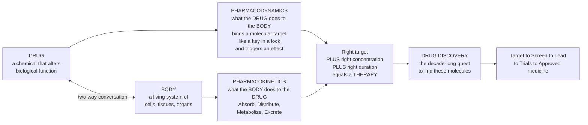

# 💊 Pharmacology and Drug Discovery Overview

> [!abstract] TL;DR
> **Pharmacology** is the science of how **drugs** (chemicals that alter biological function) and **living bodies** affect each other — a two-way conversation captured in a single memorable pair. **Pharmacodynamics** is *what the drug does to the body*: a molecule binds a specific molecular **target** — usually like a key fitting a lock — and triggers an effect. **Pharmacokinetics** is *what the body does to the drug*: how it is absorbed, distributed, chemically broken down, and excreted (**ADME**) — which decides how much drug reaches the target and for how long. Every medicine is the meeting of these two forces: hit the **right target** (dynamics) at the **right concentration for the right duration** (kinetics) and you have a therapy; get either wrong and you have a useless pill or a poison. The oldest truth in the field — *"the dose makes the poison"* — says the **same substance can heal or kill depending on amount**. And **drug discovery** is the decade-long, billion-dollar, high-attrition quest to find those rare molecules: from picking a disease target, through screening millions of compounds and optimizing a lead, to toxicology and clinical trials and an approved medicine. This note is the **hub and roadmap** for the whole Pharmacology vault, surveying its six sections — from how one molecule works to the vast pipeline that brings new cures to the world.

---

## Intuition

**Analogy — a conversation, and the rule that the dose makes the poison.** Imagine a locksmith walking up to an enormous, superbly automated building. Two things must both be true for anything useful to happen. First, the locksmith must be carrying **the right key** — a shape that fits one specific lock and, when turned, actually opens a door and triggers something inside. That is **pharmacodynamics**: *what the drug does to the body*. A drug molecule is a key; its **target** (a receptor, an enzyme, a channel) is the lock; and "turning it" is the biological **effect** — a heartbeat slowed, a pain silenced, a cancer cell stopped.

But carrying the right key is not enough. The building has a **front desk, corridors, a shredder, and a waste chute** that decide whether the key ever reaches its lock, how many keys arrive, and how quickly they are confiscated and thrown out. That machinery is **pharmacokinetics**: *what the body does to the drug* — it **A**bsorbs the pill from the gut, **D**istributes it in the blood and tissues, **M**etabolizes (chemically dismantles) it in the liver, and **E**xcretes the remains through the kidneys. Too few keys reach the lock and nothing opens; the drug is useless. Too many arrive and stay too long, and doors all over the building are forced at once — the drug becomes a **poison**.

That is the whole of pharmacology in one image: a **two-way conversation** in which the drug acts on the body (dynamics) *and* the body acts on the drug (kinetics), meeting in the narrow band of concentration where the effect is helpful and not harmful. Paracelsus said it in the sixteenth century — *"the dose makes the poison"* — and it is still the field's first law: water, oxygen, and the gentlest medicine can all kill at the wrong amount, and a feared toxin can heal at the right one. **Drug discovery** is then the extraordinary hunt for molecules that have *both* halves right — the correct key *and* a body-friendly journey — a search that today takes ten to fifteen years, costs on the order of a billion dollars, and fails far more often than it succeeds. This vault maps that entire landscape, from a single lock-and-key event to the industrial pipeline that turns molecular science into medicine.

---

## How It Works

### The two pillars — pharmacodynamics and pharmacokinetics

1. **Pharmacodynamics (PD): drug → body.** A drug produces its effect by **binding a molecular target** with some **affinity** (how tightly it sticks) and then acting on it with some **efficacy** (how much effect that binding produces). An **agonist** turns the target "on"; an **antagonist** blocks it; a **partial agonist** turns it part-way on. Effect grows with concentration along a characteristic **dose-response curve** whose midpoint, the **EC50**, is the concentration giving half-maximal effect — the quantitative fingerprint of **potency**. Selectivity (hitting one target and not others) is what separates a *medicine* from a *sledgehammer*.
2. **Pharmacokinetics (PK): body → drug.** In parallel, the body governs the drug's **concentration over time** through **ADME**: **A**bsorption (getting into the bloodstream — an oral pill must survive the gut and first-pass through the liver, summarized as **bioavailability**), **D**istribution (spreading into tissues, captured by the **volume of distribution**), **M**etabolism (chemical breakdown, mostly by liver **CYP450** enzymes), and **E**xcretion (removal, mainly renal). Together these set the **half-life** and **clearance** — how fast the drug level rises after a dose and how fast it falls.
3. **The two pillars meet at concentration.** PD says *what a given concentration at the target does*; PK says *what concentration the target actually sees, and when*. A therapy exists only where the two align — enough drug at the target, for long enough, but not so much that toxicity appears.

### The core principles — dose-response, "the dose makes the poison", and the therapeutic window

- **The dose-response relationship** is the central law: increasing the dose increases the effect along an S-shaped (sigmoidal) curve until the target saturates. Two curves matter — the desired **effect** and the unwanted **toxicity** — and they are almost never the same curve.
- **"The dose makes the poison" (Paracelsus)** means the *same* molecule sits on both curves; whether it heals or harms is set by **amount**, not identity.
- **The therapeutic window** is the concentration band that lies *above* the minimum effective level and *below* the minimum toxic level. Its width, quantified as the **therapeutic index** (a ratio of toxic to effective dose), decides how carefully a drug must be dosed. A wide window (ibuprofen) is forgiving; a narrow one (warfarin, digoxin, lithium) demands blood-level monitoring.

### Drug targets — where the keys fit

Most drugs act on one of a handful of target classes: **receptors** (especially GPCRs, ion channels, and nuclear receptors — the majority of drug targets), **enzymes** (blocked by inhibitors, e.g. statins on HMG-CoA reductase), **transporters** (e.g. SSRIs on the serotonin transporter), and increasingly **nucleic acids** and **protein–protein interfaces**. The set of human proteins a small molecule or biologic can usefully bind is the **druggable genome** — only a fraction of all proteins, which is why finding a good target is half the battle.

### From molecule to medicine — the drug-discovery pipeline

The journey from idea to approved drug is a long, narrowing funnel: **target identification and validation** → **hit discovery** (screening large compound libraries, or designing *in silico*) → **lead optimization** (medicinal chemistry tuning potency, selectivity, and ADME/safety) → **preclinical** testing (cell and animal toxicology and PK) → **clinical trials** (Phase I safety, Phase II efficacy, Phase III large randomized confirmation) → **regulatory approval** → post-market surveillance (Phase IV). It typically spans **ten to fifteen years**, costs on the order of a **billion dollars** when failures are counted, and only a **tiny fraction** of starting compounds ever reach patients. Modern **computational and AI-driven design** — docking, molecular simulation, structure prediction, and generative chemistry — is reshaping the early, most attrition-heavy stages.

### The vault map — six sections

This overview is the entry point to a six-section vault. **(1) Principles of Pharmacology** grounds the two pillars — pharmacodynamics, pharmacokinetics, receptor binding, dose-response, and routes of delivery. **(2) Molecular Targets and Mechanisms** works through receptors, enzymes, channels, biologics, and nucleic-acid drugs. **(3) Drug Classes and Therapeutics** surveys medicine by body system — cardiovascular, antimicrobial, central-nervous-system, anticancer, and more. **(4) The Drug-Discovery Pipeline** details target-to-approval and its economics. **(5) Computational and AI Drug Design** covers *in silico* screening, structure prediction, and generative models. **(6) Safety, Pharmacogenomics, Toxicology, and Frontiers** closes with individual variability, adverse effects, and where the field is heading.

### The two-way conversation



*Read the top path as pharmacodynamics and the bottom as pharmacokinetics; they converge on the narrow band of concentration where a molecule becomes a therapy, and drug discovery is the search for molecules that get both halves right.*

---

## Key Concepts

### Secondary (intuitive)

- **Drug** = a chemical that changes how the body works — it can heal, and at the wrong amount, harm.
- **Pharmacodynamics** = *what the drug does to the body*. The drug fits a target like a **key in a lock** and triggers an effect.
- **Pharmacokinetics** = *what the body does to the drug*. The body **absorbs, spreads, breaks down, and removes** it (ADME), setting how much reaches the target.
- **The dose makes the poison** = the *same* substance can heal or kill depending on the amount — even water is toxic in enormous quantity.
- **Drug discovery** = the long, expensive search for the rare molecule that helps a disease without doing too much harm.

### Undergraduate (formal)

- **Affinity, efficacy, potency.** *Affinity* = how tightly a drug binds its target; *efficacy* = how much effect that binding produces; *potency* = how little drug is needed (indexed by **EC50** / **ED50**). Two drugs can be equally effective yet differ 100-fold in potency.
- **Agonists and antagonists.** Full agonist (maximal effect), partial agonist (submaximal even when fully bound), competitive vs non-competitive antagonist, and inverse agonist (drives a constitutively active receptor below baseline).
- **ADME and PK parameters.** **Bioavailability (F)** = fraction reaching systemic circulation; **volume of distribution (Vd)** = apparent space the drug occupies; **clearance (CL)** = volume cleared per unit time; **half-life (t½)** = time for concentration to halve. **First-pass metabolism** can gut oral bioavailability before the drug ever acts.
- **Therapeutic index and window.** **TI = TD50 / ED50** (or LD50/ED50) — the safety margin between benefit and harm. Narrow-index drugs (warfarin, digoxin, lithium, aminoglycosides) require **therapeutic drug monitoring**.
- **Target classes.** Receptors (GPCRs, ion channels, nuclear/hormone receptors), enzymes, transporters, structural and nucleic-acid targets — the **druggable** subset of the proteome.
- **The pipeline and attrition.** Target ID → hit → lead → preclinical → Phase I/II/III → approval → Phase IV, with success probability falling and cost rising at every gate.

### Graduate (mechanistic and systems)

- **Receptor theory beyond lock-and-key.** Occupancy theory gives way to **two-state / ternary-complex** and **operational** models: **spare receptors** decouple occupancy from response, **constitutive activity** allows inverse agonism, **allosteric** modulators tune orthosteric ligands, and **biased agonism** lets one ligand selectively engage some downstream pathways (e.g. G-protein vs β-arrestin) — a route to safer analgesics and beyond.
- **Quantitative PK/PD modeling.** Compartmental models and the **Hill equation** couple exposure to effect; **Cmax, Tmax, AUC**, and **exposure–response** relationships drive dosing. **Target-mediated drug disposition** and **PBPK** (physiologically based) models predict human kinetics from first principles — the mathematical backbone of modern dose selection.
- **Druggability, selectivity, and modality.** Not every disease-relevant protein is **druggable**; "undruggable" targets (many transcription factors, protein–protein interfaces) drive new modalities — **biologics** (monoclonal antibodies), **antisense oligonucleotides / siRNA**, and **targeted protein degraders (PROTACs)**. **Polypharmacology** (deliberately hitting several targets) and off-target liabilities (e.g. hERG cardiotoxicity) shape selectivity.
- **The economics of attrition.** DiMasi and colleagues estimate capitalized per-approval costs near **US$2.6 billion**, dominated by **failure** — most attrition is late (Phase II/III) for **lack of efficacy or unexpected toxicity**. "**Eroom's law**" (Moore's law spelled backward) captured decades of *declining* R&D productivity that computational and biological advances now aim to reverse.
- **Computation, AI, and pharmacogenomics.** Structure-based docking, molecular dynamics, **AlphaFold-scale** structure prediction, and **generative** molecular design compress early discovery; **pharmacogenomics** (e.g. **CYP2D6/2C19** metabolizer status, TPMT, HLA risk alleles) turns "one dose fits all" into **precision dosing** matched to a patient's genome.

---

## Python Demo

```python
# The pharmacology landscape in three panels:
#   (a) PHARMACODYNAMICS  -> the DOSE-RESPONSE curve: effect rises sigmoidally with
#       concentration (Hill equation), with the EC50 marking half-maximal effect.
#   (b) PHARMACOKINETICS + THERAPEUTIC WINDOW -> concentration-vs-time after a dose
#       (one-compartment oral / Bateman model): the drug level rises as it is absorbed,
#       then falls as the body clears it -- shown against the SAFE therapeutic window
#       (above the minimum effective level, below the minimum toxic level).
#   (c) DRUG-DISCOVERY FUNNEL -> thousands of compounds narrowing to ONE approved drug
#       over ~10-15 years. Together: effect needs the right CONCENTRATION, delivered by
#       kinetics, found by a brutal discovery pipeline.
import numpy as np
import matplotlib.pyplot as plt

# ---------- (a) Pharmacodynamics: sigmoidal dose-response (Hill equation) ----------
conc   = np.logspace(-2, 3, 400)     # drug concentration (arbitrary units), log scale
EC50   = 10.0                        # concentration giving half-maximal effect
Emax   = 100.0                       # maximal effect
n_hill = 1.0                         # Hill coefficient (steepness)
effect = Emax * conc**n_hill / (EC50**n_hill + conc**n_hill)

# ---------- (b) Pharmacokinetics: one-compartment oral absorption (Bateman) ----------
t   = np.linspace(0, 24, 400)        # hours after a single oral dose
ka  = 1.2                            # absorption rate constant (1/h)
ke  = 0.25                           # elimination rate constant (1/h)  -> t_half ~ 2.8 h
C0  = 10.0                           # scaling for F*Dose/Vd
Ct  = C0 * ka / (ka - ke) * (np.exp(-ke * t) - np.exp(-ka * t))
MEC, MTC = 2.0, 8.0                  # minimum effective / minimum toxic concentration

# ---------- (c) The drug-discovery funnel ----------
stages = ["Screen\n(compounds)", "Lead\noptimization", "Preclinical",
          "Clinical\n(Phase I-III)", "Approved\ndrug"]
counts = [10000, 250, 10, 5, 1]      # approximate order-of-magnitude attrition

fig, (ax1, ax2, ax3) = plt.subplots(1, 3, figsize=(16.5, 5.2))

# --- panel (a): dose-response ---
ax1.semilogx(conc, effect, color="#2980B9", lw=2.2, label="Effect (dose-response)")
ax1.axvline(EC50, color="#C0392B", ls="--", lw=1.4, label="EC50 (half-max)")
ax1.axhline(50, color="grey", ls=":", lw=1)
ax1.plot(EC50, 50, "o", color="#C0392B", ms=8)
ax1.set_xlabel("Drug concentration (log scale)")
ax1.set_ylabel("Effect (% of maximum)")
ax1.set_title("(a) Pharmacodynamics: dose-response")
ax1.set_ylim(-3, 105)
ax1.legend(loc="upper left", fontsize=8)
ax1.grid(alpha=0.3, which="both")

# --- panel (b): PK curve vs therapeutic window ---
ax2.axhspan(MEC, MTC, color="#2ecc71", alpha=0.15, label="Therapeutic window")
ax2.axhline(MTC, color="#C0392B", ls="--", lw=1.2, label="Min toxic conc (MTC)")
ax2.axhline(MEC, color="#E67E22", ls="--", lw=1.2, label="Min effective conc (MEC)")
ax2.plot(t, Ct, color="#8E44AD", lw=2.2, label="Plasma concentration")
in_window = (Ct >= MEC) & (Ct <= MTC)
ax2.fill_between(t, MEC, Ct, where=in_window, color="#8E44AD", alpha=0.12)
ax2.set_xlabel("Time after dose (hours)")
ax2.set_ylabel("Plasma concentration")
ax2.set_title("(b) Pharmacokinetics + therapeutic window")
ax2.set_xlim(0, 24)
ax2.set_ylim(0, MTC * 1.35)
ax2.legend(loc="upper right", fontsize=8)
ax2.grid(alpha=0.3)

# --- panel (c): discovery funnel (log scale shows the dramatic narrowing) ---
ypos   = np.arange(len(stages))[::-1]         # top = screen, bottom = approved
colors = ["#34495E", "#2980B9", "#16A085", "#F39C12", "#C0392B"]
ax3.barh(ypos, counts, color=colors, log=True)
for y, c in zip(ypos, counts):
    ax3.text(c * 1.4, y, f"{c:,}", va="center", fontsize=9)
ax3.set_yticks(ypos)
ax3.set_yticklabels(stages, fontsize=8)
ax3.set_xlabel("Number of compounds (log scale)")
ax3.set_title("(c) Drug-discovery funnel: ~10-15 years")
ax3.set_xlim(0.5, 60000)
ax3.grid(axis="x", alpha=0.3, which="both")

plt.tight_layout()
plt.show()

# Numeric read-outs tying the panels together
peak_i = int(np.argmax(Ct))
print(f"(a) EC50 = {EC50:.1f} -> effect there = {Emax/2:.0f}% of maximum")
print(f"(b) Peak concentration {Ct[peak_i]:.2f} at t = {t[peak_i]:.1f} h; "
      f"time inside therapeutic window = {np.trapz(in_window, t):.1f} h")
print(f"(c) Funnel survival: {counts[0]:,} compounds -> {counts[-1]} approved "
      f"(1 in {counts[0]//counts[-1]:,})")
```

**What you see.** *Panel (a)* is pharmacodynamics distilled: effect climbs sigmoidally with concentration and saturates, and the **EC50** marks the potency — the concentration at half-maximal effect. *Panel (b)* is pharmacokinetics meeting safety: after a single oral dose the plasma level **rises** (absorption outrunning elimination), peaks, then **falls** (the body clearing the drug), and it is *therapeutic* only while the curve sits inside the green band — above the minimum effective level and below the minimum toxic level. Notice the whole point of dosing: you are trying to keep that purple curve inside a narrow window for as long as useful, which is why half-life and clearance matter as much as potency. *Panel (c)* is the sobering economics — of order **ten thousand** starting compounds collapse to a **single** approved drug across a decade-plus, most dying late and expensively. Effect (a) requires concentration in range (b), and molecules that achieve both are found only by surviving the funnel (c).

---

## Real-World Applications

- **Beta-blockers and the receptor as a lock (PD).** Drugs like propranolol and metoprolol are **antagonists** at β-adrenergic receptors — they occupy the lock so adrenaline cannot turn it, slowing the heart. Textbook pharmacodynamics: affinity, selectivity (β1 vs β2), and blockade.
- **Statins and enzyme inhibition.** Atorvastatin and its relatives inhibit **HMG-CoA reductase**, the rate-limiting enzyme of cholesterol synthesis — the archetype of an enzyme-target drug and one of the best-selling drug classes ever.
- **Warfarin and the narrow therapeutic window (PK/PD).** An anticoagulant with a razor-thin therapeutic index and large person-to-person variability (partly genetic, via **CYP2C9/VKORC1**), requiring **INR** blood monitoring — the clinical face of "the dose makes the poison."
- **Opioids and the two faces of a molecule.** The *same* opioid that relieves pain at one dose depresses breathing and kills at a higher one — the therapeutic-window principle at life-or-death scale, and the mechanistic story behind the overdose crisis.
- **Insulin and biologics.** A protein drug that must be injected (destroyed if swallowed — pure pharmacokinetics) and whose dosing is titrated against glucose; a bridge to the modern era of **monoclonal antibodies** and **GLP-1 agonists** (e.g. semaglutide) that now dominate new approvals.
- **Antibiotics and selective toxicity.** Penicillins inhibit bacterial cell-wall synthesis, a target humans lack — the ideal of a drug toxic to the pathogen but not the host.
- **AI-driven discovery.** Structure prediction (AlphaFold), generative molecular design, and *in silico* screening now seed the earliest, most failure-prone pipeline stages, with the first fully AI-originated candidates reaching clinical trials.
- **Pharmacogenomic dosing.** Clopidogrel efficacy depends on **CYP2C19** metabolizer status; thiopurine dosing on **TPMT**; abacavir hypersensitivity on **HLA-B*57:01** — genome-matched prescribing in daily practice.

---

## Common Pitfalls

- **Confusing pharmacodynamics with pharmacokinetics.** "What the drug does to the body" (PD) and "what the body does to the drug" (PK) are different questions. A drug can fail because it never reaches its target (PK) even with a perfect mechanism (PD) — diagnose which half is broken before blaming the other.
- **Conflating potency and efficacy.** A lower EC50 means *more potent* (less drug needed), **not** more effective. The maximum achievable effect (Emax) is efficacy; the two are independent, and a highly potent drug can have modest efficacy.
- **Assuming more is always better.** The dose-response saturates and the toxicity curve keeps rising; past the therapeutic window, extra dose buys only side effects. Respect the window rather than pushing the number.
- **Believing a validated target guarantees a drug.** A perfect biological target is worthless if no molecule can bind it selectively, reach it (delivery, ADME), and be safe — **druggability** and PK kill many mechanistically sound ideas.
- **Extrapolating animal or in-vitro data naively.** Promising preclinical potency routinely fails in humans due to species differences in metabolism, off-target effects, or the difference between a cell dish and a whole physiology — the root of late, costly attrition.
- **Assuming one dose fits everyone.** Genetics (CYP polymorphisms), age, organ function, and drug–drug interactions make the same dose reach very different concentrations in different people — the case for therapeutic monitoring and pharmacogenomics.
- **Reading this as medical advice.** This note teaches *the science of how drugs work* at textbook level. It is **not** guidance for any individual's treatment or dosing, which always depends on a clinician and a specific patient.

---

## Related Concepts

**Within this vault (Section 01 and beyond).** This overview is the entry point; the section notes that develop each idea are planned companions. *Pharmacodynamics — Drug Action* details receptor binding, agonism/antagonism, efficacy versus potency, and the dose-response curve. *Pharmacokinetics — ADME* works through absorption, distribution, metabolism, and excretion and the parameters (bioavailability, half-life, clearance, volume of distribution) that govern concentration over time. *Dose-Response and Therapeutic Index* formalizes the safety margin sketched here and the logic of the therapeutic window. *Drug Targets and the Druggable Genome* surveys receptors, enzymes, channels, transporters, and nucleic-acid targets, and what makes a protein druggable. *The Drug-Discovery Pipeline* details target identification through clinical trials and approval, with its economics and attrition. Finally, *The Reach and Future of Pharmacology* looks at computational and AI-driven design, pharmacogenomics, and where the field is heading. These are prose references to sibling notes within the Pharmacology vault.

**Across the vault (Glob-verified links).**

- [[Clinical_Medicine/01_Foundations_of_Disease_and_Pathophysiology/Clinical_Medicine_and_Pathophysiology_Overview|Clinical Medicine and Pathophysiology Overview]] — the applied companion: pharmacology exists to correct the disease mechanisms this vault maps.
- [[Chemistry/04_Organic_Chemistry/Structure_Bonding_and_Functional_Groups|Structure, Bonding and Functional Groups]] — the organic-chemistry basis of the drug molecule itself: shape, functional groups, and the bonding that makes a key fit a lock.
- [[Chemistry/06_Biochemistry/Membranes_and_Cell_Signaling|Membranes and Cell Signaling]] — receptors and signal transduction, the molecular machinery most drugs act on.
- [[Chemistry/06_Biochemistry/Enzyme_Kinetics_and_Catalysis|Enzyme Kinetics and Catalysis]] — the Michaelis-Menten and inhibition kinetics behind enzyme-target drugs and drug metabolism.
- [[Chemistry/06_Biochemistry/Protein_Structure_and_Function|Protein Structure and Function]] — the three-dimensional protein targets and binding pockets that structure-based drug design exploits.
- [[Biology/09_Human_Physiology_and_Anatomy/The_Endocrine_System_and_Hormones|The Endocrine System and Hormones]] — the natural ligand–receptor signaling that hormone-mimicking and hormone-blocking drugs imitate or interrupt.
- [[Biology/12_Developmental_Biology/Cell_Signaling_in_Development|Cell Signaling in Development]] — signaling pathways (a rich source of modern targets, especially in oncology).
- [[Biology/05_Genetics_and_Heredity/Human_Genetics_and_Genetic_Disorders|Human Genetics and Genetic Disorders]] — the genetic variation underlying individual drug response and pharmacogenomics.
- [[Biology/11_Microbiology_and_Immunology/Vaccines_and_Antibiotics|Vaccines and Antibiotics]] — selective toxicity and the antimicrobial drug class in introductory form.
- [[Clinical_Medicine/06_Clinical_Reasoning_and_Modern_Medicine/Evidence_Based_Medicine_and_Clinical_Trials|Evidence-Based Medicine and Clinical Trials]] — the Phase I-III trial machinery that proves a candidate is safe and effective.
- [[Clinical_Medicine/06_Clinical_Reasoning_and_Modern_Medicine/Precision_Medicine_and_Genomics_in_the_Clinic|Precision Medicine and Genomics in the Clinic]] — genome-matched, mechanism-targeted prescribing in practice.
- [[Health_Nutrition_and_Longevity/06_Public_Health_and_Prevention/Environmental_Health_and_Toxicology|Environmental Health and Toxicology]] — the toxicology counterpart of "the dose makes the poison," from the harm side of the same dose-response curve.

---

## Review Questions

**Secondary.** Using the key-and-building analogy, explain the difference between *pharmacodynamics* and *pharmacokinetics*. Then, in your own words, what does "the dose makes the poison" mean, and why can the very same medicine be both a cure and a poison?

**Undergraduate.** Distinguish *affinity*, *efficacy*, and *potency*, and explain why two drugs can be equally effective yet differ greatly in potency. Then describe the *therapeutic window* and *therapeutic index*, and explain why a drug like warfarin requires blood-level monitoring while ibuprofen does not — referring to both its dose-response and its pharmacokinetics.

**Graduate.** A promising compound is highly potent and selective for its target in a test tube but fails in Phase II for lack of efficacy. List the pharmacokinetic and pharmacodynamic explanations you would investigate (consider bioavailability, distribution to the target site, metabolism, half-life, spare receptors, and biased signaling). More broadly, why does most drug attrition occur *late and expensively*, and how might computational structure prediction and pharmacogenomics shift where in the pipeline that failure happens?

---

## Sources

- Katzung, B. G., & Vanderah, T. W. (eds.). *Basic and Clinical Pharmacology* (15th ed.). McGraw-Hill — standard introduction to pharmacodynamics, pharmacokinetics, and drug classes.
- Ritter, J. M., Flower, R., Henderson, G., et al. *Rang and Dale's Pharmacology* (9th ed.). Elsevier — mechanism-focused core text on drug action and targets.
- Brunton, L. L., Knollmann, B. C., & Hilal-Dandan, R. (eds.). *Goodman and Gilman's The Pharmacological Basis of Therapeutics* (14th ed.). McGraw-Hill — the definitive reference on the molecular basis of therapeutics.
- DiMasi, J. A., Grabowski, H. G., & Hansen, R. W. (2016). "Innovation in the pharmaceutical industry: New estimates of R&D costs." *Journal of Health Economics*, 47, 20-33 — the cost and attrition of drug development.

---

#pharmacology #drug-discovery #pharmacodynamics #pharmacokinetics #drug-targets
