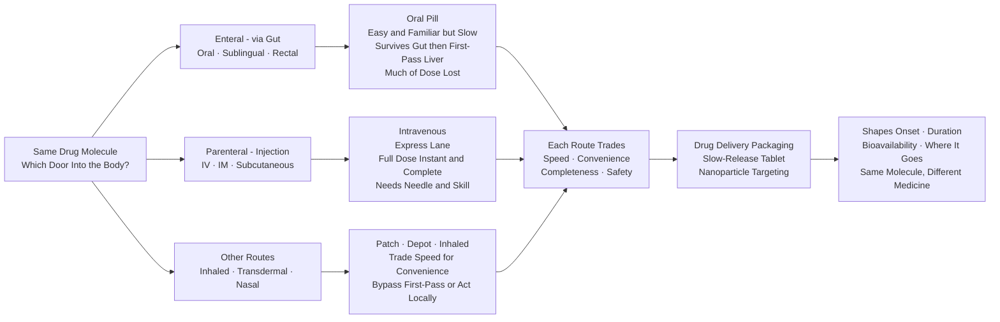

# 💊 Routes of Administration and Drug Delivery

> [!abstract] TL;DR
> How you get a drug into the body — the route of administration — and how you package it — the delivery system — matter as much as which molecule it is: they set how fast the drug acts, how long it lasts, how much of the dose actually reaches the blood (bioavailability), where it goes, and whether patients can tolerate the treatment, so the same molecule given orally versus intravenously, or as an immediate versus a controlled-release form, behaves like a completely different medicine.

---

## Intuition

**Analogy:** There are many doors into the body, and each one changes the story. Swallowing a pill (the **oral** door) is easy and familiar but slow — the drug has to survive stomach acid, dissolve, cross the gut wall, and then run a gauntlet through the liver before it ever reaches the bloodstream. So much can be lost on this journey that some drugs simply cannot be taken by mouth at all: swallow insulin and the gut digests it like a piece of steak. An **injection straight into a vein** (the intravenous door) is the express lane — the full dose hits the bloodstream instantly and completely, perfect for an emergency, but it demands a needle and a trained hand. Under the tongue, through the skin as a patch, inhaled into the lungs, sprayed up the nose — each door trades off **speed, convenience, completeness, and safety** differently.

Beyond choosing a door, modern **drug delivery** is about clever packaging. You can build a pill that releases its cargo slowly over 24 hours so a patient takes it once a day instead of six times, or wrap a drug inside a nanoparticle that ferries it straight to a tumour while sparing healthy tissue. Route and delivery system together decide onset, duration, how much reaches the target, and how bearable the therapy is — turning one molecule into many possible medicines.

---

## How It Works

### Core Mechanics

1. **A drug must reach the systemic circulation to act at a distant site.** Only the fraction that arrives in the blood, in active form, can be distributed to the target. That surviving fraction relative to an intravenous dose is the **bioavailability (F)**, ranging from 1.0 (100%, by definition for IV) down to near zero for drugs destroyed before absorption.

2. **Enteral routes go through the gastrointestinal tract.** The **oral** route is by far the most common — convenient, painless, self-administered — but the drug must dissolve, permeate the gut epithelium, and then pass through the liver via the portal vein, where **first-pass hepatic metabolism** can degrade much of the dose before it reaches the general circulation. **Sublingual** and **buccal** routes (under the tongue, against the cheek) drain into veins that bypass the liver, giving fast onset and escaping first-pass. The **rectal** route partially bypasses the liver and is useful when a patient is vomiting or unconscious.

3. **Parenteral routes inject the drug, bypassing the gut.** **Intravenous (IV)** delivers the entire dose directly into the blood — immediate onset, 100% bioavailability, precise control — the route for emergencies and for drugs that cannot be absorbed orally. **Intramuscular (IM)** and **subcutaneous (SC)** deposit the drug in tissue, from which it is absorbed more slowly, creating a **depot** that can sustain levels for hours to months. **Intrathecal / epidural** routes place drug directly around the spinal cord for regional effect.

4. **Other routes exploit specialized surfaces.** **Inhalation** delivers drug to the huge, thin-walled surface of the lungs for near-instant systemic effect (volatile anaesthetics) or targeted local action (asthma inhalers). **Transdermal patches** push drug slowly and steadily through the skin for sustained systemic levels. **Topical, intranasal, ocular, and otic** routes act mostly locally, and **implants** provide very long-acting release.

5. **The drug's own properties dictate which doors are feasible.** Stability in acid, aqueous solubility, lipophilicity, and molecular size all constrain the route — large biologics such as proteins and nucleic acids are digested or too big to cross the gut, so they are almost always injected or need special delivery vehicles.

6. **Formulation reshapes the pharmacokinetics without changing the molecule.** **Immediate-release** dosage forms release drug at once, producing peaks and troughs. **Modified / extended / controlled-release** forms meter the drug out slowly, flattening the curve into a steady therapeutic level, cutting dosing frequency, and improving adherence. **Enteric coatings** delay release until the intestine; **prodrugs** are inactive shells metabolized into the active drug after absorption. **Advanced delivery** — liposomes, nanoparticles, antibody-drug conjugates, and lipid nanoparticles for mRNA/siRNA — targets the drug and protects fragile payloads.

### Flow: One Molecule, Many Doors Into the Body



---

## Key Concepts

### Secondary

**The doors, ranked by speed.** As a rough onset ordering: intravenous and inhalation act in seconds to a minute; sublingual and intramuscular in minutes; subcutaneous and rectal somewhat slower; oral in tens of minutes to hours; transdermal patches and depot injections deliberately slow, over hours to weeks. Speed is a design choice, not a flaw — a nitroglycerin tablet dissolved under the tongue must abort chest pain in seconds, while a contraceptive implant should last three years.

**Enteral (through the gut):**
- **Oral (PO)** — swallow a tablet, capsule, or liquid. Most common route: convenient, cheap, safe, self-administered. Downsides: slow onset, variable absorption (affected by food, stomach pH, gut motility), and loss to first-pass liver metabolism.
- **Sublingual / buccal** — dissolves under the tongue or against the cheek, absorbed directly into veins that bypass the liver. Fast, escapes first-pass. Example: nitroglycerin for angina.
- **Rectal** — suppository or enema; useful when vomiting or unconscious; partial first-pass bypass.

**Parenteral (by injection):**
- **Intravenous (IV)** — straight into a vein. Immediate, complete (100% bioavailable), precisely controllable. Used in emergencies and for drugs that cannot be absorbed. Invasive; dangerous if injected too fast; requires sterility and skill.
- **Intramuscular (IM)** and **subcutaneous (SC)** — into muscle or the fatty layer under the skin. Slower, depot-like absorption. Vaccines, insulin, depot antipsychotics.

**Other routes:**
- **Inhalation** — into the lungs; rapid onset and used for respiratory drugs (asthma inhalers) and general anaesthetics.
- **Transdermal** — a skin patch that releases drug slowly and steadily into the blood over hours to days (nicotine, fentanyl, hormone patches).
- **Topical / ocular / otic / intranasal** — applied to skin, eye, ear, or nose, usually for local effect.

**Why some drugs cannot be oral:** insulin, growth hormone, and other proteins are large and fragile; the stomach and gut enzymes digest them into amino acids just like food. That is why insulin is injected — the route is forced by the molecule.

### Undergraduate

**Bioavailability quantified.** Bioavailability is measured by comparing the total drug exposure — the **area under the plasma concentration-time curve (AUC)** — after a given route versus after IV:
$$F = \frac{\text{AUC}_{\text{route}} \cdot D_{\text{IV}}}{\text{AUC}_{\text{IV}} \cdot D_{\text{route}}}$$
For oral drugs, F is reduced by two multiplicative factors: the fraction absorbed across the gut wall ($f_{abs}$) and the fraction escaping first-pass metabolism ($f_g \cdot f_h$, gut-wall and hepatic extraction). A drug with high hepatic extraction (e.g., first-pass extraction of 0.9) can have oral F of only ~10% even if fully absorbed.

**First-pass metabolism.** Blood draining the GI tract flows through the hepatic portal vein into the liver before entering the systemic circulation. Highly extracted drugs (propranolol, morphine, lidocaine, nitroglycerin) are largely metabolized on this first pass — which is why lidocaine is given IV, not orally, and nitroglycerin is given sublingually. Routes that drain into the systemic veins directly — sublingual, transdermal, IV, IM, SC, inhalation — avoid first pass.

**Absorption determinants.** Oral absorption depends on **dissolution** (the drug must dissolve before it can cross membranes) and **permeability** (crossing the lipid gut epithelium, usually by passive diffusion of the un-ionized, lipophilic form — the pH-partition principle). The **Biopharmaceutics Classification System (BCS)** sorts drugs into four classes by solubility and permeability, predicting formulation strategy: Class II (low solubility, high permeability) benefits from particle-size reduction and salt forms; Class III (high solubility, low permeability) may need permeation enhancers.

**Depot absorption and flip-flop kinetics.** For IM/SC depots and long-acting injectables, absorption from the tissue can be slower than elimination from the blood. When the absorption rate constant is smaller than the elimination rate constant, the terminal decline reflects absorption, not elimination — **flip-flop kinetics** — and the drug appears to have a long half-life simply because it is being fed in slowly. This is the pharmacokinetic basis of once-monthly depot injections.

**Formulation as a PK dial:**
- **Immediate release (IR):** dissolves at once; sharp peak, then trough — requires frequent dosing to stay in the therapeutic window.
- **Modified / extended / controlled release (ER/CR):** matrix or reservoir systems (hydrophilic gel matrices, wax matrices, osmotic pumps such as OROS, coated multiparticulates) meter the drug out, ideally at a near **zero-order** (constant) rate, giving steadier levels, fewer doses, and better adherence.
- **Enteric coating:** an acid-resistant polymer coat that dissolves only at intestinal pH, protecting acid-labile drugs and protecting the stomach (e.g., enteric aspirin).
- **Prodrugs:** inactive precursors metabolized into the active drug after absorption, used to improve solubility, permeability, or to mask taste (e.g., enalapril → enalaprilat).

### Graduate

**Advanced and targeted delivery.** The frontier of pharmaceutics is getting drug to the right place while sparing the rest of the body:
- **Passive targeting** exploits pathophysiology — the enhanced permeability and retention (EPR) effect concentrates nanoparticles in leaky tumour vasculature.
- **Active targeting** decorates carriers with ligands (antibodies, folate, peptides such as RGD) that bind receptors overexpressed on target cells, triggering receptor-mediated endocytosis.
- **Carrier classes:** liposomes (e.g., liposomal doxorubicin/Doxil for chemotherapy), polymeric nanoparticles (PLGA), dendrimers, and **antibody-drug conjugates (ADCs)** that fuse a targeting antibody to a cytotoxic payload via a cleavable linker.

**Delivery of biologics and nucleic acids.** Proteins, peptides, monoclonal antibodies, and nucleic acids (mRNA, siRNA) are the fastest-growing drug classes and the hardest to deliver: too large or fragile for the oral route, rapidly cleared, and — for nucleic acids — unable to cross cell membranes or escape the endosome on their own. **Lipid nanoparticles (LNPs)** solved this for mRNA vaccines: an ionizable lipid neutral at blood pH but cationic in the acidic endosome complexes the RNA, protects it, and mediates endosomal escape into the cytoplasm. Conjugation chemistry (GalNAc-siRNA for liver hepatocyte targeting via the asialoglycoprotein receptor) is another route to intracellular delivery. Understanding these delivery vehicles is essential to understanding modern biologic and nucleic-acid therapeutics.

**Long-acting injectables and implants.** Depot formulations — PLGA microspheres (leuprolide), oil-based esters (haloperidol decanoate), in-situ forming gels, and subdermal implants (etonogestrel) — trade dosing frequency for a slow, sustained release governed by diffusion and polymer erosion. The design target is a flat plasma profile maintained within the therapeutic window for weeks to years, dramatically improving adherence in chronic conditions such as schizophrenia, contraception, and HIV pre-exposure prophylaxis.

**Controlled-release kinetics.** Release from a matrix is described by classic models — zero-order (constant rate, the ideal for steady levels), first-order (rate proportional to remaining drug), and the Higuchi $\sqrt{t}$ diffusion model — unified by the Korsmeyer-Peppas power law $Q/Q_\infty = k\,t^n$, where the exponent $n$ diagnoses the mechanism (Fickian diffusion near 0.5, swelling/erosion-controlled near 1.0). Matching the release model to the physiology lets formulators engineer a dosage form for the desired pharmacokinetic profile — the same intrinsic pharmacology delivered as a very different clinical experience.

**Formulation science.** Beyond the active ingredient, **excipients** (binders, disintegrants, solubilizers, stabilizers, permeation enhancers) control dissolution, stability, and bioavailability. Bioavailability-enhancement strategies — salt selection, amorphous solid dispersions, nanocrystals, cyclodextrin complexation, lipid-based formulations, and absorption enhancers (e.g., SNAC, which enabled the first oral peptide, semaglutide/Rybelsus) — are what turn a poorly absorbed molecule into a viable oral medicine.

---

## Python Demo

```python
# Routes of administration and drug delivery, illustrated with pharmacokinetics.
# (a) ROUTE COMPARISON: plasma concentration vs time for IV bolus, oral (reduced F
#     from first-pass), and a slow subcutaneous depot -- how the route reshapes
#     onset, peak, and duration.
# (b) CONTROLLED RELEASE: immediate-release repeated dosing (spiky peaks/troughs)
#     vs one extended-release dose (smooth, sustained level inside the window) --
#     why controlled release enables once-daily dosing and steadier therapy.
import numpy as np
import matplotlib.pyplot as plt

V = 30.0          # apparent volume of distribution (L)
ke = 0.25         # elimination rate constant (1/hr) -> t1/2 ~ 2.8 hr

def bateman(t, dose, F, ka, ke=ke, V=V, t0=0.0):
    """One-compartment model, first-order absorption (Bateman equation).
    Dose given at time t0; returns plasma concentration (mg/L)."""
    tt = np.clip(t - t0, 0, None)
    if abs(ka - ke) < 1e-9:            # avoid divide-by-zero at ka == ke
        ka = ke + 1e-6
    c = (F * dose * ka) / (V * (ka - ke)) * (np.exp(-ke * tt) - np.exp(-ka * tt))
    return np.where(t >= t0, c, 0.0)

t = np.linspace(0, 24, 1200)

# ---- (a) Route comparison -------------------------------------------------
C_iv   = (100.0 / V) * np.exp(-ke * t)                 # IV bolus: instant peak, F=1.0
C_oral = bateman(t, dose=100.0, F=0.50, ka=1.2)        # oral: delayed, lower peak, first-pass F=0.5
C_sc   = bateman(t, dose=100.0, F=0.90, ka=0.15)       # SC depot: slow absorption, flat + sustained

# ---- (b) Immediate vs extended release ------------------------------------
MEC, MTC = 1.0, 4.0                                    # therapeutic window (min effective, min toxic)
# Immediate release: 25 mg every 6 h (fast absorption) -> superimposed spikes
C_ir = np.zeros_like(t)
for t0 in [0, 6, 12, 18]:
    C_ir += bateman(t, dose=25.0, F=0.70, ka=1.5, t0=t0)
# Extended release: single 100 mg dose, slow release-limited absorption -> smooth
C_er = bateman(t, dose=100.0, F=0.70, ka=0.14)

fig, (ax1, ax2) = plt.subplots(1, 2, figsize=(13, 5))
fig.suptitle("Routes of Administration and Drug Delivery: How Route and Formulation Reshape the PK Curve",
             fontsize=12)

# Panel A: route comparison
ax1.plot(t, C_iv,   "r-",  lw=2.5, label="Intravenous bolus (F=1.0, instant peak)")
ax1.plot(t, C_oral, "b-",  lw=2.5, label="Oral (F=0.5, first-pass loss, delayed)")
ax1.plot(t, C_sc,   "g-",  lw=2.5, label="Subcutaneous depot (F=0.9, slow, sustained)")
ax1.set_title("(a) Same 100 mg dose, three routes", fontsize=11)
ax1.set_xlabel("Time (hours)")
ax1.set_ylabel("Plasma concentration (mg/L)")
ax1.set_xlim(0, 24)
ax1.set_ylim(0, 3.6)
ax1.legend(fontsize=9)
ax1.grid(alpha=0.3)

# Panel B: immediate vs extended release with therapeutic window
ax2.axhspan(MEC, MTC, color="gold", alpha=0.15)
ax2.axhline(MTC, color="darkred",  ls="--", lw=1.3, label=f"Toxic threshold (MTC={MTC})")
ax2.axhline(MEC, color="darkgreen", ls="--", lw=1.3, label=f"Effective threshold (MEC={MEC})")
ax2.plot(t, C_ir, "b-", lw=2.3, label="Immediate release, 25 mg every 6 h (spiky)")
ax2.plot(t, C_er, "m-", lw=2.6, label="Extended release, 100 mg once daily (smooth)")
ax2.set_title("(b) Immediate vs extended release", fontsize=11)
ax2.set_xlabel("Time (hours)")
ax2.set_ylabel("Plasma concentration (mg/L)")
ax2.set_xlim(0, 24)
ax2.set_ylim(0, 4.6)
ax2.legend(fontsize=8.5, loc="upper right")
ax2.grid(alpha=0.3)

plt.tight_layout()
plt.savefig("routes_and_delivery_pk.png", dpi=150, bbox_inches="tight")
plt.show()

# Numeric summary
def cmax_tmax(C, t):
    i = int(np.argmax(C)); return C[i], t[i]

for name, C in [("IV bolus", C_iv), ("Oral", C_oral), ("SC depot", C_sc)]:
    cm, tm = cmax_tmax(C, t)
    auc = np.trapz(C, t)
    print(f"{name:9s}: Cmax={cm:5.2f} mg/L  Tmax={tm:4.1f} h  AUC(0-24)={auc:6.1f} mg*h/L")

frac_in_window_ir = np.mean((C_ir >= MEC) & (C_ir <= MTC)) * 100
frac_in_window_er = np.mean((C_er >= MEC) & (C_er <= MTC)) * 100
print(f"\nTime inside therapeutic window: immediate-release={frac_in_window_ir:.0f}%, "
      f"extended-release={frac_in_window_er:.0f}%")
```

**What the two panels show.** Panel (a): the **IV** curve peaks instantly at the highest concentration then declines — no absorption phase, full bioavailability. The **oral** curve rises to a delayed, blunted peak and its total exposure (AUC) is roughly half the IV, because first-pass metabolism destroyed half the dose before it reached the blood. The **subcutaneous depot** flattens the curve into a low, sustained plateau — slow absorption (flip-flop kinetics) trades a high peak for long duration. Panel (b): **immediate-release** dosing produces sawtooth peaks and troughs that repeatedly overshoot the toxic line and dip below the effective line, whereas a single **extended-release** dose holds the concentration smoothly inside the therapeutic window all day — the pharmacokinetic argument for once-daily controlled-release formulations and better adherence.

---

## Real-World Applications

> **Nitroglycerin sublingual tablets / spray (angina):** Nitroglycerin has near-total first-pass hepatic metabolism, so an oral tablet would be almost entirely destroyed before acting. Dissolved under the tongue, it is absorbed straight into the systemic venous circulation, bypasses the liver, and relieves anginal chest pain within one to two minutes — a textbook case of the route being chosen to defeat first-pass metabolism.

> **Insulin — why it is injected, and the push to change that:** Insulin is a 51-amino-acid protein; the stomach and gut proteases digest it like dietary protein, giving essentially zero oral bioavailability. It has been given by subcutaneous injection since 1922, with the SC depot shaped by formulation (rapid-acting analogs vs protamine-slowed long-acting insulins) to match mealtime and basal needs. Inhaled insulin (Afrezza) offers a needle-free rapid route via the lungs, and absorption-enhancer chemistry (SNAC) enabled the first oral GLP-1 peptide (semaglutide/Rybelsus) — illustrating how delivery science expands the feasible routes for biologics.

> **Transdermal patches (fentanyl, nicotine, hormones, scopolamine):** A patch is a rate-controlling reservoir or matrix that meters drug through the skin at a near-constant rate for one to seven days, producing steady systemic levels without peaks and troughs and bypassing first-pass metabolism. Fentanyl patches provide continuous analgesia for chronic pain; nicotine patches smooth cravings; scopolamine behind the ear prevents motion sickness. The trade-off is slow onset — useless for acute breakthrough pain.

> **mRNA COVID-19 vaccines (intramuscular + lipid nanoparticle):** The Pfizer-BioNTech and Moderna vaccines combine a route (IM injection into the deltoid) with an advanced delivery vehicle (a ~100 nm lipid nanoparticle). Naked mRNA is destroyed by nucleases and cannot enter cells; the LNP protects it, is taken up by cells, and its ionizable lipid mediates endosomal escape so the mRNA reaches the cytoplasm to be translated. Without the delivery system, the molecule is useless — the clearest modern demonstration that delivery, not just the active ingredient, makes the medicine. See the sibling notes on nucleic-acid therapeutics and biologics.

> **Depot antipsychotics and long-acting contraception:** Long-acting injectables such as paliperidone palmitate (monthly to every-six-months IM) and medroxyprogesterone acetate (Depo-Provera, every three months) exploit slow depot absorption to maintain therapeutic levels for weeks to months from a single injection, dramatically improving adherence where daily oral dosing fails — a formulation-driven solution to a behavioural problem.

---

## Common Pitfalls

- **Confusing route with formulation** — "oral" is a route; "extended-release tablet" is a formulation. The same oral route delivers wildly different PK depending on whether the tablet is immediate- or controlled-release. Keep the two axes (how it enters vs how it is packaged) separate when reasoning about a drug's behaviour.

- **Assuming oral means 100% bioavailable** — oral bioavailability is almost always less than 1.0 and frequently much less because of incomplete absorption and first-pass metabolism. Dosing an oral drug as if all of it reaches the blood over- or under-shoots badly; the oral and IV doses of the same drug are usually different for exactly this reason.

- **Ignoring first-pass metabolism** — high hepatic extraction can make an orally administered drug clinically useless while the same drug works well IV or sublingually. Always ask whether the intended route bypasses the liver.

- **Crushing or splitting extended-release tablets — dose dumping** — breaking a controlled-release matrix destroys the rate-controlling structure and releases the entire day's dose at once, which can be toxic or fatal (a well-known hazard with opioid and cardiovascular ER formulations). Extended-release products must be swallowed whole.

- **Assuming IV is always the "best" route** — IV gives 100% bioavailability and instant onset, but injecting too fast can cause dangerous peak concentrations (e.g., vancomycin red-man syndrome, arrhythmias), there is no chance to halt absorption once given, and it demands sterility, venous access, and trained staff. The best route depends on the clinical goal, not on maximal bioavailability.

- **Food and interaction effects on absorption** — food, gastric pH (antacids, PPIs), and metabolism modulators (grapefruit juice inhibiting intestinal CYP3A4, raising the bioavailability of some drugs) can swing oral absorption severalfold. A route that looks reliable in a fasted trial may behave differently in real-world dosing.

- **Forgetting that the molecule constrains the route** — proteins, peptides, and nucleic acids cannot simply be made oral; large size, charge, acid lability, and enzymatic degradation force parenteral routes or specialized delivery vehicles. Route feasibility is a property of the molecule as much as a design choice.

- **Treating local routes as free of systemic effects** — inhaled, topical, ophthalmic, and intranasal drugs can be absorbed systemically (inhaled corticosteroids suppressing the adrenal axis, ophthalmic beta-blockers causing bradycardia), so "local" does not guarantee "no systemic exposure."

---

## Related Concepts

- [[The_Cell_Membrane_and_Transport]] — every route ultimately depends on drug molecules crossing lipid bilayers; passive diffusion of the un-ionized, lipophilic form (the pH-partition principle) and membrane transporters govern absorption across the gut wall, skin, and lung epithelium
- [[The_Digestive_and_Excretory_Systems]] — the anatomy of the GI tract and the hepatic portal circulation is what defines the oral route's absorption surface and the first-pass metabolism that reduces oral bioavailability; renal and hepatic clearance set the elimination against which depot absorption competes
- [[Nanomedicine_and_Drug_Delivery_Systems]] — the materials-science companion to advanced delivery: liposomes, PLGA nanospheres, dendrimers, and mRNA lipid nanoparticles that enable targeting and biologic/nucleic-acid delivery discussed here
- [[Nanoparticles_and_Colloidal_Systems]] — the colloidal physics (size, zeta potential, stability) underlying nanoparticle and liposome carriers used in targeted and controlled delivery
- [[Mass_Transfer_and_Diffusion]] — Fick's laws and diffusion through matrices are the quantitative engine of controlled release (Higuchi, zero-order, Korsmeyer-Peppas) and of drug permeation across the skin in transdermal patches

This note is the delivery-side complement to the sibling Pharmacology notes on `Pharmacokinetics_ADME` (absorption, distribution, metabolism, and excretion — bioavailability and first-pass live at the interface of route and PK), `Pharmacology_and_Drug_Discovery_Overview` (where route and formulation fit in developing a usable therapy), `Dose_Response_and_Therapeutic_Index` (the therapeutic window that controlled release is engineered to keep the drug inside), and the biologics/gene-medicine notes `Nucleic_Acid_Therapeutics` and `Antibodies_and_Biologics` (whose delivery challenge — LNPs, conjugates, injection — is a central theme above).

---

## Review Questions

1. **(Secondary / Conceptual)** A patient having a heart attack is given a nitroglycerin tablet to dissolve under the tongue rather than to swallow, and insulin is injected rather than taken as a pill. Explain, in terms of the doors into the body and what happens to a drug on the way to the blood, why each choice was made — and why swallowing either drug would fail.

2. **(Undergraduate / Scenario)** A new small-molecule drug is completely absorbed from the gut ($f_{abs}=1$) but has a hepatic extraction ratio of 0.85. (a) Estimate its oral bioavailability and explain the calculation. (b) The team wants a faster-onset formulation and a longer-acting one — propose a specific route or formulation for each goal and justify it. (c) If the IV dose is 10 mg, roughly what oral dose gives comparable systemic exposure, and what assumption does that estimate rely on?

3. **(Graduate / Trade-off)** You must deliver a therapeutic siRNA that silences a gene in hepatocytes. Compare three delivery strategies — (i) an ionizable-lipid LNP given IV, (ii) a GalNAc-siRNA conjugate given subcutaneously, and (iii) a naked siRNA given orally — across bioavailability, cell-type targeting, endosomal escape, immunogenicity, dosing frequency, and manufacturing/regulatory complexity. Which would you advance to an IND and why, and what is the single biggest risk of your choice?

---

## Sources

- [Katzung, B. G. *Basic and Clinical Pharmacology* (McGraw-Hill) — chapters on drug administration, absorption, and bioavailability](https://accessmedicine.mhmedical.com/book.aspx?bookid=2988)
- [Aulton, M. E. & Taylor, K. M. G. *Aulton's Pharmaceutics: The Design and Manufacture of Medicines* (Elsevier)](https://www.elsevier.com/books/aultons-pharmaceutics/taylor/978-0-7020-8154-4)
- [Allen, L. V. & Ansel, H. C. *Ansel's Pharmaceutical Dosage Forms and Drug Delivery Systems* (Wolters Kluwer)](https://www.wolterskluwer.com/en/solutions/ovid/ansels-pharmaceutical-dosage-forms-and-drug-delivery-systems)
- [Langer, R. "Drug delivery and targeting." *Nature* 392, 5–10 (1998)](https://www.nature.com/articles/32020)
- [Rang, H. P. et al. *Rang and Dale's Pharmacology* (Elsevier) — routes of administration and pharmacokinetics](https://www.elsevier.com/books/rang-and-dales-pharmacology/ritter/978-0-7020-7448-5)

---

#pharmacology #drug-delivery #routes-of-administration #controlled-release #bioavailability
