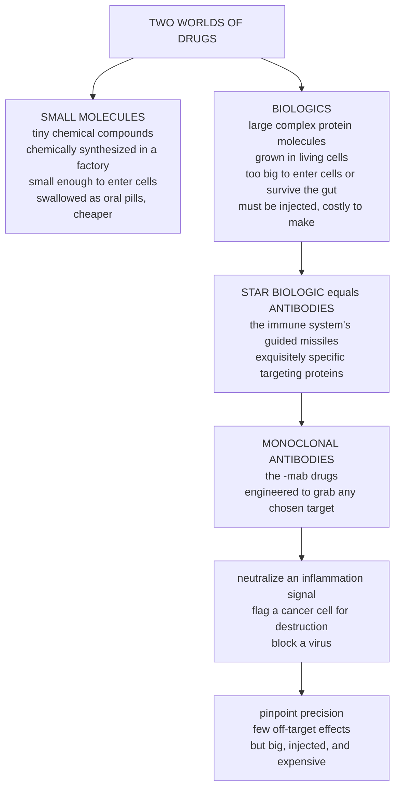

# 🧬 Antibodies and Biologics

> [!abstract] TL;DR
> For a century almost every drug was a **small molecule** — a tiny chemical compound, made in a factory, small enough to slip inside cells and be swallowed as a pill. **Biologics** are a fundamentally different kind of drug: **large, complex protein molecules grown in living cells** rather than synthesized chemically. Their superstars are **antibodies** — the immune system's own guided missiles, exquisitely precise proteins that lock onto one target and nothing else. Drug makers learned to manufacture custom **monoclonal antibodies** (the **"-mab"** drugs) aimed at any target they choose: to neutralize an inflammation signal (rheumatoid arthritis, Crohn's), to flag a cancer cell for immune destruction, or to block a virus. This precision buys **pinpoint accuracy and few off-target effects** — but because they are so big and so specific, antibodies **cannot enter cells or survive the gut** (so they are injected, not swallowed) and are **enormously expensive** to make. Biologics — antibodies, engineered proteins, hormones like **insulin** — are the fastest-growing and among the best-selling drugs in the world, a wholly different toolkit from the small-molecule pills that came before.

---

## Intuition

**Analogy — a factory-made chemical versus a living-grown guided missile.** Picture two completely different ways to build a tool. The first is the machinist's way: carve a tiny key out of metal on a bench. It is small, cheap, and rugged — you can drop it in your pocket (swallow it), and it is small enough to fit through a keyhole into the inner rooms of a house (slip inside a cell). This is the **small molecule** — a little chemical compound, synthesized step by step in a factory, that for a hundred years was almost the only kind of drug there was.

The second way is not to carve at all, but to **grow** the tool inside a living thing. Your immune system already manufactures the most precise targeting devices in biology: **antibodies** — Y-shaped proteins so exquisitely specific that each one grips a single molecular shape and ignores everything else, like a guided missile locked onto one target. Drug makers learned to grow **custom antibodies to order** — **monoclonal antibodies**, the drugs whose names end in **"-mab"** — engineered to grab whatever target the disease demands. Because an antibody is a huge, delicate protein, it is a completely different object from the metal key: it hits its target with breathtaking precision and barely touches anything else, but it is far too large to fit through a keyhole (it cannot enter cells, so it works only on targets on the cell surface or floating between cells), it would be shredded in the stomach (so it must be **injected**, not swallowed), and growing it in living cells is slow and **costly**. **Biologics** — antibodies, engineered proteins, and hormones like insulin — are this second, living-grown paradigm, and they now dominate the list of the world's best-selling drugs.

---

## How It Works

### Core mechanics

1. **Two paradigms, defined by size and origin.** A **small-molecule drug** has low molecular weight (roughly 0.1-0.9 kDa), is **chemically synthesized**, and is small enough to be **cell-penetrant** and often **orally available**. A **biologic** is a **large, complex molecule — usually a protein** (an antibody is ~150 kDa, hundreds of times larger) — **produced in living cells** using **recombinant DNA technology**. Size and origin cascade into every other property.
2. **Why biologics are injected, not swallowed.** A protein is digested to amino acids in the gut and is far too large to cross the intestinal wall intact, so oral dosing destroys it. Biologics are therefore given **parenterally** — intravenous, subcutaneous, or intramuscular injection.
3. **Why biologics act only on the outside.** A 150 kDa protein cannot cross the cell membrane, so biologics engage **extracellular and cell-surface targets** — circulating signaling molecules (cytokines), receptors on the cell surface, or antigens displayed on cells. Intracellular targets remain the domain of small molecules (and newer nucleic-acid drugs).
4. **The monoclonal antibody as the flagship.** An antibody is a Y-shaped protein with two functional halves: the **Fab arms** (the fingertips of the Y) carry the **antigen-binding site** that provides exquisite target specificity, while the **Fc stem** is the **effector region** the immune system reads to recruit killing machinery. "**Monoclonal**" means every molecule in the vial is **identical**, produced from one cloned cell line, so it binds **one** epitope with uniform, engineered specificity.
5. **How a monoclonal antibody treats disease.** Four broad mechanisms: **(a) neutralize/block** — grip a soluble signal or a receptor so it can no longer act (anti-TNF antibodies mop up an inflammation cytokine); **(b) flag for destruction** — coat a target cell so the immune system's effector arms (via Fc) destroy it; **(c) release the brakes** — **checkpoint inhibitors** block the "off switches" tumors use to hide from T cells; **(d) deliver a payload** — an **antibody-drug conjugate** uses the antibody as a homing device carrying a cytotoxic warhead straight to the cancer cell.
6. **How they are made.** The target protein's gene is inserted into host cells (typically **CHO** — Chinese hamster ovary cells), which are grown in large **bioreactors** and secrete the antibody; it is then purified through many chromatography steps. This living, temperature-sensitive process is why biologics need a **cold chain** and cost far more than a chemically synthesized pill.

### Flow / Architecture



---

## Key Concepts

### Secondary (intuitive)

- **Small molecule** = a tiny chemical drug, made in a factory, small enough to swallow as a pill and slip inside cells (aspirin, ibuprofen).
- **Biologic** = a **large protein drug grown in living cells**. Too big to enter cells or survive the stomach, so it is **injected**.
- **Antibody** = the body's own **guided missile** — a protein that locks onto one specific target and ignores everything else.
- **Monoclonal antibody ("-mab" drug)** = a **custom-built antibody**, all copies identical, engineered to grab a target of the drug maker's choosing.
- **The trade-off** = biologics are **incredibly precise** (few side effects) but **big, injected, and expensive**; small molecules are cheap and swallowable but hit more things by accident.

### Undergraduate (formal)

- **Defining a biologic.** Large, structurally complex molecules (proteins, peptides, sometimes nucleic acids or cells) produced by or extracted from **living systems** via **recombinant DNA / biotechnology**, as opposed to chemically synthesized small molecules. Also called **biopharmaceuticals**.
- **Consequences of size.** High **target specificity** and access to **extracellular/protein-protein** targets small molecules cannot reach; but **no oral bioavailability** (parenteral dosing), **no intracellular access**, complex manufacturing, cold-chain logistics, and **immunogenicity** risk.
- **Antibody structure.** Two heavy + two light chains forming a Y; the **variable regions** at the Fab tips (complementarity-determining regions, CDRs) determine antigen specificity; the constant **Fc** region determines effector function (complement, immune-cell recruitment) and, via **FcRn recycling**, the antibody's very long half-life.
- **The "-mab" nomenclature and humanization.** Antibody drug names end in **-mab** (monoclonal antibody). The source stem records how "human" it is: **-omab** (murine) → **-ximab** (chimeric) → **-zumab** (humanized) → **-umab** (fully human) — an evolution driven by the need to **reduce immunogenicity** (foreign mouse protein provokes anti-drug antibodies).
- **Mechanistic classes.** *Neutralizing/blocking* (anti-cytokine, anti-receptor), *cell-depleting* (target-coating + Fc-mediated killing), *immune-checkpoint inhibitors* (cancer immunotherapy), and *antibody-drug conjugates* (targeted cytotoxic delivery).
- **Other biologics.** Recombinant **proteins/hormones** (insulin — the first, human growth hormone, clotting factors, erythropoietin), **enzymes** (enzyme-replacement therapy), **fusion proteins / receptor decoys** (etanercept, a TNF-receptor-Fc fusion that soaks up TNF), **vaccines**, and **cell and gene therapies**. **Biosimilars** are the "generic" equivalents of biologics.

### Graduate (mechanistic and systems)

- **Pharmacokinetics of antibodies.** IgG monoclonals have **half-lives of ~1-4 weeks** because **neonatal Fc receptor (FcRn)** salvage rescues them from lysosomal degradation and recycles them to the bloodstream — the basis for **infrequent (weekly-to-monthly) dosing**. Clearance is often **nonlinear** at low doses via **target-mediated drug disposition (TMDD)**, where binding to and internalization with the target itself is an elimination route. Distribution is largely confined to plasma and interstitial fluid (small Vd).
- **Effector function engineering.** Fc glycosylation and mutations tune **ADCC** (antibody-dependent cellular cytotoxicity), **CDC** (complement-dependent cytotoxicity), and FcRn affinity (extending half-life). Removing effector function ("silenced" Fc) is desirable for pure neutralizers; enhancing it is desirable for cell-depleting oncology antibodies.
- **Beyond the classic IgG.** **Antibody-drug conjugates (ADCs)** couple a mAb to a potent cytotoxin via a cleavable linker (e.g., trastuzumab emtansine); **bispecific antibodies** grip two targets at once (e.g., **BiTEs** that yoke a T cell to a tumor cell); **antibody fragments** (Fab, scFv, nanobodies) trade half-life for tissue penetration; **fusion proteins** and **receptor decoys/traps** (etanercept, aflibercept) present a receptor domain to sequester a ligand.
- **Immunogenicity.** Any protein drug can provoke **anti-drug antibodies (ADAs)** that neutralize the drug or accelerate clearance, driving the murine → humanized → fully-human progression; residual immunogenicity persists even for fully human antibodies (idiotype recognition, aggregation, injection route).
- **Druggability and modality choice.** Biologics open the ~"undruggable" space of **protein-protein interfaces** and **extracellular signaling** that small molecules struggle with; conversely, **intracellular** targets and CNS penetration (blood-brain barrier) favor small molecules or newer modalities. Modality selection is now an explicit early design decision.
- **Economics and the pipeline.** Biologics dominate the top of the global best-seller list (Humira/adalimumab, Keytruda/pembrolizumab, and successive checkpoint inhibitors and ADCs). **Biosimilars** cannot be identical copies (living-cell manufacture) and require dedicated comparability and clinical bridging studies, unlike small-molecule generics.

---

## Python Demo

```python
# Two drug paradigms, in three pictures:
#   (a) MOLECULAR SIZE  -> log-scale bars: a small molecule (~0.2-0.5 kDa) vs
#       insulin (~5.8 kDa) vs a monoclonal antibody (~150 kDa) -- the size gulf
#       that dictates injection, no cell entry, and high manufacturing cost.
#   (b) QUALITATIVE PROFILE -> small molecule vs biologic scored 1..5 across the
#       properties that flip between the two paradigms (size, specificity, cost,
#       oral availability, cell penetration, manufacturing complexity).
#   (c) ANTIBODY PK -> an IgG's very long half-life (~21 days) lets a monthly
#       injection keep the target NEUTRALIZED, while a small molecule (t_half ~ 8 h)
#       needs daily dosing -- the reason biologic dosing is so infrequent.
import numpy as np
import matplotlib.pyplot as plt

# ---------- (a) molecular size ----------
names_mw  = ["Aspirin\n(small mol.)", "Caffeine\n(small mol.)",
             "Insulin\n(small protein)", "Monoclonal\nantibody"]
mw_kda    = [0.18, 0.19, 5.8, 150.0]                      # kilodaltons
colors_mw = ["#2980B9", "#2980B9", "#16A085", "#C0392B"]

# ---------- (b) qualitative property profile (1 = low ... 5 = high) ----------
props     = ["Molecular\nsize", "Target\nspecificity", "Manufacturing\ncomplexity",
             "Cost per\ndose", "Oral\navailability", "Cell\npenetration"]
small_mol = [1, 2, 1, 1, 5, 5]
biologic  = [5, 5, 5, 5, 1, 1]

# ---------- (c) antibody pharmacokinetics ----------
t = np.linspace(0, 84, 2000)     # 12 weeks, in days

def repeated_iv(t, dose, ke, interval, n_doses):
    """Superpose one-compartment IV-bolus decays given at fixed intervals."""
    C = np.zeros_like(t)
    for k in range(n_doses):
        t0 = k * interval
        m = t >= t0
        C[m] += dose * np.exp(-ke * (t[m] - t0))
    return C

ke_ab = np.log(2) / 21.0                                   # IgG half-life ~21 days
C_ab  = repeated_iv(t, dose=10.0, ke=ke_ab, interval=28.0, n_doses=3)   # monthly
ke_sm = np.log(2) / 0.33                                   # small mol t_half ~8 h
C_sm  = repeated_iv(t, dose=10.0, ke=ke_sm, interval=1.0,  n_doses=84)  # daily
IC50  = 1.5
neutral = 100.0 * C_ab / (C_ab + IC50)                     # % target neutralized

fig = plt.figure(figsize=(16.5, 5.4))
ax1, ax2, ax3 = (fig.add_subplot(1, 3, i) for i in (1, 2, 3))

# (a) size gulf, log scale
x = np.arange(len(names_mw))
ax1.bar(x, mw_kda, color=colors_mw, log=True)
for xi, v in zip(x, mw_kda):
    ax1.text(xi, v * 1.35, f"{v:g} kDa", ha="center", fontsize=8)
ax1.set_xticks(x); ax1.set_xticklabels(names_mw, fontsize=8)
ax1.set_ylabel("Molecular weight (kDa, log scale)")
ax1.set_title("(a) Size gulf: an antibody is ~300-800x a small molecule")
ax1.set_ylim(0.1, 600)
ax1.grid(axis="y", which="both", alpha=0.3)

# (b) opposite property profiles
xb = np.arange(len(props)); w = 0.38
ax2.bar(xb - w / 2, small_mol, w, label="Small molecule", color="#2980B9")
ax2.bar(xb + w / 2, biologic,  w, label="Biologic (antibody)", color="#C0392B")
ax2.set_xticks(xb); ax2.set_xticklabels(props, fontsize=7.5)
ax2.set_ylabel("Relative score (1 low .. 5 high)")
ax2.set_title("(b) Two paradigms, mirror-image profiles")
ax2.set_ylim(0, 5.6); ax2.legend(fontsize=8)
ax2.grid(axis="y", alpha=0.3)

# (c) long half-life -> infrequent dosing -> sustained target neutralization
ax3.plot(t, C_ab, color="#C0392B", lw=2.3, label="Antibody  (t½~21 d, dosed q4w)")
ax3.plot(t, C_sm, color="#2980B9", lw=0.9, alpha=0.8,
         label="Small molecule  (t½~8 h, daily)")
ax3.set_xlabel("Time (days)"); ax3.set_ylabel("Plasma concentration (a.u.)")
ax3.set_title("(c) Antibody: long half-life, infrequent dosing")
ax3.set_ylim(0, 15)
axr = ax3.twinx()
axr.plot(t, neutral, color="#16A085", ls="--", lw=1.8, label="Target neutralized (%)")
axr.set_ylabel("Target neutralized (%)", color="#16A085")
axr.set_ylim(0, 105)
h1, l1 = ax3.get_legend_handles_labels()
h2, l2 = axr.get_legend_handles_labels()
ax3.legend(h1 + h2, l1 + l2, fontsize=7.3, loc="lower right")
ax3.grid(alpha=0.3)

plt.tight_layout(); plt.show()

# Numeric read-outs tying the panels together
print(f"(a) size ratio antibody/aspirin = {mw_kda[3]/mw_kda[0]:.0f}x")
print(f"(c) antibody ke = {ke_ab:.4f}/day  (half-life {np.log(2)/ke_ab:.0f} days)")
print(f"(c) small-molecule ke = {ke_sm:.3f}/day  (half-life {np.log(2)/ke_sm*24:.1f} h)")
print(f"(c) doses to cover 84 days: antibody = 3, small molecule = 84")
```

**What you see.** *Panel (a)* is the whole story in one axis: on a **log** scale, a monoclonal antibody towers hundreds of times above a small molecule — this size gulf is *why* biologics are injected, cannot enter cells, and cost so much to manufacture. *Panel (b)* shows the two paradigms as near mirror images: the small molecule wins on oral availability and cell penetration and cost; the biologic wins on specificity while paying in manufacturing complexity and price. *Panel (c)* explains the clinic's convenience: an IgG's ~21-day half-life (courtesy of FcRn recycling) lets a **monthly** injection keep target neutralization high the entire time, whereas the small molecule's ~8-hour half-life demands **daily** dosing (84 doses versus 3 over the same span).

---

## Real-World Applications

- **Anti-TNF antibodies in autoimmune disease.** Adalimumab (Humira) and infliximab **neutralize TNF-α**, a master inflammation cytokine, transforming rheumatoid arthritis, Crohn's disease, and psoriasis. Adalimumab was for years the **best-selling drug in the world** — the commercial face of the biologics era.
- **Checkpoint inhibitors in oncology.** Pembrolizumab (Keytruda) and nivolumab are antibodies that **block the PD-1/PD-L1 "off switch"** tumors exploit, unleashing T cells against cancer — the Nobel-recognized breakthrough of modern immunotherapy.
- **Antibody-drug conjugates.** Trastuzumab emtansine (Kadcyla) and trastuzumab deruxtecan use an anti-HER2 antibody as a **homing device carrying a cytotoxic payload** directly to breast-cancer cells, sparing healthy tissue the full toxicity of chemotherapy.
- **Insulin — the original biologic.** Recombinant human insulin (Humulin, 1982) was the first approved recombinant-DNA drug: a **replacement protein** for what a diabetic body lacks, and the template for growth hormone, clotting factors, and erythropoietin.
- **Etanercept — a fusion-protein decoy.** Rather than an antibody, etanercept (Enbrel) is a **TNF-receptor-Fc fusion** that acts as a molecular sponge, soaking up TNF before it can drive inflammation — a receptor-decoy strategy.
- **Antiviral and prophylactic antibodies.** Neutralizing monoclonal antibodies against RSV (palivizumab, nirsevimab) and, during the pandemic, against SARS-CoV-2 spike protein, **block the virus** from infecting cells.
- **Biosimilars.** As blockbuster biologics lose patent protection, biosimilar versions of adalimumab, trastuzumab, and others expand access at lower cost — the biologic analogue of small-molecule generics, but requiring their own clinical bridging.

---

## Common Pitfalls

- **Calling any large or injected drug a "biologic" loosely.** The defining criterion is being a **complex molecule produced in a living system**, not merely size or route. Some peptides are chemically synthesized; some small molecules are injected. Anchor the definition in **origin plus molecular class**.
- **Expecting a biologic to be swallowable.** Proteins are **digested and cannot cross the gut wall**, so oral biologics essentially do not work; injection (IV/SC/IM) is intrinsic, not a temporary limitation. Do not analogize their delivery to a pill.
- **Assuming biologics can hit intracellular targets.** A 150 kDa protein **cannot cross the cell membrane**; biologics reach only **surface and extracellular** targets. Intracellular proteins remain small-molecule (or nucleic-acid/degrader) territory.
- **Ignoring immunogenicity.** A protein drug can trigger **anti-drug antibodies** that neutralize it or speed its clearance — the entire reason for the murine → chimeric → humanized → fully-human progression. "Fully human" reduces but does not eliminate the risk.
- **Confusing potency with specificity.** Antibodies are prized for **specificity** (one target), which limits off-target effects — but that same specificity means on-target, on-mechanism toxicity (e.g., over-suppressing TNF raises infection risk) and no coverage if the target mutates.
- **Treating biosimilars like generics.** Because biologics are grown in living cells, a biosimilar is **highly similar, never identical**, and needs comparability and clinical studies — you cannot simply prove chemical equivalence as with a small-molecule generic.
- **Reading this as medical advice.** This note explains the **science** of large-molecule drugs at textbook level. It is **not** guidance for any individual's treatment, drug choice, or dosing, which always depends on a clinician and a specific patient.

---

## Related Concepts

**Within this vault (Section 02 and beyond).** This note sits alongside sibling Pharmacology notes developed as prose companions. *Drug_Targets_and_the_Druggable_Genome* frames the modality question this note answers — why some disease-relevant proteins (extracellular signals, protein-protein interfaces) demand biologics while intracellular targets stay with small molecules. *Nucleic_Acid_Therapeutics* covers the *other* large-molecule revolution — antisense oligonucleotides, siRNA, and mRNA — that, like biologics, reaches targets small molecules cannot. *Anticancer_and_Immunomodulatory_Drugs* applies the checkpoint-inhibitor and antibody-drug-conjugate mechanisms sketched here across oncology and autoimmunity. *Routes_of_Administration_and_Drug_Delivery* details why biologics must be injected and the delivery engineering that follows. *The_Reach_and_Future_of_Pharmacology* places biologics within the expanding modality landscape (bispecifics, cell and gene therapy, degraders). These are prose references to sibling notes within the Pharmacology vault.

**Across the vault (Glob-verified links).**

- [[Biology/11_Microbiology_and_Immunology/The_Adaptive_Immune_System|The Adaptive Immune System]] — where antibodies come from: the B-cell response and the Y-shaped targeting proteins that monoclonal drugs industrialize.
- [[Biology/01_Chemistry_of_Life/Proteins_and_Amino_Acids|Proteins and Amino Acids]] — biologics *are* proteins; their folded structure, size, and fragility explain injection, cold chain, and no cell entry.
- [[Biology/13_Biotechnology_and_Genomics/Recombinant_DNA_and_Cloning|Recombinant DNA and Cloning]] — the recombinant-DNA technology that lets living cells manufacture insulin and antibodies, the manufacturing basis of every biologic.
- [[Biology/11_Microbiology_and_Immunology/Vaccines_and_Antibiotics|Vaccines and Antibiotics]] — vaccines are themselves biologics, and a bridge to the immune mechanisms antibody drugs exploit.
- [[Clinical_Medicine/05_Immune_Infectious_and_Hematologic/Immune_Dysfunction_and_Autoimmunity|Immune Dysfunction and Autoimmunity]] — the autoimmune diseases (rheumatoid arthritis, Crohn's) that anti-TNF and other biologics revolutionized.
- [[Clinical_Medicine/01_Foundations_of_Disease_and_Pathophysiology/Neoplasia_and_Cancer_Biology|Neoplasia and Cancer Biology]] — the tumor biology that checkpoint inhibitors and antibody-drug conjugates target.
- [[Genetics/05_Human_and_Medical_Genetics/Gene_Therapy_and_CRISPR|Gene Therapy and CRISPR]] — the cell- and gene-therapy modalities that extend the "living medicine" frontier beyond proteins.

---

## Review Questions

**Secondary.** Using the "factory-made metal key versus living-grown guided missile" analogy, explain two concrete differences between a small-molecule drug and a biologic. Why must a biologic like insulin be **injected** rather than swallowed, and why can it not reach a target *inside* a cell?

**Undergraduate.** Describe the structure of a monoclonal antibody (Fab versus Fc) and name the four broad mechanisms by which antibody drugs treat disease (neutralize, flag for destruction, checkpoint inhibition, payload delivery), giving one real drug for each. Then explain the **-mab humanization ladder** (murine → chimeric → humanized → fully human) and the single problem it is designed to reduce.

**Graduate.** An antibody drug is given by subcutaneous injection once a month, yet keeps its target ~90% neutralized the entire interval. Explain the pharmacokinetic mechanism (FcRn recycling, long half-life) that makes such infrequent dosing possible, and contrast it with a daily-dosed small molecule. Then discuss two situations where you would *choose a small molecule over a biologic* despite the biologic's superior specificity, and explain **target-mediated drug disposition** and why it makes antibody clearance nonlinear.

---

## Sources

- Rang, H. P.; Ritter, J. M.; Flower, R. J.; Henderson, G. *Rang and Dale's Pharmacology* (9th ed.), Elsevier — chapter on **biopharmaceuticals and biologic agents**.
- Katzung, B. G.; Vanderah, T. W. (eds.). *Basic and Clinical Pharmacology* (15th ed.), McGraw-Hill — monoclonal antibodies, recombinant proteins, and immunopharmacology.
- Carter, P. J.; Lazar, G. A. "Next generation antibody drugs: pursuing the 'high-hanging fruit'." / Carter, P. J. "Potent antibody therapeutics by design." *Nature Reviews Immunology* / *Nature Reviews Drug Discovery* — antibody engineering, effector function, and mechanism.
- Leader, B.; Baca, Q. J.; Golan, D. E. "Protein therapeutics: a summary and pharmacological classification." *Nature Reviews Drug Discovery* (2008), 7, 21-39 — the classification framework for protein and antibody biologics.

---

#pharmacology #biologics #monoclonal-antibodies #protein-drugs #immunotherapy
