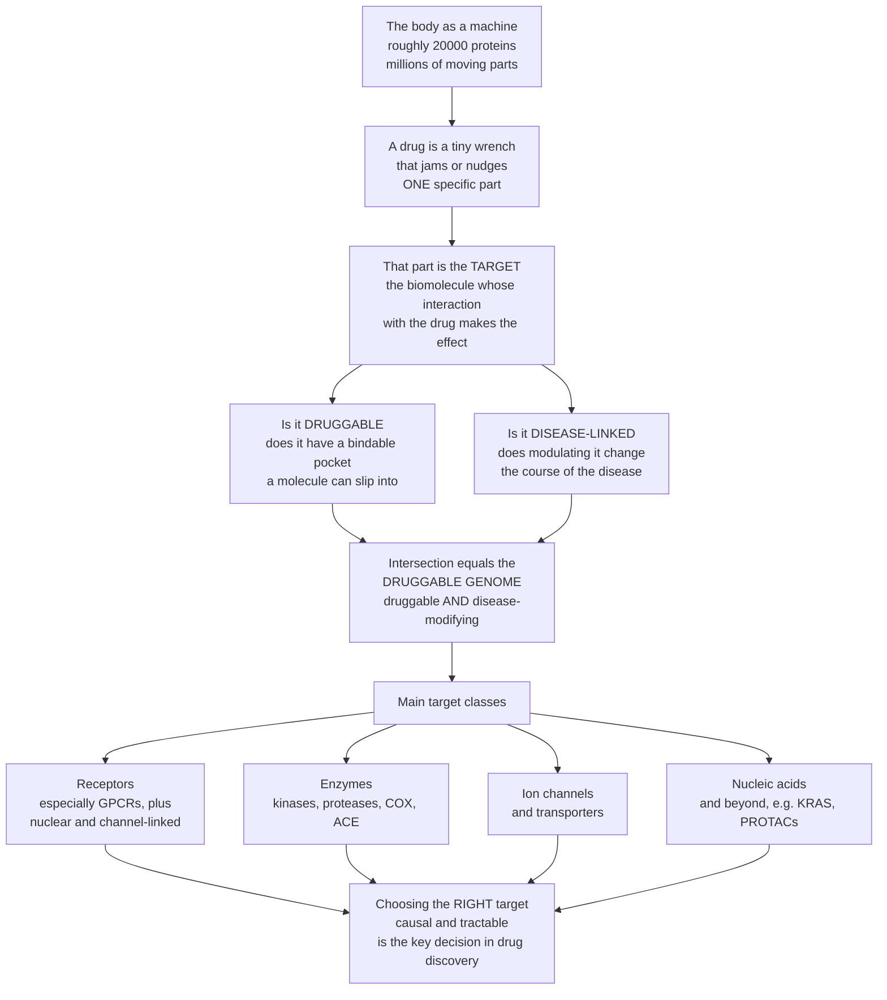

# 🎯 Drug Targets and the Druggable Genome

> [!abstract] TL;DR
> A drug is only as good as its **target** — the specific biomolecule, almost always a **protein**, that the drug grabs to produce its effect. Astonishingly, the vast majority of medicines ever made hit a tiny number of target *types*: **receptors** (above all **G-protein-coupled receptors, GPCRs**, which are hit by roughly a third of all drugs), **enzymes** (kinases, proteases, COX, ACE), and **ion channels and transporters**. Of the roughly 20,000 human proteins, only a subset are **druggable** — they have a binding pocket a small molecule or biologic can slip into — and only some of *those* are **disease-modifying**. The intersection of "druggable" and "disease-linked" is the **druggable genome**: the finite hunting ground for new medicines, estimated at a few thousand proteins of which only several hundred are currently drugged. Picking a good target — one that is *causal* to the disease and *tractable* to bind — is the single most consequential decision in drug discovery: get it right and the rest may follow; get it wrong and you can burn a decade and a billion dollars.

---

## Intuition

**Analogy FIRST — the body as a machine and the drug as a wrench.** Picture the human body as an unimaginably complex machine with millions of moving parts, where each "part" is a protein doing a job — pumping ions, relaying a signal, cutting another protein, carrying oxygen. A drug is a tiny wrench thrown into this machine. It does not act everywhere; it jams or nudges *one specific part*. The whole genius of modern medicine is choosing the **right part to jam** — a part where interfering *fixes the disease* without breaking everything else. Jam the wrong gear and nothing improves, or worse, the machine seizes up somewhere it shouldn't. That single chosen part is the **drug target**.

Now the crucial twist: not every part *accepts* a wrench. Some proteins have a clean, cup-shaped pocket where a small molecule fits snugly — these are **druggable**. Others are smooth, featureless surfaces with nowhere to grip — long considered **undruggable**. And separately, only some parts actually *matter* for the disease you care about; jamming a part the disease doesn't depend on is useless. So the useful targets live at the **intersection** of two circles: proteins that are *bindable* AND proteins that are *disease-causing*. That intersection is what Hopkins and Groom named the **druggable genome** — of the ~20,000 human proteins, only a few thousand are druggable, and only a fraction of those are worth targeting.

The stunning empirical fact is how *concentrated* real drugs are. You might expect thousands of different kinds of targets. Instead, a mere handful of protein families — **GPCRs, enzymes, ion channels, transporters, and nuclear receptors** — absorb the overwhelming majority of all approved medicines, because those families happen to have the nice grippable pockets. This note maps that landscape: what a drug target *is*, the major classes drugs aim at, the concept of the druggable genome, and why choosing and *validating* the right target is where drug discovery is won or lost.

---

## How It Works

### Core mechanics

1. **A target is a specific biomolecule.** The drug target is the molecule whose interaction with a drug produces the therapeutic effect. It is almost always a **protein** — a receptor, enzyme, channel, or transporter — though a minority of drugs target **DNA or RNA** (see nucleic-acid therapeutics below). This is the foundation of *rational, mechanism-based* pharmacology: you decide which molecule to modulate, then design a drug to modulate it — as opposed to older *phenotypic* (empirical) discovery, where a compound's effect was observed first and its target discovered later, if ever.
2. **Drugs cluster into a few target classes.** Survey every approved drug and the targets sort into: **receptors** (the largest class, dominated by **GPCRs**, plus ion-channel-linked, enzyme/kinase-linked, and **nuclear** receptors); **enzymes**, hit by **inhibitors** (kinases, proteases, COX, ACE, HMG-CoA reductase); **ion channels and transporters** (calcium and sodium channels; reuptake transporters such as the serotonin transporter targeted by SSRIs); and **structural or other proteins**. Each major class is expanded in the notes that follow this opener.
3. **Druggability is about the pocket.** A protein is "druggable" if it possesses a binding site with the right size, shape, and chemistry to bind a drug-like molecule with high affinity. Enzymes have active-site pockets; GPCRs have deep ligand pockets; channels have gates and vestibules. **Protein–protein interaction** surfaces and many transcription factors are flat and featureless — historically "undruggable."
4. **The druggable genome is an intersection.** Of ~20,000 human protein-coding genes, Hopkins and Groom estimated only ~3,000 are druggable by small molecules, and the genuinely useful set is the overlap of **druggable ∩ disease-modifying** — a few thousand candidates, of which only several hundred are drugged today.
5. **The frontier keeps expanding.** **Biologics** (antibodies) reach extracellular and surface targets small molecules cannot; **PROTACs** degrade proteins rather than inhibiting them, cracking "undruggable" targets; **RNA drugs** and covalent chemistry finally hit targets like **KRAS**. The druggable genome is not fixed — it grows as chemistry advances.
6. **Choosing and validating the target comes first.** Before any chemistry, drug discovery must **identify** a target (from disease biology, human genetics, and omics) and **validate** it (confirm that modulating it actually changes the disease). Target choice — its causality, druggability, selectivity, and safety — drives success or failure more than any later step.

### Flow



---

## Key Concepts

### Secondary (explain to a bright teenager)

- **A drug needs a target.** A medicine works by grabbing one specific molecule in your body — usually a protein — and changing what it does. That molecule is the *target*.
- **The body is a machine; the drug is a wrench.** There are millions of protein "parts." A good drug jams the *one* part whose jamming fixes the disease without wrecking the rest.
- **Only some parts accept a wrench.** A protein is *druggable* if it has a little pocket a drug can slip into and hold on tight. Smooth proteins with no pocket are hard or impossible to drug.
- **A few families do most of the work.** Almost every drug hits one of a small handful of protein types: **receptors** (especially a family called GPCRs), **enzymes**, **ion channels**, and **transporters**. Nature keeps reusing the same grippable shapes.
- **The druggable genome.** Out of about 20,000 human proteins, only a few thousand are both *drug-gable* and *disease-related*. That overlap is the map of where new medicines can come from.
- **Picking the target is the big decision.** Choose a good target and a great drug may follow. Choose a bad one and years of work lead nowhere.

### Undergraduate (needs some biology)

- **Rational vs phenotypic discovery.** *Target-based* (rational) discovery starts by choosing a molecular target and screening for modulators of it. *Phenotypic* discovery screens for a whole-cell or whole-organism effect and deconvolutes the target afterward. Many classic drugs (aspirin, lithium) came phenotypically; the target was found later.
- **The four workhorse classes.**
  - **Receptors** — the largest class. **GPCRs** (rhodopsin-like family) are hit by roughly a third of all marketed drugs — beta-blockers, antihistamines, opioids, antipsychotics. **Nuclear receptors** (steroid, thyroid) are ligand-activated transcription factors targeted by corticosteroids and tamoxifen. **Ligand-gated ion channels** and **receptor tyrosine kinases** are receptors too.
  - **Enzymes** — targeted by **inhibitors** that block the active site: statins (HMG-CoA reductase), ACE inhibitors, NSAIDs (COX-1/2), protease inhibitors (HIV, hepatitis C), and the exploding class of **kinase** inhibitors in oncology.
  - **Ion channels** — voltage-gated calcium channels (amlodipine), sodium channels (local anesthetics, some antiepileptics).
  - **Transporters** — the serotonin transporter (SSRIs), proton pump (omeprazole is technically an enzyme inhibitor, but the SGLT2 and reuptake transporters are true transporter targets).
- **Small molecule vs biologic by target location.** Small molecules can cross membranes to reach **intracellular** targets (kinases, nuclear receptors). Antibodies and other **biologics** are large and cannot enter cells, so they hit **extracellular or cell-surface** targets (cytokines, surface receptors like HER2, checkpoint proteins like PD-1).
- **Druggability criteria.** A tractable target has: a well-defined binding pocket; the ability to bind a molecule with drug-like properties at reasonable affinity; and ideally structural data (crystal or cryo-EM) to guide design. "Ligandability" (can something bind?) is necessary but not sufficient for "druggability" (can a *useful medicine* be made?).
- **Target validation evidence hierarchy.** Confidence that modulating a target treats a disease rises from *biochemical* → *cell-based* → *animal model* → *human genetic* evidence. Human genetic evidence linking the target to the disease roughly *doubles* the probability that the eventual drug succeeds in the clinic.

### Graduate (system-level / molecular)

- **How many targets are there, really?** Overington and colleagues (2006) counted ~324 molecular targets for all then-approved drugs. Santos and colleagues (2017) updated this to **667 human protein targets** (and ~1,578 including pathogen and other targets). Against ~20,000 human proteins and an estimated ~3,000-strong druggable genome, this means the pharmacopeia exploits only a **small, privileged slice** of the proteome — and the same targets are reused across many drugs.
- **The privileged-family phenomenon.** Drug targets are not uniformly distributed across protein space; they cluster in a few **privileged families** (rhodopsin-like GPCRs, protein kinases, nuclear receptors, ion channels) whose fold happens to present tractable pockets. This concentration is why medicinal chemistry accumulates deep, transferable know-how within a family (e.g. kinase hinge-binders).
- **Ligandability, druggability, and the pocket physics.** Computational tools (SiteMap, fpocket) score pockets on enclosure, hydrophobicity, and size. A pocket must bury enough hydrophobic surface to reach nanomolar affinity with a molecule obeying Lipinski-like limits. Shallow, polar, or solvent-exposed interfaces (most protein–protein interactions, transcription-factor surfaces) score as **undruggable** by small molecules — the classic reason KRAS resisted for decades until the covalent G12C pocket was exploited.
- **Expanding the druggable genome.** Modalities that move the boundary: **biologics** (extracellular reach, exquisite selectivity), **bispecifics**, **PROTACs and molecular glues** (event-driven *degradation* needs only a transient binding groove, not a deep functional pocket), **antisense oligonucleotides and siRNA** (target the mRNA, bypassing protein druggability entirely), **mRNA and gene therapy**, and **covalent inhibitors** (exploit a reactive cysteine). Each redefines what "druggable" means.
- **Target selection as the dominant risk.** Analyses of clinical attrition attribute a large share of Phase-II failures to **lack of efficacy** — i.e. the *target was wrong* (not causal), not that the molecule was bad. This is why the industry reoriented toward **human genetics** (Mendelian disease genes, GWAS, Mendelian randomization) as the strongest validation signal, and toward **causality** over mere *association*. A good target scores on: causality to disease, druggability, selectivity (to avoid off-target toxicity), and an acceptable **on-target safety** profile (does inhibiting it *anywhere* cause harm — the loss-of-function-in-humans natural experiment).
- **On-target vs off-target toxicity.** *Off-target* toxicity comes from hitting proteins other than the intended one (mitigated by selectivity). *On-target* (mechanism-based) toxicity comes from modulating the intended target in tissues where it is essential — an intrinsic property of the *target choice* that no amount of chemistry can fix, making it a target-selection question.

---

## Python Demo

```python
# Drug targets and the druggable genome, four illustrative pieces:
#   (a) target-class breakdown : which protein classes approved drugs actually hit
#   (b) concentration curve     : how few classes account for most drugs (cumulative)
#   (c) druggable-genome Venn    : druggable proteins intersect disease-associated proteins
#   (d) target validation        : stronger evidence -> higher probability of clinical success
# All numbers are illustrative teaching values consistent with the literature,
# not exact database counts. Educational content, not medical advice.
import numpy as np
import matplotlib.pyplot as plt
from matplotlib.patches import Circle

fig, ax = plt.subplots(2, 2, figsize=(15, 11))

# ---------------------------------------------------------------------------
# (a) Target-class breakdown of approved-drug targets
classes = ["GPCRs", "Enzymes\n(kinases,\nproteases)", "Ion\nchannels",
           "Transporters", "Nuclear\nreceptors", "Other /\nstructural"]
share   = np.array([33, 30, 18, 7, 4, 8], dtype=float)   # percent of drugs, illustrative
colors  = ["#2980b9", "#c0392b", "#27ae60", "#8e44ad", "#e67e22", "#7f8c8d"]

bars = ax[0, 0].bar(classes, share, color=colors)
for b, v in zip(bars, share):
    ax[0, 0].text(b.get_x() + b.get_width()/2, v + 0.6, f"{v:.0f}%",
                  ha="center", fontsize=10, fontweight="bold")
ax[0, 0].set_ylabel("Share of approved drugs (%)")
ax[0, 0].set_ylim(0, 40)
ax[0, 0].set_title("(a) A few protein families absorb most drugs")
ax[0, 0].tick_params(axis="x", labelsize=8)

# ---------------------------------------------------------------------------
# (b) Concentration: cumulative share as classes are added (Pareto-like)
order = np.argsort(share)[::-1]
cum   = np.cumsum(share[order])
labels_sorted = [classes[i].replace("\n", " ") for i in order]
ax[0, 1].plot(range(1, len(cum) + 1), cum, "o-", color="#16a085", lw=2)
ax[0, 1].axhline(80, color="#c0392b", ls="--", lw=1.5, label="80% of drugs")
ax[0, 1].fill_between(range(1, len(cum) + 1), cum, alpha=0.15, color="#16a085")
for i, (x, y) in enumerate(zip(range(1, len(cum) + 1), cum)):
    ax[0, 1].annotate(labels_sorted[i], (x, y), textcoords="offset points",
                      xytext=(6, -12), fontsize=7, rotation=0)
ax[0, 1].set_xlabel("Number of target classes included (largest first)")
ax[0, 1].set_ylabel("Cumulative share of drugs (%)")
ax[0, 1].set_title("(b) The top 3 classes hit ~80% of all drugs")
ax[0, 1].set_ylim(0, 105)
ax[0, 1].legend(fontsize=9)

# ---------------------------------------------------------------------------
# (c) Druggable-genome Venn: druggable proteins intersect disease-associated proteins
ax[2 - 1, 0].set_xlim(0, 10); ax[1, 0].set_ylim(0, 10)
ax[1, 0].set_aspect("equal"); ax[1, 0].axis("off")

# Background: whole proteome
ax[1, 0].add_patch(Circle((5, 5), 4.6, facecolor="#ecf0f1", edgecolor="#bdc3c7", lw=1))
ax[1, 0].text(5, 9.3, "~20,000 human proteins (the proteome)",
              ha="center", fontsize=9, style="italic")

# Two overlapping sets
c_drug = Circle((3.7, 4.6), 2.6, facecolor="#2980b9", alpha=0.45, edgecolor="#2980b9", lw=2)
c_dis  = Circle((6.3, 4.6), 2.6, facecolor="#c0392b", alpha=0.45, edgecolor="#c0392b", lw=2)
ax[1, 0].add_patch(c_drug); ax[1, 0].add_patch(c_dis)

ax[1, 0].text(2.7, 6.6, "DRUGGABLE\n~3,000\nhave a bindable pocket",
              ha="center", fontsize=8.5, color="#1b4f72", fontweight="bold")
ax[1, 0].text(7.3, 6.6, "DISEASE-\nASSOCIATED\n~3,000",
              ha="center", fontsize=8.5, color="#7b241c", fontweight="bold")
ax[1, 0].text(5, 4.6, "DRUGGABLE\nGENOME\n~600-1,500\nattractive targets",
              ha="center", va="center", fontsize=8.5, color="black", fontweight="bold")
ax[1, 0].text(5, 2.8, "~667 currently drugged",
              ha="center", fontsize=8, color="#145a32")
ax[1, 0].set_title("(c) The druggable genome = druggable AND disease-linked")

# ---------------------------------------------------------------------------
# (d) Target validation: probability of clinical success by evidence strength
stages = ["No\nvalidation", "Biochemical", "Cell-based", "Animal\nmodel",
          "Human\ngenetics"]
p_success = np.array([0.05, 0.08, 0.12, 0.16, 0.28])   # illustrative, rising
bars2 = ax[1, 1].bar(stages, p_success * 100,
                     color=plt.cm.viridis(np.linspace(0.15, 0.9, len(stages))))
for b, v in zip(bars2, p_success):
    ax[1, 1].text(b.get_x() + b.get_width()/2, v*100 + 0.5, f"{v*100:.0f}%",
                  ha="center", fontsize=9, fontweight="bold")
ax[1, 1].annotate("human genetic evidence\nroughly doubles success",
                  xy=(4, 28), xytext=(1.6, 24),
                  arrowprops=dict(arrowstyle="->"), fontsize=8.5)
ax[1, 1].set_ylabel("Probability the target survives to approval (%)")
ax[1, 1].set_title("(d) Stronger validation lowers the risk of a wrong target")
ax[1, 1].set_ylim(0, 34)
ax[1, 1].tick_params(axis="x", labelsize=8)

plt.tight_layout()
plt.savefig("drug_targets_druggable_genome.png", dpi=120)
plt.show()

# Console sanity checks
print(f"(a) Target-class shares sum to {share.sum():.0f}%")
print(f"(b) Top 3 classes cumulative share = {cum[2]:.0f}% of all drugs")
print(f"(c) Attractive targets ~600-1,500 of ~3,000 druggable and ~3,000 disease-linked")
print(f"(d) Success prob: none={p_success[0]*100:.0f}%  human-genetics={p_success[-1]*100:.0f}%"
      f"  ({p_success[-1]/p_success[0]:.1f}x)")
```

**What it shows.** Panel **(a)** is the headline empirical fact: a handful of protein families — GPCRs, enzymes, ion channels, transporters, nuclear receptors — absorb almost every drug, with GPCRs alone hit by roughly a third. Panel **(b)** drives it home as a Pareto curve: the top *three* classes already account for about 80% of drugs, so the pharmacopeia is extraordinarily concentrated. Panel **(c)** is the druggable-genome concept as two overlapping circles inside the ~20,000-protein proteome: only ~3,000 proteins are druggable and only some overlap with the ~3,000 disease-associated proteins, so the genuinely attractive targets number only a few hundred to ~1,500, of which ~667 are drugged today. Panel **(d)** is why *target validation* matters: the probability that a chosen target survives all the way to an approved drug climbs steeply with evidence strength, and **human genetic** support roughly doubles the odds versus an unvalidated target — the strongest argument for grounding target selection in human biology.

---

## Real-World Applications

> **GPCRs — the single most productive target family.** Roughly one third of all approved drugs act on **G-protein-coupled receptors**: beta-blockers (metoprolol on beta-1 adrenergic receptors), antihistamines (loratadine on H1), opioids (morphine on the mu-opioid receptor), antipsychotics (dopamine D2), and the blockbuster **GLP-1 agonists** (semaglutide) for diabetes and obesity. One protein fold, decoded structurally by cryo-EM, keeps yielding new medicines — the clearest proof that a *privileged, druggable* family concentrates drug discovery.

- **Enzyme inhibitors as blockbusters.** **Statins** inhibit HMG-CoA reductase to lower cholesterol; **ACE inhibitors** (lisinopril) treat hypertension; **NSAIDs** inhibit cyclooxygenase; **kinase inhibitors** (imatinib for BCR-ABL, osimertinib for mutant EGFR) transformed oncology. The active-site pocket makes enzymes the second great druggable class.
- **Transporters and channels.** **SSRIs** (fluoxetine, sertraline) block the serotonin *reuptake transporter*, raising synaptic serotonin — a textbook transporter target. Calcium-channel blockers (amlodipine) and sodium-channel-blocking local anesthetics (lidocaine) exemplify ion-channel targets.
- **Cracking the "undruggable."** **KRAS**, mutated in a third of cancers, was called undruggable for 30 years until sotorasib exploited a covalent pocket on the G12C mutant. **PROTACs** now *degrade* previously untouchable proteins by hijacking the cell's disposal machinery, and **antisense/siRNA** drugs (inclisiran for cholesterol) target the mRNA, sidestepping protein druggability entirely.
- **Human genetics choosing targets.** The **PCSK9** cholesterol drugs (evolocumab, inclisiran) were built directly on human genetics: people with loss-of-function PCSK9 variants have naturally low LDL and fewer heart attacks — a validated, causal, safe-to-inhibit target *before* any drug existed. This is target validation done right.
- **When the target is wrong.** Many high-profile failures (numerous Alzheimer's amyloid programs, various oncology targets) reflect not bad chemistry but a **target that was not truly causal** to the disease — the most expensive mistake in the industry, and the reason target validation now dominates early strategy.

---

## Common Pitfalls

- **Confusing the drug with the target.** The *drug* is the molecule you administer; the *target* is the body's molecule it acts on. Two very different drugs can share one target, and one drug can hit several targets. Reasoning about mechanism, selectivity, and side effects requires keeping the two separate.
- **Assuming every protein is druggable.** Most of the proteome has no tractable small-molecule pocket. Betting a program on a beautiful disease hypothesis whose target has no bindable site — a flat protein–protein interface, a "smooth" transcription factor — is a classic way to fail. *Ligandability must be checked, not assumed.*
- **Mistaking association for causality.** A GWAS hit or an over-expressed protein is *associated* with a disease; that does not mean *modulating it treats the disease*. The strongest failures come from targets that were correlated with, but not causal to, pathology. Validation must establish causal direction (ideally human loss-of-function evidence or Mendelian randomization).
- **Ignoring on-target toxicity.** Off-target effects can be engineered away with selectivity; **on-target** (mechanism-based) toxicity cannot — if the target is essential in the heart or gut, inhibiting it *anywhere* may harm. This is a property of the *target choice*, and must be assessed before committing.
- **Overrating the "undruggable" label as permanent.** Targets called undruggable for decades (KRAS, some protein–protein interactions) fell to new modalities. "Undruggable" means "not yet druggable with current chemistry," not "impossible" — but equally, do not assume a new modality will magically appear on your timeline.
- **Forgetting modality must match target location.** A small molecule can reach an intracellular kinase; an antibody cannot get inside the cell. Choosing a biologic for an intracellular target (or vice versa without justification) is a fundamental mismatch of modality to target biology.

---

## Related Concepts

This note is the **S02 section opener** and frames the specific target classes explored in the notes that follow. The receptor families — above all GPCRs, plus nuclear and channel-linked receptors — and the signal-transduction cascades they trigger are detailed in **Receptors and Signal Transduction as Targets**. The enzyme-inhibitor class, its active-site pockets and inhibition kinetics, is expanded in **Enzymes as Drug Targets**. The channel and carrier proteins — voltage-gated channels and reuptake transporters — are covered in **Ion Channels and Transporters as Targets**. The non-protein frontier of DNA/RNA-directed drugs (antisense, siRNA, mRNA) lives in **Nucleic Acid Therapeutics**. And the discovery-pipeline first step — turning disease biology and human genetics into a validated, causal, druggable target — is the subject of **Target Identification and Validation**. (Sibling notes are referenced in prose because they share this section.)

Cross-vault foundations (Glob-verified):

- [[Protein_Structure_and_Function]] — the folded pocket physics that determine whether a target is *druggable*; a binding site is a feature of tertiary structure.
- [[Enzyme_Kinetics_and_Catalysis]] — the active-site mechanism that enzyme-inhibitor drugs exploit, and the kinetics of competitive vs allosteric inhibition.
- [[Pharmacogenomics_and_Personalized_Medicine]] — how genetic variation in the *target* (and in drug-handling genes) changes who responds, tying target biology to individual response.
- [[Human_Genome_and_Genetic_Variation]] — the catalogue of the ~20,000 proteins and their variants from which druggable, disease-linked targets are selected.
- [[Precision_Medicine_and_Genomics_in_the_Clinic]] — the clinical endpoint where a validated molecular target becomes a matched, targeted therapy at the bedside.

---

## Review Questions

**Secondary**
1. Using the "body as a machine, drug as a wrench" picture, explain in your own words what a *drug target* is and why choosing the right one matters so much.
2. Name three of the main protein families that most drugs aim at, and explain what "druggable" means for a protein.

**Undergraduate**
3. Roughly a third of all drugs hit GPCRs and most of the rest hit enzymes, ion channels, or transporters. Why are drugs so concentrated on a few protein families rather than spread evenly across the ~20,000 human proteins?
4. A colleague wants to develop an antibody against an intracellular kinase driving a cancer. Identify two problems: one about *modality vs target location*, and one about whether the target is *druggable* by that modality. What would you recommend instead?

**Graduate**
5. The druggable genome is defined as the intersection of "druggable" and "disease-modifying" proteins. Explain, with the two-circle picture, why a protein can fail to be a useful target for *either* reason, and why human genetic evidence is the most valued form of validation for the *disease-modifying* half.
6. Distinguish **on-target** from **off-target** toxicity, and argue why on-target toxicity is fundamentally a *target-selection* problem that better medicinal chemistry cannot solve. Illustrate with how you would use human loss-of-function data to predict it before making a drug.

---

## Sources

- Hopkins AL, Groom CR. "The druggable genome." *Nature Reviews Drug Discovery* 2002;1:727–730 — the paper that introduced the druggable-genome concept and its ~3,000-protein estimate.
- Overington JP, Al-Lazikani B, Hopkins AL. "How many drug targets are there?" *Nature Reviews Drug Discovery* 2006;5:993–996 — the census counting ~324 molecular targets of approved drugs and their class distribution.
- Santos R, Ursu O, Gaulton A, et al. "A comprehensive map of molecular drug targets." *Nature Reviews Drug Discovery* 2017;16:19–34 — updated map of 667 human protein targets and privileged target families.
- Rang HP, Ritter JM, Flower RJ, Henderson G. *Rang & Dale's Pharmacology.* 9th ed., Elsevier — standard textbook treatment of drug targets: receptors, enzymes, channels, and transporters.
- Nelson MR, Tipney H, Painter JL, et al. "The support of human genetic evidence for approved drug indications." *Nature Genetics* 2015;47:856–860 — evidence that human genetic support roughly doubles the probability of clinical success (panel d).

---

#pharmacology #drug-targets #druggable-genome #GPCR #target-validation
