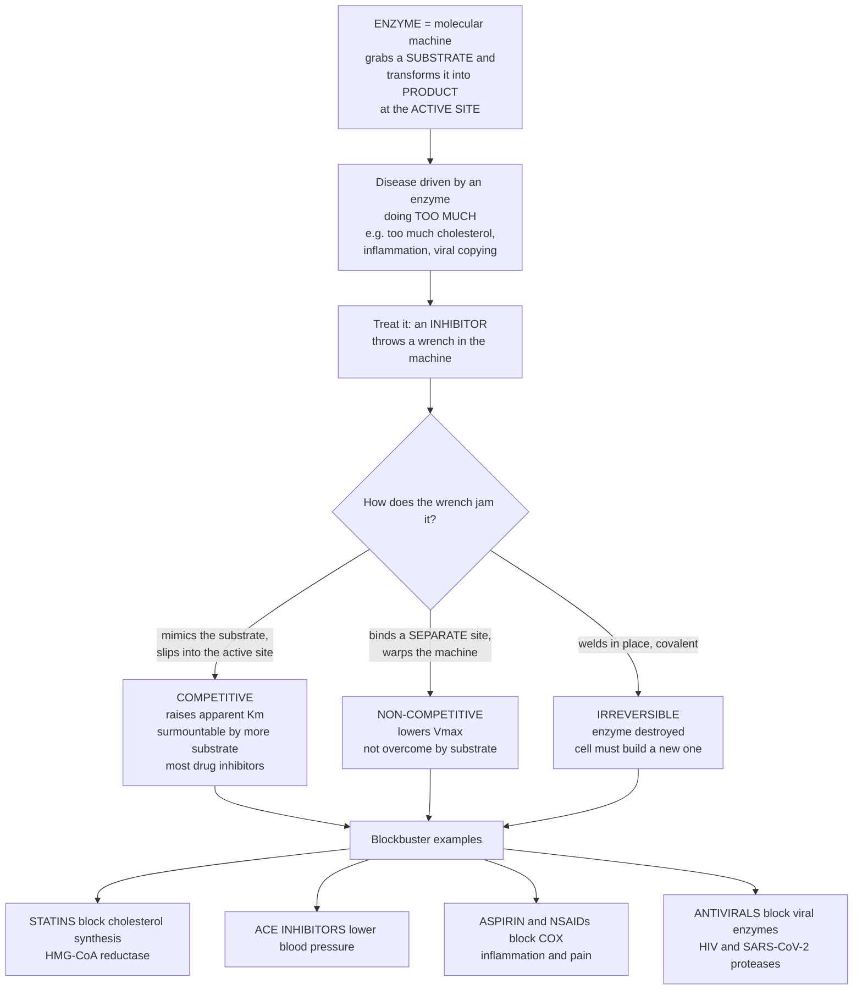

# 🔧 Enzymes as Drug Targets: Jamming the Body's Molecular Machines

> [!abstract] TL;DR
> **Enzymes are the body's molecular machines** — proteins that grab a specific molecule (the **substrate**) and chemically transform it, running nearly every reaction of life. They are a premier drug-target class for a simple reason: if a disease is driven by an enzyme doing **too much**, you can treat it by throwing a wrench into that machine — an **inhibitor** that jams the enzyme so it cannot do its job. The commonest trick is a molecule **shaped like the substrate** that slips into the enzyme's mouth (the **active site**) and sticks — a **competitive inhibitor**, like putting the wrong key in a lock and jamming it. Others bind a **different site** (non-competitive) or bind so tightly and covalently that they **never leave** (irreversible, like penicillin or aspirin). Medicine's biggest hits work this way: **statins** jam the enzyme that makes cholesterol, **ACE inhibitors** jam an enzyme in the blood-pressure system, **aspirin** jams the enzyme that makes pain-and-inflammation signals, **kinase inhibitors** jam cancer-driving enzymes, and many **antivirals** jam enzymes a virus needs to replicate. Enzyme kinetics (**Michaelis–Menten**, with **Vmax** and **Km**) plus the **types of inhibition** explain how each drug works — and why enzyme inhibitors are one of the largest, most successful drug classes ever made.

## Intuition — analogy first

Picture a factory full of tiny, single-purpose machines. Each machine grabs one specific part off a conveyor belt, snaps it into a new shape, and drops the finished piece back on the belt — over and over, thousands of times a second. That is an **enzyme**: a protein machine whose job is to take a **substrate** and turn it into a **product**. Digestion, making cholesterol, building signaling molecules, copying a virus's genome — all of it runs on machines like these.

Now suppose one machine is running **too fast** and it is hurting you. It is churning out cholesterol you don't need, or pumping out inflammation signals that scream pain, or copying a virus. How do you stop it? You **throw a wrench in the works**. In pharmacology the wrench is an **inhibitor** — a drug molecule that jams the machine so it cannot do its job.

The cleverest wrench is one **shaped exactly like the part the machine is looking for**. The machine's grabbing point — its **active site** — reaches out for what it thinks is a normal substrate, closes around the decoy, and gets **stuck**. This is a **competitive inhibitor**: it competes with the real substrate for the same "mouth," like sliding the wrong key into a lock and jamming it. Flood the belt with enough real parts and they can eventually crowd the decoy out — so this jam is *surmountable*.

Other wrenches don't go in the mouth at all. They clamp onto a **different spot** on the machine and warp its shape so it works poorly no matter how many parts you supply (**non-competitive**). And the most permanent wrenches **weld themselves in place** — the machine is destroyed and the cell must build a brand-new one from scratch (**irreversible**, the way **penicillin** permanently disables a bacterial enzyme or **aspirin** permanently tags the enzyme that makes pain signals). Because these machines drive so much of disease, and because their mouths are precise, druggable pockets, jamming the right one has produced some of the greatest drugs in medicine.

---

## How It Works

**Core mechanics.** (1) An enzyme **catalyzes** a reaction — it lowers the **activation energy** so a substrate is converted to product far faster than it would spontaneously, without the enzyme itself being consumed (see [[Chemical_Kinetics]]). (2) Catalysis happens in the **active site**, a precisely shaped pocket that binds the substrate and stabilizes the reaction's **transition state**. (3) A **drug inhibitor** interferes with this cycle. **Competitive** inhibitors resemble the substrate and occupy the active site, so more substrate can out-compete them (apparent **Km rises**, **Vmax unchanged**). **Non-competitive** inhibitors bind a separate site and lower the enzyme's turnover (**Vmax falls**, Km unchanged). **Irreversible** inhibitors bond covalently and permanently, so activity only returns when the cell **resynthesizes** fresh enzyme. (4) Inhibitor strength is quantified by **Ki** (the binding constant) and **IC50** (the concentration halving activity); tight, slow-releasing binders can act almost like irreversible drugs. (5) Picking an enzyme that is **central to a disease** — cholesterol synthesis, blood-pressure control, inflammation, cancer signaling, viral replication — and blocking it **selectively** (sparing the patient's own look-alike enzymes) is the whole game.



---

## Key Concepts / Details

### Secondary Level

- **Enzymes are protein machines.** Each one speeds up a specific chemical reaction in the body, turning a **substrate** into a **product** at a pocket called the **active site**. Life could not run at body temperature without them.
- **Why target enzymes?** If a disease happens because an enzyme is working **too hard**, you can help by **slowing that enzyme down**. The drug that does this is an **inhibitor** — a molecular wrench.
- **The lock-and-key jam.** The most common inhibitors look like the enzyme's normal partner. They slide into the active site and get stuck, so the real substrate can't get in. This is a **competitive** inhibitor.
- **Permanent jams.** Some drugs bond to the enzyme and never let go (**irreversible**). **Penicillin** permanently disables an enzyme bacteria need to build their walls; **aspirin** permanently tags the enzyme that makes pain-and-inflammation signals.
- **Famous examples.** **Statins** lower cholesterol by blocking the enzyme that makes it; **ACE inhibitors** lower blood pressure; many **HIV and COVID drugs** block enzymes the virus needs to copy itself. Enzyme inhibitors are one of the biggest, most successful families of medicines.

### Undergraduate Level

- **Enzyme kinetics recap (Michaelis–Menten).** Reaction rate rises with substrate then plateaus: $v = \dfrac{V_{max}[S]}{K_m + [S]}$. **Vmax** is the maximum turnover when the enzyme is saturated; **Km** is the substrate concentration giving half-maximal rate — a rough index of how tightly the enzyme grips its substrate. Inhibitors are read by *how they move Vmax and Km*. See [[Enzyme_Kinetics_and_Catalysis]] for the full derivation.
- **Reversible inhibition — three flavors:**
  - **Competitive** — inhibitor resembles the substrate and binds the **active site**. It raises the **apparent Km** (harder to reach half-max) but leaves **Vmax unchanged**, because a flood of substrate out-competes it. Most small-molecule drug inhibitors are competitive.
  - **Non-competitive / allosteric** — inhibitor binds a **separate site** and lowers **Vmax** (fewer functional machines) while Km is roughly unchanged; extra substrate cannot rescue it.
  - **Uncompetitive** — inhibitor binds only the **enzyme–substrate complex**, lowering **both** Vmax and Km in the same ratio (parallel lines on a double-reciprocal plot).
- **Irreversible inhibition.** The inhibitor forms a **covalent bond**, permanently inactivating the enzyme — activity returns only when the cell **resynthesizes** the protein (hours to days). Classic drugs: **aspirin** acetylates a serine in **COX**; **penicillin** acylates the bacterial **transpeptidase**; **proton-pump inhibitors** (omeprazole) covalently block the gastric H⁺/K⁺-ATPase.
- **Potency measures.** **IC50** = inhibitor concentration that halves enzyme activity under set conditions (assay-dependent). **Ki** = the true inhibition constant (the inhibitor's dissociation constant), a more fundamental affinity measure. Lower = more potent.
- **Major enzyme-inhibitor drug classes.**
  - **Statins** → **HMG-CoA reductase**, the rate-limiting step of cholesterol synthesis (cardiovascular prevention — see [[Cardiovascular_Pathophysiology]]).
  - **ACE inhibitors** ("-prils") → **angiotensin-converting enzyme**, lowering blood pressure by cutting angiotensin II.
  - **NSAIDs / aspirin** → **cyclooxygenase (COX-1/COX-2)**, reducing prostaglandins that drive inflammation, pain, and fever.
  - **Protease inhibitors** → viral proteases in **HIV** ("-navirs") and **SARS-CoV-2** (nirmatrelvir), blocking viral maturation.
  - **Kinase inhibitors** ("-tinibs") → oncogenic kinases such as **BCR-ABL** (imatinib) — a revolution in targeted cancer therapy.
  - **Metabolic enzymes** → **DPP-4** ("-gliptins") and metabolic pathways in diabetes; **xanthine oxidase** (allopurinol) in gout.
  - **Antimicrobial targets** → **dihydropteroate/dihydrofolate** enzymes of folate synthesis (sulfonamides, trimethoprim), a pathogen pathway humans lack.
- **Selectivity is everything.** A good drug hits the *disease* or *pathogen* enzyme while sparing the patient's own **homologous** enzymes. Bacteria and viruses offer enzymes with **no human counterpart** (folate synthesis, viral proteases) — a built-in safety margin.
- **Enzymes in drug handling.** Some drugs are **prodrugs** activated *by* enzymes (e.g., an esterase clips off a group to release the active drug), and metabolic enzymes (**CYP450**) are themselves **induced or inhibited** by drugs — a key source of drug–drug interactions (see [[Pharmacokinetics_ADME]]).

### Graduate Level

- **Transition-state analogs.** Enzymes bind the fleeting **transition state** far more tightly than the substrate, so molecules mimicking that geometry are exceptionally potent inhibitors. Statins and many antiviral/antihypertensive agents are, in part, transition-state mimics; the principle underlies rational inhibitor design (see [[Protein_Structure_and_Function]]).
- **Mechanism-based ("suicide") inhibitors.** These are unreactive until the target enzyme's own catalytic machinery converts them into a reactive species that then **covalently kills the enzyme** — exquisite selectivity, because only the intended enzyme performs the activating chemistry. Kinetics are captured by **k_inact** (maximal inactivation rate) and **KI** (the inactivator's binding constant); efficiency is the ratio **k_inact/KI**.
- **Cheng–Prusoff relationship.** IC50 depends on assay conditions; for a competitive inhibitor $K_i = \dfrac{IC_{50}}{1 + [S]/K_m}$. Reporting **Ki** (not raw IC50) lets potencies be compared across labs and substrate concentrations.
- **Tight-binding and slow-off kinetics.** When Ki approaches the enzyme concentration, classical Michaelis–Menten approximations break down (tight-binding regime). A drug's **residence time** (how long it stays bound, set by the off-rate k_off) can matter more than equilibrium affinity: a slowly dissociating inhibitor produces prolonged, near-irreversible pharmacodynamics even without a covalent bond.
- **Reversible vs covalent design trade-offs.** Covalent (irreversible) inhibitors give durable, resynthesis-limited action and can overcome resistance, but carry **off-target reactivity and haptenization** risks (immune sensitization, e.g., penicillin allergy). Modern "**targeted covalent inhibitors**" pair a weak reversible-binding scaffold with a mild warhead aimed at a specific nucleophile (e.g., ibrutinib on a BTK cysteine) to regain selectivity.
- **Structure-based design.** X-ray/cryo-EM structures of the enzyme–inhibitor complex drive **structure-based drug design and molecular docking**, optimizing shape and interactions in the active site; this is how many kinase and protease inhibitors were engineered.
- **Resistance.** Pathogens and tumors evolve **active-site mutations** that lower inhibitor affinity while preserving catalysis (HIV protease resistance; BCR-ABL gatekeeper T315I against imatinib), motivating next-generation inhibitors and combination therapy.
- **Allosteric and orthosteric strategies.** Beyond the active site, **allosteric inhibitors** exploit regulatory pockets for improved selectivity among closely related enzymes (e.g., allosteric kinase inhibitors), often with distinct resistance profiles.

---

## Python Demo

```python
# Enzymes as drug targets: how different inhibitors reshape enzyme kinetics.
#   (a) MICHAELIS-MENTEN with inhibition:  competitive raises apparent Km (Vmax kept),
#       non-competitive lowers Vmax (Km kept).
#   (b) LINEWEAVER-BURK (double-reciprocal): competitive lines meet on the y-axis,
#       non-competitive lines meet on the x-axis -- a diagnostic fingerprint.
#   (c) IC50 dose-inhibition curve: % activity vs log[inhibitor].
#   (d) IRREVERSIBLE inhibition: enzyme activity decays permanently over time.
import numpy as np
import matplotlib.pyplot as plt

# --- Base enzyme parameters ---------------------------------------------------
Vmax, Km, Ki = 100.0, 5.0, 5.0     # turnover units, mM, mM

def mm(S, Vmax, Km):
    return Vmax * S / (Km + S)

def competitive(S, I):             # apparent Km rises by (1 + I/Ki)
    return mm(S, Vmax, Km * (1 + I / Ki))

def noncompetitive(S, I):          # Vmax falls by (1 + I/Ki), Km unchanged
    return mm(S, Vmax / (1 + I / Ki), Km)

S = np.linspace(0.01, 60, 400)     # substrate concentration (mM)
I_dose = 10.0                      # inhibitor concentration (mM)

fig, ax = plt.subplots(2, 2, figsize=(13, 10))

# --- (a) Michaelis-Menten with inhibition ------------------------------------
ax[0, 0].plot(S, mm(S, Vmax, Km),          lw=2.4, color="#4a9eff", label="no inhibitor")
ax[0, 0].plot(S, competitive(S, I_dose),   lw=2.2, color="#51cf66", label="+ competitive (Km up)")
ax[0, 0].plot(S, noncompetitive(S, I_dose),lw=2.2, color="#ff6b6b", label="+ non-competitive (Vmax down)")
ax[0, 0].axhline(Vmax, ls=":", color="#4a9eff", lw=1)
ax[0, 0].text(42, Vmax + 1, "Vmax", color="#4a9eff", fontsize=9)
ax[0, 0].axhline(Vmax / (1 + I_dose / Ki), ls=":", color="#ff6b6b", lw=1)
ax[0, 0].set_xlabel("Substrate [S] (mM)"); ax[0, 0].set_ylabel("Reaction rate v")
ax[0, 0].set_title("(a) Michaelis-Menten: competitive vs non-competitive")
ax[0, 0].legend(fontsize=8); ax[0, 0].grid(alpha=0.3)

# --- (b) Lineweaver-Burk double-reciprocal -----------------------------------
Sp = np.linspace(2, 30, 200)       # positive S range for 1/S plot
inv_S = 1.0 / Sp
ax[0, 1].plot(inv_S, 1.0 / mm(Sp, Vmax, Km),           lw=2.2, color="#4a9eff", label="no inhibitor")
ax[0, 1].plot(inv_S, 1.0 / competitive(Sp, I_dose),    lw=2.2, color="#51cf66", label="competitive")
ax[0, 1].plot(inv_S, 1.0 / noncompetitive(Sp, I_dose), lw=2.2, color="#ff6b6b", label="non-competitive")
ax[0, 1].axhline(1 / Vmax, ls=":", color="#4a9eff", lw=1)
ax[0, 1].set_xlabel("1 / [S]"); ax[0, 1].set_ylabel("1 / v")
ax[0, 1].set_title("(b) Lineweaver-Burk: competitive meets on y-axis")
ax[0, 1].legend(fontsize=8); ax[0, 1].grid(alpha=0.3)

# --- (c) IC50 dose-inhibition curve ------------------------------------------
IC50, hill = 1.0, 1.0              # inhibitor concentration halving activity (uM)
I = np.logspace(-3, 3, 400)
activity = 100.0 / (1 + (I / IC50) ** hill)     # percent of uninhibited activity
ax[1, 0].plot(I, activity, lw=2.4, color="#7c3aed")
ax[1, 0].axhline(50, ls="--", color="gray", lw=1)
ax[1, 0].axvline(IC50, ls="--", color="gray", lw=1)
ax[1, 0].plot(IC50, 50, "o", color="#7c3aed", ms=8)
ax[1, 0].annotate("IC50 = 1 uM\n(50 percent activity)", xy=(IC50, 50),
                  xytext=(8, 66), fontsize=9, arrowprops=dict(arrowstyle="->"))
ax[1, 0].set_xscale("log")
ax[1, 0].set_xlabel("Inhibitor concentration (log scale)")
ax[1, 0].set_ylabel("Enzyme activity (percent of control)")
ax[1, 0].set_title("(c) Dose-inhibition curve: IC50 as potency")
ax[1, 0].grid(alpha=0.3)

# --- (d) Irreversible (covalent) inhibition over time ------------------------
# Constant inhibitor -> pseudo-first-order inactivation: E(t) = E0 * exp(-kobs * t)
# kobs = kinact * [I] / (KI + [I]).  Higher [I] -> faster, permanent loss.
t = np.linspace(0, 60, 400)        # minutes
kinact, KI, E0 = 0.15, 5.0, 100.0
for Idose, c in [(2, "#ffa94d"), (10, "#fa5252"), (40, "#c92a2a")]:
    kobs = kinact * Idose / (KI + Idose)
    ax[1, 1].plot(t, E0 * np.exp(-kobs * t), lw=2.2, color=c,
                  label=f"[I] = {Idose} mM  (kobs={kobs:.3f}/min)")
ax[1, 1].set_xlabel("Time (min)"); ax[1, 1].set_ylabel("Active enzyme remaining (percent)")
ax[1, 1].set_title("(d) Irreversible inhibition: activity lost permanently")
ax[1, 1].legend(fontsize=8); ax[1, 1].grid(alpha=0.3)

plt.tight_layout()
plt.savefig("enzyme_inhibition_kinetics.png", dpi=120)
plt.show()

# Takeaways:
#  - Competitive inhibitor: same Vmax ceiling, but you need MORE substrate (Km up).
#  - Non-competitive inhibitor: lower ceiling (Vmax down) that substrate cannot restore.
#  - Lineweaver-Burk turns these into a visual fingerprint (where the lines intersect).
#  - IC50 summarizes potency; irreversible drugs drop activity toward zero for good,
#    so recovery waits on the cell resynthesizing fresh enzyme.
```

Running this produces a 2x2 figure: panel (a) shows a **competitive** inhibitor pushing the Michaelis–Menten curve rightward while keeping the same Vmax ceiling, versus a **non-competitive** inhibitor crushing the Vmax ceiling; panel (b) recasts the same data as a **Lineweaver–Burk** plot where competitive lines share a y-intercept and non-competitive lines share an x-intercept; panel (c) is a sigmoidal **IC50 dose-inhibition** curve; panel (d) shows **irreversible** inhibition driving active enzyme toward zero, faster at higher inhibitor concentrations and never recovering.

---

## Real-World Applications

> **Example — statins (atorvastatin, rosuvastatin):** the cholesterol-lowering blockbuster class works by **competitively inhibiting HMG-CoA reductase**, the rate-limiting enzyme of cholesterol biosynthesis. The drug's decorated core is a **transition-state mimic** of HMG-CoA that binds the active site far more tightly than the natural substrate. Choking off hepatic cholesterol synthesis makes the liver pull LDL out of the blood, lowering heart-attack and stroke risk for hundreds of millions of people (see [[Cardiovascular_Pathophysiology]]).

- **ACE inhibitors (lisinopril, ramipril)** — competitively block **angiotensin-converting enzyme**, cutting production of the vasoconstrictor angiotensin II to lower blood pressure and protect the kidneys and heart.
- **Aspirin and NSAIDs** — aspirin is an **irreversible** inhibitor that **acetylates a serine** in cyclooxygenase (COX), permanently shutting down prostaglandin synthesis; because platelets cannot resynthesize COX, a single low dose suppresses clotting for the platelet's lifetime — the basis of low-dose aspirin cardioprotection.
- **HIV and COVID protease inhibitors** — HIV "-navirs" and SARS-CoV-2 **nirmatrelvir** block viral proteases the virus needs to cut its polyproteins into functional pieces; targeting a **viral** enzyme with no human counterpart gives selectivity.
- **Kinase inhibitors (imatinib and the "-tinibs")** — imatinib jams the **BCR-ABL** tyrosine kinase driving chronic myeloid leukemia, converting a fatal cancer into a manageable condition and launching the modern era of **targeted oncology**.
- **Proton-pump inhibitors (omeprazole)** — covalently, **irreversibly** inhibit the gastric H⁺/K⁺-ATPase, suppressing acid until new pumps are made — powerful, long-lasting relief for ulcers and reflux.
- **Antimicrobial enzyme targets** — **sulfonamides and trimethoprim** block bacterial **folate synthesis** enzymes (a pathway humans lack, obtaining folate from diet), a textbook example of selective toxicity; **penicillins** irreversibly inhibit bacterial cell-wall transpeptidases.
- **Gout and diabetes** — **allopurinol** inhibits **xanthine oxidase** to reduce uric acid; **gliptins** inhibit **DPP-4** to prolong incretin signaling and improve glucose control.

---

## Common Pitfalls

- **Confusing competitive with non-competitive by the wrong signature.** A **rightward shift with the same Vmax** is competitive (Km up, surmountable); a **lower Vmax** is non-competitive (insurmountable by substrate). Reading these backwards leads to wrong intuitions about whether raising substrate can overcome the drug in vivo.
- **Treating IC50 as a fixed constant.** IC50 depends on **substrate concentration and assay conditions** — for a competitive inhibitor it rises as [S] rises (Cheng–Prusoff). Compare **Ki**, not raw IC50, across studies.
- **Assuming reversible means weak and irreversible means strong.** A **slow-off reversible** inhibitor with long residence time can outperform a covalent drug, while some covalent drugs are cleared before they fully engage. Duration of effect depends on **kinetics and enzyme resynthesis**, not just binding label.
- **Ignoring host homologs (selectivity failure).** Blocking a disease enzyme that closely resembles a needed human enzyme causes toxicity. The best targets are **pathogen-specific** or disease-specific; always ask "what else does this inhibitor hit?"
- **Forgetting resistance and resynthesis.** For irreversible inhibitors, effect lasts only until the cell **makes new enzyme**; for pathogens/tumors, **active-site mutations** erode potency — which is why combinations and next-generation inhibitors exist.
- **Overlooking metabolic-enzyme interactions.** Many drugs **induce or inhibit CYP450** enzymes, silently changing the levels of *other* drugs. An enzyme inhibitor is not only acting on its intended target — see [[Pharmacokinetics_ADME]].
- **Assuming more inhibition is always better.** Fully shutting down an enzyme with essential housekeeping roles can be harmful; the therapeutic goal is often **partial, dose-controlled** inhibition sitting on the useful part of the dose–response curve.

---

## Related Concepts

- [[Enzyme_Kinetics_and_Catalysis]] — the Michaelis–Menten framework (Vmax, Km, catalysis, transition state) that this note perturbs; competitive, non-competitive, and uncompetitive inhibition are defined there and applied here to drugs.
- [[Enzymes_and_Catalysis]] — the biology of enzymes as catalysts, active sites, and activation-energy lowering — the machines that inhibitors jam.
- [[Chemical_Kinetics]] — reaction rates, activation energy, and catalysis in general chemistry; enzyme catalysis and inhibition are the biochemical specialization of these rate laws.
- [[Protein_Structure_and_Function]] — enzymes are proteins whose folded shape creates the active-site pocket; understanding structure is what makes structure-based inhibitor design and transition-state mimicry possible.
- [[Pharmacodynamics_Drug_Action]] — competitive vs non-competitive *inhibition* is the enzyme-world mirror of competitive vs non-competitive *antagonism*; IC50/Ki are the enzyme counterparts of EC50/Kd, and the saturating kinetics share the same math.
- [[Pharmacokinetics_ADME]] — metabolic enzymes (CYP450) are themselves induced or inhibited by drugs, and prodrugs are activated by enzymes — the pharmacokinetic flip side of enzymes as targets.
- [[Cardiovascular_Pathophysiology]] — the disease context for the two biggest enzyme-inhibitor classes: statins (HMG-CoA reductase) and ACE inhibitors (angiotensin-converting enzyme).

**Sibling notes in this section (Molecular Targets and Mechanisms):** this note sits alongside *Drug Targets and the Druggable Genome* (the map of what can be targeted), *Receptors and Signal Transduction as Targets* (the receptor half of the target universe), *Structure-Based Drug Design and Docking* (how enzyme inhibitors are engineered against active-site structures), *Anticancer and Immunomodulatory Drugs* (where kinase inhibitors live), and *Antimicrobial and Antiviral Agents* (folate-synthesis and viral-protease inhibitors). Together they show that most drugs act by engaging a defined molecular machine — and enzymes are among the most productive machines to jam.

---

## Review Questions

1. **(Secondary)** A patient's body is making too much of a molecule because one enzyme is overactive. Explain in plain terms how a drug could reduce that molecule, and why a molecule *shaped like the enzyme's normal substrate* is a good design for such a drug.
2. **(Undergraduate)** You test a candidate drug on an enzyme. Adding it shifts the Michaelis–Menten curve so that Km appears higher but Vmax is unchanged, and flooding the assay with substrate restores the original rate. Classify the inhibitor, predict what its Lineweaver–Burk plot looks like relative to the uninhibited enzyme, and name a real drug that works this way.
3. **(Undergraduate/Graduate)** Aspirin and a typical statin both inhibit an enzyme, but aspirin's effect on platelets lasts for days after the drug is cleared while a statin must be taken daily. Explain the mechanistic difference (reversible competitive vs irreversible covalent) and why enzyme *resynthesis* determines the duration of each effect.
4. **(Graduate)** A competitive inhibitor is reported with an IC50 of 40 nM measured at a substrate concentration equal to 3×Km. Using the Cheng–Prusoff relationship, estimate its Ki, and explain why reporting Ki rather than the raw IC50 matters when comparing inhibitors across laboratories.

---

## Sources

- Copeland RA. *Evaluation of Enzyme Inhibitors in Drug Discovery: A Guide for Medicinal Chemists and Pharmacologists.* Wiley. https://onlinelibrary.wiley.com/doi/book/10.1002/9781118540398
- Ritter JM, Flower R, Henderson G, et al. *Rang & Dale's Pharmacology* — "How Drugs Act: Molecular Aspects / Enzymes as targets." Elsevier. https://www.elsevier.com/books/rang-and-dales-pharmacology/ritter/978-0-7020-7448-6
- Katzung BG, Vanderah TW (eds). *Basic & Clinical Pharmacology.* McGraw Hill / AccessMedicine. https://accessmedicine.mhmedical.com/book.aspx?bookid=2988
- Robertson JG. "Enzymes as a special class of therapeutic target: clinical drugs and modes of action." *Current Opinion in Structural Biology* (2007). https://doi.org/10.1016/j.sbi.2007.09.003
- Cheng Y, Prusoff WH. "Relationship between the inhibition constant (Ki) and the concentration of inhibitor which causes 50 percent inhibition (IC50) of an enzymatic reaction." *Biochemical Pharmacology* (1973). https://doi.org/10.1016/0006-2952(73)90196-2

---

#pharmacology #enzyme-inhibitors #michaelis-menten #statins #kinase-inhibitors
