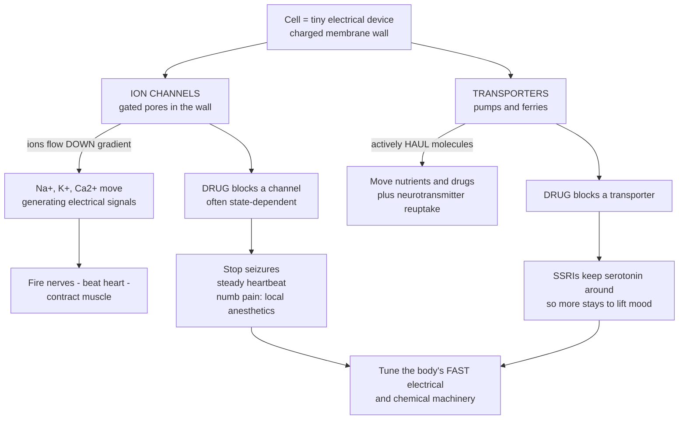

# ⚡ Ion Channels and Transporters as Targets

> [!abstract] TL;DR
> **Ion channels** are gated pores in the cell membrane that let charged ions (Na⁺, K⁺, Ca²⁺, Cl⁻) flow down their gradients, generating the **electrical signals** that fire nerves, beat the heart, and contract muscle. **Transporters** are the pumps and carriers that actively haul molecules across the membrane — including the ones that **vacuum neurotransmitters back up** after a signal. Both are premier drug targets because controlling the flow of ions or molecules controls the body's most vital fast machinery. **Block a channel** and you can stop a seizure, steady an arrhythmia, or numb pain — local anesthetics block the Na⁺ channels that carry pain signals, calcium-channel blockers lower blood pressure. **Block a transporter** and you leave more neurotransmitter in place — exactly how **SSRIs** (the most-prescribed antidepressants) work, by blocking the pump that removes serotonin. Many of these drugs act in a **state-dependent** way, preferentially hitting over-active tissue, which is why an antiarrhythmic or anticonvulsant can quiet a racing heart or seizing brain while leaving healthy tissue alone.

---

## Intuition — analogy first

Picture each cell as a **tiny electrical device** with a charged wall. Two kinds of hardware are drilled into that wall.

**Ion channels are the gates.** Each is a pore engineered to let one species of charged particle through — sodium, potassium, calcium, chloride — and only when the right signal arrives. When these gates snap open, ions rush down their gradients, and that surge of charge *is* the electrical signal: the nerve impulse, the heartbeat, the muscle twitch. A **voltage-gated** channel opens when the wall's voltage swings past a threshold; a **ligand-gated** channel opens when a messenger molecule plugs into it.

**Transporters are the pumps and ferries.** Where a channel is a gate that ions fall through, a transporter is a machine that *carries* cargo across the wall — often uphill, against the gradient, burning energy to do it. Some pump ions to reset the battery (the Na⁺/K⁺ pump). Others are ferries that shuttle nutrients, drugs, or — crucially — the **neurotransmitters vacuumed back up** out of a synapse after a signal has fired, so the cell can reload and fire again.

Now the pharmacology writes itself. **Jam a specific gate** and you shut down a specific electrical signal: block the Na⁺ channels that carry pain and you numb a tooth (local anesthetics); block the channels that let a seizure spread and you stop the seizure; block cardiac calcium channels and you calm an over-driven heart. **Jam a specific ferry** and cargo piles up where the ferry left it: block the pump that removes serotonin and more serotonin lingers in the synapse — which is how the most-prescribed antidepressants lift mood. The cleverest of these drugs are **state-dependent**: they preferentially grab gates that are *currently* firing, so they silence the racing, misfiring tissue while barely touching cells that are behaving. That single trick is why one pill can steady an arrhythmia or dampen a seizure without freezing the whole body.

---

## How It Works

**Core mechanics.**

1. **Channels make signals; transporters move mass.** A channel is a *passive* gated pore — when it opens, ions flow **down** their electrochemical gradient (no energy spent), and the ion current changes the membrane voltage. A transporter *actively or facilitatively* carries a solute, often **against** its gradient, powered directly by ATP (a "pump") or indirectly by riding another ion's gradient (a "cotransporter/exchanger").
2. **Channels are classified by their gate.** **Voltage-gated** channels (Naᵥ, Kᵥ, Caᵥ) open in response to membrane voltage and drive the action potentials of nerve, heart, and muscle. **Ligand-gated** channels (ionotropic receptors such as GABA-A and nicotinic) open when a neurotransmitter binds — these straddle the channel and receptor worlds.
3. **A channel drug is a blocker or a modulator.** It can physically plug the pore, or bind elsewhere and stabilize a shut/open conformation. The key subtlety is **state-dependent (use-dependent) block**: the drug binds far more tightly to channels that are *open* or *inactivated* than to *resting* ones. Because rapidly firing tissue spends more time in those bound-friendly states, the block **accumulates preferentially in over-active cells** — targeting the arrhythmic focus or the seizing neuron, sparing quiet tissue.
4. **A transporter drug usually inhibits the carrier.** Blocking a **reuptake transporter** leaves its cargo neurotransmitter in the synapse longer (SSRIs, SNRIs, stimulants). Blocking an **ion pump or cotransporter** changes the body's salt-and-water or ionic balance (diuretics, cardiac glycosides). Blocking an **efflux pump** (P-glycoprotein) changes where drugs can go.
5. **Selectivity across subtypes is the whole design problem.** There are ~9 Naᵥ subtypes, dozens of Kᵥ, several Caᵥ, and many transporter isoforms. A useful drug must hit the *right* subtype in the *right* tissue — the reason cryo-EM structures of channels and transporters have transformed rational drug design.



---

## Key Concepts / Details

### Secondary Level

- **A channel is a gate; a transporter is a pump/ferry.** Channels let ions slip through when open; transporters carry molecules across, often using energy.
- **Ions carry the body's electricity.** When sodium and calcium rush in or potassium rushes out, that moving charge *is* the nerve impulse, the heartbeat, and the muscle contraction.
- **Block a channel, stop a signal.** Local anesthetics block sodium channels so pain signals never leave the nerve — that is why a numbed tooth feels nothing. Other channel blockers stop seizures or steady an irregular heartbeat.
- **Block a transporter, pile up the cargo.** After a nerve signals with serotonin, a transporter normally sucks the serotonin back up. **SSRIs** block that pump, so more serotonin stays around — the basis of the most common antidepressants.
- **Why these matter.** Channels and transporters run the body's *fastest* and most vital systems — brain, heart, muscle, kidney — so drugs that tune them treat seizures, arrhythmias, pain, depression, high blood pressure, and diabetes.

### Undergraduate Level

- **Electrochemical driving force.** Ions flow through an open channel according to the difference between membrane voltage and the ion's **equilibrium (Nernst) potential**. Channel drugs work by reducing the number of conducting pores, blunting the current that would otherwise flow (the electrophysiology backdrop lives in the action-potential and resting-potential notes linked below).
- **Voltage-gated channel drug classes.**
  - **Local anesthetics** (lidocaine, bupivacaine) — bind the inner pore of **Naᵥ** channels, blocking the depolarizing current that propagates action potentials, so pain fibers stop conducting.
  - **Antiarrhythmics** — the **Vaughan Williams** scheme is literally a channel/receptor taxonomy: **Class I** = Naᵥ blockers, **Class II** = β-blockers, **Class III** = Kᵥ blockers (prolong repolarization), **Class IV** = Caᵥ blockers. They reshape the cardiac action potential to suppress abnormal rhythms.
  - **Anticonvulsants** — many (phenytoin, carbamazepine, lamotrigine) are **use-dependent Naᵥ** blockers; others (ethosuximide) block thalamic **T-type Caᵥ** channels to quiet absence seizures.
  - **Calcium-channel blockers** (amlodipine, verapamil, diltiazem) — block **L-type Caᵥ** in vascular smooth muscle and heart, relaxing arteries (lowering blood pressure) and reducing cardiac workload (angina).
  - **Sulfonylureas** (glipizide, glibenclamide) — block the pancreatic **K-ATP** channel, depolarizing the β-cell and triggering insulin release in type 2 diabetes.
- **State- and use-dependent block — the central idea.** A channel cycles through **resting → open → inactivated** states. Drugs like lidocaine and phenytoin bind the open/inactivated states with much higher affinity. Fast-firing tissue dwells longer in those states, so block builds up ("uses" accumulate) exactly where firing is pathologically fast — the mechanistic reason antiarrhythmics and anticonvulsants target over-excitable tissue while sparing normal cells.
- **Transporter drug classes.**
  - **Neurotransmitter reuptake transporters** — the largest CNS transporter target. **SSRIs** (fluoxetine, sertraline) block **SERT** (the serotonin transporter); **SNRIs** add **NET** (norepinephrine) block; **DAT** (dopamine transporter) is the site of stimulants (methylphenidate) and cocaine. Inhibition raises synaptic neurotransmitter and prolongs signaling.
  - **Ion pumps.** **Cardiac glycosides** (digoxin) inhibit the **Na⁺/K⁺-ATPase**, indirectly raising intracellular Ca²⁺ to strengthen cardiac contraction. **Proton-pump inhibitors** target the gastric **H⁺/K⁺-ATPase** (enzyme-like, but a membrane pump) to cut acid.
  - **Cotransporters / diuretics.** **Loop diuretics** (furosemide) block the renal **Na⁺/K⁺/2Cl⁻** cotransporter; **thiazides** block the **Na⁺/Cl⁻** cotransporter — both dump salt and water to treat hypertension and edema. **SGLT2 inhibitors** (empagliflozin) block glucose reabsorption in the kidney for diabetes.
  - **Efflux transporters.** **P-glycoprotein (P-gp)** pumps drugs out of cells; it limits absorption, guards the blood-brain barrier, and drives **multidrug resistance** in chemotherapy (a pharmacokinetic and oncology concern).
- **Channelopathies.** Inherited channel mutations (long-QT syndromes, epilepsies, some migraines) both *cause* disease and *validate* the channel as a target — the drug and the disease sit on the same protein.

### Graduate Level

- **The molecular architecture of gating.** Voltage-gated channels use an **S4 voltage-sensor** with gating charges that move through the field to open an activation gate; a separate **inactivation** particle (the Naᵥ "ball-and-chain"/IFM motif) occludes the pore milliseconds later. Drug-binding sites map onto these conformations — local anesthetics reach a pore-lining receptor accessible chiefly from the inactivated state, the structural basis of state-dependence.
- **The modulated-receptor hypothesis (Hille).** Drug affinity is a function of channel state: $K_D^{rest} \gg K_D^{open} \approx K_D^{inact}$. Because state occupancy depends on voltage and firing frequency, apparent potency rises with depolarization and stimulation rate — this **use-dependence** is quantifiable and is what distinguishes a clinically useful antiarrhythmic (e.g., lidocaine's fast on/off kinetics favor ischemic, depolarized tissue) from a proarrhythmic one.
- **Transport mechanism — alternating access.** Secondary-active transporters (SERT, NET, DAT; SGLT; NKCC) cycle between **outward-open** and **inward-open** conformations, coupling substrate movement to a co-substrate ion gradient (Na⁺, Cl⁻). Inhibitors act as **competitive substrates**, **conformation-trapping blockers**, or **allosteric modulators**; some (amphetamines) are **transported substrates that reverse flux**, causing efflux rather than simple blockade — a mechanistic distinction with large behavioral consequences.
- **Subtype selectivity as the design frontier.** The therapeutic index often hinges on isoform selectivity: **Naᵥ1.7/1.8** for pain versus **Naᵥ1.5** in the heart; **Caᵥ** L- versus T-type; **SERT** versus **NET/DAT**. Off-target channel binding is also a major safety liability — **hERG (Kᵥ11.1)** block prolongs the QT interval and can cause torsades de pointes, making hERG screening mandatory in modern drug development.
- **The cryo-EM revolution.** High-resolution structures of Naᵥ, Caᵥ, hERG, and neurotransmitter transporters (often with bound drugs) now enable genuinely **structure-based design** of subtype-selective and state-selective agents — a shift from empirical screening to rational engineering of the drug-channel interaction.
- **Pharmacokinetic reach of transporters.** Beyond being targets, uptake (**OATP, OCT**) and efflux (**P-gp, BCRP**) transporters govern absorption, tissue penetration, and elimination, generating a rich layer of **transporter-mediated drug-drug interactions** and contributing to acquired chemoresistance.

---

## Python Demo

```python
# Ion channels & transporters as drug targets — two mechanisms, side by side:
#  (a) CHANNEL BLOCK & EXCITABILITY: a Hodgkin-Huxley neuron fires a normal
#      action potential, but blocking its Na+ channels (local anesthetic /
#      antiarrhythmic) blunts or abolishes the spike.
#  (b) TRANSPORTER INHIBITION: reuptake normally clears a neurotransmitter;
#      an SSRI-like inhibitor lowers transporter Vmax, so extracellular
#      serotonin ACCUMULATES to a much higher plateau over time.
import numpy as np
import matplotlib.pyplot as plt

# ----------------------------------------------------------------------------
# (a) Hodgkin-Huxley single compartment: Na+ channel BLOCK blunts the AP
# ----------------------------------------------------------------------------
Cm = 1.0                       # membrane capacitance (uF/cm^2)
gNa, gK, gL = 120.0, 36.0, 0.3 # max conductances (mS/cm^2)
ENa, EK, EL = 50.0, -77.0, -54.4

def vtrap(x, y):               # safe x/(exp(x/y)-1), handles removable singularity
    return y if abs(x / y) < 1e-6 else x / (np.exp(x / y) - 1.0)

def rates(V):
    a_m = 0.1 * vtrap(-(V + 40.0), 10.0); b_m = 4.0 * np.exp(-(V + 65.0) / 18.0)
    a_h = 0.07 * np.exp(-(V + 65.0) / 20.0); b_h = 1.0 / (np.exp(-(V + 35.0) / 10.0) + 1.0)
    a_n = 0.01 * vtrap(-(V + 55.0), 10.0); b_n = 0.125 * np.exp(-(V + 65.0) / 80.0)
    return a_m, b_m, a_h, b_h, a_n, b_n

def simulate_ap(na_block=0.0, dt=0.01, T=45.0):
    """na_block = fraction of Na+ channels blocked (0 = normal, 1 = fully blocked)."""
    n_steps = int(T / dt)
    t = np.linspace(0, T, n_steps)
    V = -65.0
    a_m, b_m, a_h, b_h, a_n, b_n = rates(V)
    m, h, n = a_m/(a_m+b_m), a_h/(a_h+b_h), a_n/(a_n+b_n)   # steady-state gating
    Vs = np.empty(n_steps)
    gNa_eff = gNa * (1.0 - na_block)
    for i in range(n_steps):
        I_stim = 20.0 if 5.0 <= t[i] < 7.0 else 0.0         # brief suprathreshold pulse
        a_m, b_m, a_h, b_h, a_n, b_n = rates(V)
        m += dt * (a_m * (1 - m) - b_m * m)
        h += dt * (a_h * (1 - h) - b_h * h)
        n += dt * (a_n * (1 - n) - b_n * n)
        INa = gNa_eff * m**3 * h * (V - ENa)
        IK  = gK * n**4 * (V - EK)
        IL  = gL * (V - EL)
        V  += dt * (I_stim - INa - IK - IL) / Cm
        Vs[i] = V
    return t, Vs

t, V_normal  = simulate_ap(na_block=0.0)    # healthy nerve
_, V_partial = simulate_ap(na_block=0.50)   # partial block: raised threshold, smaller spike
_, V_blocked = simulate_ap(na_block=0.75)   # strong block: conduction silenced (anesthetic)

# ----------------------------------------------------------------------------
# (b) Transporter reuptake: SSRI lowers Vmax -> extracellular serotonin builds up
#     dS/dt = release - Vmax_eff * S / (Km + S)     (Michaelis-Menten clearance)
# ----------------------------------------------------------------------------
Km, Vmax, R = 0.05, 1.0, 0.15          # uM, uM/min, uM/min (tonic release)
def steady_state(vmax_eff):            # analytic plateau: R = Vmax*S/(Km+S)
    return R * Km / (vmax_eff - R)

S0 = steady_state(Vmax)                # start at the normal baseline
mins = np.linspace(0, 60, 1200); dt2 = mins[1] - mins[0]
def clear(vmax_eff):
    S = S0; out = np.empty_like(mins)
    for i in range(len(mins)):
        S += dt2 * (R - vmax_eff * S / (Km + S))
        out[i] = S
    return out

S_ctrl = clear(Vmax)                   # transporter intact
S_ssri = clear(Vmax * 0.25)            # 75% reuptake inhibition (SSRI)

# ----------------------------------------------------------------------------
# Plot
# ----------------------------------------------------------------------------
fig, (ax1, ax2) = plt.subplots(1, 2, figsize=(13, 5.2))

ax1.plot(t, V_normal,  color="#4a9eff", lw=2.2, label="normal nerve (fires)")
ax1.plot(t, V_partial, color="#f59f00", lw=2.0, label="50% Na+ block (blunted)")
ax1.plot(t, V_blocked, color="#fa5252", lw=2.0, label="75% Na+ block (silenced)")
ax1.axhline(-55, color="gray", ls=":", lw=1); ax1.text(30, -53, "~ firing threshold", fontsize=8, color="gray")
ax1.set_xlabel("time (ms)"); ax1.set_ylabel("membrane potential (mV)")
ax1.set_title("(a) Channel block blunts the action potential\n(local anesthetic / antiarrhythmic)")
ax1.legend(loc="upper right", fontsize=8); ax1.grid(alpha=0.3)

ax2.plot(mins, S_ctrl, color="#4a9eff", lw=2.2, label="transporter intact")
ax2.plot(mins, S_ssri, color="#51cf66", lw=2.2, label="+ SSRI (75% reuptake block)")
ax2.axhline(steady_state(Vmax*0.25), color="#51cf66", ls=":", lw=1)
ax2.set_xlabel("time (min)"); ax2.set_ylabel("extracellular serotonin (uM)")
ax2.set_title("(b) Transporter inhibition: neurotransmitter\naccumulates when reuptake is blocked")
ax2.legend(loc="right", fontsize=9); ax2.grid(alpha=0.3)

plt.tight_layout()
plt.savefig("ion_channels_and_transporters.png", dpi=120)
plt.show()

# Takeaways:
#  (a) Blocking Na+ channels removes the inward current that powers the upstroke:
#      a partial block blunts the spike (raised threshold, anticonvulsant flavor);
#      a strong block abolishes it entirely (local anesthetic silences conduction).
#  (b) Reuptake sets the synaptic neurotransmitter level. Cut transporter Vmax and
#      the same release rate now plateaus far higher — the core logic of SSRIs.
```

Running this produces two panels. The left shows a full Hodgkin-Huxley action potential in a healthy nerve, a blunted spike at 50% sodium-channel block, and a fully silenced membrane at 75% block — the electrophysiological signature of a local anesthetic or antiarrhythmic. The right shows extracellular serotonin holding a low baseline while the transporter is intact, then climbing to a several-fold-higher plateau once an SSRI-like inhibitor cuts reuptake capacity — the accumulation that underlies antidepressant action.

---

## Real-World Applications

> **Example — lidocaine, one drug across two organs:** as a **local anesthetic**, lidocaine blocks **Naᵥ** channels in sensory nerves, halting the propagation of pain action potentials so a laceration can be stitched painlessly. As a **Class Ib antiarrhythmic**, the *same* channel block — with fast, use-dependent kinetics that favor depolarized, ischemic myocardium — suppresses ventricular arrhythmias after a heart attack while sparing healthy cardiac tissue. One mechanism, two specialties, distinguished only by which Naᵥ subtype and tissue state the drug meets.

- **SSRIs / SNRIs (fluoxetine, sertraline, venlafaxine)** — block **SERT** (and, for SNRIs, **NET**), raising synaptic serotonin/norepinephrine; the most-prescribed drug class for depression and anxiety, and a direct real-world readout of transporter inhibition.
- **Calcium-channel blockers (amlodipine, verapamil)** — L-type **Caᵥ** block relaxes arterial smooth muscle and unloads the heart, treating **hypertension** and **angina**; dihydropyridines favor vessels, non-dihydropyridines favor the heart — a selectivity story.
- **Anticonvulsants (phenytoin, carbamazepine, lamotrigine)** — use-dependent **Naᵥ** block preferentially silences the high-frequency firing of a seizure focus, dampening **epilepsy** with relative sparing of normal neurons.
- **Loop and thiazide diuretics (furosemide, hydrochlorothiazide)** — block renal **Na⁺/K⁺/2Cl⁻** and **Na⁺/Cl⁻** cotransporters, excreting salt and water to treat **heart failure edema** and **hypertension**.
- **Digoxin** — inhibits cardiac **Na⁺/K⁺-ATPase**, raising intracellular Ca²⁺ to increase contractile force in some heart-failure and rate-control settings; its narrow therapeutic index makes it a classic monitoring case.
- **SGLT2 inhibitors and sulfonylureas** — SGLT2 blockers (empagliflozin) dump glucose in the urine, while sulfonylureas close the **K-ATP** channel to release insulin; two channel/transporter routes to lowering blood glucose in **diabetes**.
- **P-glycoprotein in oncology and pharmacokinetics** — tumor **P-gp** overexpression pumps chemotherapy out of cancer cells (**multidrug resistance**), and P-gp at the blood-brain barrier and gut wall shapes where drugs can reach.

---

## Common Pitfalls

- **Confusing a channel with a transporter.** A channel is a *gated pore* that lets ions fall down their gradient (fast, passive, no fuel); a transporter is a *carrier machine* that moves cargo, often uphill and energy-driven. Calling the Na⁺/K⁺ pump a "channel" (or a Na⁺ channel a "pump") inverts the mechanism.
- **Ignoring state-dependence.** Treating channel block as a fixed percentage misses the point: clinically useful antiarrhythmics and anticonvulsants bind *harder* to open/inactivated channels, so their effect grows with firing rate and depolarization. This is *why* they target sick tissue — and why steady-state assays can mislead.
- **Assuming reuptake block acts instantly.** Blocking SERT raises synaptic serotonin within hours, yet the **antidepressant benefit takes weeks** because downstream adaptations (receptor changes, plasticity), not the acute transporter block, drive the mood effect. The molecular target and the clinical timeline are decoupled.
- **Overlooking off-target channel binding — hERG.** A drug designed for another target can incidentally block the cardiac **hERG (Kᵥ11.1)** potassium channel, prolonging the QT interval and risking fatal arrhythmia. Failing to screen for hERG liability has withdrawn drugs from market.
- **Assuming subtype selectivity you do not have.** Naᵥ and Caᵥ come in many isoforms across pain fibers, heart, and brain; a "sodium-channel blocker" that also hits the cardiac **Naᵥ1.5** can be cardiotoxic. Selectivity, not mechanism alone, defines the therapeutic window.
- **Treating transporters only as targets, never as pharmacokinetic gatekeepers.** Uptake and efflux transporters (OATP, P-gp) control absorption, brain penetration, and clearance; ignoring them causes unexpected drug-drug interactions and resistance even when the intended target is elsewhere.

---

## Related Concepts

- [[Ion_Channels_and_Receptor_Pharmacology]] — the neuroscience companion detailing channel gating, ionotropic vs metabotropic receptors, and the agonist/antagonist/allosteric-modulator vocabulary this pharmacology note applies to channel drugs.
- [[Action_Potentials_and_Resting_Membrane_Potential]] — the electrophysiology that channel-blocking drugs act on: the Nernst driving force, threshold, and the Na⁺/K⁺ dynamics a local anesthetic or antiarrhythmic reshapes.
- [[Synaptic_Transmission_and_Neurotransmitters]] — shows the reuptake step in the synaptic cycle that SSRIs, SNRIs, and stimulants target by blocking neurotransmitter transporters.
- [[The_Cell_Membrane_and_Transport]] — the membrane-biology foundation: passive channels vs active pumps and cotransporters, the physical distinction underlying every drug here.
- [[Psychopharmacology_and_Drug_Mechanisms]] — the CNS drug-mechanism note where reuptake inhibition (SSRIs) and channel modulation converge on mood, anxiety, and seizure disorders.
- [[Heart_Failure_and_Arrhythmias]] — clinical target of antiarrhythmic channel classes, calcium-channel blockers, digoxin (Na⁺/K⁺-ATPase), and loop diuretics (NKCC cotransporter).
- [[Seizures_Headache_and_Neurological_Dysfunction]] — the seizure disorders that use-dependent Naᵥ and T-type Caᵥ blockers are designed to dampen.
- [[Pain_Pathophysiology_and_Management]] — nociceptive signaling that local anesthetics interrupt at the Naᵥ channels carrying pain impulses.
- [[Diabetes_Mellitus_and_Glucose_Regulation]] — glucose control via the K-ATP channel (sulfonylureas) and the renal SGLT2 transporter (gliflozins).

**Sibling notes in this section (prose, planned).** This note sits beside *Drug Targets and the Druggable Genome* (the map of what proteins can be drugged), *Receptors and Signal Transduction as Targets* (the receptor half of the target landscape, including the ionotropic receptors that overlap with channels here), *CNS and Psychopharmacology* (where SSRIs and channel-active anticonvulsants are deployed), *Autonomic and Cardiovascular Pharmacology* (calcium-channel blockers, antiarrhythmics, and diuretics in context), and *Analgesics, Anesthetics, and Anti-Inflammatory* (the local anesthetics whose Naᵥ block this note formalizes). Together they trace targets from the genome down to specific channels and pumps.

---

## Review Questions

1. **(Secondary)** A dentist injects a drug that blocks sodium channels in the nerves of your jaw, and the tooth goes numb. Using the idea of channels as "gates" for the body's electrical signals, explain why blocking these gates removes the feeling of pain. What general kind of drug is this?
2. **(Undergraduate)** SSRIs block the serotonin transporter within hours, yet a patient's depression often does not improve for several weeks. Distinguish between the drug's *immediate molecular action* on the transporter and the *clinical timeline*, and explain why the two do not coincide.
3. **(Undergraduate/Graduate)** An antiarrhythmic is described as producing "use-dependent" block that suppresses a racing, ischemic region of heart muscle while barely affecting normal tissue. Using the resting/open/inactivated states of a voltage-gated channel, explain how state-dependent binding achieves this selectivity for over-active tissue.
4. **(Graduate)** A candidate analgesic is designed to block the pain-associated Naᵥ1.7 channel, but late testing shows it also blocks the cardiac hERG potassium channel. Explain the twin selectivity problems this raises — one for efficacy across Naᵥ subtypes, one for safety (QT prolongation) — and how modern structure-based approaches (e.g., cryo-EM of channels with bound drug) address subtype- and state-selective design.

---

## Sources

- Ritter JM, Flower R, Henderson G, et al. *Rang & Dale's Pharmacology* — chapters on "Ion Channels as Drug Targets," "Transporters," and "Chemical Transmission and Drug Action." Elsevier. https://www.elsevier.com/books/rang-and-dales-pharmacology/ritter/978-0-7020-7448-6
- Katzung BG, Vanderah TW (eds). *Basic & Clinical Pharmacology* — "Introduction to Autonomic Pharmacology," "Antiarrhythmic Agents," "Local Anesthetics," and "Antidepressant Agents." McGraw Hill / AccessMedicine. https://accessmedicine.mhmedical.com/book.aspx?bookid=2988
- Hille B. *Ion Channels of Excitable Membranes* (3rd ed.) — channel gating, state-dependent (modulated-receptor) block, and local-anesthetic pharmacology. Sinauer/Oxford. https://global.oup.com/academic/product/ion-channels-of-excitable-membranes-9780878933211
- Brunton LL, Knollmann BC (eds). *Goodman & Gilman's The Pharmacological Basis of Therapeutics* — "Membrane Transporters and Drug Response," "Neurotransmission," and cardiac/anticonvulsant chapters. McGraw Hill. https://accessmedicine.mhmedical.com/book.aspx?bookid=2189
- Hodgkin AL, Huxley AF. "A quantitative description of membrane current and its application to conduction and excitation in nerve." *J Physiol* (1952). https://doi.org/10.1113/jphysiol.1952.sp004764

---

#pharmacology #ion-channels #transporters #SSRIs #local-anesthetics
