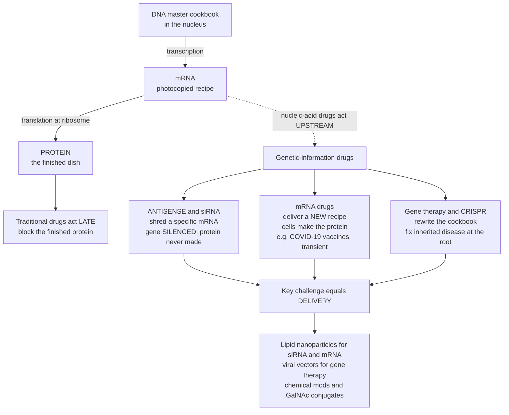

# 🧬 Nucleic Acid Therapeutics

> [!abstract] TL;DR
> **Nucleic-acid therapeutics drug the genetic code itself.** Traditional medicines act *late* — they interfere with **proteins**, the finished products of your genes, after those proteins have already been made. Nucleic-acid drugs intervene **upstream**, at the level of the genetic instructions (the central dogma **DNA → RNA → protein**). **Antisense oligonucleotides (ASOs)** and **small interfering RNA (siRNA)** *silence* a gene — they find and destroy (or block) the mRNA for a disease-causing protein so it is never made. **mRNA therapeutics** do the opposite — they deliver a *new recipe* so your own cells manufacture a desired protein (this is how the COVID-19 mRNA vaccines work: cells are handed the recipe for the virus's spike protein). **Gene therapy** and **genome editing (CRISPR)** go furthest — rewriting the cookbook to add, replace, or correct a gene and cure inherited disease at its root. Together these modalities let us "drug" targets once thought **undruggable** and pursue true **cures** — but the central challenge is **DELIVERY**: these large, charged, fragile molecules must be smuggled intact into the right cells, which is why **lipid nanoparticles (LNPs)** and **viral vectors** are as important as the drug sequence itself.

## Intuition — analogy first

Picture your **DNA as a master cookbook**, locked safely in the cell's library (the nucleus). To cook a dish, the cell doesn't drag out the master cookbook — it makes a **photocopy of a single recipe**. That photocopy is **messenger RNA (mRNA)**, carried out to the kitchen (the ribosome, the cell's protein factory), where it is read line-by-line to assemble the **finished dish: a protein**.

Almost every classical drug attacks the **finished dish**. A painkiller, a statin, a beta-blocker — each grabs a protein that has *already been cooked and served* and jams it. That works, but only if the protein happens to have a pocket a small molecule can grab, and only *after* the cell has spent all the effort making it.

Nucleic-acid drugs refuse to wait for the dish. They go into the kitchen and **act on the recipe**:

- **Antisense and siRNA drugs are shredders sent after one specific photocopy.** They carry the exact complementary text of a target recipe, so they zero in on that one mRNA among tens of thousands and either shred it or tape over the words so the ribosome can't read it. The disease protein is simply **never made** — the gene is **silenced**.
- **mRNA drugs do the opposite — they hand the kitchen a brand-new recipe.** Deliver an mRNA and the cell dutifully cooks whatever it says. Deliver the recipe for a virus's spike protein and the cell makes a harmless piece of the virus, so the immune system learns to recognise the real thing — that is exactly the **COVID-19 mRNA vaccine**. Because the photocopy wears out, the dish is cooked only **transiently**.
- **Gene therapy and CRISPR rewrite the cookbook itself.** Instead of intercepting recipes, they add a missing recipe page or correct a misspelled one in the master copy — a one-time fix that can **cure an inherited disease** at its source.

The catch runs through all of them: recipes and shredders are **fragile, bulky, electrically charged pieces of paper** that dissolve in the rain (blood enzymes) and can't climb the wall into the kitchen (the cell membrane). So the *envelope* matters as much as the letter. **Lipid nanoparticles** and **viral carriers** are the armoured couriers that get the message inside intact — which is why, in this field, **delivery is the whole game**.

---

## How It Works

**Core mechanics.** Nucleic-acid therapeutics all exploit **base-pairing** and the machinery of the **central dogma**, but they intervene at different points and in opposite directions.

1. **Sequence is the drug.** Because Watson–Crick base-pairing (A–U/T, G–C) is programmable, the *therapeutic* is just a sequence. To hit a new target you change the letters, not the whole chemistry — a radically fast design cycle compared with hunting for a small molecule that fits a protein pocket.
2. **Silencing (subtract a protein).** An **ASO** or a **siRNA** carries the complement of a target mRNA. The siRNA loads into the cell's **RISC** complex (with Argonaute) and directs cleavage of any mRNA it matches; a gapmer **ASO** recruits **RNase H** to chop the DNA–RNA hybrid; other ASOs simply block translation or **redirect splicing**. Net effect: the target protein's level **falls**.
3. **Expression (add a protein).** An **mRNA** drug is itself a translatable message. Once inside the cytosol the ribosome reads it and makes the encoded protein — a **vaccine antigen** or a **replacement protein**. Because mRNA is degraded over hours-to-days, the effect is a **transient pulse**.
4. **Rewriting (change the gene).** **Gene therapy** delivers a functional **gene** (a DNA cassette), usually via a **viral vector** such as **AAV** or **lentivirus**, adding a working copy. **Genome editing** (CRISPR-Cas plus base/prime editing) makes a **precise, permanent edit** to the DNA itself.
5. **The universal bottleneck — delivery.** Nucleic acids are large, poly-anionic, nuclease-sensitive, and cannot cross the lipid membrane unaided. Success hinges on **encapsulation** (LNPs), **viral packaging**, **chemical stabilisation** (2'-modifications, phosphorothioate backbones), and **targeting conjugates** (GalNAc for the liver) — plus surviving **endosomal escape** and avoiding **immunogenicity**.



---

## Key Concepts / Details

### Secondary Level

- **Old drugs vs new drugs.** Most medicines block a **protein** after it is made. Nucleic-acid drugs act **earlier**, on the **genetic instructions** (DNA and RNA) that tell cells which proteins to build.
- **Silencing a gene.** **Antisense** and **siRNA** drugs carry the mirror-image letters of a target message and destroy it, so the disease protein is **never produced** — like shredding a specific recipe before the meal is cooked.
- **Making a protein on demand.** **mRNA** drugs deliver a recipe so your own cells make a wanted protein. The **COVID-19 mRNA vaccines** work this way: they give cells the recipe for the virus's spike protein, and the immune system learns to fight it. The effect is **temporary** because the mRNA is used up.
- **Fixing the gene.** **Gene therapy** adds a healthy copy of a broken gene, and **CRISPR** edits the DNA directly — aiming to **cure** inherited diseases rather than just manage them.
- **The big problem is getting inside.** These molecules are fragile and can't easily enter cells, so they ride inside tiny **fat bubbles (lipid nanoparticles)** or harmless **viruses** that act as delivery trucks.

### Undergraduate Level

- **A new modality axis.** Small molecules and antibodies mostly target *proteins*. Nucleic-acid therapeutics target the **information flow** — enabling action against **undruggable** proteins (no ligand pocket, no surface epitope) by hitting their **mRNA or gene** instead.
- **Antisense oligonucleotides (ASOs).** Short (~15–25 nt) chemically modified single strands. Mechanisms: (1) **RNase H-mediated cleavage** by "gapmer" designs; (2) **steric block** of translation or of splice sites — **splice-switching ASOs** can restore functional protein. Example: **nusinersen (Spinraza)** shifts *SMN2* splicing to raise SMN protein in **spinal muscular atrophy (SMA)**.
- **RNA interference / siRNA.** Double-stranded ~21 nt RNA loaded into **RISC**; the guide strand directs **Argonaute-2** cleavage of complementary mRNA — potent, **catalytic** knockdown (one RISC destroys many mRNAs). Example: **patisiran (Onpattro)**, an **LNP-delivered** siRNA against transthyretin for hereditary **ATTR amyloidosis**; **inclisiran** (GalNAc-siRNA vs *PCSK9*) lowers LDL cholesterol with twice-yearly dosing.
- **mRNA therapeutics.** Synthetic, capped, poly-A-tailed mRNA with **modified nucleosides** (e.g., N1-methylpseudouridine) to dampen innate immune sensing and boost translation. Uses: **vaccines** (SARS-CoV-2 spike in the Pfizer/BioNTech and Moderna vaccines), **protein replacement**, and **in-vivo cell engineering**. Expression is **transient** by design.
- **Gene therapy.** Adds a functional gene via a **vector**. **AAV** (non-integrating, episomal, tissue-tropic serotypes) suits post-mitotic tissue — e.g., **voretigene neparvovec (Luxturna)** for *RPE65* retinal dystrophy, **onasemnogene abeparvovec (Zolgensma)** for SMA. **Lentivirus** integrates and suits *ex vivo* stem-cell therapies (e.g., some CAR-T and haemoglobinopathy products).
- **Genome editing.** **CRISPR-Cas9** makes a targeted double-strand break repaired by NHEJ (knockout) or HDR (correction); **base editors** and **prime editors** rewrite bases **without** a double-strand break. First approved CRISPR medicine: **Casgevy (exa-cel)** for sickle cell disease and β-thalassaemia.
- **Aptamers.** Folded oligonucleotides that bind a **protein** like an antibody (e.g., **pegaptanib** vs VEGF) — a nucleic-acid drug that acts on a protein target rather than on a nucleic-acid target.
- **Delivery vehicles.** **LNPs** (ionisable lipid + helper lipid + cholesterol + PEG-lipid) are the enabling breakthrough for siRNA and mRNA; **GalNAc conjugates** target hepatocytes via the ASGPR receptor; **viral capsids** define tropism for gene therapy. Chemical modifications (**phosphorothioate**, **2'-O-methyl / 2'-MOE / LNA**) resist nucleases and lengthen duration.

### Graduate Level

- **The delivery cascade and endosomal escape.** After uptake by endocytosis, the payload is trapped in an **endosome**; the rate-limiting step is **cytosolic escape**, and empirically **only ~1–2%** of endocytosed material reaches the cytosol even for optimised LNPs. **Ionisable lipids** are near-neutral at physiological pH (long circulation, low toxicity) but protonate in the acidifying endosome, destabilising the membrane to trigger release — the single most important design parameter.
- **Biodistribution and tropism engineering.** Naked systemic RNA is cleared renally and by nucleases within minutes. LNPs default to the **liver** (ApoE opsonisation → LDL-receptor uptake); **SORT lipids** and altered surface charge redirect them to lung or spleen. AAV tropism is tuned by **capsid engineering / directed evolution**; **pre-existing neutralising antibodies** to common AAV serotypes exclude many patients and block re-dosing.
- **Immunogenicity — friend and foe.** Unmodified RNA is sensed by **TLR7/8**, **RIG-I/MDA5**, and **PKR**. For **vaccines** this innate stimulation is an adjuvant asset; for **protein replacement** it is a liability, mitigated by **nucleoside modification** and 5' cap-1 structures. LNP components and PEG can drive **anti-PEG antibodies** and complement activation.
- **Durability and pharmacodynamics.** Effect duration is decoupled from plasma half-life. siRNA loaded into RISC can silence for **months** from a single dose (catalytic, long RISC residence); ASO effect tracks tissue depot and chemistry; mRNA gives a **days-long pulse**; AAV gene addition can persist for **years** in non-dividing cells but **dilutes** in proliferating tissue. This reframes PK/PD away from classic plasma-concentration models toward **tissue-level and molecular-level** kinetics.
- **Safety and off-target biology.** siRNA/ASO **seed-based off-target** silencing (miRNA-like partial matches), **hepatotoxicity** and **thrombocytopenia** signals for some chemistries, CRISPR **off-target edits** and **large deletions / chromothripsis**, AAV **insertional** and **dose-dependent innate/hepatic** toxicity, and the ethical bright line at **germline** editing. Manufacturing (plasmid, IVT, capsid production) and **cost** (multi-million-dollar one-time gene therapies) are first-order constraints, not footnotes.
- **Contrast with protein-targeting pharmacology.** Where [[Pharmacodynamics_Drug_Action]] describes affinity, efficacy, and the sigmoidal occupancy of a *protein* receptor, nucleic-acid drugs are graded instead by **knockdown depth**, **target engagement of an mRNA**, and **fraction of dose reaching the cytosol** — a different, delivery-dominated PD language.

---

## Python Demo

```python
# Nucleic acid therapeutics — two ideas at once:
# (a) SILENCE vs EXPRESS: an siRNA/ASO drug KNOCKS DOWN a protein (durable but
#     reversible dip), while an mRNA drug gives a TRANSIENT PULSE of expression.
# (b) The DELIVERY bottleneck: what fraction of an injected dose actually reaches
#     the cytosol of target cells, naked vs lipid-nanoparticle (LNP) encapsulated.
import numpy as np
import matplotlib.pyplot as plt

# ----------------------------------------------------------------------------
# (a) Silencing (subtract a protein) vs mRNA expression (add a protein, transient)
# ----------------------------------------------------------------------------
t = np.linspace(0, 40, 400)          # days after a single dose
baseline = 100.0                     # baseline target-protein level (arb. units)

# siRNA / ASO knockdown: effect ramps up as mRNA is destroyed, then slowly wanes
# as the drug clears. knockdown(t) = depth * (established) * (durability decay)
depth   = 0.85                        # maximum fractional knockdown (85%)
tau_on  = 3.0                         # days to establish silencing
tau_off = 30.0                        # slow recovery (durable RISC/ASO depot)
knockdown = depth * (1 - np.exp(-t / tau_on)) * np.exp(-t / tau_off)
silenced_protein = baseline * (1 - knockdown)

# mRNA drug: a transient pulse of a *therapeutic* protein (rise then decay)
tau_rise  = 0.8                       # translation ramps up over hours
tau_decay = 4.0                       # mRNA degrades over days -> pulse fades
pulse = np.exp(-t / tau_decay) - np.exp(-t / tau_rise)
mrna_protein = baseline + 130.0 * pulse / pulse.max()   # rises above baseline

fig, (ax1, ax2) = plt.subplots(1, 2, figsize=(13.5, 5.4))

ax1.axhline(baseline, color="gray", ls=":", lw=1.2, label="untreated baseline")
ax1.plot(t, silenced_protein, color="#e0555f", lw=2.6,
         label="siRNA / ASO — SILENCE (knockdown)")
ax1.plot(t, mrna_protein, color="#3f8ef2", lw=2.6,
         label="mRNA drug — EXPRESS (transient pulse)")
ax1.fill_between(t, baseline, silenced_protein, color="#e0555f", alpha=0.12)
ax1.fill_between(t, baseline, mrna_protein, where=(mrna_protein > baseline),
                 color="#3f8ef2", alpha=0.12)
ax1.annotate("disease protein\nnever made", xy=(9, silenced_protein.min() + 4),
             xytext=(15, 42), fontsize=9,
             arrowprops=dict(arrowstyle="->", color="#e0555f"))
ax1.annotate("transient burst\n(mRNA degrades)", xy=(5, mrna_protein.max() - 8),
             xytext=(16, 205), fontsize=9,
             arrowprops=dict(arrowstyle="->", color="#3f8ef2"))
ax1.set_xlabel("Days after a single dose")
ax1.set_ylabel("Target-protein level (arb. units)")
ax1.set_title("(a) Silence vs Express: opposite actions on protein level")
ax1.legend(loc="upper right", fontsize=9)
ax1.grid(alpha=0.3)

# ----------------------------------------------------------------------------
# (b) The delivery bottleneck — cumulative fraction of dose surviving each step
# ----------------------------------------------------------------------------
stages = ["Dose\ninjected", "Survive\nnucleases", "Reach target\ntissue",
          "Cellular\nuptake", "Endosomal\nescape", "Cytosol\n(active)"]

# per-step RETENTION fraction (naked RNA is crushed early; endosomal escape is
# the famous ~1-2% rate-limiting step even for good LNPs)
naked_ret = np.array([1.0, 0.02, 0.30, 0.08, 0.02, 1.0])   # dissolves fast
lnp_ret   = np.array([1.0, 0.90, 0.45, 0.55, 0.02, 1.0])   # protected + escapes

naked_cum = np.cumprod(naked_ret)
lnp_cum   = np.cumprod(lnp_ret)
x = np.arange(len(stages))

ax2.plot(x, naked_cum, "o-", color="#9aa0a6", lw=2.4, ms=8, label="naked RNA")
ax2.plot(x, lnp_cum, "o-", color="#2fae66", lw=2.6, ms=8,
         label="LNP-encapsulated RNA")
ax2.set_yscale("log")
ax2.set_xticks(x)
ax2.set_xticklabels(stages, fontsize=8)
ax2.set_ylabel("Cumulative fraction of dose (log scale)")
ax2.set_title("(b) The delivery bottleneck: LNPs raise cytosolic delivery ~1000x")
ax2.legend(loc="upper right", fontsize=9)
ax2.grid(alpha=0.3, which="both")

fold = lnp_cum[-1] / naked_cum[-1]
ax2.annotate(f"~{fold:,.0f}x more drug\nreaches the cytosol",
             xy=(5, lnp_cum[-1]), xytext=(2.3, lnp_cum[-1] * 12), fontsize=9,
             arrowprops=dict(arrowstyle="->", color="#2fae66"))

plt.tight_layout()
plt.savefig("nucleic_acid_therapeutics.png", dpi=120)
plt.show()

# Takeaways:
#  - Silencing SUBTRACTS a protein (durable-but-reversible knockdown);
#    an mRNA drug ADDS a protein as a TRANSIENT pulse -> opposite directions.
#  - Only a tiny fraction of naked RNA ever reaches the cytosol; encapsulation
#    (LNP) rescues delivery by orders of magnitude -> why the vehicle IS the drug.
```

Running this produces two panels. The **left** panel shows the two opposite actions on a target protein: an siRNA/ASO drug drives the level **down** into a durable-but-reversible knockdown (the disease protein is never made), while an mRNA drug drives a **transient pulse up** that fades as the mRNA degrades. The **right** panel walks a dose through the delivery cascade on a log scale: naked RNA is annihilated within the first steps, while LNP encapsulation carries roughly a **thousandfold** more drug to the cytosol — dramatising why the delivery vehicle is as important as the sequence.

---

## Real-World Applications

> **Example — the COVID-19 mRNA vaccines (Pfizer/BioNTech BNT162b2 and Moderna mRNA-1273):** the definitive proof-of-concept for the whole modality. Each dose is a **nucleoside-modified mRNA** encoding the SARS-CoV-2 **spike protein**, wrapped in a **lipid nanoparticle**. Injected muscle cells take up the LNP, the mRNA escapes the endosome, ribosomes translate spike, and the immune system learns to recognise it. The mRNA degrades within days — the effect is a transient instruction, not a permanent change — yet it trained durable immunity in billions of people and validated LNP delivery at planetary scale.

- **Patisiran (Onpattro) — LNP siRNA.** Silences hepatic **transthyretin (TTR)** to treat hereditary ATTR amyloidosis; the first approved RNAi drug (2018) and the clinical debut of systemic LNP-siRNA.
- **Inclisiran (Leqvio) — GalNAc-siRNA.** A GalNAc conjugate homes to hepatocytes to knock down **PCSK9**, lowering LDL cholesterol with **twice-yearly** dosing — showcasing conjugate targeting and RNAi durability.
- **Nusinersen (Spinraza) — splice-switching ASO.** Redirects *SMN2* splicing to restore SMN protein in **spinal muscular atrophy**, delivered intrathecally to reach motor neurons.
- **Zolgensma (onasemnogene abeparvovec) — AAV gene therapy.** A single IV dose delivers a functional *SMN1* gene via AAV9 to treat SMA in infants — a one-time genetic fix.
- **Luxturna (voretigene neparvovec) — AAV gene therapy.** Subretinal AAV2 delivering *RPE65* to treat an inherited retinal dystrophy, restoring functional vision in a previously untreatable blindness.
- **Casgevy (exa-cel) — CRISPR medicine.** *Ex vivo* CRISPR editing of patients' haematopoietic stem cells to reactivate fetal haemoglobin, curing sickle cell disease and β-thalassaemia — the first approved genome-editing therapy.

---

## Common Pitfalls

- **Confusing "silence" with "express."** ASOs/siRNA **subtract** a protein (knockdown); mRNA drugs **add** one. They are opposite tools for opposite problems — silencing a toxic gain-of-function protein vs supplying a missing one.
- **Assuming the effect is permanent.** Only **gene therapy and editing** aim to be durable/permanent. mRNA is a **transient pulse**; siRNA/ASO knockdown is durable but **reversible** and needs re-dosing. Treating an mRNA vaccine as "gene modification" is a category error — it never enters the nucleus or alters DNA.
- **Underestimating delivery.** A perfect sequence with no delivery is not a drug. The famous **~1–2% endosomal escape** means most of an injected dose never reaches its target compartment; the vehicle (LNP, capsid, conjugate) often decides success.
- **Ignoring biodistribution.** Systemic LNPs and GalNAc default to the **liver**; reaching lung, muscle, CNS, or tumour needs deliberate targeting. "It works in hepatocytes" does not generalise to other tissues.
- **Forgetting immunogenicity cuts both ways.** Innate RNA sensing is an **adjuvant** for vaccines but a **liability** for protein replacement; anti-AAV and anti-PEG antibodies can block dosing or **re-dosing** entirely.
- **Overlooking off-target and durability limits.** siRNA/ASO **seed-based** off-target silencing, CRISPR **off-target edits and large deletions**, and dilution of AAV episomes in **dividing** cells are real constraints — potency is necessary but not sufficient without specificity and persistence.
- **Treating cost and manufacturing as afterthoughts.** Multi-million-dollar one-time gene therapies and complex IVT/capsid manufacturing shape which diseases are addressable as much as the biology does.

---

## Related Concepts

- [[Nucleic_Acids]] — the chemistry of DNA and RNA (bases, backbone, base-pairing) is the literal substrate these drugs are built from; understanding the double helix and mRNA explains why sequence *is* the drug.
- [[Transcription_and_RNA_Processing]] — the DNA → RNA step and **splicing** are exactly where ASOs (splice-switching) and the mRNA-processing steps that mRNA drugs must recapitulate (cap, poly-A) come into play.
- [[Gene_Therapy_and_CRISPR]] — the deep dive on viral-vector gene addition and CRISPR/base/prime editing that underpins the "rewrite the cookbook" modalities summarised here.
- [[CRISPR_and_Genome_Editing]] — the molecular mechanism of guide-RNA-directed Cas cutting and precise editing that turns genome editing into a therapeutic modality.
- [[Vaccines_and_Antibiotics]] — situates mRNA **vaccines** within immunisation more broadly, contrasting the genetic-instruction approach with classical live/subunit vaccines.
- [[Nanomedicine_and_Drug_Delivery_Systems]] — the materials-science view of **lipid nanoparticles** and nanocarriers that solve the central delivery bottleneck for siRNA and mRNA drugs.
- [[Precision_Medicine_and_Genomics_in_the_Clinic]] — nucleic-acid drugs are a cornerstone of genomics-guided, patient-specific therapy, including individualised ASOs for ultra-rare mutations.
- [[Genetic_and_Congenital_Disease]] — the inherited disorders (SMA, retinal dystrophies, haemoglobinopathies, amyloidosis) whose root causes these modalities aim to silence, replace, or correct.
- [[Pharmacodynamics_Drug_Action]] — the classical protein-target framework (affinity, agonist/antagonist, sigmoidal occupancy) against which nucleic-acid drugs are the contrasting, information-level modality graded by knockdown and delivery.

**Sibling notes in this section (planned):** this note sits alongside *Drug Targets and the Druggable Genome* (which proteins/genes can be hit, and how nucleic acids expand the "druggable" universe to previously undruggable targets), *Antibodies and Biologics* (the other large-molecule modality — proteins that engage protein targets, complementary to nucleic acids that engage genetic information), *Routes of Administration and Drug Delivery* (the systemic delivery, formulation, and targeting principles that the LNP/viral-vector challenge is a special case of), *Pharmacogenomics and Personalized Dosing* (matching genetic medicines to individual genotypes), and *The Reach and Future of Pharmacology* (where genetic medicines point the field). Together they map the modern modality landscape beyond small molecules.

---

## Review Questions

1. **(Secondary)** A disease is caused by a cell making too much of a harmful protein. Would you reach for an **siRNA/antisense** drug or an **mRNA** drug, and why? Now suppose the disease is caused by a *missing* protein instead — which approach fits, and how does it work?
2. **(Undergraduate)** The COVID-19 mRNA vaccines are sometimes wrongly described as "changing your DNA." Using the central dogma, explain precisely where an mRNA drug acts, why its effect is **transient**, and why it does not alter the genome — contrasting it with an AAV gene therapy.
3. **(Undergraduate/Graduate)** Two candidate RNA drugs have excellent target sequences but fail in animals. One is degraded within minutes of injection; the other is taken up by cells but shows almost no activity. Map each failure onto a specific step of the **delivery cascade** and name a fix (chemical modification, LNP formulation, endosomal-escape lipid, or targeting conjugate) for each.
4. **(Graduate)** Endosomal escape is often quoted at ~1–2% even for optimised LNPs, yet siRNA drugs can silence a target for months from a single dose. Reconcile these facts: explain how **ionisable-lipid** design addresses escape and how the **catalytic** nature of RISC and long intracellular residence decouple pharmacodynamic **duration** from plasma half-life and from delivery efficiency.

---

## Sources

- Crooke ST (ed). *Antisense Drug Technology: Principles, Strategies, and Applications.* CRC Press. https://www.routledge.com/Antisense-Drug-Technology-Principles-Strategies-and-Applications/Crooke/p/book/9780849387968
- Setten RL, Rossi JJ, Han S. "The current state and future directions of RNAi-based therapeutics." *Nature Reviews Drug Discovery* 18, 421–446 (2019). https://www.nature.com/articles/s41573-019-0017-4
- Dunbar CE, High KA, Joung JK, Kohn DB, Ozawa K, Sadelain M. "Gene therapy comes of age." *Science* 359, eaan4672 (2018). https://www.science.org/doi/10.1126/science.aan4672
- Hou X, Zaks T, Langer R, Dong Y. "Lipid nanoparticles for mRNA delivery." *Nature Reviews Materials* 6, 1078–1094 (2021). https://www.nature.com/articles/s41578-021-00358-0
- Kulkarni JA, Witzigmann D, Thomson SB, et al. "The current landscape of nucleic acid therapeutics." *Nature Nanotechnology* 16, 630–643 (2021). https://www.nature.com/articles/s41565-021-00898-0

---

#pharmacology #nucleic-acid-therapeutics #siRNA #mRNA-vaccines #gene-therapy
