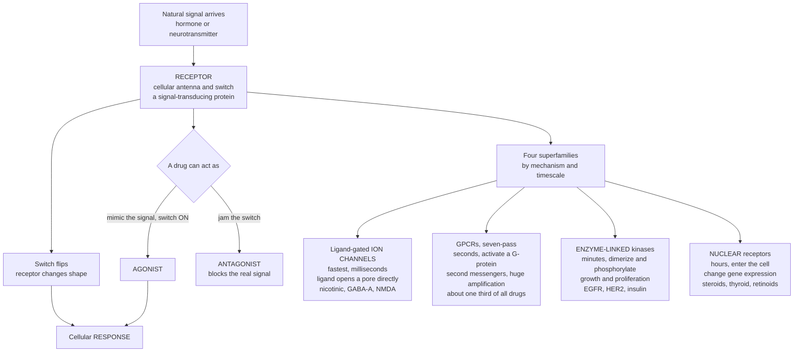

# 📡 Receptors and Signal Transduction as Targets

> [!abstract] TL;DR
> **Receptors are the body's antennas and switches** — proteins that catch a chemical signal (a hormone, a neurotransmitter) and flip a switch that changes what a cell does. They are the single most important class of **drug targets** because so much of the body's control runs through them, and because a drug can either **mimic** the natural signal (an **agonist**, switching the receptor **on**) or **block** it (an **antagonist**, jamming the switch). Receptors sort into **four superfamilies** by mechanism and speed: **ligand-gated ion channels** (fastest — milliseconds — the ligand opens a pore directly), **G-protein-coupled receptors** (**GPCRs** — the largest family and the target of roughly **one third of all drugs** — seven-transmembrane switches that activate internal messengers with enormous **amplification**, on the order of seconds), **enzyme-linked receptors** (receptor tyrosine kinases — minutes — driving growth and cancer signaling), and **nuclear receptors** (slowest — hours — lipophilic ligands like steroids that change **gene expression**). Understanding these switches — how they are built, how they signal, and how drugs turn them on or off — explains a colossal fraction of all medicines, from beta-blockers to antihistamines to opioids to steroids to kinase-inhibitor cancer drugs.

## Intuition — analogy first

Picture every cell as a tiny device studded with **antennas and switches**. The antennas are **receptors** — special proteins that sit on the cell surface (or float inside) doing nothing but *waiting* for a specific chemical to arrive. When the right molecule shows up — a hormone travelling through the blood, a neurotransmitter squirted across a synapse — it docks into its matching receptor and **flips a switch**. The switch flipping is what changes the cell's behaviour: a heart-muscle cell beats faster, a gland releases fluid, a nerve fires.

Because so much of the body is controlled through these switches, they are the natural place for a drug to intervene. A drug can do one of two opposite things. It can be a copy of the natural key that **fits and turns the switch on** — an **agonist** — making the cell behave as if the real signal had arrived. Or it can be a dud key that **fits the keyhole but refuses to turn**, sitting there so the *real* signal can no longer get in — an **antagonist**. Beta-blockers, antihistamines, and opioid-overdose reversers all work by blocking; adrenaline-mimicking asthma inhalers and steroids work by mimicking.

The most famous switch family is the **GPCRs** — a huge set of receptors that snake through the cell membrane **seven times** and, when triggered, wake up internal messenger molecules that **amplify** the signal enormously. One activated receptor can set off *thousands* of downstream events, which is why a tiny dose of drug can produce a big effect. Other receptor types trade amplification for speed or reach: **ion-channel receptors** are hair-trigger fast — the ligand instantly opens a pore and ions flood through in milliseconds — while **nuclear receptors** are slow but profound, travelling into the cell's nucleus to change *which genes are switched on*, which is why steroid effects build over hours to days rather than seconds. Same idea everywhere: catch a signal, flip a switch. The whole art is knowing which switch, and whether to press it or block it.

---

## How It Works

**Core mechanics.** (1) A signalling molecule — endogenous (hormone, neurotransmitter) or a drug — **binds** a receptor with characteristic **affinity**. (2) Binding drives the receptor to **change shape**, converting the outside chemical event into an inside biochemical one — this is **signal transduction**. (3) The activated receptor launches a **downstream cascade** that, for most receptor classes, **amplifies** one faint binding event into a large cellular response. (4) The *kind* of transducer sets the **timescale**: a directly-gated **ion pore** responds in milliseconds; a **G-protein / second-messenger** relay in seconds; a **kinase phosphorylation** cascade in minutes; a **gene-expression** program in hours. (5) A drug engages the same machinery as an **agonist** (stabilises the active shape) or an **antagonist** (occupies without activating), and sustained activation triggers **desensitisation and downregulation** — the molecular root of tolerance.



---

## Key Concepts / Details

### Secondary Level

- **A receptor is a switch.** It is a protein that catches a specific chemical signal and, in response, changes what the cell does. The signal is usually a **hormone** or a **neurotransmitter** — the body's own messengers.
- **Drugs mimic or block.** An **agonist** copies the natural signal and turns the switch **on**; an **antagonist** plugs the receptor so the real signal can't act. Its effect is the *absence* of a response the body would otherwise make.
- **Receptors are the top drug target.** More medicines act on receptors than on anything else. One family alone — the **GPCRs** — is targeted by roughly **one third of all drugs**.
- **Amplification means small doses, big effects.** One switched-on receptor can trigger thousands of downstream molecules, so a tiny amount of drug can produce a large response.
- **Different switches work at different speeds.** **Ion-channel receptors** are the fastest (milliseconds — think a nerve firing); **nuclear receptors** are the slowest (hours — think a steroid's gradual build-up), because they change genes rather than flip an immediate pore.

### Undergraduate Level

The receptor world sorts cleanly into **four superfamilies**, ordered here from fastest to slowest:

- **(1) Ligand-gated ion channels (ionotropic receptors) — milliseconds.** The receptor *is* the ion pore. Ligand binding directly pops the channel open, letting ions rush through and instantly changing the cell's electrical state. Examples: the **nicotinic acetylcholine** receptor (neuromuscular junction), the **GABA-A** receptor (the target of **benzodiazepines** and many general anaesthetics), and the **NMDA/glutamate** receptor. Speed is the whole point — this is how nervous-system signalling happens in real time.
- **(2) G-protein-coupled receptors (GPCRs / metabotropic) — seconds.** The largest receptor family and **~1/3 of all drug targets**. A single polypeptide crosses the membrane **seven times** (seven-transmembrane, "7TM"). Ligand binding on the outside changes the receptor's shape, activating an intracellular **G-protein**, which then switches on effector enzymes producing **second messengers** — **cAMP** (via adenylyl cyclase), **IP₃ and Ca²⁺**, and **DAG** (via phospholipase C). Because one receptor activates many G-proteins and each effector makes many messenger molecules, the signal is **hugely amplified**. Drug-rich GPCR examples: **adrenergic** (beta-blockers, beta-agonists), **muscarinic**, **histamine**, **opioid**, **dopamine**, and **serotonin** receptors.
- **(3) Enzyme-linked receptors (chiefly receptor tyrosine kinases, RTKs) — minutes.** Ligand binding brings two receptor molecules together (**dimerisation**), switching on the receptor's own intrinsic **kinase**, which **phosphorylates** tyrosines and ignites cascades such as **MAPK** and **PI3K/AKT** that drive **growth and proliferation**. These are central **cancer** targets (**EGFR**, **HER2**) and include the **insulin** receptor.
- **(4) Nuclear / intracellular receptors — hours.** Their ligands are **lipophilic** — **steroids** (cortisol, sex hormones), **thyroid hormone**, **retinoids**, **vitamin D** — small enough to cross the membrane and bind a receptor *inside* the cell. The ligand-bound receptor becomes a **transcription factor**, entering the nucleus to switch specific **genes** on or off. Because the response requires making new mRNA and protein, effects are **delayed but sustained** — the reason steroid therapy builds over hours to days.

Cross-cutting principles:

- **Signal transduction and amplification.** Transduction is the conversion of an extracellular chemical event into an intracellular one; the **cascade** downstream is what magnifies it. High amplification is why **low receptor occupancy** (and low drug dose) can still yield a maximal effect — the basis of **spare receptors** and high **potency**.
- **Desensitisation and downregulation.** Persistent agonist exposure causes receptors to be phosphorylated, uncoupled, internalised, and reduced in number, blunting the response over time. This receptor-level adaptation is a major molecular cause of **tolerance** (rapid loss over minutes is **tachyphylaxis**).
- **Subtype selectivity is the key to targeting.** Most receptors come in **subtypes** with different tissue distributions — e.g. **β1** (heart) vs **β2** (airway) adrenoceptors. A drug that discriminates between subtypes gets the wanted effect with fewer off-target ones (a **β1-selective** blocker spares the airways).

### Graduate Level

- **Biased agonism (functional selectivity).** A single GPCR couples to more than one transducer — classically the **G-protein** pathway and the **β-arrestin** pathway. A **biased ligand** stabilises a conformation that favours *one* route, offering the tantalising prospect of keeping therapeutic signalling while dropping adverse signalling (e.g. attempts to separate opioid analgesia from respiratory depression, as with oliceridine).
- **Allosteric modulation.** Beyond the orthosteric (natural-ligand) site, receptors have **allosteric** sites where **PAMs** (positive) and **NAMs** (negative) tune the response without directly activating the receptor. Allosteric drugs bring a **saturable ceiling**, **cooperativity**, and **probe dependence** — properties that give a cleaner safety profile than direct agonism. **Benzodiazepines** on GABA-A are the textbook PAM.
- **Conformational ensembles and constitutive activity.** Receptors are not simple on/off toggles but interconvert among an ensemble of states, some active even without ligand (**constitutive activity**). **Agonists** shift the equilibrium toward active states, **inverse agonists** toward inactive ones, **neutral antagonists** bind without shifting it — the two-state / ternary-complex view that unifies the efficacy spectrum.
- **Structure-based receptor drug design.** The revolution in **GPCR crystallography and cryo-EM** — beginning with rhodopsin and the **β2-adrenoceptor** (Kobilka) — turned receptors into concrete 3-D design targets. Knowing the atomic shape of the binding pocket enables rational tuning of affinity, subtype selectivity, and signalling bias. The 2012 Nobel Prize (Lefkowitz & Kobilka) recognised exactly this GPCR work.
- **Kinetics beyond affinity.** Clinical behaviour often tracks **binding kinetics** — association/dissociation rates and **residence time** — more faithfully than equilibrium affinity, shaping duration of action and the surmountability of antagonism.
- **RTK targeting and resistance.** Enzyme-linked receptors are drugged both **extracellularly** (monoclonal antibodies like trastuzumab against HER2) and **intracellularly** (small-molecule kinase inhibitors against the ATP pocket). Acquired **resistance mutations** in the kinase domain (e.g. EGFR T790M) drive successive drug generations — a defining feature of receptor-targeted oncology.
- **From amplification to the operational model.** Receptor reserve and the gain of the transduction cascade are what let a high-efficacy agonist reach maximal effect at fractional occupancy, formally captured by the transduction coefficient of the operational model — the quantitative bridge between receptor mechanism and observed potency.

---

## Python Demo

```python
# Receptors and signal transduction:
#  (a) SIGNAL AMPLIFICATION CASCADE  -- one activated receptor -> many G-proteins
#      -> many second-messenger molecules -> ... -> a large cellular response
#      (why tiny doses have big effects: high potency and spare receptors).
#  (b) RECEPTOR-TYPE TIMESCALES      -- the four superfamilies act on wildly
#      different clocks: ion channels (ms) -> GPCRs (s) -> kinases (min) -> nuclear (h).
import numpy as np
import matplotlib.pyplot as plt

fig, (ax1, ax2) = plt.subplots(1, 2, figsize=(13, 5.2))

# ---- (a) AMPLIFICATION CASCADE ----------------------------------------------
# Each stage multiplies the molecule count by a per-stage gain (illustrative).
stages = ["Bound\nreceptor", "Active\nG-protein", "Active\nadenylyl\ncyclase",
          "cAMP", "Active\nPKA", "Phosphorylated\ntargets"]
gain   = [1, 20, 5, 400, 8, 15]            # amplification at each successive step
counts = np.cumprod(gain).astype(float)    # cumulative molecules relative to 1 receptor

bars = ax1.bar(range(len(stages)), counts,
               color=["#4a9eff", "#51cf66", "#51cf66", "#ffa94d", "#ff6b6b", "#ff6b6b"])
ax1.set_yscale("log")
ax1.set_xticks(range(len(stages)))
ax1.set_xticklabels(stages, fontsize=8)
ax1.set_ylabel("Molecules produced (log scale, per 1 receptor)")
ax1.set_title("(a) GPCR signal AMPLIFICATION cascade")
ax1.grid(axis="y", alpha=0.3)
for x, y in zip(range(len(stages)), counts):
    ax1.text(x, y * 1.4, f"{y:,.0f}", ha="center", fontsize=8)
ax1.annotate("one receptor -> millions of\ndownstream molecules\n= high potency, spare receptors",
             xy=(5, counts[-1]), xytext=(0.4, counts[-1] * 0.02),
             fontsize=8, arrowprops=dict(arrowstyle="->"))

# ---- (b) RECEPTOR-TYPE TIMESCALES -------------------------------------------
rtypes = ["Ligand-gated\nion channel", "GPCR\n(G-protein / 2nd msg)",
          "Enzyme-linked\nkinase (RTK)", "Nuclear receptor\n(gene expression)"]
t_sec  = np.array([1e-3, 1.0, 60.0, 3600.0])   # ms, s, min, hour
colors = ["#4a9eff", "#51cf66", "#ffa94d", "#ff6b6b"]
labels = ["~1 ms", "~1 s", "~1 min", "~1 hour"]

ax2.barh(range(len(rtypes)), t_sec, color=colors)
ax2.set_xscale("log")
ax2.set_yticks(range(len(rtypes)))
ax2.set_yticklabels(rtypes, fontsize=9)
ax2.invert_yaxis()                              # fastest at the top
ax2.set_xlabel("Response timescale (seconds, log scale)")
ax2.set_title("(b) Four superfamilies act on different clocks")
ax2.grid(axis="x", alpha=0.3)
for i, (t, lab) in enumerate(zip(t_sec, labels)):
    ax2.text(t * 1.5, i, lab, va="center", fontsize=9)

plt.tight_layout()
plt.savefig("receptors_signal_transduction.png", dpi=120)
plt.show()

# Takeaways:
#  - Amplification spans ~6 orders of magnitude: a single activated receptor
#    yields millions of downstream molecules -> why low occupancy suffices (potency).
#  - The four receptor superfamilies differ in speed by ~6 orders of magnitude too
#    (milliseconds to hours) -- the mechanistic reason steroid effects lag while
#    a nerve's ion-channel response is essentially instantaneous.
```

Running this produces two panels. The left panel walks a GPCR (Gs → cAMP → PKA) cascade and shows the molecule count climbing across roughly six orders of magnitude on a log axis — a single bound receptor becomes millions of phosphorylated targets, the mechanistic reason a small dose (low occupancy) can drive a maximal response. The right panel lines up the four superfamilies on a log time axis, making vivid that ion-channel receptors respond in milliseconds while nuclear receptors take hours because they must remodel gene expression.

---

## Real-World Applications

> **Example — beta-blockers on a GPCR (metoprolol, propranolol):** β-adrenoceptors are **GPCRs**. Beta-blockers are **antagonists** that occupy adrenaline's receptor without turning it on, shielding the heart from sympathetic drive. **Subtype selectivity** is decisive: **β1-selective** metoprolol acts mainly on the heart and largely spares the **β2** receptors of the airway, whereas non-selective propranolol can provoke bronchospasm in asthmatics — a direct clinical payoff of receptor-subtype targeting.

- **Antihistamines (loratadine, cetirizine)** — **H1 GPCR** antagonists/inverse agonists that block histamine's inflammatory signalling in allergy.
- **Opioids (morphine, fentanyl)** — **μ-opioid GPCR** agonists for analgesia; the effort to build **biased agonists** favouring G-protein over β-arrestin signalling is a live attempt to separate pain relief from respiratory depression.
- **Benzodiazepines (diazepam, lorazepam)** — **positive allosteric modulators** of the **GABA-A** ligand-gated ion channel; they don't open the pore themselves but amplify GABA's fast inhibitory current — a textbook allosteric, ionotropic mechanism.
- **β2-agonist inhalers (salbutamol/albuterol)** — GPCR **agonists** that mimic adrenaline to relax airway smooth muscle; chronic overuse causes **receptor downregulation** and tolerance.
- **Corticosteroids (dexamethasone, prednisolone)** — **nuclear (glucocorticoid) receptor** agonists that reprogram gene transcription; their **delayed, sustained** anti-inflammatory action is the signature of the slow nuclear-receptor superfamily.
- **Kinase-targeted cancer drugs** — the **enzyme-linked** superfamily in action: **trastuzumab** (an antibody against **HER2**) and **gefitinib/erlotinib** (small-molecule **EGFR** kinase inhibitors) shut down growth-signalling RTKs; **insulin** itself acts through a receptor tyrosine kinase.

---

## Common Pitfalls

- **Confusing ionotropic with metabotropic** — a **ligand-gated ion channel** *is* the pore and responds in milliseconds; a **GPCR** works indirectly through G-proteins and second messengers over seconds. The same neurotransmitter (acetylcholine, glutamate, GABA) often has *both* channel-type and GPCR-type receptors with very different pharmacology.
- **Expecting fast effects from nuclear-receptor drugs** — steroids must alter **gene expression**, so their effects build over **hours to days** and persist after the drug is gone. Judging a glucocorticoid on a minutes timescale misreads the mechanism.
- **Ignoring receptor subtype** — treating "the beta receptor" as one thing invites off-target harm; **β1 vs β2** (and α vs β, or the many serotonin/dopamine subtypes) determine both efficacy and side effects. Selectivity is the whole game.
- **Assuming occupancy equals effect** — because of **amplification** and **spare receptors**, a maximal response can occur with only a fraction of receptors bound; potency (EC50) can sit far below binding affinity (Kd). Don't read occupancy directly off the response.
- **Forgetting desensitisation and tolerance** — sustained agonism downregulates receptors, so a drug that works acutely (a β2 inhaler, an opioid) loses effect with chronic use. Plan for adaptation, not a fixed response.
- **Thinking "receptor" means only membrane receptor** — intracellular **nuclear receptors** are bona-fide receptors and drug targets; leaving them out omits an entire superfamily (and most endocrine pharmacology).
- **Equating agonist potency with clinical value** — a very potent agonist is not automatically better; **efficacy**, **subtype selectivity**, signalling **bias**, and the **timescale** of the receptor class often matter more for the therapeutic outcome.

---

## Related Concepts

- [[Cell_Signaling_in_Development]] — the signal-transduction cascades (second messengers, kinase relays, transcription factors) that receptors launch are the same machinery agonists hijack and antagonists silence; developmental signalling shows these pathways in their native role.
- [[Membranes_and_Cell_Signaling]] — the biochemical detail of GPCRs, receptor tyrosine kinases, and second messengers (cAMP, IP₃, Ca²⁺, DAG) that turns a faint binding event into a large amplified response at the membrane.
- [[Synaptic_Transmission_and_Neurotransmitters]] — the endogenous ligands (acetylcholine, glutamate, GABA, dopamine, serotonin) whose ionotropic and metabotropic receptors are among the most heavily drugged targets in all of pharmacology.
- [[Ion_Channels_and_Receptor_Pharmacology]] — a deeper look at the ligand-gated ion-channel superfamily (nicotinic, GABA-A, NMDA) and receptor pharmacology in the nervous system, the fastest of the four receptor classes.
- [[The_Endocrine_System_and_Hormones]] — hormones are the body's endogenous receptor ligands; nuclear receptors for steroids and thyroid hormone, and GPCRs for peptide hormones, are exactly the switches drug agonists and antagonists are built to mimic or block.
- [[Protein_Structure_and_Function]] — receptors are proteins whose ligand-induced **conformational change** is the physical act of "flipping the switch"; structure-based design of receptor drugs rests on this protein biophysics.
- [[Endocrine_Pathophysiology]] — many diseases stem from receptor dysfunction, hormone excess or deficiency, or altered feedback, and their treatments are precisely the receptor-targeted agonists and antagonists this note describes.

**Sibling notes in this section (prose-only):** this note anchors the receptor half of *Molecular Targets and Mechanisms*. It sits alongside *Drug Targets and the Druggable Genome* (the map of what can be drugged at all), *Enzymes as Drug Targets* and *Ion Channels and Transporters as Targets* (the other major protein-target classes), *Pharmacodynamics: Drug Action* (the agonist/antagonist, potency/efficacy grammar this note applies to receptors specifically), and *CNS and Psychopharmacology* (where GPCR and ion-channel receptor targeting dominates therapeutics). Together they show that most drugs work by engaging a specific molecular target — and that receptors are the largest and most important of those targets.

---

## Review Questions

1. **(Secondary)** In one sentence, explain the difference between an **agonist** and an **antagonist** at a receptor, and give one everyday example of a drug that works each way. Why can a receptor-blocking drug have a powerful effect even though, on its own, it "does nothing"?
2. **(Undergraduate)** Name the **four receptor superfamilies**, order them from fastest to slowest response, and match each to its transduction mechanism (open a pore directly / activate a G-protein and second messengers / dimerise and phosphorylate / act as a transcription factor). Which family is targeted by roughly one third of all drugs, and why does its mechanism produce such large signal **amplification**?
3. **(Undergraduate/Graduate)** A patient with asthma is prescribed a **β1-selective** beta-blocker rather than a non-selective one. Explain, in terms of **receptor subtypes and tissue distribution**, why the selective drug is preferred, and what could go wrong with the non-selective agent.
4. **(Graduate)** Contrast **biased agonism** and **allosteric modulation** as strategies for drugging a GPCR. For each, explain the mechanism and how it might yield a cleaner therapeutic profile than a conventional full orthosteric agonist. Use the opioid receptor or GABA-A as a concrete illustration.

---

## Sources

- Ritter JM, Flower R, Henderson G, et al. *Rang & Dale's Pharmacology* — "How Drugs Act: Molecular Aspects" (receptors and signal transduction). Elsevier. https://www.elsevier.com/books/rang-and-dales-pharmacology/ritter/978-0-7020-7448-6
- Katzung BG, Vanderah TW (eds). *Basic & Clinical Pharmacology* — "Drug Receptors & Pharmacodynamics." McGraw Hill / AccessMedicine. https://accessmedicine.mhmedical.com/book.aspx?bookid=2988
- Alberts B, Heald R, Johnson A, et al. *Molecular Biology of the Cell* — Chapter "Cell Signaling" (GPCRs, RTKs, nuclear receptors, second messengers). W. W. Norton / Garland Science. https://wwnorton.com/books/molecular-biology-of-the-cell
- The Nobel Prize in Chemistry 2012 — Robert J. Lefkowitz & Brian K. Kobilka, "for studies of G-protein-coupled receptors." Nobel Foundation. https://www.nobelprize.org/prizes/chemistry/2012/summary/
- International Union of Basic and Clinical Pharmacology (IUPHAR/BPS) Guide to Pharmacology — receptor families and their drug targets. https://www.guidetopharmacology.org/

---

#pharmacology #receptors #GPCR #signal-transduction #drug-targets
