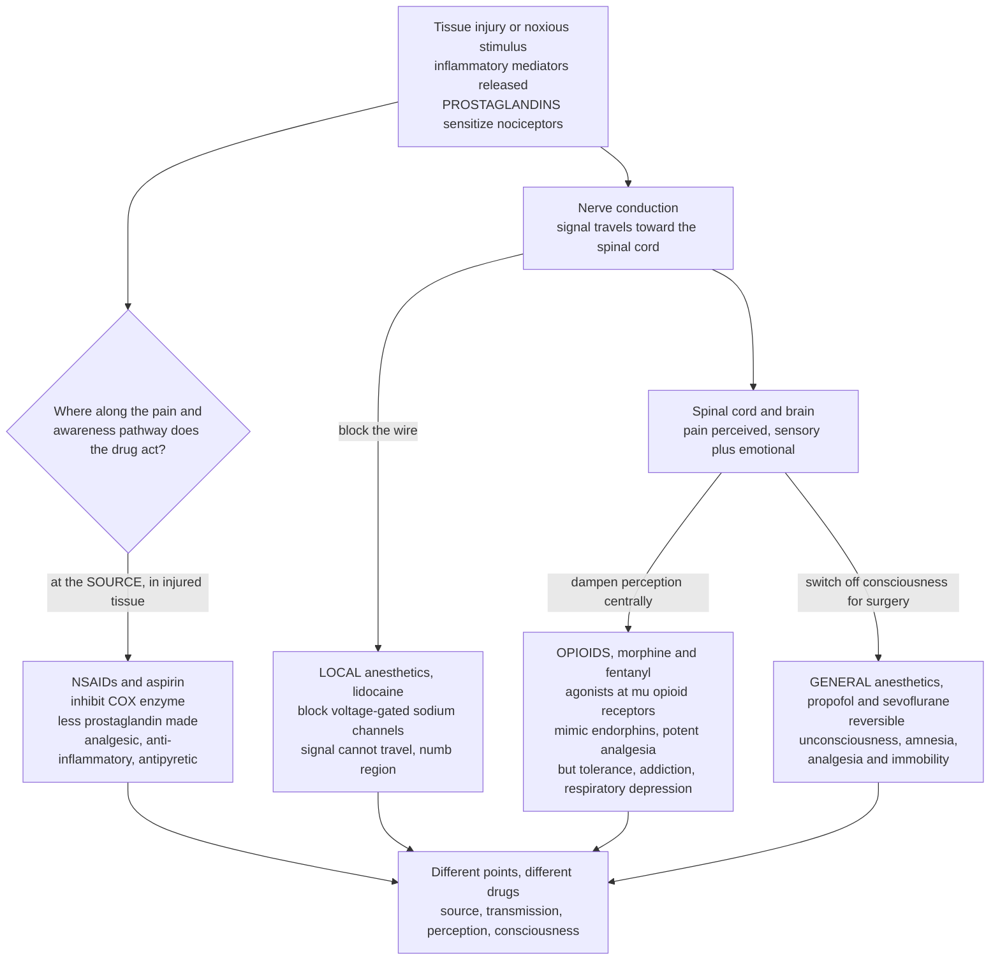

# 💊 Analgesics, Anesthetics, and Anti-Inflammatory Agents: Drugs for Pain, Inflammation, and Surgery

> [!abstract] TL;DR
> **Pain and inflammation are so universal that the drugs treating them are the most-used medicines on Earth** — and the trick to understanding them is to ask *where along the pain-and-awareness pathway each one acts.* **NSAIDs** (ibuprofen, naproxen, **aspirin**) work at the **SOURCE**, in the injured tissue: they inhibit **cyclooxygenase (COX)**, the enzyme that manufactures **prostaglandins** — the "pain and swelling" signaling molecules — so less pain signal is generated in the first place and the inflammation itself is treated (analgesic, anti-inflammatory, antipyretic). **Acetaminophen** relieves pain and fever with little anti-inflammatory effect (and is dangerously **hepatotoxic in overdose**), while **corticosteroids** and **biologic DMARDs (anti-TNF)** shut down inflammation far more powerfully for chronic disease. **Opioids** (morphine, fentanyl, oxycodone) work at the other end, in the **BRAIN and spinal cord**: they are agonists at **opioid receptors** (mu/kappa/delta), flipping the body's own pain-suppression switches that normally answer to **endorphins** — producing potent central analgesia, but the same reward-linked switch drives **tolerance, dependence, addiction, and respiratory depression**, the engine of the **opioid crisis** (reversed by the antagonist **naloxone**; addiction treated with the partial agonist **buprenorphine**). **Anesthetics** go further still: **local** anesthetics (lidocaine) simply block the electrical wire by shutting **voltage-gated sodium channels** so the signal cannot travel, while **general** anesthetics (propofol, sevoflurane) switch off consciousness entirely for surgery — a profound, still partly-mysterious global suppression of the brain. **Source, transmission, perception, consciousness** — knowing which drug acts where explains everything from the pill in your cabinet to the miracle of painless surgery, and connects enzyme, receptor, and ion-channel pharmacology to one of medicine's most urgent public-health challenges.

## Intuition — analogy first

**Analogy — an alarm system wired from a burning building all the way to the watchman's brain.** Imagine pain as a fire alarm that runs in four stages: a **smoke detector in the room where the fire is** (the injured tissue), the **wire** that carries the signal down the hall, the **control panel** in the security office (the spinal cord and brain) that decides how loudly to sound the alarm, and finally the **watchman's conscious awareness** of it. You can silence that alarm at any of these four points — and each class of pain drug picks a different point.

**NSAIDs attack the fire at its source.** When tissue is injured, it releases a chemical "smoke" — chiefly **prostaglandins** — that both makes the smoke detectors (nociceptors) far more sensitive and causes the redness, heat, and swelling of inflammation. NSAIDs like ibuprofen and aspirin jam the little factory that manufactures that smoke (the **COX enzyme**), so *less alarm signal is generated in the first place* and the swelling itself subsides. They treat the problem where it starts.

**Local anesthetics cut the wire.** Lidocaine at the dentist doesn't touch the fire or the control panel — it simply clamps the wire shut. By blocking the **sodium channels** that nerves use to carry electrical impulses, it numbs a patch so the signal physically cannot travel past that point. The fire may still be there, but the alarm never reaches the office.

**Opioids turn down the control panel.** Morphine works in the security office itself — the brain and spinal cord. Your body has built-in "quiet" switches (**opioid receptors**) that natural chemicals called **endorphins** flip during stress or exertion to dampen how much pain reaches awareness. Opioids flood those switches, powerfully turning down the whole alarm. The catch: those very switches are wired into the brain's **reward** circuitry, which is *why* opioids are so addictive, and they also quiet the brainstem centers that drive breathing — so too large a dose stops the watchman breathing. That double edge is the story of the opioid crisis.

**General anesthetics switch off the watchman entirely.** For surgery you need more than a quiet alarm — you need the watchman unconscious, unable to remember, unmoving, and pain-free. General anesthetics like propofol produce a reversible, whole-brain shutdown of consciousness — one of medicine's greatest gifts and, remarkably, a phenomenon we still do not fully understand. **Source, wire, control panel, consciousness** — that is the whole map.

---

## How It Works

**Core mechanics.** (1) **The pathway.** Injury releases inflammatory mediators — bradykinin, cytokines, and especially **prostaglandins** — that **sensitize nociceptors** so they fire more easily; the signal travels along nerve axons, relays in the **dorsal horn of the spinal cord**, ascends to the **thalamus and cortex**, and is finally *perceived* as pain with both a sensory and an emotional dimension (see [[Pain_Pathophysiology_and_Management]] and [[Pain_and_Nociception]]). (2) **NSAIDs act at the source:** they inhibit **cyclooxygenase (COX-1 and COX-2)**, cutting prostaglandin synthesis — hence they are simultaneously **analgesic, anti-inflammatory, and antipyretic**; the COX-1-vs-COX-2 balance sets their side-effect profile (GI bleeding vs cardiovascular risk). (3) **Acetaminophen** blunts central prostaglandin signaling to relieve pain and fever but barely touches peripheral inflammation, and its toxic metabolite **NAPQI** makes overdose a leading cause of acute liver failure. (4) **Corticosteroids** and **biologic DMARDs (anti-TNF, etc.)** suppress inflammation far upstream — by rewiring gene transcription or neutralizing cytokines — for chronic inflammatory disease. (5) **Opioids act on perception:** as agonists at **G-protein-coupled opioid receptors (mu/kappa/delta)** they mimic endogenous **endorphins**, hyperpolarizing neurons in the spinal cord and brain to dampen pain transmission and its unpleasantness — potent, but tied to **tolerance, dependence, addiction, and respiratory depression**. (6) **Local anesthetics** block **voltage-gated sodium channels** to stop conduction in the nerve itself, numbing a region; **general anesthetics** (mostly enhancing **GABA-A** inhibition and blocking excitatory NMDA channels) produce reversible **unconsciousness, amnesia, analgesia, and immobility**, often paired with neuromuscular blockers as adjuncts. (7) **Multimodal analgesia** combines drugs from different points of the pathway so each can be used at a lower, safer dose.



---

## Key Concepts / Details

### Secondary Level

- **Where the drug acts is the whole story.** Pain starts at an **injury**, travels along **nerves**, and is felt in the **brain**. Different painkillers stop it at different stages: at the source, along the wire, or in the brain.
- **NSAIDs work at the source.** **Ibuprofen, naproxen, and aspirin** block the tissue from making **prostaglandins** — the chemicals that cause pain, swelling, and fever. That is why they reduce all three: they are **anti-inflammatory** as well as pain-relieving. Aspirin also thins the blood, which is why a low daily dose can protect the heart.
- **Acetaminophen (paracetamol / Tylenol)** relieves pain and fever but does *not* reduce swelling much. It is gentle on the stomach but **poisons the liver in overdose** — a serious danger, especially combined with alcohol.
- **Opioids work in the brain.** **Morphine, fentanyl, codeine, and oxycodone** flip the body's own "pain-off" switches (the ones your natural **endorphins** use). They are the strongest painkillers we have — but they are **addictive** and, in too high a dose, they **stop you breathing**. This is the cause of the **opioid crisis** and of most overdose deaths. The antidote **naloxone (Narcan)** can reverse an overdose within minutes.
- **Anesthetics make surgery possible.** **Local** anesthetics like **lidocaine** numb one spot (the dentist's injection) by blocking nerve signals. **General** anesthetics like **propofol** put the whole brain to sleep so you feel nothing during an operation — and you wake up with no memory of it.

### Undergraduate Level

- **The pain pathway, drug by drug.** Nociceptor **transduction** (peripheral, sensitized by prostaglandins) → **conduction** along A-delta/C fibers → **dorsal-horn relay** → **ascending** spinothalamic tract → **cortical/limbic perception**, with **descending** endorphin/serotonin/noradrenaline modulation. NSAIDs act at transduction, local anesthetics at conduction, opioids at the dorsal horn and brain, general anesthetics at cortical consciousness.
- **NSAIDs and the COX enzymes.** Cyclooxygenase converts arachidonic acid to **prostaglandins and thromboxane**. **COX-1** is *constitutive* (housekeeping: gastric mucosal protection, platelet thromboxane, renal blood flow); **COX-2** is *inducible* by inflammation. **Non-selective NSAIDs** (ibuprofen, naproxen, aspirin) inhibit both → good anti-inflammatory effect but **GI ulceration/bleeding** and renal risk from losing COX-1 protection. **COX-2-selective coxibs** (celecoxib) spare the stomach but, by removing vascular prostacyclin while leaving platelet thromboxane, raise **cardiovascular/thrombotic risk** (rofecoxib was withdrawn). **Aspirin is unique**: it *irreversibly* acetylates COX, so a low dose permanently disables platelet thromboxane for the platelet's life — cardioprotective antiplatelet action (see [[Enzyme_Kinetics_and_Catalysis]]).
- **Acetaminophen.** Effective analgesic/antipyretic, weak anti-inflammatory; central mechanism debated (COX-2 in CNS, metabolite AM404). Safe at therapeutic dose, but overdose saturates conjugation, diverting metabolism to toxic **NAPQI** that destroys hepatocytes — treated with **N-acetylcysteine** to replenish glutathione.
- **Corticosteroids and DMARDs/biologics.** **Glucocorticoids** (prednisone) bind the intracellular **glucocorticoid receptor**, which acts as a transcription factor to broadly suppress inflammatory genes (cytokines, phospholipase A2) — powerful but with wide metabolic/immune side effects. **Conventional DMARDs** (methotrexate) and **biologics** — anti-**TNF** monoclonal antibodies (infliximab, adalimumab), anti-IL-6, etc. — target specific cytokines to control chronic inflammatory disease like rheumatoid arthritis (see [[The_Innate_Immune_System]] and [[Inflammation_and_Tissue_Repair]]).
- **Opioids.** Agonists at **mu (μ), kappa (κ), delta (δ)** opioid receptors — **GPCRs** that (via Gi) open K⁺ channels, close Ca²⁺ channels, and reduce cAMP, **hyperpolarizing** neurons and cutting neurotransmitter release both pre- and post-synaptically (see [[Synaptic_Transmission_and_Neurotransmitters]]). They mimic endogenous **endorphins/enkephalins/dynorphins**. Full agonists (morphine, **fentanyl** ~100x morphine, oxycodone) vs partial agonist (**buprenorphine**) vs antagonist (**naloxone, naltrexone**). Effects: analgesia, euphoria, sedation, **respiratory depression**, miosis, constipation, cough suppression.
- **The dangers.** **Tolerance** (receptor desensitization → escalating dose), **physical dependence** (withdrawal on cessation), and **addiction** (compulsive use driven by the mesolimbic dopamine **reward circuit** — see [[Decision_Making_and_Reward_Circuits]]). **Respiratory depression** — mu-mediated suppression of brainstem CO₂ sensitivity — is the direct cause of overdose death, and the **therapeutic window narrows** dangerously with tolerance, potent synthetics like fentanyl, and CNS depressant combinations (alcohol, benzodiazepines). This is the pharmacology of the **opioid crisis**.
- **Anesthetics.** **Local** (lidocaine, bupivacaine): block **voltage-gated Na⁺ channels** from the inside, preferentially in firing (small pain) fibers — regional/spinal/epidural numbing (see [[Ion_Channels_and_Receptor_Pharmacology]]). **General**: inhaled (**sevoflurane, isoflurane**, nitrous oxide) and IV (**propofol**, etomidate, ketamine) produce the tetrad of **unconsciousness, amnesia, analgesia, immobility**, mostly by **potentiating GABA-A** inhibition (propofol, volatiles) or blocking **NMDA** excitation (ketamine, nitrous oxide). **Neuromuscular blockers** (rocuronium, succinylcholine) are adjuncts for surgical paralysis — they provide no analgesia or sedation, so they must never be given without anesthesia.

### Graduate Level

- **Prostaglandin biology and the Vane discovery.** Sir John **Vane (1971)** showed aspirin-like drugs work by inhibiting prostaglandin synthesis — the mechanistic unification of analgesia, antipyresis, and anti-inflammation (Nobel Prize 1982). Arachidonic acid liberated by **phospholipase A2** feeds two arms: **COX → prostanoids** and **lipoxygenase → leukotrienes**; glucocorticoids act above the branch point (inducing annexin-1 to inhibit PLA2), explaining their broader anti-inflammatory reach than NSAIDs.
- **The coxib cardiovascular paradox.** Endothelial **COX-2** makes antithrombotic **prostacyclin (PGI2)**; platelet **COX-1** makes prothrombotic **thromboxane (TXA2)**. Selective COX-2 inhibition removes PGI2 while leaving TXA2 intact → net prothrombotic tilt (myocardial infarction, stroke) — the mechanism behind rofecoxib's withdrawal. This is a case study in how **isoform selectivity** trades one toxicity for another rather than eliminating it.
- **Opioid receptor signaling and biased agonism.** Mu-receptor coupling to **G-protein** (analgesia) vs **β-arrestin** (proposed to mediate respiratory depression and constipation) motivated **biased agonists** (oliceridine) hoped to separate analgesia from harm — though clinical superiority remains contested, illustrating the limits of the biased-signaling hypothesis. **Tolerance** involves receptor phosphorylation, internalization, and adenylyl-cyclase superactivation; **hyperalgesia** (paradoxical opioid-induced pain) complicates chronic dosing.
- **Pharmacogenomics of opioids.** **CYP2D6** converts **codeine → morphine**; ultrarapid metabolizers risk overdose (including breastfed infants), poor metabolizers get no analgesia — a landmark pharmacogenomic caution. Fentanyl's high potency and lipophilicity, plus illicit analogues, collapse the margin between effective and lethal exposure, driving the third wave of the overdose epidemic.
- **Harm reduction and treatment pharmacology.** **Naloxone** — a competitive mu antagonist — reverses overdose but has a shorter half-life than fentanyl/methadone (re-narcotization risk). **Medication-assisted treatment**: **methadone** (full agonist, long half-life, steady occupancy), **buprenorphine** (high-affinity **partial agonist** with a ceiling on respiratory depression and a naloxone co-formulation to deter injection), and **naltrexone** (antagonist maintenance). The partial-agonist ceiling is the pharmacological reason buprenorphine is comparatively overdose-safe.
- **Mechanisms of general anesthesia and the consciousness problem.** No single receptor explains general anesthesia; the **Meyer-Overton correlation** (potency tracks lipid solubility) gave way to specific protein targets (GABA-A, NMDA, two-pore K⁺ channels, TREK). Why potentiating inhibition abolishes **consciousness** remains one of neuroscience's deep open questions, studied through loss of thalamocortical integration and disrupted information flow (see [[Consciousness_and_Neural_Correlates]]). MAC (minimum alveolar concentration) quantifies inhaled potency; context-sensitive half-time governs IV recovery.
- **Multimodal and opioid-sparing analgesia.** Combining an NSAID or acetaminophen (peripheral/central non-opioid), a local/regional block (conduction), an alpha-2 agonist or gabapentinoid (modulation), and only low-dose opioid (perception) exploits **additive/synergistic mechanisms** to control pain while shrinking each drug's dose and toxicity — the modern standard for perioperative and chronic pain, and a direct clinical response to the opioid crisis.

---

## Python Demo

```python
# Analgesics, anesthetics, and anti-inflammatory drugs -- WHERE each class acts
# along the pain-and-awareness pathway, and the safety trade-offs that follow.
#   (a) MECHANISM MAP AT THE SOURCE: rising NSAID dose inhibits COX, so the
#       prostaglandin ("pain-and-swelling signal") generated in injured tissue falls.
#   (b) CENTRAL ACTION: rising opioid dose raises the pain threshold (tolerance to pain)
#       by dampening perception in the brain and spinal cord.
#   (c) OPIOID SAFETY WINDOW: analgesia and lethal respiratory depression on ONE dose
#       axis -- the narrow gap between them is why overdose is deadly.
#   (d) COX-1 vs COX-2 SELECTIVITY: efficacy vs the GI-bleed / cardiovascular trade-off
#       across real NSAIDs.
import numpy as np
import matplotlib.pyplot as plt

def hill_up(x, ec50, n=2.0):      # rising saturating response (0 -> 100)
    return 100.0 * x**n / (ec50**n + x**n)

def hill_down(x, ic50, n=2.0):    # falling response: 100 (uninhibited) -> 0
    return 100.0 / (1.0 + (x / ic50)**n)

dose = np.linspace(0, 100, 500)   # arbitrary dose units (percent of a reference dose)

fig, ax = plt.subplots(2, 2, figsize=(13, 10))

# --- (a) NSAID at the SOURCE: prostaglandin / pain-signal generated falls ------
pg_remaining = hill_down(dose, ic50=25, n=1.6)       # prostaglandin still made
ax[0, 0].plot(dose, pg_remaining, lw=2.6, color="#4a9eff",
              label="prostaglandin / pain-signal at source")
ax[0, 0].fill_between(dose, pg_remaining, color="#4a9eff", alpha=0.12)
ax[0, 0].axhline(50, ls=":", color="gray", lw=1)
ax[0, 0].set_xlabel("NSAID dose (COX inhibition)")
ax[0, 0].set_ylabel("Prostaglandin / inflammation (percent of baseline)")
ax[0, 0].set_title("(a) NSAIDs act at the SOURCE:\nless pain-and-swelling signal generated")
ax[0, 0].legend(fontsize=8); ax[0, 0].grid(alpha=0.3)

# --- (b) OPIOID central action: pain threshold (tolerance to pain) rises -------
pain_threshold = hill_up(dose, ec50=30, n=2.2)
ax[0, 1].plot(dose, pain_threshold, lw=2.6, color="#51cf66",
              label="pain threshold raised (central analgesia)")
ax[0, 1].fill_between(dose, pain_threshold, color="#51cf66", alpha=0.12)
ax[0, 1].axhline(50, ls=":", color="gray", lw=1)
ax[0, 1].set_xlabel("Opioid dose")
ax[0, 1].set_ylabel("Pain tolerance (percent of maximum)")
ax[0, 1].set_title("(b) Opioids act on PERCEPTION:\nbrain and cord dampen the pain")
ax[0, 1].legend(fontsize=8); ax[0, 1].grid(alpha=0.3)

# --- (c) OPIOID SAFETY WINDOW: analgesia vs respiratory depression -------------
analgesia = hill_up(dose, ec50=25, n=3.0)            # desired effect
resp_depr = hill_up(dose, ec50=55, n=3.5)            # lethal effect, close behind
ax[1, 0].plot(dose, analgesia, lw=2.6, color="#51cf66", label="analgesia (wanted)")
ax[1, 0].plot(dose, resp_depr, lw=2.6, color="#fa5252",
              label="respiratory depression (deadly)")
# therapeutic window: analgesia achieved, respiratory depression still low
window = (analgesia >= 50) & (resp_depr <= 15)
ax[1, 0].fill_between(dose, 0, 100, where=window, color="#51cf66", alpha=0.15)
danger = resp_depr >= 50
ax[1, 0].fill_between(dose, 0, 100, where=danger, color="#fa5252", alpha=0.15)
ax[1, 0].text(dose[window][len(dose[window])//2] if window.any() else 30, 88,
              "therapeutic\nwindow", ha="center", fontsize=8, color="#2f9e44")
ax[1, 0].text(80, 88, "overdose\nzone", ha="center", fontsize=8, color="#c92a2a")
ax[1, 0].set_xlabel("Opioid dose (same axis for both effects)")
ax[1, 0].set_ylabel("Effect magnitude (percent)")
ax[1, 0].set_title("(c) Opioid safety window is NARROW:\nanalgesia and death on one curve")
ax[1, 0].legend(fontsize=8, loc="center right"); ax[1, 0].grid(alpha=0.3)

# --- (d) COX-1 vs COX-2 selectivity: the side-effect trade-off -----------------
drugs   = ["Aspirin", "Naproxen", "Ibuprofen", "Diclofenac", "Celecoxib", "Rofecoxib"]
cox1    = np.array([90, 70, 65, 45, 20,  8])   # COX-1 inhibition -> GI-bleed risk
cox2    = np.array([70, 72, 68, 80, 78, 85])   # COX-2 inhibition -> anti-inflammatory efficacy
x = np.arange(len(drugs)); w = 0.38
ax[1, 1].bar(x - w/2, cox1, w, color="#ff922b", label="COX-1 block -> GI-bleed risk")
ax[1, 1].bar(x + w/2, cox2, w, color="#4a9eff", label="COX-2 block -> anti-inflammatory")
ax[1, 1].set_xticks(x); ax[1, 1].set_xticklabels(drugs, rotation=25, fontsize=8)
ax[1, 1].set_ylabel("Relative enzyme inhibition (percent)")
ax[1, 1].set_title("(d) COX-1 vs COX-2 selectivity:\nGI safety traded for cardiovascular risk")
ax[1, 1].legend(fontsize=8); ax[1, 1].grid(alpha=0.3, axis="y")

plt.tight_layout()
plt.savefig("analgesics_anesthetics_pathway.png", dpi=120)
plt.show()

# Takeaways:
#  - (a)+(b): NSAIDs cut the signal at the SOURCE; opioids raise the threshold CENTRALLY
#            -- two different points on the same pathway, hence multimodal analgesia.
#  - (c): analgesia and lethal respiratory depression sit close together; tolerance,
#         fentanyl, and CNS depressants shrink the gap -> the mechanism of overdose death.
#  - (d): non-selective NSAILs (aspirin, ibuprofen) hit COX-1 -> GI bleeding; COX-2
#         coxibs spare the gut but shift risk toward clots -- selectivity moves harm, not removes it.
```

Running this produces a 2x2 figure. Panel (a) shows an **NSAID** driving the prostaglandin/pain-signal *generated at the injured source* downward as COX is inhibited — treating the inflammation itself. Panel (b) shows an **opioid** raising the **pain threshold centrally**, dampening perception in the brain and cord. Panel (c) puts opioid **analgesia and lethal respiratory depression on one dose axis**: the shaded therapeutic window is narrow and the overdose zone looms close behind — exactly why tolerance, fentanyl's potency, and depressant combinations make overdose deadly. Panel (d) contrasts **COX-1 vs COX-2 inhibition** across real NSAIDs, visualizing how selectivity trades **GI-bleeding** risk for **cardiovascular** risk rather than abolishing side effects.

---

## Real-World Applications

> **Example — aspirin, the drug that founded the field:** aspirin **irreversibly acetylates a serine** in cyclooxygenase, permanently shutting down **prostaglandin** synthesis (the mechanism John **Vane** discovered in 1971). Because **platelets cannot resynthesize** the enzyme, a single low daily dose suppresses **thromboxane**-driven clotting for the platelet's ~10-day lifespan — turning an ancient painkiller into a cornerstone of **cardiovascular prevention**, distinct from its higher-dose analgesic and anti-inflammatory use.

- **Ibuprofen and naproxen (OTC NSAIDs)** — the everyday response to headache, arthritis, menstrual, and musculoskeletal pain; non-selective COX inhibition delivers analgesia, anti-inflammation, and antipyresis, at the cost of **GI irritation** and, with heavy use, renal and cardiovascular risk.
- **Celecoxib (COX-2 selective)** — engineered to spare the gastric mucosa for patients at high GI-bleed risk, illustrating both the promise and the **cardiovascular trade-off** of isoform selectivity that ended rofecoxib.
- **Acetaminophen (paracetamol)** — the world's default fever/pain reducer, safe and stomach-friendly at dose but the leading cause of **acute liver failure** in overdose; the antidote **N-acetylcysteine** is a pharmacology-class staple.
- **Morphine and fentanyl in the hospital** — the backbone of **surgical, cancer, and end-of-life** pain control; fentanyl's potency and rapid onset make it invaluable in anesthesia yet lethal on the street.
- **Naloxone (Narcan)** — a competitive mu antagonist distributed to first responders and the public; it reverses **respiratory depression** within minutes and is a frontline **harm-reduction** tool in the overdose epidemic.
- **Buprenorphine and methadone** — **medication-assisted treatment** for opioid use disorder; buprenorphine's **partial-agonist ceiling** on respiratory depression makes it comparatively overdose-safe, a direct pharmacological answer to the crisis.
- **Lidocaine at the dentist / epidural in childbirth** — **sodium-channel-blocking** local and regional anesthesia numbs a defined area with the patient fully awake — the everyday face of conduction blockade.
- **Propofol and sevoflurane in the operating room** — general anesthesia's reversible unconsciousness, potentiating **GABA-A** inhibition, makes essentially all modern surgery possible; paired with neuromuscular blockers and monitored breathing.
- **Anti-TNF biologics (adalimumab, infliximab)** — for rheumatoid arthritis, Crohn's, and psoriasis, they neutralize a key inflammatory cytokine, controlling chronic **inflammation** where NSAIDs and even steroids fall short (see [[Inflammation_and_Tissue_Repair]]).

---

## Common Pitfalls

- **Thinking all painkillers work the same way.** NSAIDs, opioids, and anesthetics act at *different points* of the pathway (source, perception, conduction, consciousness). Confusing them leads to wrong expectations — an NSAID will not sedate for surgery, and an opioid does not treat the underlying inflammation.
- **Assuming COX-2 selectivity is "safer, full stop."** Sparing the stomach shifts risk toward **thrombosis and cardiovascular events** by unbalancing prostacyclin and thromboxane. Selectivity **relocates** toxicity rather than eliminating it — the rofecoxib lesson.
- **Underestimating acetaminophen overdose.** Because it is OTC and "gentle," people exceed the dose or stack combination products; the margin to **hepatotoxic NAPQI** is narrower than assumed, especially with alcohol or fasting. It is a leading cause of acute liver failure.
- **Treating the opioid dose-response as having a wide margin.** Analgesia and **respiratory depression** sit close together, and the window **shrinks** with tolerance, potent synthetics like fentanyl, and co-administered CNS depressants (benzodiazepines, alcohol). Ignoring this is the pharmacology of overdose death.
- **Confusing tolerance, dependence, and addiction.** **Tolerance** (needing more for the same effect) and physical **dependence** (withdrawal on stopping) are expected physiological adaptations and occur even in appropriate therapy; **addiction** is compulsive, harmful use driven by reward circuitry. Conflating them stigmatizes patients and misguides treatment.
- **Giving a neuromuscular blocker as if it were an anesthetic.** Paralytics provide **no analgesia, sedation, or amnesia**. Administered without adequate anesthesia they cause the horror of awareness-with-paralysis — they are strictly *adjuncts*.
- **Expecting local anesthetic to treat the cause.** Lidocaine blocks the *wire*; the injury and inflammation remain. Numbing is symptomatic and time-limited, and systemic absorption of local anesthetic can be cardiotoxic if dosing limits are exceeded.
- **Forgetting multimodal, opioid-sparing strategy.** Relying on a single high-dose opioid maximizes harm. Combining mechanisms (non-opioid + regional block + adjuvant + low-dose opioid) controls pain at lower, safer doses — the modern standard.

---

## Related Concepts

- [[Pain_Pathophysiology_and_Management]] — the clinical pain pathway (transduction, conduction, dorsal-horn gate, ascending transmission, descending modulation, sensitization) that this note's drug classes intervene upon; read together, disease-mechanism and drug-mechanism map one-to-one.
- [[Pain_and_Nociception]] — the neuroscience of nociceptors, A-delta/C fibers, and pain circuits — the biological substrate that NSAIDs (peripheral sensitization) and opioids (central perception) act on.
- [[Inflammation_and_Tissue_Repair]] — the inflammatory cascade and prostaglandin/cytokine mediators that NSAIDs, corticosteroids, and anti-TNF biologics suppress; explains *why* anti-inflammatory analgesia treats the source.
- [[The_Innate_Immune_System]] — cytokines (TNF, IL-6) and inflammatory mediators are the targets of DMARDs and biologics, and the effectors that prostaglandins amplify.
- [[Enzyme_Kinetics_and_Catalysis]] — cyclooxygenase is an enzyme; aspirin's *irreversible* (covalent) inhibition versus ibuprofen's *reversible competitive* inhibition is a direct application of enzyme-inhibition kinetics.
- [[Ion_Channels_and_Receptor_Pharmacology]] — local anesthetics block **voltage-gated sodium channels**, and opioid/GABA effects flow through channel and receptor gating; the biophysical basis of conduction blockade and CNS depression.
- [[Synaptic_Transmission_and_Neurotransmitters]] — opioid receptors are presynaptic/postsynaptic GPCRs that hyperpolarize neurons and cut neurotransmitter release; endorphins are the endogenous ligands opioids mimic.
- [[Decision_Making_and_Reward_Circuits]] — the mesolimbic dopamine reward pathway that opioids hijack, explaining addiction and the compulsive-use engine of the opioid crisis.
- [[Consciousness_and_Neural_Correlates]] — general anesthetics abolish consciousness by disrupting thalamocortical integration; the still-incomplete science of how they do so connects pharmacology to the hard problem of awareness.

**Sibling notes in this section (Drug Classes and Therapeutics) and adjacent Molecular Targets:** this note sits alongside *CNS and Psychopharmacology* (antidepressants, antipsychotics, anxiolytics acting on the same CNS receptors that opioids and general anesthetics engage) and *Autonomic and Cardiovascular Pharmacology* (where aspirin's antiplatelet and NSAID renal/cardiovascular effects recur). Mechanistically it draws on three molecular-target notes: *Enzymes as Drug Targets* (COX inhibition), *Receptors and Signal Transduction as Targets* (opioid GPCRs, glucocorticoid receptor), and *Ion Channels and Transporters as Targets* (sodium-channel and GABA-A action of anesthetics). Together they show one theme — **the same pain-and-awareness pathway can be interrupted at an enzyme, a receptor, or a channel**, and choosing which defines the drug class.

---

## Review Questions

1. **(Secondary)** A person twists an ankle and it becomes red, swollen, and painful. Explain in plain terms why an NSAID like ibuprofen helps with *all three* of those problems, while a numbing gel (local anesthetic) only stops the pain in the spot it is applied. What is each drug doing along the "injury → nerve → brain" pathway?
2. **(Undergraduate)** Aspirin and ibuprofen both inhibit cyclooxygenase, yet only low-dose aspirin is used to protect the heart, and its antiplatelet effect outlasts the drug in the blood by days. Explain the mechanistic difference (irreversible acetylation vs reversible competitive inhibition) and why the fact that **platelets cannot resynthesize COX** is the key to aspirin's cardioprotection.
3. **(Undergraduate)** Using the concepts of the therapeutic window and receptor pharmacology, explain why **fentanyl** is far more likely to cause fatal overdose than morphine, and why **buprenorphine** (a partial agonist) is comparatively safer for maintenance treatment. Where does **naloxone** fit, and why can re-narcotization occur after it is given?
4. **(Graduate)** Contrast the mechanisms by which **NSAIDs**, **corticosteroids**, and **anti-TNF biologics** suppress inflammation, referencing the arachidonic-acid cascade (phospholipase A2, COX, prostaglandins) and the level at which each acts. Then explain the **COX-2 cardiovascular paradox**: how does selectively sparing COX-1 in the gut end up increasing thrombotic risk?
5. **(Graduate)** General anesthetics produce reversible unconsciousness largely by potentiating GABA-A inhibition, yet *why* this abolishes consciousness is unresolved. Discuss what makes the mechanism of general anesthesia scientifically hard, and how it connects the pharmacology of a single receptor to the neural correlates of consciousness.

---

## Sources

- Katzung BG, Vanderah TW (eds). *Basic & Clinical Pharmacology* — "Nonopioid Analgesics & Drugs Used in Gout / NSAIDs," "Opioid Analgesics & Antagonists," "Local Anesthetics," and "General Anesthetics." McGraw Hill / AccessMedicine. https://accessmedicine.mhmedical.com/book.aspx?bookid=2988
- Ritter JM, Flower R, Henderson G, et al. *Rang & Dale's Pharmacology* — "Analgesic Drugs," "Anti-inflammatory and Immunosuppressant Drugs," "Local Anaesthetics," "General Anaesthetic Agents." Elsevier. https://www.elsevier.com/books/rang-and-dales-pharmacology/ritter/978-0-7020-7448-6
- Brunton LL, Knollmann BC (eds). *Goodman & Gilman's The Pharmacological Basis of Therapeutics* — Opioids, Anti-inflammatory/Antipyretic Agents, and Anesthetics sections. McGraw Hill. https://accessmedicine.mhmedical.com/book.aspx?bookid=2189
- Vane JR. "Inhibition of Prostaglandin Synthesis as a Mechanism of Action for Aspirin-like Drugs." *Nature New Biology* 231, 232–235 (1971). https://doi.org/10.1038/newbio231232a0
- FitzGerald GA, Patrono C. "The Coxibs, Selective Inhibitors of Cyclooxygenase-2." *New England Journal of Medicine* 345, 433–442 (2001). https://doi.org/10.1056/NEJM200108093450607

---

#pharmacology #analgesics #NSAIDs #opioids #anesthetics
