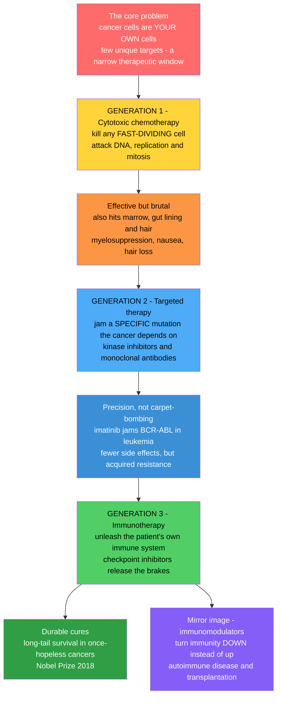

# 💊 Anticancer and Immunomodulatory Drugs

> [!abstract] TL;DR
> Cancer is uniquely hard to drug because the enemy is **you** — cancer cells are your own cells, so few targets are truly unique and the therapeutic window is narrow. Anticancer pharmacology has evolved through three generations of ever-smarter selectivity: **cytotoxic chemotherapy** (blunt poisons that kill any fast-dividing cell — effective but also hits marrow, gut, and hair), **targeted therapy** (small molecules and antibodies that jam a specific mutation the cancer depends on — precision, turning some fatal cancers manageable), and **immunotherapy** (unleash the patient's own immune system, releasing the brakes tumors exploit — durable cures once thought impossible). The mirror-image field of **immunomodulatory drugs** turns immunity *down* for autoimmune disease and organ transplantation. Together they tie cytotoxic, targeted, and biologic pharmacology to cancer biology and immunology.
>
> *Educational science content — not individual medical or dosing advice.*

---

## Intuition

**Analogy first.** Imagine you have to poison an intruder who is hiding *inside* your own body, disguised to look almost exactly like your healthy cells. Any poison strong enough to kill the intruder tends to kill you too — because the intruder **is** you. That is the central problem of cancer treatment: unlike a bacterium (foreign chemistry, unique targets), a cancer cell is a corrupted copy of a normal human cell. There is almost no molecular "handle" that exists on the cancer but nowhere else. Every solution in oncology is a clever answer to this one hard question: *how do you selectively kill your own cells?*

Medicine has answered it three times, each answer smarter than the last:

1. **Carpet-bombing (chemotherapy).** The first insight was that cancer's defining trait is that it *divides fast*. So build poisons that preferentially kill any rapidly dividing cell. It works — but your hair follicles, gut lining, and bone marrow also divide fast, which is exactly why classic chemo causes hair loss, nausea, and dangerous drops in blood counts. Effective, but brutal.
2. **The sniper's bullet (targeted therapy).** The second insight was that each cancer usually leans on one specific broken molecule — a mutated protein that drives its growth and that normal cells do not depend on. Design a drug that jams *that exact molecule* and you spare the healthy cells. When **imatinib** was built to jam the fusion protein driving chronic myeloid leukemia, it turned a once-fatal cancer into a manageable, pill-controlled condition. Precision, not carpet-bombing.
3. **Calling in reinforcements (immunotherapy).** The third and most revolutionary insight was to stop attacking the cancer directly at all. Your immune system is already a professional cell-killer — but tumors survive by hiding and by pressing the immune system's built-in "off switches." **Checkpoint inhibitor** drugs release those brakes, freeing your own T cells to recognize and destroy the tumor. In cancers once considered hopeless, this produces *durable* cures — a Nobel-winning breakthrough.

From poisoning fast cells, to jamming a specific flaw, to weaponizing the immune system — the story of anticancer drugs is the story of ever-smarter selectivity against an enemy made of ourselves.

---

## How It Works

### Core Mechanics

**The central challenge — selective toxicity.** A useful anticancer drug must kill cancer cells at doses that spare enough normal cells to keep the patient alive. The ratio between the toxic dose and the effective dose is the **therapeutic window**. Because cancer cells share almost all of a normal cell's biochemistry, that window is often dangerously narrow — the whole history of the field is the search for targets that widen it.

**Generation 1 — cytotoxic chemotherapy (kill the fast dividers).** These drugs attack the machinery of DNA replication and cell division, so any cell cycling quickly is hit hardest:
- **Alkylating agents and platinum compounds** (cyclophosphamide, cisplatin) chemically **cross-link DNA**, so the strands cannot separate to replicate.
- **Antimetabolites** (methotrexate, 5-fluorouracil) are fake building blocks that **block DNA synthesis** by poisoning the enzymes that make nucleotides — methotrexate jams dihydrofolate reductase, 5-FU jams thymidylate synthase.
- **Topoisomerase inhibitors** (doxorubicin, etoposide, irinotecan) trap the enzymes that unwind DNA, snapping the strands.
- **Mitotic spindle poisons** (taxanes, vinca alkaloids) freeze the microtubule "ropes" that pull chromosomes apart during mitosis.
Because they hit *all* fast-dividing tissue, the predictable toxicities are **myelosuppression** (marrow → low blood counts, infection risk), gut damage (mucositis, nausea), and hair loss. Drugs are given in **combination regimens** (different mechanisms, non-overlapping toxicities) and dosed on a schedule tuned to **cell-cycle specificity**. Tumors eventually escape through **resistance** — drug-efflux pumps, enhanced DNA repair, and target mutation.

**Generation 2 — targeted therapy (jam the specific flaw).** Instead of exploiting fast division, these drugs exploit a cancer-**specific** molecular driver — usually an oncogene the tumor is *addicted* to:
- **Small-molecule kinase inhibitors** (the "-nibs") plug the ATP pocket of an overactive signaling enzyme. **Imatinib** jams the **BCR-ABL** fusion kinase of chronic myeloid leukemia — the landmark proof that precision oncology works. Others target **EGFR** (lung cancer), **BRAF** (melanoma), and **ALK**.
- **Monoclonal antibodies** bind a protein on the cancer's surface. **Trastuzumab** targets **HER2** in breast cancer; **rituximab** targets CD20 on B-cell lymphomas. **Antibody-drug conjugates (ADCs)** bolt a cytotoxic payload onto an antibody so the poison is delivered only to cells carrying the target — a "guided missile."
Selectivity is far better, so side effects are milder and more predictable (on-target effects like rash from EGFR blockade). But cancers still evolve **acquired resistance**, usually by mutating the target so the drug no longer fits.

**Generation 3 — immunotherapy (unleash the immune system).** The paradigm shift: treat the **immune system**, not the tumor:
- **Immune checkpoint inhibitors** block the "off switches" (**PD-1/PD-L1**, **CTLA-4**) that tumors exploit to shut down attacking T cells. Releasing the brake produces **durable** responses (Nobel Prize 2018 to Allison and Honjo).
- **CAR-T cell therapy** removes a patient's T cells, genetically engineers them with a **chimeric antigen receptor** that recognizes the cancer, expands them, and reinfuses a living drug.
- **Cancer vaccines** and **cytokines** (IL-2, interferons) stimulate anti-tumor immunity more broadly.
The trademark toxicity is different in kind: because you have *removed a brake* on immunity, the immune system can attack healthy organs, causing **immune-related adverse events** (autoimmune-like colitis, thyroiditis, pneumonitis) or, with CAR-T, a dangerous **cytokine release syndrome**.

**The mirror image — immunomodulatory drugs.** The same lever runs the other way. For **autoimmune disease** and **organ transplantation**, the goal is to turn immunity *down*: **calcineurin inhibitors** (cyclosporine, tacrolimus) block T-cell activation, **corticosteroids** broadly dampen inflammation, **antimetabolites** (azathioprine, mycophenolate) throttle lymphocyte proliferation, and **biologics** (anti-TNF antibodies) neutralize specific inflammatory signals. Their opposite, **immunostimulants**, boost a weak immune response.

### Flow / Architecture



---

## Key Concepts

### Secondary Level

**Why cancer is hard to treat.** A germ is foreign — it has chemistry your cells do not, so antibiotics can hit it without hurting you. Cancer is *not* foreign: it is your own cells that have gone rogue. So almost any drug that hurts the cancer also hurts you a little. The art of cancer medicine is finding differences to exploit.

**The three big ideas:**
- **Chemotherapy** targets the one obvious difference — cancer cells divide unusually fast — with poisons that hit fast-dividing cells. Side effects (hair loss, nausea, low blood counts) come from your *normal* fast-dividing tissues being caught in the crossfire.
- **Targeted therapy** finds a specific broken part inside a particular cancer and builds a drug to jam only that part, sparing healthy cells.
- **Immunotherapy** does not attack the cancer directly. It removes the disguise and the "off switches" the cancer uses to hide, so your own immune system finds and kills it.

### Undergraduate Level

**Cell-cycle logic and combination therapy.** Cytotoxic drugs fall into **cell-cycle-specific** agents (antimetabolites act in S phase; taxanes and vinca alkaloids in M phase) and **non-specific** agents (alkylators work in any phase). This dictates scheduling and why regimens combine drugs with **different mechanisms and non-overlapping toxicities** (e.g., ABVD, CHOP) to maximize kill while capping harm to any one organ.

**Log-kill and fractional kill.** A given dose kills a constant *fraction* of tumor cells, not a constant *number*. Because a clinically detectable tumor already contains roughly 10^9 to 10^12 cells, cure requires many cycles driving the population down step by step — and any surviving resistant clone can repopulate.

**Mechanisms of resistance.** Tumors escape via **drug-efflux pumps** (P-glycoprotein exporting the drug), enhanced **DNA repair**, altered drug-metabolizing enzymes, target amplification, and mutation of the target so a targeted drug no longer binds. This is why single agents fail and combinations (or sequential new drugs) are needed.

**Targeted therapy and precision oncology.** Kinase inhibitors occupy the ATP-binding pocket of a driver enzyme; monoclonal antibodies engage surface antigens and recruit immune effectors or deliver payloads (ADCs). Matching the drug to a tumor's specific molecular lesion — HER2-positive breast cancer to trastuzumab, BRAF-mutant melanoma to a BRAF inhibitor — is the essence of **precision medicine**, guided by tumor genotyping.

### Graduate Level

**The therapeutic index and on- vs off-target toxicity.** Each generation shifts the *nature* of dose-limiting toxicity. Cytotoxics are limited by **off-target** damage to normal proliferating tissue (a mechanistic ceiling shared by the whole class). Targeted agents are often limited by **on-target, off-tumor** effects — the drug hitting the same protein in healthy tissue (EGFR inhibitor rash; VEGF-pathway hypertension). Immunotherapies are limited by **immune-related adverse events**: releasing systemic tolerance unleashes autoreactive T cells against normal organs, mechanistically the same lever that immunomodulators pull in reverse for autoimmunity.

**Checkpoint biology.** T-cell activation requires signal 1 (TCR–antigen) plus signal 2 (co-stimulation), and is tuned by inhibitory checkpoints. **CTLA-4** dampens *priming* in lymph nodes (competing with CD28 for B7); **PD-1**, engaged by tumor **PD-L1**, dampens *effector* T cells in the tumor microenvironment. Blocking either restores anti-tumor immunity — but the response is stochastic and correlated with tumor mutational burden and pre-existing T-cell infiltration, explaining why only a subset of patients achieve the durable "long tail."

**Immunosuppression pharmacology.** Calcineurin inhibitors (cyclosporine binds cyclophilin, tacrolimus binds FKBP12) block calcineurin-mediated dephosphorylation of NFAT, shutting off IL-2 transcription and thus clonal T-cell expansion — mechanistic mirror to the immune *activation* that checkpoint blockade seeks. mTOR inhibitors (sirolimus), antiproliferatives (mycophenolate blocking IMPDH), and biologics (anti-TNF, anti-CD20, IL-6 blockade) target discrete nodes, letting clinicians titrate immunity along a continuum from transplant tolerance to anti-tumor aggression.

---

## Python Demo

```python
# Anticancer pharmacology in two pictures:
#   (a) SELECTIVITY: why chemotherapy has a narrow therapeutic window
#       (kills tumor AND normal fast-dividing tissue) while targeted therapy
#       has a wide one (only cells carrying the driver mutation are killed).
#   (b) DYNAMICS: a transient chemo response undone by RESISTANT clones vs the
#       durable "long tail" of immunotherapy.
import numpy as np
import matplotlib.pyplot as plt

# ---- (a) Dose-response: therapeutic window ----------------------------------
dose = np.linspace(0, 10, 400)

def hill(x, ec50, n=4):
    """Fraction of a cell population killed at a given dose (sigmoid)."""
    return x**n / (x**n + ec50**n)

# Chemotherapy: normal fast-dividing tissue is almost as sensitive as the tumor
chemo_tumor  = hill(dose, ec50=3.0)   # tumor kill
chemo_normal = hill(dose, ec50=4.0)   # marrow / gut / hair kill (very close!)

# Targeted therapy: normal cells lack the driver, so they resist the drug
tgt_tumor    = hill(dose, ec50=3.0)   # tumor kill (same potency)
tgt_normal   = hill(dose, ec50=14.0)  # normal cells barely affected

# ---- (b) Tumor burden over time ---------------------------------------------
t  = np.linspace(0, 24, 400)          # months of treatment
N0 = 100.0                            # starting tumor burden (relative)

# Chemotherapy: sharp response, then a resistant clone regrows -> relapse
sensitive = N0 * np.exp(-0.60 * t)    # drug-sensitive cells decay fast
resistant = 1.0 * np.exp(0.18 * t)    # pre-existing resistant clone expands
chemo_burden = sensitive + resistant

# Immunotherapy: slower onset but DURABLE control -> long-tail plateau
immuno_burden = N0 * np.exp(-0.28 * t) + 2.0

# ---- Plot -------------------------------------------------------------------
fig, (ax1, ax2) = plt.subplots(1, 2, figsize=(13, 5))

ax1.plot(dose, chemo_tumor,  color="#c92a2a", lw=2.4, label="Chemo: tumor killed")
ax1.plot(dose, chemo_normal, color="#c92a2a", lw=2.0, ls="--",
         label="Chemo: normal tissue harmed")
ax1.plot(dose, tgt_tumor,    color="#1971c2", lw=2.4, label="Targeted: tumor killed")
ax1.plot(dose, tgt_normal,   color="#1971c2", lw=2.0, ls="--",
         label="Targeted: normal tissue harmed")
# shade the wide targeted-therapy window (high tumor kill, low normal harm)
window = (tgt_tumor > 0.5) & (tgt_normal < 0.2)
ax1.fill_between(dose, 0, 1, where=window, color="#1971c2", alpha=0.10)
ax1.set_title("(a) Selectivity: chemo (narrow) vs targeted (wide) window")
ax1.set_xlabel("Drug dose"); ax1.set_ylabel("Fraction of cells killed")
ax1.legend(fontsize=8, loc="center right"); ax1.grid(alpha=0.3)

ax2.plot(t, chemo_burden,  color="#c92a2a", lw=2.4, label="Chemotherapy (relapse)")
ax2.plot(t, immuno_burden, color="#2f9e44", lw=2.4, label="Immunotherapy (durable)")
ax2.axhline(5, color="gray", ls=":", lw=1)
ax2.annotate("resistant clone\nregrows", xy=(20, chemo_burden[-40]),
             xytext=(12, 55), fontsize=9,
             arrowprops=dict(arrowstyle="->", color="#c92a2a"))
ax2.annotate("durable long tail", xy=(21, immuno_burden[-30]),
             xytext=(11, 15), fontsize=9,
             arrowprops=dict(arrowstyle="->", color="#2f9e44"))
ax2.set_title("(b) Transient chemo response vs durable immunotherapy")
ax2.set_xlabel("Months of treatment"); ax2.set_ylabel("Tumor burden (relative)")
ax2.set_ylim(0, 110); ax2.legend(fontsize=9); ax2.grid(alpha=0.3)

plt.tight_layout()
plt.savefig("anticancer_selectivity_and_dynamics.png", dpi=120)
print("Chemo therapeutic window (dose where tumor kill>0.5, normal harm<0.2):",
      "essentially none" if not ((chemo_tumor>0.5)&(chemo_normal<0.2)).any() else "narrow")
print("Targeted therapeutic window width (# dose points):", int(window.sum()))
```

**What it shows.** Panel (a): the chemo tumor-kill and normal-tissue-harm curves sit almost on top of each other — there is essentially *no* dose that kills the tumor while sparing normal fast-dividing tissue (a narrow-to-nonexistent window, hence the classic side effects). For targeted therapy the two curves are far apart, opening a wide shaded window where the tumor dies and normal cells are untouched. Panel (b): chemotherapy drives a fast, deep response that is then undone as a pre-existing **resistant clone** regrows (relapse) — the mathematical reason combinations and new drugs are needed — while immunotherapy's response builds more slowly but flattens into a **durable long tail** of lasting control.

---

## Real-World Applications

- **Imatinib in chronic myeloid leukemia (the targeted-therapy landmark).** CML is driven by the **BCR-ABL** fusion kinase from the Philadelphia chromosome. Imatinib plugs that kinase's ATP pocket, converting a once-fatal leukemia into a condition many patients manage with a daily pill and near-normal life expectancy — the proof of concept for precision oncology.

- **Checkpoint inhibitors in melanoma and lung cancer.** Anti-PD-1 (nivolumab, pembrolizumab) and anti-CTLA-4 (ipilimumab) antibodies release the brakes on T cells. In metastatic melanoma — once nearly untreatable — a subset of patients now achieve multi-year, durable remissions, embodying immunotherapy's "long tail."

- **Trastuzumab and ADCs in HER2-positive breast cancer.** Trastuzumab, a monoclonal antibody against the HER2 receptor, transformed an aggressive breast-cancer subtype; antibody-drug conjugates (e.g., trastuzumab emtansine) then use the same antibody as a guided missile to deliver a cytotoxic payload only to HER2-bearing cells.

- **CAR-T cell therapy in B-cell malignancies.** Engineering a patient's own T cells with a receptor against CD19 produces remissions in refractory leukemias and lymphomas — a "living drug" — at the cost of managing cytokine release syndrome.

- **Immunosuppressants in transplantation and autoimmunity.** The mirror-image use of the same immune lever: tacrolimus, mycophenolate, and corticosteroids prevent organ-transplant rejection, while anti-TNF biologics (adalimumab, infliximab) and anti-CD20 (rituximab) treat rheumatoid arthritis, inflammatory bowel disease, and other autoimmune conditions by turning immunity *down*.

---

## Common Pitfalls

- **Assuming "targeted" means "toxicity-free."** Targeted drugs still cause dose-limiting harm through **on-target, off-tumor** effects — the same protein exists in healthy tissue (EGFR-inhibitor rash and diarrhea, VEGF-pathway hypertension). "Targeted" narrows toxicity; it does not abolish it.

- **Expecting immunotherapy toxicity to look like chemo toxicity.** Checkpoint inhibitors do not cause classic hair loss and myelosuppression; they cause **immune-related adverse events** (colitis, hepatitis, thyroiditis, pneumonitis) because releasing tolerance lets T cells attack normal organs. These need immunosuppression, not dose reduction, and can appear weeks after a dose.

- **Treating resistance as failure of an idea rather than as evolution.** Tumors are heterogeneous populations under selection; a single agent selects for the resistant subclone. Expecting one drug to cure ignores **clonal evolution** — the reason for combination regimens and sequential lines of therapy.

- **Confusing cell-cycle-specific with cell-cycle-nonspecific scheduling.** Giving an S-phase-specific antimetabolite as a single large bolus wastes drug on cells not in S phase; such agents work best with schedules that expose more of the population during their vulnerable phase.

- **Forgetting the immune lever runs both ways.** The mechanisms that make checkpoint blockade powerful against cancer are the same ones that, when pushed the other direction, cause immunosuppressant infection risk. A patient on immunotherapy and a transplant patient sit at opposite ends of one continuum.

- **Ignoring the germline pharmacogenetics of cytotoxics.** Enzyme variants (e.g., TPMT for thiopurines, DPD for 5-FU) can turn a standard dose into a life-threatening overdose — a reminder that dosing is genotype-dependent, addressed by pharmacogenomic testing.

---

## Related Concepts

Within this Pharmacology vault, these drugs sit alongside sibling notes that this topic repeatedly leans on. The targeted **monoclonal antibodies**, antibody-drug conjugates, and cytokines discussed here are the oncology face of *Antibodies and Biologics*; the kinase-inhibitor "-nibs" and antimetabolites like methotrexate are concrete cases of *Enzymes as Drug Targets*; the germline enzyme variants that make cytotoxics dangerous are the province of *Pharmacogenomics and Personalized Dosing*; hormone-driven cancers connect to *Endocrine and Metabolic Pharmacology*; and the selective-toxicity logic contrasts sharply with the genuinely *foreign* targets exploited in *Antimicrobial and Antiviral Agents* — where selective toxicity is easy precisely because the pathogen is not you.

Across the wider vault (Glob-verified):

- [[Neoplasia_and_Cancer_Biology]] — the disease this pharmacology treats; oncogenes, tumor suppressors, and the hallmarks of cancer define what the drugs must attack.
- [[Cancer_Genetics_and_Oncogenes]] — the specific driver mutations (BCR-ABL, HER2, BRAF) that targeted therapy jams and that precision oncology matches drugs to.
- [[Cancer_and_the_Cell_Cycle]] — why cytotoxic chemotherapy exploits rapid division, and the cell-cycle phases that dictate drug scheduling.
- [[The_Adaptive_Immune_System]] — the T cells and checkpoints that immunotherapy unleashes and that immunosuppressants restrain.
- [[Immune_Dysfunction_and_Autoimmunity]] — the mirror-image setting where immunomodulatory drugs turn immunity *down*, and the origin of immune-related adverse events.
- [[Precision_Medicine_and_Genomics_in_the_Clinic]] — how tumor genotyping and germline pharmacogenomics select the right drug and safe dose.

---

## Review Questions

1. **(Secondary)** Cancer cells are the patient's own cells. In one or two sentences, explain why this fact makes cancer drugs so much harder to design than antibiotics, and name the trait that first-generation chemotherapy exploits to try to get around it.

2. **(Undergraduate)** A patient's melanoma shrinks dramatically on chemotherapy for four months, then regrows. Using the ideas of tumor heterogeneity and fractional (log) kill, explain what most likely happened at the cellular level and why combining drugs with different mechanisms is a rational response.

3. **(Graduate)** Compare the dose-limiting toxicity of (i) a cytotoxic alkylating agent, (ii) an EGFR kinase inhibitor, and (iii) an anti-PD-1 checkpoint inhibitor. For each, state whether the toxicity is off-target, on-target/off-tumor, or immune-mediated, and explain how the mechanism of that toxicity is the direct consequence of the drug's mechanism of action. Then explain in what sense checkpoint blockade and calcineurin inhibition are the same pharmacological lever operated in opposite directions.

---

## Sources

- Katzung, B. G., et al. *Basic and Clinical Pharmacology* — chapters on Cancer Chemotherapy and Immunopharmacology.
- Chabner, B. A., & Longo, D. L. *Cancer Chemotherapy, Immunotherapy and Biotherapy: Principles and Practice.*
- DeVita, V. T., Lawrence, T. S., & Rosenberg, S. A. *Cancer: Principles and Practice of Oncology.*
- Sharma, P., & Allison, J. P. "Immune Checkpoint Targeting in Cancer Therapy: Toward Combination Strategies with Curative Potential." *Cell* 161(2), 2015.
- Hanahan, D., & Weinberg, R. A. "Hallmarks of Cancer: The Next Generation." *Cell* 144(5), 2011.

---

#pharmacology #chemotherapy #targeted-therapy #immunotherapy #checkpoint-inhibitors
