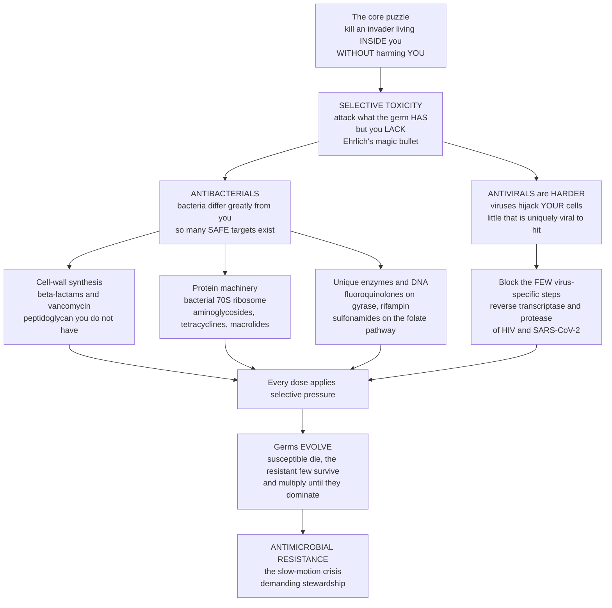

# 🦠 Antimicrobial and Antiviral Agents

> [!abstract] TL;DR
> How do you kill an invader living **inside** your body without harming **you**? The answer — the single principle organising this entire drug class — is **selective toxicity**: attack something the germ has but you lack. Bacteria have a rigid **cell wall** human cells do not, so **penicillin** sabotages wall-building and the bacterium bursts while you are unharmed; other **antibiotics** jam the bacterium's distinctive **70S ribosome** or its unique **enzymes**. The bigger the difference between pathogen and host, the safer the drug — which is why **antibacterials** are relatively forgiving, but **antivirals** are hard (viruses hijack *your* cells, leaving little that is uniquely theirs to attack) and **antifungals** are trickier still (fungi are eukaryotes, more host-like). And there is a dark twist unique to this class: the targets **fight back and evolve**. Every dose kills the susceptible germs and leaves the resistant few to multiply, driving **antimicrobial resistance (AMR)** — a slow-motion catastrophe in which our miracle drugs are losing their power. Understanding selective toxicity *and* the evolutionary arms race is understanding one of medicine's greatest triumphs and its most urgent threat.

---

## Intuition

**Analogy FIRST — the assassin who must not harm the hostage.** Imagine you must kill an intruder who is hiding *inside a crowded room full of your own family*. You cannot simply spray poison everywhere — you would kill everyone. You need a weapon that homes in on something *only the intruder* possesses: a particular uniform, a particular weakness, a door only they use. That is the whole problem of antimicrobial drugs, and its solution has a name coined by Paul Ehrlich a century ago — the **magic bullet**, a substance that strikes the germ and spares the host. The technical term is **selective toxicity**.

What does the germ have that you lack? A bacterium is a walled fortress: it wraps itself in a rigid mesh of **peptidoglycan** — a cell wall your own cells simply do not have. **Penicillin**, the drug that launched the antibiotic age in the 1940s and turned a scratched knee from a potential death sentence into a nuisance, works by jamming the machinery that builds that wall. The bacterium keeps growing, cannot reinforce its wall, and bursts from its own internal pressure. You are untouched, because you were never building a peptidoglycan wall. Other antibiotics exploit other differences: the bacterium's protein factory (a **70S ribosome**, subtly but crucially different from your **80S** one), or enzymes that make DNA or vitamins in ways your cells do not.

Now the crucial, disturbing twist. This is the only major drug class whose *targets are alive and evolving*. When you take an antibiotic, you do not kill every bacterium equally — you kill the **susceptible** ones and leave behind the rare **resistant** mutants, who now inherit the whole battlefield and multiply. Repeat this across millions of patients and billions of animals on farms, and you are running the largest natural-selection experiment in history — breeding **superbugs** faster than we can invent new drugs. And viruses expose the limit of the whole strategy: a virus is barely alive, hijacking *your* cells' machinery to copy itself, so there is almost nothing uniquely "viral" to poison. That is why **antivirals** are so much harder, and why they had to wait for us to find the *few* steps a virus does for itself — like the enzymes **HIV** and **SARS-CoV-2** use to copy their genomes and cut their proteins.

---

## How It Works

### Core mechanics

1. **Selective toxicity is the master principle.** A useful antimicrobial exploits a **biochemical difference** between pathogen and host: it inhibits or kills the microbe at concentrations that leave human cells unharmed. The *greater* the difference, the *safer* and more selective the drug. Bacteria (prokaryotes) differ enormously from human cells — different wall, different ribosome, different metabolic enzymes — so antibacterials have many safe targets. Fungi and parasites are **eukaryotes** (more host-like), and viruses use *host* machinery, so their drugs are harder to make selective and more prone to side effects.
2. **Antibacterials are classified by target.** Four great families of targets, each a difference bacteria have but you lack:
   - **Cell-wall synthesis** — the peptidoglycan wall. **Beta-lactams** (penicillins, cephalosporins, carbapenems) inhibit the transpeptidases ("penicillin-binding proteins") that cross-link the wall; **vancomycin** binds the wall building block itself. Humans have no wall, so these are among the safest drugs.
   - **Protein synthesis** — the bacterial **70S ribosome** (30S + 50S subunits), distinct from the human 80S. **Aminoglycosides** and **tetracyclines** hit the 30S; **macrolides**, **chloramphenicol**, and **clindamycin** hit the 50S.
   - **Nucleic-acid synthesis** — **fluoroquinolones** poison **DNA gyrase / topoisomerase**; **rifampin** blocks bacterial **RNA polymerase**.
   - **Metabolic (folate) pathway** — **sulfonamides** and **trimethoprim** block two sequential enzymes bacteria use to make folate from scratch. Humans get folate from diet, so this pathway is uniquely bacterial.
3. **Cidal vs static, spectrum, and MIC.** A drug is **bactericidal** if it kills the bacteria and **bacteriostatic** if it merely halts their growth so the immune system can finish the job. Its reach is its **spectrum** — **broad** (many species) or **narrow** (few). The key quantitative measure is the **minimum inhibitory concentration (MIC)** — the lowest drug concentration that stops visible growth; the **minimum bactericidal concentration (MBC)** is the lowest that kills.
4. **Antivirals are harder and target virus-specific steps.** Because a virus co-opts host machinery, the only safe targets are the *few* steps the virus does itself: **entry / fusion**, its own **polymerases** (**reverse transcriptase** in HIV, RNA polymerase blocked by **remdesivir**), its **protease** (which cuts viral polyproteins — the target of HIV and hepatitis-C and SARS-CoV-2 protease inhibitors), and its **integrase**. Because viruses mutate fast, antivirals are given as **combinations** (HIV **HAART**) so the virus cannot escape all drugs at once.
5. **Antifungals and antiparasitics exploit narrower gaps.** Fungi have **ergosterol** (not cholesterol) in their membranes and a **chitin/glucan** wall — targeted by **azoles** (block ergosterol synthesis) and **echinocandins** (block glucan synthesis). Antimalarials and antiparasitics hit organelles or pathways unique to the parasite. The smaller the host–pathogen gap, the more collateral toxicity.
6. **Resistance is evolution in fast-forward.** Under the **selective pressure** of a drug, susceptible microbes die and pre-existing or newly mutated **resistant** cells survive and dominate. Mechanisms: **enzymatic drug destruction** (beta-lactamases chew up penicillins), **target modification** (altered penicillin-binding protein in MRSA; ribosome methylation), **efflux pumps** that spit the drug out, and **reduced uptake**. Worse, resistance genes spread *between* bacteria — even different species — by **horizontal gene transfer** (plasmids). **Overuse and misuse** in medicine and agriculture accelerate the whole process.

### Flow



---

## Key Concepts

### Secondary (explain to a bright teenager)

- **The magic-bullet idea.** A good germ-killing drug is a magic bullet: it hits the germ and misses you. It works by attacking something the germ **has that you do not**.
- **Bacteria wear armour you lack.** Bacteria build a tough outer **cell wall**; your cells never do. **Penicillin** stops them building it, so the bacterium pops — and you are fine.
- **Other antibiotics jam different germ-only parts.** Some block the bacterium's slightly-different protein factory; some block enzymes only bacteria use. Because these parts are unique to the germ, the drug is fairly safe for you.
- **Viruses are harder to fight.** A virus breaks into your own cells and uses *your* machinery, so there is barely anything "virus-only" to attack. **Antivirals** have to target the few tools the virus brings itself — that is why we have many antibiotics but far fewer, trickier antivirals.
- **Germs fight back by evolving.** Every time we use an antibiotic, the tough survivors multiply. Over time the drug stops working. This is **antibiotic resistance** — and overusing antibiotics makes it happen faster.
- **Why it matters.** Antibiotics and antivirals are among medicine's greatest inventions — but resistance is quietly taking that power back, so we must use these drugs carefully.

### Undergraduate (needs some biology)

- **Selectivity scales with the host–pathogen gap.** Antibacterials are safest because prokaryotes differ most from human cells; **antifungals** and **antivirals** target more host-like biology and so carry more toxicity. This single idea predicts the relative side-effect burden across the whole class.
- **Antibacterials by mechanism.**
  - **Cell-wall inhibitors** — **beta-lactams** (penicillins, cephalosporins, carbapenems, monobactams) acylate the penicillin-binding proteins (transpeptidases) that cross-link peptidoglycan; **glycopeptides** (vancomycin) bind the D-Ala-D-Ala terminus of the wall precursor. Bactericidal; act on growing cells.
  - **Protein-synthesis inhibitors** — **30S**: aminoglycosides (bactericidal, cause misreading), tetracyclines (static, block tRNA entry). **50S**: macrolides, chloramphenicol, clindamycin, oxazolidinones (mostly static). Selectivity comes from the 70S-vs-80S ribosome difference.
  - **Nucleic-acid inhibitors** — fluoroquinolones inhibit DNA gyrase and topoisomerase IV (bactericidal); rifampin inhibits bacterial DNA-dependent RNA polymerase.
  - **Antimetabolites** — sulfonamides (mimic PABA, block dihydropteroate synthase) + trimethoprim (block dihydrofolate reductase) create a **sequential blockade** of folate synthesis; synergistic.
- **Cidal vs static, MIC vs MBC, spectrum.** Bactericidal drugs are preferred in immunocompromised hosts, endocarditis, and meningitis; bacteriostatic drugs rely on a working immune system. **MIC** guides susceptibility testing and breakpoints; **broad-spectrum** drugs are convenient but collaterally damage the microbiome and select resistance more widely than **narrow-spectrum** agents.
- **Antivirals by target.** Entry/fusion inhibitors; nucleoside/nucleotide and non-nucleoside **polymerase / reverse-transcriptase inhibitors** (HIV NRTIs/NNRTIs, hepatitis-B/C polymerase inhibitors, **remdesivir** for SARS-CoV-2); **protease inhibitors** (HIV, direct-acting antivirals for HCV, **nirmatrelvir** for COVID); **integrase inhibitors** (HIV). **Combination therapy** (HAART for HIV) raises the genetic barrier so no single mutation confers escape.
- **Resistance mechanisms.** (1) **Enzymatic inactivation** — beta-lactamases, aminoglycoside-modifying enzymes; (2) **target alteration** — MRSA's *mecA*-encoded PBP2a, macrolide-resistance ribosomal methylation, quinolone gyrase mutations; (3) **efflux pumps**; (4) **decreased permeability**. Spread by **vertical** inheritance and **horizontal gene transfer** (plasmids, transposons, integrons), which is why resistance leaps between species.

### Graduate (system-level / molecular)

- **Selective toxicity as a therapeutic-window statement.** Formally, an antimicrobial's usefulness is the ratio of the concentration toxic to the *host* over the concentration that inhibits the *pathogen* — a therapeutic index. Antibacterials enjoy a wide window (distinct targets); antifungals (ergosterol vs cholesterol is a subtle difference) and antivirals (host-borrowed machinery) have compressed windows, explaining nephro-, hepato-, and myelotoxicity patterns. The **azole vs polyene** contrast in antifungals is a selectivity story: amphotericin B binds ergosterol but cross-reacts with cholesterol, hence its notorious toxicity.
- **Pharmacodynamics: concentration- vs time-dependent killing.** Aminoglycosides and fluoroquinolones are **concentration-dependent** (efficacy tracks Cmax/MIC and AUC/MIC — favouring high, infrequent dosing and exploiting the **post-antibiotic effect**); beta-lactams are **time-dependent** (efficacy tracks the time the free concentration exceeds MIC — favouring frequent dosing or continuous infusion). PK/PD indices, not just MIC, drive rational regimens and breakpoints.
- **The evolutionary dynamics of resistance.** Resistance frequency rises when the drug imposes a selection coefficient favouring resistant variants. The **mutant selection window** — the concentration range above the MIC of susceptible cells but below the MIC of first-step mutants — is where resistant subpopulations are *preferentially amplified*; dosing to stay above it, and combination therapy, suppress emergence. **Fitness costs** of resistance can drive reversion when drug pressure is removed, the rationale behind cycling and stewardship, though **compensatory mutations** often erase the cost and lock resistance in.
- **Horizontal gene transfer and the resistome.** Conjugative **plasmids**, **integrons**, and **transposons** move resistance cassettes across species; the environmental **resistome** (soil, gut, wastewater) is a vast reservoir. Mobile genes such as *bla*NDM-1 (a carbapenemase) and *mcr-1* (plasmid-borne colistin resistance) spread globally within years, collapsing the "drug of last resort" strategy.
- **The MDR crisis and the empty pipeline.** **ESKAPE** pathogens, **MRSA**, **VRE**, **MDR/XDR tuberculosis**, and carbapenem-resistant **Enterobacterales (CRE)** now cause hundreds of thousands to millions of attributable deaths per year. Meanwhile the discovery pipeline has thinned — antibiotics are economically unattractive (short courses, held in reserve), a market failure prompting push/pull incentives. **Antimicrobial stewardship** (right drug, dose, duration; de-escalation; diagnostics) plus infection control and surveillance are the frontline response codified in the **WHO Global Action Plan on AMR**.
- **The antiviral triumphs and their logic.** HIV went from a death sentence to a chronic condition because **combination** antiretrovirals raise the mutational barrier beyond the virus's per-replication error supply; **hepatitis C** became *curable* (>95%) once direct-acting antivirals hit two or three independent viral targets at once. Both are selective-toxicity success stories built on virus-specific enzymes — and both encode the resistance lesson in their design: hit multiple independent targets so no single mutation escapes.

---

## Python Demo

```python
# Antimicrobial and antiviral agents, four illustrative pieces:
#   (a) RESISTANCE EVOLUTION  : a drug kills susceptible cells and selects resistant
#                               mutants that sweep the population over rounds of use;
#                               heavy/frequent use sweeps far faster than prudent use.
#   (b) KILL CURVE            : log bacterial count over time at several drug levels
#                               (below MIC -> growth; at MIC -> static; above -> killed).
#   (c) MIC / CIDAL-vs-STATIC : net growth rate vs drug concentration; the zero-crossing
#                               is the MIC (growth halted), further right is bactericidal.
#   (d) SELECTIVE TOXICITY    : microbe-kill curve vs host-toxicity curve for a HIGH-
#                               selectivity antibacterial (wide window) and a LOW-
#                               selectivity antifungal/antiviral (narrow window).
# All numbers are illustrative teaching values. Educational content, not medical advice.
import numpy as np
import matplotlib.pyplot as plt

fig, ax = plt.subplots(2, 2, figsize=(14, 10))

# ---------------------------------------------------------------------------
# (a) Resistance evolution / selection sweep
# Replicator update: fraction resistant f grows when the drug favours resistant cells.
# Each round of exposure multiplies the resistant:susceptible odds by exp(s).
def sweep(f0, s, rounds):
    f = np.zeros(rounds + 1)
    f[0] = f0
    for t in range(rounds):
        odds = (f[t] / (1 - f[t])) * np.exp(s)   # selection acts on the odds
        f[t + 1] = odds / (1 + odds)
    return f

rounds = 12
r = np.arange(rounds + 1)
heavy = sweep(f0=0.001, s=1.20, rounds=rounds)   # frequent/heavy use -> strong selection
light = sweep(f0=0.001, s=0.35, rounds=rounds)   # prudent stewardship -> weak selection

ax[0, 0].plot(r, heavy * 100, "o-", color="#c0392b", lw=2,
              label="Heavy / repeated use")
ax[0, 0].plot(r, light * 100, "s-", color="#27ae60", lw=2,
              label="Prudent stewardship")
ax[0, 0].axhline(50, color="grey", ls=":", lw=1)
ax[0, 0].set_xlabel("Rounds of antibiotic exposure")
ax[0, 0].set_ylabel("Resistant bacteria in population (%)")
ax[0, 0].set_title("(a) Resistance sweeps under drug selection")
ax[0, 0].set_ylim(0, 100)
ax[0, 0].legend(fontsize=9, loc="center right")

# ---------------------------------------------------------------------------
# Pharmacodynamic kill model (Emax): net specific rate as a function of drug
# concentration measured in MIC units. Growth mu_max, saturable killing Kmax.
mu_max, Kmax, EC50, H = 0.8, 3.0, 1.6, 2.0   # per hour; EC50 in MIC-ish units
def net_rate(conc):
    kill = Kmax * conc**H / (conc**H + EC50**H)
    return mu_max - kill

# ---------------------------------------------------------------------------
# (b) Kill curves: log10(CFU/mL) over time at several concentrations
t = np.linspace(0, 8, 200)                      # hours
N0 = 1e6                                         # starting cells/mL
levels = [0.0, 0.5, 1.0, 2.0, 4.0]               # multiples of a reference concentration
colors = plt.cm.coolwarm(np.linspace(0, 1, len(levels)))
for c, col in zip(levels, colors):
    rate = net_rate(c)
    N = N0 * np.exp(rate * t)
    ax[0, 1].plot(t, np.log10(N), lw=2, color=col, label=f"conc = {c:g} x")
ax[0, 1].axhline(np.log10(N0), color="grey", ls=":", lw=1)
ax[0, 1].set_xlabel("Time (hours)")
ax[0, 1].set_ylabel("log10 viable bacteria (CFU/mL)")
ax[0, 1].set_title("(b) Kill curve: growth below MIC, killing above")
ax[0, 1].legend(fontsize=8, loc="upper left")

# ---------------------------------------------------------------------------
# (c) MIC and bactericidal threshold from the net-rate curve
conc = np.linspace(0.01, 6, 400)
rate = net_rate(conc)
mic = conc[np.argmin(np.abs(rate))]              # net rate ~ 0  -> growth halted = MIC
ax[1, 0].plot(conc, rate, color="#2980b9", lw=2)
ax[1, 0].axhline(0, color="black", lw=1)
ax[1, 0].fill_between(conc, 0, rate, where=(rate > 0), color="#27ae60", alpha=0.25)
ax[1, 0].fill_between(conc, 0, rate, where=(rate < 0), color="#c0392b", alpha=0.25)
ax[1, 0].axvline(mic, color="purple", ls="--", lw=1.5)
ax[1, 0].text(mic + 0.1, mu_max * 0.6, f"MIC ~ {mic:.1f}", color="purple", fontsize=9)
ax[1, 0].text(0.3, mu_max * 0.5, "net growth\n(bacteriostatic\nnot yet reached)",
              fontsize=8, color="#1e6b3a")
ax[1, 0].text(3.6, -1.6, "net killing\n(bactericidal)", fontsize=8, color="#8e2b22")
ax[1, 0].set_xlabel("Drug concentration (MIC units)")
ax[1, 0].set_ylabel("Net bacterial growth rate (per hour)")
ax[1, 0].set_title("(c) MIC = where growth stops; beyond = killing")

# ---------------------------------------------------------------------------
# (d) Selective toxicity: therapeutic window = gap between killing the microbe
# and poisoning the host. Sigmoids on a log-dose axis.
dose = np.logspace(0, 3, 400)
def sig(d, d50, slope=6):
    return 1.0 / (1.0 + np.exp(-slope * (np.log10(d) - np.log10(d50))))

kill_microbe = sig(dose, 10)          # dose that kills the pathogen (shared efficacy)
tox_anti_bact = sig(dose, 300)        # host toxicity FAR away -> wide, safe window
tox_anti_fung = sig(dose, 28)         # host toxicity CLOSE   -> narrow, risky window

ax[1, 1].plot(dose, kill_microbe, color="#2c3e50", lw=2.5, label="Kills the microbe")
ax[1, 1].plot(dose, tox_anti_bact, color="#27ae60", lw=2,
              label="Host toxicity: antibacterial")
ax[1, 1].plot(dose, tox_anti_fung, color="#c0392b", lw=2, ls="--",
              label="Host toxicity: antifungal / antiviral")
ax[1, 1].fill_betweenx([0, 1], 10, 300, color="#27ae60", alpha=0.12)
ax[1, 1].fill_betweenx([0, 1], 10, 28, color="#c0392b", alpha=0.18)
ax[1, 1].set_xscale("log")
ax[1, 1].set_xlabel("Dose (log scale)")
ax[1, 1].set_ylabel("Fraction responding")
ax[1, 1].set_title("(d) Selective toxicity: wide vs narrow window")
ax[1, 1].legend(fontsize=8, loc="center left")

plt.tight_layout()
plt.savefig("antimicrobial_agents.png", dpi=120)
plt.show()

# Console sanity checks
print(f"(a) Resistant % after {rounds} rounds: heavy={heavy[-1]*100:.1f}%  "
      f"prudent={light[-1]*100:.1f}%")
print(f"(b) net rate at 0x conc = {net_rate(0.0):+.2f}/h (growth), "
      f"at 4x conc = {net_rate(4.0):+.2f}/h (killing)")
print(f"(c) MIC (net growth ~ 0) at ~ {mic:.2f} MIC units")
print("(d) Window: antibacterial 10->300 (wide, ~30x); "
      "antifungal/antiviral 10->28 (narrow, ~2.8x)")
```

**What it shows.** Panel **(a)** is the resistance crisis in miniature: starting from a rare 0.1% resistant fraction, each round of drug exposure kills susceptibles and lets the resistant odds grow, so resistance **sweeps** the population — dramatically faster under heavy, repeated use than under prudent stewardship. This is exactly why overusing antibiotics (and stopping a course early, which leaves partially-selected survivors) breeds resistance. Panel **(b)** is a classic **kill curve**: below the MIC the drug cannot overcome growth and the count *rises*; near the MIC the population is held **static**; above it the drug is **bactericidal** and the count falls. Panel **(c)** reads the **MIC** straight off the net-growth curve as the concentration where growth is halted, with net *killing* (the bactericidal regime) beyond it — the shaded green-to-red transition. Panel **(d)** is **selective toxicity** made visual: the same microbe-killing dose sits far below host toxicity for a broad-window **antibacterial** (safe), but the host-toxicity curve crowds right up against efficacy for a narrow-window **antifungal or antiviral** — the quantitative reason those drugs are harder to give safely.

---

## Real-World Applications

> **Penicillin and the beta-lactams — selective toxicity's founding triumph.** Fleming's 1928 mould and the wartime purification of **penicillin** gave medicine its first magic bullet: a drug that dismantles the bacterial peptidoglycan wall — a structure human cells lack — turning fatal **sepsis**, pneumonia, and wound infections into curable conditions. The beta-lactam family (amoxicillin, the cephalosporins, the carbapenems) remains the most-used antibiotic class on Earth. Its Achilles' heel is also the textbook resistance mechanism: bacterial **beta-lactamases** that hydrolyse the drug, countered by adding an inhibitor (amoxicillin **+ clavulanate**).

- **Combination antiretroviral therapy (HAART) for HIV.** No single antiviral holds HIV, whose reverse transcriptase makes errors on nearly every copy. Combining a **reverse-transcriptase inhibitor**, a **protease inhibitor** or **integrase inhibitor**, and a third agent raises the genetic barrier so high that the virus cannot mutate its way out of all three at once — converting a uniformly fatal disease into a managed chronic condition. A pure selective-toxicity design: every target is a virus-specific enzyme.
- **Curing hepatitis C.** Direct-acting antivirals (an NS5B **polymerase** inhibitor, an NS5A inhibitor, and an NS3/4A **protease** inhibitor, e.g. sofosbuvir-based regimens) attack three independent viral proteins simultaneously, achieving **cure rates above 95%** in 8–12 weeks — one of the great pharmacological achievements of the century, and again built on hitting multiple virus-specific steps to outrun resistance.
- **Remdesivir and nirmatrelvir for COVID-19.** SARS-CoV-2 handed antiviral designers two clean, virus-specific targets: its RNA-dependent RNA polymerase (blocked by **remdesivir**) and its main protease (blocked by **nirmatrelvir**, boosted with ritonavir). Both exploit steps the virus performs itself rather than borrowing from the host.
- **The AMR crisis — MRSA, CRE, and MDR-TB.** **MRSA** carries an altered penicillin-binding protein (PBP2a) that beta-lactams cannot bind; **carbapenem-resistant Enterobacterales (CRE)** carry mobile carbapenemases like NDM-1; **MDR/XDR tuberculosis** resists the frontline drugs, forcing long, toxic regimens. The **WHO** estimates AMR is associated with millions of deaths annually and could become a leading cause of death — driving global **antimicrobial stewardship** programs that ration, monitor, and de-escalate antibiotic use.

---

## Common Pitfalls

- **Taking antibiotics for viral illnesses.** Colds, most sore throats, and flu are viral; antibiotics do nothing against them because there is no bacterial cell wall or 70S ribosome to attack — but the useless exposure still selects for resistance in the patient's own bacterial flora. This is the single most common misuse driving AMR.
- **Believing you must never stop a course early — but for the right reason.** Stopping early can leave a partially-selected, less-susceptible survivor population (panel a's logic); yet emerging evidence shows *unnecessarily long* courses also over-select resistance. The real principle is **shortest effective duration**, set by evidence and stewardship — not folk rules in either direction.
- **Confusing bacteriostatic with cure.** A bacteriostatic drug only *halts* growth; clearance still depends on a competent immune system. In neutropenic, endocarditis, or meningitis patients, a **bactericidal** agent is needed — mismatching this costs lives.
- **Assuming broad-spectrum is always better.** Broad-spectrum drugs are convenient empirically but collaterally destroy the protective microbiome (opening the door to *C. difficile*) and select resistance across many species. Good practice is to **de-escalate** to the narrowest effective agent once the pathogen is identified.
- **Expecting antivirals to be as safe or as easy as antibiotics.** Because viruses use host machinery, antivirals have fewer targets and narrower windows; expecting an "antiviral penicillin" for every virus misreads the selective-toxicity constraint that makes them genuinely harder.
- **Treating resistance as the patient's problem, not a shared resource.** Resistance genes spread horizontally between people, animals, and the environment. Each unnecessary prescription (in clinics *or* on farms) erodes a **shared global resource** — the effectiveness of the drug for everyone.

---

## Related Concepts

This note sits in the **Drug Classes and Therapeutics** section and applies the principles from earlier notes to the special case of drugs whose targets are *other organisms*. Selective toxicity is the extreme end of the **therapeutic-window** and margin-of-safety logic developed in *Dose-Response and Therapeutic Index*, and antimicrobial pharmacodynamics (concentration- vs time-dependent killing) is a direct application of the receptor-and-occupancy ideas in *Pharmacodynamics (Drug Action)* and *Pharmacokinetics (ADME)*. Many antimicrobials are enzyme inhibitors — beta-lactamase-vulnerable transpeptidase blockers, viral protease and polymerase inhibitors — so they extend the mechanism covered in *Enzymes as Drug Targets*. The relentless failure of drugs to resistance, and the thin pipeline for new ones, is the antimicrobial face of *The Drug Discovery Pipeline*, while the toxicity that limits antifungals and antivirals connects to *Drug Safety, Pharmacovigilance and Adverse Effects*; the cancer-drug parallel of hitting fast-evolving targets appears in *Anticancer and Immunomodulatory Drugs*, and the contrast with drugs that act on the host's own physiology is drawn in *Autonomic and Cardiovascular Pharmacology*. (These sibling notes live in this Pharmacology vault and are referenced in prose.)

Cross-vault foundations (Glob-verified):

- [[Bacteria_and_Archaea]] — the prokaryotic cell wall, 70S ribosome, and metabolism that supply the pathogen-specific targets antibacterials exploit.
- [[Viruses]] — why viruses hijack host machinery, leaving so few virus-specific steps for antivirals to attack.
- [[Vaccines_and_Antibiotics]] — the biology-side companion on how antibiotics work and the rise of resistance; the prevention (vaccine) counterpart to treatment.
- [[Infectious_Disease_and_Host_Pathogen_Interaction]] — the clinical arena where these drugs are deployed, and how host defences and pathogen virulence set the stage.
- [[Natural_Selection_and_Adaptation]] — the exact evolutionary mechanism by which drug pressure selects resistant survivors that sweep the population.
- [[Host_Pathogen_and_Coevolution]] — the evolutionary-game view of the drug-versus-microbe arms race and why resistance is an evolving, not static, threat.
- [[Infectious_Disease_Vaccines_and_Immunity]] — the public-health frame: prevention, immunity, and why reducing infection burden also slows resistance.

---

## Review Questions

**Secondary**
1. Using the "assassin who must not harm the hostage" analogy, explain what **selective toxicity** means and why penicillin can burst a bacterium without hurting you.
2. Why do antibiotics not work on a cold or the flu, and how does taking them anyway make antibiotic resistance worse?

**Undergraduate**
3. Name the four main mechanistic classes of antibacterial and, for each, state the pathogen-specific target it exploits. Why is a cell-wall inhibitor safer for the host than an antifungal that targets the fungal membrane?
4. Distinguish **bactericidal** from **bacteriostatic** drugs and define the **MIC**. In which clinical situations does the cidal-vs-static distinction actually matter, and why?

**Graduate**
5. Explain the **mutant selection window** and how dosing strategy and **combination therapy** (as in HAART or hepatitis-C regimens) are designed to suppress the emergence of resistance. Tie your answer to the difference between per-replication mutation supply and the number of independent drug targets.
6. Antibacterials generally have a wide therapeutic window while antivirals and antifungals do not. Frame this as a selective-toxicity / therapeutic-index argument grounded in the biochemical distance between host and pathogen, and use it to predict where each class's characteristic toxicities come from.

---

## Sources

- Katzung, B. G. *Basic and Clinical Pharmacology.* McGraw-Hill — chapters on antimicrobial mechanisms, selective toxicity, and antimicrobial resistance.
- Ritter, J., et al. *Rang & Dale's Pharmacology.* Elsevier — antibacterial, antiviral, and antifungal drug classes and mechanisms of action and resistance.
- Brunton, L., et al. *Goodman & Gilman's The Pharmacological Basis of Therapeutics.* McGraw-Hill — chemotherapy of microbial diseases; antiretroviral and antiviral pharmacology.
- World Health Organization. *Global Action Plan on Antimicrobial Resistance* (2015) and subsequent AMR reports — the global-health framing, stewardship, and surveillance response.
- Ehrlich, P. — the origin of the "magic bullet" (*Zauberkugel*) concept of chemotherapy and selective toxicity (historical primary source).

---

#pharmacology #antibiotics #antivirals #selective-toxicity #antimicrobial-resistance
