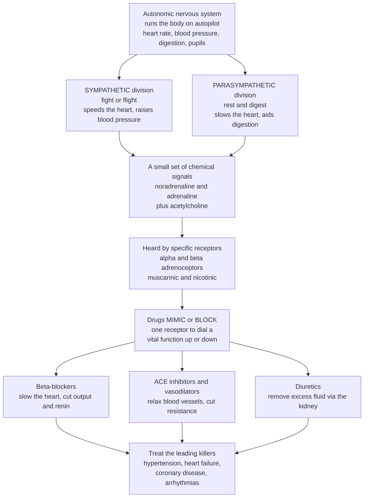

# ❤️ Autonomic and Cardiovascular Pharmacology

> [!abstract] TL;DR
> Your body runs on **autopilot** — heart rate, blood pressure, pupil size, digestion — under the **autonomic nervous system (ANS)**, which has two opposing modes: the **sympathetic** ("fight or flight" — speeds the heart, raises blood pressure) and the **parasympathetic** ("rest and digest" — slows the heart, aids digestion). This is a pharmacological goldmine because the whole system runs on just a **handful of chemical signals** — mainly **noradrenaline/adrenaline** (acting on **α and β adrenoceptors**) and **acetylcholine** (acting on **muscarinic and nicotinic** receptors) — so a drug that **mimics or blocks one receptor** can precisely dial a vital function up or down. This is exactly how much of **cardiovascular medicine** works. A **beta-blocker** blocks the sympathetic "speed-up" signal to the heart, slowing it and lowering blood pressure — one of the most-prescribed drug classes on Earth. Other classes relax blood vessels (**calcium-channel blockers, vasodilators, ACE inhibitors**), remove excess fluid (**diuretics**), interrupt the **renin–angiotensin** hormonal loop, or make the blood less sticky (**antithrombotics**) — all to treat the world's leading killers: **hypertension, heart failure, coronary disease, and arrhythmias**. This is the **S03 section opener**: understanding the autonomic "control knobs" and how each cardiovascular drug class turns them is the foundation of treating the most common chronic diseases in medicine.

---

## Intuition

**Analogy first — the body's autopilot and its control knobs.** Think of your body as a plane on autopilot for everything you never consciously fly: your heart doesn't wait for you to *decide* to beat faster when you sprint; your blood vessels tighten and loosen without a thought; your pupils widen in the dark on their own. That autopilot is the **autonomic nervous system**, and it has two pilots who push in opposite directions. One is the **sympathetic** pilot — the "fight or flight" pilot — who slams the throttle: heart pounding, blood pressure up, pupils wide, airways open, ready to run. The other is the **parasympathetic** pilot — "rest and digest" — who eases off: heart slowing, stomach churning through lunch, body conserving. At any moment your organs sit at the balance point between these two.

Here is why this is a **goldmine for drugs**: the two pilots don't shout complex instructions. They speak through a tiny vocabulary of **chemical words** — mostly **noradrenaline/adrenaline** for the sympathetic pilot and **acetylcholine** for the parasympathetic one — and each word is "heard" by a **specific receptor** on the target organ, like a specific button on a control panel. Because the vocabulary is small and each button controls a known function, a chemist can build a molecule that **presses a button** (an **agonist**, mimicking the signal) or **jams a button** so the real signal can't reach it (an **antagonist**, blocking it). Suddenly you have precise, reversible **control knobs** for the most vital functions in the body.

The flagship application is **cardiovascular medicine**. Blood pressure is set by three levers — how hard and fast the heart pumps, how tight the vessels are, and how much fluid is in the tank — and different drug classes grab different levers. A **beta-blocker** jams the sympathetic "speed up" button on the heart, so it beats slower and softer. A **vasodilator** or **calcium-channel blocker** loosens the vessels. A **diuretic** tells the kidney to drain fluid out of the tank. An **ACE inhibitor** cuts a hormonal wire (the renin–angiotensin system) that both tightens vessels and hoards fluid. Every one of these is a different knob on the same cardiovascular machine — and turning them correctly is how we treat hypertension, heart failure, and coronary disease, the diseases that kill more people than anything else.

---

## How It Works

### Core mechanics

1. **The ANS is a two-branch effector system.** Autonomic nerves leave the CNS and, via ganglia, reach the heart, vessels, glands, gut, bladder, and eye. The **sympathetic** branch is *adrenergic* — its postganglionic neurons release **noradrenaline (norepinephrine)**, and the adrenal medulla dumps **adrenaline** into the blood as a hormone. The **parasympathetic** branch is *cholinergic* — its postganglionic neurons release **acetylcholine (ACh)**. (Note: *all* autonomic ganglia and the sympathetic supply to sweat glands are cholinergic too — a detail with drug consequences.)
2. **A few transmitters, a few receptor subtypes.** Noradrenaline/adrenaline act on **adrenoceptors** — **α1** (vessel constriction), **α2** (a "brake" that shuts off further sympathetic output), **β1** (heart: faster, harder, plus kidney renin release), and **β2** (airway and vessel *relaxation*). Acetylcholine acts on **muscarinic** receptors (M1–M5; e.g., **M2** slows the heart, **M3** contracts smooth muscle and drives secretions) and **nicotinic** receptors (fast channels at ganglia and the neuromuscular junction).
3. **Drugs act at any step of the signal.** They can **mimic** the transmitter (agonists / *sympathomimetics* and *cholinomimetics*), **block** the receptor (antagonists / *sympatholytics* and *anticholinergics*), or change how much transmitter is around (e.g., **acetylcholinesterase inhibitors** stop ACh breakdown; reuptake and synthesis can be modulated too).
4. **Receptor-subtype selectivity is the targeting trick.** Because β1 sits mostly on the heart and β2 on the airway, a **β1-selective** blocker can slow the heart while largely sparing the lungs — this selectivity is *the* engineering lever that lets one transmitter system be dialed organ-by-organ.
5. **Cardiovascular therapy = turning the right cardiovascular knob.** Blood pressure obeys **BP ≈ cardiac output × systemic vascular resistance**, and cardiac output itself depends on **heart rate, contractility, and blood volume**. Each antihypertensive class targets a specific term: **beta-blockers** cut output and renin; **calcium-channel blockers / vasodilators** cut resistance; **ACE inhibitors / ARBs** cut both resistance and volume by interrupting the renin–angiotensin–aldosterone system; **diuretics** cut volume via kidney transporters.
6. **Beyond blood pressure.** The same target logic extends to **heart failure** (block the harmful neurohormonal cycle), **angina** (balance the heart's oxygen supply vs demand), **arrhythmias** (block Na⁺/K⁺/Ca²⁺ channels or β-receptors — the Vaughan-Williams classes), and **atherosclerotic disease** (**statins** on a cholesterol-making enzyme; **antithrombotics** on clotting).

### Flow



---

## Key Concepts

### Secondary Level

- **Autopilot, two modes.** The **autonomic nervous system** controls organs you don't consciously run. The **sympathetic** mode is "fight or flight" (heart faster, blood pressure up); the **parasympathetic** mode is "rest and digest" (heart slower, digestion on).
- **A tiny chemical vocabulary.** The two modes mostly speak with **adrenaline/noradrenaline** (sympathetic) and **acetylcholine** (parasympathetic), each heard by specific **receptors** on organs.
- **Drugs press or jam buttons.** A drug can **mimic** a signal (turn a function up) or **block** it (turn it down). A **beta-blocker** blocks the "speed up the heart" signal, so the heart slows and blood pressure falls.
- **Blood pressure has three levers.** How **hard/fast the heart pumps**, how **tight the vessels** are, and how much **fluid** is in the system. Different drugs pull different levers: some slow the heart, some relax vessels, some (diuretics) drain fluid.
- **Why it matters most.** These drugs treat the world's biggest killers — **high blood pressure, heart failure, and heart disease** — so understanding the "control knobs" is the foundation of everyday medicine.

### Undergraduate Level

- **The sympathetic (adrenergic) system.** Transmitter **noradrenaline** (and circulating **adrenaline**) act on adrenoceptors, each with a signature effect:
  - **α1** — vascular smooth-muscle **constriction** (raises resistance), also pupil dilation and bladder-neck tone.
  - **α2** — presynaptic and central; an **autoinhibitory brake** that reduces further sympathetic outflow (basis of central antihypertensives like clonidine).
  - **β1** — **heart**: increases rate (chronotropy) and force (inotropy); on the kidney it triggers **renin** release (feeding the RAAS).
  - **β2** — **relaxes** airway and some vascular smooth muscle (basis of β2-agonist asthma relievers).
- **The parasympathetic (cholinergic) system.** Transmitter **acetylcholine** acts on:
  - **Muscarinic** receptors (GPCRs, M1–M5): **M2** slows the heart; **M3** contracts gut/bronchial/bladder smooth muscle and drives glandular secretion; M1 in gut/CNS.
  - **Nicotinic** receptors (ligand-gated ion channels): fast transmission at **autonomic ganglia** and the **neuromuscular junction**.
- **Autonomic drug classes.**
  - **Adrenergic agonists (sympathomimetics)** — **adrenaline** (anaphylaxis, cardiac arrest), **α1 agonists** (decongestants, vasopressors like phenylephrine/noradrenaline in shock), **β2 agonists** (salbutamol for asthma).
  - **Adrenergic antagonists** — **α-blockers** (the "-osin" drugs, e.g., prazosin/doxazosin, for hypertension and prostatic obstruction) and the huge **beta-blocker** class (the "-olol" drugs).
  - **Cholinergic agonists** — direct (**pilocarpine** for glaucoma/dry mouth, **bethanechol** for bladder) and indirect **acetylcholinesterase inhibitors** (**neostigmine** for myasthenia/reversal; **donepezil** in Alzheimer's).
  - **Muscarinic antagonists (anticholinergics)** — **atropine** (bradycardia, organophosphate poisoning), **ipratropium/tiotropium** (COPD), and many others.
- **Cardiovascular pharmacology — antihypertensives by mechanism** (recall **BP ≈ CO × SVR**, **CO = HR × stroke volume**):
  - **Beta-blockers (β1)** — reduce heart **rate**, **contractility**, and **renin** → lower cardiac output (and long-term resistance). Cardioselective ("-olol": metoprolol, bisoprolol, atenolol) vs non-selective (propranolol).
  - **Calcium-channel blockers (CCBs)** — block **L-type Ca²⁺ channels**; *dihydropyridines* ("-dipine": amlodipine) act mainly on **vessels** (↓resistance); *non-dihydropyridines* (verapamil, diltiazem) also slow the **heart**.
  - **ACE inhibitors ("-pril") / ARBs ("-sartan")** — interrupt the **renin–angiotensin–aldosterone system (RAAS)**: less angiotensin II → less vasoconstriction (↓resistance) and less aldosterone → less salt/water retention (↓volume).
  - **Diuretics** — act on **kidney transporters** to excrete Na⁺ and water, cutting **volume**: **thiazides** (distal tubule), **loop** diuretics (furosemide, at the NKCC2 cotransporter), and **potassium-sparing / aldosterone antagonists** (spironolactone).
  - **Direct vasodilators & central agents** — hydralazine, sodium nitropruside (arterial/venous relaxation); **α2 agonists** (clonidine, methyldopa) that reduce central sympathetic outflow.
- **Heart failure therapy** interrupts the harmful **neurohormonal cycle**: **ACE inhibitors/ARBs**, **beta-blockers** (started low and up-titrated), **mineralocorticoid-receptor antagonists** (spironolactone/eplerenone), **diuretics** for congestion, plus newer **ARNI** (sacubitril/valsartan) and **SGLT2 inhibitors**.
- **Antianginals** balance myocardial **oxygen supply vs demand**: **nitrates** (venodilation → less preload → less wall stress), **beta-blockers** and **CCBs** (lower rate/contractility → less demand).
- **Antiarrhythmics — the Vaughan-Williams classes**: **I** = Na⁺-channel blockers, **II** = beta-blockers, **III** = K⁺-channel blockers (prolong repolarization, e.g., amiodarone), **IV** = Ca²⁺-channel blockers.
- **Atherosclerotic disease** — **statins** inhibit **HMG-CoA reductase** to lower LDL cholesterol; **antithrombotics** = **antiplatelets** (aspirin, clopidogrel) and **anticoagulants** (heparins, warfarin, DOACs) to prevent clots.

### Graduate Level

- **Subtype selectivity as an organ-targeting strategy.** β1-selectivity lets a blocker slow the failing/ischemic heart while largely sparing β2-mediated bronchodilation — clinically important in patients with airway disease. Selectivity is dose-dependent, not absolute, and is lost at high doses; α1-selective blockers avoid the reflex tachycardia of non-selective α-block because α2-mediated presynaptic feedback is preserved.
- **The RAAS as a therapeutic axis.** Renin (from β1-stimulated juxtaglomerular cells) → angiotensin I → **ACE** → angiotensin II (potent vasoconstrictor + aldosterone release + growth/remodeling signal). **ACE inhibitors** block conversion; **ARBs** block the **AT1** receptor downstream (avoiding the bradykinin-mediated **cough/angioedema** that ACE inhibition can cause because ACE also degrades bradykinin). **MRAs** and **ARNIs** (neprilysin inhibition raises protective natriuretic peptides) extend the axis.
- **Why beta-blockers help heart failure despite negative inotropy.** In chronic HF, sustained sympathetic overdrive is *toxic* — it drives arrhythmia, remodeling, and β-receptor downregulation. Blocking it improves survival, but because acute negative inotropy can decompensate a fragile ventricle, therapy is **started low and up-titrated**. This is the signature paradox of neurohormonal-blockade therapy: the mortality benefit comes from interrupting a maladaptive *chronic* loop, not from an acute hemodynamic push.
- **The baroreflex and reflex tachycardia.** Any drug that drops blood pressure unloads the baroreceptors, triggering a compensatory sympathetic surge (reflex tachycardia, fluid retention). Pure arterial vasodilators (hydralazine, dihydropyridines) provoke this, which is why they are often **paired with a beta-blocker and a diuretic** — a systems-level reason drug *combinations* work better than monotherapy.
- **Antiarrhythmic nuance and proarrhythmia.** The Vaughan-Williams scheme is a useful shorthand but oversimplified (many drugs have mixed actions; the Sicilian Gambit reframed it mechanistically). Class III K⁺-blockers prolong the QT interval and can paradoxically *cause* torsades de pointes — a reminder that ion-channel drugs sit on a narrow therapeutic margin.
- **Pharmacogenomics of cardiovascular drugs.** **CYP2D6** polymorphisms alter metoprolol clearance; **CYP2C19** loss-of-function reduces activation of the prodrug **clopidogrel** (weaker antiplatelet effect); **VKORC1/CYP2C9** variants dominate warfarin dosing. Genotype-aware dosing links [[Pharmacodynamics_Drug_Action]] and pharmacokinetics to individual response.
- **Mechanism-based adverse effects.** Nitrate **tolerance** (needs a nitrate-free interval), α-blocker **first-dose hypotension**, non-dihydropyridine CCB + beta-blocker **bradycardia/heart block** (both slow AV conduction), ACE-inhibitor **hyperkalemia** and teratogenicity — each flows predictably from the target, illustrating that "side effect" and "therapeutic effect" often share one receptor or channel.
- **Endpoints matter: symptoms vs mortality.** Some agents relieve symptoms (loop diuretics in HF, nitrates in angina) without extending life, while others (ACE inhibitors, beta-blockers, MRAs, SGLT2 inhibitors in HF; statins in atherosclerosis) reduce **mortality**. Distinguishing the two is central to evidence-based cardiovascular prescribing.

---

## Python Demo

```python
# Autonomic & cardiovascular pharmacology, two teaching visualizations:
#   (a) BETA-BLOCKER: how a competitive beta-adrenergic antagonist BLUNTS the
#       heart-rate response to rising sympathetic drive (stress / exercise).
#   (b) BLOOD-PRESSURE CONTROL MAP: BP ~= cardiac output (CO) x systemic vascular
#       resistance (SVR); each antihypertensive class lowers a DIFFERENT term.
# Illustrative teaching model with arbitrary consistent units.
# Educational science content, NOT individual medical or dosing advice.
import numpy as np
import matplotlib.pyplot as plt

fig, (ax1, ax2) = plt.subplots(1, 2, figsize=(14, 5.6))

# ---------------------------------------------------------------------------
# (a) Beta-blocker blunts the heart-rate response to sympathetic drive.
#     HR rises sigmoidally with beta-adrenergic 'drive'. A beta-blocker is a
#     COMPETITIVE antagonist: it raises the apparent EC50 by (1 + block/Kb),
#     so more drive is needed for the same rate -> the whole response is blunted.
def heart_rate(drive, hr_rest=60, hr_max=185, ec50=2.0, n=2.0, block=0.0, Kb=1.0):
    ec50_app = ec50 * (1 + block / Kb)
    return hr_rest + (hr_max - hr_rest) * drive**n / (ec50_app**n + drive**n)

drive = np.linspace(0, 12, 400)   # rising sympathetic drive: rest -> maximal exertion
for block, colour, label in [(0.0, "#c0392b", "No beta-blocker"),
                             (2.0, "#e67e22", "Low-dose beta-blocker"),
                             (6.0, "#2980b9", "High-dose beta-blocker")]:
    ax1.plot(drive, heart_rate(drive, block=block), color=colour, lw=2.4, label=label)

ax1.axhline(60, color="gray", ls=":", lw=1)
ax1.text(0.2, 62, "resting rate", fontsize=8, color="gray")
ax1.set_xlabel("Sympathetic drive  (stress / exercise, arb. units)")
ax1.set_ylabel("Heart rate  (beats / min)")
ax1.set_title("(a) A beta-blocker blunts the heart-rate response to stress")
ax1.legend(loc="lower right", fontsize=9)
ax1.grid(alpha=0.3)
ax1.annotate("blocker raises apparent EC50\n-> response shifts right & flattens",
             xy=(4, heart_rate(4, block=6)), xytext=(5.2, 95),
             fontsize=8, arrowprops=dict(arrowstyle="->"))

# ---------------------------------------------------------------------------
# (b) Blood-pressure control map:  MAP ~= CO x SVR.
#     CO depends on heart rate/contractility AND blood volume (preload).
#     Each drug class reduces a specific term -> the SAME goal by different knobs.
CO0, SVR0 = 6.0, 18.0            # baseline (untreated hypertensive), arbitrary units
MAP0 = CO0 * SVR0               # = 108

classes = [
    ("Baseline\n(untreated)",     CO0,       SVR0,       "#7f8c8d", ""),
    ("Beta-\nblocker",            CO0*0.80,  SVR0,        "#2980b9", "lowers OUTPUT (rate/renin)"),
    ("Diuretic",                  CO0*0.85,  SVR0,        "#16a085", "lowers VOLUME (preload)"),
    ("CCB /\nvasodilator",        CO0,       SVR0*0.78,   "#27ae60", "lowers RESISTANCE (SVR)"),
    ("ACE inhib.\n/ ARB",         CO0*0.94,  SVR0*0.85,   "#8e44ad", "lowers RESISTANCE + VOLUME"),
]
names = [c[0] for c in classes]
maps  = [c[1] * c[2] for c in classes]
cols  = [c[3] for c in classes]

bars = ax2.bar(names, maps, color=cols)
ax2.axhline(MAP0, color="#c0392b", ls="--", lw=1.2)
ax2.text(-0.45, MAP0 + 1, "untreated level", color="#c0392b", fontsize=8, ha="left")
for bar, c in zip(bars[1:], classes[1:]):
    ax2.text(bar.get_x() + bar.get_width()/2, bar.get_height() + 1.5, c[4],
             ha="center", va="bottom", fontsize=6.6, rotation=90)
ax2.set_ylabel("Mean arterial pressure  (CO x SVR, arb. units)")
ax2.set_title("(b) BP = CO x SVR: each class targets a different term")
ax2.set_ylim(0, MAP0 * 1.28)
ax2.tick_params(axis="x", labelsize=7.5)

plt.tight_layout()
plt.savefig("autonomic_cardiovascular_pharmacology.png", dpi=120)
plt.show()

# Console summary
print(f"Baseline MAP = {MAP0:.0f}  (CO={CO0} x SVR={SVR0})")
for c in classes[1:]:
    m = c[1] * c[2]
    print(f"{c[0].splitlines()[0]:12s} MAP={m:6.1f}  "
          f"({100*(m-MAP0)/MAP0:+5.0f}% vs baseline)  via {c[4]}")
```

**What it shows.** Panel **(a)** is the beta-blocker in one picture: as sympathetic drive climbs (imagine walking up to a sprint), an unblocked heart accelerates steeply toward its maximum, but a beta-blocker acts as a *competitive antagonist* that raises the apparent EC50 — the curve slides right and flattens, so the same stress produces a much smaller rate rise (a **blunted** response). This is precisely why beta-blockers protect an ischemic or failing heart and lower exertional blood pressure. Panel **(b)** is the antihypertensive **drug-class map**: mean arterial pressure is the product **CO × SVR**, and the bars show that four different classes reach the *same* lower pressure by grabbing *different* terms — beta-blockers and diuretics work on the **output/volume** side, CCBs and vasodilators on the **resistance** side, and ACE inhibitors/ARBs on **both** — the mechanistic reason clinicians combine classes rather than simply maxing out one.

---

## Real-World Applications

> **Example — beta-blockers, one of the most-prescribed classes on Earth.** Metoprolol and bisoprolol are **β1-selective competitive antagonists**: they sit in adrenaline's cardiac lock without turning it, shielding the heart from sympathetic "speed-up" signals. This lowers heart rate, contractility, and renin release — which is why the same molecule treats **hypertension**, reduces angina by cutting oxygen **demand**, controls **arrhythmias** (Vaughan-Williams Class II), and — started low and up-titrated — improves survival in **heart failure** by interrupting toxic chronic sympathetic overdrive. One receptor block, four diseases.

- **Adrenaline in anaphylaxis.** A non-selective adrenergic **agonist** that simultaneously constricts vessels (α1, restoring blood pressure), opens airways (β2), and supports the heart (β1) — the textbook case of *mimicking* the sympathetic signal to reverse a life-threatening collapse.
- **ACE inhibitors / ARBs for hypertension and heart failure.** Lisinopril and losartan interrupt the **renin–angiotensin system**, lowering vascular resistance and salt/water retention; in heart failure and diabetic kidney disease they also slow remodeling — a case where blocking a *hormonal* enzyme/receptor, not an autonomic one, is disease-modifying.
- **Calcium-channel blockers.** Amlodipine (a dihydropyridine) relaxes arterial smooth muscle to drop resistance for hypertension; verapamil/diltiazem also slow AV conduction to control heart rate in atrial fibrillation — the same **L-type Ca²⁺ channel** target, different tissue emphasis.
- **Diuretics.** Furosemide (a loop diuretic acting on the renal **NKCC2** transporter) rapidly offloads fluid in acute heart failure and pulmonary edema; thiazides are first-line for chronic hypertension — the "drain the tank" lever acting on kidney transporters.
- **Statins and antithrombotics for atherosclerotic disease.** Atorvastatin inhibits **HMG-CoA reductase** (an enzyme target) to lower LDL and cut heart attacks and strokes; aspirin and clopidogrel blunt **platelet** activation and DOACs inhibit clotting factors — targeting hemostasis to prevent the thrombosis that ends in myocardial infarction.

---

## Common Pitfalls

- **Confusing "selective" with "specific."** A "β1-selective" (cardioselective) blocker is *relatively* selective at ordinary doses but loses selectivity at high doses, where it can also block β2 and provoke bronchospasm. Selectivity is a dose-dependent ratio, not an on/off guarantee.
- **Forgetting the baroreflex fights back.** Give a pure arterial vasodilator alone and blood pressure falls transiently, but the unloaded baroreceptors trigger reflex **tachycardia and fluid retention** that erode the effect — the reason vasodilators are paired with a beta-blocker and a diuretic. Ignoring the reflex predicts the wrong result.
- **Treating "side effect" as separate from mechanism.** The ACE-inhibitor **cough/angioedema** (from bradykinin accumulation), the α-blocker **first-dose hypotension**, and the verapamil-plus-beta-blocker **bradycardia** all flow from the *same* target that gives the benefit. Adverse effects are usually mechanism, not mystery.
- **Assuming symptom relief equals survival benefit.** Loop diuretics relieve congestion and nitrates relieve angina, but neither prolongs life; ACE inhibitors, beta-blockers, MRAs, and SGLT2 inhibitors in heart failure do. Conflating the two categories leads to under-using the mortality-reducing drugs.
- **Overtrusting the Vaughan-Williams boxes.** Real antiarrhythmics have mixed actions, and Class III agents can *cause* arrhythmia (QT prolongation → torsades). The classification is a mnemonic, not a mechanism-complete map.
- **Ignoring pharmacogenomic variation.** Clopidogrel is a *prodrug* that CYP2C19 poor-metabolizers cannot fully activate (weaker antiplatelet effect), and warfarin dosing swings with VKORC1/CYP2C9 genotype. Assuming "one dose fits all" for these drugs is a recognized failure mode.

---

## Related Concepts

This note is the **S03 section opener — Drug Classes and Therapeutics** — and it maps drug classes onto the autonomic and cardiovascular targets that the rest of this section explores in prose. Its companion openers cover the other great therapeutic domains: **Antimicrobial and Antiviral Agents** (drugging pathogens rather than our own receptors), **CNS and Psychopharmacology** (the *central* transmitters, some shared with the ANS), and **Endocrine and Metabolic Pharmacology** (the hormonal axes, including the RAAS and aldosterone that cardiovascular drugs interrupt). The *target biology* underneath these classes is developed in the S02 notes **Receptors and Signal Transduction as Targets** (the α/β adrenoceptors and muscarinic GPCRs that autonomic drugs bind) and **Ion Channels and Transporters as Targets** (the L-type Ca²⁺ channels of CCBs, the Na⁺/K⁺ channels of antiarrhythmics, and the kidney transporters of diuretics). Those sibling notes are referenced in prose because they share this vault section.

Cross-vault foundations (Glob-verified):

- [[Autonomic_Nervous_System]] — the neuroscience of the sympathetic/parasympathetic divisions, ganglia, and transmitters that every autonomic drug modulates; this note is the *pharmacology* of that anatomy.
- [[Synaptic_Transmission_and_Neurotransmitters]] — how noradrenaline and acetylcholine are synthesized, released, and cleared at the synapse; the steps where agonists, antagonists, and esterase inhibitors intervene.
- [[Ion_Channels_and_Receptor_Pharmacology]] — the receptor and channel biophysics (GPCRs, ligand-gated and voltage-gated channels) that make adrenoceptors, muscarinic receptors, and Ca²⁺/Na⁺/K⁺ channels druggable targets.
- [[Pharmacodynamics_Drug_Action]] — the agonist/antagonist, potency/efficacy, and competitive-antagonism grammar that explains *how* a beta-blocker blunts the heart-rate curve.
- [[Cardiovascular_Pathophysiology]] — the disease mechanisms (remodeling, ischemia, neurohormonal activation) that these drug classes are designed to reverse or arrest.
- [[Hypertension_and_Vascular_Disease]] — the pathophysiology of high blood pressure that antihypertensives (BP = CO × SVR) directly target term-by-term.
- [[Heart_Failure_and_Arrhythmias]] — the neurohormonal cycle and rhythm disturbances treated by ACE inhibitors, beta-blockers, MRAs, and the Vaughan-Williams antiarrhythmics.
- [[The_Circulatory_and_Respiratory_Systems]] — the underlying physiology of cardiac output, vascular tone, and blood volume that define the levers cardiovascular drugs pull.
- [[Hemostasis_Thrombosis_and_Bleeding_Disorders]] — the clotting biology that antithrombotics (antiplatelets, anticoagulants) modulate to prevent the thrombosis behind heart attacks and strokes.

---

## Review Questions

**Secondary**
1. The autonomic nervous system has two opposing modes. Name them, say which one "speeds up" the heart and which "slows it down," and explain in plain language how a beta-blocker uses this to lower blood pressure.
2. Blood pressure depends on three things: how the heart pumps, how tight the vessels are, and how much fluid is in the body. Match each of these to one drug idea (slowing the heart, relaxing vessels, draining fluid).

**Undergraduate**
3. Using **BP ≈ cardiac output × systemic vascular resistance**, explain *which term* each of the following lowers and *why*: a beta-blocker, a dihydropyridine calcium-channel blocker, a thiazide diuretic, and an ACE inhibitor. Why might a clinician combine classes from different terms?
4. Contrast a **β1-selective** and a **non-selective** beta-blocker. Give one clinical situation where selectivity matters and explain the receptor reason.

**Graduate**
5. Beta-blockers acutely *reduce* the heart's contractility, yet they *improve survival* in chronic heart failure. Explain this apparent paradox in terms of the neurohormonal cycle, and why the drug is started at a low dose and up-titrated slowly.
6. A patient on hydralazine (a direct arterial vasodilator) develops tachycardia and fluid retention that blunt the antihypertensive effect. Explain the **baroreflex** mechanism responsible and design a rational three-drug combination that neutralizes each compensatory response, naming the target each drug acts on.

---

## Sources

- Katzung BG, Vanderah TW (eds). *Basic & Clinical Pharmacology* — Sections "Autonomic Drugs" and "Cardiovascular-Renal Drugs." McGraw Hill / AccessMedicine. https://accessmedicine.mhmedical.com/book.aspx?bookid=2988
- Ritter JM, Flower R, Henderson G, et al. *Rang & Dale's Pharmacology* — "The Autonomic Nervous System," "Noradrenergic and Cholinergic Transmission," and "The Heart / Vascular System" chapters. Elsevier. https://www.elsevier.com/books/rang-and-dales-pharmacology/ritter/978-0-7020-7448-6
- Brunton LL, Knollmann BC (eds). *Goodman & Gilman's The Pharmacological Basis of Therapeutics* — "Neurotransmission: the Autonomic and Somatic Motor Nervous Systems" and the cardiovascular drug sections. McGraw Hill. https://accessmedicine.mhmedical.com/book.aspx?bookid=2189
- Opie LH, Gersh BJ (eds). *Drugs for the Heart.* Elsevier — mechanism-based reference on beta-blockers, ACE inhibitors/ARBs, calcium antagonists, diuretics, antiarrhythmics, and antithrombotics. https://www.elsevier.com/books/drugs-for-the-heart/opie/978-1-4557-3322-4
- Vaughan Williams EM. "Classification of antiarrhythmic drugs." In *Symposium on Cardiac Arrhythmias* (1970); and later revisions — the origin of the Class I–IV antiarrhythmic scheme.

---

#pharmacology #autonomic #cardiovascular #beta-blockers #antihypertensives
