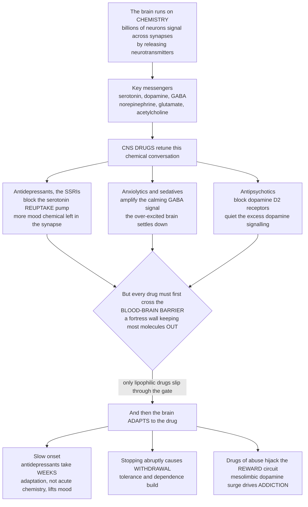

# 🧠 CNS and Psychopharmacology

> [!abstract] TL;DR
> **The brain runs on chemistry, and CNS drugs work by retuning the chemical conversation between neurons.** Billions of neurons talk across tiny gaps (**synapses**) by squirting **neurotransmitters** — serotonin, dopamine, GABA, norepinephrine, glutamate, acetylcholine. Psychiatric and neurological drugs nudge this conversation in a handful of ways: **antidepressants** (the **SSRIs/SNRIs**) block the pump that *removes* serotonin/norepinephrine (**reuptake inhibition**), leaving more messenger in the synapse; **anxiolytics and sedatives** (**benzodiazepines**) amplify the brain's main "calm-down" signal, **GABA**; **antipsychotics** block **dopamine D2** receptors to quiet excess dopamine signalling; **mood stabilizers** (lithium, valproate) even out bipolar swings; **anticonvulsants** damp runaway firing via **ion channels**; **anti-Parkinson** drugs (L-DOPA) *replace* lost dopamine; **stimulants** boost dopamine/norepinephrine for ADHD. Two wrinkles set CNS drugs apart from all others. First, a drug must cross the **blood-brain barrier (BBB)** — a fortress wall that keeps most molecules *out* — so it needs the right lipophilicity to even reach its target. Second, the brain **adapts**: use a drug long enough and receptors and circuits recalibrate — which is why antidepressants take **weeks** to work, why stopping some drugs triggers **withdrawal**, and why drugs of abuse hijack the brain's **reward** chemistry (mesolimbic dopamine) into **addiction**. Modulating serotonin, dopamine, and GABA signalling while crossing the brain's defences and reckoning with its slow adaptations is the pharmacological basis for treating depression, anxiety, psychosis, epilepsy, Parkinson's, and pain — and for understanding addiction.

## Intuition — analogy first

Picture the brain as an unimaginably vast switchboard where billions of operators (**neurons**) never touch. To pass a message, an operator **squirts a chemical** — a **neurotransmitter** — across a tiny gap to the next operator, who catches it on a **receptor** and decides whether to fire. The whole of thought, mood, movement, and memory is this chemical chatter. Different messengers carry different moods of message: **serotonin** and **norepinephrine** colour mood and arousal, **dopamine** drives motivation, reward, and movement, **GABA** is the master "**quiet down**" signal, and **glutamate** the master "**speak up**" signal.

Now the trick. If a message-chemical is running low, you don't have to manufacture more — you can just **stop the cleanup crew** that vacuums it back up. That is exactly how the most common antidepressants work: an **SSRI** jams serotonin's **reuptake pump**, so each squirt lingers longer and the signal builds. If the brain is running too **hot** — anxiety, a seizure, insomnia — you turn up the master quiet-down knob: **benzodiazepines** make **GABA** work harder, and the brain settles. If dopamine signalling is running too loud — the delusions and hallucinations of psychosis — you **block the dopamine keyholes** with an **antipsychotic**.

Two things make brain drugs uniquely hard. First, the brain lives behind a **fortress wall** — the **blood-brain barrier** — that turns away most molecules in the bloodstream. Only drugs with the right greasy, fat-soluble character slip through the gate, so *reaching* the target is half the battle. Second, the brain is not a passive machine but a **self-adjusting** one: flood it with extra serotonin and, over weeks, it **recalibrates** its receptors and rewires its circuits. That slow recalibration — not the instant chemical change — is what actually lifts mood, which is why antidepressants take **weeks** to work. The same adaptation, run in reverse, is why stopping a drug abruptly can cause **withdrawal**, and why an addictive drug that repeatedly floods the **reward** circuit trains the brain to crave it. Catch the messenger, tune the knob — but first get past the wall, and then live with the fact that the brain tunes back.

---

## How It Works

**Core mechanics.** (1) At a synapse a neuron **releases** a neurotransmitter, which crosses the gap and **binds receptors** on the next neuron, then is cleared by **reuptake** (transporter pumps) or **enzymatic breakdown**. (2) A CNS drug intervenes at one of these steps — it can **block reuptake** (raising synaptic messenger, as SSRIs/SNRIs do), **block a receptor** (antagonist — antipsychotics on dopamine D2), **enhance a receptor** (positive allosteric modulator — benzodiazepines on GABA-A), **block breakdown** (MAO inhibitors, cholinesterase inhibitors), **replace a lost messenger** (L-DOPA → dopamine), or **modulate ion channels** (many anticonvulsants). (3) But the molecule must first cross the **blood-brain barrier**, which demands sufficient **lipophilicity** (and evasion of efflux pumps like P-glycoprotein) to enter the CNS at all. (4) The **acute** biochemical change is fast (seconds to hours), but the **clinical** benefit often lags because it depends on **slow adaptive responses** — receptor down-/up-regulation and neuroplastic remodelling (new synapses, changed gene expression, BDNF). (5) Those same adaptations produce **tolerance**, **dependence**, and **withdrawal** on chronic use — and, for drugs of abuse acting on the **mesolimbic dopamine** reward circuit, the neuroadaptations of **addiction and craving**.



---

## Key Concepts / Details

### Secondary Level

- **The brain signals with chemicals.** Neurons pass messages by releasing **neurotransmitters** across a gap; drugs for the brain work by changing how much of a messenger is around or how strongly it acts.
- **Antidepressants (SSRIs) leave more serotonin around.** They **block the pump** that removes serotonin from the synapse, so the "mood messenger" lingers and the signal strengthens.
- **Anti-anxiety drugs turn up the "calm" signal.** **Benzodiazepines** boost **GABA**, the brain's main quiet-down chemical — useful for anxiety, insomnia, and seizures, but habit-forming.
- **Antipsychotics turn down dopamine.** Psychosis is linked to too much **dopamine** signalling, so these drugs **block dopamine receptors**.
- **The brain has a wall.** The **blood-brain barrier** keeps most substances out of the brain, so only certain drugs — the greasy, fat-soluble ones — even get in.
- **The brain adjusts.** Take a drug long enough and the brain **recalibrates** — which is why antidepressants take **weeks** to help, why quitting some drugs causes **withdrawal**, and why addictive drugs can take over the brain's **reward** system.

### Undergraduate Level

**CNS drug principles.** Almost every psychiatric and neurological drug acts on a **neurotransmitter system** at one of a few points in the synaptic life-cycle: **synthesis** (L-DOPA feeds dopamine synthesis), **storage/release**, **receptor** binding (agonist, antagonist, or allosteric modulator), **reuptake** by transporters (SERT, NET, DAT), or **enzymatic breakdown** (MAO, acetylcholinesterase). Getting there requires crossing the **blood-brain barrier**: tight endothelial junctions plus efflux transporters mean a CNS drug generally needs to be **small and lipophilic** (and not a good P-glycoprotein substrate). And uniquely, the therapeutically important effects often follow **slow adaptive/neuroplastic** changes rather than the acute biochemistry — the root of **delayed onset**, and, in reverse, of **tolerance, dependence, and withdrawal**.

**The major classes:**

- **Antidepressants.** **SSRIs** (fluoxetine, sertraline, escitalopram) block **serotonin reuptake** at **SERT**; **SNRIs** (venlafaxine, duloxetine) block serotonin *and* **norepinephrine** reuptake (NET). Older classes: **tricyclics** (TCAs — reuptake blockers with more off-target antimuscarinic/antihistamine/cardiac effects) and **MAO inhibitors** (block monoamine breakdown; dangerous **tyramine "cheese" reactions** and serotonin-syndrome risk). Newer agents include bupropion (dopamine/NE) and mirtazapine. Central puzzle: reuptake block raises synaptic serotonin within *hours*, yet mood lifts over *weeks* — the classic **monoamine hypothesis** is incomplete, and **neuroplasticity/BDNF** theories explain the lag (and are echoed by the rapid action of ketamine on glutamate).
- **Anxiolytics and sedative-hypnotics.** **Benzodiazepines** (diazepam, lorazepam, alprazolam) are **positive allosteric modulators of the GABA-A** ion-channel receptor — they don't open the channel themselves but make GABA's inhibitory chloride current stronger, calming anxiety, inducing sleep, and stopping seizures. Downsides: **tolerance, dependence, withdrawal** (including seizures on abrupt stop), and additive respiratory depression with alcohol/opioids. Related: "Z-drugs" (zolpidem), barbiturates (older, more dangerous), and buspirone (a 5-HT1A partial agonist without the dependence).
- **Antipsychotics.** **Typicals** (haloperidol, chlorpromazine) block **dopamine D2** receptors; efficacy against positive symptoms tracks D2 blockade, but blocking D2 in the **nigrostriatal** pathway causes **extrapyramidal symptoms (EPS)** and tardive dyskinesia, and in the tuberoinfundibular pathway raises prolactin. **Atypicals** (risperidone, olanzapine, quetiapine, clozapine, aripiprazole) add **serotonin 5-HT2A** antagonism (or, for aripiprazole, D2 *partial* agonism), with fewer movement effects but metabolic side effects; **clozapine** is uniquely effective in refractory schizophrenia but requires monitoring for agranulocytosis.
- **Mood stabilizers.** **Lithium** (still first-line for bipolar; narrow **therapeutic index**, acts on second-messenger systems such as inositol/GSK-3) and **anticonvulsants** used as stabilizers (valproate, lamotrigine, carbamazepine).
- **Anti-seizure / anticonvulsants.** Mechanisms cluster into **Na+ channel blockade** (phenytoin, carbamazepine, lamotrigine), **Ca2+ channel modulation** (ethosuximide; gabapentin/pregabalin on the α2δ subunit), and **GABA enhancement** (benzodiazepines, phenobarbital, tiagabine, vigabatrin) — all ways to damp excessive, synchronized firing.
- **Anti-Parkinson.** Parkinson's is loss of nigrostriatal **dopamine** neurons, so treatment is **dopamine replacement**: **L-DOPA** (levodopa, a precursor that *can* cross the BBB where dopamine cannot, given with carbidopa to block peripheral conversion), dopamine agonists, and MAO-B/COMT inhibitors that slow dopamine breakdown.
- **Stimulants.** **Methylphenidate** and **amphetamines** raise synaptic **dopamine and norepinephrine** (reuptake block and/or release) — used in **ADHD** and narcolepsy; abuse potential because they also act on reward circuitry.
- **Dementia drugs.** **Cholinesterase inhibitors** (donepezil, rivastigmine) block breakdown of **acetylcholine**, and **memantine** modulates **NMDA/glutamate** — modest symptomatic help in Alzheimer's. **General anaesthetics** are covered with the analgesics/anaesthetics sibling note.

**Drugs of abuse and addiction.** Opioids, stimulants (cocaine, amphetamine), alcohol, nicotine, and cannabis differ chemically but converge on one circuit: they raise **dopamine in the mesolimbic reward pathway** (VTA → nucleus accumbens), producing reinforcement far stronger than natural rewards. Repeated use drives **neuroadaptations** — **tolerance** (the same dose does less), **dependence** (the brain now needs the drug to feel normal), and **craving** — that outlast the drug. Addiction **pharmacotherapy** exploits the same receptors: **agonist/substitution therapy** (methadone, buprenorphine for opioids; nicotine replacement), **antagonists** (naltrexone; naloxone to reverse overdose), and aversive or modulating agents (disulfiram, acamprosate for alcohol).

### Graduate Level

- **Beyond the monoamine hypothesis.** SSRIs raise synaptic serotonin acutely, yet antidepressant onset lags by weeks — the temporal mismatch that sinks a purely "low-serotonin" account. Convergent evidence points to **downstream neuroplasticity**: 5-HT1A **autoreceptor desensitization** (restoring firing after initial suppression), increased **BDNF**, hippocampal neurogenesis, and synaptic remodelling. The rapid antidepressant action of **ketamine** (an NMDA antagonist that triggers a glutamate surge and fast synaptogenesis) is the sharpest evidence that plasticity, not acute monoamine level, is the therapeutic substrate.
- **Receptor occupancy and PET.** For antipsychotics, **striatal D2 occupancy** of roughly 65-80% (measurable by **PET**) predicts antipsychotic response, with EPS emerging above ~80% — a quantitative link between molecular target engagement and both efficacy and toxicity. Atypicals' looser, more rapidly dissociating D2 binding (the "fast-off" hypothesis) plus 5-HT2A antagonism underlies their lower EPS liability.
- **The BBB as a design constraint and target.** CNS penetration is engineered via lipophilicity, molecular weight, and hydrogen-bonding limits, and by avoiding **P-glycoprotein / BCRP efflux**. The barrier also explains clever prodrug strategies: **L-DOPA** crosses via the **LAT1** amino-acid transporter and is decarboxylated to dopamine *inside* the CNS, and peripheral decarboxylase inhibition (carbidopa) keeps the conversion central, cutting peripheral side effects.
- **Allosteric pharmacology of GABA-A.** Benzodiazepines bind the α/γ interface and increase channel **opening frequency**; barbiturates increase opening **duration** and, at high dose, open the channel directly — the mechanistic reason barbiturates have a far narrower safety margin. Subtype selectivity (α1 sedation vs α2/α3 anxiolysis) is an active target for "next-generation" anxiolytics that separate anxiolysis from sedation and dependence.
- **Dependence vs addiction — distinct phenomena.** **Physical dependence** (adaptive tolerance and a withdrawal syndrome) is a normal, expected neuroadaptation that can occur with non-addictive drugs (e.g., abrupt SSRI or beta-blocker cessation). **Addiction** is compulsive use despite harm, driven by reward-circuit and prefrontal-control pathology. Conflating them drives both under-treatment of pain and misreading of discontinuation syndromes.
- **Allostasis and the dark side of reward.** Chronic drug exposure shifts the reward set-point (Koob & Le Moal's **allostatic** model): the mesolimbic dopamine "high" attenuates while anti-reward/stress systems (CRF, dynorphin) sensitize, so use is increasingly driven by **negative reinforcement** (escaping withdrawal dysphoria) rather than euphoria — reframing relapse as a brain-state problem, not a moral failing.
- **Pharmacogenomics of CNS drugs.** **CYP2D6** and **CYP2C19** polymorphisms markedly alter exposure to many antidepressants and antipsychotics (poor vs ultrarapid metabolizers), and **HLA-B*15:02** predicts carbamazepine-induced Stevens-Johnson syndrome — concrete cases where genotype-guided dosing matters (the personalized-dosing sibling note).

---

## Python Demo

```python
# CNS & Psychopharmacology:
#  (a) NEUROTRANSMITTER MODULATION -- an SSRI blocks the serotonin REUPTAKE pump.
#      Model synaptic serotonin as tonic release balanced by reuptake clearance:
#          dC/dt = R - k*C   ->   steady state C_ss = R/k.
#      Blocking reuptake lowers k, so serotonin ACCUMULATES to a higher plateau.
#  (b) DELAYED ONSET / ADAPTATION -- the acute biochemical change is fast (hours),
#      but the CLINICAL benefit lags for WEEKS because it depends on slow adaptive
#      / neuroplastic changes (receptor resetting, BDNF, synaptic remodelling).
import numpy as np
import matplotlib.pyplot as plt

fig, (ax1, ax2) = plt.subplots(1, 2, figsize=(13, 5.2))

# ---- (a) SSRI raises synaptic serotonin -------------------------------------
t = np.linspace(0, 10, 400)          # seconds
R = 1.0                              # tonic serotonin release rate (arbitrary units)
k_base = 1.0                        # baseline reuptake clearance rate constant
k_ssri = 0.30 * k_base              # SSRI blocks ~70% of reuptake -> smaller k

# Closed-form approach to steady state: C(t) = (R/k) * (1 - exp(-k t))
C_base = (R / k_base) * (1 - np.exp(-k_base * t))
C_ssri = (R / k_ssri) * (1 - np.exp(-k_ssri * t))

ax1.plot(t, C_base, color="#4a9eff", lw=2.4, label="Baseline (reuptake intact)")
ax1.plot(t, C_ssri, color="#ff6b6b", lw=2.4, label="SSRI (reuptake blocked)")
ax1.axhline(R / k_base, color="#4a9eff", ls="--", alpha=0.5)
ax1.axhline(R / k_ssri, color="#ff6b6b", ls="--", alpha=0.5)
ax1.annotate("reuptake blocked ->\nserotonin accumulates\nto a higher plateau",
             xy=(8, R / k_ssri), xytext=(2.4, R / k_ssri * 0.72),
             fontsize=8.5, arrowprops=dict(arrowstyle="->"))
ax1.set_xlabel("Time (seconds)")
ax1.set_ylabel("Synaptic serotonin level (arbitrary units)")
ax1.set_title("(a) SSRI blocks reuptake -> more synaptic serotonin")
ax1.legend(loc="center right", fontsize=8.5)
ax1.grid(alpha=0.3)

# ---- (b) Fast biochemistry vs slow clinical response ------------------------
weeks = np.linspace(0, 8, 400)
# Fast: synaptic serotonin rises to ~full within a day or two (tau ~ 0.2 wk)
biochem = 1 - np.exp(-weeks / 0.2)
# Slow: mood/clinical response follows adaptive plasticity over weeks (sigmoid, ~2-4 wk)
half, steep = 3.0, 1.4          # half-response at ~3 weeks
clinical = 1.0 / (1.0 + np.exp(-steep * (weeks - half)))

ax2.plot(weeks, biochem, color="#51cf66", lw=2.4,
         label="Acute biochemistry (synaptic serotonin)")
ax2.plot(weeks, clinical, color="#9775fa", lw=2.4,
         label="Clinical response (mood improvement)")
ax2.axvspan(0, 0.5, color="#51cf66", alpha=0.12)
ax2.axvspan(2, 4, color="#9775fa", alpha=0.12)
ax2.annotate("serotonin up in HOURS", xy=(0.4, 0.9), xytext=(1.1, 0.72),
             fontsize=8.5, arrowprops=dict(arrowstyle="->"))
ax2.annotate("mood lifts over WEEKS\n(slow neuroplastic adaptation,\nnot the acute chemistry)",
             xy=(3.0, 0.5), xytext=(3.4, 0.16),
             fontsize=8.5, arrowprops=dict(arrowstyle="->"))
ax2.set_xlabel("Time on antidepressant (weeks)")
ax2.set_ylabel("Response (fraction of maximum)")
ax2.set_title("(b) Why antidepressants take WEEKS: adaptation lags biochemistry")
ax2.legend(loc="center right", fontsize=8.5)
ax2.grid(alpha=0.3)

plt.tight_layout()
plt.savefig("cns_psychopharmacology.png", dpi=120)
plt.show()

# Takeaways:
#  - (a) Blocking the reuptake pump (lowering k) raises the steady-state synaptic
#        serotonin level C_ss = R/k -- the core mechanism of SSRIs/SNRIs.
#  - (b) The acute chemical change is fast, but the therapeutic benefit tracks a
#        SLOW adaptive/neuroplastic curve -- the mechanistic reason for delayed
#        onset (and, run in reverse, for tolerance, dependence, and withdrawal).
```

Running this produces two panels. The left panel shows synaptic serotonin climbing to a **higher plateau** when reuptake is blocked (SSRI, red) than at baseline (blue): because clearance `k` is smaller, the steady-state level `R/k` is larger — the essence of reuptake inhibition. The right panel contrasts the **fast** biochemical change (serotonin saturates within hours, green) against the **slow** clinical response (mood improves over weeks, purple), visualizing why antidepressants have a delayed onset: the benefit follows the brain's slow adaptive remodelling, not the instantaneous chemistry. The same adaptive curve, run in reverse, is the shape of tolerance and withdrawal.

---

## Real-World Applications

> **Example — the SSRI fluoxetine (Prozac) and the delayed-onset puzzle:** Fluoxetine blocks the **serotonin transporter (SERT)**, so synaptic serotonin rises within *hours* — yet patients typically feel no mood benefit for **2-6 weeks**. This gap is the single best clinical clue that depression is not merely "low serotonin": the therapeutic effect tracks slow **adaptive/neuroplastic** changes (autoreceptor desensitization, BDNF, synaptic remodelling) that the acute reuptake block only *triggers*. It also explains the discontinuation syndrome when SSRIs are stopped abruptly — the brain has adapted and must re-adapt.

- **Benzodiazepines (diazepam, lorazepam) — GABA-A modulators.** Positive allosteric modulators that amplify GABA's inhibitory current for acute anxiety, insomnia, alcohol withdrawal, and status epilepticus; effective and fast, but their **dependence and withdrawal** liability (and respiratory depression with opioids/alcohol) makes them second-line for chronic anxiety.
- **Antipsychotics (haloperidol vs clozapine) — dopamine D2 blockade.** Typicals potently block **D2** and control positive symptoms but cause **extrapyramidal** movement effects; atypicals add **5-HT2A** antagonism for fewer movement effects, and clozapine uniquely helps treatment-resistant schizophrenia — a direct illustration of receptor pharmacology shaping efficacy and side-effect profile.
- **L-DOPA for Parkinson's — precursor replacement across the BBB.** Dopamine itself cannot cross the blood-brain barrier, so patients receive its precursor **levodopa** (which crosses via an amino-acid transporter) plus **carbidopa** to block peripheral conversion — a textbook case of BBB pharmacology designing the therapy.
- **Methylphenidate for ADHD — dopamine/NE reuptake block.** Raises synaptic dopamine and norepinephrine in prefrontal and striatal circuits to improve attention; its action on reward circuitry is also why the class carries abuse potential.
- **Buprenorphine and naloxone in addiction medicine — agonist/antagonist therapy.** Buprenorphine (a partial **mu-opioid agonist**) stabilizes opioid use disorder by occupying receptors without the full high, methadone (full agonist) substitutes safely, and **naloxone** (antagonist) reverses overdose in minutes — the pharmacology of reward-circuit neuroadaptation turned into treatment.
- **Donepezil for Alzheimer's — cholinesterase inhibition.** Blocks breakdown of acetylcholine to boost cholinergic signalling, giving modest symptomatic improvement — a breakdown-inhibition strategy paralleling MAO inhibitors for monoamines.

---

## Common Pitfalls

- **Expecting antidepressants to work immediately** — the acute reuptake block is fast but the mood benefit follows **weeks** of adaptive plasticity; stopping "because it isn't working" after a few days, or judging efficacy too early, misreads the mechanism.
- **The "chemical imbalance" oversimplification** — "depression is just low serotonin" is a marketing-era caricature; the delayed onset, the failure of acute depletion to reliably cause depression, and ketamine's rapid glutamatergic action all point to **neuroplasticity**, not a simple deficit.
- **Confusing physical dependence with addiction** — a predictable withdrawal syndrome (from benzodiazepines, opioids, or even abrupt SSRI/beta-blocker cessation) is **dependence**, an adaptive neuroplastic response; **addiction** is compulsive use despite harm. Conflating them under-treats pain and mislabels ordinary discontinuation syndromes.
- **Stopping CNS drugs abruptly** — benzodiazepine withdrawal can cause **seizures**; SSRI/SNRI discontinuation causes dizziness, "brain zaps," and rebound anxiety; antipsychotic and antiepileptic withdrawal can rebound symptoms. Most CNS drugs need **tapering** because the brain adapted to their presence.
- **Ignoring the blood-brain barrier** — a drug with a beautiful molecular target does nothing if it can't reach the CNS; poor lipophilicity or P-glycoprotein efflux keeps it out. Conversely, unwanted CNS entry (e.g., first-generation antihistamines) causes sedation.
- **Extrapyramidal symptoms from D2 blockade** — antipsychotics block dopamine everywhere, not just where you want; **nigrostriatal** D2 blockade causes parkinsonism, dystonia, akathisia, and tardive dyskinesia. Antipsychotic potency and EPS both scale with D2 occupancy.
- **Serotonin syndrome from stacking serotonergic drugs** — combining SSRIs/SNRIs with MAOIs, tramadol, triptans, or linezolid can flood serotonergic signalling into a life-threatening syndrome (autonomic instability, hyperthermia, clonus). Washout periods (especially around MAOIs) exist for this reason.
- **Treating narrow-therapeutic-index CNS drugs casually** — **lithium** toxicity, phenytoin's nonlinear kinetics, and clozapine's agranulocytosis all demand monitoring; a "one dose fits all" mindset is dangerous for these agents.

---

## Related Concepts

- [[Synaptic_Transmission_and_Neurotransmitters]] — the neuronal machinery (release, receptors, reuptake, breakdown) that every CNS drug in this note intervenes on; understanding the synapse is the prerequisite for understanding psychopharmacology.
- [[Psychopharmacology_and_Drug_Mechanisms]] — the neuroscience-vault companion to this note; where this note takes the drug-class/pharmacology view, that note develops the circuit- and receptor-level neurobiology of the same agents.
- [[Glial_Cells_and_Blood_Brain_Barrier]] — the anatomy and physiology of the fortress wall that decides which drugs reach the brain at all — the delivery constraint unique to CNS pharmacology (and the reason L-DOPA, not dopamine, is given for Parkinson's).
- [[Ion_Channels_and_Receptor_Pharmacology]] — the ligand-gated channels (GABA-A, NMDA) that benzodiazepines, barbiturates, and many anticonvulsants and anaesthetics target; the fast, ionotropic side of CNS drug action.
- [[Decision_Making_and_Reward_Circuits]] — the mesolimbic dopamine reward pathway that drugs of abuse hijack; the neurobiology behind tolerance, dependence, and craving that this note treats pharmacologically.
- [[Neurotransmitters_and_Psychopharmacology]] — the psychology-vault treatment of the same neurotransmitter systems and drug classes from the behavioural-science angle, complementing this molecular/pharmacological view.
- [[Mood_Disorders]] — the depression and bipolar conditions that antidepressants and mood stabilizers treat; this note supplies the drug mechanisms behind that clinical picture.
- [[Schizophrenia_and_Psychosis]] — the psychotic disorders whose dopamine hypothesis is the rationale for antipsychotic D2 blockade discussed here.
- [[Psychiatric_and_Behavioral_Disorders]] — the clinical-medicine overview of the psychiatric conditions these drug classes target, giving the disease context for the pharmacology.
- [[Neurodegenerative_and_Cognitive_Disorders]] — the Parkinson's and Alzheimer's disease context for the anti-Parkinson (L-DOPA) and dementia (cholinesterase inhibitor) drugs covered here.

**Sibling notes in this vault (prose-only):** this note is the central-nervous-system chapter of *Drug Classes and Therapeutics*. It sits beside *Autonomic and Cardiovascular Pharmacology* (the peripheral-nervous-system and heart counterpart — many of the same monoamine and receptor principles applied outside the brain), *Analgesics, Anaesthetics and Anti-Inflammatory* (pain and general anaesthesia, which share GABA-A and opioid mechanisms with this note), *Ion Channels and Transporters as Targets* and *Receptors and Signal Transduction as Targets* (the molecular-target chapters that formalize the reuptake-transporter, ion-channel, and receptor mechanisms this note applies to CNS drugs), and *Pharmacogenomics and Personalized Dosing* (CYP2D6/CYP2C19 variation and HLA risk alleles that individualize antidepressant, antipsychotic, and anticonvulsant dosing). Together they show that CNS therapeutics is molecular-target pharmacology practised behind the blood-brain barrier and against a brain that adapts.

---

## Review Questions

1. **(Secondary)** In plain language, explain how an **SSRI** raises the amount of serotonin acting at a synapse, and why "block the cleanup crew" is a good description. Why does the brain having a **blood-brain barrier** matter for whether a drug can treat a brain condition at all?
2. **(Undergraduate)** Match each drug class to its primary neurotransmitter mechanism: SSRIs, benzodiazepines, typical antipsychotics, L-DOPA, cholinesterase inhibitors. For antipsychotics, explain why blocking dopamine **D2** receptors helps psychosis but also causes **extrapyramidal** movement side effects.
3. **(Undergraduate)** SSRIs raise synaptic serotonin within hours, yet patients don't feel better for weeks. Explain this **delayed onset** in terms of acute biochemistry versus slow **adaptive/neuroplastic** change, and describe how the same adaptation, in reverse, produces a discontinuation syndrome.
4. **(Graduate)** Distinguish **physical dependence** from **addiction**, using benzodiazepines (dependence without necessarily addiction) and the mesolimbic reward circuit (addiction). Then explain how **agonist/antagonist** pharmacology is turned into addiction treatment (e.g., methadone/buprenorphine and naloxone), and how the **allostatic** model reframes relapse.
5. **(Graduate)** Why is **L-DOPA**, rather than dopamine itself, given for Parkinson's disease? Use the blood-brain barrier, the LAT1 amino-acid transporter, and peripheral decarboxylase inhibition (carbidopa) in your answer, and generalize to how the BBB shapes CNS drug design.

---

## Sources

- Stahl SM. *Stahl's Essential Psychopharmacology: Neuroscientific Basis and Practical Applications.* Cambridge University Press. https://www.cambridge.org/highereducation/books/stahls-essential-psychopharmacology/
- Katzung BG, Vanderah TW (eds). *Basic & Clinical Pharmacology* — Section V, "Drugs Acting on the Central Nervous System." McGraw Hill / AccessMedicine. https://accessmedicine.mhmedical.com/book.aspx?bookid=2988
- Ritter JM, Flower R, Henderson G, et al. *Rang & Dale's Pharmacology* — Chapters on the nervous system, antidepressants, anxiolytics, antipsychotics, and drug dependence. Elsevier. https://www.elsevier.com/books/rang-and-dales-pharmacology/ritter/978-0-7020-7448-6
- Nestler EJ, Hyman SE, Holtzman DM, Malenka RC. *Molecular Neuropharmacology: A Foundation for Clinical Neuroscience.* McGraw Hill. https://accessmedicine.mhmedical.com/book.aspx?bookid=2593
- National Institute on Drug Abuse (NIDA). *Drugs, Brains, and Behavior: The Science of Addiction.* https://nida.nih.gov/publications/drugs-brains-behavior-science-addiction

---

#pharmacology #psychopharmacology #antidepressants #neurotransmitters #blood-brain-barrier
