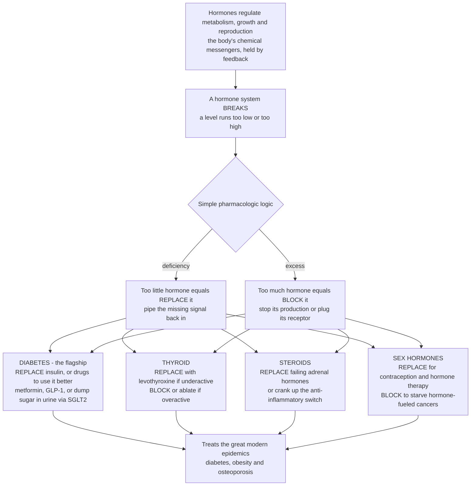

# 💊 Endocrine and Metabolic Pharmacology

> [!abstract] TL;DR
> The endocrine system runs on **hormones** and **feedback loops** — chemical messengers that dial metabolism, growth, and reproduction up and down. When one of those loops breaks, pharmacology offers a strikingly simple menu: **too little hormone? REPLACE it. Too much? BLOCK it.** **Diabetes** is the flagship — in type 1 the body makes no **insulin**, so you inject it back (life-saving **replacement**); in type 2 the body ignores its own insulin, so you give drugs that help cells use it (**metformin**, **sulfonylureas**, **thiazolidinediones**), amplify the gut's **incretin** signal (**GLP-1 agonists**, **DPP-4 inhibitors**), or simply **dump excess sugar in the urine** (**SGLT2 inhibitors**). The same replace-or-block logic runs through the whole field: **levothyroxine** replaces a failing thyroid while **anti-thyroid drugs** or **radioiodine** shut down an overactive one; **glucocorticoids** replace absent adrenal hormones *and* borrow the body's own anti-inflammatory switch; **sex hormones** power **contraception** and hormone therapy, while **anti-estrogens** and **anti-androgens** starve hormone-fueled **breast** and **prostate** cancers. Because hormones govern metabolism, this same toolkit fights the great modern epidemics — diabetes, obesity (the **GLP-1** weight-loss blockbusters), and osteoporosis (**bisphosphonates**, **denosumab**). Seeing hormone systems as controllable dials — replace what is missing, block what is in excess — makes endocrine and metabolic pharmacology one of medicine's most logical and highest-impact areas. *This note is educational pharmacology at textbook level, not individual medical or dosing advice.*

---

## Intuition

**Analogy — hormones are the thermostats of the body, and pharmacology is the technician's two-button remote.** Imagine the body as a house full of thermostats. Each one senses a level — blood sugar, calcium, metabolic rate, calcium in bone, the reproductive cycle — and releases a hormone to nudge it back to a set point. This is the endocrine system: a web of chemical messengers held in balance by **negative feedback**, the same way a thermostat clicks the furnace off once the room is warm enough. Most of the time it hums along invisibly.

Now a thermostat breaks. It can break in only two interesting ways, and pharmacology has exactly one button for each. If the thermostat can no longer produce its signal — the level runs **too low** — the technician's fix is to **REPLACE** the missing hormone: pipe the signal back in from outside. If instead the thermostat is stuck screaming at full blast — the level runs **too high** — the fix is to **BLOCK** it: shut off the production, or plug the receptors so the excess signal can't be heard. That is the entire grammar of the field. **Diabetes** is the textbook case of *replace* — type 1 patients make no insulin, so we inject it and millions stay alive; type 2 patients still make insulin but their cells have gone deaf to it, so we add drugs that turn up the volume or route sugar out of the body entirely. **An overactive thyroid** is the textbook case of *block* — too much thyroid hormone, so we throttle its factory. Steroids play both roles: *replace* what failing adrenal glands can't make, or crank the body's own **anti-inflammatory** hormone far past natural levels to quiet a raging immune response. And in oncology the logic turns lethal in reverse — some cancers are *fueled* by hormones, so we **block** estrogen in breast cancer and testosterone in prostate cancer to starve the tumor. Learn to read every endocrine drug as either a **replace** or a **block** on some hormonal dial, and a sprawling field collapses into one elegant idea.

---

## How It Works

### Core mechanics — the unifying replace-or-block logic

1. **Hormones are the endogenous signals; drugs impersonate or silence them.** Because the endocrine system is *already* a chemical-control system, the cleanest drugs are the hormones themselves (insulin, levothyroxine, cortisol) or molecules that hit the very same **receptors** — many of them **nuclear receptors** for steroids and thyroid hormone, or cell-surface receptors for peptide hormones like insulin and GLP-1.
2. **REPLACE — for deficiency.** When a gland fails or is destroyed, give the hormone back from outside. Type 1 diabetes (no insulin), hypothyroidism (no thyroid hormone), and Addison's disease (no cortisol) are all managed by **replacement**, aiming to recreate the body's natural levels and rhythms.
3. **BLOCK — for excess.** When a hormone is overproduced or drives disease, shut it down. You can **block production** (anti-thyroid drugs stop hormone synthesis), **block the receptor** (anti-androgens, anti-estrogens), **block the upstream axis** (GnRH agonists switch off the pituitary), or **ablate the gland** (radioiodine for hyperthyroidism).
4. **Exploit the negative-feedback axis.** Hormone axes are wired hypothalamus → pituitary → target gland, with the end hormone feeding back to suppress the top. Drugs ride this: giving a steroid suppresses the adrenal axis (why chronic steroids can't be stopped abruptly); giving a continuous GnRH agonist paradoxically *shuts down* sex-hormone output after an initial surge.
5. **Diabetes shows every lever at once.** Raise insulin action (replace insulin; sulfonylureas squeeze more from the pancreas via the **K-ATP channel**; incretin drugs amplify glucose-triggered release), reduce the liver's sugar output (metformin), improve tissue sensitivity (thiazolidinediones), or bypass hormones entirely and excrete glucose through the kidney's **SGLT2 transporter**.
6. **Metabolism is the through-line.** Because hormones set metabolic rate, appetite, fat storage, and bone turnover, the same pharmacology treats the biggest chronic-disease burdens — diabetes, obesity, and osteoporosis.



---

## Key Concepts / Details

### Secondary Level

- **Hormones are chemical messengers; endocrine drugs replace or block them.** If a gland makes too little, you add the hormone back (**replacement**). If it makes too much or the hormone is causing harm, you shut it down (**blockade**). Almost every endocrine drug is one or the other.
- **Diabetes is the headline example.** In **type 1**, the pancreas makes no **insulin**, so patients inject it to survive — pure replacement. In **type 2**, the body still makes insulin but ignores it, so drugs help the body use it better or get rid of extra sugar.
- **Insulin keeps millions alive.** Before insulin was purified in 1921, type 1 diabetes was a death sentence within months. Injected insulin is one of the most important medicines ever made.
- **Thyroid is a clean replace-or-block story.** An **underactive** thyroid gets a daily thyroid-hormone pill (**levothyroxine**). An **overactive** thyroid gets drugs or radioactive iodine to turn the gland down.
- **Steroids are everywhere.** **Corticosteroids** like prednisone are among the most-used drugs in medicine because they powerfully **calm inflammation** — the body borrowing its own stress hormone as an anti-inflammatory.
- **New weight-loss drugs are endocrine drugs.** The blockbuster **GLP-1** medicines (used for obesity and diabetes) work on a gut hormone that controls appetite and blood sugar.

### Undergraduate Level

**Diabetes and glucose control — the flagship.**

- **Insulin (replacement).** The essential therapy for type 1 and advanced type 2 diabetes. Modern analogs are engineered for **timing**: **rapid-acting** (lispro, aspart) covers meals with a fast peak over ~3–5 hours; **long-acting / basal** (glargine, detemir, degludec) gives a flat, ~24-hour background level. Combining them recreates the pancreas's natural basal-plus-mealtime pattern.
- **Metformin (first-line oral).** Reduces the liver's **hepatic glucose output** (gluconeogenesis) and modestly improves insulin sensitivity; it does not cause hypoglycemia on its own and is weight-neutral — hence first-line in type 2.
- **Sulfonylureas (glipizide, glimepiride).** Force the pancreatic β-cell to release more insulin by closing the **ATP-sensitive potassium (K-ATP) channel**, depolarizing the cell and triggering insulin exocytosis. Effective but can cause hypoglycemia and weight gain.
- **Incretin-based drugs.** The gut releases **GLP-1** after eating, which boosts glucose-dependent insulin release and curbs appetite. **GLP-1 receptor agonists** (semaglutide, liraglutide, tirzepatide) mimic this and drive major **weight loss** — a blockbuster class. **DPP-4 inhibitors** (sitagliptin) block the enzyme that degrades native GLP-1, raising its level more modestly.
- **SGLT2 inhibitors (empagliflozin, dapagliflozin).** Block the kidney's **sodium-glucose co-transporter 2**, so excess glucose is excreted in the **urine** — an insulin-independent mechanism with striking **cardiovascular and renal** protective benefits.
- **Thiazolidinediones (pioglitazone).** Nuclear-receptor (PPAR-γ) agonists that improve insulin **sensitivity** in fat and muscle. This all sits within managing the broader **metabolic syndrome** (obesity, hypertension, dyslipidemia, hyperglycemia).

**Thyroid — replace versus block.** Hypothyroidism is treated by **replacement** with **levothyroxine** (synthetic T4), titrated to normalize TSH. Hyperthyroidism is treated by **blocking**: **thionamides** (methimazole, propylthiouracil) inhibit thyroid-hormone synthesis; **radioactive iodine** ablates overactive tissue; and β-blockers control the adrenergic symptoms.

**Corticosteroids.** **Glucocorticoids** (hydrocortisone, prednisone, dexamethasone) replace cortisol in adrenal insufficiency, but their dominant use is **anti-inflammatory / immunosuppressive** at supra-physiologic doses — asthma, autoimmune disease, transplant, allergy. **Mineralocorticoids** (fludrocortisone) replace aldosterone for salt/water balance. Chronic high-dose steroids reproduce the features of **Cushing syndrome** (weight gain, hyperglycemia, osteoporosis, thin skin, immune suppression, HPA-axis suppression).

**Sex hormones and reproduction.** **Estrogens/progestins** power **combined oral contraceptives** ("the Pill") — steady exogenous hormone suppresses the pituitary axis and blocks ovulation — and menopausal **hormone therapy**. **Androgens** treat hypogonadism. **Hormone blockade** treats hormone-driven cancers: **anti-estrogens (tamoxifen)** and **aromatase inhibitors (letrozole)** in **breast** cancer; **anti-androgens** and **GnRH agonists** in **prostate** cancer. **Fertility drugs** (clomiphene, gonadotropins) push the axis the other way to induce ovulation.

**Bone and metabolic.** **Osteoporosis** drugs **block** excessive bone resorption: **bisphosphonates** (alendronate) poison osteoclasts; **denosumab** is a monoclonal antibody against RANKL. Related metabolic targets include **gout** (allopurinol lowers urate) and overlapping **lipid-lowering** therapy (statins). **Growth hormone** and other pituitary drugs replace or suppress pituitary output.

### Graduate Level

- **Receptor class dictates strategy.** Peptide hormones (insulin, GLP-1, GH) act on **cell-surface receptors** and must be given by **injection** (they would be digested if swallowed) — hence recombinant insulin and injectable GLP-1 agonists, and the pharmaceutical feat of an **oral** semaglutide formulation. Steroid and thyroid hormones act on **intracellular nuclear receptors**, are orally bioavailable, and act slowly by changing **gene transcription** (why steroid and levothyroxine effects build over hours to weeks). This maps directly onto the four-superfamily receptor framework.
- **Insulin pharmacokinetics is protein engineering.** Analog design manipulates the **hexamer-to-monomer** equilibrium: substitutions that destabilize the hexamer (lispro, aspart) speed absorption for mealtime coverage, while additions that slow dissolution or add albumin binding (glargine's isoelectric precipitation, degludec's multi-hexamer depot) flatten and prolong the profile for basal coverage. The clinical art is stacking these to mimic physiologic secretion while avoiding hypoglycemia.
- **Incretin biology and the dual/triple agonists.** GLP-1 agonism improves glycemia glucose-dependently (low hypoglycemia risk) and drives weight loss via central appetite and gastric-emptying effects. The frontier is **multi-agonism** — **tirzepatide** (GIP + GLP-1) and investigational GLP-1/GIP/glucagon **triagonists** — pushing weight loss toward bariatric-surgery territory and reframing obesity as a treatable endocrine-metabolic disease.
- **SGLT2 inhibitors' cardiorenal paradox.** Their outcome benefits in **heart failure** and **chronic kidney disease** — even in non-diabetics — exceed what glucose-lowering alone predicts, implicated in natriuresis, reduced glomerular hyperfiltration, and a shift toward ketone/fatty-acid substrate use. A glucose drug became a cardiology and nephrology drug.
- **HPA-axis suppression and steroid withdrawal.** Exogenous glucocorticoids suppress CRH/ACTH via negative feedback; chronic use atrophies the adrenal cortex, so **abrupt withdrawal** can precipitate an adrenal crisis. Rational tapering, "stress dosing," and selecting agents by potency/duration (dexamethasone's long half-life and negligible mineralocorticoid activity vs hydrocortisone's short, balanced profile) are core to safe use.
- **GnRH agonist flare versus antagonism.** Pulsatile GnRH stimulates the pituitary, but **continuous** agonist exposure downregulates receptors and *suppresses* gonadotropins — used to induce medical castration in prostate cancer. The initial **testosterone flare** can transiently worsen disease, motivating anti-androgen cover or the use of GnRH **antagonists** (degarelix) that suppress immediately.
- **Selective receptor modulation.** **SERMs** (tamoxifen, raloxifene) are estrogen-receptor agonists in some tissues and antagonists in others (antagonist in breast, partial agonist in bone/endometrium) — tissue-selective pharmacology that decouples benefit from harm, a template echoed by selective glucocorticoid-receptor and androgen-receptor modulators in development.
- **Pharmacogenomics and individualization.** Response and toxicity vary with genotype (for example, thionamide agranulocytosis risk, sulfonylurea response in monogenic MODY that is exquisitely sensitive to sulfonylureas rather than insulin) — an entry point to personalized endocrine dosing.

---

## Python Demo

```python
# Endocrine & metabolic pharmacology -- the "replace-or-block" logic in four panels:
#  (a) INSULIN & GLUCOSE CONTROL -- blood glucose across a day, untreated (high,
#      out of range) vs treated with insulin / a glucose-lowering drug (in range).
#  (b) INSULIN FORMULATIONS      -- rapid-acting vs long-acting insulin action
#      profiles, the building blocks that shape that glucose curve.
#  (c) REPLACE vs BLOCK          -- a hormone axis: replacement RAISES a deficient
#      hormone into range; a blocker LOWERS an excess hormone into range.
#  (d) GLP-1 WEIGHT LOSS         -- incretin-based drugs drive sustained weight loss.
import numpy as np
import matplotlib.pyplot as plt

fig, ax = plt.subplots(2, 2, figsize=(13, 9))

# ---- (a) BLOOD GLUCOSE OVER A DAY -------------------------------------------
t = np.linspace(0, 24, 24 * 12 + 1)          # hours, 5-min resolution
meals = [7.0, 12.5, 18.5]                     # breakfast, lunch, dinner

def meal_response(t, t0, amp, tau_up, tau_down):
    x = t - t0
    return np.where(x >= 0, amp * (1 - np.exp(-x / tau_up)) * np.exp(-x / tau_down), 0.0)

# Untreated diabetes: high fasting baseline, big slow-clearing post-meal spikes
untreated = 165 + sum(meal_response(t, m, 120, 0.4, 3.0) for m in meals)
# Treated (insulin / glucose-lowering drug): normal baseline, small quick spikes
treated   = 90  + sum(meal_response(t, m,  45, 0.4, 1.1) for m in meals)

ax[0, 0].fill_between(t, 70, 140, color="#51cf66", alpha=0.18, label="target range 70-140")
ax[0, 0].plot(t, untreated, color="#ff6b6b", lw=2.2, label="untreated (no insulin)")
ax[0, 0].plot(t, treated,   color="#4a9eff", lw=2.2, label="treated (insulin / drug)")
for m in meals:
    ax[0, 0].axvline(m, color="gray", ls=":", alpha=0.5)
ax[0, 0].set_xlabel("time of day (hours)")
ax[0, 0].set_ylabel("blood glucose (mg/dL)")
ax[0, 0].set_title("(a) Glucose control: replace insulin -> back in range")
ax[0, 0].legend(fontsize=8, loc="upper right")
ax[0, 0].grid(alpha=0.3)

# ---- (b) INSULIN ACTION PROFILES --------------------------------------------
th = np.linspace(0, 24, 24 * 12 + 1)
def gamma_action(t, peak, dur):
    k = 3.0
    theta = peak / (k - 1)                     # gamma mode sits at 'peak'
    y = (t ** (k - 1)) * np.exp(-t / theta)
    y = y / y.max()
    y[t > dur] *= np.exp(-(t[t > dur] - dur))   # taper the tail past duration
    return y
rapid = gamma_action(th, peak=1.2, dur=5)      # lispro/aspart: peak ~1h, ~4-5h
long_ = (1 - np.exp(-th / 1.5))                # glargine/degludec: slow onset...
long_ = 0.55 * long_ / long_.max()             # ...flat, "peakless" ~24h basal

ax[0, 1].plot(th, rapid, color="#e64980", lw=2.2, label="rapid-acting (mealtime)")
ax[0, 1].plot(th, long_, color="#7048e8", lw=2.2, label="long-acting (basal)")
ax[0, 1].set_xlabel("time since injection (hours)")
ax[0, 1].set_ylabel("relative glucose-lowering action")
ax[0, 1].set_title("(b) Insulin formulations shape the profile")
ax[0, 1].legend(fontsize=8)
ax[0, 1].grid(alpha=0.3)

# ---- (c) REPLACE vs BLOCK on a hormone axis ---------------------------------
weeks = np.linspace(0, 12, 200)
lo, hi = 0.8, 1.8                              # normal free-T4 band (ng/dL, illustrative)
hypo_start, hyper_start = 0.35, 3.10
replace = 1.3 - (1.3 - hypo_start)  * np.exp(-weeks / 3.0)   # levothyroxine RAISES low
block   = 1.3 + (hyper_start - 1.3) * np.exp(-weeks / 3.0)   # anti-thyroid LOWERS high

ax[1, 0].fill_between(weeks, lo, hi, color="#51cf66", alpha=0.18, label="normal range")
ax[1, 0].plot(weeks, replace, color="#4a9eff", lw=2.2, label="REPLACE (levothyroxine)")
ax[1, 0].plot(weeks, block,   color="#ff6b6b", lw=2.2, label="BLOCK (anti-thyroid drug)")
ax[1, 0].set_xlabel("weeks of therapy")
ax[1, 0].set_ylabel("hormone level (free T4, ng/dL)")
ax[1, 0].set_title("(c) Replace-or-block converges on the normal band")
ax[1, 0].legend(fontsize=8)
ax[1, 0].grid(alpha=0.3)

# ---- (d) GLP-1 WEIGHT LOSS --------------------------------------------------
wk = np.linspace(0, 68, 200)
placebo = -2.5  * (1 - np.exp(-wk / 20))       # lifestyle only: modest ~2-3%
glp1    = -15.0 * (1 - np.exp(-wk / 16))       # semaglutide-class: ~15% at plateau
ax[1, 1].axhline(0, color="gray", lw=1)
ax[1, 1].plot(wk, placebo, color="#adb5bd", lw=2.2, label="placebo / lifestyle")
ax[1, 1].plot(wk, glp1,    color="#12b886", lw=2.4, label="GLP-1 receptor agonist")
ax[1, 1].set_xlabel("weeks of treatment")
ax[1, 1].set_ylabel("body-weight change (percent)")
ax[1, 1].set_title("(d) GLP-1 drugs: blockbuster weight loss")
ax[1, 1].legend(fontsize=8, loc="lower left")
ax[1, 1].grid(alpha=0.3)

plt.tight_layout()
plt.savefig("endocrine_metabolic_pharmacology.png", dpi=120)
plt.show()

# Takeaways:
#  - (a) Replacing insulin pulls a wildly out-of-range glucose curve back into the
#        target band -- the single most important intervention in diabetes.
#  - (b) Timing is engineered: rapid analogs cover meals, basal analogs give a flat
#        24-hour background; stacking them mimics a healthy pancreas.
#  - (c) The whole field in one picture: REPLACE raises a deficient hormone, BLOCK
#        lowers an excess one, and both converge on the normal range.
#  - (d) Incretin (GLP-1) drugs turn a metabolic hormone into a weight-loss therapy,
#        transforming obesity treatment.
```

Running this produces four panels. Panel (a) shows an untreated diabetic glucose curve riding far above the target band all day while the insulin-treated curve stays in range — the essence of replacement therapy. Panel (b) contrasts a sharp rapid-acting insulin peak with a flat long-acting basal profile, the two shapes clinicians combine. Panel (c) is the note's thesis in one image: a deficient hormone climbing up under **replacement** and an excess hormone falling under **blockade**, both landing in the normal band. Panel (d) shows a GLP-1 agonist driving roughly 15 percent weight loss versus a near-flat placebo — the blockbuster obesity result.

---

## Real-World Applications

> **Example — insulin, the paradigm of hormone replacement:** Type 1 diabetes was uniformly fatal until Banting, Best, and Macleod purified **insulin** in 1921–22. Today recombinant human insulin and engineered analogs are manufactured at industrial scale; a **basal-bolus** regimen (a long-acting analog for background needs plus rapid analogs at meals), or an insulin pump running only rapid analog, reconstructs the pancreas's secretion pattern and keeps tens of millions of people alive. It is the cleanest possible demonstration of the replace principle: the gland is gone, so you supply its product.

- **GLP-1 receptor agonists (semaglutide, tirzepatide)** — originally type 2 diabetes drugs, now transformative **obesity** therapy, driving ~15–20 percent weight loss and reshaping how metabolic disease is treated; an oral semaglutide formulation cracked the "peptides can't be swallowed" barrier.
- **SGLT2 inhibitors (empagliflozin, dapagliflozin)** — a diabetes drug that "dumps sugar in the urine," now a mainstay of **heart-failure** and **chronic-kidney-disease** therapy even without diabetes, one of cardiology's biggest recent shifts.
- **Levothyroxine** — among the most-prescribed drugs in the world; a once-daily pill that fully replaces a failed thyroid, titrated by TSH — replacement in its simplest form.
- **Anti-thyroid therapy (methimazole, radioiodine)** — the block/ablate side: shutting down Graves' hyperthyroidism by inhibiting synthesis or destroying overactive tissue.
- **Corticosteroids (prednisone, dexamethasone)** — ubiquitous anti-inflammatories across asthma, autoimmune disease, transplantation, and (dexamethasone) severe COVID-19; the body's own cortisol turned up as a therapeutic switch.
- **Combined oral contraceptives** — synthetic estrogen/progestin suppressing ovulation; one of the most socially consequential drug classes in history.
- **Hormone-blocking cancer therapy** — **tamoxifen** and aromatase inhibitors (letrozole) starve estrogen-receptor-positive **breast** cancer; **GnRH agonists** and anti-androgens starve **prostate** cancer — decades-long, life-extending endocrine oncology.
- **Osteoporosis drugs (alendronate, denosumab)** — blocking runaway bone resorption to prevent fractures in an aging population.

---

## Common Pitfalls

- **Stopping chronic steroids abruptly** — long-term glucocorticoids suppress the HPA axis and shrink the adrenal glands; sudden withdrawal can trigger an **adrenal crisis**. Chronic steroids must be **tapered**, and doses often increased under physiologic stress.
- **Ignoring insulin timing** — matching the wrong **formulation** to the need (long-acting for a meal spike, or rapid-acting as the only coverage) causes hyper- or hypoglycemia. Basal and bolus insulins have distinct kinetics and are not interchangeable.
- **Hypoglycemia from insulin secretagogues** — **sulfonylureas** (and insulin) force insulin release regardless of glucose, so they can drop blood sugar dangerously; **metformin**, GLP-1 agonists, and SGLT2 inhibitors carry far lower intrinsic hypoglycemia risk because they are glucose-dependent or insulin-independent.
- **Treating "the beta receptor" or "the estrogen receptor" as one thing** — tissue-selective agents (SERMs like tamoxifen: antagonist in breast, partial agonist in bone/uterus) mean the *same* drug helps in one tissue and harms in another. Selectivity, not blanket blockade, is the point.
- **Forgetting the GnRH-agonist flare** — starting a continuous GnRH agonist in prostate cancer transiently *raises* testosterone before suppressing it, which can worsen disease; anti-androgen cover or a GnRH antagonist avoids the flare.
- **Overshooting or undershooting thyroid replacement** — levothyroxine has a narrow target and a long half-life; dose changes take weeks to register in TSH, so impatient re-titration causes iatrogenic hyper- or hypothyroidism.
- **Underestimating chronic steroid toxicity** — sustained supra-physiologic glucocorticoids reproduce **Cushing syndrome**: hyperglycemia, osteoporosis, immunosuppression, weight gain, skin thinning. The anti-inflammatory power is inseparable from these systemic effects at high dose.
- **Assuming an oral route for peptide hormones** — insulin, GLP-1 agonists, and growth hormone are proteins that would be digested if swallowed, so most require injection; expecting a pill misreads the pharmacology of peptide versus steroid/thyroid hormones.

---

## Related Concepts

- [[Clinical_Medicine/03_Metabolic_Endocrine_and_Renal/Diabetes_Mellitus_and_Glucose_Regulation|Diabetes Mellitus and Glucose Regulation]] — the disease this note's flagship drug classes treat; the insulin/glucagon loop and its type-1 (no key) and type-2 (stiff locks) failure modes are exactly what insulin replacement and the oral/injectable agents target.
- [[Clinical_Medicine/03_Metabolic_Endocrine_and_Renal/Endocrine_Pathophysiology|Endocrine Pathophysiology]] — the hormone-and-feedback disorders (deficiency, excess, resistance, altered axis) that define whether a drug should replace or block; the pathophysiology is the mirror image of this pharmacology.
- [[Clinical_Medicine/03_Metabolic_Endocrine_and_Renal/Thyroid_Adrenal_and_Pituitary_Disorders|Thyroid, Adrenal and Pituitary Disorders]] — the hypo-/hyperthyroid, adrenal-insufficiency/Cushing, and pituitary conditions behind levothyroxine, anti-thyroid drugs, and corticosteroid replacement or suppression.
- [[Clinical_Medicine/03_Metabolic_Endocrine_and_Renal/Nutritional_and_Metabolic_Disorders|Nutritional and Metabolic Disorders]] — obesity and the metabolic syndrome that GLP-1 agonists, SGLT2 inhibitors, and lifestyle-plus-drug strategies are transforming.
- [[Biology/09_Human_Physiology_and_Anatomy/The_Endocrine_System_and_Hormones|The Endocrine System and Hormones]] — the normal messenger-and-feedback physiology; endocrine drugs are hormones themselves or molecules that hit their (often nuclear) receptors, so this is the biological substrate the whole field acts on.
- [[Health_Nutrition_and_Longevity/01_Foundations_of_Health/Metabolism_and_Energy_Balance|Metabolism and Energy Balance]] — the energy-balance and appetite systems that incretin/GLP-1 weight-loss drugs manipulate, connecting endocrine pharmacology to obesity and longevity.

**Sibling notes in this section (prose-only):** this note sits within *Drug Classes and Therapeutics* alongside *Autonomic and Cardiovascular Pharmacology* (the other great "physiology-in-a-loop" system drugged by mimicry and blockade) and *Anticancer and Immunomodulatory Drugs* (which shares the hormone-blocking oncology this note introduces — anti-estrogens, anti-androgens, GnRH agonists). It rests on the molecular-target notes *Receptors and Signal Transduction as Targets* (steroid and thyroid hormones act on nuclear receptors; insulin and GLP-1 on cell-surface receptors) and *Ion Channels and Transporters as Targets* (sulfonylureas act on the K-ATP channel, SGLT2 inhibitors on a glucose transporter). Finally it points forward to *Pharmacogenomics and Personalized Dosing*, since genotype shapes response and toxicity across insulin, sulfonylureas, and thionamides.

---

## Review Questions

1. **(Secondary)** State the single organizing rule of endocrine pharmacology in one sentence, then classify each of these as **replace** or **block**: injecting insulin in type 1 diabetes, giving methimazole for an overactive thyroid, taking daily levothyroxine, using tamoxifen in breast cancer.
2. **(Undergraduate)** A patient with type 2 diabetes still produces insulin but responds poorly to it. Compare how **metformin**, a **sulfonylurea**, a **GLP-1 receptor agonist**, and an **SGLT2 inhibitor** lower blood glucose by *different* mechanisms, and explain why metformin and the SGLT2 inhibitor carry much lower hypoglycemia risk than the sulfonylurea.
3. **(Undergraduate)** Explain why rapid-acting and long-acting insulin analogs have different action profiles, and how a basal-bolus regimen uses both to mimic normal pancreatic secretion. Why must these hormones be injected rather than swallowed?
4. **(Graduate)** Corticosteroids illustrate both sides of the replace/block logic and a dangerous feedback trap. Describe (a) their use as replacement versus high-dose anti-inflammatory therapy, (b) how chronic use suppresses the HPA axis, and (c) why abrupt withdrawal is hazardous. Then contrast this feedback phenomenon with the GnRH-agonist "flare" in prostate cancer.
5. **(Graduate)** SGLT2 inhibitors were developed as glucose-lowering drugs but became mainstays of heart-failure and kidney-disease therapy. Propose mechanisms beyond glycemic control that might explain their cardiorenal benefit, and discuss what this reveals about targeting a metabolic transporter versus a hormone axis.

---

## Sources

- Katzung BG, Vanderah TW (eds). *Basic & Clinical Pharmacology* — Section VII, "Endocrine Drugs" (pancreatic hormones & antidiabetic agents; thyroid & antithyroid; adrenocorticosteroids; gonadal hormones; agents affecting bone). McGraw Hill / AccessMedicine. https://accessmedicine.mhmedical.com/book.aspx?bookid=2988
- Brunton LL, Knollmann BC (eds). *Goodman & Gilman's The Pharmacological Basis of Therapeutics*, 14th ed. — "Endocrine Pharmacology" chapters (insulin & glucose-lowering drugs, thyroid, ACTH & adrenal steroids, estrogens/androgens, bone). McGraw Hill. https://accesspharmacy.mhmedical.com/book.aspx?bookid=2189
- Ritter JM, Flower R, Henderson G, et al. *Rang & Dale's Pharmacology* — "The Endocrine System" section (pituitary, thyroid, adrenal, reproductive, and pancreatic pharmacology). Elsevier. https://www.elsevier.com/books/rang-and-dales-pharmacology/ritter/978-0-7020-7448-6
- American Diabetes Association. *Standards of Care in Diabetes* — "Pharmacologic Approaches to Glycemic Treatment." *Diabetes Care* (updated annually). https://diabetesjournals.org/care/issue (Standards of Care supplement)
- The Nobel Prize in Physiology or Medicine 1923 — Frederick G. Banting & John J. R. Macleod, "for the discovery of insulin." Nobel Foundation. https://www.nobelprize.org/prizes/medicine/1923/summary/

---

#pharmacology #diabetes-drugs #insulin #hormones #GLP-1
