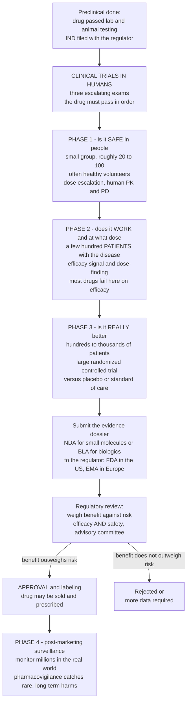

# 🧪 Clinical Trials and Drug Approval

> [!abstract] TL;DR
> After years of lab benches and animal studies, a drug candidate finally faces its ultimate test — **real human beings** — through **clinical trials** run in three escalating phases, like a series of increasingly demanding exams it must pass in order. **Phase 1** asks *"is it safe in people?"* — a small group, often healthy volunteers, receives carefully escalating doses to find the safe range and learn how the human body handles the drug. **Phase 2** asks *"does it work, and at what dose?"* — a few hundred patients *with the disease* look for an early efficacy signal. **Phase 3** is the big, decisive exam — *"is it really better than what we already have?"* — thousands of patients in a large **randomized controlled trial** (the gold standard) that must prove real benefit outweighs harm. Only then can the maker submit a mountain of evidence to a **regulator** (the **FDA** in the US), whose experts scrutinize it and decide whether to **approve** it. Even after approval the watching never stops: **Phase 4** monitors the drug in millions of real-world patients to catch rare harms the trials were too small to see. This is why proving a new drug works takes years, thousands of patients, and vast expense — and it is *why you can generally trust that an approved medicine does what it claims*. *Educational content, not individual medical or dosing advice.*

---

## Intuition

**Analogy — three escalating exams.** Imagine a new pilot who has trained for years in classrooms and flight simulators (the lab and animal work). Before carrying passengers, they must pass three real flight tests, each harder than the last. The **first** test flies solo in perfect weather with an instructor watching every move: *can they even fly safely?* The **second** adds a short route with a few passengers: *can they actually complete a useful trip?* The **third** is a full commercial flight through busy airspace, judged against every other pilot on the roster: *are they genuinely as good as, or better than, the professionals already doing this job?* Only after passing all three does an aviation authority grant the licence — and even then, every flight afterward is logged and audited so that any rare mistake gets caught.

A drug's journey is exactly this. **Phase 1** flies solo in fair weather — a small group, often healthy volunteers, tests only whether the drug is *safe* and how the body handles it, climbing the dose slowly. **Phase 2** carries a few passengers — a few hundred actual patients — to see whether the drug *does anything useful* and at what dose. **Phase 3** is the packed commercial flight judged against the competition — thousands of patients, randomly split into a drug group and a comparison group, proving the drug truly beats placebo or the current standard. The **regulator** is the aviation authority granting the licence to sell. And **Phase 4** is the never-ending flight log: with millions now taking the drug, rare side effects that were invisible in a few thousand patients finally surface. Each exam is more expensive and more demanding than the last, which is why most candidates wash out long before licensing — and why the ones that make it can be trusted.

---

## How It Works

### Core Mechanics

1. **The gateway: the IND.** Before *any* human receives the drug, the sponsor files an **Investigational New Drug (IND)** application, packaging the preclinical pharmacology and toxicology, the manufacturing details, and the proposed trial protocol. The regulator reviews it for safety; only if there is no hold does first-in-human testing begin. This is the bridge from *Preclinical Development and Toxicology* to the clinic.

2. **Phase 1 — is it safe? (pharmacokinetics and tolerability).** A **small group of roughly 20 to 100** subjects — often **healthy volunteers** (in oncology, patients, because the drugs are too toxic for the healthy) — receives the drug under intensive monitoring. The design is **dose escalation**: start low, raise the dose in successive cohorts, and watch for **dose-limiting toxicity** to find the **maximum tolerated dose** and the safe range. Alongside safety, Phase 1 characterizes human **pharmacokinetics and pharmacodynamics** — how the body absorbs, distributes, metabolizes, and clears the drug, and what it does to the body. Efficacy is *not* the question here.

3. **Phase 2 — does it work, and at what dose? (efficacy signal and dose-finding).** A **few hundred patients who actually have the disease** receive the drug. This is **proof of concept**: is there an early signal of benefit, and which **dose** balances effect against side effects? Phase 2 is the great filter — **most drugs that fail on efficacy die here**, cheaply, before the enormous cost of Phase 3.

4. **Phase 3 — is it really better? (the confirmatory RCT).** The pivotal, expensive exam: a **large trial of hundreds to thousands** of patients, **randomized, controlled, and usually blinded and multi-center**, comparing the drug against **placebo or the current standard of care**. This is the rigorous, generalizable evidence a regulator needs — and it links directly to the design principles in *Evidence-Based Medicine and Clinical Trials*.

5. **Trial-design essentials (the same across Phase 2–3).** **Randomization** makes the arms identical on average so any difference is *caused* by the drug; **blinding** removes expectation bias; a **control** (placebo or active comparator) isolates the drug's *added* benefit; **endpoints** are chosen carefully — a **clinical endpoint** patients feel (death, stroke) versus a **surrogate endpoint** presumed to predict it (blood pressure, tumor shrinkage); **statistical power and sample size** ensure the trial is big enough to detect a true effect; and **intention-to-treat** analysis keeps randomization intact by analyzing patients in the group they were assigned to.

6. **Regulatory approval — the benefit-risk verdict.** The sponsor compiles the evidence into a **New Drug Application (NDA)** for small molecules or a **Biologics License Application (BLA)** for biologics, and submits it to the **regulator** (FDA in the US, EMA in Europe). Reviewers assess **efficacy *and* safety** and weigh **benefit against risk**; an **advisory committee** of outside experts may be convened; and if approved, the regulator negotiates the **label** — the official indications, dosing, warnings, and contraindications.

7. **Special pathways.** For serious unmet needs, faster routes exist: **breakthrough-therapy** and **fast-track** designations, **accelerated approval** on a surrogate endpoint (with required confirmatory trials), **priority review**, **orphan-drug** incentives for rare diseases, and **conditional approval**. Speed is traded for a heavier post-market evidence burden.

8. **Phase 4 — post-marketing surveillance.** Approval is not the finish line. Once **millions** take the drug, **pharmacovigilance** systems (spontaneous adverse-event reporting, registries, and increasingly **real-world evidence** from health records) hunt for the **rare or long-term harms** that trials of a few thousand patients over a few years were statistically too small and too short to see — occasionally triggering label changes or **withdrawals**. This connects to *Drug Safety, Pharmacovigilance and Adverse Effects*.

9. **After the patent: generics and biosimilars.** When exclusivity expires, cheaper copies enter through streamlined routes. A **generic** (small molecule) needs only to prove **bioequivalence** to the original, not repeat full efficacy trials; a **biosimilar** (a large, complex biologic) must show no clinically meaningful difference through a tailored comparability program.

### Flow / Architecture



---

## Key Concepts

### Secondary Level

- **Clinical trial:** the stage where a drug is finally tested in *people*, after all the lab and animal work. It happens in **three escalating phases**, each a harder test than the last.
- **Phase 1 — safety:** a **small group** (often healthy volunteers) takes the drug at slowly rising doses. The only question is *"is it safe, and how does the body handle it?"*
- **Phase 2 — does it work:** a **few hundred patients with the disease** take it to see if there is an early sign of benefit and to find the right dose. Many drugs fail here.
- **Phase 3 — is it really better:** **thousands of patients** are split by chance into a drug group and a comparison group in a **randomized controlled trial** — the gold standard — to prove the drug truly beats placebo or the current best treatment.
- **Approval:** if all three phases pass, the maker sends the evidence to a **regulator** (the **FDA** in the US), whose experts decide whether the benefit outweighs the risk and whether it can be sold.
- **Phase 4 — the long watch:** even after approval, the drug is monitored in **millions** of real users to catch rare side effects the trials were too small to see.
- **Why it matters:** this whole process is *why* new drugs take years and cost billions — and why you can mostly trust that an approved medicine actually works and is acceptably safe.

### Undergraduate Level

- **The IND gateway:** an **Investigational New Drug** application, backed by preclinical toxicology and a protocol, must clear the regulator before the first human dose.
- **Phase 1 details:** ~20–100 subjects; **dose escalation** in cohorts to find the **maximum tolerated dose** and **dose-limiting toxicities**; primary goals are **safety** and human **pharmacokinetics/pharmacodynamics** (ADME in people), *not* efficacy.
- **Phase 2 details:** a few hundred patients; **proof-of-concept efficacy** plus **dose-finding**; often split into Phase 2a (does it do anything?) and 2b (what dose?); the phase with the **highest attrition on efficacy grounds**.
- **Phase 3 details:** the **confirmatory**, often multi-center, **randomized controlled trial** of hundreds to thousands; the **pivotal evidence** for approval; compares against **placebo or active standard of care**.
- **Design pillars:** **randomization**, **blinding** (single/double), **control/comparator**, **endpoints** (clinical vs **surrogate**), **statistical power** and **sample size**, and **intention-to-treat** — the machinery detailed in *Evidence-Based Medicine and Clinical Trials*.
- **The dossier:** approval requires an **NDA** (small molecules) or **BLA** (biologics) submitted to **FDA / EMA**, reviewed for **benefit-risk**, sometimes vetted by an **advisory committee**, and resulting in an official **label**.
- **Expedited pathways:** **fast-track**, **breakthrough-therapy**, **accelerated approval** (surrogate endpoint + confirmatory trial), **priority review**, **orphan-drug** designation, and **conditional approval** — faster access in exchange for tighter post-market obligations.
- **Phase 4 and pharmacovigilance:** post-marketing surveillance via spontaneous **adverse-event reporting**, registries, and **real-world evidence**; the only realistic way to catch **rare** and **long-latency** harms; can trigger label changes or **withdrawal**.
- **Ethics anchors:** **informed consent**, **IRB / ethics-board** oversight, **clinical equipoise** (genuine uncertainty over which arm is better), **trial registration and transparency**, and the historical safeguards born from **Nuremberg** and **Tuskegee** and codified in the **Declaration of Helsinki**.
- **Generics vs biosimilars:** generics need only prove **bioequivalence**; biosimilars require a tailored **comparability** program because biologics are large and hard to copy exactly.

### Graduate Level

- **Why the phased structure is optimal under uncertainty.** Drug development is a **sequential decision problem** with escalating cost and shrinking uncertainty. Each phase is a cheap-to-expensive **filter** that kills likely failures before the money is spent — an information-value calculation. Because success probabilities **multiply** ( ~63% × ~31% × ~58% × ~85% ), only roughly **1 in 10** drugs entering Phase 1 is ever approved, and the highest attrition (Phase 2 efficacy) sits *before* the most expensive stage by design.
- **Powering the pivotal trial.** Sample size flows from four quantities: the **effect size** deemed clinically meaningful, the **variance/event rate**, the **type-I error** α (usually two-sided 0.05), and the desired **power** 1−β (usually 0.80–0.90). Underpowering risks a **type-II error** — missing a real drug — while an over-powered trial can crown a **statistically significant but clinically trivial** effect. Multiple endpoints or interim looks demand **alpha spending** and multiplicity correction.
- **Estimands and analysis populations.** The **ICH E9(R1)** estimand framework forces sponsors to state precisely *what effect* is being estimated (treatment policy vs hypothetical vs principal-stratum), how **intercurrent events** (discontinuation, rescue medication, death) are handled, and why **intention-to-treat** — analyzing by *assignment* — preserves the causal validity that **per-protocol** analysis quietly destroys by re-introducing confounding.
- **Surrogate-endpoint peril and accelerated approval.** Accelerated approval trades a **surrogate** for speed, but a biomarker can move the "right" way while patients do *worse* (the CAST antiarrhythmic disaster). A valid surrogate must **capture the treatment's effect on the true outcome** — a strong, often-unmet statistical condition — which is why confirmatory trials are mandated (and sometimes never completed).
- **Adaptive and platform designs.** Modern trials increasingly **adapt** mid-course: group-sequential stopping for efficacy/futility, **Bayesian** response-adaptive randomization, seamless Phase 2/3, and **platform trials** testing many arms against a shared control (RECOVERY, I-SPY). These raise power and ethics-of-efficiency while demanding careful control of type-I error.
- **The statistics of rare harms — why Phase 4 is unavoidable.** By the **rule of three**, seeing *zero* events in *n* patients only bounds the true rate below roughly **3/n**; a 3,000-patient Phase 3 trial cannot rule out a 1-in-1,000 serious harm. Detecting rare adverse effects is intrinsically a **large-population, post-market** problem — the domain of pharmacovigilance and disproportionality analysis of spontaneous reports.
- **Equipoise, DSMBs, and stopping rules.** Randomizing is ethical only under genuine **clinical equipoise**; an independent **Data and Safety Monitoring Board** reviews unblinded interim data and may stop a trial for harm, overwhelming benefit, or futility — but early stopping for benefit **overestimates** effect size, a known bias.
- **Regulatory science and evidentiary standards.** Approval is a **benefit-risk** judgment, not a binary truth: the same evidence may clear one indication and fail another; regulators differ (FDA vs EMA vs PMDA); and **real-world evidence**, external controls, and **Bayesian borrowing** are reshaping what counts as adequate proof — while transparency mandates (**ClinicalTrials.gov**, EudraCT) fight publication bias and selective reporting.

---

## Python Demo

```python
# Clinical Trials and Drug Approval -- quantifying the pipeline:
#   (a) PHASE FUNNEL + COMPOUNDING SUCCESS: how few candidate drugs survive each
#       phase (success rates MULTIPLY to a low overall approval probability),
#   (b) GROWING PATIENT NUMBERS across Phase 1 -> 2 -> 3 -> 4,
#   (c) STATISTICAL POWER of a Phase 3 RCT vs sample size (the n needed to
#       reliably detect a true effect), and
#   (d) a SURVIVAL-ENDPOINT comparison (treatment vs placebo) as trial evidence.
# Educational simulation with stylized-but-realistic numbers -- not real trial data.
import numpy as np
import matplotlib.pyplot as plt
import math

rng = np.random.default_rng(2026)

def norm_cdf(x):
    return 0.5 * (1.0 + math.erf(x / math.sqrt(2)))

# ---- (a) Attrition funnel: drugs surviving each phase --------------------
stages = ["Enter\nPhase 1", "Enter\nPhase 2", "Enter\nPhase 3",
          "Submit\nNDA/BLA", "Approved"]
# Historical phase-transition success rates (stylized industry benchmarks)
transition = np.array([0.63, 0.31, 0.58, 0.85])   # P1->P2, P2->P3, P3->file, file->approve
N_START = 100                                      # candidate drugs entering Phase 1
surviving = N_START * np.concatenate(([1.0], np.cumprod(transition)))
cum_prob  = surviving / N_START                    # cumulative P(reach this stage)

# ---- (b) Patients enrolled per phase (order of magnitude) ----------------
phase_labels = ["Phase 1", "Phase 2", "Phase 3", "Phase 4"]
patients = np.array([45, 200, 3_000, 5_000_000])   # Phase 4 = post-market millions

# ---- (c) Power of a Phase 3 RCT (two-proportion test) --------------------
p_ctrl, p_trt = 0.20, 0.14        # bad-outcome rate: control vs treatment
z_alpha = 1.959963985             # two-sided alpha = 0.05
ns = np.arange(50, 4001, 25)      # patients PER ARM
pbar = (p_ctrl + p_trt) / 2.0
powers = np.array([
    norm_cdf((abs(p_ctrl - p_trt)
              - z_alpha * math.sqrt(2 * pbar * (1 - pbar) / n))
             / math.sqrt(p_ctrl * (1 - p_ctrl) / n + p_trt * (1 - p_trt) / n))
    for n in ns
])
n80 = ns[np.argmax(powers >= 0.80)]
n90 = ns[np.argmax(powers >= 0.90)]

# ---- (d) Survival endpoint: simulate a Phase 3 with censoring ------------
def km_curve(times, events, tmax):
    """Minimal Kaplan-Meier estimator (continuous times, negligible ties)."""
    order = np.argsort(times)
    times, events = times[order], events[order]
    n = len(times)
    t_grid, s_grid, S = [0.0], [1.0], 1.0
    for i in range(n):
        if events[i] == 1:
            at_risk = n - i                 # subjects with time >= times[i]
            S *= (1.0 - 1.0 / at_risk)
        t_grid.append(times[i]); s_grid.append(S)
    t_grid.append(tmax); s_grid.append(S)
    return np.array(t_grid), np.array(s_grid)

n_arm, Tmax = 500, 60.0                      # 500 per arm, 60-month follow-up
def censor(t, cap):
    return np.minimum(t, cap), (t <= cap).astype(int)
t_ctrl, e_ctrl = censor(rng.exponential(1/0.030, n_arm), Tmax)  # higher hazard
t_trt,  e_trt  = censor(rng.exponential(1/0.018, n_arm), Tmax)  # lower hazard = better
tc, sc = km_curve(t_ctrl, e_ctrl, Tmax)
tt, st = km_curve(t_trt,  e_trt,  Tmax)

# ---- Plot ----------------------------------------------------------------
fig, ax = plt.subplots(2, 2, figsize=(14, 10))

# Panel (a): funnel of surviving drugs + cumulative success probability
xs = np.arange(len(stages))
ax[0, 0].bar(xs, surviving, color="#2563eb", alpha=0.85)
for x, v in zip(xs, surviving):
    ax[0, 0].text(x, v + 1.5, f"{v:.0f}", ha="center", fontsize=9)
ax[0, 0].set_xticks(xs); ax[0, 0].set_xticklabels(stages, fontsize=8)
ax[0, 0].set_ylabel("Drugs surviving (of 100 entering)")
ax[0, 0].set_title("Attrition funnel: only ~1 in 10 is approved\n"
                   "phase success rates MULTIPLY")
axb = ax[0, 0].twinx()
axb.plot(xs, cum_prob, "o--", color="#dc2626", lw=2)
axb.set_ylabel("Cumulative P(reach stage)", color="#dc2626")
axb.tick_params(axis="y", labelcolor="#dc2626")

# Panel (b): patients grow across phases (log scale)
ax[0, 1].bar(phase_labels, patients, color="#059669", alpha=0.85)
ax[0, 1].set_yscale("log")
for i, v in enumerate(patients):
    ax[0, 1].text(i, v * 1.3, f"{v:,}", ha="center", fontsize=8)
ax[0, 1].set_ylabel("Patients enrolled (log scale)")
ax[0, 1].set_title("Patient numbers grow with each phase\n"
                   "small safety -> large confirmatory -> whole population")

# Panel (c): statistical power vs sample size
ax[1, 0].plot(ns, powers, color="#7c3aed", lw=2.2)
ax[1, 0].axhline(0.80, color="gray", ls="--", lw=1)
ax[1, 0].axhline(0.90, color="gray", ls=":",  lw=1)
ax[1, 0].axvline(n80, color="#7c3aed", ls="--", alpha=0.6)
ax[1, 0].annotate(f"n={n80}/arm\nfor 80% power",
                  xy=(n80, 0.80), xytext=(n80 + 500, 0.55),
                  arrowprops=dict(arrowstyle="->", color="#7c3aed"), fontsize=8)
ax[1, 0].set_xlabel("Sample size per arm")
ax[1, 0].set_ylabel("Power to detect the true effect")
ax[1, 0].set_title(f"Phase 3 power: detecting {p_ctrl:.0%} vs {p_trt:.0%} events\n"
                   "bigger trials -> more power")
ax[1, 0].set_ylim(0, 1.02); ax[1, 0].grid(alpha=0.3)

# Panel (d): Kaplan-Meier survival endpoint, treatment vs placebo
ax[1, 1].step(tc, sc, where="post", color="#dc2626", lw=2.2, label="Placebo / control")
ax[1, 1].step(tt, st, where="post", color="#059669", lw=2.2, label="Treatment")
ax[1, 1].set_xlabel("Months since randomization")
ax[1, 1].set_ylabel("Survival probability")
ax[1, 1].set_title("Phase 3 evidence: survival endpoint\ntreatment separates from placebo")
ax[1, 1].set_ylim(0, 1.02); ax[1, 1].legend(loc="lower left", fontsize=9)
ax[1, 1].grid(alpha=0.3)

plt.tight_layout()
plt.savefig("clinical_trials_and_drug_approval.png", dpi=120)

print(f"Overall approval probability from Phase 1 : {cum_prob[-1]:.1%}")
print(f"Drugs surviving each stage                : {surviving.astype(int).tolist()}")
print(f"Sample size per arm for 80% power         : {n80}")
print(f"Sample size per arm for 90% power         : {n90}")
print(f"Placebo survival at {Tmax:.0f} months          : {sc[-1]:.2f}")
print(f"Treatment survival at {Tmax:.0f} months        : {st[-1]:.2f}")
```

**What it shows.** Panel (a) is the sobering arithmetic of drug development: of 100 candidates entering Phase 1, the phase-by-phase success rates **multiply** — not add — so barely **~10** reach approval, and the steepest drop is Phase 2, where efficacy failures are killed *before* the ruinously expensive Phase 3. Panel (b) shows why cost climbs so fast: enrollment grows from dozens of volunteers to thousands of patients to, ultimately, the millions of real-world users watched in Phase 4. Panel (c) is the engine of Phase 3 design — the **power curve** shows that detecting a real but modest benefit (a drop from a 20% to a 14% bad-outcome rate) reliably requires **hundreds to over a thousand patients per arm**; skimp on sample size and a genuinely good drug can fail by chance. Panel (d) is what that evidence looks like: **Kaplan-Meier survival curves** in which the treatment arm visibly separates from placebo — the kind of pivotal result a regulator weighs when judging benefit against risk.

---

## Real-World Applications

> **Example — the standard FDA pipeline (Phase 1 → 4).** Nearly every prescription drug you can name walked this path: an IND, first-in-human dose escalation, a Phase 2 efficacy signal, one or more pivotal Phase 3 RCTs, an NDA or BLA, FDA review (sometimes with an advisory committee), a negotiated label, and ongoing Phase 4 surveillance. The process institutionalizes the randomized controlled trial as the standard of proof and, on average, takes **10–15 years** and costs on the order of **a billion-plus dollars per approved drug** — precisely because ~90% of candidates fail along the way.

> **Example — accelerated approval and its surrogate risk.** Many oncology and HIV drugs reached patients years early via **accelerated approval** on a **surrogate endpoint** (tumor shrinkage, viral load) with confirmatory trials required afterward. When those trials confirm benefit, lives are saved sooner; when they fail or drag on, the pathway's danger shows — the reason regulators can and do **withdraw** accelerated approvals whose confirmatory evidence never materializes.

> **Example — Phase 4 catching what trials missed.** **Rofecoxib (Vioxx)**, approved after standard trials, was withdrawn in 2004 when post-marketing data revealed increased cardiovascular events — a harm too infrequent to be certain from the pre-approval trials. It is the textbook demonstration of *why* pharmacovigilance exists: a 1-in-thousands risk is invisible in a few thousand patients but lethal across millions, exactly the **rule-of-three** statistics that make Phase 4 non-negotiable.

> **Example — pandemic platform and adaptive trials.** The COVID-19 **RECOVERY** platform trial randomized tens of thousands against shared controls to prove **dexamethasone** saves lives and that **hydroxychloroquine** does not — rapid, rigorous answers amid a flood of anecdote — while the vaccine programs ran massive Phase 3 RCTs under **Emergency Use Authorization**, showing how expedited regulatory pathways compress timelines *without* abandoning the randomized-evidence standard.

> **Example — generics and biosimilars lowering cost.** After patent expiry, **generic** atorvastatin needed only a **bioequivalence** study to replace brand-name Lipitor at a fraction of the price, while **biosimilar** versions of biologics like infliximab required tailored **comparability** programs — the regulatory machinery that turns yesterday's breakthroughs into affordable, widely available medicines.

---

## Common Pitfalls

- **Confusing the questions the phases answer.** Phase 1 tests **safety**, not efficacy; a drug that is well tolerated has proven *nothing* about whether it works. Reading a clean Phase 1 as evidence of benefit is a classic misinterpretation — the efficacy question is not even asked until Phase 2.
- **Believing a surrogate endpoint proves patient benefit.** A drug that improves a biomarker, scan, or lab value has *not* been shown to help patients live longer or better. Surrogates can move the right way while outcomes move the wrong way (the CAST antiarrhythmic trials *increased* deaths). Demand a validated surrogate or a hard clinical endpoint.
- **Underpowering the pivotal trial.** Too few patients means a genuinely effective drug can fail to reach significance purely by chance (a **type-II error**). Conversely, a hugely over-powered trial can make a **clinically trivial** effect "statistically significant" — read the effect size and confidence interval, not just the p-value.
- **Per-protocol analysis defeating randomization.** Dropping patients who discontinued or switched *feels* tidy but re-introduces the very confounding randomization removed, because adherence is not random. **Intention-to-treat** — analyzing by assignment — is the valid default.
- **Treating approval as proof of complete safety.** Pre-approval trials are too small and too short to detect **rare** or **long-latency** harms. "Approved" means *benefit outweighed risk on the evidence available*, not "risk-free" — which is exactly why Phase 4 surveillance and the rule-of-three exist (Vioxx).
- **Over-generalizing from a selected trial population.** Trials often exclude the elderly, pregnant, and multi-morbid, then the drug is used in exactly those patients. Strong **internal validity** does not guarantee **external validity**; the average trial effect may not be *this* patient's effect.
- **Ignoring the ethics scaffolding.** Skipping or weakening **informed consent**, **IRB review**, **equipoise**, or **trial registration** is not a shortcut — it is the road back to Tuskegee. The modern safeguards (Nuremberg Code, Declaration of Helsinki, Common Rule) are load-bearing, not paperwork.
- **Publication and reporting bias.** Selectively publishing positive trials or switching endpoints after unblinding inflates apparent benefit. Pre-registration on **ClinicalTrials.gov** and full-results transparency are the defenses; treat an unregistered or selectively reported trial with suspicion.

---

## Related Concepts

Within this **Drug Discovery Pipeline** section, this note is the final gate: *The Drug Discovery Pipeline* frames the whole target-to-market journey of which clinical trials are the human-testing capstone; *Preclinical Development and Toxicology* supplies the animal-safety and IND-enabling data that must clear before the first human dose; *Drug Development Economics and Regulation* explains *why* this phased, RCT-heavy process is so slow and costly and how patents, pricing, and regulators shape it; and *Dose-Response and Therapeutic Index* provides the efficacy-versus-safety-margin logic that Phase 1 dose escalation and the regulator's benefit-risk verdict operationalize. Post-approval harms flow into *Drug Safety, Pharmacovigilance and Adverse Effects*. (These sibling notes live in this Pharmacology vault.)

Verified cross-vault links:

- [[Evidence_Based_Medicine_and_Clinical_Trials]] — the clinical-reasoning companion to this note: the RCT design principles (randomization, blinding, ITT, NNT, meta-analysis, evidence hierarchy) that Phase 2–3 trials embody, viewed from the bedside rather than the regulator.
- [[Statistical_Inference]] — the p-values, confidence intervals, estimation, and **statistical power** that turn trial data into an approvable result and set the sample size of a Phase 3 trial.
- [[Research_Ethics_and_Human_Subjects]] — the bioethics backbone of human testing: informed consent, IRBs, equipoise, and the Nuremberg → Tuskegee → Helsinki history that created the safeguards protecting trial participants.
- [[Medical_Testing_and_Diagnostics]] — the measurement side of trial endpoints and of the therapeutic drug monitoring that post-market safety relies on.
- [[Potential_Outcomes_Framework]] — the counterfactual/causal-inference formalism explaining *why* randomization in a Phase 3 RCT identifies an unbiased average treatment effect.

---

## Review Questions

1. **(Secondary)** Name the three phases of a clinical trial and state, in one plain sentence each, the single question each phase is designed to answer. Why does the order — safety first, then efficacy, then a large comparison — make sense?
2. **(Secondary/Undergraduate)** A drug sails through Phase 1 with no side effects. A news headline calls it "a promising new cure." Why is that headline premature, and what does Phase 1 actually establish?
3. **(Undergraduate)** Explain why a Phase 3 trial uses **randomization**, a **placebo or active control**, and **blinding**. What specific bias does each one remove, and why is **intention-to-treat** analysis preferred over per-protocol?
4. **(Undergraduate)** Roughly 1 in 10 drugs entering Phase 1 is ultimately approved. Using per-phase success rates of about 63%, 31%, 58%, and 85%, show why the overall probability is so low, and explain why Phase 2 is where the most candidates are killed.
5. **(Graduate)** A sponsor seeks **accelerated approval** using a surrogate endpoint. Explain the statistical condition a surrogate must satisfy to validly stand in for the true clinical outcome, why this condition is often unmet (cite the CAST logic), and what post-market obligation the pathway imposes.
6. **(Graduate)** A 3,000-patient Phase 3 trial reports zero cases of a serious adverse event. Using the "rule of three," explain what rate of harm this trial can and cannot rule out, and why detecting rare harms is intrinsically a Phase 4 / pharmacovigilance problem rather than a pre-approval one.

---

## Sources

- Friedman, L. M., Furberg, C. D., DeMets, D. L., Reboussin, D. M., & Granger, C. B. *Fundamentals of Clinical Trials* (5th ed.). Springer — the standard text on trial design, phases, endpoints, sample size, monitoring, and analysis.
- Piantadosi, S. *Clinical Trials: A Methodologic Perspective* (3rd ed.). Wiley — rigorous treatment of trial methodology, adaptive designs, and inference.
- U.S. Food and Drug Administration. "The Drug Development Process" (Steps 1–5: Discovery, Preclinical, Clinical Research, FDA Review, Post-Market Safety Monitoring). fda.gov — the authoritative regulatory overview of the IND → NDA/BLA pathway.
- International Council for Harmonisation (ICH). E6 (Good Clinical Practice), E8 (General Considerations for Clinical Studies), and E9/E9(R1) (Statistical Principles and the Estimand Framework) — the global clinical-trial guidelines.
- World Medical Association. *Declaration of Helsinki — Ethical Principles for Medical Research Involving Human Subjects* — the foundational research-ethics standard (informed consent, equipoise, IRB oversight, registration).

---

#pharmacology #clinical-trials #drug-approval #FDA #randomized-controlled-trial
