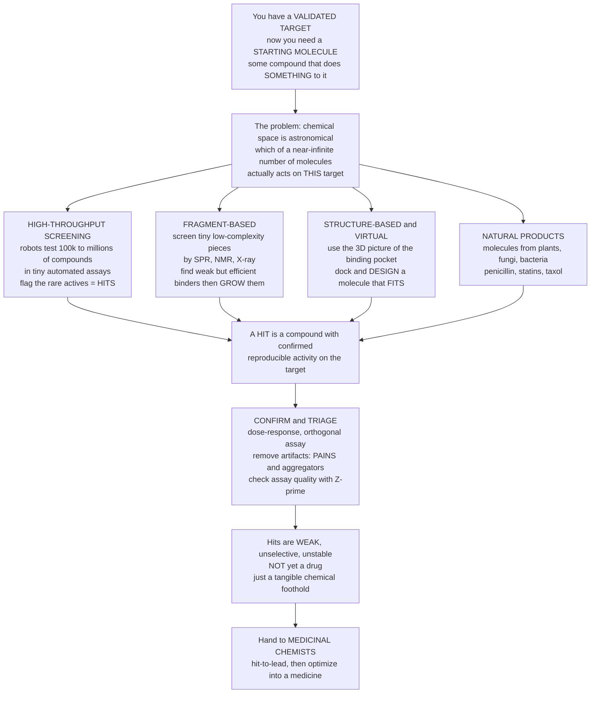

# 🎯 Hit Discovery and High-Throughput Screening: Finding the First Molecular Foothold

> [!abstract] TL;DR
> Once biology has handed you a **validated target**, you still have nothing to give a patient — you need a **starting molecule**, some real compound that actually *does something* to that target. But which of the astronomically many possible molecules? The classic brute-force answer is **high-throughput screening (HTS)**: point robots at a **compound library** of 100,000 to a few **million** different molecules, test them all against the target in tiny automated **assays**, and flag the rare few that show any activity — the **hits**. It is unashamedly a numbers game; most compounds do nothing, and a good day yields a **hit rate under 1 percent**. Smarter alternatives complement it: **fragment-based** screening tests tiny molecular pieces and finds weak-but-efficient binders you then *grow* into strong ones; **structure-based / virtual** screening uses a 3D picture of the target's binding pocket to *design* a molecule that fits; **DNA-encoded libraries** screen billions; and **natural products** (from plants, fungi, and bacteria) have historically handed us penicillin, statins, and taxol. The hits you find are **not drugs** — they are weak, unselective, chemically fragile starting points, riddled with **artifacts** (PAINS, aggregators) you must confirm away. But finding that first genuine molecular foothold is a pivotal moment: it turns an abstract target into a **tangible chemical starting point** that medicinal chemists can optimize into a medicine.

---

## Intuition

**Analogy FIRST — a robotic factory testing a million keys against one lock.** You have finally identified the *lock* — the disease-driving protein you want to jam or open (the target). Now you need a *key*: some molecule that fits it. The trouble is that the universe of possible drug-like molecules is unimaginably vast — chemists estimate more than **10^60** conceivable small molecules, more than there are stars in the observable universe. You cannot try them all, and you have no idea in advance which one wiggles the lock.

So the pharmaceutical industry does the obvious brute-force thing at industrial scale: it builds a warehouse-sized **robotic factory** that grabs key after key from a giant rack — a **compound library** of a million physical molecules — and mechanically tries each one in the lock, thousands per hour, in miniaturized wells the size of a pinhead. The vast majority do nothing at all. But every so often a key **wiggles the lock** — the well lights up, dims, or glows — and the robot flags it. Those flagged compounds are the **hits**: the rare few, often a fraction of a percent, that show *any* activity against your target. That is **high-throughput screening (HTS)**.

Brute force is not the only way to find a key, though. **Fragment-based** discovery hands the robot not whole keys but the *teeth* of keys — tiny molecular fragments — and looks for pieces that even loosely touch the right part of the lock, which you then *grow tooth by tooth* into a full key. **Structure-based** design skips guessing entirely: if you can photograph the shape of the lock's keyhole (a 3D structure of the binding pocket), you can *design* a key to fit it and dock candidates in a computer before ever making them. And **nature** has been cutting keys for billions of years — plants, fungi, and bacteria produce molecules that already bind human proteins, which is how we got penicillin (a fungus) and statins (a fungus) and taxol (a tree).

Here is the crucial caveat that beginners miss: **a hit is not a drug.** The key that "even wiggles" the lock is weak, it probably rattles other locks too (unselective), and it may fall apart in the body. Its value is not that it works — it barely does — but that it is a **real, physical, chemical starting point**. It converts an abstract, validated target into something a medicinal chemist can hold and improve. Finding that first foothold is where an idea becomes a molecule.

---

## How It Works

### Core mechanics

1. **From target to hit.** A **hit** is defined narrowly: a compound with *confirmed, reproducible* activity against the target above some threshold. It is a *starting point*, not a medicine. The whole problem is searching an enormous **chemical space** for the rare actives — you are looking for needles in a haystack you built on purpose.
2. **Miniaturize and automate the assay.** You need a readout that reports whether the target's activity or binding changed. **Biochemical assays** use purified target (measure enzyme turnover, or direct binding); **cell-based / phenotypic assays** read a whole-cell response. The readout is usually **fluorescence** or **luminescence** because those are cheap, fast, and machine-readable. The reaction is shrunk into **microplates** — 384 or 1536 wells per plate — and dispensed, incubated, and read by robots.
3. **Run the library through it.** A **compound library** of 10^5 to 10^6 molecules is screened, typically one compound per well at a single concentration. Robots handle liquid dispensing, plate movement, and reading, so a full campaign of a million wells runs in weeks.
4. **Guard assay quality with Z-prime.** Before trusting any hit you must prove the assay can *separate signal from noise*. The **Z' (Z-prime) factor** compares the spread of positive and negative controls to the gap between their means; **Z' above 0.5** is considered a robust, screenable assay. A noisy assay produces garbage hits no matter how many compounds you run.
5. **Pick hits, then confirm them.** Apply an **activity threshold** (e.g. percent inhibition above a cutoff, or a **Z-score** relative to the plate population). The raw **hit rate is usually under 1 percent**. Then *confirm*: re-test hits (reproducibility), run a **dose-response** curve (real hits are concentration-dependent, giving an IC50/EC50), and use an **orthogonal assay** with a different readout to kill artifacts.
6. **Kill the artifacts.** A large share of primary hits are **false positives**: **PAINS** (pan-assay interference compounds that light up in everything), **aggregators** (colloidal particles that nonspecifically sequester the target), fluorescent/colored interferents, and reactive nuisances. Removing them is not optional — it is the difference between a hit and a mirage.
7. **Complementary hit-finding routes.** **Fragment-based** screening tests small, low-complexity fragments by sensitive **biophysics (SPR, NMR, X-ray)** — weak binders (millimolar) but *efficient* ones you grow or link. **Structure-based / virtual screening** docks compounds against the target's 3D structure computationally. **DNA-encoded libraries** barcode and screen billions of compounds in one tube. **Natural products** and **known-drug (repurposing) libraries** offer chemically rich or de-risked starting points.
8. **Assess and triage.** Surviving hits are scored on **potency, selectivity, chemical tractability, novelty/IP, drug-likeness**, and **ligand efficiency** (potency *per heavy atom*). The best become the input to **hit-to-lead** and the downstream lead-optimization stage.

### Flow



---

## Key Concepts

### Secondary (explain to a bright teenager)

- **A hit is a starting molecule, not a drug.** Once scientists know *which* protein causes a disease (the target), they need a molecule that grabs it. The first molecule they find that does *anything* to the target is called a **hit**. It is weak and imperfect — a starting point to improve, not a finished medicine.
- **The haystack is enormous.** There are more possible drug-like molecules than stars in the sky. You cannot try them all, and you cannot guess which one works.
- **High-throughput screening is brute force by robot.** Companies keep libraries of hundreds of thousands to *millions* of real compounds. Robots test every one against the target in tiny wells, looking for the rare few that show activity. Most do nothing — a good result is well **under 1 in 100**.
- **Smarter shortcuts exist.** **Fragment** screening tries tiny molecular pieces and grows the good ones. **Structure-based** design uses a 3D picture of the target to build a molecule that fits its pocket, like carving a key to match a keyhole.
- **Nature is a chemist too.** Many famous drugs came from living things — **penicillin** from a mould, **statins** from a fungus, **taxol** (a cancer drug) from a tree.
- **You have to double-check hits.** Many "hits" are fakes — molecules that fool the test. Scientists re-test them carefully before believing them.

### Undergraduate (needs some biology / chemistry)

- **Defining a hit.** A **hit** is a compound showing *confirmed, reproducible, concentration-dependent* activity against the target in a validated assay, above a defined threshold. "Primary hits" from a single screen must be *confirmed* before they earn the name.
- **Assay formats.**
  - **Biochemical** — purified target in a tube; measure enzyme activity (product formation), or direct **binding** (e.g. displacement of a labelled ligand). Clean and mechanistic.
  - **Cell-based / phenotypic** — a whole-cell readout (reporter gene, viability, second messenger). More disease-relevant but the target is implicit and must be deconvoluted.
  - **Readouts** are dominated by **fluorescence** (intensity, polarization, FRET) and **luminescence** (luciferase, AlphaScreen) because they scale and automate well.
- **Plate formats and miniaturization.** Screens run in **96 → 384 → 1536-well** plates; smaller wells mean less reagent and target protein per data point, which is what makes a million-compound campaign affordable.
- **Assay quality — the Z' factor.** $Z' = 1 - \dfrac{3(\sigma_{+} + \sigma_{-})}{|\mu_{+} - \mu_{-}|}$, where $+$ and $-$ are the positive and negative controls. **Z' > 0.5** is an excellent, screenable assay; **0 to 0.5** is marginal; **below 0** the control distributions overlap and the assay is unusable. This single number is checked before every campaign.
- **Hit identification and hit rate.** Hits are flagged by an **activity threshold** — a fixed percent-inhibition cutoff, or a statistical **Z-score** (e.g. 3 standard deviations from the inactive population mean). Typical **hit rates are under 1 percent**; a higher rate often signals a *promiscuous* target or a flawed assay, not good luck.
- **Confirmation and artifact removal.** Confirm hits by (1) **re-test** for reproducibility, (2) **dose-response** to get an IC50/EC50 and confirm concentration dependence, and (3) an **orthogonal assay** with a different readout. Filter **PAINS**, **colloidal aggregators** (add detergent to test), fluorescence interference, and reactive compounds. This is *hit-to-confirmed-hit* triage.
- **Fragment-based drug discovery (FBDD).** Screen small (< ~300 Da) fragments. Because they are simple, they bind *weakly* (mM–high µM) but sample the pocket efficiently — so a small library covers chemical space well and gives a **high hit rate**. Detection needs sensitive biophysics: **SPR, ligand-observed NMR, X-ray crystallography, ITC**. You then **grow** a fragment into the pocket or **link** two fragments, tracking **ligand efficiency**.
- **Ligand efficiency (LE).** Potency normalized by size: $LE \approx \dfrac{1.37 \times pIC_{50}}{\text{heavy atoms}}$ (kcal·mol⁻¹ per heavy atom). It rewards *efficient* binding and prevents chasing raw potency by bolting on molecular weight — central to fragment work and hit selection.
- **Other routes.** **Structure-based / virtual screening** docks libraries against a 3D structure to prioritize compounds computationally. **DNA-encoded libraries (DEL)** barcode compounds with DNA and screen billions in one tube. **Natural products** and **repurposing/known-drug libraries** offer rich or de-risked chemistry.

### Graduate (system-level / mechanistic)

- **Chemical space and library design.** The synthesizable drug-like space vastly exceeds any physical collection, so **library composition** is a strategic choice: *diversity* (broad coverage), *quality* (drug-likeness, absence of reactive/PAINS scaffolds), *lead-likeness* (lower MW/logP to leave room for optimization), and *target-focused* subsets (kinase-biased, GPCR-biased). A million random compounds is worse than a well-designed 300,000.
- **The molecular-complexity argument for fragments.** Hann's model: as a molecule grows more complex, the probability that it matches a binding site *usefully* (all contacts favourable, none clashing) falls off sharply, but so does the probability of *detecting* a match. Low-complexity fragments therefore have a **higher probability of binding somewhere useful** — the theoretical justification for FBDD's high hit rates and its superior *starting points* despite low potency.
- **Screening statistics and thresholds.** Single-shot primary screens trade **false negatives** (missed actives, from noise or single-concentration testing) against **false positives** (nuisance actives). The threshold is a decision on the ROC curve; **Z' and SSMD (strictly standardized mean difference)** quantify assay quality and hit selection. Replicate and confirmation stages progressively purge false positives at the cost of throughput.
- **Mechanisms of artifact.** **Colloidal aggregation** (compounds forming ~100 nm particles that adsorb and partially denature protein) is the single largest source of false positives in biochemical HTS — diagnosed by detergent sensitivity and steep, non-competitive dose-response. **PAINS** substructures (rhodanines, quinones, catechols) react or interfere across unrelated assays. **Redox cyclers, fluorescence quenchers, and covalent reactives** round out the nuisance zoo. Rigorous mechanism-of-action triage is what separates real chemical matter from noise.
- **Biophysical orthogonality.** Confirming a fragment or hit's *direct binding* by an assay-independent method — **SPR** kinetics, **NMR** chemical-shift perturbation, **ITC** thermodynamics, or a co-crystal **X-ray** structure — is the gold standard, because it reports binding without the activity readout that artifacts exploit. A crystal structure also *maps where* the hit binds, seeding structure-based growth.
- **Hit assessment dimensions.** Beyond potency: **selectivity** (counter-screen against related targets and anti-targets), **chemical tractability** (a synthesizable, elaborable scaffold), **novelty and IP** (freedom to operate, patentability), **drug-likeness** (Lipinski/Veber, but treated as a guide not a gate), and **ligand/lipophilic efficiency** (LE, LLE). Triage selects *series*, not single compounds, for the **hit-to-lead** transition.
- **Modality and screening technology co-evolve.** DEL enables billion-scale affinity selection; **affinity-selection mass spectrometry** and **cellular thermal shift (CETSA)** report target engagement directly; **high-content imaging** turns phenotypic screens into rich multiparameter data; and machine-learning-guided **virtual screening** now pre-filters ultra-large make-on-demand libraries (billions of enumerated compounds) before any synthesis. The economics of hit discovery are set by how cheaply you can *interrogate* chemical space and *reject* artifacts.

---

## Python Demo

```python
# Hit discovery and high-throughput screening -- four illustrative pieces:
#   (a) HTS SCREEN + HIT RATE : a huge library of percent-inhibition readings
#       (mostly inactive noise + a rare active population) with a hit threshold.
#   (b) ASSAY QUALITY (Z') : positive vs negative control distributions and the
#       Z-prime factor that decides whether the assay is screenable.
#   (c) FRAGMENT GROWING : a weak fragment elaborated step by step into a lead,
#       affinity climbing while ligand efficiency is tracked.
#   (d) HIT-TRIAGE FUNNEL : primary hits -> confirmed -> validated -> tractable.
# All numbers are illustrative teaching values. Educational content, not medical advice.
import numpy as np
import matplotlib.pyplot as plt

rng = np.random.default_rng(7)
fig, ax = plt.subplots(2, 2, figsize=(14, 10))

# ---------------------------------------------------------------------------
# (a) HTS screen: library of percent-inhibition readings + hit threshold
N          = 200_000                      # compounds in the library
true_frac  = 0.004                        # ~0.4% are genuine actives
n_active   = int(true_frac * N)
inactive   = rng.normal(0, 8, N)          # inactive population: noise around 0% inhibition
library    = inactive.copy()
idx_active = rng.choice(N, n_active, replace=False)
library[idx_active] = rng.normal(75, 12, n_active)   # actives: high % inhibition
library    = np.clip(library, -30, 120)

threshold  = 30.0                         # hit cutoff = 30% inhibition
is_hit     = library > threshold
hit_rate   = 100 * is_hit.mean()
# how many flagged hits are actually from the noise tail (false positives)?
truth      = np.zeros(N, bool); truth[idx_active] = True
false_pos  = np.sum(is_hit & ~truth)
true_pos   = np.sum(is_hit &  truth)

ax[0, 0].hist(library, bins=120, color="#7f8c8d", log=True, label="all compounds")
ax[0, 0].hist(library[truth], bins=120, color="#27ae60", log=True, label="true actives")
ax[0, 0].axvline(threshold, color="#c0392b", ls="--", lw=2, label=f"hit threshold = {threshold:.0f}%")
ax[0, 0].set_xlabel("Percent inhibition (screen readout)")
ax[0, 0].set_ylabel("Number of compounds (log scale)")
ax[0, 0].set_title(f"(a) HTS: {N:,} compounds, hit rate = {hit_rate:.2f}%")
ax[0, 0].legend(fontsize=8)

# ---------------------------------------------------------------------------
# (b) Assay quality: Z-prime factor from control distributions
neg = rng.normal(5, 5, 3000)              # negative control: no inhibition (background)
pos = rng.normal(95, 6, 3000)             # positive control: full inhibition (reference drug)
def zprime(p, n):
    return 1 - 3 * (p.std() + n.std()) / abs(p.mean() - n.mean())
Zp = zprime(pos, neg)

ax[0, 1].hist(neg, bins=40, color="#95a5a6", alpha=0.8, label="negative control")
ax[0, 1].hist(pos, bins=40, color="#2980b9", alpha=0.8, label="positive control")
verdict = "screenable" if Zp > 0.5 else ("marginal" if Zp > 0 else "unusable")
ax[0, 1].set_title(f"(b) Assay quality: Z' = {Zp:.2f}  ->  {verdict}")
ax[0, 1].set_xlabel("Assay signal (percent inhibition)")
ax[0, 1].set_ylabel("Count")
ax[0, 1].text(0.5, 0.72, "Z' > 0.5 = robust\nbig gap, tight controls",
              transform=ax[0, 1].transAxes, fontsize=8,
              bbox=dict(boxstyle="round", fc="#eafaf1", ec="#27ae60"))
ax[0, 1].legend(fontsize=8)

# ---------------------------------------------------------------------------
# (c) Fragment growing: weak fragment -> elaborated -> lead
step        = ["fragment", "grown +1", "grown +2", "linked", "lead"]
heavy_atoms = np.array([11, 16, 21, 27, 31])
pIC50       = np.array([3.0, 4.3, 5.4, 6.9, 8.1])     # -log10(IC50): higher = tighter
LE          = 1.37 * pIC50 / heavy_atoms              # ligand efficiency (kcal/mol per heavy atom)

axc = ax[1, 0]
axc.plot(range(len(step)), pIC50, "o-", color="#8e44ad", lw=2.4, ms=9, label="affinity  pIC50")
axc.set_xticks(range(len(step))); axc.set_xticklabels(step, fontsize=8)
axc.set_ylabel("Affinity  pIC50  (higher = tighter)", color="#8e44ad")
axc.set_title("(c) Fragment-based: grow a weak binder into a lead")
axc.grid(alpha=0.3)
axc2 = axc.twinx()
axc2.plot(range(len(step)), LE, "s--", color="#e67e22", lw=1.8, ms=7, label="ligand efficiency")
axc2.set_ylabel("Ligand efficiency (kcal/mol per heavy atom)", color="#e67e22")
axc.annotate("weak but EFFICIENT\nstarting fragment", xy=(0, 3.0), xytext=(0.4, 4.6),
             fontsize=8, arrowprops=dict(arrowstyle="->"))

# ---------------------------------------------------------------------------
# (d) Hit-triage funnel: how many survive each filter
stages = ["Primary\nhits", "Reconfirmed", "Dose-\nresponse", "Artifact-free\n(orthogonal)", "Tractable\nseries"]
counts = [420, 190, 95, 48, 12]
colors = plt.cm.viridis(np.linspace(0.15, 0.85, len(stages)))
bars = ax[1, 1].bar(stages, counts, color=colors)
for b, c in zip(bars, counts):
    ax[1, 1].text(b.get_x() + b.get_width()/2, c + 5, str(c),
                  ha="center", fontsize=9, fontweight="bold")
ax[1, 1].set_ylabel("Compounds surviving")
ax[1, 1].set_title("(d) Hit triage: most 'hits' are filtered out")
ax[1, 1].tick_params(axis="x", labelsize=8)

plt.tight_layout()
plt.savefig("hit_discovery_hts.png", dpi=120)
plt.show()

# Console summary
print(f"(a) Library {N:,}: {is_hit.sum():,} flagged hits, hit rate {hit_rate:.2f}% "
      f"| true positives {true_pos}, false positives {false_pos}")
print(f"(b) Z-prime = {Zp:.2f}  ({verdict})")
print(f"(c) Fragment pIC50 {pIC50[0]:.1f} -> lead {pIC50[-1]:.1f}; "
      f"ligand efficiency stayed {LE.min():.2f}-{LE.max():.2f}")
print(f"(d) Triage: {counts[0]} primary hits collapse to {counts[-1]} tractable series "
      f"({100*counts[-1]/counts[0]:.1f}% survive)")
```

**What it shows.** Panel **(a)** is the essence of HTS: a library of 200,000 compounds is overwhelmingly a **noise population** centred on zero inhibition, with a tiny green **active** population buried in the right tail; a **hit threshold** slices off a sub-1-percent **hit rate**, and the console reveals that some flagged hits are actually **false positives** from the noise tail — which is why confirmation exists. Panel **(b)** computes the **Z' factor** from positive and negative controls: a wide gap with tight controls gives **Z' > 0.5** ("screenable"), while overlapping controls would sink it toward unusable — the go/no-go gate before any real screen. Panel **(c)** is **fragment-based** discovery: a weak fragment (pIC50 ≈ 3, millimolar) is elaborated step by step into a nanomolar **lead** (pIC50 ≈ 8) while **ligand efficiency** is tracked so potency is won *efficiently*, not by bolting on mass. Panel **(d)** is the sobering **hit-triage funnel**: ~420 primary hits collapse to a handful of genuinely **tractable series** after reconfirmation, dose-response, and artifact removal — the real output that medicinal chemists receive.

---

## Real-World Applications

> **Example — HTS at industrial scale (the pharma standard).** Every major pharmaceutical company (and academic centres like the NIH's Molecular Libraries program and Broad Institute) maintains a curated **compound library** of ~10^5 to 10^6 molecules and a fully robotic screening line: acoustic liquid dispensers, plate-stacking arms, and 1536-well readers that can run a **million-compound campaign** in weeks. Macarron and colleagues documented that HTS, despite its low hit rate, has been the workhorse that generated the starting points for a large share of modern small-molecule drugs — it *industrialized* the search of chemical space.

- **Fragment-based success — vemurafenib (Zelboraf).** The BRAF-V600E melanoma drug traces to a **fragment** screen against kinases: a weak (millimolar) fragment binding the kinase hinge was grown, guided by co-crystal structures, into a potent, selective inhibitor. It was one of the first FDA-approved drugs born from **FBDD**, proving that a weak-but-efficient fragment is a superior starting point.
- **Fragment-based success — venetoclax (a BCL-2 inhibitor).** Built by **SAR-by-NMR** fragment linking against a "flat" protein–protein interaction surface long considered undruggable, venetoclax became a landmark leukemia/lymphoma drug — showing fragments can crack targets HTS cannot.
- **Natural products — the deepest hit source in history.** **Penicillin** (from *Penicillium* mould), **statins** (lovastatin from *Aspergillus*), **taxol/paclitaxel** (Pacific yew), **artemisinin** (sweet wormwood), and countless antibiotics were discovered as **natural products**. Newman and Cragg's long-running survey shows that a large fraction of approved small-molecule drugs are natural products or directly derived from them.
- **Structure-based and virtual screening — HIV and COVID.** HIV protease inhibitors and SARS-CoV-2's **nirmatrelvir** (Paxlovid) were driven by **structure-based design** against a crystallized viral enzyme active site; ultra-large **virtual screens** of billion-compound make-on-demand libraries now routinely nominate physical hits before synthesis.
- **DNA-encoded libraries — screening billions in a tube.** DEL platforms encode each compound with a unique DNA barcode, so **billions** of molecules are screened by affinity selection against an immobilized target and the binders read out by DNA sequencing — used across the industry to find novel hit chemotypes for hard targets.
- **Repurposing / known-drug libraries.** Screening libraries of already-approved drugs (de-risked for safety) for new indications is how programs rapidly found and tested candidates during emergencies, and how many drugs gained second lives.

---

## Common Pitfalls

- **Believing a hit is a drug.** A hit is a *weak, unselective, chemically fragile starting point* — often micromolar, often flawed. Its worth is as a foothold to *optimize*, not as a candidate. Treating primary-screen actives as if they were leads skips all the confirmation and triage that actually matters.
- **Trusting hits without artifact triage.** A large share of primary hits are **PAINS, aggregators, fluorescent/coloured interferents, or reactive nuisances**. Skipping the detergent-sensitivity check (for aggregation), PAINS filters, and an **orthogonal assay** means chasing molecules that never truly bound the target. This is the single most common way early programs waste years.
- **Screening a bad assay.** No number of compounds rescues a noisy assay. If **Z' is below ~0.5**, hits are indistinguishable from noise. Assay development and validation *before* the campaign is not overhead — it is the campaign.
- **Reading IC50 or hit rate as fixed truth.** A single-concentration primary screen has **false negatives** (missed actives) and **false positives**; only **dose-response** confirmation (concentration dependence, a real IC50/EC50) tells you a hit is genuine. An unusually **high hit rate** usually means a promiscuous target or a broken assay, not good fortune.
- **Chasing potency by adding mass.** Bolting hydrophobic bulk onto a hit raises raw potency but ruins drug-likeness. Track **ligand efficiency** and **lipophilic efficiency** so you improve binding *per atom*, especially when growing fragments — the classic fragment discipline.
- **Ignoring library quality and diversity.** A big library full of similar, reactive, or non-drug-like compounds underperforms a smaller, diverse, well-curated one. Coverage of **chemical space** and removal of nuisance scaffolds up front determines what you can possibly find.
- **Confusing biochemical with cellular relevance.** A biochemical hit against purified target may not work in cells (permeability, efflux) — and a phenotypic hit may act through an unknown target. Each format answers a different question; conflating them misleads triage.

---

## Related Concepts

This note is the **hit-discovery stage** of the drug-discovery pipeline and sits between the target and the lead. It follows directly from *Target Identification and Validation* — you can only screen once you have a validated target and a working assay for it — and it feeds *Lead Optimization and Medicinal Chemistry*, which takes the weak, artifact-free hits triaged here and improves their potency, selectivity, and drug-likeness. The overarching map of stages is laid out in *The Drug Discovery Pipeline*; the computational route to hits (docking against a 3D pocket) is detailed in *Structure-Based Drug Design and Docking*; and the notion of searching an astronomically large **chemical space** with descriptors and libraries is the subject of *Cheminformatics and Chemical Space*. (These are sibling notes in this section and are referenced in prose.)

Cross-vault and pharmacology foundations (Glob-verified):

- [[Drug_Targets_and_the_Druggable_Genome]] — the *target* you screen against; whether a target has a bindable pocket (druggability) sets whether HTS, fragments, or structure-based design will even find a foothold.
- [[Enzymes_as_Drug_Targets]] — biochemical HTS most often reads out **enzyme activity**; the inhibition kinetics and IC50/Ki measured during hit confirmation come straight from this enzyme-target world.
- [[Drug_Receptor_Interactions_and_Binding]] — binding assays, affinity (Kd), and the dose-response confirmation of hits are the receptor-binding framework applied to screening readouts and ligand efficiency.
- [[Pharmacodynamics_Drug_Action]] — the **dose-response** curve used to confirm a hit (EC50/IC50, concentration dependence) is the same pharmacodynamic machinery, here used as a triage filter rather than a therapeutic descriptor.
- [[Enzyme_Kinetics_and_Catalysis]] — the Michaelis–Menten enzymology behind biochemical assay readouts; understanding turnover and inhibition is what lets a screen report "activity."
- [[Protein_Structure_and_Function]] — the folded 3D pocket that fragment screening (X-ray/NMR) maps and that structure-based/virtual screening docks into; hit binding is a feature of protein structure.
- [[Structure_Bonding_and_Functional_Groups]] — the organic-chemistry building blocks and functional groups that define a compound library's chemical space and flag reactive nuisance scaffolds.
- [[Enzymes_and_Catalysis]] — the biology of enzymes as catalysts and assay substrates, underpinning the cell-based and biochemical readouts a screen depends on.

---

## Review Questions

**Secondary**
1. Explain, using the "robotic factory testing keys against a lock" picture, what **high-throughput screening** does and why most compounds it tests are *not* hits.
2. A drug does not appear at the end of a screen — a **hit** does. In your own words, why is a hit only a *starting point* and not a medicine?

**Undergraduate**
3. A screen of 500,000 compounds returns a 3 percent "hit rate," and the assay's Z' factor is 0.2. Give two independent reasons to be suspicious of these hits, and describe the confirmation steps (reproducibility, dose-response, orthogonal assay, artifact filters) you would run before believing any of them.
4. Contrast **HTS** with **fragment-based** discovery on *hit rate*, *hit potency*, *library size*, and *detection method*. Why can a weak millimolar fragment be a *better* starting point than a micromolar HTS hit? Bring **ligand efficiency** into your answer.

**Graduate**
5. Colloidal **aggregation** is the largest single source of false positives in biochemical HTS. Explain the mechanism, how it appears in dose-response and detergent-sensitivity experiments, and why an **orthogonal biophysical** confirmation (SPR/NMR/X-ray) is the gold standard for distinguishing a real hit from an artifact.
6. You must choose a hit-finding strategy for (a) a well-characterized enzyme with a deep active site and a crystal structure, and (b) a "flat" protein–protein interaction surface historically called undruggable. Recommend an approach for each — among HTS, fragment-based, structure-based/virtual, DEL, and natural products — and justify each choice using the **molecular-complexity** argument and target tractability.

---

## Sources

- Macarron R, Banks MN, Bojanic D, et al. "Impact of high-throughput screening in biomedical research." *Nature Reviews Drug Discovery* 2011;10:188–195. https://doi.org/10.1038/nrd3368
- Hughes JP, Rees S, Kalindjian SB, Philpott KL. "Principles of early drug discovery." *British Journal of Pharmacology* 2011;162:1239–1249. https://doi.org/10.1111/j.1476-5381.2010.01127.x
- Erlanson DA, Fesik SW, Hubbard RE, Jahnke W, Jhoti H. "Twenty years on: the impact of fragments on drug discovery." *Nature Reviews Drug Discovery* 2016;15:605–619. https://doi.org/10.1038/nrd.2016.109
- Newman DJ, Cragg GM. "Natural products as sources of new drugs over the nearly four decades from 1981 to 2019." *Journal of Natural Products* 2020;83:770–803. https://doi.org/10.1021/acs.jnatprod.9b01285
- Zhang JH, Chung TDY, Oldenburg KR. "A simple statistical parameter for use in evaluation and validation of high throughput screening assays" (the Z'-factor). *Journal of Biomolecular Screening* 1999;4:67–73. https://doi.org/10.1177/108705719900400206

---

#pharmacology #high-throughput-screening #hit-discovery #fragment-based #natural-products
