# 💊 Lead Optimization and Medicinal Chemistry

> [!abstract] TL;DR
> A screening **hit** is a *rough diamond* — it touches the target, but it binds weakly, hits things it shouldn't, gets chewed up too fast, or can't even reach where it needs to go. **Lead optimization** is the painstaking art of **medicinal chemistry**: chemists synthesize hundreds of slightly-different versions of a molecule, tweaking one piece at a time, and test each in a relentless **design-make-test-analyze (DMTA)** cycle that gradually sculpts a crude starting compound into a polished **drug candidate**. It is like tuning a race car where improving one thing often worsens another — make the molecule bind tighter and it may become less soluble; make it last longer in the body and it may become toxic. The chemist must simultaneously juggle **potency**, **selectivity** (hitting only the intended target), and the **ADMET** properties — **A**bsorption, **D**istribution, **M**etabolism, **E**xcretion, and crucially **T**oxicity — that decide whether it can actually work as a medicine. The map for all of this is the **structure-activity relationship (SAR)**, and heuristics like **Lipinski's Rule of Five** flag whether a molecule even looks like an oral drug. This multi-dimensional balancing act is where most of the creative chemistry of drug discovery happens — and where most candidates die.
>
> *Educational science note — not individual medical or dosing advice.*

---

## Intuition

**Analogy — a hit is a rough diamond, and the medicinal chemist is the cutter.** When a high-throughput screen coughs up a "hit," you have not found a drug — you have found a raw, cloudy stone that *sparkles just enough to notice*. It interacts with the target, but it is flawed in almost every practical way: it grips too weakly (**low potency**), it also grabs the wrong proteins (**poor selectivity**, the source of side effects), the body's enzymes shred it within minutes (**metabolic instability**), and it may be too greasy or too big to dissolve and cross into the bloodstream (**poor absorption**). A rough diamond is not jewelry; a hit is not a medicine.

**Lead optimization is the cutting and polishing.** The chemist does not throw the stone away and start over — they *reshape it, facet by facet*. They synthesize a new **analog** with one small change (swap a methyl for a chlorine, add a nitrogen, restrict a floppy bond), test it, learn what that change did, and use that lesson to design the next one. Round after round, this **design-make-test-analyze** loop turns a dull hit into a brilliant candidate.

**But here is the cruel twist — it is like tuning a race car.** Improving one property often *breaks* another. Make the molecule bind tighter by hanging a greasy group off it, and its **solubility** collapses. Make it survive metabolism by blocking the enzyme's favourite spot, and it may start blocking a heart channel and become **cardiotoxic**. So the chemist is never optimizing one number — they are performing a **multi-parameter optimization**, holding potency, selectivity, solubility, metabolic stability, and safety in tension all at once. A rule of thumb like **Lipinski's Rule of Five** whispers whether the molecule is even in the right neighbourhood to be an oral drug (small enough, not too greasy). The chemist's map through this maze is the **structure-activity relationship** — the accumulated knowledge of *how each structural change moves each property*. Sculpting a crude hit into a candidate good enough to put into humans is the creative heart of drug discovery, and the graveyard where most candidates are buried.

---

## How It Works

### Core mechanics

Lead optimization sits in the middle of the discovery pipeline, bridging two milestones with a third:

1. **Hit** — a compound showing *initial, confirmed activity* against the target (from screening or virtual screening). It is weak, promiscuous, and undeveloped.
2. **Lead** — a *validated, tractable chemical series* with acceptable potency, meaningful SAR, and no fatal liabilities — a defensible starting point worth heavy investment.
3. **Candidate** — a single **optimized molecule** selected for preclinical development because it meets a predefined **target product profile** (potency, selectivity, ADMET, safety, developability).

The engine that drives a hit to a candidate is the **DMTA cycle**:

1. **Design** — propose new **analogs**, guided by prior SAR, structure-based/computational modelling (docking, free-energy methods), and medicinal-chemistry intuition about *which one change* to make.
2. **Make** — **synthesize** the analogs. Synthetic accessibility is itself a constraint; a brilliant design you cannot make is useless.
3. **Test** — measure biology (target potency, selectivity panels) and properties (solubility, permeability, metabolic stability, hERG, cytotoxicity).
4. **Analyze** — read the **structure-activity relationship (SAR)** — how each structural change altered each property — and feed it back into the next **Design** round.

**Multi-parameter optimization (MPO)** is the defining challenge. The chemist simultaneously pushes on:

- **Potency** — affinity/efficacy at the target (binding tighter, lower IC50/Ki).
- **Selectivity** — *not* hitting off-targets, which drives both efficacy margin and toxicity.
- **ADMET / developability** — **A**bsorption (solubility, permeability), **D**istribution (plasma-protein binding, tissue/blood-brain-barrier penetration), **M**etabolism (metabolic stability, avoiding reactive metabolites and CYP inhibition), **E**xcretion (clearance route), and **T**oxicity (avoiding hERG cardiotoxicity, hepatotoxicity, mutagenicity).

These are governed by **physicochemical properties** — molecular weight (MW), lipophilicity (logP/logD), hydrogen-bond donors and acceptors, polar surface area, and pKa. **Drug-likeness heuristics** compress hard-won experience into rules:

- **Lipinski's Rule of Five** — poor oral absorption is *likely* when MW &gt; 500, logP &gt; 5, H-bond donors &gt; 5, or H-bond acceptors &gt; 10.
- **Ligand efficiency** — potency *per heavy atom*, to avoid winning affinity by simply bloating the molecule.
- **"Escape from flatland"** — more three-dimensional, sp3-rich scaffolds tend to be more soluble and more selective than flat aromatic slabs.

The medicinal chemist's **toolkit of moves** includes **bioisosteres** (swap a group for one with similar properties but better ADMET), **scaffold hopping** (change the core while keeping the pharmacophore), **prodrugs** (mask a molecule to fix absorption, then unmask it in the body), **conformational restriction** (lock the active shape to boost potency and selectivity), and **metabolic soft-spot blocking** (protect the site enzymes attack). Because fixing one property routinely breaks another, this is a genuinely **multi-dimensional** optimization — and it is *the* attrition point where most candidates die.

### From hit to candidate: the optimization loop

```mermaid
flowchart LR
    HIT["HIT: a rough diamond<br/>weak potency, poor selectivity<br/>metabolically unstable<br/>poorly absorbed"]
    LO["LEAD OPTIMIZATION<br/>by MEDICINAL CHEMISTRY"]
    DESIGN["DESIGN: propose analogs<br/>tweak one piece at a time<br/>guided by SAR and modelling"]
    MAKE["MAKE: synthesize<br/>many close variants"]
    TEST["TEST: measure potency,<br/>selectivity and ADMET"]
    ANALYZE["ANALYZE: read the<br/>structure-activity relationship"]
    JUGGLE["JUGGLE many properties at once<br/>potency plus SELECTIVITY plus ADMET<br/>absorption, distribution, metabolism,<br/>excretion, toxicity"]
    TRADE["Improving one property<br/>often WORSENS another"]
    SAR["SAR is the MAP that<br/>guides the next round"]
    CAND["Polished DRUG CANDIDATE<br/>meets target product profile<br/>ready for human testing"]

    HIT --> LO
    LO --> DESIGN
    DESIGN --> MAKE
    MAKE --> TEST
    TEST --> ANALYZE
    ANALYZE --> JUGGLE
    JUGGLE --> TRADE
    TRADE --> SAR
    SAR -->|"design the next analog"| DESIGN
    SAR -->|"once all properties balanced"| CAND
```



---

## Key Concepts

### Secondary (foundations)
- **Hit vs lead vs candidate** — a hit *just* works a little; a lead is a promising, cleaned-up series; a candidate is the finished molecule chosen to test in animals then humans.
- **A hit is a rough diamond** — it interacts with the target but is weak, unselective, unstable, or poorly absorbed. It must be *reshaped*, not merely purified.
- **Medicinal chemistry** — the science of designing and synthesizing molecules that are both *active* and *drug-like*.
- **Design-make-test-analyze** — make a slightly different version, test it, learn from it, repeat. Progress is iterative, not a single lucky shot.
- **Potency, selectivity, safety** — a drug must be *strong enough* (potency), *aimed correctly* (selectivity), and *not poisonous* (safety) — all at once.

### Undergraduate (mechanisms and parameters)
- **Structure-activity relationship (SAR)** — the systematic mapping of how each structural change alters activity and properties; the chemist's core knowledge map.
- **Multi-parameter optimization (MPO)** — simultaneously improving many conflicting objectives; there is no single number to maximize, only a balance to strike.
- **ADMET** — **A**bsorption, **D**istribution, **M**etabolism, **E**xcretion, **T**oxicity: the "developability" properties that decide whether an active molecule can function as a medicine.
- **Physicochemical drivers** — **MW**, **logP/logD** (lipophilicity), **H-bond donors/acceptors**, **polar surface area**, **pKa**; small changes here ripple through solubility, permeability, and binding.
- **Lipinski's Rule of Five** — a fast filter predicting poor *oral* absorption when MW &gt; 500, logP &gt; 5, HBD &gt; 5, or HBA &gt; 10. A guideline, not a law (many injectables and natural products break it).
- **Ligand efficiency (LE)** — binding energy normalized per heavy atom; keeps optimization from "buying" potency by inflating size and lipophilicity.
- **Medicinal-chemistry moves** — **bioisosteres**, **scaffold hopping**, **prodrugs**, **conformational restriction**, **metabolic soft-spot blocking**.

### Graduate (strategy and trade-offs)
- **The lipophilicity trap ("molecular obesity")** — adding greasy, high-MW groups is the easiest way to gain potency, but it degrades solubility, raises promiscuity/off-target toxicity (including **hERG**), and worsens metabolic clearance. LE and **lipophilic ligand efficiency (LLE = pIC50 − logP)** counteract this.
- **hERG and cardiotoxicity** — many basic, lipophilic compounds block the cardiac **hERG potassium channel**, causing QT prolongation; designing *away* from hERG (lowering basicity/logP, adding acidic groups) is a routine, high-stakes optimization axis.
- **Reactive metabolites and CYP liabilities** — certain functional groups (structural alerts) are bioactivated to reactive species (idiosyncratic toxicity), or inhibit/induce **CYP450** enzymes causing drug-drug interactions; medicinal chemists design these liabilities out.
- **Pareto fronts in property space** — MPO is formally multi-objective; a molecule on the **Pareto front** cannot improve one property without sacrificing another. Scoring functions and MPO desirability scores summarize the compromise.
- **Structure-based and computational guidance** — co-crystal structures, docking, and free-energy perturbation (FEP) predict how a modification changes binding, sharpening the design step and cutting synthetic cycles.
- **Free-Wilson and Hansch/QSAR analysis** — quantitative SAR models relate substituent contributions or physicochemical descriptors to activity, letting chemists *extrapolate* the next best analog.
- **Attrition and AI-driven design** — because so many candidates fail here on ADMET/tox, generative and predictive machine-learning models are eagerly deployed to propose better analogs and pre-score developability, compressing the DMTA cycle.

---

## Python Demo

```python
# Lead optimization and medicinal chemistry:
# (a) Multi-parameter optimization over DMTA rounds — potency rises, but a naive
#     "just add lipophilicity" strategy destroys solubility, while a balanced
#     multi-parameter strategy co-optimizes both.
# (b) Radar chart contrasting a raw HIT vs an optimized LEAD across five axes.
# (c) Lipinski property space (MW vs logP) with the Rule-of-Five box, drug-like
#     vs non-drug-like clouds, and an optimization trajectory into the sweet spot.
# numpy + matplotlib only.
import numpy as np
import matplotlib.pyplot as plt

rng = np.random.default_rng(7)

# ============================================================
# (a) MULTI-PARAMETER OPTIMIZATION over DMTA rounds
# ============================================================
rounds = np.arange(0, 9)                       # 0 = hit, 8 = candidate
# Potency as pIC50 (higher = more potent): hit ~10 uM (pIC50 5) -> candidate ~3 nM (pIC50 8.5)
potency = 5.0 + 3.5 * (1 - np.exp(-rounds / 3.0))

# Solubility as logS (higher = more soluble).
# Naive strategy: gain potency by hanging on greasy groups -> solubility collapses.
sol_naive = 4.5 - 3.3 * (1 - np.exp(-rounds / 3.0))
# Balanced MPO: co-optimize -> potency still climbs, solubility barely dips.
sol_mpo   = 4.5 - 0.6 * (1 - np.exp(-rounds / 3.0))

# ============================================================
# (b) RADAR: hit vs optimized lead across 5 normalized properties (0..1)
# ============================================================
axes_labels = ["Potency", "Selectivity", "Solubility", "Metabolic\nstability", "Safety"]
hit_profile  = np.array([0.20, 0.30, 0.70, 0.25, 0.40])
lead_profile = np.array([0.90, 0.85, 0.62, 0.80, 0.82])
N = len(axes_labels)
angles = np.linspace(0, 2 * np.pi, N, endpoint=False)
angles_closed = np.concatenate([angles, angles[:1]])
hit_closed  = np.concatenate([hit_profile,  hit_profile[:1]])
lead_closed = np.concatenate([lead_profile, lead_profile[:1]])

# ============================================================
# (c) LIPINSKI property space: MW vs logP
# ============================================================
# Illustrative clouds of molecules
drug_MW   = rng.normal(360, 70, 240); drug_logP   = rng.normal(2.5, 1.1, 240)
nondrug_MW = rng.normal(620, 130, 200); nondrug_logP = rng.normal(6.2, 1.4, 200)
# Rule-of-Five thresholds relevant to this 2D view
RO5_MW, RO5_logP = 500.0, 5.0
# Optimization trajectory: fragment/hit grows toward the drug-like sweet spot
traj_MW   = np.array([250, 300, 340, 380, 420, 450])
traj_logP = np.array([1.2, 1.8, 2.3, 2.8, 3.2, 3.4])

# ============================================================
# PLOT
# ============================================================
fig = plt.figure(figsize=(17, 5.2))

# --- (a) MPO over rounds ---
ax1 = fig.add_subplot(1, 3, 1)
ax1.plot(rounds, potency, "o-", color="navy", lw=2, label="Potency (pIC50)")
ax1.set_xlabel("DMTA optimization round")
ax1.set_ylabel("Potency  pIC50", color="navy")
ax1.tick_params(axis="y", labelcolor="navy")
ax1.set_title("(a) Multi-parameter optimization:\npotency up, but watch solubility")
ax1.grid(alpha=0.3)

ax1b = ax1.twinx()
ax1b.plot(rounds, sol_naive, "s--", color="crimson", lw=2,
          label="Solubility: naive (greasy)")
ax1b.plot(rounds, sol_mpo, "^-", color="green", lw=2,
          label="Solubility: balanced MPO")
ax1b.set_ylabel("Solubility  logS", color="darkred")
ax1b.tick_params(axis="y", labelcolor="darkred")

l1, lab1 = ax1.get_legend_handles_labels()
l2, lab2 = ax1b.get_legend_handles_labels()
ax1.legend(l1 + l2, lab1 + lab2, loc="center right", fontsize=8)

# --- (b) radar hit vs lead ---
ax2 = fig.add_subplot(1, 3, 2, polar=True)
ax2.plot(angles_closed, hit_closed, "o-", color="gray", lw=2, label="Hit (rough diamond)")
ax2.fill(angles_closed, hit_closed, color="gray", alpha=0.20)
ax2.plot(angles_closed, lead_closed, "o-", color="teal", lw=2, label="Optimized lead")
ax2.fill(angles_closed, lead_closed, color="teal", alpha=0.20)
ax2.set_xticks(angles)
ax2.set_xticklabels(axes_labels, fontsize=8)
ax2.set_yticks([0.25, 0.5, 0.75, 1.0])
ax2.set_yticklabels(["", "", "", ""])
ax2.set_ylim(0, 1)
ax2.set_title("(b) Hit vs optimized lead\n(balanced property profile)", pad=18)
ax2.legend(loc="upper right", bbox_to_anchor=(1.25, 1.12), fontsize=8)

# --- (c) Lipinski property space ---
ax3 = fig.add_subplot(1, 3, 3)
ax3.scatter(nondrug_MW, nondrug_logP, s=12, color="crimson", alpha=0.35,
            label="Non-drug-like")
ax3.scatter(drug_MW, drug_logP, s=12, color="steelblue", alpha=0.45,
            label="Drug-like")
# Rule-of-Five box (MW <= 500 and logP <= 5)
ax3.axvline(RO5_MW, color="black", ls="--", lw=1.2)
ax3.axhline(RO5_logP, color="black", ls="--", lw=1.2)
ax3.fill_between([0, RO5_MW], -2, RO5_logP, color="green", alpha=0.08)
ax3.text(120, -1.2, "Rule-of-Five\nsweet spot", color="green", fontsize=9, weight="bold")
ax3.text(505, 6.2, "MW = 500", fontsize=8, rotation=90, va="center")
ax3.text(60, 5.15, "logP = 5", fontsize=8)
# optimization trajectory
ax3.plot(traj_MW, traj_logP, "-o", color="darkorange", lw=2, ms=5,
         label="Optimization path")
ax3.annotate("hit", (traj_MW[0], traj_logP[0]),
             textcoords="offset points", xytext=(-18, -2), fontsize=8)
ax3.annotate("candidate", (traj_MW[-1], traj_logP[-1]),
             textcoords="offset points", xytext=(6, -12), fontsize=8)
ax3.set_xlim(100, 850); ax3.set_ylim(-2, 9)
ax3.set_xlabel("Molecular weight (Da)")
ax3.set_ylabel("Lipophilicity  logP")
ax3.set_title("(c) Lipinski Rule of Five:\nstaying drug-like")
ax3.legend(fontsize=8, loc="upper right")
ax3.grid(alpha=0.3)

plt.tight_layout()
plt.show()

print(f"Hit potency    pIC50 = {potency[0]:.2f}  (~{10**(6-potency[0]):.1f} uM)")
print(f"Final potency  pIC50 = {potency[-1]:.2f}  (~{10**(9-potency[-1]):.1f} nM)")
print(f"Naive solubility drop:   logS {sol_naive[0]:.2f} -> {sol_naive[-1]:.2f}")
print(f"Balanced solubility:     logS {sol_mpo[0]:.2f} -> {sol_mpo[-1]:.2f}")
```

**What the plots show.** Panel **(a)** captures the essence of **multi-parameter optimization**: over successive DMTA rounds the **potency** climbs steadily — but the *naive* route to that potency (bolting on lipophilic groups) sends **solubility** off a cliff, while a **balanced** strategy co-optimizes the two so potency rises *and* solubility survives. Panel **(b)** contrasts the lopsided profile of a raw **hit** (soluble but weak, unselective, unstable) with the *rounded* profile of an **optimized lead** that is strong on every axis at once — the visual signature of successful MPO. Panel **(c)** is the **Lipinski property space**: drug-like molecules cluster in the low-MW, low-logP **Rule-of-Five sweet spot**, non-drug-like molecules sprawl outside it, and a good optimization **trajectory** grows the molecule from a small fragment/hit *toward* — but not out of — that developable box.

---

## Real-World Applications

- **Captopril (from a natural-product hit to an ACE inhibitor).** A snake-venom peptide revealed the target; medicinal chemists used **SAR** and the enzyme's known chemistry to design a small, orally active inhibitor — a landmark hit-to-drug optimization that launched the ACE-inhibitor class.
- **HIV protease inhibitors.** Optimizing peptide-like leads into orally bioavailable drugs (e.g. **ritonavir**, **saquinavir**) meant fighting the classic MPO battle: keeping tight active-site binding while forcing molecular weight, lipophilicity, and metabolic stability into a developable range — a canonical struggle against the Rule of Five.
- **Kinase inhibitors and selectivity.** Turning a promiscuous ATP-competitive hit into a **selective** kinase drug (e.g. **imatinib**) is a selectivity-driven optimization — reshaping the molecule to exploit differences between the target kinase and hundreds of off-target kinases to cut toxicity.
- **hERG-driven redesign.** Countless programs re-engineer basic, lipophilic leads to *avoid the hERG cardiac channel* — lowering logP and basicity or adding acidic groups — a routine ADMET/toxicity axis that has killed and rescued many candidates.
- **Prodrug strategies.** **Oseltamivir (Tamiflu)** and **enalapril** are prodrugs designed during optimization to fix poor absorption of the active molecule — the body's own enzymes unmask the drug after uptake.
- **AI-accelerated optimization.** Modern discovery couples the DMTA loop to generative and predictive machine-learning models that propose analogs and pre-score ADMET/tox, aiming to compress the many expensive make-test rounds where candidates traditionally die.

---

## Common Pitfalls

- **Optimizing potency in isolation.** Chasing a single number (tighter binding) while ignoring ADMET produces a super-potent molecule that never becomes a drug because it is insoluble, unstable, or toxic. Potency is *necessary, not sufficient*.
- **Molecular obesity (the lipophilicity trap).** Gaining potency by adding greasy, heavy groups is the path of least resistance — and it quietly wrecks solubility, raises off-target/hERG risk, and speeds metabolic clearance. Track **ligand efficiency** and **LLE**, not raw potency.
- **Treating Lipinski's Rule of Five as a law.** It is a *guideline* for **oral** absorption; many successful injectables, natural products, and beyond-Rule-of-Five molecules break it deliberately. Using it as a hard gate discards good chemistry.
- **SAR "activity cliffs."** Nearly identical molecules can have wildly different activity; assuming SAR is smooth and interpolating naively leads to dead analogs. Expect discontinuities and confirm them experimentally.
- **Whack-a-mole optimization.** Fixing one liability (say, metabolism) frequently *creates* another (say, hERG). Without a multi-parameter view, teams cycle endlessly, trading one problem for the next instead of finding the balanced Pareto compromise.
- **Ignoring synthetic accessibility.** A perfectly designed analog that cannot be made — or takes 15 steps — stalls the DMTA loop. Designs must be *makeable* at the pace of the cycle.
- **Late toxicology surprises.** Reactive-metabolite and idiosyncratic-toxicity liabilities often surface only in vivo; failing to design out structural alerts early means expensive, late-stage attrition.

---

## Related Concepts

This note is the intensive medicinal-chemistry engine of the **Drug Discovery Pipeline** section. Its siblings frame the stages around it (prose-only, same folder): **The Drug Discovery Pipeline** gives the end-to-end map from target to market; **Hit Discovery and High-Throughput Screening** produces the raw "rough diamond" hits that lead optimization refines; **Structure-Based Drug Design and Docking** supplies the computational, co-crystal-guided intelligence that sharpens the *Design* step of each DMTA cycle; **AI and Machine Learning in Drug Discovery** is the modern accelerant eagerly applied to propose analogs and pre-score developability so fewer candidates die here; and **Preclinical Development and Toxicology** is the downstream gate that the polished candidate must clear next.

Verified cross-links (other sections and vaults):

- [[Pharmacology/01_Principles_of_Pharmacology/Drug_Receptor_Interactions_and_Binding|Drug-Receptor Interactions and Binding]] — **potency** is affinity/efficacy at the target; the binding thermodynamics this note optimizes are defined here.
- [[Pharmacology/01_Principles_of_Pharmacology/Pharmacokinetics_ADME|Pharmacokinetics (ADME)]] — the **A/D/M/E** of ADMET *is* pharmacokinetics; metabolic stability, CYP issues, and clearance optimized here are the PK properties formalized there.
- [[Pharmacology/01_Principles_of_Pharmacology/Dose_Response_and_Therapeutic_Index|Dose-Response and Therapeutic Index]] — selectivity and safety optimization widen the **therapeutic index** (the margin between effect and toxicity) that this note works to protect.
- [[Pharmacology/02_Molecular_Targets_and_Mechanisms/Drug_Targets_and_the_Druggable_Genome|Drug Targets and the Druggable Genome]] — the target whose druggability and structure determine what "potency" and "selectivity" even mean for a given program.
- [[Chemistry/04_Organic_Chemistry/Structure_Bonding_and_Functional_Groups|Structure, Bonding and Functional Groups]] — functional groups and bonding are the raw vocabulary of **bioisosteres**, SAR moves, and the physicochemical properties being tuned.
- [[Chemistry/04_Organic_Chemistry/Stereochemistry_and_Chirality|Stereochemistry and Chirality]] — enantiomers can differ enormously in activity and toxicity; chirality is a core SAR and selectivity dimension in optimization.
- [[Chemistry/04_Organic_Chemistry/Reaction_Mechanisms_and_Arrow_Pushing|Reaction Mechanisms and Arrow Pushing]] — the **Make** step is organic synthesis; synthetic accessibility gates how fast the DMTA loop can turn.
- [[Chemistry/06_Biochemistry/Protein_Structure_and_Function|Protein Structure and Function]] — the target protein's binding site is what analogs are designed against; structure-based optimization reads directly off protein structure.
- [[AI-ML/00_Foundations/Math/Optimization_Theory|Optimization Theory]] — multi-parameter optimization is a formal **multi-objective / Pareto** problem; the trade-offs and desirability scoring here are optimization-theoretic.

---

## Review Questions

**Secondary**
1. Why is a screening **hit** described as a "rough diamond" rather than a finished drug? Name three ways a hit can be flawed.
2. Put these in order and explain each in a sentence: **hit**, **candidate**, **lead**.
3. In the **design-make-test-analyze** cycle, why does the chemist change only *one piece* of the molecule at a time?

**Undergraduate**
4. What does **ADMET** stand for, and why can a highly *potent* molecule still fail to become a drug?
5. State **Lipinski's Rule of Five**. Why is it a *guideline* rather than a strict rule, and for which route of administration is it most relevant?
6. Give a concrete example of a **trade-off** in lead optimization where improving one property worsens another, and name a medicinal-chemistry move a chemist might use to escape it.

**Graduate**
7. Explain the **lipophilicity trap ("molecular obesity")**. How do **ligand efficiency** and **lipophilic ligand efficiency (LLE)** guard against it, and how does excess lipophilicity connect to **hERG** and metabolic liabilities?
8. Frame lead optimization as a **multi-objective (Pareto)** problem. What does it mean for a candidate to sit on the Pareto front, and how do MPO desirability scores help teams navigate it?
9. Why is lead optimization the pipeline's dominant **attrition** point, and specifically how might structure-based design and AI-driven generative/predictive models reduce that attrition by reshaping the DMTA cycle?

---

## Sources

- Wermuth, C. G. (ed.). *The Practice of Medicinal Chemistry.* Academic Press / Elsevier.
- Lipinski, C. A. et al. (1997). *Experimental and computational approaches to estimate solubility and permeability in drug discovery and development settings.* **Advanced Drug Delivery Reviews** 23(1-3): 3-25. (The "Rule of Five.")
- Patrick, G. L. *An Introduction to Medicinal Chemistry.* Oxford University Press.
- Meanwell, N. A. (2011). *Improving drug candidates by design: a focus on physicochemical properties as a means of improving compound disposition and safety.* **Chemical Research in Toxicology** 24(9): 1420-1456.
- Hopkins, A. L., Groom, C. R. & Alex, A. (2004). *Ligand efficiency: a useful metric for lead selection.* **Drug Discovery Today** 9(10): 430-431.

---

#pharmacology #medicinal-chemistry #lead-optimization #SAR #ADMET
