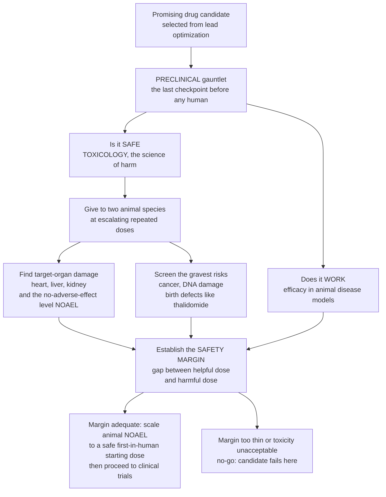

# 🧪 Preclinical Development and Toxicology

> [!abstract] TL;DR
> Before any experimental drug is allowed near a human being, it must survive a rigorous laboratory-and-animal safety gauntlet called **preclinical development**. The goal is to answer two questions with experiments: does the molecule **work** (efficacy in disease models), and — far more important at this stage — is it **safe enough** to justify a first human dose? This is the domain of **toxicology**: give the drug to animal species at escalating doses to find what organ damage it causes and at what level (the **NOAEL**, the no-observed-adverse-effect level), screen for the gravest risks (**cancer**, **DNA damage**, **birth defects** — the lesson seared into medicine by the **thalidomide** tragedy), and quantify the **safety margin** — the gap between the dose expected to help a patient and the dose that harms animals — which must be comfortable enough to proceed. Preclinical development is medicine's ethical firewall, and it is why turning a promising molecule into an approved trial takes so long and so much rigor.

---

## Intuition

**Analogy — the last checkpoint before the leap to people.** Imagine a new bridge that has never carried traffic. Before you let a single human being drive across, you load it with escalating weights — sandbags, then trucks — and watch for the first crack, the first bolt to strain, the first girder to bend. You are not trying to use the bridge; you are trying to *find where it breaks* so you know how much margin sits between an ordinary car and catastrophe. Only when that margin is comfortably wide do you open the road.

Preclinical toxicology is exactly this stress test, applied to a drug rather than a bridge. Scientists give an experimental molecule to laboratory animals at doses climbing far above the level expected to help a patient, and they watch — carefully, systematically — for the first sign of harm: which organ gives way first (the heart, liver, and kidneys are the usual suspects), at what dose, and whether the damage heals when the drug is stopped. They also hunt for the truly terrifying, invisible risks that a single dose might never reveal — does it seed **cancer** years later, scramble **DNA**, or deform a developing fetus? The whole exercise exists to measure one number before anyone takes the drug: the **safety margin** between the dose that helps and the dose that hurts. If that gap is wide enough, the bridge opens to its first human traffic. If not, the candidate fails here — and that is preclinical development working exactly as intended, protecting the first people to ever receive the drug.

---

## How It Works

### Core Mechanics

1. **Where it sits in the pipeline.** Preclinical development is the stage between choosing a drug **candidate** (the end of lead optimization) and the first human trial. In regulatory terms these are the **IND-enabling studies** — the package of data a sponsor must file to earn permission (an Investigational New Drug application) to dose humans.
2. **Confirm efficacy in models.** Demonstrate the molecule actually treats the disease in relevant **animal or cell models** — that its mechanism translates from a target on a plate to a living, diseased organism.
3. **Characterize PK/ADME and PD in animals.** Measure absorption, distribution, metabolism, and excretion (pharmacokinetics) and the concentration-effect relationship (pharmacodynamics), so the *exposure* the body actually sees — not just the dose swallowed — is understood before humans are involved.
4. **Assess safety — the core of the exercise.** Run **dose-ranging** and then **repeated-dose** toxicity studies in (usually two) mammalian species to locate the **NOAEL** (No Observed Adverse Effect Level — the highest dose that causes no harmful effect) and identify **target-organ toxicity** (cardiac including the **hERG channel / QT prolongation**, hepatic, renal, and others). The gap between the harmful dose and the intended therapeutic dose is the **safety margin**.
5. **Run the specialized batteries.** Screen for the gravest, most feared harms: **genotoxicity / mutagenicity** (does it damage DNA — the **Ames test** and chromosome assays), **carcinogenicity** (long-term cancer studies), **reproductive and developmental toxicity / teratogenicity** (does it cause birth defects — the **thalidomide** lesson), **safety pharmacology** (acute effects on the cardiovascular, CNS, and respiratory systems), and **immunotoxicity**, all paired with **toxicokinetics** (the exposure at which the toxicity appears).
6. **Translate to a safe human dose.** Use **allometric scaling** and PK/PD modeling to convert the animal NOAEL into a **Human Equivalent Dose**, then divide by a **safety factor** (typically 10-fold) to set the **Maximum Recommended Starting Dose** for the first-in-human trial — or, for potent biologics, use **MABEL** (the Minimal Anticipated Biological Effect Level).
7. **Make the go / no-go decision.** If the safety margin is adequate and toxicity acceptable, the sponsor files for clinical trials. If toxicity is unacceptable or the margin too thin, the candidate dies here — and much attrition happens at exactly this gate, all under **GLP** (Good Laboratory Practice) standards.

### Flow / Architecture



---

## Key Concepts

**Secondary (the big picture).** Before a brand-new drug is ever given to a person, scientists test it on cells and animals to make sure it is safe enough. They give it at higher and higher doses to see what it damages and at what level — the biggest dose that causes **no harm** is called the **NOAEL**. They especially look for the scariest problems: does it cause **cancer**, damage **DNA**, or harm an unborn baby (the disaster that made everyone cautious was **thalidomide**, a drug that caused terrible birth defects in the 1960s). Then they measure the **safety margin** — how big a gap there is between the dose that should help a patient and the dose that hurts animals. Only if that gap is wide enough is the drug allowed into a human trial. This is why making a new medicine is so slow and careful: it is protecting the first people who ever take it.

**Undergraduate (the machinery).** Preclinical (nonclinical) development is the **IND-enabling** phase. Core toxicology runs **single-dose** then **repeated-dose** studies in two species (one rodent, one non-rodent) to establish the **NOAEL** and the **LOAEL** (Lowest Observed Adverse Effect Level) and to characterize **target-organ toxicity** and its **reversibility**. Endpoints span clinical observations, body/organ weights, clinical chemistry and hematology, and histopathology. The **specialized batteries** follow the ICH structure: **genotoxicity** (bacterial reverse-mutation / **Ames test**, in-vitro chromosome damage, in-vivo micronucleus), **safety pharmacology** (the ICH S7 core battery — cardiovascular including **hERG**/QT, CNS, respiratory), **carcinogenicity** (2-year rodent bioassays for chronic-use drugs), and **reproductive & developmental toxicity** (DART / segment studies covering fertility, embryo-fetal development, and pre/postnatal development). **Toxicokinetics** links the toxic effect to systemic **exposure** (Cmax, AUC) rather than administered dose. The human starting dose is derived by **allometric scaling** of the animal NOAEL to a **Human Equivalent Dose (HED)** using body-surface-area conversion, then applying a **safety factor** (default ~10) to obtain the **MRSD**. All pivotal safety studies run under **GLP**.

**Graduate (the subtleties and limits).** The central problem is **species translation**: animal toxicology has imperfect predictivity, and the failures that reach the clinic are the ones the models missed. The **hERG**/QT liability drove entire drug classes off the market (terfenadine, cisapride) and reshaped safety pharmacology (ICH S7B / the CiPA initiative). Biologics broke the small-molecule playbook: because a superagonist antibody's effect can be species-specific and steeply nonlinear, the NOAEL-plus-safety-factor approach can catastrophically underestimate risk — the **TGN1412** first-in-human disaster (2006) directly motivated the shift to **MABEL** for high-risk biologics, dosing to the minimal *pharmacologically active* exposure rather than the maximal *tolerated* one. **Idiosyncratic** and **delayed** toxicities (immune-mediated hepatotoxicity, the **fialuridine** mitochondrial catastrophe) are, by definition, not captured by standard dose-response designs. The **safety margin** itself is only as trustworthy as the curves behind it — a steep toxicity slope, an active human-specific metabolite, or a toxicity that appears only after chronic exposure can make a comfortable-looking margin illusory (a caution that mirrors the therapeutic-index limits explored in the dose-response note). Finally, the field is being reshaped by the **3Rs** (Replacement, Reduction, Refinement): **in-silico** structure-based toxicity prediction, **in-vitro** high-throughput screens, and **organoids / organ-on-chip** microphysiological systems increasingly supplement — and, under the 2022 FDA Modernization Act, may partly replace — animal testing, while never fully escaping the need to observe a whole, integrated organism before the first human dose.

---

## Python Demo

```python
# Preclinical toxicology in three pictures:
#   (a) DOSE-TOXICITY & SAFETY MARGIN -- an animal dose-toxicity curve locating the
#       NOAEL (no-observed-adverse-effect level) and the toxic threshold (LOAEL),
#       alongside the anticipated efficacious dose, and the SAFETY MARGIN between them.
#   (b) ORGAN-TOXICITY PROFILE -- the dose at which each organ system first shows harm;
#       the LOWEST such dose is the dose-limiting toxicity (DLT) that caps dosing.
#   (c) ALLOMETRIC HUMAN-DOSE SCALING -- converting an animal NOAEL to a Human
#       Equivalent Dose and then a safe first-in-human starting dose (MRSD) via a
#       safety factor, picking the MOST CONSERVATIVE species. numpy + matplotlib only.
import numpy as np
import matplotlib.pyplot as plt

def tox_incidence(dose, td50, slope):
    """Fraction of animals showing an adverse effect (0..1) at a given dose."""
    return 1.0 / (1.0 + np.exp(-slope * (np.log10(dose) - np.log10(td50))))

# ---------------- (a) dose-toxicity curve + safety margin ----------------
dose = np.logspace(0, 3.2, 600)          # mg/kg in the animal study, log-spaced
tox  = tox_incidence(dose, td50=400.0, slope=7.0)

efficacious = 10.0    # anticipated efficacious dose (from PK/PD in models)
NOAEL       = 100.0   # highest dose with NO adverse effect
LOAEL       = 180.0   # lowest dose WITH an adverse effect (toxic threshold)
safety_margin = NOAEL / efficacious       # gap that must be comfortably > 1

# ---------------- (b) organ-toxicity profile ----------------
organs      = ["Cardiac\n(hERG/QT)", "Liver", "Kidney", "Bone\nmarrow", "CNS", "GI\ntract"]
onset_dose  = [90.0, 140.0, 220.0, 260.0, 340.0, 500.0]   # dose of first adverse effect
dlt_idx     = int(np.argmin(onset_dose))                   # dose-limiting toxicity

# ---------------- (c) allometric animal -> human dose scaling ----------------
# FDA body-surface-area method: HED(mg/kg) = animal NOAEL(mg/kg) * (Km_animal / Km_human)
Km_human = 37.0
species  = ["Rat",   "Dog"]
noael_sp = [50.0,    18.0]          # species NOAELs (mg/kg)
Km_sp    = [6.0,     20.0]          # body-surface-area Km factors
HED      = [n * (k / Km_human) for n, k in zip(noael_sp, Km_sp)]
HED_min  = min(HED)                 # MOST CONSERVATIVE human-equivalent dose
safety_factor = 10.0
MRSD_mgkg = HED_min / safety_factor                 # max recommended starting dose
MRSD_total = MRSD_mgkg * 60.0                        # for a 60 kg adult (mg)

fig, ax = plt.subplots(1, 3, figsize=(17, 5.2))

# Panel (a)
ax[0].plot(dose, tox, color="tab:red", lw=2.4, label="Toxicity incidence (animals)")
ax[0].fill_betweenx([0, 1], efficacious, NOAEL, color="gold", alpha=0.30,
                    label="Safety margin")
ax[0].axvline(efficacious, color="tab:green", ls="--", lw=1.8)
ax[0].axvline(NOAEL, color="tab:blue", ls="--", lw=1.8)
ax[0].axvline(LOAEL, color="darkred", ls=":", lw=1.8)
ax[0].text(efficacious, 1.02, "Efficacious\ndose", color="tab:green",
           ha="center", fontsize=8)
ax[0].text(NOAEL, 1.02, "NOAEL", color="tab:blue", ha="center", fontsize=8)
ax[0].text(LOAEL, 0.55, "LOAEL\n(toxic\nthreshold)", color="darkred",
           ha="left", fontsize=7.5)
ax[0].set_xscale("log")
ax[0].set_xlabel("Dose in animal study (mg/kg, log scale)")
ax[0].set_ylabel("Fraction of animals harmed")
ax[0].set_title(f"(a) Dose-toxicity & safety margin\nNOAEL/efficacious = {safety_margin:.0f}x gap")
ax[0].set_ylim(0, 1.12)
ax[0].legend(loc="center left", fontsize=8)

# Panel (b)
bar_colors = ["tab:red" if i == dlt_idx else "tab:blue" for i in range(len(organs))]
ax[1].bar(organs, onset_dose, color=bar_colors)
ax[1].axhline(onset_dose[dlt_idx], color="tab:red", ls="--", alpha=0.7)
ax[1].text(dlt_idx, onset_dose[dlt_idx] + 15,
           "Dose-limiting\ntoxicity", color="tab:red", ha="center", fontsize=8)
ax[1].set_ylabel("Dose of first adverse effect (mg/kg)")
ax[1].set_title("(b) Target-organ profile\nlowest threshold caps the dose")
ax[1].tick_params(axis="x", labelsize=8)

# Panel (c)
stages = ["Rat\nNOAEL", "Dog\nNOAEL", "HED\n(rat, min)", "MRSD\n(HED / 10)"]
vals   = [noael_sp[0], noael_sp[1], HED_min, MRSD_mgkg]
c_col  = ["tab:blue", "tab:blue", "tab:orange", "tab:green"]
bars = ax[2].bar(stages, vals, color=c_col)
for b, v in zip(bars, vals):
    ax[2].text(b.get_x() + b.get_width()/2, v + 0.7, f"{v:.1f}", ha="center", fontsize=8)
ax[2].set_ylabel("Dose (mg/kg)")
ax[2].set_title("(c) Animal NOAEL -> safe human starting dose\n(most conservative species, x10 safety factor)")

plt.tight_layout()
plt.show()

print(f"(a) safety margin  = NOAEL {NOAEL:.0f} / efficacious {efficacious:.0f} = {safety_margin:.0f}x")
print(f"(b) dose-limiting toxicity = {organs[dlt_idx].splitlines()[0]} at {onset_dose[dlt_idx]:.0f} mg/kg")
print(f"(c) HED per species (mg/kg): " + ", ".join(f"{s}={h:.2f}" for s, h in zip(species, HED)))
print(f"(c) conservative HED = {HED_min:.2f} mg/kg -> MRSD = {MRSD_mgkg:.2f} mg/kg "
      f"= {MRSD_total:.0f} mg total for a 60 kg adult")
```

**What to notice.** *Panel (a)* is the whole logic of the field in one axis: the toxicity curve climbs with dose, the **NOAEL** marks the highest harmless dose, the **LOAEL** the first dose that harms, and the gold band is the **safety margin** — here the NOAEL sits 10x above the anticipated efficacious dose, a comfortable gap. *Panel (b)* shows that toxicity is not one number but a *profile* across organs; the cardiac (hERG/QT) system gives way first, so it is the **dose-limiting toxicity** that caps how high anyone can dose. *Panel (c)* traces how a first-in-human dose is actually born: each animal NOAEL is scaled to a **Human Equivalent Dose** by body-surface-area allometry, the **most conservative** species is chosen, and a 10-fold **safety factor** is applied — turning a 50 mg/kg rat NOAEL into a starting dose of well under 1 mg/kg for the first person ever dosed.

---

## Real-World Applications

> **Example — thalidomide and the birth of reproductive toxicology.** In the late 1950s and early 1960s thalidomide, marketed for morning sickness, caused thousands of babies to be born with severe limb malformations (phocomelia). The catastrophe happened partly because developmental toxicity was not systematically tested. It reshaped drug regulation worldwide — the U.S. 1962 Kefauver-Harris Amendment and the modern requirement for **reproductive and developmental toxicity (teratogenicity)** studies — and remains the reason every preclinical program screens for birth defects before a drug can reach women of childbearing potential.

> **Example — hERG / QT and cardiac safety pharmacology.** The antihistamine terfenadine (Seldane) and the prokinetic cisapride were withdrawn after they were found to block the cardiac **hERG** potassium channel, prolong the QT interval, and trigger the lethal arrhythmia torsades de pointes — especially when a metabolism-blocking drug raised their levels. These disasters made **hERG screening and QT assessment** a mandatory early gate (ICH S7B, and the newer CiPA framework), so cardiac liability is now caught in the lab rather than the clinic.

> **Example — TGN1412 and the move to MABEL.** In 2006 a first-in-human trial of the superagonist antibody TGN1412 gave six healthy volunteers a dose scaled the traditional way (a fraction of the animal NOAEL); all six suffered a near-fatal cytokine storm. The animal models had not predicted the human immune response. The tragedy drove the adoption of **MABEL** — the Minimal Anticipated Biological Effect Level — for high-risk biologics, deriving the starting dose from the *minimal pharmacologically active* exposure rather than the maximal tolerated one.

> **Example — the Ames test as a fast genotoxicity screen.** Bruce Ames's bacterial reverse-mutation assay lets a lab flag whether a compound is **mutagenic** (damages DNA) in days rather than the years a cancer bioassay takes, using *Salmonella* strains that revert to growth only if the chemical causes mutations. A positive Ames result is an early, cheap warning that a candidate may be carcinogenic — an efficient filter that removes hazardous molecules before expensive long-term studies.

> **Example — organ-on-chip and the 3Rs.** Microphysiological "**organ-on-chip**" systems (liver-, heart-, kidney-chips seeded with human cells) reproduce organ-level toxicity responses in vitro, letting sponsors detect human-relevant hepatotoxicity or cardiotoxicity that animal models can miss — part of the **Reduce, Refine, Replace** effort that the 2022 FDA Modernization Act formally opened the door to as an alternative to some animal testing.

---

## Common Pitfalls

- **Trusting animal predictivity blindly.** Species differ in metabolism, immunology, and target biology; the toxicities that reach patients are precisely the ones the animal models missed (TGN1412, fialuridine). A clean animal package reduces but never eliminates human risk — which is exactly why first-in-human trials start at a tiny, safety-factored dose.
- **Confusing NOAEL with LOAEL — or with "safe."** The NOAEL is the highest dose with *no* observed adverse effect; the LOAEL is the *lowest* dose that shows one. Neither is a human dose. The NOAEL is a *starting point* for scaling, and it depends entirely on the doses actually tested and the endpoints measured — a NOAEL from a study that never looked for a given harm is not reassurance about that harm.
- **Reading a comfortable safety margin as a guarantee.** A wide NOAEL-to-efficacious gap can be illusory if the toxicity curve is steep, if a human-specific active metabolite exists, or if the harm only appears after chronic exposure. The margin is only as trustworthy as the curves and endpoints behind it.
- **Skipping or under-powering the specialized batteries.** Genotoxicity, carcinogenicity, and developmental toxicity capture harms (cancer, DNA damage, birth defects) that repeated-dose studies are not designed to see. The thalidomide legacy is the permanent reminder that a drug tolerated by an adult can devastate a fetus.
- **Applying the small-molecule scaling recipe to biologics.** NOAEL-plus-safety-factor can dramatically underestimate the risk of an immunostimulatory or superagonist biologic; MABEL and receptor-occupancy modeling exist precisely because dose scaled to *tolerability* is the wrong anchor when the biology is steep and species-specific.
- **Treating in-vitro or in-silico screens as full replacements today.** In-silico prediction, high-throughput assays, and organoids are powerful filters and are advancing fast, but standard practice still requires observing an integrated whole organism before the first human dose; the 3Rs *refine and reduce* animal use rather than instantly eliminating it.
- **Reading this as medical or dosing advice.** This note explains the **science** of how drug safety is established before human testing. It is educational content, **not** guidance for any individual's treatment, medication, or dose, which always depends on a clinician and a specific patient.

---

## Related Concepts

**Within this vault (Section 04 and beyond, prose references).** Preclinical development is one stage of the larger arc that *The Drug Discovery Pipeline* lays out end to end — it receives the optimized molecule from *Lead Optimization and Medicinal Chemistry* and, if the safety margin holds, hands a safe first-in-human dose to *Clinical Trials and Drug Approval*, the human-testing phase that follows. Its intellectual core is *Toxicology and Poisoning* (the systematic science of harm applied to xenobiotics), and its central quantitative idea — the gap between a helpful and a harmful dose — is the same **safety margin / therapeutic index** developed in *Dose-Response and Therapeutic Index*. These are sibling notes within the Pharmacology vault, referenced here in prose.

**Across the vault (Glob-verified links).**

- [[Health_Nutrition_and_Longevity/06_Public_Health_and_Prevention/Environmental_Health_and_Toxicology|Environmental Health and Toxicology]] — the broader toxicology home of "the dose makes the poison," NOAEL, LD50, and the uncertainty/safety-factor logic that preclinical drug testing shares.
- [[Clinical_Medicine/06_Clinical_Reasoning_and_Modern_Medicine/Evidence_Based_Medicine_and_Clinical_Trials|Evidence-Based Medicine and Clinical Trials]] — the next stage: once preclinical safety justifies a first human dose, efficacy and safety are proven in phased human trials.
- [[Clinical_Medicine/01_Foundations_of_Disease_and_Pathophysiology/Genetic_and_Congenital_Disease|Genetic and Congenital Disease]] — the congenital malformations that teratogens like thalidomide cause, and why developmental toxicity screening exists.
- [[Biology/04_Molecular_Biology_of_the_Gene/Mutations_and_DNA_Repair|Mutations and DNA Repair]] — the DNA damage that genotoxicity/mutagenicity testing (the Ames test) is designed to detect, and its link to carcinogenicity.
- [[Biology/12_Developmental_Biology/Embryonic_Development_and_Gastrulation|Embryonic Development and Gastrulation]] — the vulnerable developmental windows that make an embryo exquisitely sensitive to a teratogen, the biology behind reproductive toxicity studies.

---

## Review Questions

1. **(Secondary)** Using the bridge stress-test analogy, explain why scientists deliberately give a new drug to animals at doses *higher* than the dose expected to help a patient. What is the "safety margin," and why must it be wide before the first human takes the drug?
2. **(Secondary)** What lesson did the thalidomide tragedy teach drug developers, and how does modern preclinical testing try to make sure it never happens again?
3. **(Undergraduate)** Distinguish the **NOAEL** from the **LOAEL**, and explain how each is determined in a repeated-dose toxicity study. Why is the NOAEL — not the LOAEL — the usual anchor for deriving a human starting dose?
4. **(Undergraduate)** Name the four specialized toxicology batteries beyond repeated-dose testing (genotoxicity, carcinogenicity, reproductive/developmental toxicity, safety pharmacology) and state, for each, the specific class of harm it is designed to catch. Which one would the Ames test belong to, and what does a positive result warn you about?
5. **(Graduate)** A candidate shows a 20-fold safety margin between its animal NOAEL and its anticipated efficacious dose, yet you remain uneasy. Give three distinct reasons a comfortable margin can still be misleading, and explain how each would change your go/no-go judgment.
6. **(Graduate)** The traditional NOAEL-plus-safety-factor approach to setting a first-in-human dose failed catastrophically for the biologic TGN1412. Explain *why* it failed for that class of drug, and describe how **MABEL** derives a starting dose differently and why that is safer for an immunostimulatory superagonist.

---

## Sources

- Klaassen, C. D. (ed.). *Casarett & Doull's Toxicology: The Basic Science of Poisons* (McGraw-Hill) — dose-response, NOAEL/LOAEL, target-organ toxicity, genotoxicity, carcinogenicity, and developmental toxicology.
- ICH Harmonised Guidelines — **M3(R2)** (nonclinical safety studies to support clinical trials), the **S-series** preclinical safety guidelines (S1 carcinogenicity, S2 genotoxicity, S5 reproductive toxicity, S6 biotechnology-derived products, S7 safety pharmacology).
- U.S. FDA, *Guidance for Industry: Estimating the Maximum Safe Starting Dose in Initial Clinical Trials for Therapeutics in Adult Healthy Volunteers* (2005) — allometric HED conversion, safety factors, and the pharmacologically-active-dose / MABEL approach.
- Rang, H. P.; Ritter, J. M.; Flower, R. J.; Henderson, G. *Rang and Dale's Pharmacology* — chapter on **Drug Discovery and Development** (preclinical testing, toxicology, and the path to first-in-human).

---

#pharmacology #preclinical #toxicology #safety-margin #drug-development
